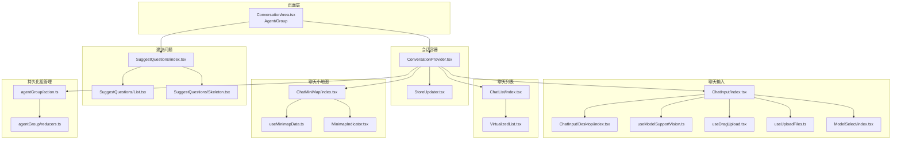
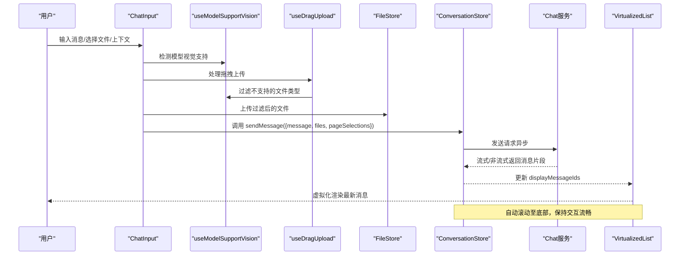
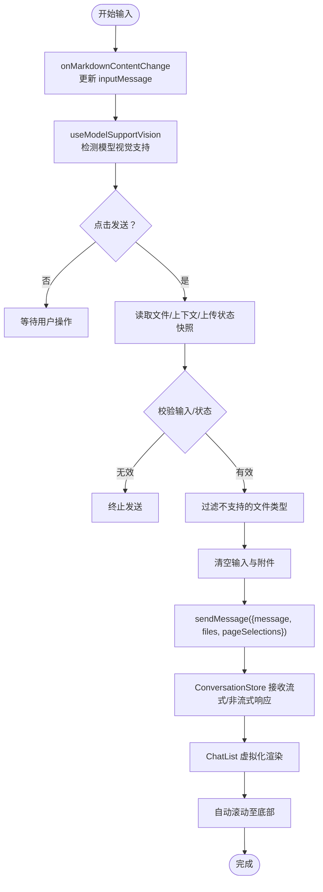
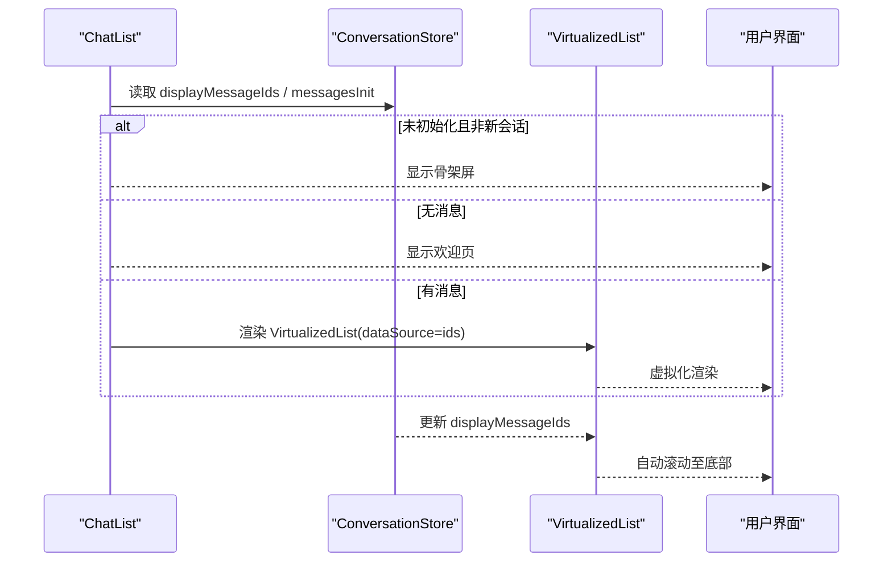
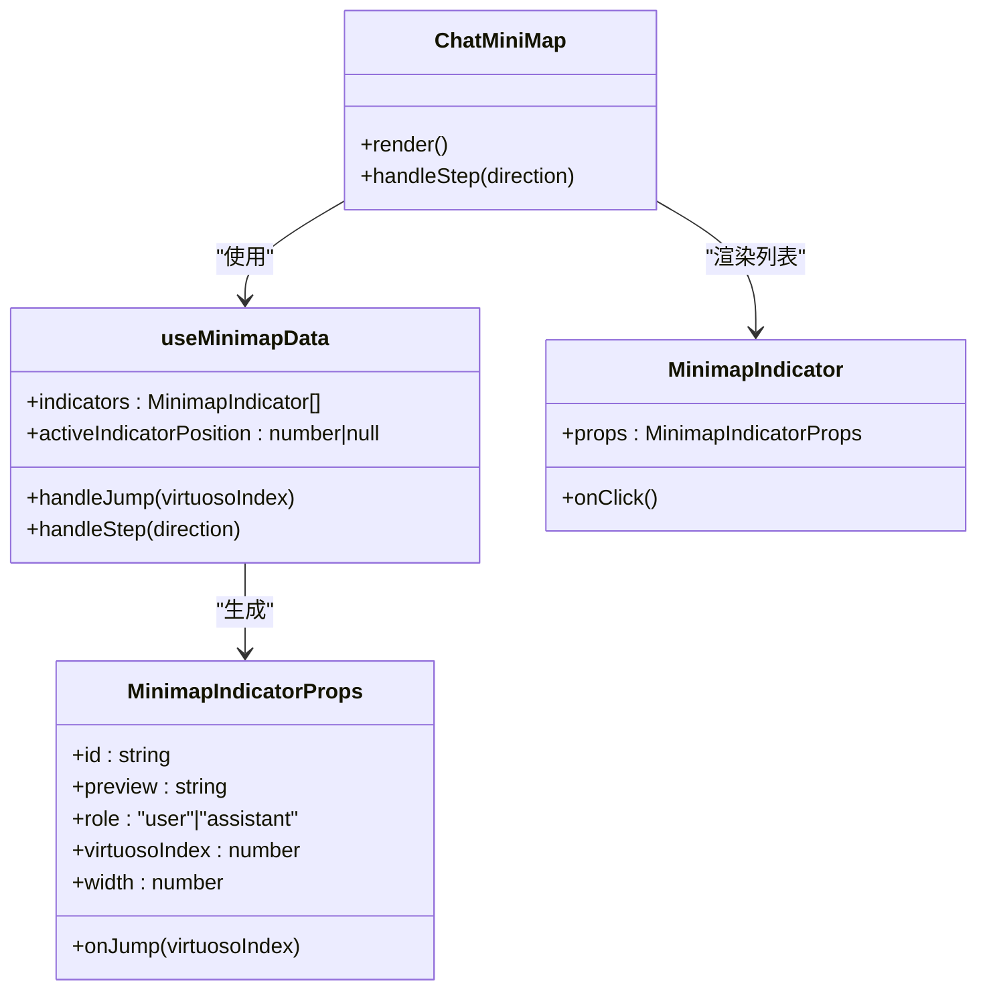
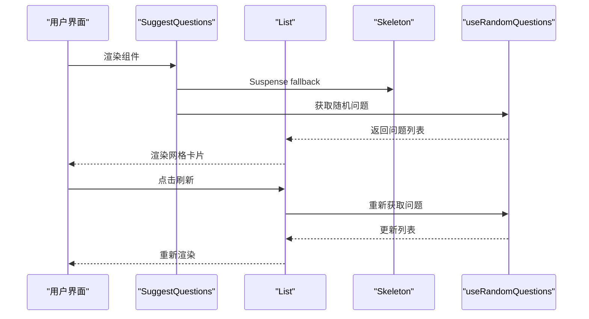
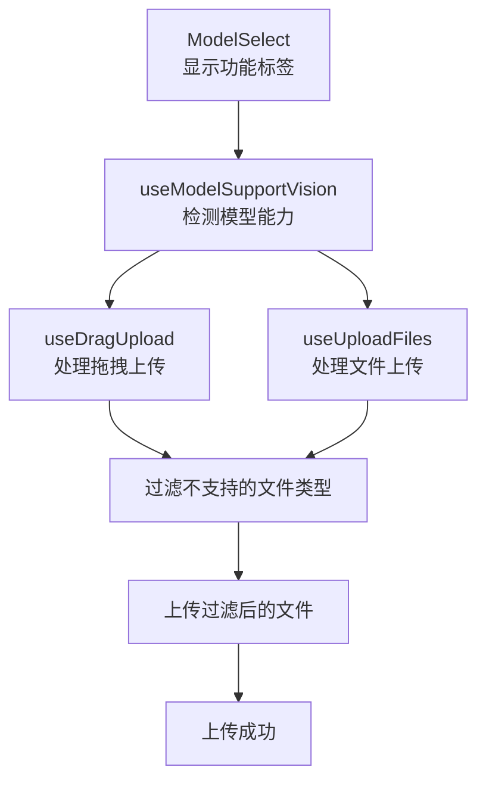
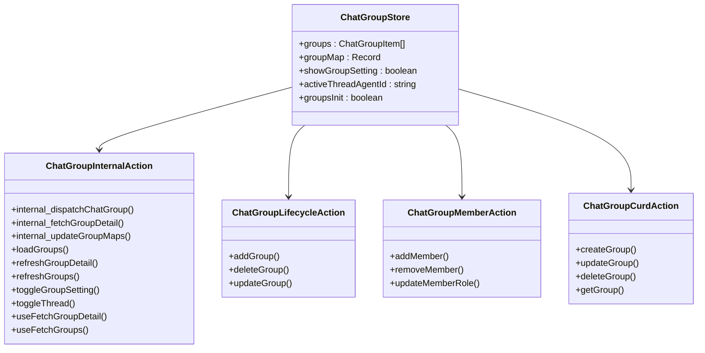
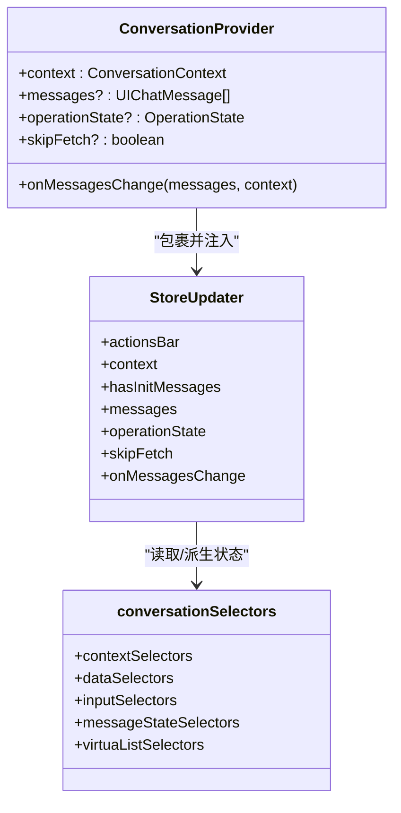
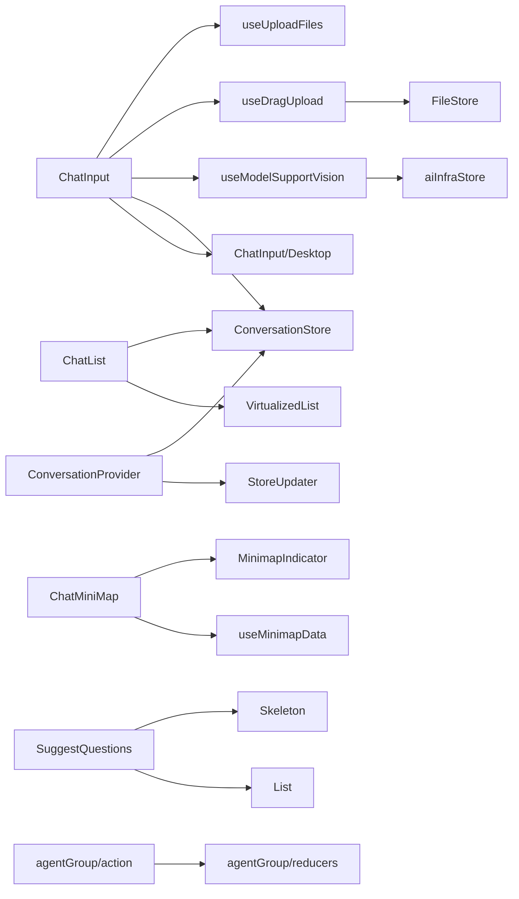

# 聊天交互组件

<cite>
**本文引用的文件**
- [src/features/Conversation/ChatInput/index.tsx](file://src/features/Conversation/ChatInput/index.tsx)
- [src/features/ChatInput/Desktop/index.tsx](file://src/features/ChatInput/Desktop/index.tsx)
- [src/features/Conversation/ChatList/index.tsx](file://src/features/Conversation/ChatList/index.tsx)
- [src/features/Conversation/ChatList/components/VirtualizedList.tsx](file://src/features/Conversation/ChatList/components/VirtualizedList.tsx)
- [src/features/ChatMiniMap/index.tsx](file://src/features/ChatMiniMap/index.tsx)
- [src/features/ChatMiniMap/MinimapIndicator.tsx](file://src/features/ChatMiniMap/MinimapIndicator.tsx)
- [src/features/ChatMiniMap/useMinimapData.ts](file://src/features/ChatMiniMap/useMinimapData.ts)
- [src/features/ChatMiniMap/types.ts](file://src/features/ChatMiniMap/types.ts)
- [src/features/SuggestQuestions/index.tsx](file://src/features/SuggestQuestions/index.tsx)
- [src/features/SuggestQuestions/List.tsx](file://src/features/SuggestQuestions/List.tsx)
- [src/features/SuggestQuestions/Skeleton.tsx](file://src/features/SuggestQuestions/Skeleton.tsx)
- [src/features/Conversation/ConversationProvider.tsx](file://src/features/Conversation/ConversationProvider.tsx)
- [src/features/Conversation/store/selectors.ts](file://src/features/Conversation/store/selectors.ts)
- [src/features/Conversation/store/slices/input/initialState.ts](file://src/features/Conversation/store/slices/input/initialState.ts)
- [src/routes/(main)/agent/features/Conversation/ConversationArea.tsx](file://src/routes/(main)/agent/features/Conversation/ConversationArea.tsx)
- [src/routes/(main)/group/features/Conversation/ConversationArea.tsx](file://src/routes/(main)/group/features/Conversation/ConversationArea.tsx)
- [src/routes/(main)/group/_layout/RegisterHotkeys.tsx](file://src/routes/(main)/group/_layout/RegisterHotkeys.tsx)
- [src/routes/(main)/agent/_layout/RegisterHotkeys.tsx](file://src/routes/(main)/agent/_layout/RegisterHotkeys.tsx)
- [src/hooks/useHotkeys/chatScope.ts](file://src/hooks/useHotkeys/chatScope.ts)
- [src/hooks/useModelSupportVision.ts](file://src/hooks/useModelSupportVision.ts)
- [src/components/DragUpload/useDragUpload.tsx](file://src/components/DragUpload/useDragUpload.tsx)
- [src/components/DragUploadZone/useUploadFiles.ts](file://src/components/DragUploadZone/useUploadFiles.ts)
- [src/components/ModelSelect/index.tsx](file://src/components/ModelSelect/index.tsx)
- [src/store/agentGroup/action.ts](file://src/store/agentGroup/action.ts)
- [src/store/agentGroup/reducers.ts](file://src/store/agentGroup/reducers.ts)
- [src/components/LabsModal/Hero.tsx](file://src/components/LabsModal/Hero.tsx)
- [apps/mobile/src/components/ui/HeroComposer.tsx](file://apps/mobile/src/components/ui/HeroComposer.tsx)
</cite>

## 更新摘要

**所做更改**

- 增强了模型视觉支持检测功能，改进了动态文件附件选项调整
- 扩展了持久化组状态管理，增强了聊天组合器集成
- 新增了视觉支持检测的完整实现和相关组件

## 目录

1. [简介](#简介)
2. [项目结构](#项目结构)
3. [核心组件](#核心组件)
4. [架构总览](#架构总览)
5. [组件详解](#组件详解)
6. [依赖关系分析](#依赖关系分析)
7. [性能考量](#性能考量)
8. [故障排查指南](#故障排查指南)
9. [结论](#结论)
10. [附录：使用示例与最佳实践](#附录使用示例与最佳实践)

## 简介

本文件系统性梳理 LobeHub 项目中的聊天交互组件，重点覆盖以下模块：

- 聊天输入组件（ChatInput）：负责用户输入、发送控制、文件 / 上下文附件、错误提示与快捷键集成
- 对话列表组件（ChatList + VirtualizedList）：负责消息渲染、虚拟化滚动、自动回到底部、骨架屏与欢迎页
- 聊天小地图组件（ChatMiniMap）：负责消息快速跳转与导航指示
- 建议问题组件（SuggestQuestions）：负责首页 / 输入区的 "建议问题" 推荐与刷新
- 视觉支持检测系统：基于模型能力的动态文件附件选项调整
- 持久化组状态管理：增强的聊天组合器集成与状态同步
- 状态管理与数据流：ConversationProvider 隔离上下文、ConversationStore 管理状态、与全局 ChatStore 的桥接
- 事件与交互：键盘快捷键、滚动策略、实时更新与消息同步

## 项目结构

围绕聊天交互的核心目录与文件如下：

- 输入与编辑：features/ChatInput（桌面端输入、动作栏、发送区域）
- 会话容器与状态：features/Conversation（ConversationProvider、StoreUpdater、store 选择器）
- 列表与虚拟化：features/Conversation/ChatList 及其子组件 VirtualizedList
- 小地图：features/ChatMiniMap（指标、数据钩子、样式）
- 建议问题：features/SuggestQuestions（列表、骨架屏、随机问题钩子）
- 视觉支持检测：hooks/useModelSupportVision、components/DragUpload、components/DragUploadZone
- 组状态管理：store/agentGroup（action、reducers、selectors）
- 页面集成：routes 下的 ConversationArea 使用上述组件构建完整聊天界面

**图表来源**

- [src/routes/(main)/agent/features/Conversation/ConversationArea.tsx](<file://src/routes/(main)/agent/features/Conversation/ConversationArea.tsx#L33-L86>)
- [src/routes/(main)/group/features/Conversation/ConversationArea.tsx](<file://src/routes/(main)/group/features/Conversation/ConversationArea.tsx#L34-L88>)
- [src/features/Conversation/ConversationProvider.tsx:66-113](file://src/features/Conversation/ConversationProvider.tsx#L66-L113)
- [src/features/Conversation/ChatInput/index.tsx:79-219](file://src/features/Conversation/ChatInput/index.tsx#L79-L219)
- [src/features/ChatInput/Desktop/index.tsx:142-168](file://src/features/ChatInput/Desktop/index.tsx#L142-L168)
- [src/features/Conversation/ChatList/index.tsx:32-103](file://src/features/Conversation/ChatList/index.tsx#L32-L103)
- [src/features/Conversation/ChatList/components/VirtualizedList.tsx:1-189](file://src/features/Conversation/ChatList/components/VirtualizedList.tsx#L1-L189)
- [src/features/ChatMiniMap/index.tsx:1-69](file://src/features/ChatMiniMap/index.tsx#L1-L69)
- [src/features/ChatMiniMap/useMinimapData.ts:1-42](file://src/features/ChatMiniMap/useMinimapData.ts#L1-L42)
- [src/features/ChatMiniMap/MinimapIndicator.tsx:1-64](file://src/features/ChatMiniMap/MinimapIndicator.tsx#L1-L64)
- [src/features/SuggestQuestions/index.tsx:1-27](file://src/features/SuggestQuestions/index.tsx#L1-L27)
- [src/features/SuggestQuestions/List.tsx:1-52](file://src/features/SuggestQuestions/List.tsx#L1-L52)
- [src/features/SuggestQuestions/Skeleton.tsx:1-28](file://src/features/SuggestQuestions/Skeleton.tsx#L1-L28)
- [src/hooks/useModelSupportVision.ts:1-6](file://src/hooks/useModelSupportVision.ts#L1-L6)
- [src/components/DragUpload/useDragUpload.tsx:1-186](file://src/components/DragUpload/useDragUpload.tsx#L1-L186)
- [src/components/DragUploadZone/useUploadFiles.ts:1-41](file://src/components/DragUploadZone/useUploadFiles.ts#L1-L41)
- [src/components/ModelSelect/index.tsx:116-166](file://src/components/ModelSelect/index.tsx#L116-L166)
- [src/store/agentGroup/action.ts:1-278](file://src/store/agentGroup/action.ts#L1-L278)
- [src/store/agentGroup/reducers.ts:1-77](file://src/store/agentGroup/reducers.ts#L1-L77)

**章节来源**

- [src/features/Conversation/ChatInput/index.tsx:1-220](file://src/features/Conversation/ChatInput/index.tsx#L1-L220)
- [src/features/Conversation/ChatList/index.tsx:1-104](file://src/features/Conversation/ChatList/index.tsx#L1-L104)
- [src/features/ChatMiniMap/index.tsx:1-70](file://src/features/ChatMiniMap/index.tsx#L1-L70)
- [src/features/SuggestQuestions/index.tsx:1-28](file://src/features/SuggestQuestions/index.tsx#L1-L28)
- [src/features/Conversation/ConversationProvider.tsx:1-114](file://src/features/Conversation/ConversationProvider.tsx#L1-L114)

## 核心组件

- 聊天输入组件（ChatInput）
  - 功能：接收用户输入、管理发送按钮状态、处理文件 / 上下文附件、错误提示、快捷键注册
  - 关键点：基于 ConversationStore 的输入状态；调用 sendMessage；桥接 ChatStore 错误状态
- 对话列表组件（ChatList + VirtualizedList）
  - 功能：消息数据获取与渲染、骨架屏、欢迎页、虚拟化列表、自动回到底部、滚动锚定
  - 关键点：使用 ConversationStore 的 displayMessageIds；通过 Virtua 实现高性能虚拟滚动
- 聊天小地图组件（ChatMiniMap）
  - 功能：根据消息内容生成指示条，支持点击跳转与上下翻页
  - 关键点：useMinimapData 计算指标；MinimapIndicator 渲染单个指示器
- 建议问题组件（SuggestQuestions）
  - 功能：首页 / 输入区的 "建议问题" 推荐，支持刷新
  - 关键点：Suspense 骨架屏；随机问题钩子；国际化文案
- 视觉支持检测系统
  - 功能：动态检测模型视觉支持能力，智能过滤文件类型，提供视觉功能标签
  - 关键点：useModelSupportVision hook；DragUpload 和 DragUploadZone 的文件过滤；ModelSelect 的功能标签显示
- 持久化组状态管理
  - 功能：管理聊天组合器的状态，支持组成员管理、生命周期操作、CURD 操作
  - 关键点：ChatGroupInternalAction、ChatGroupLifecycleAction、ChatGroupMemberAction、ChatGroupCurdAction 的组合
- 状态管理（ConversationProvider + Store）
  - 功能：为每个会话上下文创建独立的 ConversationStore 实例，桥接全局 ChatStore 的操作状态

**章节来源**

- [src/features/Conversation/ChatInput/index.tsx:79-219](file://src/features/Conversation/ChatInput/index.tsx#L79-L219)
- [src/features/Conversation/ChatList/index.tsx:32-103](file://src/features/Conversation/ChatList/index.tsx#L32-L103)
- [src/features/Conversation/ChatList/components/VirtualizedList.tsx:1-189](file://src/features/Conversation/ChatList/components/VirtualizedList.tsx#L1-L189)
- [src/features/ChatMiniMap/index.tsx:1-69](file://src/features/ChatMiniMap/index.tsx#L1-L69)
- [src/features/ChatMiniMap/useMinimapData.ts:1-42](file://src/features/ChatMiniMap/useMinimapData.ts#L1-L42)
- [src/features/ChatMiniMap/MinimapIndicator.tsx:1-64](file://src/features/ChatMiniMap/MinimapIndicator.tsx#L1-L64)
- [src/features/SuggestQuestions/index.tsx:1-27](file://src/features/SuggestQuestions/index.tsx#L1-L27)
- [src/features/Conversation/ConversationProvider.tsx:66-113](file://src/features/Conversation/ConversationProvider.tsx#L66-L113)
- [src/hooks/useModelSupportVision.ts:1-6](file://src/hooks/useModelSupportVision.ts#L1-L6)
- [src/components/DragUpload/useDragUpload.tsx:1-186](file://src/components/DragUpload/useDragUpload.tsx#L1-L186)
- [src/components/DragUploadZone/useUploadFiles.ts:1-41](file://src/components/DragUploadZone/useUploadFiles.ts#L1-L41)
- [src/components/ModelSelect/index.tsx:116-166](file://src/components/ModelSelect/index.tsx#L116-L166)
- [src/store/agentGroup/action.ts:1-278](file://src/store/agentGroup/action.ts#L1-L278)
- [src/store/agentGroup/reducers.ts:1-77](file://src/store/agentGroup/reducers.ts#L1-L77)

## 架构总览

聊天交互采用 "会话隔离 + 组件解耦" 的架构：

- ConversationProvider 为每个 context 创建独立的 ConversationStore 实例，避免多会话互相干扰
- ChatList 仅依赖 ConversationStore 的 displayMessageIds 与渲染逻辑，不直接依赖全局 ChatStore
- ChatInput 通过 ConversationStore 的 sendMessage 与状态桥接 ChatStore 的错误信息
- ChatMiniMap 从 ConversationStore 的 displayMessages 中计算指标，提供快速导航
- SuggestQuestions 作为独立 UI 组件，可插入到输入区或首页
- 视觉支持检测系统通过 useModelSupportVision hook 实时检测模型能力，动态调整文件上传行为
- 持久化组状态管理通过 ChatGroupAction 组合多个操作类，提供完整的组管理功能

**图表来源**

- [src/features/Conversation/ChatInput/index.tsx:129-162](file://src/features/Conversation/ChatInput/index.tsx#L129-L162)
- [src/features/Conversation/ChatList/components/VirtualizedList.tsx:1-189](file://src/features/Conversation/ChatList/components/VirtualizedList.tsx#L1-L189)
- [src/features/Conversation/ConversationProvider.tsx:66-113](file://src/features/Conversation/ConversationProvider.tsx#L66-L113)
- [src/hooks/useModelSupportVision.ts:1-6](file://src/hooks/useModelSupportVision.ts#L1-L6)
- [src/components/DragUpload/useDragUpload.tsx:128-133](file://src/components/DragUpload/useDragUpload.tsx#L128-L133)

## 组件详解

### 聊天输入组件（ChatInput）

- 用户交互模式
  - 支持多行输入、@ 提及、动作栏（左侧 / 右侧）、自定义发送菜单
  - 发送按钮禁用条件：输入为空且无文件 / 上下文、正在上传、AI 正在生成
  - 错误提示：当 ChatStore 中存在发送错误时显示告警并可关闭
- 状态管理
  - 读取 ConversationStore 的 agentId、inputMessage、isAIGenerating
  - 写入 ConversationStore 的 editor 实例与 inputMessage
  - 通过 onSend 回调触发 sendMessage，并清空输入与附件
- 数据流与事件处理
  - onMarkdownContentChange 同步输入文本
  - onSend 捕获当前快照（文件列表、上下文、是否上传中），清空后异步发送
  - 与 FileStore 协作，将 ChatContextContent 转换为持久化格式
- 快捷键支持
  - 在布局层注册聊天快捷键，统一处理 Enter/Cmd+Enter 等组合键
- 视觉支持检测集成
  - 通过 useModelSupportVision 检测当前模型的视觉支持能力
  - 在拖拽上传时自动过滤不支持视觉的图片文件
  - 与 ModelSelect 组件协作显示模型功能标签

**图表来源**

- [src/features/Conversation/ChatInput/index.tsx:129-162](file://src/features/Conversation/ChatInput/index.tsx#L129-L162)
- [src/features/ChatInput/Desktop/index.tsx:142-168](file://src/features/ChatInput/Desktop/index.tsx#L142-L168)
- [src/hooks/useModelSupportVision.ts:1-6](file://src/hooks/useModelSupportVision.ts#L1-L6)
- [src/components/DragUpload/useDragUpload.tsx:128-133](file://src/components/DragUpload/useDragUpload.tsx#L128-L133)

**章节来源**

- [src/features/Conversation/ChatInput/index.tsx:23-100](file://src/features/Conversation/ChatInput/index.tsx#L23-L100)
- [src/features/Conversation/ChatInput/index.tsx:129-162](file://src/features/Conversation/ChatInput/index.tsx#L129-L162)
- [src/features/ChatInput/Desktop/index.tsx:142-168](file://src/features/ChatInput/Desktop/index.tsx#L142-L168)
- [src/routes/(main)/group/\_layout/RegisterHotkeys.tsx](<file://src/routes/(main)/group/_layout/RegisterHotkeys.tsx#L1-L13>)
- [src/routes/(main)/agent/\_layout/RegisterHotkeys.tsx](<file://src/routes/(main)/agent/_layout/RegisterHotkeys.tsx#L1-L13>)
- [src/hooks/useHotkeys/chatScope.ts](file://src/hooks/useHotkeys/chatScope.ts)
- [src/hooks/useModelSupportVision.ts:1-6](file://src/hooks/useModelSupportVision.ts#L1-L6)
- [src/components/DragUpload/useDragUpload.tsx:128-133](file://src/components/DragUpload/useDragUpload.tsx#L128-L133)

### 对话列表组件（ChatList + VirtualizedList）

- 用户交互模式
  - 首次进入显示骨架屏，消息加载完成后切换为真实内容
  - 无消息时显示欢迎页（如 WelcomeChatItem）
  - 支持禁用消息操作栏（分享页等场景）
- 状态管理与数据流
  - 通过 ConversationStore 的 displayMessageIds 获取渲染列表
  - 使用 Virtua 实现虚拟化，仅渲染可视区域元素
  - 自动滚动至底部，支持 "回到底部" 按钮
- 实时更新策略
  - ChatList 在挂载时触发 useFetchMessages，按需拉取历史消息
  - 新消息到达时由 ConversationStore 更新 displayMessageIds，触发重渲染
- 性能优化
  - 虚拟化列表减少 DOM 数量
  - 仅在必要时渲染欢迎页与骨架屏
  - 通过选择器与浅比较避免无关重渲染

**图表来源**

- [src/features/Conversation/ChatList/index.tsx:37-99](file://src/features/Conversation/ChatList/index.tsx#L37-L99)
- [src/features/Conversation/ChatList/components/VirtualizedList.tsx:1-189](file://src/features/Conversation/ChatList/components/VirtualizedList.tsx#L1-L189)

**章节来源**

- [src/features/Conversation/ChatList/index.tsx:37-99](file://src/features/Conversation/ChatList/index.tsx#L37-L99)
- [src/features/Conversation/ChatList/components/VirtualizedList.tsx:1-189](file://src/features/Conversation/ChatList/components/VirtualizedList.tsx#L1-L189)

### 聊天小地图组件（ChatMiniMap）

- 用户交互模式
  - 鼠标悬停显示上下箭头与消息指示条
  - 点击指示条跳转到对应消息位置
  - 支持 "上一条 / 下一条" 快捷导航
- 状态与数据流
  - useMinimapData 从 ConversationStore 的 displayMessages 计算指标数组
  - MinimapIndicator 渲染单个指示器，包含预览与角色标识
- 实时更新与一致性
  - 当前激活位置与 Virtua 索引映射，确保跳转准确
  - 当消息数量低于阈值时不显示小地图

**图表来源**

- [src/features/ChatMiniMap/index.tsx:1-69](file://src/features/ChatMiniMap/index.tsx#L1-L69)
- [src/features/ChatMiniMap/useMinimapData.ts:1-42](file://src/features/ChatMiniMap/useMinimapData.ts#L1-L42)
- [src/features/ChatMiniMap/MinimapIndicator.tsx:1-64](file://src/features/ChatMiniMap/MinimapIndicator.tsx#L1-L64)
- [src/features/ChatMiniMap/types.ts:1-18](file://src/features/ChatMiniMap/types.ts#L1-L18)

**章节来源**

- [src/features/ChatMiniMap/index.tsx:1-69](file://src/features/ChatMiniMap/index.tsx#L1-L69)
- [src/features/ChatMiniMap/useMinimapData.ts:1-42](file://src/features/ChatMiniMap/useMinimapData.ts#L1-L42)
- [src/features/ChatMiniMap/MinimapIndicator.tsx:1-64](file://src/features/ChatMiniMap/MinimapIndicator.tsx#L1-L64)
- [src/features/ChatMiniMap/types.ts:1-18](file://src/features/ChatMiniMap/types.ts#L1-L18)

### 建议问题组件（SuggestQuestions）

- 用户交互模式
  - 首页 / 输入区展示 "建议问题" 卡片网格
  - 支持刷新按钮，动态切换问题集合
  - 使用 Suspense 展示骨架屏，提升感知性能
- 数据与渲染
  - List 组件根据模式与数量渲染问题项
  - Skeleton 提供栅格化骨架屏占位
- 国际化与可配置
  - 通过 i18n 获取标题与描述文案
  - 支持自定义数量与模式

**图表来源**

- [src/features/SuggestQuestions/index.tsx:1-27](file://src/features/SuggestQuestions/index.tsx#L1-L27)
- [src/features/SuggestQuestions/List.tsx:1-52](file://src/features/SuggestQuestions/List.tsx#L1-L52)
- [src/features/SuggestQuestions/Skeleton.tsx:1-28](file://src/features/SuggestQuestions/Skeleton.tsx#L1-L28)

**章节来源**

- [src/features/SuggestQuestions/index.tsx:1-27](file://src/features/SuggestQuestions/index.tsx#L1-L27)
- [src/features/SuggestQuestions/List.tsx:1-52](file://src/features/SuggestQuestions/List.tsx#L1-L52)
- [src/features/SuggestQuestions/Skeleton.tsx:1-28](file://src/features/SuggestQuestions/Skeleton.tsx#L1-L28)

### 视觉支持检测系统

- 功能概述
  - 实时检测模型的视觉支持能力，动态调整文件上传行为
  - 智能过滤不支持视觉的文件类型，提供用户体验优化
  - 与拖拽上传、文件上传区域、模型选择组件深度集成
- 核心组件
  - useModelSupportVision hook：提供模型视觉支持状态查询
  - useDragUpload：处理拖拽上传，自动过滤不支持的文件
  - useUploadFiles：处理文件上传，应用视觉支持过滤规则
  - ModelSelect：显示模型功能标签，包括视觉支持状态
- 工作流程
  - 从 aiInfraStore 中获取模型能力信息
  - 在文件上传前自动过滤不支持视觉的图片文件
  - 通过警告消息告知用户文件被过滤的原因
  - 在模型选择界面显示视觉支持功能标签

**图表来源**

- [src/hooks/useModelSupportVision.ts:1-6](file://src/hooks/useModelSupportVision.ts#L1-L6)
- [src/components/DragUpload/useDragUpload.tsx:1-186](file://src/components/DragUpload/useDragUpload.tsx#L1-L186)
- [src/components/DragUploadZone/useUploadFiles.ts:1-41](file://src/components/DragUploadZone/useUploadFiles.ts#L1-L41)
- [src/components/ModelSelect/index.tsx:116-166](file://src/components/ModelSelect/index.tsx#L116-L166)

**章节来源**

- [src/hooks/useModelSupportVision.ts:1-6](file://src/hooks/useModelSupportVision.ts#L1-L6)
- [src/components/DragUpload/useDragUpload.tsx:1-186](file://src/components/DragUpload/useDragUpload.tsx#L1-L186)
- [src/components/DragUploadZone/useUploadFiles.ts:1-41](file://src/components/DragUploadZone/useUploadFiles.ts#L1-L41)
- [src/components/ModelSelect/index.tsx:116-166](file://src/components/ModelSelect/index.tsx#L116-L166)

### 持久化组状态管理系统

- 功能概述
  - 管理聊天组合器的完整生命周期，包括创建、更新、删除、查询
  - 支持组成员管理，包括添加、移除、权限管理
  - 提供 CURD 操作，确保数据的一致性和完整性
  - 与聊天状态同步，支持活动线程切换
- 核心架构
  - ChatGroupInternalAction：内部状态管理操作
  - ChatGroupLifecycleAction：生命周期管理操作
  - ChatGroupMemberAction：成员管理操作
  - ChatGroupCurdAction：创建、更新、删除、查询操作
  - 通过 flattenActions 组合多个操作类，提供统一的公共接口
- 状态同步机制
  - 自动同步组代理到 agentStore，确保正确的模型解析
  - 智能合并策略，防止竞态条件
  - 支持组详情的增量更新

**图表来源**

- [src/store/agentGroup/action.ts:38-277](file://src/store/agentGroup/action.ts#L38-L277)
- [src/store/agentGroup/reducers.ts:19-69](file://src/store/agentGroup/reducers.ts#L19-L69)

**章节来源**

- [src/store/agentGroup/action.ts:1-278](file://src/store/agentGroup/action.ts#L1-L278)
- [src/store/agentGroup/reducers.ts:1-77](file://src/store/agentGroup/reducers.ts#L1-L77)

### 状态管理与数据流（ConversationProvider + Store）

- 会话隔离
  - 通过 messageMapKey 生成 contextKey，为每个会话创建独立的 ConversationStore
  - 支持多个会话并行运行，互不干扰
- 外部同步
  - 支持传入外部 messages 与 hasInitMessages，用于桥接全局 ChatStore 或第三方数据源
  - onMessagesChange 回调用于将内部变更同步回外部状态
- 选择器与订阅
  - conversationSelectors 汇总 context、data、input、messageState、virtuaList 等选择器
  - ChatList/ChatInput 等组件通过选择器读取状态，避免深层订阅

**图表来源**

- [src/features/Conversation/ConversationProvider.tsx:66-113](file://src/features/Conversation/ConversationProvider.tsx#L66-L113)
- [src/features/Conversation/store/selectors.ts:1-19](file://src/features/Conversation/store/selectors.ts#L1-L19)

**章节来源**

- [src/features/Conversation/ConversationProvider.tsx:66-113](file://src/features/Conversation/ConversationProvider.tsx#L66-L113)
- [src/features/Conversation/store/selectors.ts:1-19](file://src/features/Conversation/store/selectors.ts#L1-L19)
- [src/features/Conversation/store/slices/input/initialState.ts:1-16](file://src/features/Conversation/store/slices/input/initialState.ts#L1-L16)

## 依赖关系分析

- 组件耦合
  - ChatList 与 VirtualizedList 强内聚，ChatList 仅负责数据与骨架屏，渲染细节下沉至 VirtualizedList
  - ChatInput 与 ChatInputProvider 解耦，UI 组件位于 @/features/ChatInput，业务逻辑集中在 ChatInput
  - ChatMiniMap 与 useMinimapData 强关联，指标计算与渲染分离
  - SuggestQuestions 与 useRandomQuestions 解耦，便于复用与测试
  - 视觉支持检测系统与 ChatInput 深度集成，提供智能文件过滤
  - 持久化组状态管理通过 ChatGroupAction 组合多个操作类，提供统一接口
- 外部依赖
  - Virtua：虚拟化滚动
  - SWR：消息拉取（通过 useFetchMessages）
  - Zustand：ConversationStore、ChatStore、FileStore、aiInfraStore
  - i18n：国际化文案
- 循环依赖
  - 未发现直接循环依赖；各组件通过 Provider 与选择器进行单向数据流

**图表来源**

- [src/features/Conversation/ChatInput/index.tsx:1-220](file://src/features/Conversation/ChatInput/index.tsx#L1-L220)
- [src/features/ChatInput/Desktop/index.tsx:142-168](file://src/features/ChatInput/Desktop/index.tsx#L142-L168)
- [src/features/Conversation/ChatList/index.tsx:1-104](file://src/features/Conversation/ChatList/index.tsx#L1-L104)
- [src/features/Conversation/ChatList/components/VirtualizedList.tsx:1-189](file://src/features/Conversation/ChatList/components/VirtualizedList.tsx#L1-L189)
- [src/features/ChatMiniMap/index.tsx:1-69](file://src/features/ChatMiniMap/index.tsx#L1-L69)
- [src/features/ChatMiniMap/useMinimapData.ts:1-42](file://src/features/ChatMiniMap/useMinimapData.ts#L1-L42)
- [src/features/ChatMiniMap/MinimapIndicator.tsx:1-64](file://src/features/ChatMiniMap/MinimapIndicator.tsx#L1-L64)
- [src/features/SuggestQuestions/index.tsx:1-27](file://src/features/SuggestQuestions/index.tsx#L1-L27)
- [src/features/SuggestQuestions/List.tsx:1-52](file://src/features/SuggestQuestions/List.tsx#L1-L52)
- [src/features/SuggestQuestions/Skeleton.tsx:1-28](file://src/features/SuggestQuestions/Skeleton.tsx#L1-L28)
- [src/features/Conversation/ConversationProvider.tsx:66-113](file://src/features/Conversation/ConversationProvider.tsx#L66-L113)
- [src/hooks/useModelSupportVision.ts:1-6](file://src/hooks/useModelSupportVision.ts#L1-L6)
- [src/components/DragUpload/useDragUpload.tsx:1-186](file://src/components/DragUpload/useDragUpload.tsx#L1-L186)
- [src/components/DragUploadZone/useUploadFiles.ts:1-41](file://src/components/DragUploadZone/useUploadFiles.ts#L1-L41)
- [src/store/agentGroup/action.ts:1-278](file://src/store/agentGroup/action.ts#L1-L278)
- [src/store/agentGroup/reducers.ts:1-77](file://src/store/agentGroup/reducers.ts#L1-L77)

## 性能考量

- 虚拟化渲染
  - VirtualizedList 使用 Virtua，仅渲染可见区域，显著降低 DOM 压力
- 骨架屏与懒加载
  - ChatList 在未初始化时显示骨架屏；SuggestQuestions 使用 Suspense 骨架屏
- 状态选择器与浅比较
  - 通过 selectors 与 fast-deep-equal 减少不必要重渲染
- 滚动锚定与自动回到底部
  - 通过 AT_BOTTOM_THRESHOLD 与 BackBottom 控制滚动行为，避免频繁滚动抖动
- 文件上传与上下文选择
  - 发送前清空上传队列与上下文选择，避免重复提交与状态膨胀
- 视觉支持检测优化
  - 使用 aiInfraStore 缓存模型能力信息，避免重复查询
  - 在文件上传前进行批量过滤，减少不必要的上传操作
- 持久化组状态管理
  - 通过智能合并策略避免竞态条件
  - 使用 immer 优化状态更新性能

## 故障排查指南

- 发送按钮不可用
  - 检查 isAIGenerating 与 isUploadingFiles 状态；确认输入非空或存在文件 / 上下文
  - 查看 ChatStore 的 sendMessageError 并清理
- 消息不显示或闪烁
  - 确认 hasInitMessages 与 messagesInit 状态；检查 useFetchMessages 是否正确执行
  - 检查 displayMessageIds 是否更新
- 小地图不显示
  - 确认消息数量超过阈值；检查 useMinimapData 的指标计算
- 虚拟化滚动异常
  - 检查 Virtua 容器高度与 dataSource；确认 itemContent 的 key 与 id 一致
- 快捷键无效
  - 确认 RegisterHotkeys 已在布局层注册；检查 useRegisterChatHotkeys 的绑定
- 视觉支持检测失效
  - 检查 useModelSupportVision hook 是否正确获取模型能力
  - 确认 aiInfraStore 中的模型数据是否正确加载
  - 验证文件过滤逻辑是否正常工作
- 持久化组状态不同步
  - 检查 ChatGroupAction 的组合是否正确
  - 确认状态同步逻辑是否正常执行
  - 验证组详情更新时的智能合并策略

**章节来源**

- [src/features/Conversation/ChatInput/index.tsx:116-128](file://src/features/Conversation/ChatInput/index.tsx#L116-L128)
- [src/features/Conversation/ChatList/index.tsx:71-73](file://src/features/Conversation/ChatList/index.tsx#L71-L73)
- [src/features/ChatMiniMap/index.tsx:21-21](file://src/features/ChatMiniMap/index.tsx#L21-L21)
- [src/features/Conversation/ChatList/components/VirtualizedList.tsx:1-189](file://src/features/Conversation/ChatList/components/VirtualizedList.tsx#L1-L189)
- [src/routes/(main)/group/\_layout/RegisterHotkeys.tsx](<file://src/routes/(main)/group/_layout/RegisterHotkeys.tsx#L1-L13>)
- [src/routes/(main)/agent/\_layout/RegisterHotkeys.tsx](<file://src/routes/(main)/agent/_layout/RegisterHotkeys.tsx#L1-L13>)
- [src/hooks/useModelSupportVision.ts:1-6](file://src/hooks/useModelSupportVision.ts#L1-L6)
- [src/components/DragUpload/useDragUpload.tsx:128-133](file://src/components/DragUpload/useDragUpload.tsx#L128-L133)
- [src/store/agentGroup/action.ts:1-278](file://src/store/agentGroup/action.ts#L1-L278)

## 结论

本聊天交互体系以 ConversationProvider 为核心，通过独立的 ConversationStore 实现多会话隔离；ChatInput、ChatList、ChatMiniMap、SuggestQuestions 各司其职，配合虚拟化与骨架屏等优化手段，提供了流畅、可扩展的聊天体验。新增的视觉支持检测系统进一步提升了用户体验，通过智能文件过滤确保只有支持的文件类型才能被上传。持久化组状态管理通过 ChatGroupAction 的组合架构，提供了完整的聊天组合器管理功能。通过选择器与桥接机制，组件间保持低耦合与高内聚，便于维护与演进。

## 附录：使用示例与最佳实践

- 在页面中集成完整聊天区
  - 使用 ConversationArea（Agent/Group）作为根容器，内部包含 ChatList、MainChatInput、ChatMiniMap、SuggestQuestions 等
  - 通过 ConversationProvider 注入 context、messages、onMessagesChange 等参数
- 自定义输入组件
  - 通过 ChatInput 的 leftActions/rightActions/extraActionItems/custom sendButtonProps 定制行为
  - 使用 onEditorReady 获取编辑器实例，实现自定义快捷键或插件
  - 集成视觉支持检测，自动过滤不支持的文件类型
- 自定义消息渲染
  - 通过 ChatList 的 itemContent 自定义消息项；注意 isLatestItem 的判断以优化滚动体验
- 小地图导航
  - 在长对话中启用 ChatMiniMap，结合 useMinimapData 的 handleJump 与 handleStep 实现快速跳转
- 建议问题推荐
  - 在首页或输入区插入 SuggestQuestions，使用 Suspense 与 Skeleton 提升首屏体验
- 视觉支持检测集成
  - 在文件上传组件中集成 useModelSupportVision hook
  - 实现智能文件过滤，提升用户体验
  - 在模型选择界面显示功能标签
- 持久化组管理
  - 使用 ChatGroupAction 组合提供的统一接口管理聊天组合器
  - 通过智能合并策略确保数据一致性
  - 实现组成员的动态管理
- 最佳实践
  - 优先使用 ConversationStore 的选择器读取状态，避免直接订阅全局状态
  - 发送前清空输入与附件，确保状态一致性
  - 为长列表开启虚拟化，合理设置 item 高度与 key
  - 为关键交互（发送、跳转、上传）添加无障碍标签与提示
  - 在视觉支持检测中缓存模型能力信息，避免重复查询
  - 使用 immer 优化状态更新性能，确保状态管理的高效性

**章节来源**

- [src/routes/(main)/agent/features/Conversation/ConversationArea.tsx](<file://src/routes/(main)/agent/features/Conversation/ConversationArea.tsx#L33-L86>)
- [src/routes/(main)/group/features/Conversation/ConversationArea.tsx](<file://src/routes/(main)/group/features/Conversation/ConversationArea.tsx#L34-L88>)
- [src/features/Conversation/ChatInput/index.tsx:171-213](file://src/features/Conversation/ChatInput/index.tsx#L171-L213)
- [src/features/Conversation/ChatList/index.tsx:58-64](file://src/features/Conversation/ChatList/index.tsx#L58-L64)
- [src/features/ChatMiniMap/index.tsx:19-61](file://src/features/ChatMiniMap/index.tsx#L19-L61)
- [src/features/SuggestQuestions/index.tsx:15-23](file://src/features/SuggestQuestions/index.tsx#L15-L23)
- [src/hooks/useModelSupportVision.ts:1-6](file://src/hooks/useModelSupportVision.ts#L1-L6)
- [src/components/DragUpload/useDragUpload.tsx:1-186](file://src/components/DragUpload/useDragUpload.tsx#L1-L186)
- [src/store/agentGroup/action.ts:258-277](file://src/store/agentGroup/action.ts#L258-L277)
