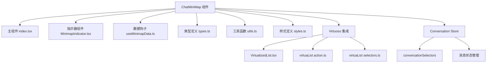
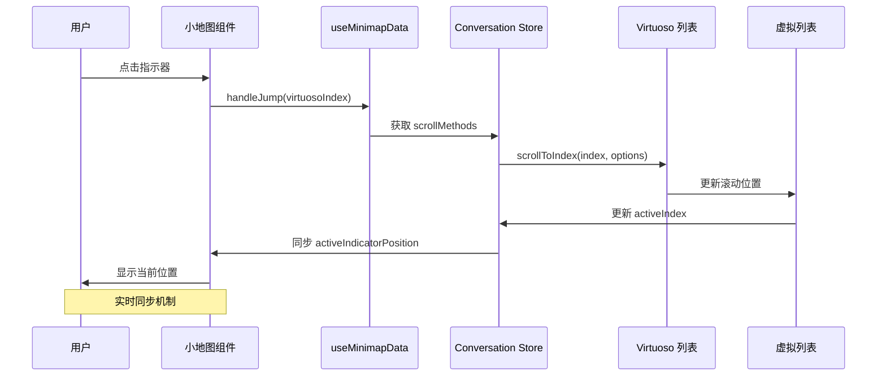
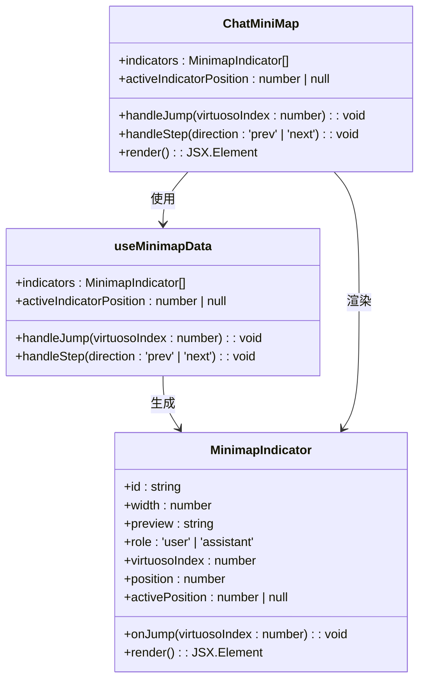
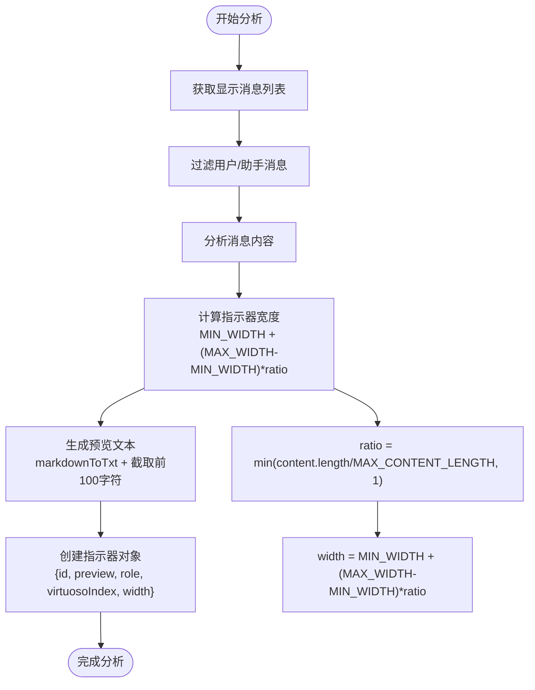
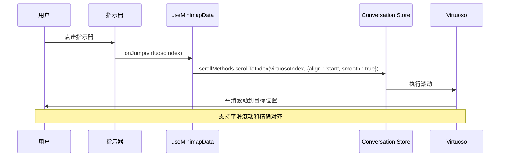
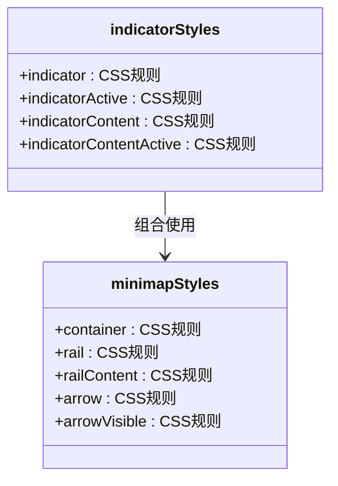
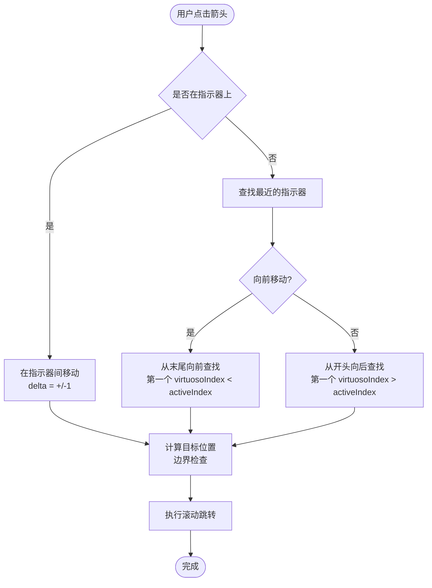
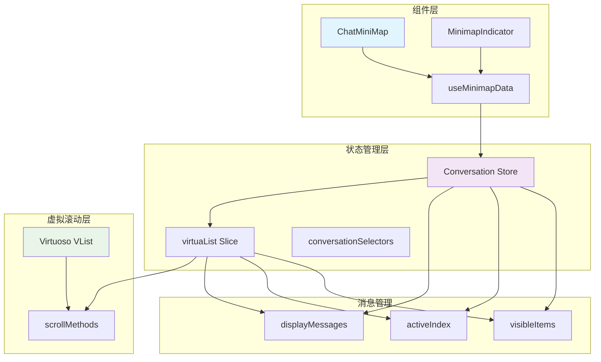

# 聊天小地图组件

<cite>
**本文档引用的文件**
- [src/features/ChatMiniMap/index.tsx](file://src/features/ChatMiniMap/index.tsx)
- [src/features/ChatMiniMap/MinimapIndicator.tsx](file://src/features/ChatMiniMap/MinimapIndicator.tsx)
- [src/features/ChatMiniMap/useMinimapData.ts](file://src/features/ChatMiniMap/useMinimapData.ts)
- [src/features/ChatMiniMap/types.ts](file://src/features/ChatMiniMap/types.ts)
- [src/features/ChatMiniMap/utils.ts](file://src/features/ChatMiniMap/utils.ts)
- [src/features/ChatMiniMap/styles.ts](file://src/features/ChatMiniMap/styles.ts)
- [src/features/Conversation/ChatList/components/VirtualizedList.tsx](file://src/features/Conversation/ChatList/components/VirtualizedList.tsx)
- [src/features/Conversation/store/slices/virtuaList/action.ts](file://src/features/Conversation/store/slices/virtuaList/action.ts)
- [src/features/Conversation/store/slices/virtuaList/selectors.ts](file://src/features/Conversation/store/slices/virtuaList/selectors.ts)
- [src/features/Conversation/index.ts](file://src/features/Conversation/index.ts)
</cite>

## 目录
1. [简介](#简介)
2. [项目结构](#项目结构)
3. [核心组件](#核心组件)
4. [架构概览](#架构概览)
5. [详细组件分析](#详细组件分析)
6. [依赖关系分析](#依赖关系分析)
7. [性能考虑](#性能考虑)
8. [故障排除指南](#故障排除指南)
9. [结论](#结论)

## 简介

聊天小地图组件是一个专为长对话场景设计的导航辅助工具，它提供了以下核心功能：

- **滚动位置指示器**：通过可视化的小条形图显示消息在滚动列表中的相对位置和密度分布
- **快速跳转功能**：允许用户直接点击小地图上的任意位置快速定位到对应的对话区域
- **内容概览**：提供消息预览，帮助用户快速识别不同对话片段的内容
- **智能密度分析**：根据消息内容长度动态调整指示器宽度，反映消息密度分布

该组件深度集成了 Virtuoso 虚拟滚动系统，实现了与主聊天列表的实时同步，为用户提供流畅的长对话导航体验。

## 项目结构

聊天小地图组件位于 `src/features/ChatMiniMap/` 目录下，采用模块化设计，包含以下核心文件：

**图表来源**
- [src/features/ChatMiniMap/index.tsx](file://src/features/ChatMiniMap/index.tsx#L1-L70)
- [src/features/ChatMiniMap/MinimapIndicator.tsx](file://src/features/ChatMiniMap/MinimapIndicator.tsx#L1-L65)
- [src/features/ChatMiniMap/useMinimapData.ts](file://src/features/ChatMiniMap/useMinimapData.ts#L1-L113)

**章节来源**
- [src/features/ChatMiniMap/index.tsx](file://src/features/ChatMiniMap/index.tsx#L1-L70)
- [src/features/ChatMiniMap/types.ts](file://src/features/ChatMiniMap/types.ts#L1-L18)

## 核心组件

### 主要职责

聊天小地图组件由四个核心部分组成：

1. **ChatMiniMap 主组件**：负责整体布局和交互逻辑
2. **MinimapIndicator 指示器**：渲染单个消息的可视化指示器
3. **useMinimapData 数据钩子**：处理消息密度分析和滚动控制逻辑
4. **样式系统**：提供完整的视觉设计和响应式支持

### 设计理念

组件采用"轻量级"设计理念，只有当消息数量超过阈值时才显示，避免对短对话造成干扰。通过消息密度分析生成直观的视觉反馈，让用户能够快速理解对话结构。

**章节来源**
- [src/features/ChatMiniMap/index.tsx](file://src/features/ChatMiniMap/index.tsx#L14-L69)
- [src/features/ChatMiniMap/MinimapIndicator.tsx](file://src/features/ChatMiniMap/MinimapIndicator.tsx#L9-L62)

## 架构概览

组件架构基于 React Hooks 和 Zustand 状态管理，实现了与 Virtuoso 虚拟滚动系统的无缝集成：

**图表来源**
- [src/features/ChatMiniMap/useMinimapData.ts](file://src/features/ChatMiniMap/useMinimapData.ts#L50-L55)
- [src/features/Conversation/store/slices/virtuaList/action.ts](file://src/features/Conversation/store/slices/virtuaList/action.ts#L110-L113)
- [src/features/Conversation/ChatList/components/VirtualizedList.tsx](file://src/features/Conversation/ChatList/components/VirtualizedList.tsx#L87-L92)

## 详细组件分析

### ChatMiniMap 主组件

主组件负责整体布局和用户交互，包含以下关键功能：

**图表来源**
- [src/features/ChatMiniMap/index.tsx](file://src/features/ChatMiniMap/index.tsx#L14-L69)
- [src/features/ChatMiniMap/MinimapIndicator.tsx](file://src/features/ChatMiniMap/MinimapIndicator.tsx#L9-L62)
- [src/features/ChatMiniMap/useMinimapData.ts](file://src/features/ChatMiniMap/useMinimapData.ts#L12-L112)

#### 消息密度分析算法

组件通过以下步骤分析消息密度并生成可视化指示器：

**图表来源**
- [src/features/ChatMiniMap/useMinimapData.ts](file://src/features/ChatMiniMap/useMinimapData.ts#L17-L31)
- [src/features/ChatMiniMap/utils.ts](file://src/features/ChatMiniMap/utils.ts#L7-L23)

#### 快速跳转功能实现

快速跳转功能通过以下流程实现：

**图表来源**
- [src/features/ChatMiniMap/MinimapIndicator.tsx](file://src/features/ChatMiniMap/MinimapIndicator.tsx#L52-L52)
- [src/features/ChatMiniMap/useMinimapData.ts](file://src/features/ChatMiniMap/useMinimapData.ts#L50-L55)

**章节来源**
- [src/features/ChatMiniMap/index.tsx](file://src/features/ChatMiniMap/index.tsx#L14-L69)
- [src/features/ChatMiniMap/useMinimapData.ts](file://src/features/ChatMiniMap/useMinimapData.ts#L17-L112)

### MinimapIndicator 指示器组件

指示器组件负责渲染单个消息的可视化表示，包含以下特性：

- **角色区分**：根据消息发送者（用户/助手）显示不同的颜色
- **密度可视化**：通过宽度变化反映消息内容长度
- **交互反馈**：悬停效果和点击响应
- **预览功能**：点击显示完整消息预览

#### 指示器样式系统

**图表来源**
- [src/features/ChatMiniMap/styles.ts](file://src/features/ChatMiniMap/styles.ts#L71-L94)
- [src/features/ChatMiniMap/styles.ts](file://src/features/ChatMiniMap/styles.ts#L3-L69)

**章节来源**
- [src/features/ChatMiniMap/MinimapIndicator.tsx](file://src/features/ChatMiniMap/MinimapIndicator.tsx#L9-L62)
- [src/features/ChatMiniMap/styles.ts](file://src/features/ChatMiniMap/styles.ts#L1-L95)

### 数据钩子 useMinimapData

数据钩子是组件的核心逻辑处理中心，负责：

- **消息密度分析**：计算每个消息的指示器宽度
- **索引映射**：建立 virtuosoIndex 到显示位置的映射
- **活动指示器跟踪**：监控当前激活的指示器位置
- **滚动控制**：提供跳转和步进功能

#### 步进导航算法

步进导航功能实现了智能的位置移动逻辑：

**图表来源**
- [src/features/ChatMiniMap/useMinimapData.ts](file://src/features/ChatMiniMap/useMinimapData.ts#L57-L104)

**章节来源**
- [src/features/ChatMiniMap/useMinimapData.ts](file://src/features/ChatMiniMap/useMinimapData.ts#L12-L112)

## 依赖关系分析

组件与 Virtuoso 虚拟滚动系统的集成关系如下：

**图表来源**
- [src/features/ChatMiniMap/index.tsx](file://src/features/ChatMiniMap/index.tsx#L19-L19)
- [src/features/Conversation/store/slices/virtuaList/action.ts](file://src/features/Conversation/store/slices/virtuaList/action.ts#L81-L83)
- [src/features/Conversation/ChatList/components/VirtualizedList.tsx](file://src/features/Conversation/ChatList/components/VirtualizedList.tsx#L87-L92)

### 关键依赖关系

1. **状态同步**：通过 `conversationSelectors` 访问消息状态
2. **滚动控制**：通过 `virtuaScrollMethods` 控制 Virtuoso 滚动
3. **索引管理**：维护 `virtuosoIndex` 到显示位置的映射
4. **实时更新**：监听消息变化自动更新指示器

**章节来源**
- [src/features/ChatMiniMap/useMinimapData.ts](file://src/features/ChatMiniMap/useMinimapData.ts#L13-L15)
- [src/features/Conversation/store/slices/virtuaList/selectors.ts](file://src/features/Conversation/store/slices/virtuaList/selectors.ts#L9-L15)

## 性能考虑

### 优化策略

1. **虚拟化渲染**：仅渲染可见的指示器，避免大量 DOM 元素
2. **记忆化优化**：使用 `useMemo` 缓存计算结果
3. **深度比较**：使用 `fast-deep-equal` 避免不必要的重渲染
4. **防抖处理**：滚动事件处理中使用定时器优化性能

### 内存管理

- **索引映射**：使用 `Map` 结构提供 O(1) 查找性能
- **条件渲染**：消息数量低于阈值时不渲染组件
- **清理机制**：组件卸载时清理定时器和事件监听器

### 响应式设计

组件采用绝对定位和相对尺寸设计，确保在不同屏幕尺寸下都有良好的显示效果：

- **容器定位**：固定在聊天界面右侧，距离顶部和底部各 16px
- **自适应宽度**：指示器宽度根据内容长度动态调整
- **滚动条隐藏**：通过 CSS 隐藏原生滚动条，使用自定义样式

**章节来源**
- [src/features/ChatMiniMap/styles.ts](file://src/features/ChatMiniMap/styles.ts#L21-L68)
- [src/features/ChatMiniMap/utils.ts](file://src/features/ChatMiniMap/utils.ts#L3-L25)

## 故障排除指南

### 常见问题及解决方案

#### 1. 指示器不显示

**可能原因**：
- 消息数量少于阈值（默认 3 条）
- Virtuoso 滚动方法未正确注册

**解决方法**：
- 检查 `MIN_MESSAGES_THRESHOLD` 设置
- 确认 `registerVirtuaScrollMethods` 已调用

#### 2. 点击无响应

**可能原因**：
- `virtuaScrollMethods` 为 null
- `virtuosoIndex` 无效

**解决方法**：
- 检查 Virtuoso 组件是否正确初始化
- 验证消息 ID 的唯一性

#### 3. 活动指示器不更新

**可能原因**：
- 滚动事件监听失败
- `activeIndex` 状态未更新

**解决方法**：
- 检查 `handleScroll` 函数是否被调用
- 确认 `setActiveIndex` 调用链路

**章节来源**
- [src/features/ChatMiniMap/useMinimapData.ts](file://src/features/ChatMiniMap/useMinimapData.ts#L50-L55)
- [src/features/Conversation/ChatList/components/VirtualizedList.tsx](file://src/features/Conversation/ChatList/components/VirtualizedList.tsx#L51-L77)

## 结论

聊天小地图组件通过巧妙的设计实现了以下目标：

1. **用户体验优化**：为长对话场景提供直观的导航辅助
2. **性能高效**：采用虚拟化和记忆化技术确保流畅运行
3. **集成深度**：与 Virtuoso 系统无缝集成，实现真正的双向同步
4. **可扩展性**：模块化设计便于功能扩展和维护

该组件在保持简洁设计的同时，提供了强大的功能性，是现代聊天应用中不可或缺的用户体验增强工具。通过消息密度分析和智能跳转功能，用户可以快速定位到重要的对话片段，显著提升长对话场景的使用效率。