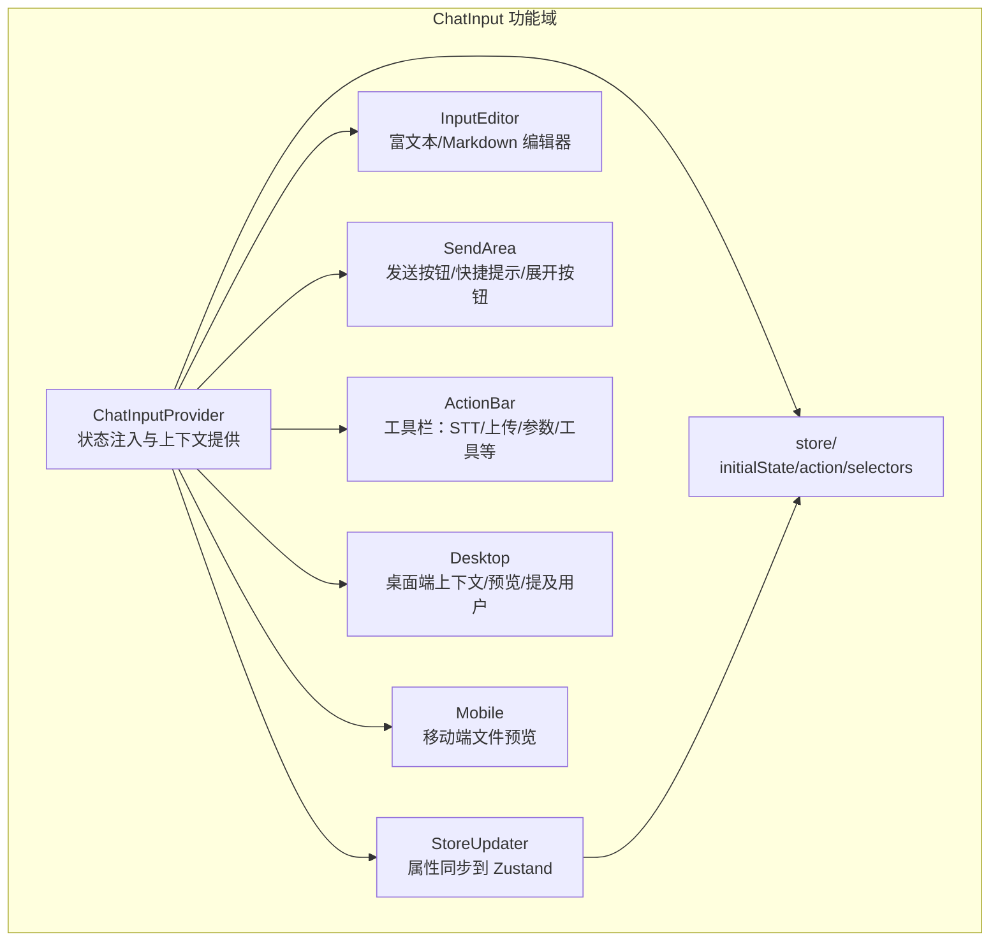
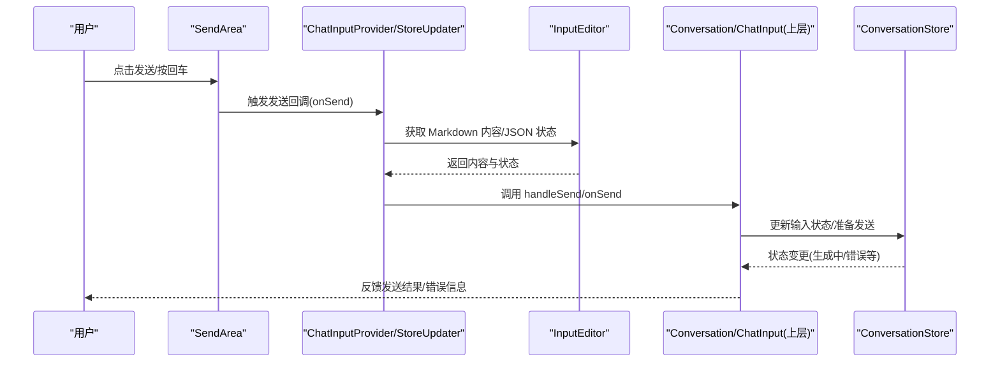
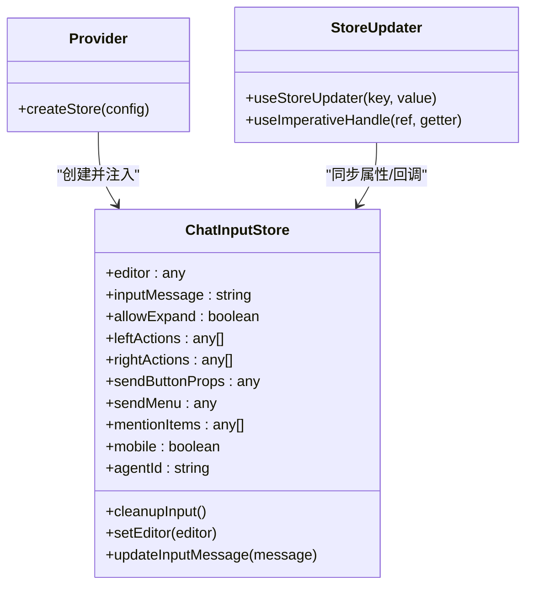
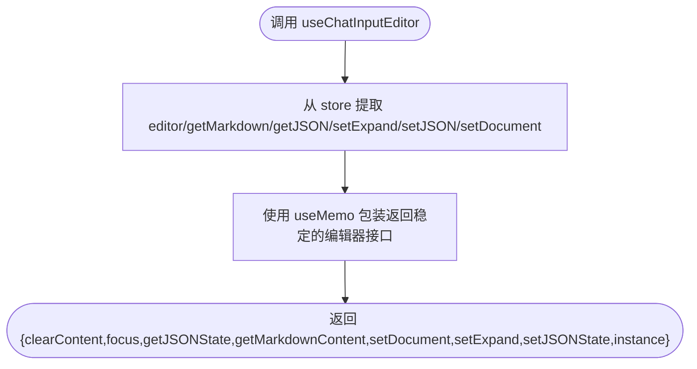
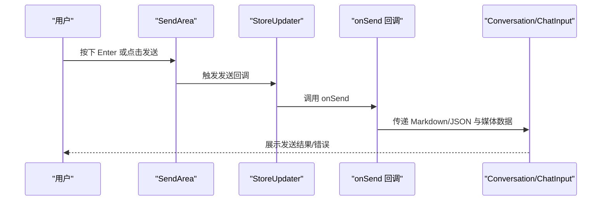
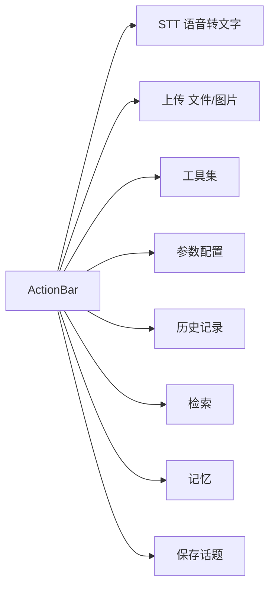
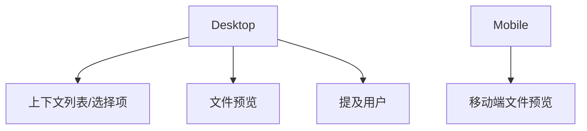
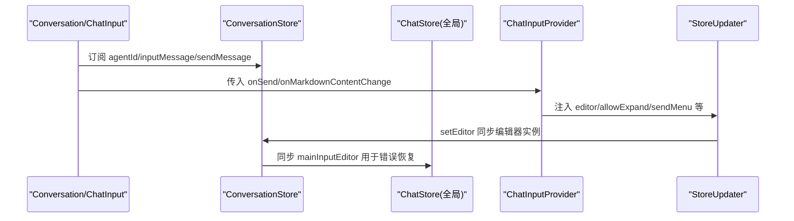
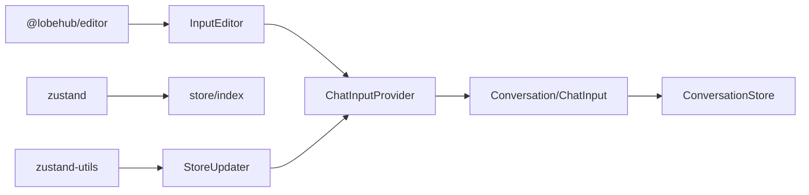

# 聊天输入组件

<cite>
**本文引用的文件**
- [src/features/ChatInput/ChatInputProvider.tsx](file://src/features/ChatInput/ChatInputProvider.tsx)
- [src/features/ChatInput/StoreUpdater.tsx](file://src/features/ChatInput/StoreUpdater.tsx)
- [src/features/ChatInput/hooks/useChatInputEditor.ts](file://src/features/ChatInput/hooks/useChatInputEditor.ts)
- [src/features/ChatInput/index.ts](file://src/features/ChatInput/index.ts)
- [src/features/ChatInput/types.ts](file://src/features/ChatInput/types.ts)
- [src/features/ChatInput/store/index.ts](file://src/features/ChatInput/store/index.ts)
- [src/features/ChatInput/store/initialState.ts](file://src/features/ChatInput/store/initialState.ts)
- [src/features/ChatInput/store/action.ts](file://src/features/ChatInput/store/action.ts)
- [src/features/ChatInput/store/selectors.ts](file://src/features/ChatInput/store/selectors.ts)
- [src/features/ChatInput/Desktop/index.tsx](file://src/features/ChatInput/Desktop/index.tsx)
- [src/features/ChatInput/Mobile/index.tsx](file://src/features/ChatInput/Mobile/index.tsx)
- [src/features/ChatInput/InputEditor/index.tsx](file://src/features/ChatInput/InputEditor/index.tsx)
- [src/features/ChatInput/SendArea/index.tsx](file://src/features/ChatInput/SendArea/index.tsx)
- [src/features/ChatInput/ActionBar/index.tsx](file://src/features/ChatInput/ActionBar/index.tsx)
- [src/features/Conversation/ChatInput/index.tsx](file://src/features/Conversation/ChatInput/index.tsx)
- [src/features/Conversation/store/slices/input/action.ts](file://src/features/Conversation/store/slices/input/action.ts)
- [src/features/Conversation/store/slices/input/initialState.ts](file://src/features/Conversation/store/slices/input/initialState.ts)
</cite>

## 目录

1. [简介](#简介)
2. [项目结构](#项目结构)
3. [核心组件](#核心组件)
4. [架构总览](#架构总览)
5. [详细组件分析](#详细组件分析)
6. [依赖关系分析](#依赖关系分析)
7. [性能考虑](#性能考虑)
8. [故障排查指南](#故障排查指南)
9. [结论](#结论)
10. [附录](#附录)

## 简介

本文件系统性梳理聊天输入组件的整体架构与实现细节，覆盖输入框、发送按钮、文件上传、快捷操作、状态管理、消息提交流程、文件处理逻辑、快捷键支持、多模态输入体验、与聊天状态管理系统的集成、实时预览与自动完成机制、响应式设计与无障碍支持、性能优化策略以及不同输入模式（文本、文件、语音）的实现差异与体验优化。

## 项目结构

聊天输入组件采用 “功能域 + 分层” 的组织方式：

- 功能域：src/features/ChatInput 下包含输入编辑器、发送区域、动作栏、桌面 / 移动端适配、上传与预览、状态存储等子模块。
- 分层：Provider/StoreUpdater 负责状态注入；hooks 提供编辑器能力；Desktop/Mobile 提供平台化 UI；InputEditor/SendArea/ActionBar 组合形成输入界面。
- 集成：Conversation/ChatInput 将 ChatInputProvider 与会话状态（ConversationStore）桥接，实现与聊天上下文的联动。

图表来源

- [src/features/ChatInput/ChatInputProvider.tsx](file://src/features/ChatInput/ChatInputProvider.tsx#L1-L65)
- [src/features/ChatInput/StoreUpdater.tsx](file://src/features/ChatInput/StoreUpdater.tsx#L1-L53)
- [src/features/ChatInput/store/index.ts](file://src/features/ChatInput/store/index.ts)
- [src/features/ChatInput/InputEditor/index.tsx](file://src/features/ChatInput/InputEditor/index.tsx)
- [src/features/ChatInput/SendArea/index.tsx](file://src/features/ChatInput/SendArea/index.tsx)
- [src/features/ChatInput/ActionBar/index.tsx](file://src/features/ChatInput/ActionBar/index.tsx)
- [src/features/ChatInput/Desktop/index.tsx](file://src/features/ChatInput/Desktop/index.tsx)
- [src/features/ChatInput/Mobile/index.tsx](file://src/features/ChatInput/Mobile/index.tsx)

章节来源

- [src/features/ChatInput/ChatInputProvider.tsx](file://src/features/ChatInput/ChatInputProvider.tsx#L1-L65)
- [src/features/ChatInput/StoreUpdater.tsx](file://src/features/ChatInput/StoreUpdater.tsx#L1-L53)
- [src/features/ChatInput/index.ts](file://src/features/ChatInput/index.ts#L1-L8)

## 核心组件

- ChatInputProvider：负责将编辑器实例、动作栏配置、发送回调、扩展开关等注入到 Zustand store，并通过 StoreUpdater 同步到 store。
- StoreUpdater：使用 zustand-utils 的 createStoreUpdater 将外部 props 同步到 store，同时暴露编辑器句柄给父组件。
- useChatInputEditor：从 store 中抽取编辑器能力（清空、聚焦、获取 Markdown/JSON、设置 JSON / 文档、展开 / 收起），并以 useMemo 包装返回稳定引用。
- store：包含 initialState、action、selectors 与 store/index 导出，统一管理输入状态与行为。
- Desktop/Mobile：分别针对桌面端上下文 / 预览 / 提及用户与移动端文件预览进行平台化适配。
- InputEditor/SendArea/ActionBar：组合形成输入 UI，分别负责编辑区、发送控制与快捷操作。

章节来源

- [src/features/ChatInput/ChatInputProvider.tsx](file://src/features/ChatInput/ChatInputProvider.tsx#L1-L65)
- [src/features/ChatInput/StoreUpdater.tsx](file://src/features/ChatInput/StoreUpdater.tsx#L1-L53)
- [src/features/ChatInput/hooks/useChatInputEditor.ts](file://src/features/ChatInput/hooks/useChatInputEditor.ts#L1-L45)
- [src/features/ChatInput/store/initialState.ts](file://src/features/ChatInput/store/initialState.ts)
- [src/features/ChatInput/store/action.ts](file://src/features/ChatInput/store/action.ts)
- [src/features/ChatInput/store/selectors.ts](file://src/features/ChatInput/store/selectors.ts)

## 架构总览

聊天输入组件通过 Provider 注入 store，StoreUpdater 将外部配置与回调写入 store，编辑器与 UI 组件基于 store 状态渲染与交互。发送流程由 SendArea 触发，调用 onSend 回调，再由上层 Conversation/ChatInput 进一步桥接到会话状态与服务端。

图表来源

- [src/features/ChatInput/SendArea/index.tsx](file://src/features/ChatInput/SendArea/index.tsx)
- [src/features/ChatInput/ChatInputProvider.tsx](file://src/features/ChatInput/ChatInputProvider.tsx#L1-L65)
- [src/features/ChatInput/StoreUpdater.tsx](file://src/features/ChatInput/StoreUpdater.tsx#L1-L53)
- [src/features/Conversation/ChatInput/index.tsx](file://src/features/Conversation/ChatInput/index.tsx#L79-L219)

## 详细组件分析

### 状态管理与 Store 设计

- initialState：定义输入编辑器实例、当前输入消息、是否允许展开、动作栏配置、发送按钮属性、发送菜单、提及项、移动端模式等字段。
- action：提供清理输入、设置编辑器实例、更新输入消息等方法，用于在 store 内部修改状态。
- selectors：导出常用选择器，便于 UI 组件按需订阅状态片段。
- store/index：导出 store 实例，供 Provider 使用。

图表来源

- [src/features/ChatInput/store/initialState.ts](file://src/features/ChatInput/store/initialState.ts)
- [src/features/ChatInput/store/action.ts](file://src/features/ChatInput/store/action.ts)
- [src/features/ChatInput/store/selectors.ts](file://src/features/ChatInput/store/selectors.ts)
- [src/features/ChatInput/ChatInputProvider.tsx](file://src/features/ChatInput/ChatInputProvider.tsx#L1-L65)
- [src/features/ChatInput/StoreUpdater.tsx](file://src/features/ChatInput/StoreUpdater.tsx#L1-L53)

章节来源

- [src/features/ChatInput/store/initialState.ts](file://src/features/ChatInput/store/initialState.ts)
- [src/features/ChatInput/store/action.ts](file://src/features/ChatInput/store/action.ts)
- [src/features/ChatInput/store/selectors.ts](file://src/features/ChatInput/store/selectors.ts)
- [src/features/ChatInput/store/index.ts](file://src/features/ChatInput/store/index.ts)

### 输入编辑器与编辑器能力

- useChatInputEditor：封装编辑器实例的常用操作，包括清空内容、聚焦、获取 Markdown/JSON、设置 JSON / 文档、展开 / 收起。
- InputEditor：承载富文本 / Markdown 编辑器，支持占位符、自动完成（斜杠菜单）、实时预览等。

图表来源

- [src/features/ChatInput/hooks/useChatInputEditor.ts](file://src/features/ChatInput/hooks/useChatInputEditor.ts#L1-L45)
- [src/features/ChatInput/InputEditor/index.tsx](file://src/features/ChatInput/InputEditor/index.tsx)

章节来源

- [src/features/ChatInput/hooks/useChatInputEditor.ts](file://src/features/ChatInput/hooks/useChatInputEditor.ts#L1-L45)
- [src/features/ChatInput/InputEditor/index.tsx](file://src/features/ChatInput/InputEditor/index.tsx)

### 发送区域与快捷键支持

- SendArea：包含发送按钮、展开 / 收起按钮、快捷键提示等。
- 快捷键：支持 Cmd/Ctrl+Enter 发送，避免误触与提升效率。
- 并行发送：支持富文本与并行发送，提升交互流畅度。

图表来源

- [src/features/ChatInput/SendArea/index.tsx](file://src/features/ChatInput/SendArea/index.tsx)
- [src/features/ChatInput/StoreUpdater.tsx](file://src/features/ChatInput/StoreUpdater.tsx#L1-L53)
- [src/features/Conversation/ChatInput/index.tsx](file://src/features/Conversation/ChatInput/index.tsx#L79-L219)

章节来源

- [src/features/ChatInput/SendArea/index.tsx](file://src/features/ChatInput/SendArea/index.tsx)
- [src/features/ChatInput/StoreUpdater.tsx](file://src/features/ChatInput/StoreUpdater.tsx#L1-L53)
- [src/features/Conversation/ChatInput/index.tsx](file://src/features/Conversation/ChatInput/index.tsx#L79-L219)

### 快捷操作栏（ActionBar）

- 支持多种快捷操作：STT（语音转文字）、上传（文件 / 图片）、工具、参数、历史、检索、记忆、保存话题等。
- 通过配置与上下文菜单动态呈现，满足不同场景下的快速输入需求。

图表来源

- [src/features/ChatInput/ActionBar/index.tsx](file://src/features/ChatInput/ActionBar/index.tsx)

章节来源

- [src/features/ChatInput/ActionBar/index.tsx](file://src/features/ChatInput/ActionBar/index.tsx)

### 桌面端与移动端适配

- Desktop：提供上下文列表、文件预览、提及用户等桌面端增强功能，支持拖拽、选择、预览与批量操作。
- Mobile：提供移动端文件预览与交互，适配小屏输入体验，保证可读性与易用性。

图表来源

- [src/features/ChatInput/Desktop/index.tsx](file://src/features/ChatInput/Desktop/index.tsx)
- [src/features/ChatInput/Mobile/index.tsx](file://src/features/ChatInput/Mobile/index.tsx)

章节来源

- [src/features/ChatInput/Desktop/index.tsx](file://src/features/ChatInput/Desktop/index.tsx)
- [src/features/ChatInput/Mobile/index.tsx](file://src/features/ChatInput/Mobile/index.tsx)

### 与聊天状态管理系统的集成

- Conversation/ChatInput：将 ChatInputProvider 与 ConversationStore 桥接，使用会话状态驱动输入行为，如生成状态、错误信息、编辑器实例同步等。
- 输入状态同步：setEditor 将编辑器实例同步至全局 / 会话状态，以便错误恢复与统一管理。

图表来源

- [src/features/Conversation/ChatInput/index.tsx](file://src/features/Conversation/ChatInput/index.tsx#L79-L219)
- [src/features/Conversation/store/slices/input/action.ts](file://src/features/Conversation/store/slices/input/action.ts#L1-L40)
- [src/features/Conversation/store/slices/input/initialState.ts](file://src/features/Conversation/store/slices/input/initialState.ts#L1-L16)
- [src/features/ChatInput/ChatInputProvider.tsx](file://src/features/ChatInput/ChatInputProvider.tsx#L1-L65)
- [src/features/ChatInput/StoreUpdater.tsx](file://src/features/ChatInput/StoreUpdater.tsx#L1-L53)

章节来源

- [src/features/Conversation/ChatInput/index.tsx](file://src/features/Conversation/ChatInput/index.tsx#L79-L219)
- [src/features/Conversation/store/slices/input/action.ts](file://src/features/Conversation/store/slices/input/action.ts#L1-L40)
- [src/features/Conversation/store/slices/input/initialState.ts](file://src/features/Conversation/store/slices/input/initialState.ts#L1-L16)
- [src/features/ChatInput/ChatInputProvider.tsx](file://src/features/ChatInput/ChatInputProvider.tsx#L1-L65)
- [src/features/ChatInput/StoreUpdater.tsx](file://src/features/ChatInput/StoreUpdater.tsx#L1-L53)

### 多模态输入体验

- 文本：富文本 / Markdown 编辑器，支持斜杠菜单、自动完成、实时预览。
- 文件：支持图片 / 文档上传，桌面端提供预览与上下文关联，移动端提供缩略图与移除。
- 语音：STT 语音转文字，结合发送按钮实现语音输入。
- 多模态组合：发送时可携带 Markdown 文本与内联图片数据，实现图文混排。

章节来源

- [src/features/ChatInput/InputEditor/index.tsx](file://src/features/ChatInput/InputEditor/index.tsx)
- [src/features/ChatInput/ActionBar/STT/index.tsx](file://src/features/ChatInput/ActionBar/STT/index.tsx)
- [src/features/ChatInput/ActionBar/Upload/index.tsx](file://src/features/ChatInput/ActionBar/Upload/index.tsx)
- [src/features/ChatInput/Desktop/FilePreview/index.tsx](file://src/features/ChatInput/Desktop/FilePreview/index.tsx)
- [src/features/ChatInput/Mobile/FilePreview/index.tsx](file://src/features/ChatInput/Mobile/FilePreview/index.tsx)

### 响应式设计与无障碍支持

- 响应式：根据屏幕尺寸与平台（桌面 / 移动）调整布局与控件密度，确保在小屏设备上的可用性。
- 无障碍：为发送按钮、快捷操作、文件预览等提供语义化标签与键盘导航支持，提升可访问性。

章节来源

- [src/features/ChatInput/Desktop/index.tsx](file://src/features/ChatInput/Desktop/index.tsx)
- [src/features/ChatInput/Mobile/index.tsx](file://src/features/ChatInput/Mobile/index.tsx)

### 性能优化策略

- 状态分片：仅订阅必要字段，减少重渲染。
- 编辑器能力封装：useMemo 包装编辑器接口，避免引用变化导致的无效重渲染。
- 并行发送：富文本与并行发送提升交互流畅度。
- 懒加载与条件渲染：根据平台与功能动态加载对应模块。

章节来源

- [src/features/ChatInput/hooks/useChatInputEditor.ts](file://src/features/ChatInput/hooks/useChatInputEditor.ts#L1-L45)
- [src/features/ChatInput/SendArea/index.tsx](file://src/features/ChatInput/SendArea/index.tsx)

## 依赖关系分析

- 组件耦合：ChatInputProvider 与 StoreUpdater 低耦合，通过 store 解耦 UI 与状态；编辑器能力通过 hooks 抽象，便于复用。
- 外部依赖：依赖 @lobehub/editor 提供富文本 / Markdown 编辑器能力；依赖 zustand/zustand-utils 管理状态与属性同步。
- 集成点：与 ConversationStore 的集成通过 setEditor 与 onSend 回调实现，确保错误恢复与状态一致性。

图表来源

- [src/features/ChatInput/ChatInputProvider.tsx](file://src/features/ChatInput/ChatInputProvider.tsx#L1-L65)
- [src/features/ChatInput/StoreUpdater.tsx](file://src/features/ChatInput/StoreUpdater.tsx#L1-L53)
- [src/features/ChatInput/store/index.ts](file://src/features/ChatInput/store/index.ts)
- [src/features/Conversation/ChatInput/index.tsx](file://src/features/Conversation/ChatInput/index.tsx#L79-L219)

章节来源

- [src/features/ChatInput/ChatInputProvider.tsx](file://src/features/ChatInput/ChatInputProvider.tsx#L1-L65)
- [src/features/ChatInput/StoreUpdater.tsx](file://src/features/ChatInput/StoreUpdater.tsx#L1-L53)
- [src/features/ChatInput/store/index.ts](file://src/features/ChatInput/store/index.ts)
- [src/features/Conversation/ChatInput/index.tsx](file://src/features/Conversation/ChatInput/index.tsx#L79-L219)

## 性能考虑

- 渲染优化：使用 memo 与 useMemo 减少不必要的重渲染；仅在必要字段变化时更新 UI。
- 状态同步：通过 createStoreUpdater 批量同步属性，降低多次 setState 带来的抖动。
- 编辑器实例：通过 setEditor 同步至全局 / 会话状态，避免重复创建与销毁带来的开销。
- 多模态处理：对文件预览与上传采用懒加载与缓存策略，减少首屏压力。

章节来源

- [src/features/ChatInput/ChatInputProvider.tsx](file://src/features/ChatInput/ChatInputProvider.tsx#L1-L65)
- [src/features/ChatInput/StoreUpdater.tsx](file://src/features/ChatInput/StoreUpdater.tsx#L1-L53)
- [src/features/ChatInput/hooks/useChatInputEditor.ts](file://src/features/ChatInput/hooks/useChatInputEditor.ts#L1-L45)

## 故障排查指南

- 发送失败或无响应：检查 onSend 回调是否正确传入；确认 ConversationStore 的生成状态与错误信息；查看 setEditor 是否成功同步。
- 编辑器无法聚焦或内容未更新：确认 useChatInputEditor 返回的实例与 focus/clearContent 方法是否被正确调用；检查 store 中 editor 字段是否已设置。
- 文件上传异常：检查上传组件与后端接口；确认文件类型与大小限制；查看预览组件是否正确渲染。
- 快捷键无效：确认快捷键绑定与事件冒泡；检查 allowExpand 与 sendButtonProps 配置是否影响交互。

章节来源

- [src/features/Conversation/ChatInput/index.tsx](file://src/features/Conversation/ChatInput/index.tsx#L79-L219)
- [src/features/Conversation/store/slices/input/action.ts](file://src/features/Conversation/store/slices/input/action.ts#L1-L40)
- [src/features/ChatInput/hooks/useChatInputEditor.ts](file://src/features/ChatInput/hooks/useChatInputEditor.ts#L1-L45)

## 结论

聊天输入组件通过清晰的功能域划分与分层设计，实现了输入编辑、发送控制、快捷操作、多模态支持与跨平台适配。借助 Zustand 的轻量状态管理与 @lobehub/editor 的富文本能力，组件在保持高可维护性的同时，提供了良好的用户体验与扩展空间。建议在实际接入时重点关注状态同步、错误恢复与多模态数据的统一处理，以获得更稳健的输入体验。

## 附录

- 类型导出：index.ts 汇总导出 ActionKey、ChatInputProvider、Desktop/Mobile 组件、useChatInputEditor 与 SendButtonHandler 类型，便于上层统一引用。
- 行为参考：types.ts 暴露 ActionKeys 类型，便于扩展自定义快捷操作。

章节来源

- [src/features/ChatInput/index.ts](file://src/features/ChatInput/index.ts#L1-L8)
- [src/features/ChatInput/types.ts](file://src/features/ChatInput/types.ts#L1-L2)
