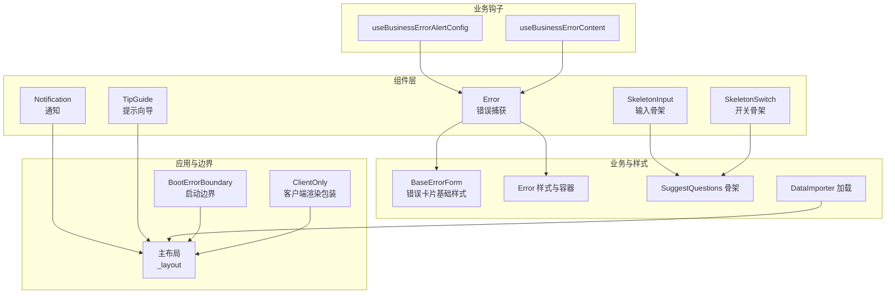
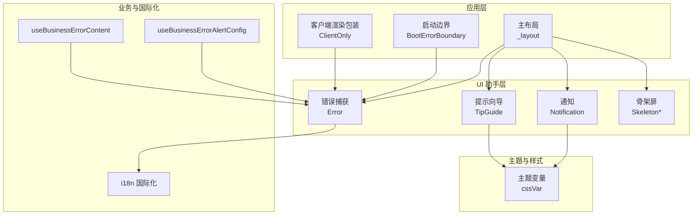
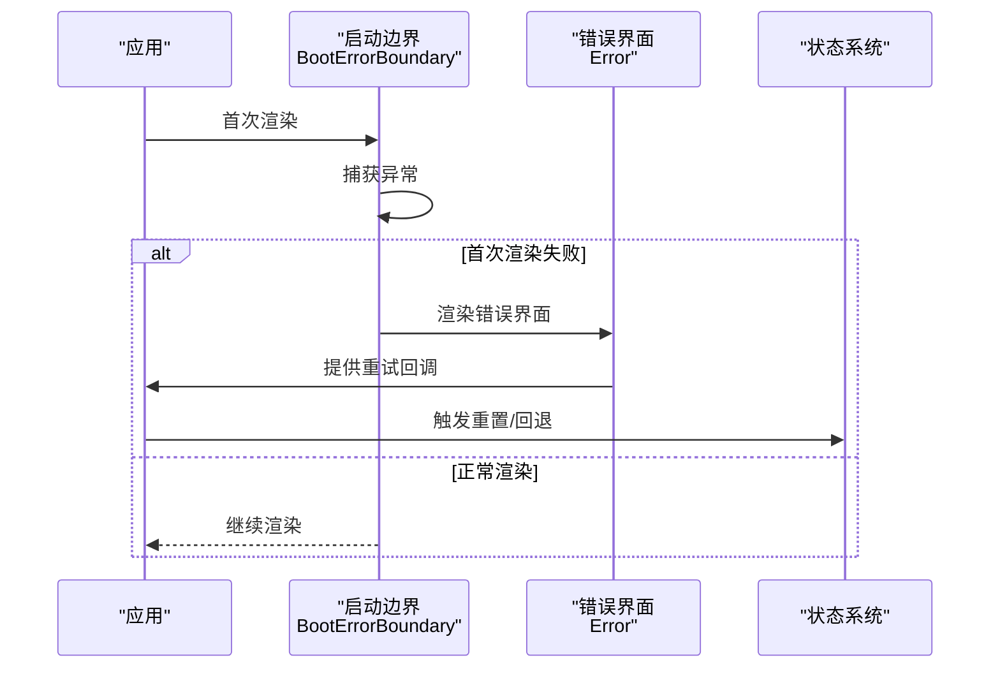
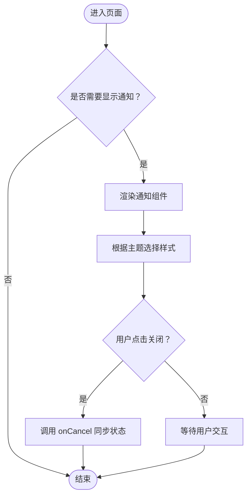
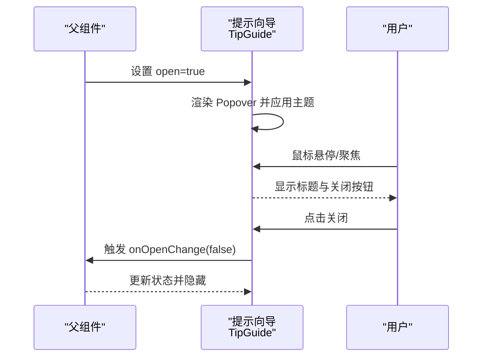
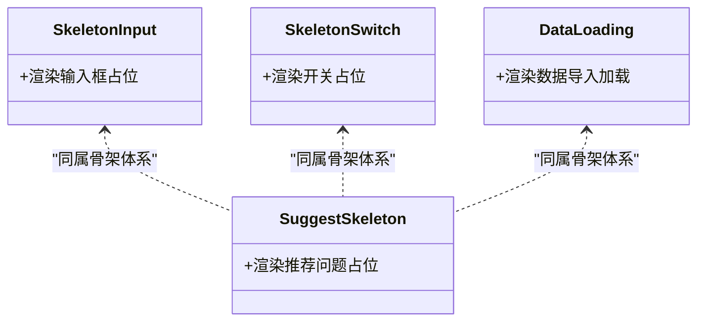
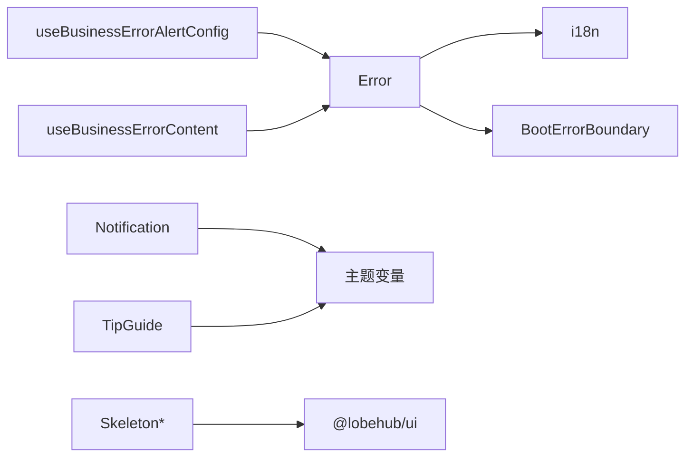

# 辅助工具组件

<cite>
**本文引用的文件**
- [src/components/Error/index.tsx](file://src/components/Error/index.tsx)
- [src/components/Notification/index.tsx](file://src/components/Notification/index.tsx)
- [src/components/TipGuide/index.tsx](file://src/components/TipGuide/index.tsx)
- [src/components/Skeleton/SkeletonInput.tsx](file://src/components/Skeleton/SkeletonInput.tsx)
- [src/components/Skeleton/SkeletonSwitch.tsx](file://src/components/Skeleton/SkeletonSwitch.tsx)
- [src/features/Conversation/Error/BaseErrorForm.tsx](file://src/features/Conversation/Error/BaseErrorForm.tsx)
- [src/features/Conversation/Error/style.tsx](file://src/features/Conversation/Error/style.tsx)
- [src/features/SuggestQuestions/Skeleton.tsx](file://src/features/SuggestQuestions/Skeleton.tsx)
- [src/features/DataImporter/Loading.tsx](file://src/features/DataImporter/Loading.tsx)
- [src/routes/(main)/_layout/index.tsx](file://src/routes/(main)/_layout/index.tsx)
- [src/components/BootErrorBoundary/index.tsx](file://src/components/BootErrorBoundary/index.tsx)
- [src/components/client/ClientOnly.tsx](file://src/components/client/ClientOnly.tsx)
- [src/business/client/hooks/useBusinessErrorAlertConfig.ts](file://src/business/client/hooks/useBusinessErrorAlertConfig.ts)
- [src/business/client/hooks/useBusinessErrorContent.ts](file://src/business/client/hooks/useBusinessErrorContent.ts)
- [packages/const/src/message.ts](file://packages/const/src/message.ts)
</cite>

## 目录

1. [简介](#简介)
2. [项目结构](#项目结构)
3. [核心组件](#核心组件)
4. [架构总览](#架构总览)
5. [组件详解](#组件详解)
6. [依赖关系分析](#依赖关系分析)
7. [性能考量](#性能考量)
8. [故障排查指南](#故障排查指南)
9. [结论](#结论)
10. [附录](#附录)

## 简介

本文件系统化梳理 LobeHub 的辅助工具组件，覆盖加载骨架（Skeleton）、错误捕获与展示（Error）、通知（Notification）、提示向导（TipGuide）等核心 UI 助手组件。文档从用户体验增强、状态反馈、用户引导与界面提示四个维度展开，结合组件间协作机制、状态传播与一致性设计，帮助开发者快速理解并正确集成这些组件，以实现友好、一致且可维护的用户交互体验。

## 项目结构

围绕 “辅助工具组件” 的相关文件主要分布在以下位置：

- 组件层：src/components 下的 Error、Notification、TipGuide、Skeleton 子目录
- 业务错误样式与表单：src/features/Conversation/Error
- 骨架屏与加载：src/features/SuggestQuestions、src/features/DataImporter
- 应用布局与边界：src/routes/(main)/\_layout、src/components/BootErrorBoundary、src/components/client/ClientOnly
- 业务错误配置钩子：src/business/client/hooks

图表来源

- [src/components/Error/index.tsx](file://src/components/Error/index.tsx#L1-L70)
- [src/components/Notification/index.tsx](file://src/components/Notification/index.tsx#L1-L109)
- [src/components/TipGuide/index.tsx](file://src/components/TipGuide/index.tsx#L1-L151)
- [src/components/Skeleton/SkeletonInput.tsx](file://src/components/Skeleton/SkeletonInput.tsx#L1-L6)
- [src/components/Skeleton/SkeletonSwitch.tsx](file://src/components/Skeleton/SkeletonSwitch.tsx#L1-L14)
- [src/features/Conversation/Error/BaseErrorForm.tsx](file://src/features/Conversation/Error/BaseErrorForm.tsx#L1-L40)
- [src/features/Conversation/Error/style.tsx](file://src/features/Conversation/Error/style.tsx#L1-L36)
- [src/features/SuggestQuestions/Skeleton.tsx](file://src/features/SuggestQuestions/Skeleton.tsx#L1-L27)
- [src/features/DataImporter/Loading.tsx](file://src/features/DataImporter/Loading.tsx#L1-L124)
- [src/routes/(main)/\_layout/index.tsx](<file://src/routes/(main)/_layout/index.tsx#L1-L105>)
- [src/components/BootErrorBoundary/index.tsx](file://src/components/BootErrorBoundary/index.tsx#L1-L125)
- [src/components/client/ClientOnly.tsx](file://src/components/client/ClientOnly.tsx#L1-L22)
- [src/business/client/hooks/useBusinessErrorAlertConfig.ts](file://src/business/client/hooks/useBusinessErrorAlertConfig.ts#L1-L9)
- [src/business/client/hooks/useBusinessErrorContent.ts](file://src/business/client/hooks/useBusinessErrorContent.ts#L1-L13)

章节来源

- [src/components/Error/index.tsx](file://src/components/Error/index.tsx#L1-L70)
- [src/components/Notification/index.tsx](file://src/components/Notification/index.tsx#L1-L109)
- [src/components/TipGuide/index.tsx](file://src/components/TipGuide/index.tsx#L1-L151)
- [src/components/Skeleton/SkeletonInput.tsx](file://src/components/Skeleton/SkeletonInput.tsx#L1-L6)
- [src/components/Skeleton/SkeletonSwitch.tsx](file://src/components/Skeleton/SkeletonSwitch.tsx#L1-L14)
- [src/features/Conversation/Error/BaseErrorForm.tsx](file://src/features/Conversation/Error/BaseErrorForm.tsx#L1-L40)
- [src/features/Conversation/Error/style.tsx](file://src/features/Conversation/Error/style.tsx#L1-L36)
- [src/features/SuggestQuestions/Skeleton.tsx](file://src/features/SuggestQuestions/Skeleton.tsx#L1-L27)
- [src/features/DataImporter/Loading.tsx](file://src/features/DataImporter/Loading.tsx#L1-L124)
- [src/routes/(main)/\_layout/index.tsx](<file://src/routes/(main)/_layout/index.tsx#L1-L105>)
- [src/components/BootErrorBoundary/index.tsx](file://src/components/BootErrorBoundary/index.tsx#L1-L125)
- [src/components/client/ClientOnly.tsx](file://src/components/client/ClientOnly.tsx#L1-L22)
- [src/business/client/hooks/useBusinessErrorAlertConfig.ts](file://src/business/client/hooks/useBusinessErrorAlertConfig.ts#L1-L9)
- [src/business/client/hooks/useBusinessErrorContent.ts](file://src/business/client/hooks/useBusinessErrorContent.ts#L1-L13)

## 核心组件

- 错误捕获与展示（Error）
  - 职责：在客户端渲染失败或运行时异常时，提供可恢复的错误界面，包含堆栈折叠、重试与返回首页等操作。
  - 关键点：国际化文案、堆栈显示控制、按钮行为。
- 通知（Notification）
  - 职责：全局右下角通知浮层，支持关闭图标、深浅主题适配、移动端自适应。
  - 关键点：定位策略、渐变背景、暗色模式样式变量。
- 提示向导（TipGuide）
  - 职责：基于 Popover 的轻量引导，支持标题、关闭按钮、定位与最大宽度控制。
  - 关键点：受控打开状态、主题覆盖、z-index 与样式隔离。
- 加载骨架（Skeleton）
  - 职责：在数据加载期间提供占位骨架，提升感知速度与可用性。
  - 组成：SkeletonInput、SkeletonSwitch 及页面级骨架（SuggestQuestions、DataImporter）。

章节来源

- [src/components/Error/index.tsx](file://src/components/Error/index.tsx#L1-L70)
- [src/components/Notification/index.tsx](file://src/components/Notification/index.tsx#L1-L109)
- [src/components/TipGuide/index.tsx](file://src/components/TipGuide/index.tsx#L1-L151)
- [src/components/Skeleton/SkeletonInput.tsx](file://src/components/Skeleton/SkeletonInput.tsx#L1-L6)
- [src/components/Skeleton/SkeletonSwitch.tsx](file://src/components/Skeleton/SkeletonSwitch.tsx#L1-L14)
- [src/features/SuggestQuestions/Skeleton.tsx](file://src/features/SuggestQuestions/Skeleton.tsx#L1-L27)
- [src/features/DataImporter/Loading.tsx](file://src/features/DataImporter/Loading.tsx#L1-L124)

## 架构总览

辅助工具组件与应用状态系统、国际化、主题系统协同工作，形成统一的用户体验与反馈闭环。

图表来源

- [src/routes/(main)/\_layout/index.tsx](<file://src/routes/(main)/_layout/index.tsx#L1-L105>)
- [src/components/BootErrorBoundary/index.tsx](file://src/components/BootErrorBoundary/index.tsx#L1-L125)
- [src/components/client/ClientOnly.tsx](file://src/components/client/ClientOnly.tsx#L1-L22)
- [src/components/Error/index.tsx](file://src/components/Error/index.tsx#L1-L70)
- [src/components/Notification/index.tsx](file://src/components/Notification/index.tsx#L1-L109)
- [src/components/TipGuide/index.tsx](file://src/components/TipGuide/index.tsx#L1-L151)
- [src/business/client/hooks/useBusinessErrorAlertConfig.ts](file://src/business/client/hooks/useBusinessErrorAlertConfig.ts#L1-L9)
- [src/business/client/hooks/useBusinessErrorContent.ts](file://src/business/client/hooks/useBusinessErrorContent.ts#L1-L13)

## 组件详解

### 错误捕获组件（Error）

- 用户体验增强
  - 大号 “ERROR” 背景文字与 Emoji 提升视觉权重，明确错误状态。
  - 堆栈信息可折叠展示，便于开发者调试；生产环境默认收起，避免泄露细节。
  - 提供 “重试” 和 “返回首页” 两个关键动作，降低用户挫败感。
- 状态反馈
  - 接收 error 与 reset 回调，通过按钮触发重置逻辑，配合上层状态管理恢复流程。
- 用户引导与界面提示
  - 使用国际化模块加载文案，确保多语言一致性。
- 与应用状态系统集成
  - 通常由启动边界（BootErrorBoundary）在首次渲染失败时触发，或在业务流程中作为降级 UI 展示。
- 可访问性与多语言
  - 文案来自 i18n 命名空间，建议在 error 命名空间下维护各语言翻译。
- 典型使用场景
  - 启动阶段资源加载失败、路由懒加载失败、服务端渲染异常等。

图表来源

- [src/components/BootErrorBoundary/index.tsx](file://src/components/BootErrorBoundary/index.tsx#L1-L125)
- [src/components/Error/index.tsx](file://src/components/Error/index.tsx#L1-L70)

章节来源

- [src/components/Error/index.tsx](file://src/components/Error/index.tsx#L1-L70)
- [src/components/BootErrorBoundary/index.tsx](file://src/components/BootErrorBoundary/index.tsx#L1-L125)
- [src/components/client/ClientOnly.tsx](file://src/components/client/ClientOnly.tsx#L1-L22)
- [src/features/Conversation/Error/BaseErrorForm.tsx](file://src/features/Conversation/Error/BaseErrorForm.tsx#L1-L40)
- [src/features/Conversation/Error/style.tsx](file://src/features/Conversation/Error/style.tsx#L1-L36)

### 通知组件（Notification）

- 用户体验增强
  - 固定在右下角的通知浮层，支持关闭图标，避免遮挡主要内容。
  - 深浅主题自动切换，暗色模式下渐变与背景更柔和。
- 状态反馈
  - 通过 show 控制显隐，onCancel 回调用于外部状态同步。
- 用户引导与界面提示
  - 适合展示系统提示、更新公告、操作结果等非阻断性信息。
- 与应用状态系统集成
  - 在布局中集中挂载，通过全局状态或服务驱动显示 / 隐藏。
- 动画效果与可访问性
  - 使用绝对定位与 z-index 确保层级稳定；建议为关闭按钮提供键盘可达性。
- 典型使用场景
  - 登录成功、导入完成、网络状态变化等。

图表来源

- [src/components/Notification/index.tsx](file://src/components/Notification/index.tsx#L1-L109)
- [src/routes/(main)/\_layout/index.tsx](<file://src/routes/(main)/_layout/index.tsx#L1-L105>)

章节来源

- [src/components/Notification/index.tsx](file://src/components/Notification/index.tsx#L1-L109)
- [src/routes/(main)/\_layout/index.tsx](<file://src/routes/(main)/_layout/index.tsx#L1-L105>)

### 提示向导组件（TipGuide）

- 用户体验增强
  - 将复杂功能或新特性以小窗口形式引导，减少认知负担。
- 状态反馈
  - 受控 open，onOpenChange 回调用于同步外部状态。
- 用户引导与界面提示
  - 支持多种定位、最大宽度与偏移，适配不同屏幕尺寸。
- 与应用状态系统集成
  - 通过上层状态决定是否展示，关闭后不影响主内容。
- 主题与样式
  - 内部使用 ConfigProvider 覆盖组件主题变量，保证与整体风格一致。
- 典型使用场景
  - 新功能首启引导、快捷键提示、设置项说明等。

图表来源

- [src/components/TipGuide/index.tsx](file://src/components/TipGuide/index.tsx#L1-L151)

章节来源

- [src/components/TipGuide/index.tsx](file://src/components/TipGuide/index.tsx#L1-L151)

### 加载骨架组件（Skeleton）

- 用户体验增强
  - 在数据请求期间提供占位骨架，减少空白等待带来的不耐烦。
- 状态反馈
  - 骨架与真实内容结构一致，有助于用户预期管理。
- 用户引导与界面提示
  - 骨架动画（如闪烁）传达 “正在加载” 的状态。
- 与应用状态系统集成
  - 与查询状态（loading、success、error）联动，在 loading 时显示骨架。
- 典型使用场景
  - 列表页、卡片网格、设置页等。

图表来源

- [src/components/Skeleton/SkeletonInput.tsx](file://src/components/Skeleton/SkeletonInput.tsx#L1-L6)
- [src/components/Skeleton/SkeletonSwitch.tsx](file://src/components/Skeleton/SkeletonSwitch.tsx#L1-L14)
- [src/features/SuggestQuestions/Skeleton.tsx](file://src/features/SuggestQuestions/Skeleton.tsx#L1-L27)
- [src/features/DataImporter/Loading.tsx](file://src/features/DataImporter/Loading.tsx#L1-L124)

章节来源

- [src/components/Skeleton/SkeletonInput.tsx](file://src/components/Skeleton/SkeletonInput.tsx#L1-L6)
- [src/components/Skeleton/SkeletonSwitch.tsx](file://src/components/Skeleton/SkeletonSwitch.tsx#L1-L14)
- [src/features/SuggestQuestions/Skeleton.tsx](file://src/features/SuggestQuestions/Skeleton.tsx#L1-L27)
- [src/features/DataImporter/Loading.tsx](file://src/features/DataImporter/Loading.tsx#L1-L124)

## 依赖关系分析

- 组件耦合与内聚
  - Error 与 BootErrorBoundary 强耦合，前者负责展示，后者负责兜底与恢复。
  - Notification 与布局强耦合，集中挂载于主布局，便于全局控制。
  - TipGuide 与上层状态弱耦合，仅通过 props 控制开闭。
  - Skeleton 系列组件低耦合，独立性强，便于复用。
- 直接与间接依赖
  - Error 依赖 i18n；Notification/TipGuide 依赖主题变量；Skeleton 依赖 UI 组件库。
  - 业务错误配置钩子（useBusinessErrorAlertConfig、useBusinessErrorContent）为上层业务提供错误内容与告警配置扩展点。
- 外部依赖与集成点
  - 国际化（react-i18next）、主题系统（antd-style）、UI 组件库（@lobehub/ui）。
- 接口契约与实现细节
  - Error 接收 error 与 reset；Notification 接收 show 与 onCancel；TipGuide 接收 open 与 onOpenChange。

图表来源

- [src/components/Error/index.tsx](file://src/components/Error/index.tsx#L1-L70)
- [src/components/Notification/index.tsx](file://src/components/Notification/index.tsx#L1-L109)
- [src/components/TipGuide/index.tsx](file://src/components/TipGuide/index.tsx#L1-L151)
- [src/business/client/hooks/useBusinessErrorAlertConfig.ts](file://src/business/client/hooks/useBusinessErrorAlertConfig.ts#L1-L9)
- [src/business/client/hooks/useBusinessErrorContent.ts](file://src/business/client/hooks/useBusinessErrorContent.ts#L1-L13)

章节来源

- [src/components/Error/index.tsx](file://src/components/Error/index.tsx#L1-L70)
- [src/components/Notification/index.tsx](file://src/components/Notification/index.tsx#L1-L109)
- [src/components/TipGuide/index.tsx](file://src/components/TipGuide/index.tsx#L1-L151)
- [src/business/client/hooks/useBusinessErrorAlertConfig.ts](file://src/business/client/hooks/useBusinessErrorAlertConfig.ts#L1-L9)
- [src/business/client/hooks/useBusinessErrorContent.ts](file://src/business/client/hooks/useBusinessErrorContent.ts#L1-L13)

## 性能考量

- 渲染开销
  - Notification 与 TipGuide 采用受控渲染，仅在 show/open 为真时挂载，避免常驻 DOM。
  - Skeleton 仅渲染占位元素，无复杂计算，对性能影响极小。
- 资源加载
  - BootErrorBoundary 在首次渲染失败时尝试硬刷新，避免缓存导致的长期卡死。
- 交互响应
  - 错误界面按钮事件绑定简单，避免长任务阻塞。
- 建议
  - 对频繁切换的引导（TipGuide）进行节流或延迟初始化。
  - 对大量骨架同时出现的场景，考虑分批渲染或虚拟化列表。

## 故障排查指南

- 错误捕获无效
  - 检查是否包裹在 BootErrorBoundary 中；确认 ClientOnly 已正确挂载。
  - 确认 i18n 命名空间 error 是否存在对应翻译。
- 通知不显示
  - 检查 show 状态是否为真；确认布局中已挂载通知容器。
  - 检查主题变量是否正确注入。
- 提示向导不出现
  - 检查 open 是否为 true；确认 onOpenChange 回调被正确触发。
  - 检查 z-index 与样式覆盖是否生效。
- 骨架屏闪烁或布局错乱
  - 检查 Skeleton 组件的尺寸与间距是否与真实内容一致。
  - 确认在数据加载完成后及时切换到真实内容。

章节来源

- [src/components/BootErrorBoundary/index.tsx](file://src/components/BootErrorBoundary/index.tsx#L1-L125)
- [src/components/client/ClientOnly.tsx](file://src/components/client/ClientOnly.tsx#L1-L22)
- [src/components/Error/index.tsx](file://src/components/Error/index.tsx#L1-L70)
- [src/components/Notification/index.tsx](file://src/components/Notification/index.tsx#L1-L109)
- [src/components/TipGuide/index.tsx](file://src/components/TipGuide/index.tsx#L1-L151)

## 结论

上述辅助工具组件围绕 “加载态、错误态、通知态、引导态” 构建了完整的用户体验反馈体系。通过与国际化、主题系统、应用布局的深度集成，以及清晰的受控接口与状态传播机制，实现了高可用、可维护、一致性的用户交互体验。建议在新功能开发中优先采用这些组件，并遵循统一的样式与交互规范，以保持产品的一致性与可扩展性。

## 附录

- 业务错误配置与内容钩子
  - useBusinessErrorAlertConfig：为业务错误类型提供 Alert 配置扩展点。
  - useBusinessErrorContent：为业务错误类型提供内容映射（如隐藏消息、错误类型标识）。
- 消息常量
  - packages/const/src/message.ts：定义消息相关常量（如加载标记、取消标记、欢迎引导 ID 等），可用于骨架与加载态的状态判断。

章节来源

- [src/business/client/hooks/useBusinessErrorAlertConfig.ts](file://src/business/client/hooks/useBusinessErrorAlertConfig.ts#L1-L9)
- [src/business/client/hooks/useBusinessErrorContent.ts](file://src/business/client/hooks/useBusinessErrorContent.ts#L1-L13)
- [packages/const/src/message.ts](file://packages/const/src/message.ts#L1-L11)
