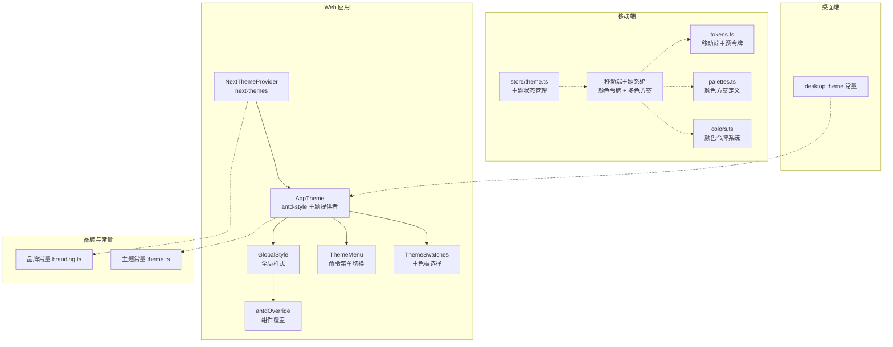
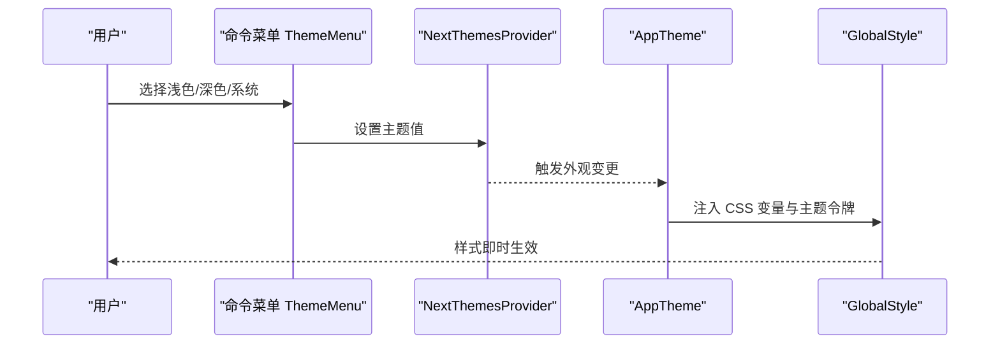
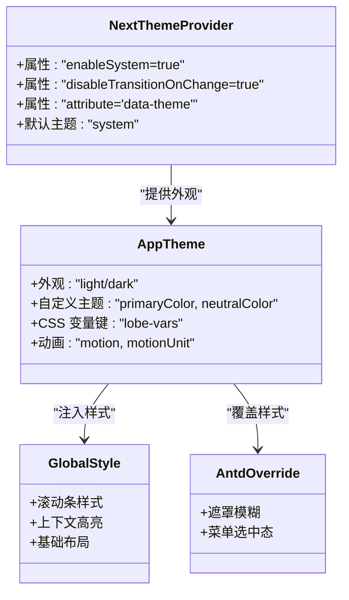
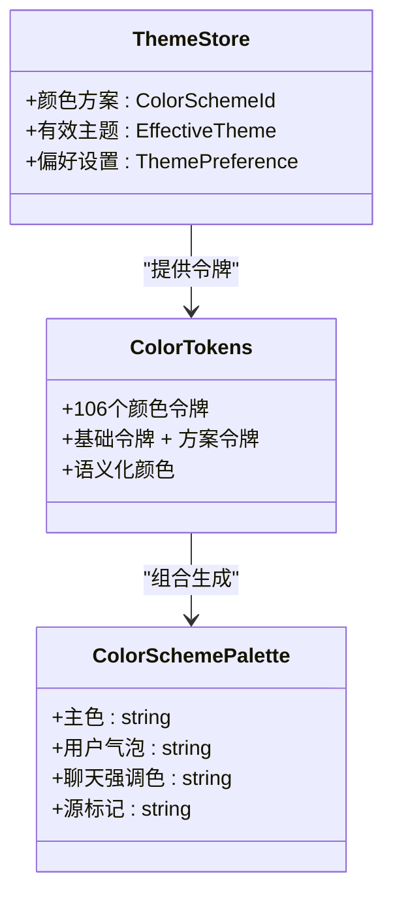
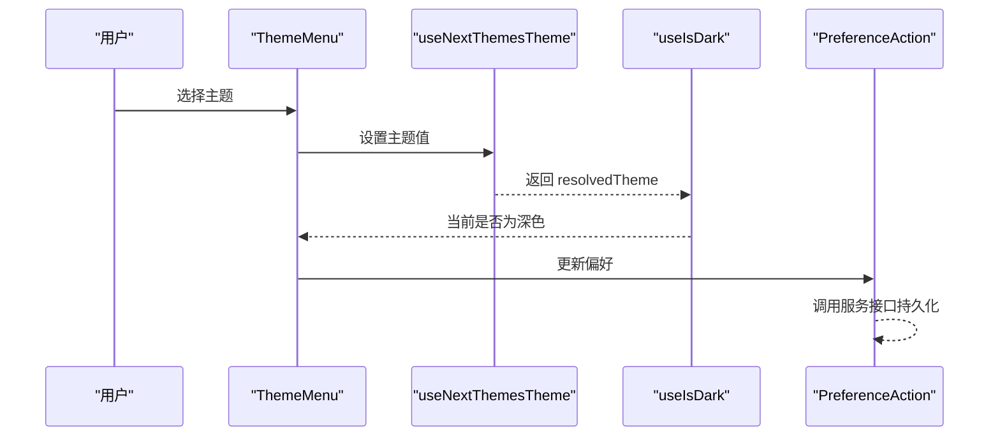
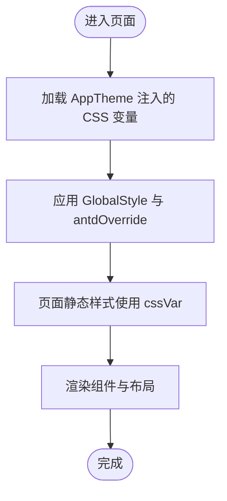
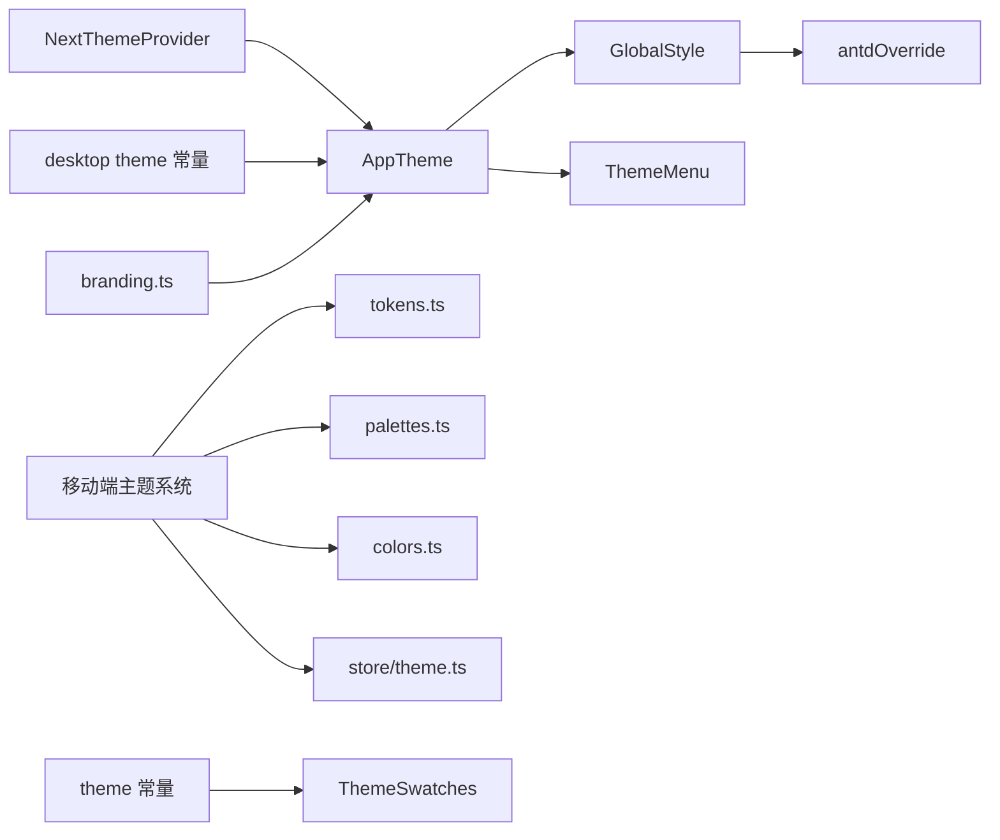

# 主题系统

<cite>
**本文引用的文件**
- [packages/const/src/theme.ts](file://packages/const/src/theme.ts)
- [apps/desktop/src/main/const/theme.ts](file://apps/desktop/src/main/const/theme.ts)
- [packages/business/const/src/branding.ts](file://packages/business/const/src/branding.ts)
- [src/layout/GlobalProvider/NextThemeProvider.tsx](file://src/layout/GlobalProvider/NextThemeProvider.tsx)
- [src/layout/GlobalProvider/AppTheme.tsx](file://src/layout/GlobalProvider/AppTheme.tsx)
- [src/styles/index.ts](file://src/styles/index.ts)
- [src/styles/global.ts](file://src/styles/global.ts)
- [src/styles/antdOverride.ts](file://src/styles/antdOverride.ts)
- [src/features/CommandMenu/ThemeMenu.tsx](file://src/features/CommandMenu/ThemeMenu.tsx)
- [apps/mobile/src/theme/colors.ts](file://apps/mobile/src/theme/colors.ts)
- [apps/mobile/src/theme/palettes.ts](file://apps/mobile/src/theme/palettes.ts)
- [apps/mobile/src/theme/tokens.ts](file://apps/mobile/src/theme/tokens.ts)
- [apps/mobile/src/store/theme.ts](file://apps/mobile/src/store/theme.ts)
- [src/routes/(main)/settings/common/features/Appearance/ThemeSwatches/ThemeSwatchesPrimary.tsx](file://src/routes/(main)/settings/common/features/Appearance/ThemeSwatches/ThemeSwatchesPrimary.tsx)
- [src/routes/(main)/settings/common/features/Appearance/ThemeSwatches/index.ts](file://src/routes/(main)/settings/common/features/Appearance/ThemeSwatches/index.ts)
- [src/hooks/useIsDark.ts](file://src/hooks/useIsDark.ts)
- [public/not-compatible.html](file://public/not-compatible.html)
- [src/store/user/slices/preference/initialState.ts](file://src/store/user/slices/preference/initialState.ts)
- [src/store/user/slices/preference/action.ts](file://src/store/user/slices/preference/action.ts)
</cite>

## 更新摘要
**所做更改**
- 新增移动端颜色令牌系统和多色方案支持章节
- 更新主题变量与样式架构，增加颜色令牌和语义化颜色系统
- 新增移动端主题存储和响应式主题钩子
- 更新品牌元素与使用规范，包含多色方案应用场景
- 新增颜色方案选择器和主题定制指南
- 更新性能考量，包含颜色令牌缓存和响应式更新

## 目录
1. [简介](#简介)
2. [项目结构](#项目结构)
3. [核心组件](#核心组件)
4. [架构总览](#架构总览)
5. [详细组件分析](#详细组件分析)
6. [依赖关系分析](#依赖关系分析)
7. [性能考量](#性能考量)
8. [故障排查指南](#故障排查指南)
9. [结论](#结论)
10. [附录](#附录)

## 简介
本文件系统性梳理 LobeHub 的主题系统设计与实现，覆盖品牌标识体系、主题切换机制、颜色系统与样式架构、主题变量的定义与使用、扩展方法与最佳实践，并给出暗色/亮色模式的实现机制、自动切换逻辑与用户偏好持久化策略。新版本引入了完整的颜色令牌系统、多色方案支持、移动端响应式主题管理和语义化颜色系统，同时提供品牌元素（Logo、水印、品牌色彩）的使用规范，以及主题系统的性能优化、缓存与动态加载建议。

## 项目结构
主题系统在多端协同工作：Web 使用 Ant Design 风格的主题与 CSS 变量，移动端使用 NativeWind 的主题令牌和颜色方案；桌面端通过常量与窗口配置参与主题行为；全局提供者负责主题上下文注入与样式初始化。新版本增加了完整的颜色令牌系统和多色方案支持。

**图表来源**
- [src/layout/GlobalProvider/NextThemeProvider.tsx:1-23](file://src/layout/GlobalProvider/NextThemeProvider.tsx#L1-L23)
- [src/layout/GlobalProvider/AppTheme.tsx:150-196](file://src/layout/GlobalProvider/AppTheme.tsx#L150-L196)
- [src/styles/index.ts:1-15](file://src/styles/index.ts#L1-L15)
- [src/styles/antdOverride.ts:1-32](file://src/styles/antdOverride.ts#L1-L32)
- [src/features/CommandMenu/ThemeMenu.tsx:15-56](file://src/features/CommandMenu/ThemeMenu.tsx#L15-L56)
- [apps/mobile/src/theme/tokens.ts:1-72](file://apps/mobile/src/theme/tokens.ts#L1-L72)
- [apps/mobile/src/theme/palettes.ts:1-361](file://apps/mobile/src/theme/palettes.ts#L1-L361)
- [apps/mobile/src/theme/colors.ts:1-470](file://apps/mobile/src/theme/colors.ts#L1-L470)
- [apps/mobile/src/store/theme.ts:1-81](file://apps/mobile/src/store/theme.ts#L1-L81)
- [apps/desktop/src/main/const/theme.ts:1-9](file://apps/desktop/src/main/const/theme.ts#L1-L9)
- [packages/business/const/src/branding.ts:1-41](file://packages/business/const/src/branding.ts#L1-L41)
- [packages/const/src/theme.ts:1-4](file://packages/const/src/theme.ts#L1-L4)

**章节来源**
- [src/layout/GlobalProvider/NextThemeProvider.tsx:1-23](file://src/layout/GlobalProvider/NextThemeProvider.tsx#L1-L23)
- [src/layout/GlobalProvider/AppTheme.tsx:150-196](file://src/layout/GlobalProvider/AppTheme.tsx#L150-L196)
- [src/styles/index.ts:1-15](file://src/styles/index.ts#L1-L15)
- [src/styles/global.ts:1-70](file://src/styles/global.ts#L1-L70)
- [src/styles/antdOverride.ts:1-32](file://src/styles/antdOverride.ts#L1-L32)
- [src/features/CommandMenu/ThemeMenu.tsx:15-56](file://src/features/CommandMenu/ThemeMenu.tsx#L15-L56)
- [apps/mobile/src/theme/tokens.ts:1-72](file://apps/mobile/src/theme/tokens.ts#L1-L72)
- [apps/mobile/src/theme/palettes.ts:1-361](file://apps/mobile/src/theme/palettes.ts#L1-L361)
- [apps/mobile/src/theme/colors.ts:1-470](file://apps/mobile/src/theme/colors.ts#L1-L470)
- [apps/mobile/src/store/theme.ts:1-81](file://apps/mobile/src/store/theme.ts#L1-L81)
- [apps/desktop/src/main/const/theme.ts:1-9](file://apps/desktop/src/main/const/theme.ts#L1-L9)
- [packages/business/const/src/branding.ts:1-41](file://packages/business/const/src/branding.ts#L1-L41)
- [packages/const/src/theme.ts:1-4](file://packages/const/src/theme.ts#L1-L4)

## 核心组件
- **主题提供者与切换**
  - Web 端通过 NextThemesProvider 管理系统/浅色/深色主题，默认启用系统感知；AppTheme 将 antd-style 的主题与 CSS 变量注入到应用树中。
  - 移动端通过 NativeWind 的 useColorScheme 与 setColorScheme 实现主题选择，支持多色方案切换。
  - 桌面端通过常量控制背景与符号颜色，辅助主题切换体验。
- **颜色令牌系统**
  - 移动端引入完整的颜色令牌系统，定义 106 个颜色令牌，涵盖背景、边框、文本、操作状态等所有 UI 元素。
  - 支持 8 种颜色方案：amber、blue、dustBlue、green、rose、sage、slate、violet。
  - 提供语义化颜色系统，将功能颜色抽象为 border、danger、primary、surface 等语义化令牌。
- **样式与主题变量**
  - GlobalStyle 聚合全局与 antd 覆盖样式，使用 cssVar 注入主题变量。
  - antdOverride 对特定组件进行遮罩模糊、层级等覆盖。
- **品牌与主题常量**
  - 品牌名称、Logo、社交链接等由品牌常量统一管理。
  - 主题常量定义主色与中性色键名，供主题选择器使用。
- **用户偏好与持久化**
  - 用户偏好存储在本地状态中，更新后通过服务接口同步至后端。

**章节来源**
- [src/layout/GlobalProvider/NextThemeProvider.tsx:10-22](file://src/layout/GlobalProvider/NextThemeProvider.tsx#L10-L22)
- [src/layout/GlobalProvider/AppTheme.tsx:150-196](file://src/layout/GlobalProvider/AppTheme.tsx#L150-L196)
- [src/styles/index.ts:1-15](file://src/styles/index.ts#L1-L15)
- [src/styles/antdOverride.ts:1-32](file://src/styles/antdOverride.ts#L1-L32)
- [apps/desktop/src/main/const/theme.ts:1-9](file://apps/desktop/src/main/const/theme.ts#L1-L9)
- [packages/business/const/src/branding.ts:1-41](file://packages/business/const/src/branding.ts#L1-L41)
- [packages/const/src/theme.ts:1-4](file://packages/const/src/theme.ts#L1-L4)
- [src/store/user/slices/preference/initialState.ts:11-13](file://src/store/user/slices/preference/initialState.ts#L11-L13)
- [src/store/user/slices/preference/action.ts:36-42](file://src/store/user/slices/preference/action.ts#L36-L42)
- [apps/mobile/src/theme/colors.ts:1-470](file://apps/mobile/src/theme/colors.ts#L1-L470)
- [apps/mobile/src/theme/palettes.ts:1-361](file://apps/mobile/src/theme/palettes.ts#L1-L361)
- [apps/mobile/src/store/theme.ts:1-81](file://apps/mobile/src/store/theme.ts#L1-L81)

## 架构总览
主题系统采用"提供者 + 全局样式 + 组件级选择"的分层架构。Web 端以 antd-style 为核心，结合 CSS 变量与全局样式；移动端以 NativeWind 令牌和颜色方案为中心；桌面端以常量与窗口配置参与主题一致性；品牌与主题常量贯穿全局。新版本增加了颜色令牌系统和多色方案支持。

**图表来源**
- [src/features/CommandMenu/ThemeMenu.tsx:15-56](file://src/features/CommandMenu/ThemeMenu.tsx#L15-L56)
- [src/layout/GlobalProvider/NextThemeProvider.tsx:10-22](file://src/layout/GlobalProvider/NextThemeProvider.tsx#L10-L22)
- [src/layout/GlobalProvider/AppTheme.tsx:150-196](file://src/layout/GlobalProvider/AppTheme.tsx#L150-L196)
- [src/styles/index.ts:1-15](file://src/styles/index.ts#L1-L15)

## 详细组件分析

### Web 主题提供与样式注入
- **NextThemesProvider**
  - 启用系统主题感知，禁用过渡切换，使用 data-theme 属性驱动 DOM 主题。
- **AppTheme**
  - 将当前外观映射为 light/dark，注入自定义主题（主色、中性色），并设置 CSS 变量键名与动画参数。
  - 通过 ConfigProvider 注入 UI 资源与链接组件，确保全局一致。
- **GlobalStyle 与 antdOverride**
  - GlobalStyle 定义滚动条、输入行为、上下文高亮等基础样式，并使用 token 与 cssVar。
  - antdOverride 对模态/抽屉遮罩、菜单选中态等进行覆盖，提升视觉一致性。

**图表来源**
- [src/layout/GlobalProvider/NextThemeProvider.tsx:10-22](file://src/layout/GlobalProvider/NextThemeProvider.tsx#L10-L22)
- [src/layout/GlobalProvider/AppTheme.tsx:150-196](file://src/layout/GlobalProvider/AppTheme.tsx#L150-L196)
- [src/styles/index.ts:1-15](file://src/styles/index.ts#L1-L15)
- [src/styles/global.ts:1-70](file://src/styles/global.ts#L1-L70)
- [src/styles/antdOverride.ts:1-32](file://src/styles/antdOverride.ts#L1-L32)

**章节来源**
- [src/layout/GlobalProvider/NextThemeProvider.tsx:10-22](file://src/layout/GlobalProvider/NextThemeProvider.tsx#L10-L22)
- [src/layout/GlobalProvider/AppTheme.tsx:150-196](file://src/layout/GlobalProvider/AppTheme.tsx#L150-L196)
- [src/styles/index.ts:1-15](file://src/styles/index.ts#L1-L15)
- [src/styles/global.ts:1-70](file://src/styles/global.ts#L1-L70)
- [src/styles/antdOverride.ts:1-32](file://src/styles/antdOverride.ts#L1-L32)

### 移动端颜色令牌系统
- **颜色令牌定义**
  - 定义 106 个颜色令牌，涵盖背景、边框、文本、操作状态、UI 模式等所有 UI 元素。
  - 包括基础令牌（light/dark）和颜色方案令牌的组合。
- **颜色方案系统**
  - 支持 8 种颜色方案：amber、blue、dustBlue、green、rose、sage、slate、violet。
  - 每种颜色方案包含主色、用户气泡、聊天强调色、源标记等完整配色。
  - 深色模式下提供更明亮的颜色变体，确保可读性。
- **语义化颜色系统**
  - 提供语义化颜色对象，包含 border、danger、primary、surface 等常用语义化颜色。
  - 支持响应式钩子 useThemeColors() 和 useSemanticColors() 实时更新。

**图表来源**
- [apps/mobile/src/theme/colors.ts:1-470](file://apps/mobile/src/theme/colors.ts#L1-L470)
- [apps/mobile/src/theme/palettes.ts:1-361](file://apps/mobile/src/theme/palettes.ts#L1-L361)
- [apps/mobile/src/store/theme.ts:1-81](file://apps/mobile/src/store/theme.ts#L1-L81)

**章节来源**
- [apps/mobile/src/theme/colors.ts:1-470](file://apps/mobile/src/theme/colors.ts#L1-L470)
- [apps/mobile/src/theme/palettes.ts:1-361](file://apps/mobile/src/theme/palettes.ts#L1-L361)
- [apps/mobile/src/theme/tokens.ts:1-72](file://apps/mobile/src/theme/tokens.ts#L1-L72)
- [apps/mobile/src/store/theme.ts:1-81](file://apps/mobile/src/store/theme.ts#L1-L81)

### 主题切换与自动模式
- **命令菜单切换**
  - 提供浅色、深色、系统三种选项，当前主题高亮显示。
- **自动切换逻辑**
  - 通过 useIsDark 获取 resolvedTheme 并映射为当前外观；NextThemesProvider 默认使用系统主题。
- **用户偏好保存**
  - 用户偏好 slice 支持合并更新并调用服务接口持久化。

**图表来源**
- [src/features/CommandMenu/ThemeMenu.tsx:15-56](file://src/features/CommandMenu/ThemeMenu.tsx#L15-L56)
- [src/hooks/useIsDark.ts:7-11](file://src/hooks/useIsDark.ts#L7-L11)
- [src/store/user/slices/preference/action.ts:36-42](file://src/store/user/slices/preference/action.ts#L36-L42)

**章节来源**
- [src/features/CommandMenu/ThemeMenu.tsx:15-56](file://src/features/CommandMenu/ThemeMenu.tsx#L15-L56)
- [src/hooks/useIsDark.ts:7-11](file://src/hooks/useIsDark.ts#L7-L11)
- [src/store/user/slices/preference/action.ts:36-42](file://src/store/user/slices/preference/action.ts#L36-L42)

### 主题变量与样式架构
- **CSS 变量与 antd-token**
  - AppTheme 通过 theme.token 与 cssVar 键将主题令牌注入到全局样式中，组件通过 cssVar 引用。
- **全局样式与覆盖**
  - GlobalStyle 定义基础布局与交互细节；antdOverride 针对特定组件进行视觉增强。
- **页面级样式**
  - 多个页面布局通过 createStaticStyles 使用 cssVar，保证在不同主题下背景、边框、文本等保持一致语义。

**图表来源**
- [src/layout/GlobalProvider/AppTheme.tsx:150-196](file://src/layout/GlobalProvider/AppTheme.tsx#L150-L196)
- [src/styles/index.ts:1-15](file://src/styles/index.ts#L1-L15)
- [src/styles/global.ts:1-70](file://src/styles/global.ts#L1-L70)
- [src/styles/antdOverride.ts:1-32](file://src/styles/antdOverride.ts#L1-L32)

**章节来源**
- [src/layout/GlobalProvider/AppTheme.tsx:150-196](file://src/layout/GlobalProvider/AppTheme.tsx#L150-L196)
- [src/styles/index.ts:1-15](file://src/styles/index.ts#L1-L15)
- [src/styles/global.ts:1-70](file://src/styles/global.ts#L1-L70)
- [src/styles/antdOverride.ts:1-32](file://src/styles/antdOverride.ts#L1-L32)

### 主题定制指南
- **颜色方案**
  - 主色与中性色通过 ThemeSwatchesPrimary 与主题常量键名组合，支持默认与多种预设色。
  - AppTheme 接收 customTheme.primaryColor 与 customTheme.neutralColor，优先使用用户选择，否则回退默认。
  - 移动端支持 8 种颜色方案，每种方案提供完整的配色系统。
- **字体系统**
  - 通过 theme.token.fontFamily 注入自定义字体，若未设置则使用默认 antd 字体。
- **间距与圆角**
  - 移动端使用 tokens.ts 定义间距、半径、图标尺寸与不透明度，保证跨平台一致。
- **断点与布局**
  - 全局样式基于视口单位与媒体查询适配不同设备，避免滚动与溢出问题。

**章节来源**
- [src/routes/(main)/settings/common/features/Appearance/ThemeSwatches/ThemeSwatchesPrimary.tsx](file://src/routes/(main)/settings/common/features/Appearance/ThemeSwatches/ThemeSwatchesPrimary.tsx#L14-L81)
- [packages/const/src/theme.ts:1-4](file://packages/const/src/theme.ts#L1-L4)
- [src/layout/GlobalProvider/AppTheme.tsx:150-196](file://src/layout/GlobalProvider/AppTheme.tsx#L150-L196)
- [apps/mobile/src/theme/tokens.ts:1-72](file://apps/mobile/src/theme/tokens.ts#L1-L72)
- [src/styles/global.ts:1-70](file://src/styles/global.ts#L1-L70)

### 品牌元素与使用规范
- **品牌名称与标识**
  - 品牌常量集中管理品牌名、Logo URL、组织名、版权信息等，便于统一与扩展。
- **品牌色彩应用场景**
  - 主色用于强调、按钮、高亮状态；中性色用于背景、边框、文本分层。
  - 在暗色模式下，符号颜色与背景对比度需满足可读性要求。
  - 新版本支持多色方案，品牌色彩可应用于不同的颜色方案中。

**章节来源**
- [packages/business/const/src/branding.ts:1-41](file://packages/business/const/src/branding.ts#L1-L41)
- [apps/desktop/src/main/const/theme.ts:1-9](file://apps/desktop/src/main/const/theme.ts#L1-L9)

### 暗色/亮色模式与自动切换
- **模式实现**
  - NextThemesProvider 默认启用系统主题；AppTheme 将 resolvedTheme 映射为 appearance。
  - useIsDark 便捷判断当前是否为深色。
- **自动切换逻辑**
  - 系统主题变化时，NextThemesProvider 会触发外观更新，AppTheme 重新注入样式。
- **用户偏好保存**
  - 用户在界面选择后，偏好通过 PreferenceAction 合并与持久化。

**章节来源**
- [src/layout/GlobalProvider/NextThemeProvider.tsx:10-22](file://src/layout/GlobalProvider/NextThemeProvider.tsx#L10-L22)
- [src/layout/GlobalProvider/AppTheme.tsx:150-196](file://src/layout/GlobalProvider/AppTheme.tsx#L150-L196)
- [src/hooks/useIsDark.ts:7-11](file://src/hooks/useIsDark.ts#L7-L11)
- [src/store/user/slices/preference/action.ts:36-42](file://src/store/user/slices/preference/action.ts#L36-L42)

### 移动端主题选择
- **NativeWind 集成**
  - 使用 useColorScheme 与 setColorScheme 控制主题；移动端提供颜色方案选择器。
- **主题令牌**
  - tokens.ts 定义移动端间距、圆角、图标宽度与字重，保证一致的视觉节奏。
- **响应式主题钩子**
  - useThemeColors() 提供响应式主题颜色，自动监听主题和颜色方案变化。
  - useSemanticColors() 提供语义化颜色对象。

**章节来源**
- [apps/mobile/src/theme/tokens.ts:1-72](file://apps/mobile/src/theme/tokens.ts#L1-L72)
- [apps/mobile/src/theme/colors.ts:446-470](file://apps/mobile/src/theme/colors.ts#L446-L470)
- [apps/mobile/src/store/theme.ts:1-81](file://apps/mobile/src/store/theme.ts#L1-L81)

### 桌面端主题常量
- **背景与符号颜色**
  - 桌面端常量定义深色/浅色背景与符号颜色，配合窗口配置与切换延迟，提升切换体验。

**章节来源**
- [apps/desktop/src/main/const/theme.ts:1-9](file://apps/desktop/src/main/const/theme.ts#L1-L9)

### HTML 兼容页主题变量
- **降级样式**
  - 不兼容页通过 CSS 变量定义文本、填充、边框与背景，确保在受限环境下仍具可读性与一致性。

**章节来源**
- [public/not-compatible.html:35-81](file://public/not-compatible.html#L35-L81)

## 依赖关系分析
- **组件耦合**
  - NextThemeProvider 与 AppTheme 高内聚，共同决定主题外观与样式注入。
  - GlobalStyle 与 antdOverride 低耦合，分别承担全局与覆盖职责。
- **外部依赖**
  - next-themes 提供系统主题感知与切换；antd-style 提供主题令牌与 CSS 变量；NativeWind 提供移动端主题令牌。
- **用户偏好**
  - PreferenceAction 与服务接口解耦，便于替换或扩展持久化策略。
- **移动端依赖**
  - 颜色令牌系统依赖 zustand 进行状态管理，提供响应式主题更新。

**图表来源**
- [src/layout/GlobalProvider/NextThemeProvider.tsx:10-22](file://src/layout/GlobalProvider/NextThemeProvider.tsx#L10-L22)
- [src/layout/GlobalProvider/AppTheme.tsx:150-196](file://src/layout/GlobalProvider/AppTheme.tsx#L150-L196)
- [src/styles/index.ts:1-15](file://src/styles/index.ts#L1-L15)
- [src/styles/antdOverride.ts:1-32](file://src/styles/antdOverride.ts#L1-L32)
- [src/features/CommandMenu/ThemeMenu.tsx:15-56](file://src/features/CommandMenu/ThemeMenu.tsx#L15-L56)
- [apps/mobile/src/theme/tokens.ts:1-72](file://apps/mobile/src/theme/tokens.ts#L1-L72)
- [apps/mobile/src/theme/palettes.ts:1-361](file://apps/mobile/src/theme/palettes.ts#L1-L361)
- [apps/mobile/src/theme/colors.ts:1-470](file://apps/mobile/src/theme/colors.ts#L1-L470)
- [apps/mobile/src/store/theme.ts:1-81](file://apps/mobile/src/store/theme.ts#L1-L81)
- [apps/desktop/src/main/const/theme.ts:1-9](file://apps/desktop/src/main/const/theme.ts#L1-L9)
- [packages/business/const/src/branding.ts:1-41](file://packages/business/const/src/branding.ts#L1-L41)
- [packages/const/src/theme.ts:1-4](file://packages/const/src/theme.ts#L1-L4)

**章节来源**
- [src/layout/GlobalProvider/NextThemeProvider.tsx:10-22](file://src/layout/GlobalProvider/NextThemeProvider.tsx#L10-L22)
- [src/layout/GlobalProvider/AppTheme.tsx:150-196](file://src/layout/GlobalProvider/AppTheme.tsx#L150-L196)
- [src/styles/index.ts:1-15](file://src/styles/index.ts#L1-L15)
- [src/styles/antdOverride.ts:1-32](file://src/styles/antdOverride.ts#L1-L32)
- [src/features/CommandMenu/ThemeMenu.tsx:15-56](file://src/features/CommandMenu/ThemeMenu.tsx#L15-L56)
- [apps/mobile/src/theme/tokens.ts:1-72](file://apps/mobile/src/theme/tokens.ts#L1-L72)
- [apps/mobile/src/theme/palettes.ts:1-361](file://apps/mobile/src/theme/palettes.ts#L1-L361)
- [apps/mobile/src/theme/colors.ts:1-470](file://apps/mobile/src/theme/colors.ts#L1-L470)
- [apps/mobile/src/store/theme.ts:1-81](file://apps/mobile/src/store/theme.ts#L1-L81)
- [apps/desktop/src/main/const/theme.ts:1-9](file://apps/desktop/src/main/const/theme.ts#L1-L9)
- [packages/business/const/src/branding.ts:1-41](file://packages/business/const/src/branding.ts#L1-L41)
- [packages/const/src/theme.ts:1-4](file://packages/const/src/theme.ts#L1-L4)

## 性能考量
- **样式注入与重绘**
  - 使用 CSS 变量与 antd-style 的 token，减少运行时计算与重排；GlobalStyle 仅在首次注入。
- **切换体验**
  - NextThemesProvider 禁用过渡切换，避免闪烁；桌面端常量提供切换延迟常量，便于统一体验。
- **动画与性能**
  - AppTheme 根据用户设置调整动画强度与单位，兼顾流畅与性能。
- **缓存策略**
  - 用户偏好持久化于本地状态并同步至服务端，减少重复请求；全局样式与覆盖按需加载。
- **移动端性能优化**
  - 颜色令牌系统使用响应式钩子，仅在主题或颜色方案变化时重新渲染。
  - 颜色方案缓存避免重复计算，提高渲染性能。
- **内存管理**
  - 主题状态使用 zustand 管理，支持持久化存储，减少内存占用。

**章节来源**
- [src/layout/GlobalProvider/NextThemeProvider.tsx:10-22](file://src/layout/GlobalProvider/NextThemeProvider.tsx#L10-L22)
- [src/layout/GlobalProvider/AppTheme.tsx:150-196](file://src/layout/GlobalProvider/AppTheme.tsx#L150-L196)
- [apps/desktop/src/main/const/theme.ts:8-8](file://apps/desktop/src/main/const/theme.ts#L8-L8)
- [apps/mobile/src/theme/colors.ts:446-470](file://apps/mobile/src/theme/colors.ts#L446-L470)
- [apps/mobile/src/store/theme.ts:1-81](file://apps/mobile/src/store/theme.ts#L1-L81)

## 故障排查指南
- **主题未生效**
  - 检查 NextThemeProvider 是否包裹根节点；确认 AppTheme 的 appearance 与 customTheme 是否正确传入。
- **样式异常**
  - 检查 GlobalStyle 与 antdOverride 的顺序与作用域；确认 cssVar 键名一致。
- **移动端主题不一致**
  - 确认 useColorScheme 与 setColorScheme 的使用；检查 tokens.ts 的值是否符合预期。
  - 检查颜色令牌系统是否正确初始化，颜色方案是否正确应用。
- **颜色令牌错误**
  - 确认颜色令牌定义是否完整，颜色方案是否正确映射。
  - 检查 useThemeColors() 钩子是否正确监听主题变化。
- **自动切换无效**
  - 确认系统主题设置；检查 useIsDark 的返回值与 AppTheme 的外观映射。
- **偏好未保存**
  - 检查 PreferenceAction 的合并逻辑与服务接口调用；确认本地状态更新与网络请求成功。

**章节来源**
- [src/layout/GlobalProvider/NextThemeProvider.tsx:10-22](file://src/layout/GlobalProvider/NextThemeProvider.tsx#L10-L22)
- [src/layout/GlobalProvider/AppTheme.tsx:150-196](file://src/layout/GlobalProvider/AppTheme.tsx#L150-L196)
- [src/styles/index.ts:1-15](file://src/styles/index.ts#L1-L15)
- [src/styles/antdOverride.ts:1-32](file://src/styles/antdOverride.ts#L1-L32)
- [apps/mobile/src/theme/tokens.ts:1-72](file://apps/mobile/src/theme/tokens.ts#L1-L72)
- [apps/mobile/src/theme/palettes.ts:1-361](file://apps/mobile/src/theme/palettes.ts#L1-L361)
- [apps/mobile/src/theme/colors.ts:1-470](file://apps/mobile/src/theme/colors.ts#L1-L470)
- [apps/mobile/src/store/theme.ts:1-81](file://apps/mobile/src/store/theme.ts#L1-L81)
- [src/hooks/useIsDark.ts:7-11](file://src/hooks/useIsDark.ts#L7-L11)
- [src/store/user/slices/preference/action.ts:36-42](file://src/store/user/slices/preference/action.ts#L36-L42)

## 结论
LobeHub 的主题系统以 antd-style 为核心，结合 CSS 变量与全局样式，实现了跨端一致的主题体验。新版本引入了完整的颜色令牌系统、多色方案支持和移动端响应式主题管理，形成了更加完善的主题架构。通过 NextThemesProvider 的系统感知与 AppTheme 的定制注入，辅以移动端 NativeWind 令牌、颜色方案和主题状态管理，形成完整且可扩展的主题架构。品牌常量与主题常量统一管理，确保视觉语言的一致性。用户偏好持久化与自动切换逻辑完善，为最终用户提供顺滑的个性化体验。

## 附录
- **最佳实践**
  - 优先使用 cssVar 与 token，避免硬编码颜色；在覆盖样式时最小化范围。
  - 移动端与桌面端分别维护主题令牌与常量，保持独立可控。
  - 将品牌元素与主题常量集中管理，便于迭代与合规。
  - 新增颜色令牌时，先在颜色令牌系统中定义，再在组件中使用。
  - 使用语义化颜色系统，避免直接使用具体颜色值。
- **扩展建议**
  - 新增主题变量时，先在 AppTheme 中声明，再在 GlobalStyle 与组件中使用。
  - 自定义主色时，确保与中性色搭配满足无障碍可读性。
  - 对复杂页面样式，优先使用 createStaticStyles 与 cssVar，减少条件分支。
  - 移动端新增颜色方案时，需要同时更新 palettes.ts 和 colors.ts。
  - 颜色令牌系统扩展时，确保所有相关组件都使用响应式钩子。