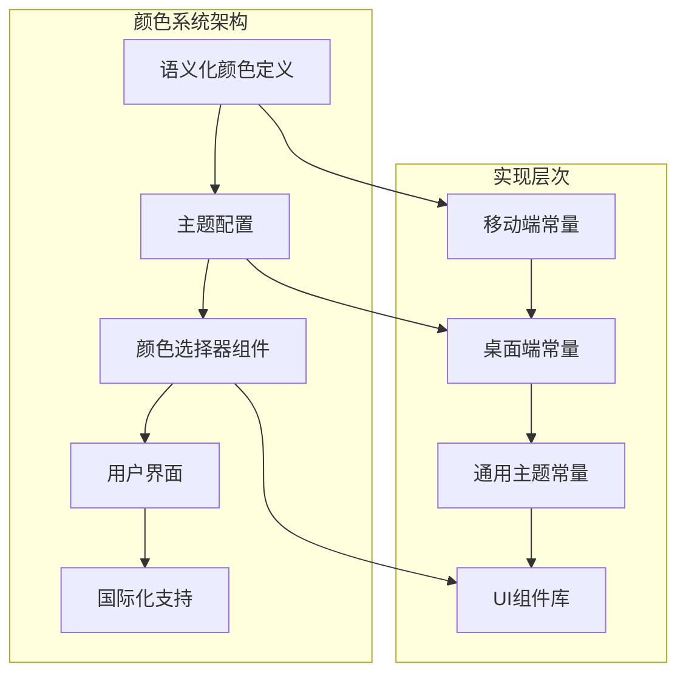
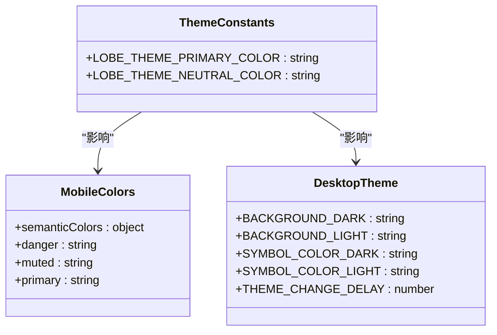
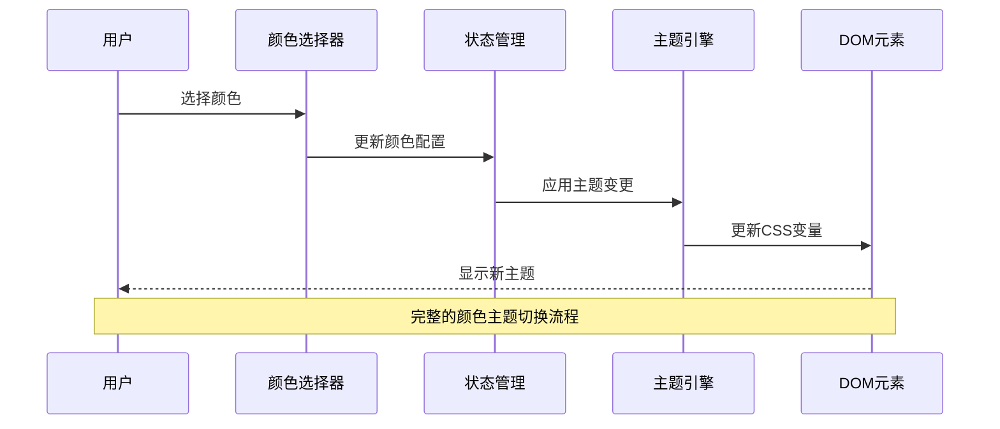
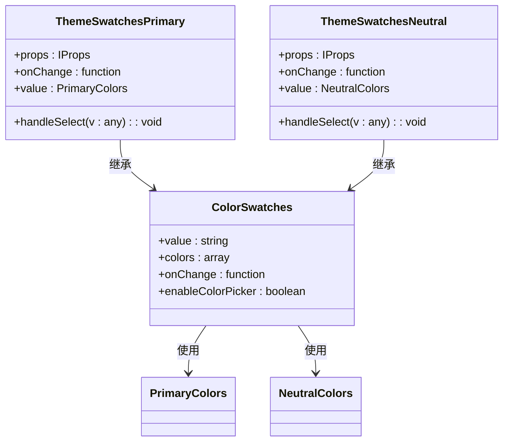
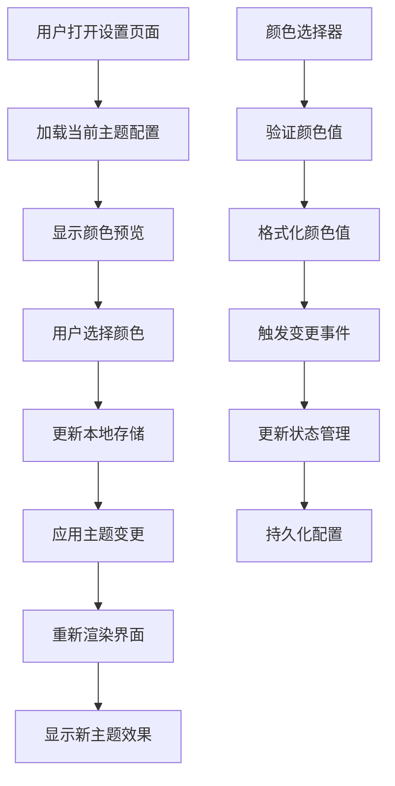

# 语义化颜色系统

<cite>
**本文档引用的文件**
- [apps/mobile/src/constants/colors.ts](file://apps/mobile/src/constants/colors.ts)
- [packages/const/src/theme.ts](file://packages/const/src/theme.ts)
- [apps/desktop/src/main/const/theme.ts](file://apps/desktop/src/main/const/theme.ts)
- [src/routes/(main)/settings/common/features/Appearance/index.tsx](file://src/routes/(main)/settings/common/features/Appearance/index.tsx)
- [src/routes/(main)/settings/common/features/Appearance/ThemeSwatches/ThemeSwatchesPrimary.tsx](file://src/routes/(main)/settings/common/features/Appearance/ThemeSwatches/ThemeSwatchesPrimary.tsx)
- [src/routes/(main)/settings/common/features/Appearance/ThemeSwatches/ThemeSwatchesNeutral.tsx](file://src/routes/(main)/settings/common/features/Appearance/ThemeSwatches/ThemeSwatchesNeutral.tsx)
- [src/features/AgentSetting/AgentMeta/BackgroundSwatches.tsx](file://src/features/AgentSetting/AgentMeta/BackgroundSwatches.tsx)
- [src/locales/default/color.ts](file://src/locales/default/color.ts)
</cite>

## 目录

1. [简介](#简介)
2. [项目结构](#项目结构)
3. [核心组件](#核心组件)
4. [架构概览](#架构概览)
5. [详细组件分析](#详细组件分析)
6. [依赖关系分析](#依赖关系分析)
7. [性能考虑](#性能考虑)
8. [故障排除指南](#故障排除指南)
9. [结论](#结论)

## 简介

语义化颜色系统是现代前端开发中的重要组成部分，它通过为颜色赋予明确的语义含义来提升用户体验和设计一致性。本系统在 LobeHub 项目中实现了完整的颜色管理机制，包括语义化颜色定义、主题切换、颜色选择器组件以及国际化支持。

该系统的核心目标是提供一套统一的颜色管理方案，让用户能够轻松地自定义应用的主题颜色，同时确保颜色使用的一致性和可维护性。

## 项目结构

项目的颜色系统采用模块化设计，分布在多个目录中：



**图表来源**

- [apps/mobile/src/constants/colors.ts:1-6](file://apps/mobile/src/constants/colors.ts#L1-L6)
- [packages/const/src/theme.ts:1-4](file://packages/const/src/theme.ts#L1-L4)
- [apps/desktop/src/main/const/theme.ts:1-9](file://apps/desktop/src/main/const/theme.ts#L1-L9)

**章节来源**

- [apps/mobile/src/constants/colors.ts:1-6](file://apps/mobile/src/constants/colors.ts#L1-L6)
- [packages/const/src/theme.ts:1-4](file://packages/const/src/theme.ts#L1-L4)
- [apps/desktop/src/main/const/theme.ts:1-9](file://apps/desktop/src/main/const/theme.ts#L1-L9)

## 核心组件

### 语义化颜色定义

系统提供了基础的语义化颜色定义，用于标识关键状态和功能：

| 颜色键  | 值      | 用途           |
| ------- | ------- | -------------- |
| danger  | #ff3b30 | 危险、错误状态 |
| muted   | #8c8c8c | 柔和、次要状态 |
| primary | #007aff | 主要品牌颜色   |

### 主题常量定义

系统定义了主题相关的常量，用于统一管理主题配置：



**图表来源**

- [packages/const/src/theme.ts:1-4](file://packages/const/src/theme.ts#L1-L4)
- [apps/mobile/src/constants/colors.ts:1-6](file://apps/mobile/src/constants/colors.ts#L1-L6)
- [apps/desktop/src/main/const/theme.ts:1-9](file://apps/desktop/src/main/const/theme.ts#L1-L9)

**章节来源**

- [packages/const/src/theme.ts:1-4](file://packages/const/src/theme.ts#L1-L4)
- [apps/mobile/src/constants/colors.ts:1-6](file://apps/mobile/src/constants/colors.ts#L1-L6)
- [apps/desktop/src/main/const/theme.ts:1-9](file://apps/desktop/src/main/const/theme.ts#L1-L9)

## 架构概览

颜色系统的整体架构采用分层设计，从底层的颜色定义到上层的用户界面组件：



**图表来源**

- [src/routes/(main)/settings/common/features/Appearance/index.tsx:17-68](<file://src/routes/(main)/settings/common/features/Appearance/index.tsx#L17-L68>)
- [src/routes/(main)/settings/common/features/Appearance/ThemeSwatches/ThemeSwatchesPrimary.tsx:14-17](<file://src/routes/(main)/settings/common/features/Appearance/ThemeSwatches/ThemeSwatchesPrimary.tsx#L14-L17>)

## 详细组件分析

### 主题颜色选择器组件

系统提供了完整的主题颜色选择器组件，支持主要颜色和中性颜色的选择：



**图表来源**

- [src/routes/(main)/settings/common/features/Appearance/ThemeSwatches/ThemeSwatchesPrimary.tsx:6-17](<file://src/routes/(main)/settings/common/features/Appearance/ThemeSwatches/ThemeSwatchesPrimary.tsx#L6-L17>)
- [src/routes/(main)/settings/common/features/Appearance/ThemeSwatches/ThemeSwatchesNeutral.tsx:6-17](<file://src/routes/(main)/settings/common/features/Appearance/ThemeSwatches/ThemeSwatchesNeutral.tsx#L6-L17>)

#### 主要颜色选项

系统支持以下主要颜色选项：

| 颜色名称 | 用途         | 国际化标签 |
| -------- | ------------ | ---------- |
| default  | 默认颜色     | default    |
| red      | 危险、强调   | red        |
| orange   | 温暖、友好   | orange     |
| gold     | 金色、珍贵   | gold       |
| yellow   | 警告、注意   | yellow     |
| lime     | 生机、活力   | lime       |
| green    | 成功、安全   | green      |
| cyan     | 科技、清新   | cyan       |
| blue     | 信任、专业   | blue       |
| geekblue | 极客、科技感 | geekblue   |
| purple   | 创造力、神秘 | purple     |
| magenta  | 粉嫩、女性化 | magenta    |
| volcano  | 火山、激情   | volcano    |

#### 中性颜色选项

系统还提供了中性颜色选项：

| 颜色名称 | 用途       | 国际化标签 |
| -------- | ---------- | ---------- |
| default  | 默认中性色 | default    |
| mauve    | 李子色     | mauve      |
| olive    | 橄榄绿     | olive      |
| sage     | 鼠尾草绿   | sage       |
| sand     | 沙色       | sand       |
| slate    | 大理石灰   | slate      |

**章节来源**

- [src/routes/(main)/settings/common/features/Appearance/ThemeSwatches/ThemeSwatchesPrimary.tsx:22-75](<file://src/routes/(main)/settings/common/features/Appearance/ThemeSwatches/ThemeSwatchesPrimary.tsx#L22-L75>)
- [src/routes/(main)/settings/common/features/Appearance/ThemeSwatches/ThemeSwatchesNeutral.tsx:22-47](<file://src/routes/(main)/settings/common/features/Appearance/ThemeSwatches/ThemeSwatchesNeutral.tsx#L22-L47>)

### 颜色预览和设置界面

主设置界面集成了颜色选择功能，提供实时预览：



**图表来源**

- [src/routes/(main)/settings/common/features/Appearance/index.tsx:58-62](<file://src/routes/(main)/settings/common/features/Appearance/index.tsx#L58-L62>)

**章节来源**

- [src/routes/(main)/settings/common/features/Appearance/index.tsx:17-68](<file://src/routes/(main)/settings/common/features/Appearance/index.tsx#L17-L68>)

### 国际化颜色标签

系统为所有颜色选项提供了完整的国际化支持：

| 颜色键   | 英文标签        | 中文标签 |
| -------- | --------------- | -------- |
| blue     | Dawn Blue       | 晨曦蓝   |
| cyan     | Bright Cyan     | 亮青色   |
| default  | Default         | 默认     |
| geekblue | Geek Blue       | 极客蓝   |
| gold     | Marigold        | 万寿菊色 |
| green    | Aurora Green    | 极光绿   |
| lime     | Lime            | 柠檬黄   |
| magenta  | French Magenta  | 法国洋红 |
| mauve    | Wisteria Purple | 紫藤色   |
| olive    | Olive Green     | 橄榄绿   |
| orange   | Sunset          | 日落橙   |
| purple   | Eggplant Purple | 茄紫色   |
| red      | Twilight        | 黄昏红   |
| sage     | Sage Green      | 鼠尾草绿 |
| sand     | Beach           | 海滩色   |
| slate    | Slate Gray      | 天花板灰 |
| volcano  | Volcano         | 火山色   |
| yellow   | Sunrise         | 日出黄   |

**章节来源**

- [src/locales/default/color.ts:1-21](file://src/locales/default/color.ts#L1-L21)

## 依赖关系分析

颜色系统各组件之间的依赖关系如下：

```mermaid
graph LR
subgraph "外部依赖"
A[@lobehub/ui] --> B[ColorSwatches组件]
A --> C[findCustomThemeName函数]
A --> D[primaryColors对象]
A --> E[neutralColors对象]
end
subgraph "内部组件"
F[ThemeSwatchesPrimary] --> B
G[ThemeSwatchesNeutral] --> B
H[Appearance设置界面] --> F
H --> G
I[BackgroundSwatches] --> B
end
subgraph "配置文件"
J[semanticColors] --> K[移动端颜色]
L[theme constants] --> M[主题常量]
end
F --> J
G --> J
H --> L
I --> D
```

**图表来源**

- [src/routes/(main)/settings/common/features/Appearance/ThemeSwatches/ThemeSwatchesPrimary.tsx:1-4](<file://src/routes/(main)/settings/common/features/Appearance/ThemeSwatches/ThemeSwatchesPrimary.tsx#L1-L4>)
- [src/routes/(main)/settings/common/features/Appearance/ThemeSwatches/ThemeSwatchesNeutral.tsx:1-2](<file://src/routes/(main)/settings/common/features/Appearance/ThemeSwatches/ThemeSwatchesNeutral.tsx#L1-L2>)

**章节来源**

- [src/routes/(main)/settings/common/features/Appearance/ThemeSwatches/ThemeSwatchesPrimary.tsx:1-82](<file://src/routes/(main)/settings/common/features/Appearance/ThemeSwatches/ThemeSwatchesPrimary.tsx#L1-L82>)
- [src/routes/(main)/settings/common/features/Appearance/ThemeSwatches/ThemeSwatchesNeutral.tsx:1-53](<file://src/routes/(main)/settings/common/features/Appearance/ThemeSwatches/ThemeSwatchesNeutral.tsx#L1-L53>)

## 性能考虑

### 颜色缓存策略

系统采用了有效的颜色缓存机制来优化性能：

1. **颜色值缓存**：颜色值在组件初始化时缓存，避免重复计算
2. **翻译结果缓存**：国际化标签在组件挂载时缓存
3. **主题变更防抖**：主题变更操作进行了防抖处理，避免频繁重渲染

### 内存优化

- 使用 `memo` 包装组件，避免不必要的重渲染
- 合理的依赖数组设置，确保组件只在必要时更新
- 及时清理事件监听器和定时器

## 故障排除指南

### 常见问题及解决方案

| 问题类型           | 症状                       | 解决方案                   |
| ------------------ | -------------------------- | -------------------------- |
| 颜色不生效         | 主题切换后颜色未改变       | 检查 CSS 变量是否正确应用  |
| 颜色选择器无响应   | 点击颜色选项无反应         | 验证 onChange 事件绑定     |
| 国际化标签显示异常 | 颜色名称显示英文而非本地化 | 检查 i18n 配置和语言包加载 |
| 性能问题           | 主题切换卡顿               | 检查是否有过多的重渲染     |

### 调试技巧

1. **开发者工具检查**：使用浏览器开发者工具检查 CSS 变量的实际值
2. **控制台日志**：添加必要的日志输出来跟踪颜色变更流程
3. **组件状态检查**：验证组件的 props 和 state 是否正确传递

**章节来源**

- [src/routes/(main)/settings/common/features/Appearance/ThemeSwatches/ThemeSwatchesPrimary.tsx:14-17](<file://src/routes/(main)/settings/common/features/Appearance/ThemeSwatches/ThemeSwatchesPrimary.tsx#L14-L17>)
- [src/routes/(main)/settings/common/features/Appearance/ThemeSwatches/ThemeSwatchesNeutral.tsx:14-17](<file://src/routes/(main)/settings/common/features/Appearance/ThemeSwatches/ThemeSwatchesNeutral.tsx#L14-L17>)

## 结论

LobeHub 的语义化颜色系统通过模块化的设计和完善的架构，为用户提供了灵活且一致的主题定制体验。系统的主要优势包括：

1. **语义化设计**：颜色具有明确的业务含义，便于理解和维护
2. **组件化架构**：颜色选择器组件可复用，降低开发成本
3. **国际化支持**：完整的多语言支持，满足全球化需求
4. **性能优化**：合理的缓存和防抖机制，确保流畅的用户体验
5. **扩展性强**：易于添加新的颜色选项和主题变体

该系统为类似项目提供了优秀的参考模板，展示了如何构建一个既美观又实用的颜色管理系统。
