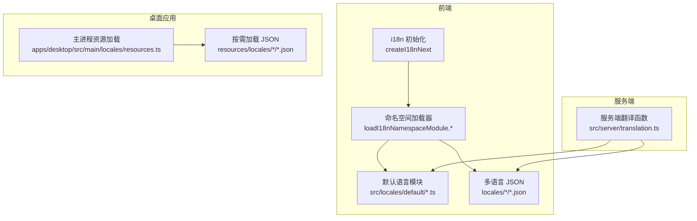
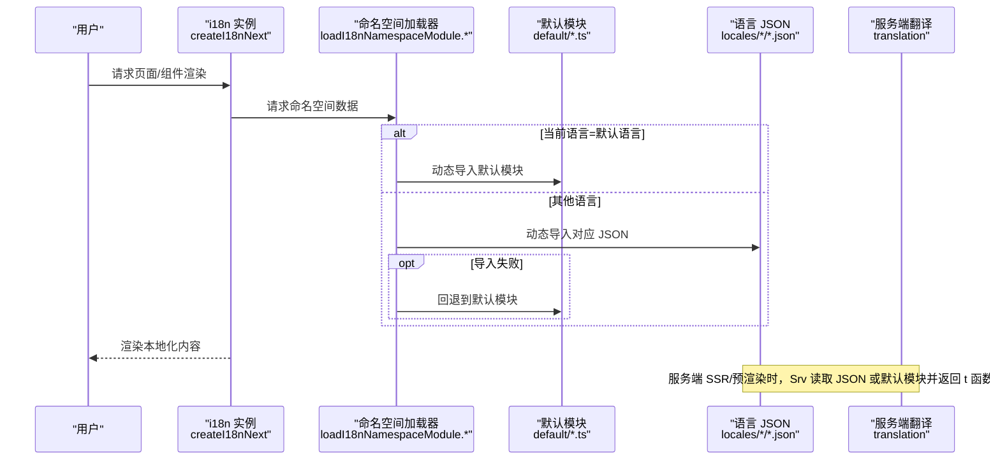
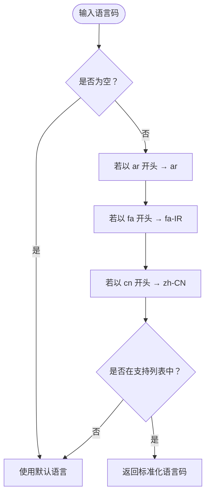
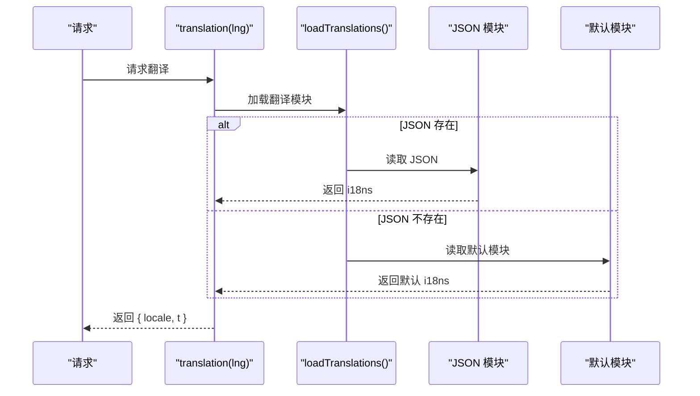
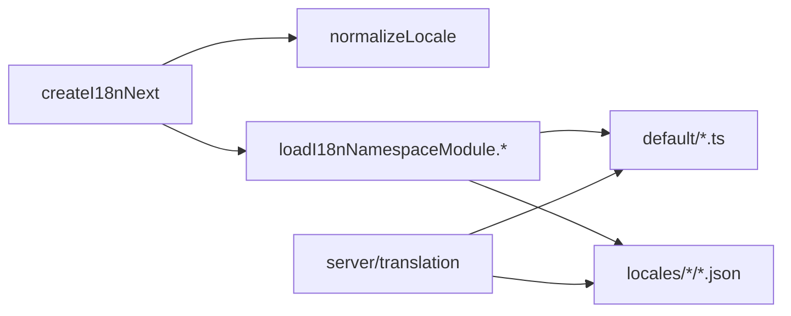

# 国际化组件

<cite>
**本文引用的文件**
- [src/locales/resources.ts](file://src/locales/resources.ts)
- [src/const/locale.ts](file://src/const/locale.ts)
- [src/locales/create.ts](file://src/locales/create.ts)
- [src/utils/i18n/loadI18nNamespaceModule.ts](file://src/utils/i18n/loadI18nNamespaceModule.ts)
- [src/utils/i18n/loadI18nNamespaceModule.vite.ts](file://src/utils/i18n/loadI18nNamespaceModule.vite.ts)
- [src/utils/i18n/loadI18nNamespaceModule.desktop.ts](file://src/utils/i18n/loadI18nNamespaceModule.desktop.ts)
- [apps/desktop/src/main/locales/resources.ts](file://apps/desktop/src/main/locales/resources.ts)
- [src/server/translation.ts](file://src/server/translation.ts)
- [src/server/translation.test.ts](file://src/server/translation.test.ts)
- [src/utils/locale.ts](file://src/utils/locale.ts)
- [src/app/[variants]/(auth)/_layout/createAuthI18n.ts](file://src/app/[variants]/(auth)/_layout/createAuthI18n.ts)
- [scripts/i18nWorkflow/analyzeUnusedKeys.ts](file://scripts/i18nWorkflow/analyzeUnusedKeys.ts)
- [.i18nrc.js](file://.i18nrc.js)
- [locales/](file://locales/)
- [public/_dangerous_local_dev_proxy.html](file://public/_dangerous_local_dev_proxy.html)
- [src/app/spa/[variants]/[[...path]]/route.ts](file://src/app/spa/[variants]/[[...path]]/route.ts)
- [src/server/sitemap.ts](file://src/server/sitemap.ts)
</cite>

## 目录

1. [简介](#简介)
2. [项目结构](#项目结构)
3. [核心组件](#核心组件)
4. [架构总览](#架构总览)
5. [组件详解](#组件详解)
6. [依赖关系分析](#依赖关系分析)
7. [性能与优化](#性能与优化)
8. [故障排查](#故障排查)
9. [结论](#结论)
10. [附录：开发与维护指南](#附录开发与维护指南)

## 简介

本文件系统性梳理 LobeHub 的国际化（i18n）组件与实现，覆盖语言切换、本地化内容渲染、命名空间按需加载、服务端 SSR / 预渲染、无障碍与 RTL 文化适配、以及翻译质量保障与测试策略。目标是帮助开发者快速理解并正确扩展多语言能力。

## 项目结构

- 语言资源组织
  - 默认语言资源位于 src/locales/default（TypeScript 模块），作为回退与开发基准。
  - 多语言资源位于 locales/<locale>/（JSON 文件），由 lobe-i18n 工具生成与维护。
- 运行时加载策略
  - Web/Vite 环境通过 import.meta.glob 静态分析与打包，提升按需加载效率。
  - Desktop 环境采用构建期全量内联，运行时同步访问，降低冷启动开销。
  - 桌面应用主进程在打包后从 resources/locales 提供 JSON 资源，支持按需加载。
- 服务端能力
  - 服务端提供翻译函数与语言解析，支持 SSR / 预渲染场景下的 SEO 与首屏内容输出。
- 开发工具链
  - .i18nrc.js 定义入口、目标语言、模板与输出规则；脚本 analyzeUnusedKeys 用于扫描未使用键，保障翻译质量。

图表来源

- [src/locales/create.ts](file://src/locales/create.ts#L18-L62)
- [src/utils/i18n/loadI18nNamespaceModule.vite.ts](file://src/utils/i18n/loadI18nNamespaceModule.vite.ts#L15-L37)
- [apps/desktop/src/main/locales/resources.ts](file://apps/desktop/src/main/locales/resources.ts#L11-L32)
- [src/server/translation.ts](file://src/server/translation.ts#L32-L52)

章节来源

- [src/locales/resources.ts](file://src/locales/resources.ts#L5-L28)
- [src/const/locale.ts](file://src/const/locale.ts#L3-L11)
- [src/locales/create.ts](file://src/locales/create.ts#L18-L62)
- [src/utils/i18n/loadI18nNamespaceModule.vite.ts](file://src/utils/i18n/loadI18nNamespaceModule.vite.ts#L6-L37)
- [src/utils/i18n/loadI18nNamespaceModule.desktop.ts](file://src/utils/i18n/loadI18nNamespaceModule.desktop.ts#L6-L36)
- [apps/desktop/src/main/locales/resources.ts](file://apps/desktop/src/main/locales/resources.ts#L11-L32)
- [src/server/translation.ts](file://src/server/translation.ts#L32-L52)

## 核心组件

- 语言集合与归一化
  - locales 列表与 normalizeLocale：统一语言代码前缀，提供默认语言与可选列表。
- i18n 初始化与检测
  - createI18nNext：集成 i18next、react-i18next、语言探测器与资源后端，动态设置 HTML dir（LTR/RTL）。
- 命名空间按需加载
  - loadI18nNamespaceModule.\*：根据环境选择静态分析或构建期内联方案，并提供回退逻辑。
- 服务端翻译与 SSR
  - translation：服务端读取 JSON 或默认模块，返回带占位符替换的翻译函数。
- 桌面端资源加载
  - desktop 资源加载器：支持 en-\* 回退到默认模块，其他语言从 resources/locales 加载。
- 语言解析与 UI 适配
  - getAntdLocale：将 ar 映射为 ar-EG，确保第三方组件本地化兼容。
- 开发配置与工作流
  - .i18nrc.js：定义翻译入口、目标语言、输出扩展名与 Markdown 翻译规则。
  - analyzeUnusedKeys：扫描未使用翻译键，辅助清理与质量控制。

章节来源

- [src/locales/resources.ts](file://src/locales/resources.ts#L5-L128)
- [src/locales/create.ts](file://src/locales/create.ts#L18-L62)
- [src/utils/i18n/loadI18nNamespaceModule.ts](file://src/utils/i18n/loadI18nNamespaceModule.ts#L8-L36)
- [src/utils/i18n/loadI18nNamespaceModule.vite.ts](file://src/utils/i18n/loadI18nNamespaceModule.vite.ts#L15-L57)
- [src/utils/i18n/loadI18nNamespaceModule.desktop.ts](file://src/utils/i18n/loadI18nNamespaceModule.desktop.ts#L18-L56)
- [apps/desktop/src/main/locales/resources.ts](file://apps/desktop/src/main/locales/resources.ts#L4-L32)
- [src/server/translation.ts](file://src/server/translation.ts#L32-L52)
- [src/utils/locale.ts](file://src/utils/locale.ts#L9-L22)
- [.i18nrc.js](file://.i18nrc.js#L5-L54)
- [scripts/i18nWorkflow/analyzeUnusedKeys.ts](file://scripts/i18nWorkflow/analyzeUnusedKeys.ts#L149-L179)

## 架构总览

下图展示从初始化到渲染的关键调用链路，涵盖 Web、桌面与服务端三类运行时：

图表来源

- [src/locales/create.ts](file://src/locales/create.ts#L18-L62)
- [src/utils/i18n/loadI18nNamespaceModule.vite.ts](file://src/utils/i18n/loadI18nNamespaceModule.vite.ts#L15-L37)
- [src/server/translation.ts](file://src/server/translation.ts#L32-L52)

## 组件详解

### 语言集合与归一化

- 归一化策略
  - 将输入语言码标准化为支持集合中的具体项，如 ar/\* → ar，fa/\* → fa-IR，cn 前缀 → zh-CN。
- 可用语言与选项
  - locales 提供完整列表；localeOptions 提供 UI 下拉选项；supportLocales 扩展 en/zh 以支持更宽松的匹配。

图表来源

- [src/locales/resources.ts](file://src/locales/resources.ts#L30-L45)

章节来源

- [src/locales/resources.ts](file://src/locales/resources.ts#L5-L128)

### i18n 初始化与语言探测

- 初始化参数
  - defaultNS、fallbackLng、initAsync、interpolation.escapeValue、keySeparator、lng。
- 语言变更事件
  - 监听 languageChanged，动态设置 document.documentElement.dir（LTR/RTL）。
- 与 UI 库适配
  - getAntdLocale 将 ar 映射为 ar-EG，确保第三方组件本地化一致。

章节来源

- [src/locales/create.ts](file://src/locales/create.ts#L18-L62)
- [src/utils/locale.ts](file://src/utils/locale.ts#L9-L22)

### 命名空间按需加载（Web/Vite）

- 静态分析
  - 使用 import.meta.glob 预收集默认与多语言模块，避免 CommonJS 动态导入问题。
- 加载策略
  - 当前语言等于默认语言时，直接加载默认模块；否则尝试对应语言 JSON；失败则回退默认模块。
- 错误处理
  - onFallback 回调允许记录错误并兜底。

章节来源

- [src/utils/i18n/loadI18nNamespaceModule.vite.ts](file://src/utils/i18n/loadI18nNamespaceModule.vite.ts#L6-L57)
- [src/utils/i18n/loadI18nNamespaceModule.ts](file://src/utils/i18n/loadI18nNamespaceModule.ts#L8-L36)

### 命名空间按需加载（Desktop）

- 构建期内联
  - eager: true 内联所有默认与多语言模块，运行时同步获取，减少冷启动与异步等待。
- 加载策略与回退
  - 与 Vite 版本一致，但模块对象直接可用，无需动态 import。

章节来源

- [src/utils/i18n/loadI18nNamespaceModule.desktop.ts](file://src/utils/i18n/loadI18nNamespaceModule.desktop.ts#L6-L56)

### 桌面端资源加载（主进程）

- 规范化与回退
  - normalizeLocale 统一语言码；en 与 en-\* 回退至默认 TypeScript 模块；其他语言从 resources/locales 加载 JSON。
- 错误处理
  - 导入失败时记录错误并返回空对象，避免中断。

章节来源

- [apps/desktop/src/main/locales/resources.ts](file://apps/desktop/src/main/locales/resources.ts#L4-L32)

### 服务端翻译与 SSR

- 功能
  - 读取对应语言 JSON 或默认模块，返回 {locale, t (key, options) }。
  - 占位符替换：对 {{name}} 等进行字符串替换。
- 回退策略
  - 当 JSON 缺失时回退到默认模块，保证关键文案不丢失。
- 测试
  - 包含缺失键、空 i18ns 对象、缺失 JSON 的边界情况测试。

图表来源

- [src/server/translation.ts](file://src/server/translation.ts#L32-L52)
- [src/server/translation.test.ts](file://src/server/translation.test.ts#L87-L153)

章节来源

- [src/server/translation.ts](file://src/server/translation.ts#L32-L52)
- [src/server/translation.test.ts](file://src/server/translation.test.ts#L47-L153)

### 语言切换与 SSR / 预渲染

- 语言存储
  - Cookie 名称 LOBE_LOCALE 用于持久化用户语言偏好。
- 预渲染注入
  - 开发代理页会根据 Cookie 读取对应 SPA 页面，注入 **SERVER_CONFIG**，提升首屏体验。
- SPA 路由
  - SPA 路由在响应中注入 SEO 元信息与配置，便于 SSR / 预渲染。

章节来源

- [src/const/locale.ts](file://src/const/locale.ts#L4-L11)
- [public/\_dangerous_local_dev_proxy.html](file://public/_dangerous_local_dev_proxy.html#L68-L103)
- [src/app/spa/\[variants\]/\[\[...path\]\]/route.ts](file://src/app/spa/[variants]/[[...path]]/route.ts#L190-L226)

### 无障碍与 RTL 支持

- RTL 自动识别
  - createI18nNext 在语言变更时检测 RTL 语言，动态设置 HTML dir。
- UI 本地化
  - getAntdLocale 将 ar 映射为 ar-EG，确保第三方组件本地化一致。

章节来源

- [src/locales/create.ts](file://src/locales/create.ts#L34-L40)
- [src/utils/locale.ts](file://src/utils/locale.ts#L9-L22)

### 复数与命名空间

- 命名空间
  - createAuthI18n 与通用 i18n 初始化均支持多命名空间（如 auth、common、error、chat 等）。
- 复数与占位符
  - 服务端翻译提供占位符替换；复数等高级语法建议在客户端 i18next 中通过插件与命名空间配合实现。

章节来源

- [src/app/\[variants\]/(auth)/\_layout/createAuthI18n.ts](<file://src/app/[variants]/(auth)/_layout/createAuthI18n.ts#L92-L107>)
- [src/locales/create.ts](file://src/locales/create.ts#L42-L61)
- [src/server/translation.ts](file://src/server/translation.ts#L40-L50)

## 依赖关系分析

- 组件耦合
  - createI18nNext 依赖 normalizeLocale 与 loadI18nNamespaceModule.\*，形成 “语言归一化 + 按需加载” 闭环。
  - 服务端 translation 依赖默认模块与 JSON 模块，提供稳定回退。
- 外部依赖
  - i18next、react-i18next、i18next-resources-to-backend、i18next-browser-languagedetector、rtl-detect。
- 平台差异
  - Vite 与 Desktop 采用不同加载策略，前者静态分析，后者构建期内联；桌面主进程走 resources/locales。

图表来源

- [src/locales/create.ts](file://src/locales/create.ts#L18-L62)
- [src/utils/i18n/loadI18nNamespaceModule.vite.ts](file://src/utils/i18n/loadI18nNamespaceModule.vite.ts#L15-L37)
- [src/server/translation.ts](file://src/server/translation.ts#L32-L52)

章节来源

- [src/locales/create.ts](file://src/locales/create.ts#L18-L62)
- [src/utils/i18n/loadI18nNamespaceModule.vite.ts](file://src/utils/i18n/loadI18nNamespaceModule.vite.ts#L15-L37)
- [src/server/translation.ts](file://src/server/translation.ts#L32-L52)

## 性能与优化

- 按需加载
  - Vite 环境通过 import.meta.glob 静态分析，减少运行时动态导入成本。
- 构建期内联（Desktop）
  - eager: true 将多语言 JSON 全量内联，运行时同步访问，显著降低冷启动延迟。
- 回退策略
  - 当目标语言 JSON 缺失时，自动回退默认模块，避免运行时异常与重复加载。
- SSR / 预渲染
  - 服务端 translation 提前解析语言与命名空间，结合 SPA 路由注入配置，缩短首屏时间。
- 开发体验
  - .i18nrc.js 与 lobe-i18n 工具链自动化生成多语言文件，减少手工维护成本。

章节来源

- [src/utils/i18n/loadI18nNamespaceModule.vite.ts](file://src/utils/i18n/loadI18nNamespaceModule.vite.ts#L6-L37)
- [src/utils/i18n/loadI18nNamespaceModule.desktop.ts](file://src/utils/i18n/loadI18nNamespaceModule.desktop.ts#L6-L36)
- [src/server/translation.ts](file://src/server/translation.ts#L32-L52)
- [.i18nrc.js](file://.i18nrc.js#L5-L54)

## 故障排查

- 语言未生效或回退到默认
  - 检查 normalizeLocale 是否正确映射；确认 locales 列表包含该语言。
  - 确认命名空间文件存在且可被 import.meta.glob 正确收集。
- SSR / 预渲染空白或占位符未替换
  - 确认服务端 translation 成功读取 JSON 或默认模块；检查占位符格式 {{key}}。
- 桌面端无法加载翻译
  - 检查 resources/locales 下对应语言 JSON 是否存在；en-\* 是否回退到默认模块。
- 未使用键导致资源冗余
  - 使用 analyzeUnusedKeys 扫描未使用键，定期清理。

章节来源

- [src/locales/resources.ts](file://src/locales/resources.ts#L30-L45)
- [src/server/translation.ts](file://src/server/translation.ts#L32-L52)
- [scripts/i18nWorkflow/analyzeUnusedKeys.ts](file://scripts/i18nWorkflow/analyzeUnusedKeys.ts#L149-L179)

## 结论

LobeHub 的国际化体系以 “语言归一化 + 命名空间按需加载” 为核心，结合 Vite / 桌面 / 服务端三套加载策略，在保证功能完整性的同时兼顾性能与可维护性。通过 .i18nrc.js 与 lobe-i18n 工具链，翻译流程自动化、可追踪；通过 analyzeUnusedKeys 与服务端回退策略，翻译质量与稳定性得到持续保障。

## 附录：开发与维护指南

### 新语言添加流程

- 更新配置
  - 在 .i18nrc.js 的 outputLocales 中新增语言码。
- 生成语言文件
  - 执行 npm run i18n，自动生成 locales/<lang>/\* 文件。
- 校验与回归
  - 在 Web、桌面与服务端分别验证语言切换、命名空间加载与 SSR 行为。

章节来源

- [.i18nrc.js](file://.i18nrc.js#L29-L38)
- [locales/](file://locales/)

### 翻译键值管理与占位符替换

- 键值规范
  - 建议采用层级命名（如 ns.section.key），保持一致性。
- 占位符
  - 服务端翻译支持 {{name}} 等占位符；客户端可通过 i18next 插件支持复数、选择等。
- 复数与高级语法
  - 在客户端 i18next 中启用相关插件与命名空间，配合服务端占位符替换。

章节来源

- [src/server/translation.ts](file://src/server/translation.ts#L40-L50)
- [src/locales/create.ts](file://src/locales/create.ts#L42-L61)

### SSR 与预渲染优化

- 语言解析
  - 优先使用 URL 参数 hl 或 Cookie LOBE_LOCALE；服务端 translation 读取对应语言。
- 配置注入
  - SPA 路由在响应中注入 **SERVER_CONFIG** 与 SEO 元信息，提升首屏与 SEO。
- 地区化链接
  - sitemap.ts 为各语言生成 alternate 链接，增强搜索引擎可达性。

章节来源

- [src/server/translation.ts](file://src/server/translation.ts#L32-L52)
- [src/app/spa/\[variants\]/\[\[...path\]\]/route.ts](file://src/app/spa/[variants]/[[...path]]/route.ts#L190-L226)
- [src/server/sitemap.ts](file://src/server/sitemap.ts#L80-L122)

### 无障碍与 RTL、文化适配

- RTL 自动识别
  - 语言变更时动态设置 HTML dir。
- 第三方库适配
  - getAntdLocale 将 ar 映射为 ar-EG，确保 UI 组件本地化一致。
- 文化细节
  - 数字、日期、货币等格式建议通过 Intl 或第三方库在渲染层处理。

章节来源

- [src/locales/create.ts](file://src/locales/create.ts#L34-L40)
- [src/utils/locale.ts](file://src/utils/locale.ts#L9-L22)

### 测试策略与质量保障

- 单元测试
  - 服务端 translation 测试覆盖缺失键、空对象、回退逻辑。
- 工具链
  - analyzeUnusedKeys 扫描未使用键，定期清理冗余。
- 回归验证
  - 在 Web、桌面与服务端分别验证语言切换、命名空间加载与 SSR 行为。

章节来源

- [src/server/translation.test.ts](file://src/server/translation.test.ts#L87-L153)
- [scripts/i18nWorkflow/analyzeUnusedKeys.ts](file://scripts/i18nWorkflow/analyzeUnusedKeys.ts#L149-L179)
