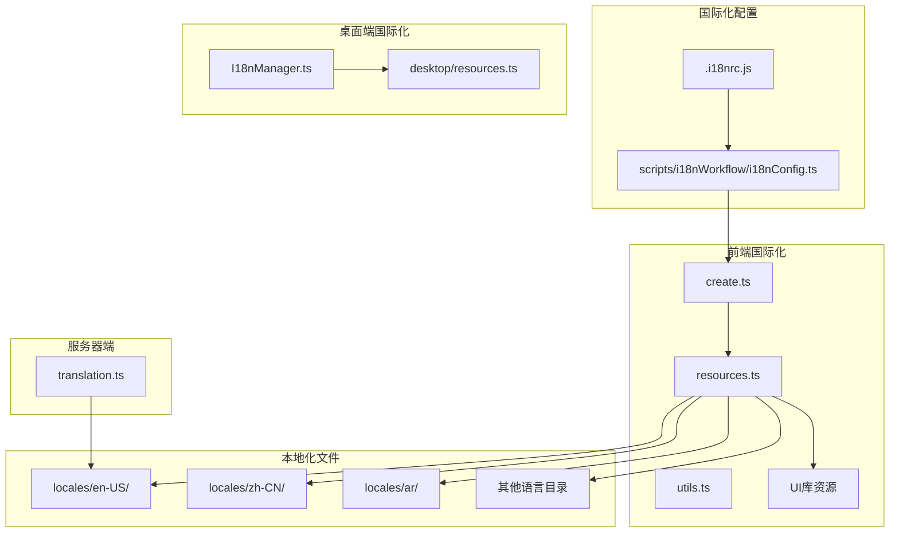
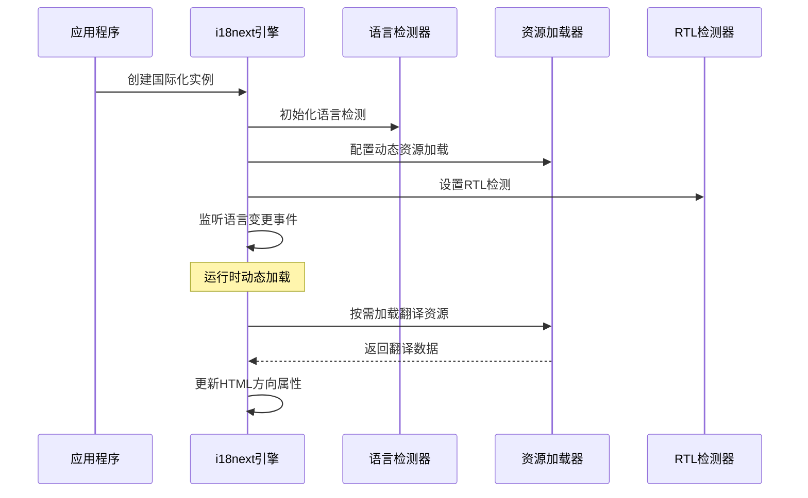
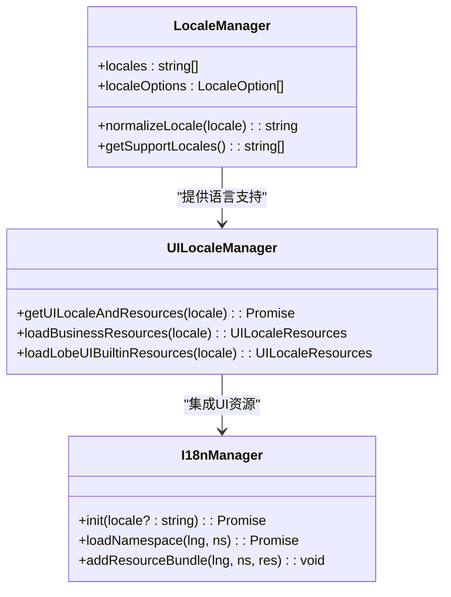
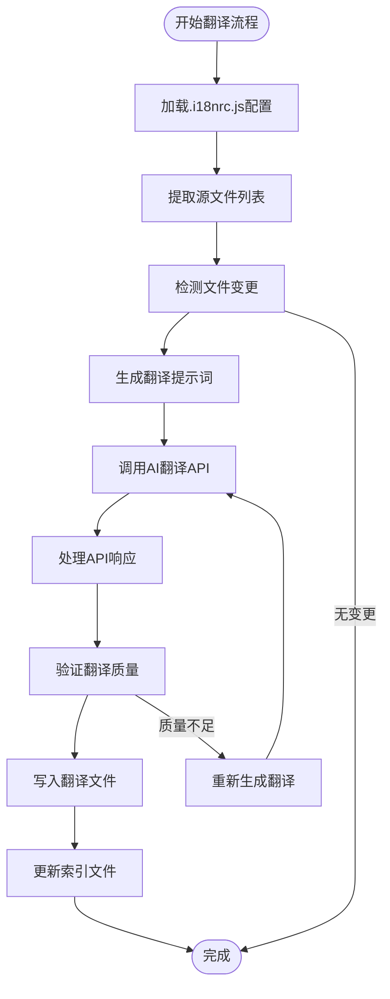
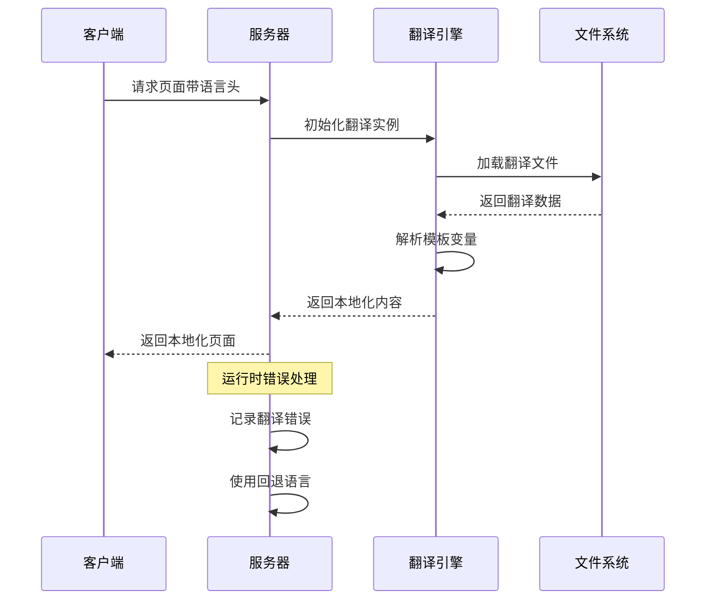

# 国际化系统

<cite>
**本文档引用的文件**
- [.i18nrc.js](file://.i18nrc.js)
- [create.ts](file://src/locales/create.ts)
- [resources.ts](file://src/locales/resources.ts)
- [utils.ts](file://src/locales/utils.ts)
- [i18nConfig.ts](file://scripts/i18nWorkflow/i18nConfig.ts)
- [const.ts](file://scripts/i18nWorkflow/const.ts)
- [utils.ts](file://scripts/i18nWorkflow/utils.ts)
- [translation.ts](file://src/server/translation.ts)
- [getUILocaleAndResources.ts](file://src/libs/getUILocaleAndResources.ts)
- [getUILocaleAndResources.vite.ts](file://src/libs/getUILocaleAndResources.vite.ts)
- [getUILocaleAndResources.desktop.ts](file://src/libs/getUILocaleAndResources.desktop.ts)
- [I18nManager.ts](file://apps/desktop/src/main/core/infrastructure/I18nManager.ts)
- [resources.ts](file://apps/desktop/src/main/locales/resources.ts)
- [add-new-locale.mdx](file://docs/development/internationalization/add-new-locale.mdx)
- [internationalization-implementation.mdx](file://docs/development/internationalization/internationalization-implementation.mdx)
</cite>

## 目录

1. [简介](#简介)
2. [项目结构](#项目结构)
3. [核心组件](#核心组件)
4. [架构概览](#架构概览)
5. [详细组件分析](#详细组件分析)
6. [依赖关系分析](#依赖关系分析)
7. [性能考虑](#性能考虑)
8. [故障排除指南](#故障排除指南)
9. [结论](#结论)

## 简介

LobeHub 是一个功能丰富的 AI 助手平台，支持 18 种语言的国际化系统。该系统采用现代化的 i18next 架构，结合动态资源加载、语言检测和自动翻译工具，为全球用户提供无缝的多语言体验。

国际化系统的核心特点包括：

- 支持 18 种语言和地区设置
- 基于 i18next 的现代国际化框架
- 自动化的翻译工作流程
- 动态资源加载机制
- RTL（从右到左）语言支持
- 服务器端渲染兼容性

## 项目结构

国际化系统在项目中的组织结构如下：



**图表来源**

- [.i18nrc.js:1-54](file://.i18nrc.js#L1-L54)
- [create.ts:1-63](file://src/locales/create.ts#L1-L63)
- [resources.ts:1-128](file://src/locales/resources.ts#L1-L128)

**章节来源**

- [.i18nrc.js:1-54](file://.i18nrc.js#L1-L54)
- [create.ts:1-63](file://src/locales/create.ts#L1-L63)
- [resources.ts:1-128](file://src/locales/resources.ts#L1-L128)

## 核心组件

### 配置管理系统

国际化系统的核心配置由 `.i18nrc.js` 文件管理，定义了完整的翻译工作流程：

- **入口语言**: en-US（美国英语）
- **输出语言**: 支持 18 种语言
- **翻译模型**: chatgpt-4o-latest
- **Markdown 处理**: 自动翻译文档内容
- **温度参数**: 0（确定性翻译）

### 前端国际化引擎

`create.ts` 文件实现了基于 i18next 的国际化引擎：

- **语言检测**: 使用 i18next-browser-languagedetector
- **动态加载**: 通过 resourcesToBackend 实现按需加载
- **RTL 支持**: 自动检测和应用文本方向
- **调试模式**: 支持开发环境下的详细日志

### 资源管理器

`resources.ts` 提供了完整的语言资源管理功能：

- **语言列表**: 预定义支持的语言数组
- **语言选项**: 用户界面可选的语言列表
- **语言规范化**: 统一不同格式的语言代码
- **UI 资源**: 集成 @lobehub/ui 库的界面资源

**章节来源**

- [create.ts:18-62](file://src/locales/create.ts#L18-L62)
- [resources.ts:5-128](file://src/locales/resources.ts#L5-L128)

## 架构概览

国际化系统采用分层架构设计，确保了良好的可扩展性和维护性：

```mermaid
graph TD
subgraph "用户界面层"
React[React组件]
Hooks[i18n Hooks]
UIComponents[UI组件]
end
subgraph "国际化引擎层"
I18nEngine[i18next引擎]
Detector[语言检测器]
Loader[资源加载器]
RTL[RTL检测器]
end
subgraph "资源管理层"
LocalFiles[本地JSON文件]
TSFiles[TypeScript默认文件]
UILibrary[@lobehub/ui库]
DynamicLoad[动态加载]
end
subgraph "配置管理层"
Config[配置文件]
Workflow[翻译工作流]
Scripts[自动化脚本]
end
React --> Hooks
Hooks --> I18nEngine
I18nEngine --> Detector
I18nEngine --> Loader
I18nEngine --> RTL
Loader --> LocalFiles
Loader --> TSFiles
Loader --> UILibrary
Loader --> DynamicLoad
Config --> Workflow
Workflow --> Scripts
Scripts --> LocalFiles
```

**图表来源**

- [create.ts:18-62](file://src/locales/create.ts#L18-L62)
- [resources.ts:30-45](file://src/locales/resources.ts#L30-L45)
- [I18nManager.ts:160-175](file://apps/desktop/src/main/core/infrastructure/I18nManager.ts#L160-L175)

## 详细组件分析

### i18next 引擎实现

国际化引擎的核心实现展示了现代前端国际化最佳实践：



**图表来源**

- [create.ts:18-62](file://src/locales/create.ts#L18-L62)

#### 关键特性实现

1. **动态语言检测**: 使用 i18next-browser-languagedetector 自动识别用户偏好
2. **按需资源加载**: 通过 resourcesToBackend 实现懒加载
3. **RTL 自适应**: 自动检测和应用文本方向
4. **调试支持**: 开发环境下的详细日志记录

**章节来源**

- [create.ts:18-62](file://src/locales/create.ts#L18-L62)

### 语言资源管理

语言资源管理系统提供了灵活的多语言支持：



**图表来源**

- [resources.ts:30-128](file://src/locales/resources.ts#L30-L128)
- [getUILocaleAndResources.ts:29-57](file://src/libs/getUILocaleAndResources.ts#L29-L57)
- [I18nManager.ts:160-175](file://apps/desktop/src/main/core/infrastructure/I18nManager.ts#L160-L175)

#### 支持的语言列表

系统当前支持以下语言和地区设置：

| 语言代码 | 语言名称         | 地区               |
| -------- | ---------------- | ------------------ |
| ar       | العربية          | 阿拉伯语           |
| bg-BG    | Български        | 保加利亚语         |
| cs-CZ    | Čeština          | 捷克语             |
| da-DK    | Dansk            | 丹麦语             |
| de-DE    | Deutsch          | 德语               |
| el-GR    | Ελληνικά         | 希腊语             |
| en-US    | English          | 英语（美国）       |
| es-ES    | Español          | 西班牙语           |
| et-EE    | Eesti            | 爱沙尼亚语         |
| fi-FI    | Suomi            | 芬兰语             |
| fr-FR    | Français         | 法语               |
| he-IL    | עברית            | 希伯来语           |
| hr-HR    | Hrvatski         | 克罗地亚语         |
| hu-HU    | Magyar           | 匈牙利语           |
| id-ID    | Bahasa Indonesia | 印尼语             |
| it-IT    | Italiano         | 意大利语           |
| ja-JP    | 日本語           | 日语               |
| ko-KR    | 한국어           | 韩语               |
| lt-LT    | Lietuvių         | 立陶宛语           |
| lv-LV    | Latviešu         | 拉脱维亚语         |
| nb-NO    | Norsk bokmål     | 挪威语（书面语）   |
| nl-NL    | Nederlands       | 荷兰语             |
| pl-PL    | Polski           | 波兰语             |
| pt-BR    | Português        | 葡萄牙语（巴西）   |
| pt-PT    | Português        | 葡萄牙语（葡萄牙） |
| ro-RO    | Română           | 罗马尼亚语         |
| ru-RU    | Русский          | 俄语               |
| sk-SK    | Slovenčina       | 斯洛伐克语         |
| sl-SI    | Slovenščina      | 斯洛文尼亚语       |
| sv-SE    | Svenska          | 瑞典语             |
| ta-IN    | தமிழ்            | 泰米尔语           |
| th-TH    | ไทย              | 泰语               |
| tr-TR    | Türkçe           | 土耳其语           |
| uk-UA    | Українська       | 乌克兰语           |
| vi-VN    | Tiếng Việt       | 越南语             |
| zh-CN    | 简体中文         | 中文（中国）       |
| zh-TW    | 繁體中文         | 中文（台湾）       |

**章节来源**

- [resources.ts:5-128](file://src/locales/resources.ts#L5-L128)

### 翻译工作流程

翻译工作流程通过自动化脚本实现，确保翻译的一致性和效率：



**图表来源**

- [.i18nrc.js:5-53](file://.i18nrc.js#L5-L53)
- [i18nConfig.ts:1-8](file://scripts/i18nWorkflow/i18nConfig.ts#L1-L8)

#### 工作流程特性

1. **智能增量翻译**: 只翻译变更的文件
2. **质量保证**: 通过验证确保翻译准确性
3. **格式保持**: 维护原始文件结构和格式
4. **错误恢复**: 自动处理翻译失败的情况

**章节来源**

- [.i18nrc.js:5-53](file://.i18nrc.js#L5-L53)
- [i18nConfig.ts:1-8](file://scripts/i18nWorkflow/i18nConfig.ts#L1-L8)

### 服务器端国际化

服务器端国际化确保 SSR（服务端渲染）场景下的完整支持：



**图表来源**

- [translation.ts:32-52](file://src/server/translation.ts#L32-L52)

#### 服务器端特性

1. **SSR 兼容**: 支持服务端渲染场景
2. **模板变量**: 支持动态内容替换
3. **错误处理**: 容错机制确保页面正常加载
4. **性能优化**: 缓存机制减少重复加载

**章节来源**

- [translation.ts:32-52](file://src/server/translation.ts#L32-L52)

## 依赖关系分析

国际化系统的依赖关系展现了清晰的模块化设计：

```mermaid
graph LR
subgraph "核心依赖"
I18next[i18next]
ReactI18next[react-i18next]
Detector[i18next-browser-languagedetector]
Backend[i18next-resources-to-backend]
RTLDetect[rtl-detect]
end
subgraph "项目内部模块"
Create[create.ts]
Resources[resources.ts]
Utils[utils.ts]
UILib[@lobehub/ui]
end
subgraph "桌面端"
DesktopMgr[I18nManager.ts]
DesktopRes[desktop/resources.ts]
end
subgraph "工具链"
CLI[@lobehub/i18n-cli]
Prettier[@prettier/sync]
Consola[consola]
end
Create --> I18next
Create --> ReactI18next
Create --> Detector
Create --> Backend
Create --> RTLDetect
Resources --> UILib
DesktopMgr --> DesktopRes
CLI --> Prettier
CLI --> Consola
```

**图表来源**

- [create.ts:1-12](file://src/locales/create.ts#L1-L12)
- [resources.ts:1-4](file://src/locales/resources.ts#L1-L4)
- [.i18nrc.js:1-3](file://.i18nrc.js#L1-L3)

### 关键依赖说明

1. **i18next 生态系统**: 提供完整的国际化解决方案
2. **@lobehub/ui**: 集成统一的 UI 组件国际化资源
3. **自动化工具链**: 确保翻译质量和一致性
4. **桌面端适配**: 特殊的 Electron 环境支持

**章节来源**

- [create.ts:1-12](file://src/locales/create.ts#L1-L12)
- [resources.ts:1-4](file://src/locales/resources.ts#L1-L4)

## 性能考虑

国际化系统在性能方面采用了多项优化策略：

### 资源加载优化

1. **按需加载**: 只在需要时加载特定命名空间的翻译
2. **缓存机制**: 避免重复加载相同的翻译资源
3. **预加载策略**: 在应用启动时预加载常用翻译

### 内存管理

1. **垃圾回收**: 及时释放不再使用的翻译资源
2. **内存限制**: 控制同时加载的翻译文件数量
3. **资源池**: 复用已加载的翻译对象

### 网络优化

1. **压缩传输**: 使用 gzip 压缩翻译文件
2. **CDN 支持**: 支持通过 CDN 分发翻译资源
3. **版本控制**: 利用浏览器缓存机制

## 故障排除指南

### 常见问题及解决方案

#### 翻译缺失问题

**症状**: 页面显示英文键名而非翻译内容

**排查步骤**:

1. 检查翻译文件是否存在对应键值
2. 验证命名空间是否正确
3. 确认语言代码格式是否正确

**解决方案**:

- 在相应语言目录添加缺失的翻译
- 使用 `genNamespaceList` 函数检查命名空间完整性
- 运行 `npm run i18n:check` 检查未使用键值

#### 语言切换失效

**症状**: 切换语言后界面不更新

**排查步骤**:

1. 检查 `languageChanged` 事件监听器
2. 验证 RTL 方向设置
3. 确认资源重新加载逻辑

**解决方案**:

- 重新初始化 i18next 实例
- 手动触发资源重新加载
- 检查浏览器缓存问题

#### 服务器端渲染问题

**症状**: SSR 场景下翻译不生效

**排查步骤**:

1. 检查服务器端翻译初始化
2. 验证文件系统访问权限
3. 确认模板变量解析

**解决方案**:

- 确保服务器端有读取权限
- 使用 `unwrapESMModule` 处理模块导入
- 实现适当的错误回退机制

**章节来源**

- [translation.ts:32-52](file://src/server/translation.ts#L32-L52)
- [I18nManager.ts:160-175](file://apps/desktop/src/main/core/infrastructure/I18nManager.ts#L160-L175)

## 结论

LobeHub 的国际化系统展现了现代前端国际化架构的最佳实践。通过精心设计的分层架构、完善的工具链支持和全面的错误处理机制，系统为全球用户提供了高质量的多语言体验。

### 主要优势

1. **技术先进性**: 采用 i18next 等成熟的国际化解决方案
2. **开发效率**: 自动化翻译工作流程减少人工干预
3. **用户体验**: 支持 RTL 语言和动态语言检测
4. **可扩展性**: 模块化设计便于添加新语言支持

### 发展方向

1. **AI 辅助翻译**: 继续优化基于 AI 的翻译质量
2. **性能优化**: 进一步提升资源加载性能
3. **工具增强**: 扩展翻译管理和质量控制工具
4. **社区贡献**: 建立更完善的翻译贡献机制

该国际化系统为 LobeHub 的全球化发展奠定了坚实的技术基础，为未来的多语言扩展提供了清晰的路径和可靠的保障。
