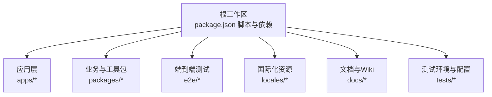
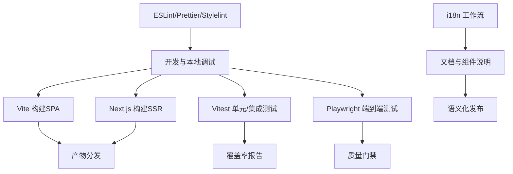
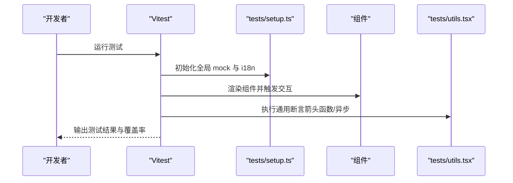
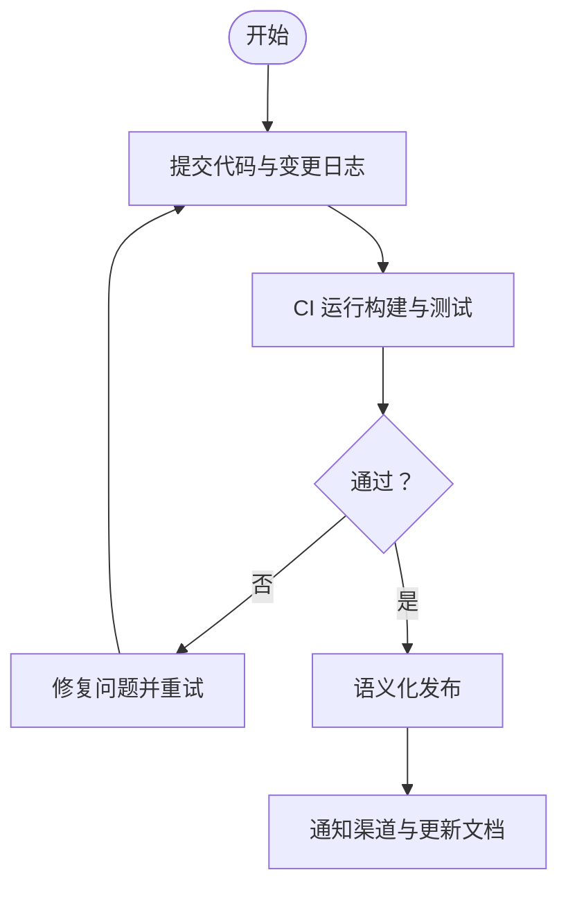
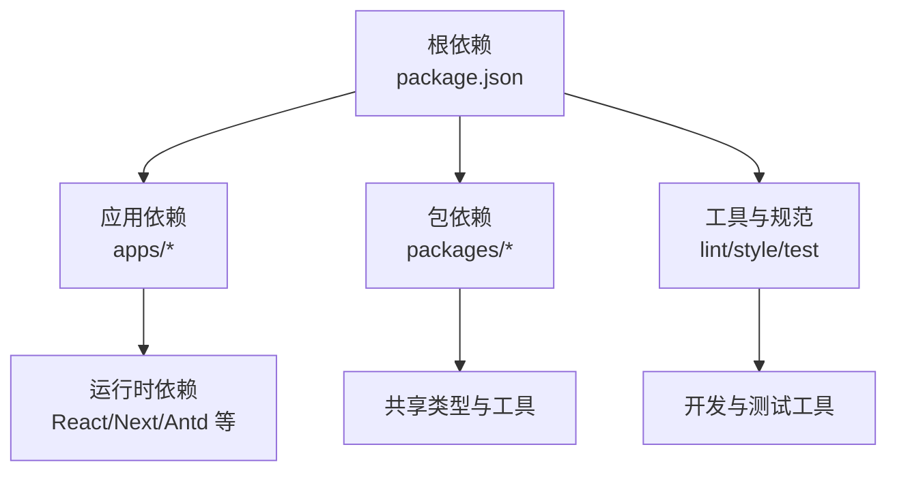

# 组件开发指南

<cite>
**本文档引用的文件**
- [package.json](file://package.json)
- [README.md](file://README.md)
- [CONTRIBUTING.md](file://CONTRIBUTING.md)
- [vitest.config.mts](file://vitest.config.mts)
- [eslint.config.mjs](file://eslint.config.mjs)
- [prettier.config.mjs](file://prettier.config.mjs)
- [stylelint.config.mjs](file://stylelint.config.mjs)
- [tests/setup.ts](file://tests/setup.ts)
- [tests/utils.tsx](file://tests/utils.tsx)
</cite>

## 目录

1. [简介](#简介)
2. [项目结构](#项目结构)
3. [核心组件](#核心组件)
4. [架构总览](#架构总览)
5. [详细组件分析](#详细组件分析)
6. [依赖分析](#依赖分析)
7. [性能考虑](#性能考虑)
8. [故障排查指南](#故障排查指南)
9. [结论](#结论)
10. [附录](#附录)

## 简介

本指南面向 LobeHub 项目的组件开发者，系统阐述从设计到发布的全流程规范与最佳实践，覆盖组件设计原则、命名与文件结构、类型定义、测试策略（单元 / 集成 / 快照）、文档编写、版本与发布、性能优化、错误边界与调试、以及重构与废弃流程。目标是帮助团队在保持高质量与一致性的前提下，高效交付可维护、可发现、可演进的组件。

## 项目结构

LobeHub 采用多包工作区（monorepo）组织方式，核心应用与业务 / 工具包分布在 apps 与 packages 目录，根级脚本统一管理构建、测试、文档与发布流程。整体结构强调模块化、可复用与工程化自动化。

图示来源

- [package.json](file://package.json#L30-L35)

章节来源

- [package.json](file://package.json#L30-L35)
- [README.md](file://README.md#L700-L720)

## 核心组件

围绕组件开发的关键要素如下：

- 设计原则：单一职责、可组合、可测试、可扩展、可国际化、可无障碍访问
- 命名规范：组件名使用帕斯卡命名；文件以组件名命名；导出默认组件与受控 / 非受控变体时遵循约定
- 文件结构：组件目录包含 index.ts、组件实现、类型定义、样式、测试与文档
- 类型定义：优先使用严格类型，避免 any；通过工具类型提升可读性与安全性
- 测试策略：单元测试（Vitest + React Testing Library）、集成测试（SWR / 服务层）、快照测试（UI 稳定性）
- 文档规范：README.md 模板、MDX 文档、变更日志、i18n 键值
- 版本与发布：语义化版本、变更日志生成、CI 发布流水线
- 性能优化：懒加载、代码分割、内存泄漏防护、缓存与去抖
- 错误边界：边界组件、异常捕获、降级渲染、调试工具链
- 重构与废弃：渐进式迁移、兼容性标记、弃用提示与回滚策略

章节来源

- [CONTRIBUTING.md](file://CONTRIBUTING.md#L41-L89)
- [eslint.config.mjs](file://eslint.config.mjs#L74-L84)
- [vitest.config.mts](file://vitest.config.mts#L41-L111)

## 架构总览

组件开发在以下工程化基础设施之上运行：

- 开发与构建：Vite（SPA 前端）、Next.js（SSR 应用）、桌面端 Electron、移动端 Expo
- 测试：Vitest（单元 / 集成）、Playwright（端到端）
- 规范：ESLint（TypeScript/React/MDX）、Prettier、Stylelint
- 国际化：i18n 工作流与键值管理
- 发布：语义化发布与 CI 工作流

图示来源

- [package.json](file://package.json#L36-L122)
- [eslint.config.mjs](file://eslint.config.mjs#L8-L72)
- [prettier.config.mjs](file://prettier.config.mjs#L1-L4)
- [stylelint.config.mjs](file://stylelint.config.mjs#L1-L14)
- [vitest.config.mts](file://vitest.config.mts#L41-L111)

## 详细组件分析

### 组件设计原则与命名规范

- 设计原则
  - 单一职责：一个组件只做一件事，并做好
  - 可组合：通过 children、slots 或 render props 提供扩展点
  - 可测试：暴露稳定接口，避免隐藏副作用
  - 可扩展：支持主题、尺寸、状态等扩展参数
  - 可国际化：文本与文案通过 i18n 注入
  - 可无障碍：遵循 ARIA 与键盘导航
- 命名与文件结构
  - 组件名：帕斯卡命名（Button、Modal、FormField）
  - 文件：组件名.tsx；类型定义：组件名.types.ts；样式：组件名.module.css 或内联样式
  - 导出：默认导出组件；必要时导出受控 / 非受控变体或 Hook
  - 文档：README.md 或同目录 SKILL.md/ 文档模板

章节来源

- [eslint.config.mjs](file://eslint.config.mjs#L74-L84)

### 类型定义与接口约束

- 使用严格类型，避免 any；优先使用工具类型提升可读性
- 接口最小化：仅暴露必要字段；可选属性明确标注
- 事件与回调：统一事件对象结构；区分同步 / 异步回调
- 状态类型：枚举或字面量联合类型，避免字符串魔法数

章节来源

- [eslint.config.mjs](file://eslint.config.mjs#L74-L84)

### 测试策略与最佳实践

- 单元测试（Vitest）
  - 使用 React Testing Library 或 @testing-library/react
  - 使用测试工具集：withSWR、testService 等封装通用断言
  - Mock 外部依赖（analytics、auth、crypto 等），确保可重复性
- 集成测试
  - 使用 SWR 的内存 Map 作为缓存提供者，避免真实网络
  - 对服务类进行行为验证（方法均为箭头函数、异步签名等）
- 快照测试
  - 对 UI 结构进行快照对比，防止意外变更
  - 在交互前后分别快照，确保渲染一致性
- 端到端测试（Playwright）
  - 覆盖关键用户路径与跨浏览器场景

图示来源

- [tests/setup.ts](file://tests/setup.ts#L1-L76)
- [tests/utils.tsx](file://tests/utils.tsx#L24-L57)
- [vitest.config.mts](file://vitest.config.mts#L41-L111)

章节来源

- [tests/setup.ts](file://tests/setup.ts#L1-L76)
- [tests/utils.tsx](file://tests/utils.tsx#L1-L58)
- [vitest.config.mts](file://vitest.config.mts#L41-L111)

### 文档编写规范与模板

- README 模板：包含功能概述、安装、使用示例、API 列表、变更日志链接
- MDX 文档：按功能域组织，配合 i18n 键值，自动翻译
- 变更日志：遵循语义化版本，记录破坏性变更、新增与修复
- 组件文档：描述用途、属性、事件、插槽、无障碍与国际化要点

章节来源

- [README.md](file://README.md#L700-L720)

### 版本管理与发布流程

- 版本策略：语义化版本（主。次. 补丁），破坏性变更提升主版本
- 变更日志：自动生成，合并 PR 时更新
- 发布流水线：CI 触发，执行构建、测试、覆盖率与发布命令
- 向后兼容：通过别名、兼容层与弃用提示，逐步迁移

章节来源

- [package.json](file://package.json#L95-L122)

### 性能优化技术要点

- 懒加载与代码分割：路由级或组件级动态导入，减少首屏体积
- 内存泄漏防护：清理定时器、订阅、事件监听；在卸载时释放资源
- 缓存与去抖：合理使用缓存、防抖与节流；避免重复请求
- 图片与媒体：懒加载、压缩、格式选择；使用合适的占位符
- SSR/CSR：根据场景选择渲染策略；预取关键数据

章节来源

- [package.json](file://package.json#L36-L46)

### 错误边界处理与调试

- 错误边界：UI 层使用错误边界组件兜底；服务层捕获异常并返回结构化错误
- 异常恢复：重试机制、降级渲染、空状态提示
- 调试技巧：启用开发工具、日志聚合、性能分析、网络面板
- 测试中的异常：使用测试框架的异常断言，确保错误路径被覆盖

章节来源

- [tests/setup.ts](file://tests/setup.ts#L21-L39)

### 重构、迁移与废弃流程

- 渐进式迁移：保留旧 API 并添加弃用警告；提供迁移指南
- 兼容性标记：使用 @deprecated 注释与版本号；在变更日志中标注
- 回滚策略：冻结分支、版本锁定、快速回滚脚本
- 废弃流程：提前公告、过渡期、最终移除与清理

## 依赖分析

组件开发涉及的外部依赖与内部包通过工作区统一管理，确保版本一致性与依赖可见性。

图示来源

- [package.json](file://package.json#L158-L403)

章节来源

- [package.json](file://package.json#L158-L403)

## 性能考虑

- 构建优化：按需引入、Tree Shaking、生产模式压缩
- 运行时优化：虚拟滚动、图片懒加载、请求合并与缓存
- 监控与分析：性能指标采集、慢请求告警、内存占用监控
- 资源治理：CDN、静态资源指纹、Gzip/Brotli 压缩

## 故障排查指南

- 测试失败
  - 检查 Mock 配置与全局初始化（i18n、crypto、SWR）
  - 确认组件渲染与交互逻辑，补充缺失的断言
- 构建失败
  - 查看 ESLint/Prettier/Stylelint 报错，按规则修复
  - 核对类型定义与导入路径
- 性能问题
  - 使用性能分析工具定位瓶颈；检查是否存在不必要的重渲染或内存泄漏
- 国际化问题
  - 校验 i18n 键值是否存在；确认命名空间与语言包加载顺序

章节来源

- [tests/setup.ts](file://tests/setup.ts#L1-L76)
- [eslint.config.mjs](file://eslint.config.mjs#L8-L72)
- [prettier.config.mjs](file://prettier.config.mjs#L1-L4)
- [stylelint.config.mjs](file://stylelint.config.mjs#L1-L14)

## 结论

通过统一的设计原则、严格的类型与测试规范、完善的文档与发布流程，以及持续的性能优化与质量保障，LobeHub 的组件开发能够在复杂生态中保持高一致性与可维护性。建议在每次迭代中遵循本文档的流程与最佳实践，确保组件质量与团队效率双提升。

## 附录

- 贡献指南与协作流程参考：[贡献指南](file://CONTRIBUTING.md#L19-L89)
- 工程化脚本与工作流参考：[根脚本](file://package.json#L36-L122)
- 测试环境初始化与工具参考：[测试设置](file://tests/setup.ts#L1-L76)、[测试工具](file://tests/utils.tsx#L1-L58)
- 规范配置参考：[ESLint](file://eslint.config.mjs#L1-L151)、[Prettier](file://prettier.config.mjs#L1-L4)、[Stylelint](file://stylelint.config.mjs#L1-L14)
