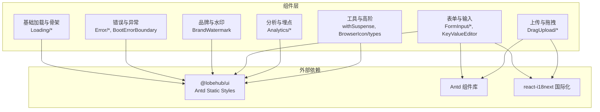
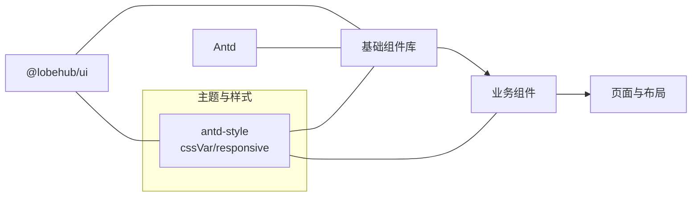
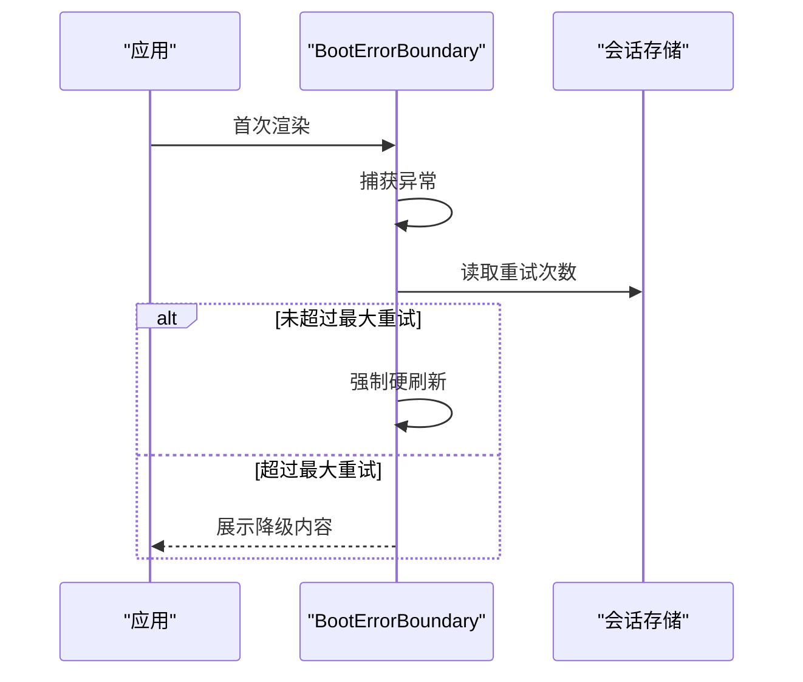
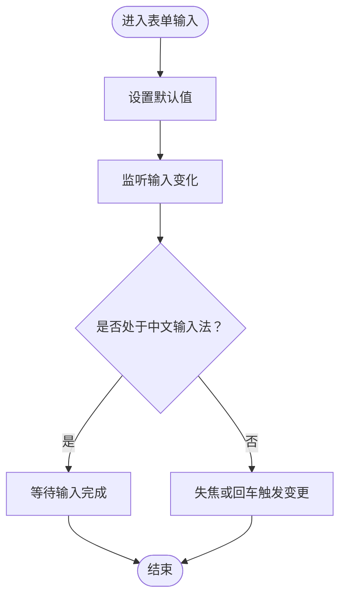
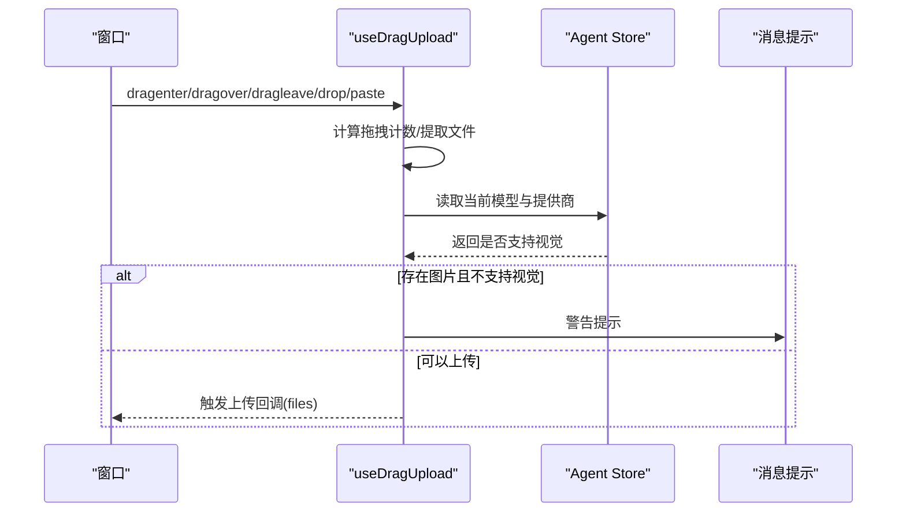
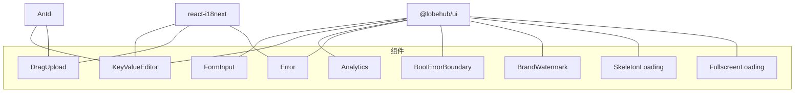

# 组件系统

<cite>
**本文引用的文件**
- [README.md](file://README.md)
- [src/components/withSuspense.tsx](file://src/components/withSuspense.tsx)
- [src/components/BrowserIcon/types.ts](file://src/components/BrowserIcon/types.ts)
- [src/components/FormInput/FormInput.tsx](file://src/components/FormInput/FormInput.tsx)
- [src/components/DragUpload/useDragUpload.tsx](file://src/components/DragUpload/useDragUpload.tsx)
- [src/components/Analytics/index.tsx](file://src/components/Analytics/index.tsx)
- [src/components/BootErrorBoundary/index.tsx](file://src/components/BootErrorBoundary/index.tsx)
- [src/components/BrandWatermark/index.tsx](file://src/components/BrandWatermark/index.tsx)
- [src/components/Error/index.tsx](file://src/components/Error/index.tsx)
- [src/components/Loading/FullscreenLoading/index.tsx](file://src/components/Loading/FullscreenLoading/index.tsx)
- [src/components/Loading/SkeletonLoading/index.tsx](file://src/components/Loading/SkeletonLoading/index.tsx)
- [src/components/Statistic/index.tsx](file://src/components/Statistic/index.tsx)
- [src/components/KeyValueEditor/index.tsx](file://src/components/KeyValueEditor/index.tsx)
- [src/components/JSONSchemaConfig/ItemRender.tsx](file://src/components/JSONSchemaConfig/ItemRender.tsx)
- [scripts/replaceComponentImports.ts](file://scripts/replaceComponentImports.ts)
</cite>

## 目录

1. [简介](#简介)
2. [项目结构](#项目结构)
3. [核心组件](#核心组件)
4. [架构总览](#架构总览)
5. [组件详解](#组件详解)
6. [依赖关系分析](#依赖关系分析)
7. [性能考量](#性能考量)
8. [故障排查指南](#故障排查指南)
9. [结论](#结论)
10. [附录](#附录)

## 简介

本文件面向 LobeHub 前端组件体系，系统梳理可复用组件库的设计理念、分类与组织方式，逐项说明组件功能、属性、事件与样式定制要点，并给出使用示例与最佳实践。同时覆盖主题系统、样式覆盖、响应式设计、无障碍支持、跨浏览器兼容性与性能优化建议；并阐述组件间组合模式、状态共享与生命周期管理等高级用法，最后提供组件开发指南与测试策略。

## 项目结构

LobeHub 的组件主要位于 src/components 下，按功能域与复用度进行分层组织：

- 通用基础：如加载、骨架屏、统计卡片、错误捕获、品牌水印等
- 表单与输入：如表单输入封装、键值编辑器、JSON Schema 渲染
- 上传与拖拽：拖拽上传与粘贴上传的 Hook 及 Provider
- 分析与埋点：多平台分析脚本的动态注入与桌面端适配
- 异常边界：启动阶段的错误边界，保障首次渲染稳定性
- 工具与高阶：Suspense 高阶组件、类型定义等

图表来源

- [src/components/Loading/FullscreenLoading/index.tsx](file://src/components/Loading/FullscreenLoading/index.tsx#L1-L27)
- [src/components/Error/index.tsx](file://src/components/Error/index.tsx#L1-L70)
- [src/components/BrandWatermark/index.tsx](file://src/components/BrandWatermark/index.tsx#L1-L52)
- [src/components/FormInput/FormInput.tsx](file://src/components/FormInput/FormInput.tsx#L1-L48)
- [src/components/KeyValueEditor/index.tsx](file://src/components/KeyValueEditor/index.tsx#L1-L205)
- [src/components/DragUpload/useDragUpload.tsx](file://src/components/DragUpload/useDragUpload.tsx#L1-L186)
- [src/components/Analytics/index.tsx](file://src/components/Analytics/index.tsx#L1-L47)
- [src/components/withSuspense.tsx](file://src/components/withSuspense.tsx#L1-L9)
- [src/components/BrowserIcon/types.ts](file://src/components/BrowserIcon/types.ts#L1-L8)

章节来源

- [README.md](file://README.md#L1-L120)

## 核心组件

- 加载与骨架屏：提供全屏加载与骨架屏组件，统一加载态视觉与交互体验
- 错误捕获与边界：提供错误展示与重试能力，以及启动阶段的硬刷新恢复机制
- 品牌与水印：品牌文案与链接，支持自定义组织名
- 表单与输入：封装输入行为、中英文输入法处理、键值对编辑与 JSON Schema 渲染
- 上传与拖拽：跨浏览器的拖拽与粘贴文件处理，结合模型能力做能力校验
- 分析与埋点：按环境变量动态注入多平台分析脚本，支持桌面端适配
- 工具与高阶：Suspense 包裹高阶组件、SVG 组件类型定义

章节来源

- [src/components/Loading/FullscreenLoading/index.tsx](file://src/components/Loading/FullscreenLoading/index.tsx#L1-L27)
- [src/components/Loading/SkeletonLoading/index.tsx](file://src/components/Loading/SkeletonLoading/index.tsx#L1-L32)
- [src/components/Error/index.tsx](file://src/components/Error/index.tsx#L1-L70)
- [src/components/BootErrorBoundary/index.tsx](file://src/components/BootErrorBoundary/index.tsx#L1-L126)
- [src/components/BrandWatermark/index.tsx](file://src/components/BrandWatermark/index.tsx#L1-L52)
- [src/components/FormInput/FormInput.tsx](file://src/components/FormInput/FormInput.tsx#L1-L48)
- [src/components/KeyValueEditor/index.tsx](file://src/components/KeyValueEditor/index.tsx#L1-L205)
- [src/components/JSONSchemaConfig/ItemRender.tsx](file://src/components/JSONSchemaConfig/ItemRender.tsx#L1-L55)
- [src/components/DragUpload/useDragUpload.tsx](file://src/components/DragUpload/useDragUpload.tsx#L1-L186)
- [src/components/Analytics/index.tsx](file://src/components/Analytics/index.tsx#L1-L47)
- [src/components/withSuspense.tsx](file://src/components/withSuspense.tsx#L1-L9)
- [src/components/BrowserIcon/types.ts](file://src/components/BrowserIcon/types.ts#L1-L8)

## 架构总览

组件系统以 “基础能力 + 业务场景” 两条主线构建：

- 基础能力：加载、骨架、错误、品牌、分析、工具等通用模块，向上支撑各页面与业务组件
- 业务场景：表单、上传、配置渲染等，围绕具体交互与数据形态展开
- 外部依赖：统一通过 @lobehub/ui 与 Antd 提供一致的样式与交互基线，配合 antd-style 实现主题与响应式

图表来源

- [src/components/Loading/SkeletonLoading/index.tsx](file://src/components/Loading/SkeletonLoading/index.tsx#L1-L32)
- [src/components/BrandWatermark/index.tsx](file://src/components/BrandWatermark/index.tsx#L1-L52)
- [src/components/KeyValueEditor/index.tsx](file://src/components/KeyValueEditor/index.tsx#L1-L205)

## 组件详解

### 加载与骨架屏

- 全屏加载：在应用初始化或页面切换时提供品牌标识与进度条，统一加载态
- 骨架屏：基于 @lobehub/ui 的 Skeleton，内置响应式样式与默认段落数

章节来源

- [src/components/Loading/FullscreenLoading/index.tsx](file://src/components/Loading/FullscreenLoading/index.tsx#L1-L27)
- [src/components/Loading/SkeletonLoading/index.tsx](file://src/components/Loading/SkeletonLoading/index.tsx#L1-L32)

### 错误捕获与边界

- 错误展示：居中错误页，支持堆栈折叠显示与重试 / 回首页
- 启动边界：首次渲染前的错误自动尝试一次硬刷新，避免缓存导致的白屏

图表来源

- [src/components/BootErrorBoundary/index.tsx](file://src/components/BootErrorBoundary/index.tsx#L1-L126)

章节来源

- [src/components/Error/index.tsx](file://src/components/Error/index.tsx#L1-L70)
- [src/components/BootErrorBoundary/index.tsx](file://src/components/BootErrorBoundary/index.tsx#L1-L126)

### 品牌与水印

- 支持自定义组织名与默认 LobeHub 链接，采用 cssVar 获取主题色，保持与全局主题一致

章节来源

- [src/components/BrandWatermark/index.tsx](file://src/components/BrandWatermark/index.tsx#L1-L52)

### 表单与输入

- 表单输入封装：统一受控值、失焦与回车触发变更、中文输入法状态处理
- 键值编辑器：支持增删改、去重检测、本地记录与外部值同步、国际化占位符
- JSON Schema 渲染：根据类型与格式自动选择输入控件（字符串 / 密码 / 枚举、数字 / 滑块、布尔）

图表来源

- [src/components/FormInput/FormInput.tsx](file://src/components/FormInput/FormInput.tsx#L1-L48)

章节来源

- [src/components/FormInput/FormInput.tsx](file://src/components/FormInput/FormInput.tsx#L1-L48)
- [src/components/KeyValueEditor/index.tsx](file://src/components/KeyValueEditor/index.tsx#L1-L205)
- [src/components/JSONSchemaConfig/ItemRender.tsx](file://src/components/JSONSchemaConfig/ItemRender.tsx#L1-L55)

### 上传与拖拽

- 跨浏览器拖拽与粘贴：兼容 Safari 的 FileSystemEntry 与 ClipboardData
- 能力校验：当存在图片且当前模型不支持视觉识别时提示警告
- 状态管理：使用计数器避免 dragleave 导致的状态抖动

图表来源

- [src/components/DragUpload/useDragUpload.tsx](file://src/components/DragUpload/useDragUpload.tsx#L1-L186)

章节来源

- [src/components/DragUpload/useDragUpload.tsx](file://src/components/DragUpload/useDragUpload.tsx#L1-L186)

### 分析与埋点

- 动态注入：按环境变量开关动态引入各平台分析脚本，桌面端单独处理
- 条件渲染：仅在启用时挂载对应组件，避免无意义的资源加载

章节来源

- [src/components/Analytics/index.tsx](file://src/components/Analytics/index.tsx#L1-L47)

### 工具与高阶

- Suspense 包裹：为懒加载组件提供统一的 Suspense 包裹
- SVG 类型：统一 SVG 组件的尺寸与样式接口

章节来源

- [src/components/withSuspense.tsx](file://src/components/withSuspense.tsx#L1-L9)
- [src/components/BrowserIcon/types.ts](file://src/components/BrowserIcon/types.ts#L1-L8)

## 依赖关系分析

- 组件依赖 @lobehub/ui 与 Antd，统一 UI 基线与静态样式
- 使用 antd-style 的 cssVar 与响应式工具实现主题与响应式
- 国际化通过 react-i18next 注入，组件内部通过 t 函数获取文案
- 动态导入用于分析脚本与部分重型组件，减少首屏体积

图表来源

- [src/components/FormInput/FormInput.tsx](file://src/components/FormInput/FormInput.tsx#L1-L48)
- [src/components/KeyValueEditor/index.tsx](file://src/components/KeyValueEditor/index.tsx#L1-L205)
- [src/components/DragUpload/useDragUpload.tsx](file://src/components/DragUpload/useDragUpload.tsx#L1-L186)
- [src/components/Analytics/index.tsx](file://src/components/Analytics/index.tsx#L1-L47)
- [src/components/Error/index.tsx](file://src/components/Error/index.tsx#L1-L70)
- [src/components/BootErrorBoundary/index.tsx](file://src/components/BootErrorBoundary/index.tsx#L1-L126)
- [src/components/BrandWatermark/index.tsx](file://src/components/BrandWatermark/index.tsx#L1-L52)
- [src/components/Loading/SkeletonLoading/index.tsx](file://src/components/Loading/SkeletonLoading/index.tsx#L1-L32)
- [src/components/Loading/FullscreenLoading/index.tsx](file://src/components/Loading/FullscreenLoading/index.tsx#L1-L27)

## 性能考量

- 懒加载与条件渲染：分析脚本与部分重型组件采用动态导入与按需渲染
- 首屏优化：错误边界在首次渲染失败时强制硬刷新，避免缓存导致的卡死
- 输入性能：表单输入组件使用受控值与防抖策略，避免不必要的重渲染
- 样式开销：统一使用 antd-style 的 cssVar 与响应式工具，减少重复计算
- 上传性能：拖拽与粘贴文件时进行能力校验，避免无效请求与错误提示

## 故障排查指南

- 首次渲染失败：检查 BootErrorBoundary 是否触发硬刷新，确认缓存问题
- 加载态异常：核对 FullscreenLoading 的 stages 与 activeStage 是否正确传入
- 表单输入异常：确认 defaultValue 与 onChange 的同步逻辑，检查中文输入法状态
- 键值编辑器冲突：检查重复键名与外部值同步，确保 record 与 list 的转换正确
- 上传失败：确认模型是否支持视觉识别，检查剪贴板与拖拽事件绑定

章节来源

- [src/components/BootErrorBoundary/index.tsx](file://src/components/BootErrorBoundary/index.tsx#L1-L126)
- [src/components/Loading/FullscreenLoading/index.tsx](file://src/components/Loading/FullscreenLoading/index.tsx#L1-L27)
- [src/components/FormInput/FormInput.tsx](file://src/components/FormInput/FormInput.tsx#L1-L48)
- [src/components/KeyValueEditor/index.tsx](file://src/components/KeyValueEditor/index.tsx#L1-L205)
- [src/components/DragUpload/useDragUpload.tsx](file://src/components/DragUpload/useDragUpload.tsx#L1-L186)

## 结论

LobeHub 组件系统以 “统一基线 + 场景化封装” 为核心，通过 @lobehub/ui 与 Antd 提供一致的交互与视觉体验，结合 antd-style 实现主题与响应式。组件覆盖加载、错误、品牌、表单、上传、分析等关键领域，具备良好的可复用性与扩展性。建议在业务组件中遵循统一的属性命名、事件回调与样式约定，确保团队协作效率与长期维护成本可控。

## 附录

### 主题系统与样式覆盖

- 使用 antd-style 的 cssVar 获取主题变量，保证组件随主题切换而自适应
- 使用 createStaticStyles 定义静态样式，结合响应式工具实现移动端适配
- 通过 classNames 与 styles 属性允许上层覆盖局部样式

章节来源

- [src/components/BrandWatermark/index.tsx](file://src/components/BrandWatermark/index.tsx#L1-L52)
- [src/components/Loading/SkeletonLoading/index.tsx](file://src/components/Loading/SkeletonLoading/index.tsx#L1-L32)

### 响应式设计

- 使用响应式工具在小屏设备上调整内边距与字体大小
- 在骨架屏与全屏加载中统一使用 Flexbox 与居中布局，保证在不同屏幕下的可读性

章节来源

- [src/components/Loading/SkeletonLoading/index.tsx](file://src/components/Loading/SkeletonLoading/index.tsx#L1-L32)
- [src/components/Loading/FullscreenLoading/index.tsx](file://src/components/Loading/FullscreenLoading/index.tsx#L1-L27)

### 无障碍访问与跨浏览器兼容

- 表单输入组件提供键盘事件与失焦触发，提升键盘可达性
- 拖拽上传兼容 Safari 的 FileSystemEntry 与现代浏览器的 ClipboardData
- 错误展示提供折叠堆栈，便于开发者定位问题

章节来源

- [src/components/FormInput/FormInput.tsx](file://src/components/FormInput/FormInput.tsx#L1-L48)
- [src/components/DragUpload/useDragUpload.tsx](file://src/components/DragUpload/useDragUpload.tsx#L1-L186)
- [src/components/Error/index.tsx](file://src/components/Error/index.tsx#L1-L70)

### 组件使用示例与最佳实践

- 使用 Suspense 包裹：对需要动态导入的组件统一使用 withSuspense 进行包裹
- 表单输入：统一使用 FormInput，避免直接使用原生 Input 导致的输入法问题
- 键值编辑器：通过 onChange 返回的 record 更新外部状态，保持双向同步
- 上传组件：在拖拽区域外增加粘贴上传能力，提升用户操作效率
- 分析脚本：通过环境变量控制开关，避免生产环境不必要的资源加载

章节来源

- [src/components/withSuspense.tsx](file://src/components/withSuspense.tsx#L1-L9)
- [src/components/FormInput/FormInput.tsx](file://src/components/FormInput/FormInput.tsx#L1-L48)
- [src/components/KeyValueEditor/index.tsx](file://src/components/KeyValueEditor/index.tsx#L1-L205)
- [src/components/DragUpload/useDragUpload.tsx](file://src/components/DragUpload/useDragUpload.tsx#L1-L186)
- [src/components/Analytics/index.tsx](file://src/components/Analytics/index.tsx#L1-L47)

### 组件开发指南

- 新组件创建：优先基于 @lobehub/ui 与 Antd 组件进行封装，保持一致的交互与视觉
- 测试策略：为复杂交互（如拖拽、粘贴）编写单元测试，验证事件流与状态更新
- 文档编写：在组件注释中明确属性、事件与样式覆盖点，提供最小可用示例
- 版本迁移：使用 replaceComponentImports 脚本批量替换第三方组件导入路径，降低升级成本

章节来源

- [scripts/replaceComponentImports.ts](file://scripts/replaceComponentImports.ts#L46-L228)
