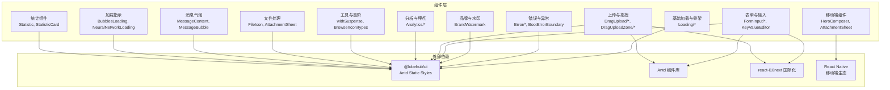
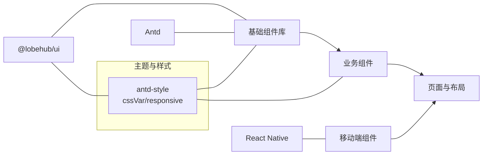
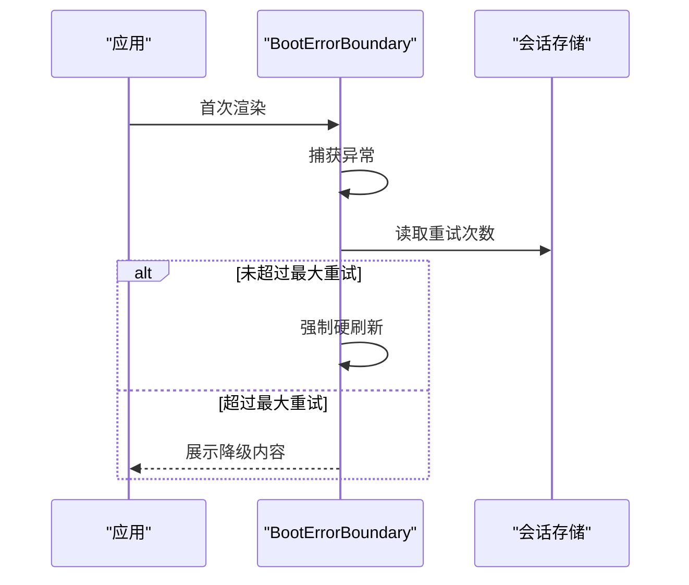
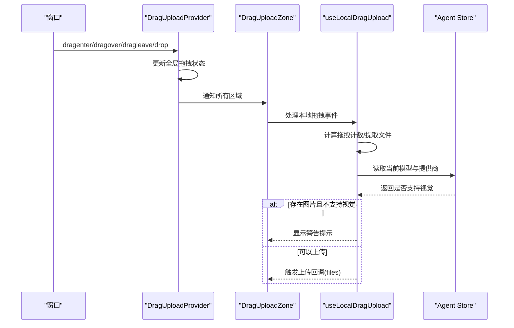
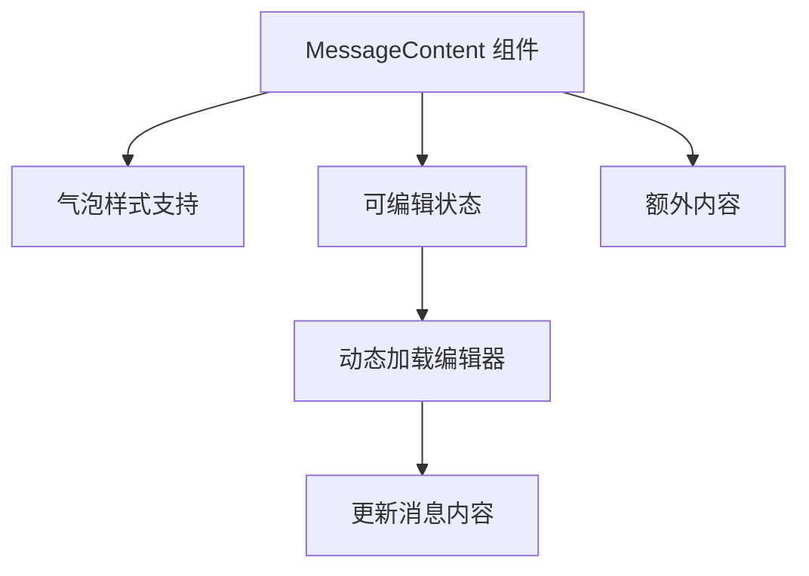

# 组件系统

<cite>
**本文引用的文件**
- [README.md](file://README.md)
- [src/components/withSuspense.tsx](file://src/components/withSuspense.tsx)
- [src/components/BrowserIcon/types.ts](file://src/components/BrowserIcon/types.ts)
- [src/components/FormInput/FormInput.tsx](file://src/components/FormInput/FormInput.tsx)
- [src/components/DragUpload/useDragUpload.tsx](file://src/components/DragUpload/useDragUpload.tsx)
- [src/components/Analytics/index.tsx](file://src/components/Analytics/index.tsx)
- [src/components/BootErrorBoundary/index.tsx](file://src/components/BootErrorBoundary/index.tsx)
- [src/components/BrandWatermark/index.tsx](file://src/components/BrandWatermark/index.tsx)
- [src/components/Error/index.tsx](file://src/components/Error/index.tsx)
- [src/components/Loading/FullscreenLoading/index.tsx](file://src/components/Loading/FullscreenLoading/index.tsx)
- [src/components/Loading/SkeletonLoading/index.tsx](file://src/components/Loading/SkeletonLoading/index.tsx)
- [src/components/Statistic/index.tsx](file://src/components/Statistic/index.tsx)
- [src/components/KeyValueEditor/index.tsx](file://src/components/KeyValueEditor/index.tsx)
- [src/components/JSONSchemaConfig/ItemRender.tsx](file://src/components/JSONSchemaConfig/ItemRender.tsx)
- [scripts/replaceComponentImports.ts](file://scripts/replaceComponentImports.ts)
- [src/components/DragUploadZone/index.tsx](file://src/components/DragUploadZone/index.tsx)
- [src/components/DragUploadZone/DragUploadProvider.tsx](file://src/components/DragUploadZone/DragUploadProvider.tsx)
- [src/components/DragUploadZone/useLocalDragUpload.ts](file://src/components/DragUploadZone/useLocalDragUpload.ts)
- [src/components/FileIcon/index.tsx](file://src/components/FileIcon/index.tsx)
- [src/features/Conversation/ChatItem/components/MessageContent/index.tsx](file://src/features/Conversation/ChatItem/components/MessageContent/index.tsx)
- [apps/mobile/src/components/ui/MessageBubble.tsx](file://apps/mobile/src/components/ui/MessageBubble.tsx)
- [apps/mobile/src/components/ui/AttachmentSheet.tsx](file://apps/mobile/src/components/ui/AttachmentSheet.tsx)
- [apps/mobile/src/components/ui/HeroComposer.tsx](file://apps/mobile/src/components/ui/HeroComposer.tsx)
- [src/components/BubblesLoading/index.tsx](file://src/components/BubblesLoading/index.tsx)
- [src/components/StatisticCard/growthPercentage.tsx](file://src/components/StatisticCard/growthPercentage.tsx)
</cite>

## 更新摘要
**所做更改**
- 新增拖拽上传区域组件系统，包含全局拖拽状态管理和本地拖拽处理
- 重构消息气泡组件，支持更丰富的消息内容展示和附件处理
- 新增附件表单组件，提供完整的文件上传和预览功能
- 扩展文件图标组件，支持多种文件类型的可视化展示
- 新增气泡加载组件，提供统一的消息加载状态指示
- 增强统计卡片组件，添加增长百分比计算功能

## 目录
1. [简介](#简介)
2. [项目结构](#项目结构)
3. [核心组件](#核心组件)
4. [架构总览](#架构总览)
5. [组件详解](#组件详解)
6. [依赖关系分析](#依赖关系分析)
7. [性能考量](#性能考量)
8. [故障排查指南](#故障排查指南)
9. [结论](#结论)
10. [附录](#附录)

## 简介
本文件面向 LobeHub 前端组件体系，系统梳理可复用组件库的设计理念、分类与组织方式，逐项说明组件功能、属性、事件与样式定制要点，并给出使用示例与最佳实践。同时覆盖主题系统、样式覆盖、响应式设计、无障碍支持、跨浏览器兼容性与性能优化建议；并阐述组件间组合模式、状态共享与生命周期管理等高级用法，最后提供组件开发指南与测试策略。

**更新** 本次更新重点反映了应用变更：新增大量UI组件、消息气泡重构、附件表单等，显著增强了组件系统的完整性和功能性。

## 项目结构
LobeHub 的组件主要位于 src/components 下，按功能域与复用度进行分层组织：
- 通用基础：如加载、骨架屏、统计卡片、错误捕获、品牌水印等
- 表单与输入：如表单输入封装、键值编辑器、JSON Schema 渲染
- 上传与拖拽：拖拽上传与粘贴上传的 Hook 及 Provider
- 分析与埋点：多平台分析脚本的动态注入与桌面端适配
- 异常边界：启动阶段的错误边界，保障首次渲染稳定性
- 工具与高阶：Suspense 高阶组件、SVG 组件类型定义
- **新增** 文件处理：文件图标展示、附件上传、消息气泡渲染
- **新增** 移动端组件：附件弹窗、英雄组合器、消息气泡增强

**图表来源**
- [src/components/Loading/FullscreenLoading/index.tsx:1-27](file://src/components/Loading/FullscreenLoading/index.tsx#L1-L27)
- [src/components/Error/index.tsx:1-70](file://src/components/Error/index.tsx#L1-L70)
- [src/components/BrandWatermark/index.tsx:1-52](file://src/components/BrandWatermark/index.tsx#L1-L52)
- [src/components/FormInput/FormInput.tsx:1-48](file://src/components/FormInput/FormInput.tsx#L1-L48)
- [src/components/KeyValueEditor/index.tsx:1-205](file://src/components/KeyValueEditor/index.tsx#L1-L205)
- [src/components/DragUpload/useDragUpload.tsx:1-186](file://src/components/DragUpload/useDragUpload.tsx#L1-L186)
- [src/components/Analytics/index.tsx:1-47](file://src/components/Analytics/index.tsx#L1-L47)
- [src/components/withSuspense.tsx:1-9](file://src/components/withSuspense.tsx#L1-L9)
- [src/components/BrowserIcon/types.ts:1-8](file://src/components/BrowserIcon/types.ts#L1-L8)
- [src/components/DragUploadZone/index.tsx:1-187](file://src/components/DragUploadZone/index.tsx#L1-L187)
- [src/components/FileIcon/index.tsx:1-35](file://src/components/FileIcon/index.tsx#L1-L35)
- [src/features/Conversation/ChatItem/components/MessageContent/index.tsx:1-107](file://src/features/Conversation/ChatItem/components/MessageContent/index.tsx#L1-L107)
- [apps/mobile/src/components/ui/MessageBubble.tsx:1-800](file://apps/mobile/src/components/ui/MessageBubble.tsx#L1-L800)
- [apps/mobile/src/components/ui/AttachmentSheet.tsx:1-214](file://apps/mobile/src/components/ui/AttachmentSheet.tsx#L1-L214)
- [apps/mobile/src/components/ui/HeroComposer.tsx:1-396](file://apps/mobile/src/components/ui/HeroComposer.tsx#L1-L396)

**章节来源**
- [README.md:1-120](file://README.md#L1-L120)

## 核心组件
- 加载与骨架屏：提供全屏加载与骨架屏组件，统一加载态视觉与交互体验
- 错误捕获与边界：提供错误展示与重试能力，以及启动阶段的硬刷新恢复机制
- 品牌与水印：品牌文案与链接，支持自定义组织名
- 表单与输入：封装输入行为、中英文输入法处理、键值对编辑与 JSON Schema 渲染
- 上传与拖拽：跨浏览器的拖拽与粘贴文件处理，结合模型能力做能力校验
- 分析与埋点：按环境变量动态注入多平台分析脚本，支持桌面端适配
- 工具与高阶：Suspense 包裹高阶组件、SVG 组件类型定义
- **新增** 文件图标：支持多种文件类型的可视化展示，包含目录和特殊文件类型
- **新增** 消息气泡：重构的消息内容渲染组件，支持气泡样式和编辑功能
- **新增** 附件处理：完整的附件上传、预览和管理功能
- **新增** 加载指示：专门的消息加载状态指示组件

**章节来源**
- [src/components/Loading/FullscreenLoading/index.tsx:1-27](file://src/components/Loading/FullscreenLoading/index.tsx#L1-L27)
- [src/components/Loading/SkeletonLoading/index.tsx:1-32](file://src/components/Loading/SkeletonLoading/index.tsx#L1-L32)
- [src/components/Error/index.tsx:1-70](file://src/components/Error/index.tsx#L1-L70)
- [src/components/BootErrorBoundary/index.tsx:1-126](file://src/components/BootErrorBoundary/index.tsx#L1-L126)
- [src/components/BrandWatermark/index.tsx:1-52](file://src/components/BrandWatermark/index.tsx#L1-L52)
- [src/components/FormInput/FormInput.tsx:1-48](file://src/components/FormInput/FormInput.tsx#L1-L48)
- [src/components/KeyValueEditor/index.tsx:1-205](file://src/components/KeyValueEditor/index.tsx#L1-L205)
- [src/components/JSONSchemaConfig/ItemRender.tsx:1-55](file://src/components/JSONSchemaConfig/ItemRender.tsx#L1-L55)
- [src/components/DragUpload/useDragUpload.tsx:1-186](file://src/components/DragUpload/useDragUpload.tsx#L1-L186)
- [src/components/Analytics/index.tsx:1-47](file://src/components/Analytics/index.tsx#L1-L47)
- [src/components/withSuspense.tsx:1-9](file://src/components/withSuspense.tsx#L1-L9)
- [src/components/BrowserIcon/types.ts:1-8](file://src/components/BrowserIcon/types.ts#L1-L8)
- [src/components/FileIcon/index.tsx:1-35](file://src/components/FileIcon/index.tsx#L1-L35)
- [src/features/Conversation/ChatItem/components/MessageContent/index.tsx:1-107](file://src/features/Conversation/ChatItem/components/MessageContent/index.tsx#L1-L107)
- [apps/mobile/src/components/ui/AttachmentSheet.tsx:1-214](file://apps/mobile/src/components/ui/AttachmentSheet.tsx#L1-L214)
- [src/components/BubblesLoading/index.tsx:1-14](file://src/components/BubblesLoading/index.tsx#L1-L14)

## 架构总览
组件系统以"基础能力 + 业务场景"两条主线构建：
- 基础能力：加载、骨架、错误、品牌、分析、工具等通用模块，向上支撑各页面与业务组件
- 业务场景：表单、上传、配置渲染等，围绕具体交互与数据形态展开
- **新增** 文件处理：文件类型识别、图标展示、上传管理
- **新增** 消息交互：消息气泡渲染、附件处理、移动端优化
- 外部依赖：统一通过 @lobehub/ui 与 Antd 提供一致的样式与交互基线，配合 antd-style 实现主题与响应式

**图表来源**
- [src/components/Loading/SkeletonLoading/index.tsx:1-32](file://src/components/Loading/SkeletonLoading/index.tsx#L1-L32)
- [src/components/BrandWatermark/index.tsx:1-52](file://src/components/BrandWatermark/index.tsx#L1-L52)
- [src/components/KeyValueEditor/index.tsx:1-205](file://src/components/KeyValueEditor/index.tsx#L1-L205)
- [apps/mobile/src/components/ui/MessageBubble.tsx:1-800](file://apps/mobile/src/components/ui/MessageBubble.tsx#L1-L800)

## 组件详解

### 加载与骨架屏
- 全屏加载：在应用初始化或页面切换时提供品牌标识与进度条，统一加载态
- 骨架屏：基于 @lobehub/ui 的 Skeleton，内置响应式样式与默认段落数
- **新增** 气泡加载：专门的消息气泡加载指示器，提供脉冲动画效果

**章节来源**
- [src/components/Loading/FullscreenLoading/index.tsx:1-27](file://src/components/Loading/FullscreenLoading/index.tsx#L1-L27)
- [src/components/Loading/SkeletonLoading/index.tsx:1-32](file://src/components/Loading/SkeletonLoading/index.tsx#L1-L32)
- [src/components/BubblesLoading/index.tsx:1-14](file://src/components/BubblesLoading/index.tsx#L1-L14)

### 错误捕获与边界
- 错误展示：居中错误页，支持堆栈折叠显示与重试/回首页
- 启动边界：首次渲染前的错误自动尝试一次硬刷新，避免缓存导致的白屏

**图表来源**
- [src/components/BootErrorBoundary/index.tsx:1-126](file://src/components/BootErrorBoundary/index.tsx#L1-L126)

**章节来源**
- [src/components/Error/index.tsx:1-70](file://src/components/Error/index.tsx#L1-L70)
- [src/components/BootErrorBoundary/index.tsx:1-126](file://src/components/BootErrorBoundary/index.tsx#L1-L126)

### 品牌与水印
- 支持自定义组织名与默认 LobeHub 链接，采用 cssVar 获取主题色，保持与全局主题一致

**章节来源**
- [src/components/BrandWatermark/index.tsx:1-52](file://src/components/BrandWatermark/index.tsx#L1-L52)

### 表单与输入
- 表单输入封装：统一受控值、失焦与回车触发变更、中文输入法状态处理
- 键值编辑器：支持增删改、去重检测、本地记录与外部值同步、国际化占位符
- JSON Schema 渲染：根据类型与格式自动选择输入控件（字符串/密码/枚举、数字/滑块、布尔）

**图表来源**
- [src/components/FormInput/FormInput.tsx:1-48](file://src/components/FormInput/FormInput.tsx#L1-L48)

**章节来源**
- [src/components/FormInput/FormInput.tsx:1-48](file://src/components/FormInput/FormInput.tsx#L1-L48)
- [src/components/KeyValueEditor/index.tsx:1-205](file://src/components/KeyValueEditor/index.tsx#L1-L205)
- [src/components/JSONSchemaConfig/ItemRender.tsx:1-55](file://src/components/JSONSchemaConfig/ItemRender.tsx#L1-L55)

### 上传与拖拽
- 跨浏览器拖拽与粘贴：兼容 Safari 的 FileSystemEntry 与 ClipboardData
- 能力校验：当存在图片且当前模型不支持视觉识别时提示警告
- 状态管理：使用计数器避免 dragleave 导致的状态抖动
- **新增** 拖拽上传区域：提供全局拖拽状态管理和本地拖拽处理的完整解决方案

**图表来源**
- [src/components/DragUploadZone/DragUploadProvider.tsx:1-87](file://src/components/DragUploadZone/DragUploadProvider.tsx#L1-L87)
- [src/components/DragUploadZone/useLocalDragUpload.ts:1-135](file://src/components/DragUploadZone/useLocalDragUpload.ts#L1-L135)

**章节来源**
- [src/components/DragUpload/useDragUpload.tsx:1-186](file://src/components/DragUpload/useDragUpload.tsx#L1-L186)
- [src/components/DragUploadZone/index.tsx:1-187](file://src/components/DragUploadZone/index.tsx#L1-L187)
- [src/components/DragUploadZone/DragUploadProvider.tsx:1-87](file://src/components/DragUploadZone/DragUploadProvider.tsx#L1-L87)
- [src/components/DragUploadZone/useLocalDragUpload.ts:1-135](file://src/components/DragUploadZone/useLocalDragUpload.ts#L1-L135)

### 分析与埋点
- 动态注入：按环境变量开关动态引入各平台分析脚本，桌面端单独处理
- 条件渲染：仅在启用时挂载对应组件，避免无意义的资源加载

**章节来源**
- [src/components/Analytics/index.tsx:1-47](file://src/components/Analytics/index.tsx#L1-L47)

### 工具与高阶
- Suspense 包裹：为懒加载组件提供统一的 Suspense 包裹
- SVG 类型：统一 SVG 组件的尺寸与样式接口

**章节来源**
- [src/components/withSuspense.tsx:1-9](file://src/components/withSuspense.tsx#L1-L9)
- [src/components/BrowserIcon/types.ts:1-8](file://src/components/BrowserIcon/types.ts#L1-L8)

### 文件处理
- **新增** 文件图标：支持多种文件类型的可视化展示，包含目录和特殊文件类型
- **新增** 文件类型映射：根据文件扩展名返回对应的彩色图标
- **新增** 目录支持：提供文件夹图标的专门处理

**章节来源**
- [src/components/FileIcon/index.tsx:1-35](file://src/components/FileIcon/index.tsx#L1-L35)

### 消息气泡重构
- **新增** 消息内容组件：重构的消息内容渲染，支持气泡样式和编辑功能
- **新增** 编辑模态框：动态加载的编辑器模态框，支持消息内容的实时编辑
- **新增** 气泡样式：提供专门的消息气泡样式类名和CSS变量支持

**图表来源**
- [src/features/Conversation/ChatItem/components/MessageContent/index.tsx:1-107](file://src/features/Conversation/ChatItem/components/MessageContent/index.tsx#L1-L107)

**章节来源**
- [src/features/Conversation/ChatItem/components/MessageContent/index.tsx:1-107](file://src/features/Conversation/ChatItem/components/MessageContent/index.tsx#L1-L107)

### 附件处理
- **新增** 附件弹窗：移动端专用的附件选择弹窗，提供相机、相册、文档等功能
- **新增** 英雄组合器：大型输入组件，支持模型选择、搜索、记忆、附件等功能
- **新增** 附件选项：支持相机拍摄、相册选择、文档上传、工作区访问等

**章节来源**
- [apps/mobile/src/components/ui/AttachmentSheet.tsx:1-214](file://apps/mobile/src/components/ui/AttachmentSheet.tsx#L1-L214)
- [apps/mobile/src/components/ui/HeroComposer.tsx:1-396](file://apps/mobile/src/components/ui/HeroComposer.tsx#L1-L396)

### 统计组件增强
- **新增** 增长百分比计算：提供统计卡片的增长率计算功能
- **新增** 统计卡片：增强的统计信息展示组件

**章节来源**
- [src/components/StatisticCard/growthPercentage.tsx:1-8](file://src/components/StatisticCard/growthPercentage.tsx#L1-L8)

## 依赖关系分析
- 组件依赖 @lobehub/ui 与 Antd，统一 UI 基线与静态样式
- 使用 antd-style 的 cssVar 与响应式工具实现主题与响应式
- 国际化通过 react-i18next 注入，组件内部通过 t 函数获取文案
- 动态导入用于分析脚本与部分重型组件，减少首屏体积
- **新增** 移动端依赖：React Native 生态系统的组件和动画库

```mermaid
graph TB
subgraph "组件"
C1["FormInput"]
C2["KeyValueEditor"]
C3["DragUpload"]
C4["Analytics"]
C5["Error"]
C6["BootErrorBoundary"]
C7["BrandWatermark"]
C8["SkeletonLoading"]
C9["FullscreenLoading"]
C10["DragUploadZone"]
C11["FileIcon"]
C12["MessageContent"]
C13["AttachmentSheet"]
C14["HeroComposer"]
C15["BubblesLoading"]
C16["growthPercentage"]
end
UI["@lobehub/ui"] --- C1
UI --- C2
UI --- C4
UI --- C5
UI --- C6
UI --- C7
UI --- C8
UI --- C9
UI --- C10
UI --- C11
UI --- C12
UI --- C13
UI --- C14
UI --- C15
UI --- C16
ANTD["Antd"] --- C2
ANTD --- C3
ANTD --- C10
I18N["react-i18next"] --- C2
I18N --- C3
I18N --- C5
RN["React Native"] --- C13
RN --- C14
```

**图表来源**
- [src/components/FormInput/FormInput.tsx:1-48](file://src/components/FormInput/FormInput.tsx#L1-L48)
- [src/components/KeyValueEditor/index.tsx:1-205](file://src/components/KeyValueEditor/index.tsx#L1-L205)
- [src/components/DragUpload/useDragUpload.tsx:1-186](file://src/components/DragUpload/useDragUpload.tsx#L1-L186)
- [src/components/Analytics/index.tsx:1-47](file://src/components/Analytics/index.tsx#L1-L47)
- [src/components/Error/index.tsx:1-70](file://src/components/Error/index.tsx#L1-L70)
- [src/components/BootErrorBoundary/index.tsx:1-126](file://src/components/BootErrorBoundary/index.tsx#L1-L126)
- [src/components/BrandWatermark/index.tsx:1-52](file://src/components/BrandWatermark/index.tsx#L1-L52)
- [src/components/Loading/SkeletonLoading/index.tsx:1-32](file://src/components/Loading/SkeletonLoading/index.tsx#L1-L32)
- [src/components/Loading/FullscreenLoading/index.tsx:1-27](file://src/components/Loading/FullscreenLoading/index.tsx#L1-L27)
- [src/components/DragUploadZone/index.tsx:1-187](file://src/components/DragUploadZone/index.tsx#L1-L187)
- [src/components/FileIcon/index.tsx:1-35](file://src/components/FileIcon/index.tsx#L1-L35)
- [src/features/Conversation/ChatItem/components/MessageContent/index.tsx:1-107](file://src/features/Conversation/ChatItem/components/MessageContent/index.tsx#L1-L107)
- [apps/mobile/src/components/ui/AttachmentSheet.tsx:1-214](file://apps/mobile/src/components/ui/AttachmentSheet.tsx#L1-L214)
- [apps/mobile/src/components/ui/HeroComposer.tsx:1-396](file://apps/mobile/src/components/ui/HeroComposer.tsx#L1-L396)
- [src/components/BubblesLoading/index.tsx:1-14](file://src/components/BubblesLoading/index.tsx#L1-L14)
- [src/components/StatisticCard/growthPercentage.tsx:1-8](file://src/components/StatisticCard/growthPercentage.tsx#L1-L8)

## 性能考量
- 懒加载与条件渲染：分析脚本与部分重型组件采用动态导入与按需渲染
- 首屏优化：错误边界在首次渲染失败时强制硬刷新，避免缓存导致的卡死
- 输入性能：表单输入组件使用受控值与防抖策略，避免不必要的重渲染
- 样式开销：统一使用 antd-style 的 cssVar 与响应式工具，减少重复计算
- 上传性能：拖拽与粘贴文件时进行能力校验，避免无效请求与错误提示
- **新增** 拖拽性能：全局拖拽状态管理使用计数器避免频繁的状态更新
- **新增** 文件处理：文件图标组件使用高效的类型映射和缓存机制
- **新增** 移动端优化：消息气泡组件使用memo和Suspense优化渲染性能

## 故障排查指南
- 首次渲染失败：检查 BootErrorBoundary 是否触发硬刷新，确认缓存问题
- 加载态异常：核对 FullscreenLoading 的 stages 与 activeStage 是否正确传入
- 表单输入异常：确认 defaultValue 与 onChange 的同步逻辑，检查中文输入法状态
- 键值编辑器冲突：检查重复键名与外部值同步，确保 record 与 list 的转换正确
- 上传失败：确认模型是否支持视觉识别，检查剪贴板与拖拽事件绑定
- **新增** 拖拽区域问题：检查 DragUploadProvider 是否正确包装，确认全局状态同步
- **新增** 文件图标异常：验证文件扩展名映射，检查特殊文件类型的处理
- **新增** 消息气泡渲染：确认消息内容的变体参数和编辑状态管理

**章节来源**
- [src/components/BootErrorBoundary/index.tsx:1-126](file://src/components/BootErrorBoundary/index.tsx#L1-L126)
- [src/components/Loading/FullscreenLoading/index.tsx:1-27](file://src/components/Loading/FullscreenLoading/index.tsx#L1-L27)
- [src/components/FormInput/FormInput.tsx:1-48](file://src/components/FormInput/FormInput.tsx#L1-L48)
- [src/components/KeyValueEditor/index.tsx:1-205](file://src/components/KeyValueEditor/index.tsx#L1-L205)
- [src/components/DragUpload/useDragUpload.tsx:1-186](file://src/components/DragUpload/useDragUpload.tsx#L1-L186)
- [src/components/DragUploadZone/DragUploadProvider.tsx:1-87](file://src/components/DragUploadZone/DragUploadProvider.tsx#L1-L87)
- [src/components/FileIcon/index.tsx:1-35](file://src/components/FileIcon/index.tsx#L1-L35)
- [src/features/Conversation/ChatItem/components/MessageContent/index.tsx:1-107](file://src/features/Conversation/ChatItem/components/MessageContent/index.tsx#L1-L107)

## 结论
LobeHub 组件系统以"统一基线 + 场景化封装"为核心，通过 @lobehub/ui 与 Antd 提供一致的交互与视觉体验，结合 antd-style 实现主题与响应式。组件覆盖加载、错误、品牌、表单、上传、分析等关键领域，具备良好的可复用性与扩展性。

**更新** 本次更新显著增强了组件系统的完整性和功能性，新增的拖拽上传区域、消息气泡重构、附件处理和文件图标组件，为用户提供了更加丰富和流畅的交互体验。移动端组件的加入进一步完善了跨平台支持。

建议在业务组件中遵循统一的属性命名、事件回调与样式约定，确保团队协作效率与长期维护成本可控。

## 附录

### 主题系统与样式覆盖
- 使用 antd-style 的 cssVar 获取主题变量，保证组件随主题切换而自适应
- 使用 createStaticStyles 定义静态样式，结合响应式工具实现移动端适配
- 通过 classNames 与 styles 属性允许上层覆盖局部样式

**章节来源**
- [src/components/BrandWatermark/index.tsx:1-52](file://src/components/BrandWatermark/index.tsx#L1-L52)
- [src/components/Loading/SkeletonLoading/index.tsx:1-32](file://src/components/Loading/SkeletonLoading/index.tsx#L1-L32)

### 响应式设计
- 使用响应式工具在小屏设备上调整内边距与字体大小
- 在骨架屏与全屏加载中统一使用 Flexbox 与居中布局，保证在不同屏幕下的可读性
- **新增** 移动端响应式：HeroComposer 组件支持原生模糊效果和动画过渡

**章节来源**
- [src/components/Loading/SkeletonLoading/index.tsx:1-32](file://src/components/Loading/SkeletonLoading/index.tsx#L1-L32)
- [src/components/Loading/FullscreenLoading/index.tsx:1-27](file://src/components/Loading/FullscreenLoading/index.tsx#L1-L27)
- [apps/mobile/src/components/ui/HeroComposer.tsx:1-396](file://apps/mobile/src/components/ui/HeroComposer.tsx#L1-L396)

### 无障碍访问与跨浏览器兼容
- 表单输入组件提供键盘事件与失焦触发，提升键盘可达性
- 拖拽上传兼容 Safari 的 FileSystemEntry 与现代浏览器的 ClipboardData
- 错误展示提供折叠堆栈，便于开发者定位问题
- **新增** 拖拽区域：提供全局拖拽状态反馈，改善用户体验
- **新增** 移动端无障碍：AttachmentSheet 组件支持屏幕阅读器和触摸手势

**章节来源**
- [src/components/FormInput/FormInput.tsx:1-48](file://src/components/FormInput/FormInput.tsx#L1-L48)
- [src/components/DragUpload/useDragUpload.tsx:1-186](file://src/components/DragUpload/useDragUpload.tsx#L1-L186)
- [src/components/Error/index.tsx:1-70](file://src/components/Error/index.tsx#L1-L70)
- [src/components/DragUploadZone/DragUploadProvider.tsx:1-87](file://src/components/DragUploadZone/DragUploadProvider.tsx#L1-L87)
- [apps/mobile/src/components/ui/AttachmentSheet.tsx:1-214](file://apps/mobile/src/components/ui/AttachmentSheet.tsx#L1-L214)

### 组件使用示例与最佳实践
- 使用 Suspense 包裹：对需要动态导入的组件统一使用 withSuspense 进行包裹
- 表单输入：统一使用 FormInput，避免直接使用原生 Input 导致的输入法问题
- 键值编辑器：通过 onChange 返回的 record 更新外部状态，保持双向同步
- 上传组件：在拖拽区域外增加粘贴上传能力，提升用户操作效率
- 分析脚本：通过环境变量控制开关，避免生产环境不必要的资源加载
- **新增** 拖拽上传：使用 DragUploadProvider 包装整个应用，确保全局状态同步
- **新增** 文件处理：利用 FileIcon 组件简化文件类型展示，提升界面一致性
- **新增** 消息气泡：通过 MessageContent 组件统一消息渲染，支持气泡样式和编辑功能

**章节来源**
- [src/components/withSuspense.tsx:1-9](file://src/components/withSuspense.tsx#L1-L9)
- [src/components/FormInput/FormInput.tsx:1-48](file://src/components/FormInput/FormInput.tsx#L1-L48)
- [src/components/KeyValueEditor/index.tsx:1-205](file://src/components/KeyValueEditor/index.tsx#L1-L205)
- [src/components/DragUpload/useDragUpload.tsx:1-186](file://src/components/DragUpload/useDragUpload.tsx#L1-L186)
- [src/components/Analytics/index.tsx:1-47](file://src/components/Analytics/index.tsx#L1-L47)
- [src/components/DragUploadZone/index.tsx:1-187](file://src/components/DragUploadZone/index.tsx#L1-L187)
- [src/components/FileIcon/index.tsx:1-35](file://src/components/FileIcon/index.tsx#L1-L35)
- [src/features/Conversation/ChatItem/components/MessageContent/index.tsx:1-107](file://src/features/Conversation/ChatItem/components/MessageContent/index.tsx#L1-L107)

### 组件开发指南
- 新组件创建：优先基于 @lobehub/ui 与 Antd 组件进行封装，保持一致的交互与视觉
- 测试策略：为复杂交互（如拖拽、粘贴）编写单元测试，验证事件流与状态更新
- 文档编写：在组件注释中明确属性、事件与样式覆盖点，提供最小可用示例
- 版本迁移：使用 replaceComponentImports 脚本批量替换第三方组件导入路径，降低升级成本
- **新增** 拖拽组件：遵循全局状态管理模式，确保事件冒泡和状态同步
- **新增** 文件组件：建立完善的文件类型映射，支持扩展和自定义
- **新增** 移动端组件：考虑平台差异，提供原生性能和用户体验

**章节来源**
- [scripts/replaceComponentImports.ts:46-228](file://scripts/replaceComponentImports.ts#L46-L228)
- [src/components/DragUploadZone/DragUploadProvider.tsx:1-87](file://src/components/DragUploadZone/DragUploadProvider.tsx#L1-L87)
- [src/components/FileIcon/index.tsx:1-35](file://src/components/FileIcon/index.tsx#L1-L35)
- [apps/mobile/src/components/ui/AttachmentSheet.tsx:1-214](file://apps/mobile/src/components/ui/AttachmentSheet.tsx#L1-L214)