# CI/CD 流水线

<cite>
**本文档引用的文件**
- [.github/workflows/test.yml](file://.github/workflows/test.yml)
- [.github/workflows/e2e.yml](file://.github/workflows/e2e.yml)
- [.github/workflows/release.yml](file://.github/workflows/release.yml)
- [.github/workflows/release-docker.yml](file://.github/workflows/release-docker.yml)
- [.github/workflows/release-desktop-stable.yml](file://.github/workflows/release-desktop-stable.yml)
- [.github/workflows/release-desktop-canary.yml](file://.github/workflows/release-desktop-canary.yml)
- [.github/workflows/release-desktop-beta.yml](file://.github/workflows/release-desktop-beta.yml)
- [.github/workflows/pr-build-desktop.yml](file://.github/workflows/pr-build-desktop.yml)
- [.github/workflows/manual-build-desktop.yml](file://.github/workflows/manual-build-desktop.yml)
- [.github/workflows/bundle-analyzer.yml](file://.github/workflows/bundle-analyzer.yml)
- [package.json](file://package.json)
- [Dockerfile](file://Dockerfile)
- [apps/desktop/dev-app-update.yml](file://apps/desktop/dev-app-update.yml)
- [apps/desktop/scripts/update-test/dev-app-update.local.yml](file://apps/desktop/scripts/update-test/dev-app-update.local.yml)
- [docker-compose/deploy/docker-compose.yml](file://docker-compose/deploy/docker-compose.yml)
- [docker-compose/dev/docker-compose.yml](file://docker-compose/dev/docker-compose.yml)
- [docker-compose/production/grafana/docker-compose.yml](file://docker-compose/production/grafana/docker-compose.yml)
- [scripts/electronWorkflow/mergeMacReleaseFiles.js](file://scripts/electronWorkflow/mergeMacReleaseFiles.js)
</cite>

## 目录

1. [简介](#简介)
2. [项目结构](#项目结构)
3. [核心组件](#核心组件)
4. [架构概览](#架构概览)
5. [详细组件分析](#详细组件分析)
6. [依赖关系分析](#依赖关系分析)
7. [性能考虑](#性能考虑)
8. [故障排除指南](#故障排除指南)
9. [结论](#结论)
10. [附录](#附录)

## 简介

LobeHub 项目采用全面的 CI/CD 流水线设计，涵盖了从代码质量检查到多环境部署的完整自动化流程。该项目基于 GitHub Actions 构建了强大的持续集成和持续部署体系，支持多种发布渠道和部署策略。

项目的核心特点包括：

- 多层次的测试覆盖（单元测试、集成测试、端到端测试）
- 多平台桌面应用构建和发布
- Docker 容器化部署支持
- 多种发布渠道（稳定版、测试版、金丝雀版）
- 自动化的版本管理和变更日志生成
- 完善的监控和回滚机制

## 项目结构

LobeHub 项目采用 Monorepo 架构，包含多个应用程序和包：

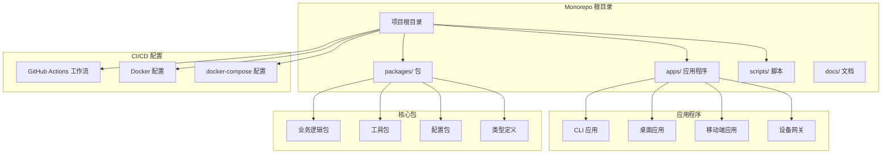

**图表来源**

- [package.json](file://package.json#L30-L35)
- [.github/workflows/test.yml](file://.github/workflows/test.yml#L1-L268)

**章节来源**

- [package.json](file://package.json#L30-L35)
- [.github/workflows/test.yml](file://.github/workflows/test.yml#L1-L268)

## 核心组件

### 测试流水线组件

项目建立了多层次的测试体系，确保代码质量和功能稳定性：

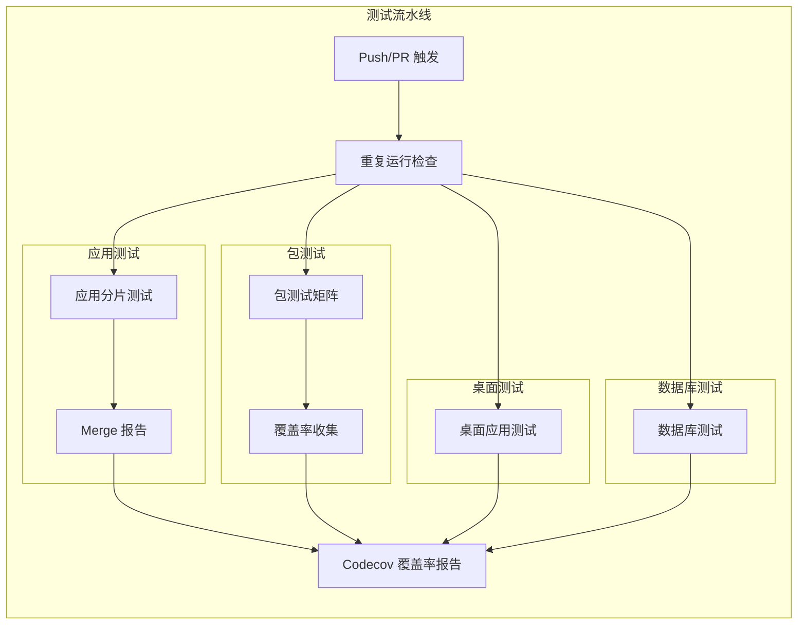

**图表来源**

- [.github/workflows/test.yml](file://.github/workflows/test.yml#L13-L268)

### 桌面应用构建组件

桌面应用支持多平台、多渠道的构建和发布：

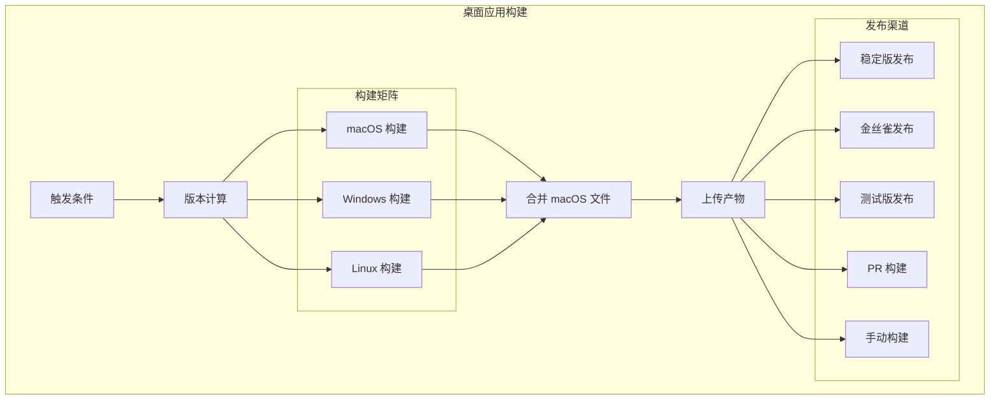

**图表来源**

- [.github/workflows/release-desktop-stable.yml](file://.github/workflows/release-desktop-stable.yml#L23-L370)
- [.github/workflows/release-desktop-canary.yml](file://.github/workflows/release-desktop-canary.yml#L19-L430)

**章节来源**

- [.github/workflows/test.yml](file://.github/workflows/test.yml#L13-L268)
- [.github/workflows/release-desktop-stable.yml](file://.github/workflows/release-desktop-stable.yml#L72-L370)
- [.github/workflows/release-desktop-canary.yml](file://.github/workflows/release-desktop-canary.yml#L40-L430)

## 架构概览

### 整体 CI/CD 架构

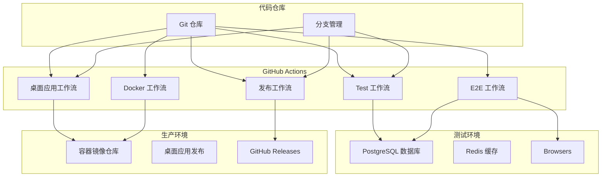

**图表来源**

- [.github/workflows/test.yml](file://.github/workflows/test.yml#L3-L11)
- [.github/workflows/e2e.yml](file://.github/workflows/e2e.yml#L3-L24)
- [.github/workflows/release-docker.yml](file://.github/workflows/release-docker.yml#L5-L12)

### 多环境部署架构

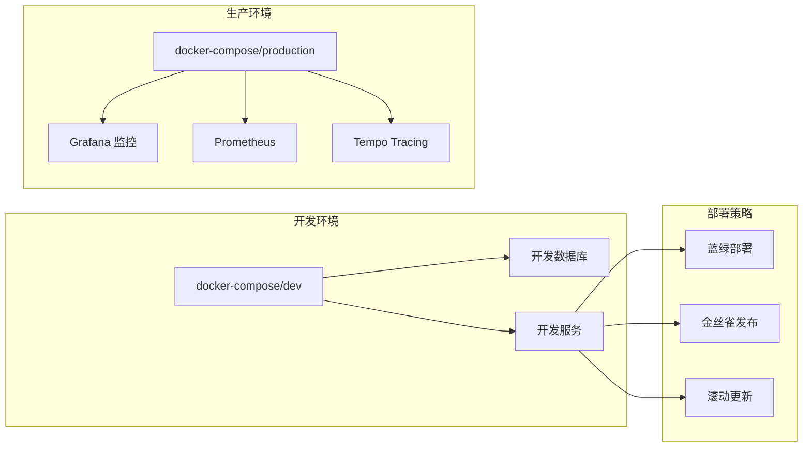

**图表来源**

- [docker-compose/dev/docker-compose.yml](file://docker-compose/dev/docker-compose.yml)
- [docker-compose/production/grafana/docker-compose.yml](file://docker-compose/production/grafana/docker-compose.yml)

**章节来源**

- [docker-compose/dev/docker-compose.yml](file://docker-compose/dev/docker-compose.yml)
- [docker-compose/production/grafana/docker-compose.yml](file://docker-compose/production/grafana/docker-compose.yml)

## 详细组件分析

### 测试流水线详细分析

#### 单元测试组件

测试流水线采用分层设计，确保高效的资源利用和全面的测试覆盖：

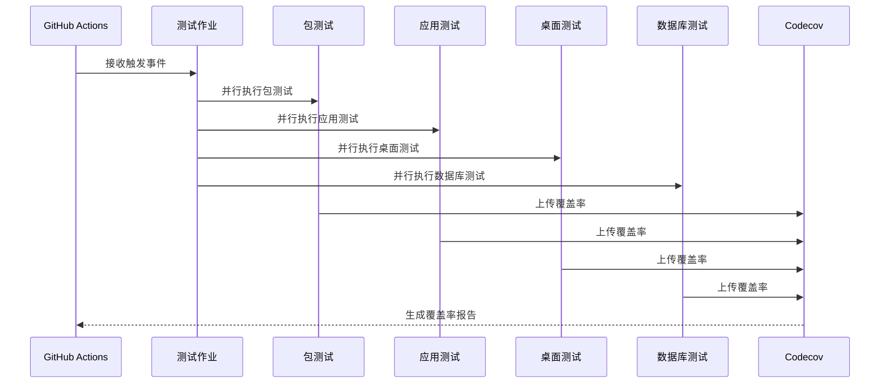

**图表来源**

- [.github/workflows/test.yml](file://.github/workflows/test.yml#L13-L268)

#### 端到端测试组件

E2E 测试提供了完整的用户场景验证：

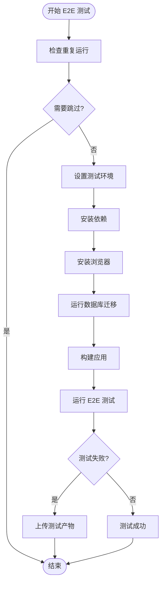

**图表来源**

- [.github/workflows/e2e.yml](file://.github/workflows/e2e.yml#L26-L95)

**章节来源**

- [.github/workflows/test.yml](file://.github/workflows/test.yml#L13-L268)
- [.github/workflows/e2e.yml](file://.github/workflows/e2e.yml#L26-L95)

### 桌面应用发布流水线

#### 稳定版发布组件

稳定版发布流程严格控制发布质量：

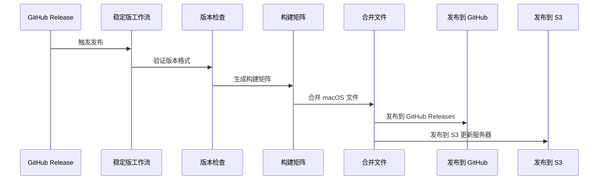

**图表来源**

- [.github/workflows/release-desktop-stable.yml](file://.github/workflows/release-desktop-stable.yml#L76-L370)

#### 金丝雀发布组件

金丝雀发布支持渐进式部署：

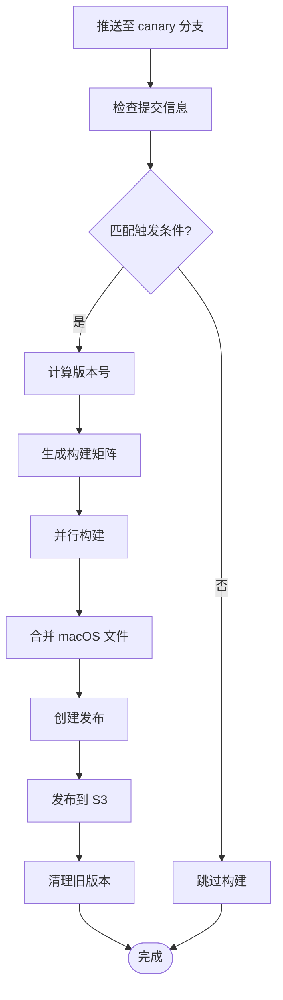

**图表来源**

- [.github/workflows/release-desktop-canary.yml](file://.github/workflows/release-desktop-canary.yml#L44-L430)

**章节来源**

- [.github/workflows/release-desktop-stable.yml](file://.github/workflows/release-desktop-stable.yml#L76-L370)
- [.github/workflows/release-desktop-canary.yml](file://.github/workflows/release-desktop-canary.yml#L44-L430)

### Docker 容器化部署

#### 多平台镜像构建

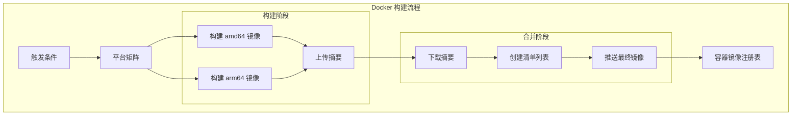

**图表来源**

- [.github/workflows/release-docker.yml](file://.github/workflows/release-docker.yml#L18-L133)

**章节来源**

- [.github/workflows/release-docker.yml](file://.github/workflows/release-docker.yml#L18-L133)

### 版本管理和发布流程

#### 自动化版本管理

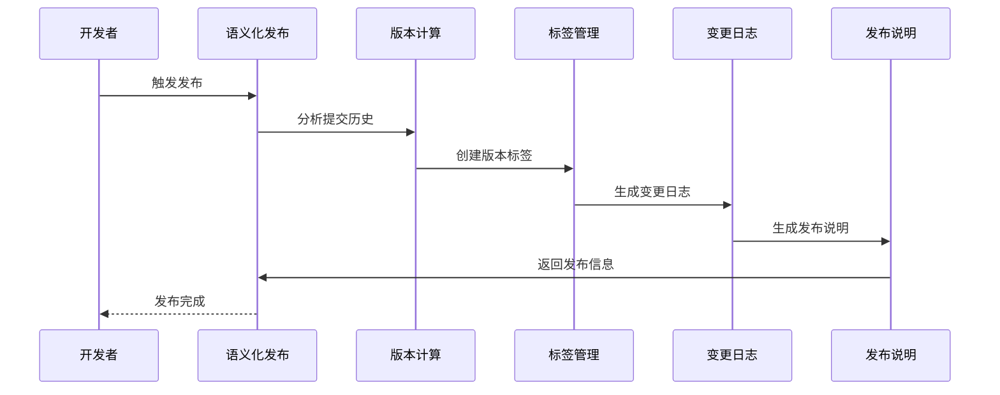

**图表来源**

- [package.json](file://package.json#L95-L96)

**章节来源**

- [package.json](file://package.json#L95-L96)

## 依赖关系分析

### CI/CD 工作流依赖图

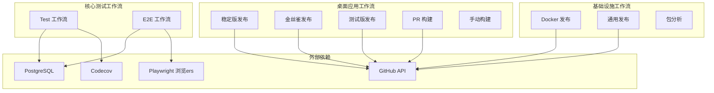

**图表来源**

- [.github/workflows/test.yml](file://.github/workflows/test.yml#L223-L234)
- [.github/workflows/e2e.yml](file://.github/workflows/e2e.yml#L48-L57)

### 服务依赖关系

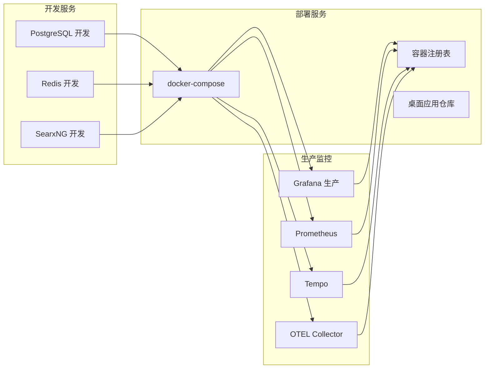

**图表来源**

- [docker-compose/dev/docker-compose.yml](file://docker-compose/dev/docker-compose.yml)
- [docker-compose/production/grafana/docker-compose.yml](file://docker-compose/production/grafana/docker-compose.yml)

**章节来源**

- [docker-compose/dev/docker-compose.yml](file://docker-compose/dev/docker-compose.yml)
- [docker-compose/production/grafana/docker-compose.yml](file://docker-compose/production/grafana/docker-compose.yml)

## 性能考虑

### 测试性能优化

项目采用了多项性能优化策略：

1. **并行执行**: 测试任务采用并行执行模式，最大化利用 CI 资源
2. **分片测试**: 应用测试采用分片策略，提高测试效率
3. **缓存机制**: 使用包管理器缓存减少依赖安装时间
4. **重复运行检查**: 避免相同内容的重复执行

### 构建性能优化

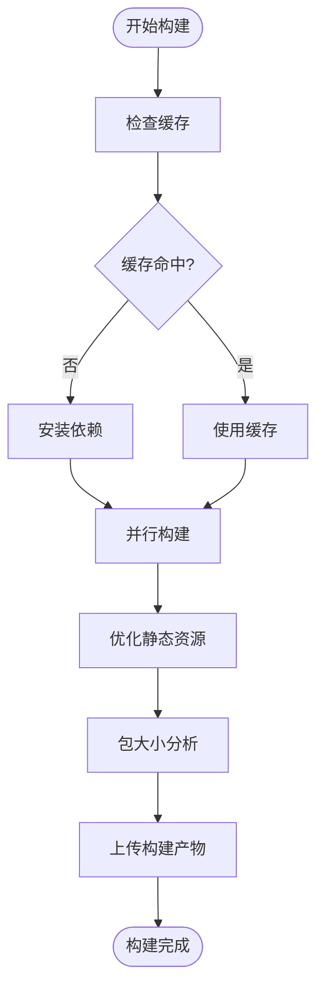

**图表来源**

- [.github/workflows/bundle-analyzer.yml](file://.github/workflows/bundle-analyzer.yml#L15-L116)

### 资源管理策略

项目实施了严格的资源管理策略：

- **并发控制**: 使用 `concurrency` 字段控制同时运行的工作流数量
- **超时管理**: 为长时间运行的任务设置合理的超时时间
- **内存优化**: 通过 `NODE_OPTIONS` 参数优化 Node.js 内存使用
- **存储管理**: 合理设置工件保留策略，避免存储空间浪费

## 故障排除指南

### 常见问题诊断

#### 测试失败排查

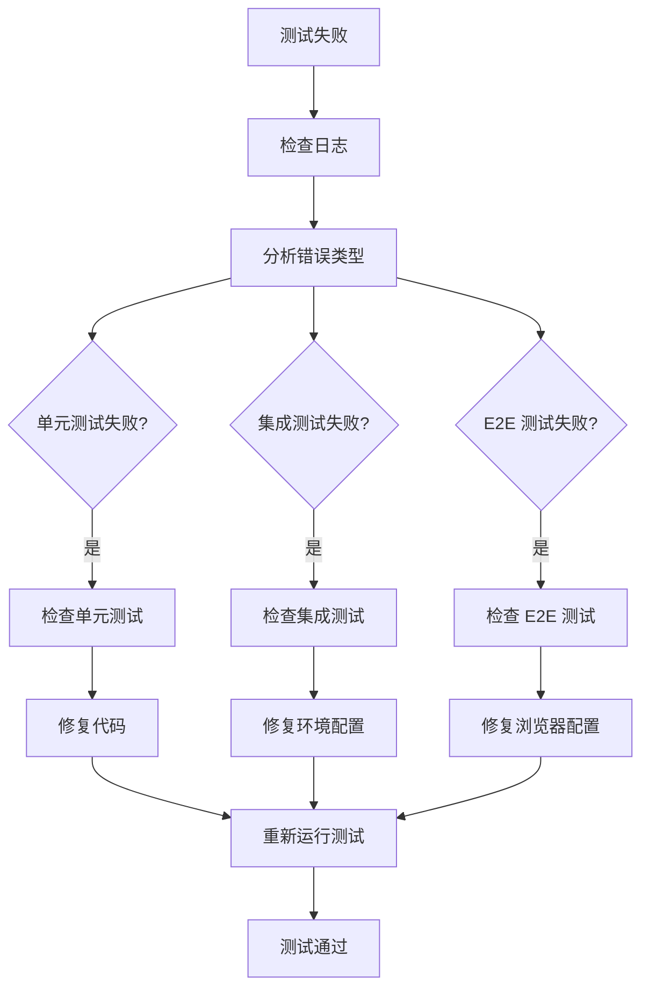

#### 构建失败排查

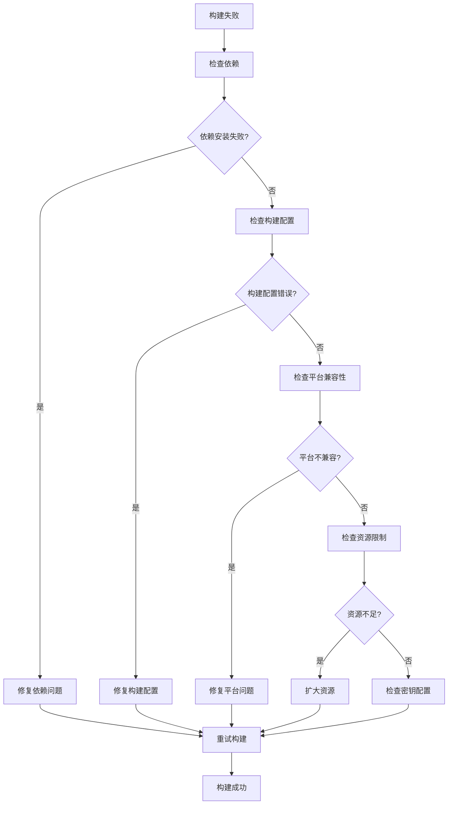

### 错误处理机制

项目建立了完善的错误处理和恢复机制：

1. **自动重试**: 关键任务支持自动重试机制
2. **回滚策略**: 支持快速回滚到稳定版本
3. **监控告警**: 实时监控构建状态和性能指标
4. **日志记录**: 完整的日志记录便于问题追踪

**章节来源**

- [.github/workflows/test.yml](file://.github/workflows/test.yml#L9-L11)
- [.github/workflows/e2e.yml](file://.github/workflows/e2e.yml#L59-L84)

## 结论

LobeHub 项目的 CI/CD 流水线设计体现了现代 DevOps 最佳实践，具有以下显著优势：

### 核心优势

1. **全面的测试覆盖**: 多层次、多平台的测试策略确保代码质量
2. **灵活的发布策略**: 支持多种发布渠道和部署策略
3. **高效的资源利用**: 并行执行和智能缓存提升构建效率
4. **完善的监控体系**: 全链路监控和告警机制
5. **自动化程度高**: 从代码提交到生产部署的全流程自动化

### 技术亮点

- **多平台支持**: 同时支持 macOS、Windows、Linux 平台
- **容器化部署**: 完善的 Docker 集成和多平台镜像构建
- **版本管理**: 自动化的版本计算和发布流程
- **监控集成**: 与 Grafana、Prometheus 等监控系统的深度集成

### 改进建议

1. **性能监控**: 可以增加更详细的性能指标监控
2. **安全扫描**: 集成安全漏洞扫描工具
3. **A/B 测试**: 支持更精细的灰度发布策略
4. **自动化回滚**: 完善自动回滚机制

该项目的 CI/CD 流水线为大型复杂项目的持续交付提供了优秀的参考模板，其设计理念和实现细节值得其他项目借鉴学习。

## 附录

### 配置文件参考

#### Docker 配置示例

```dockerfile
# Dockerfile 配置要点
FROM node:24.11.1-alpine

# 设置工作目录
WORKDIR /app

# 复制依赖文件
COPY package.json pnpm-lock.yaml ./

# 安装依赖
RUN npm install -g pnpm && pnpm install

# 复制应用代码
COPY . .

# 构建应用
RUN pnpm build

# 暴露端口
EXPOSE 3000

# 健康检查
HEALTHCHECK CMD curl -f http://localhost:3000/api/health || exit 1

# 启动命令
CMD ["pnpm", "start"]
```

#### docker-compose 配置示例

```yaml
# docker-compose 配置要点
version: '3.8'

services:
  postgres:
    image: paradedb/paradedb:latest
    environment:
      POSTGRES_PASSWORD: postgres
    healthcheck:
      test: ['CMD-SHELL', 'pg_isready']
      interval: 10s
      timeout: 5s
      retries: 5
    ports:
      - '5432:5432'

  redis:
    image: redis:alpine
    healthcheck:
      test: ['CMD', 'redis-cli', 'ping']
      interval: 10s
      timeout: 5s
      retries: 3

  searxng:
    image: searxng/searxng:latest
    depends_on:
      postgres:
        condition: service_healthy
      redis:
        condition: service_healthy
    environment:
      BASE_URL: http://localhost:8080
    ports:
      - '8080:8080'
```

### 最佳实践建议

1. **安全最佳实践**
   - 使用最小权限原则管理 GitHub Secrets
   - 定期轮换敏感凭据
   - 实施依赖项安全扫描

2. **性能优化建议**
   - 优化构建缓存策略
   - 实施增量构建
   - 使用更快的包管理器

3. **监控和可观测性**
   - 集成更详细的性能指标
   - 实施分布式追踪
   - 建立告警阈值和通知机制

4. **扩展性考虑**
   - 支持更多的部署目标
   - 实施更灵活的发布策略
   - 增强多环境管理能力

**章节来源**

- [Dockerfile](file://Dockerfile)
- [docker-compose/dev/docker-compose.yml](file://docker-compose/dev/docker-compose.yml)
- [docker-compose/production/grafana/docker-compose.yml](file://docker-compose/production/grafana/docker-compose.yml)
