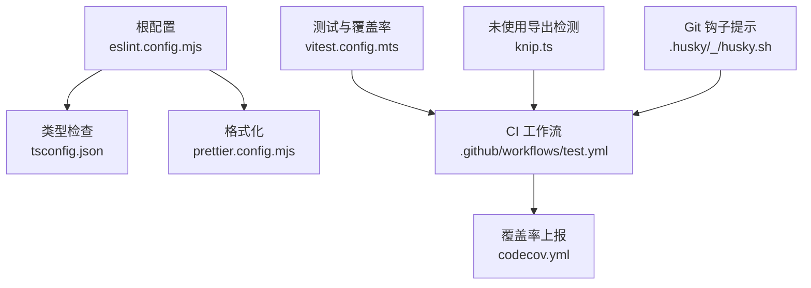
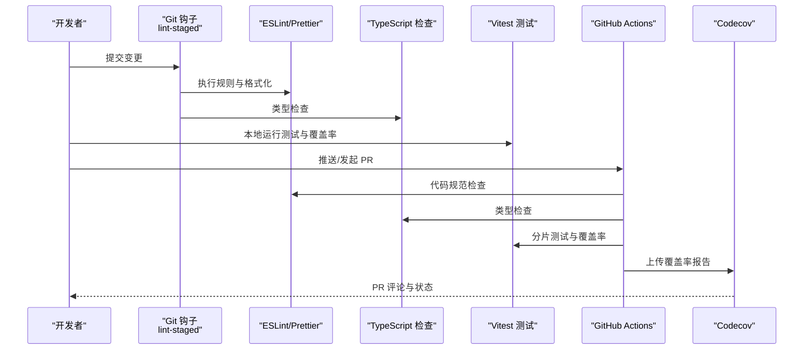
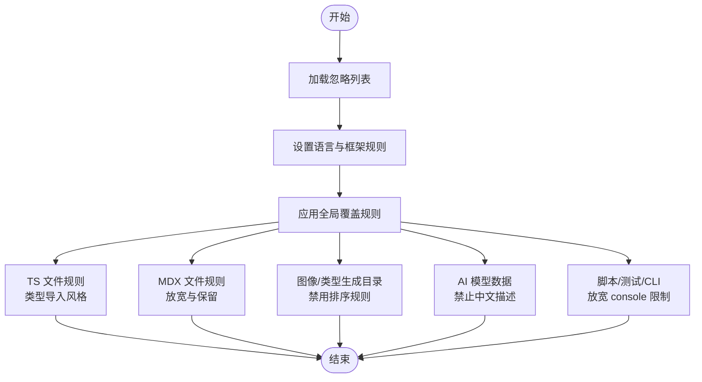
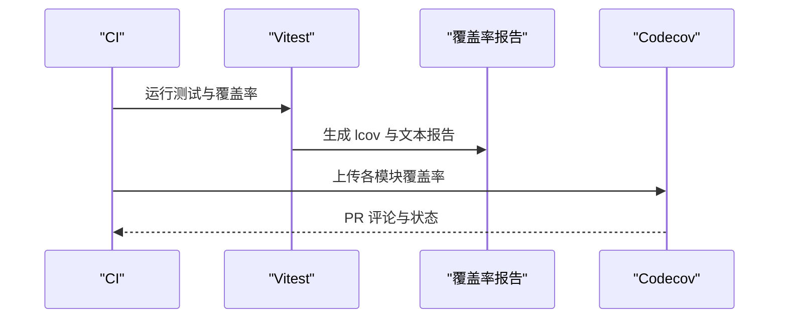
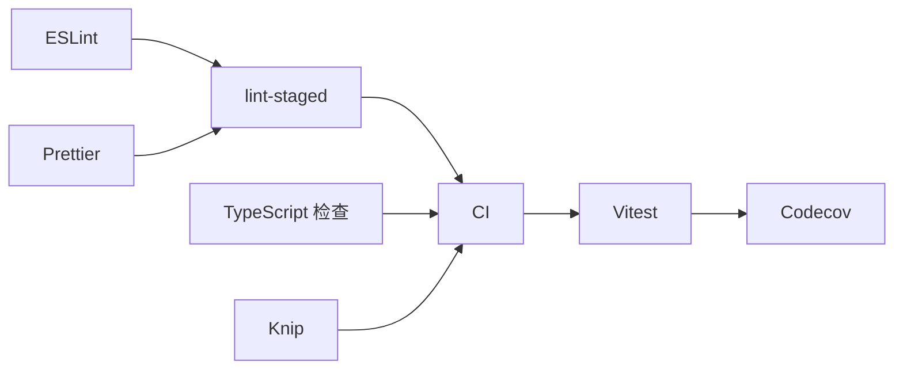

# 代码质量检查

<cite>
**本文引用的文件**
- [eslint.config.mjs](file://eslint.config.mjs)
- [prettier.config.mjs](file://prettier.config.mjs)
- [tsconfig.json](file://tsconfig.json)
- [vitest.config.mts](file://vitest.config.mts)
- [knip.ts](file://knip.ts)
- [.github/workflows/test.yml](file://.github/workflows/test.yml)
- [codecov.yml](file://codecov.yml)
- [package.json](file://package.json)
- [.husky/_/husky.sh](file://.husky/_/husky.sh)
</cite>

## 目录
1. [简介](#简介)
2. [项目结构](#项目结构)
3. [核心组件](#核心组件)
4. [架构总览](#架构总览)
5. [详细组件分析](#详细组件分析)
6. [依赖关系分析](#依赖关系分析)
7. [性能考量](#性能考量)
8. [故障排查指南](#故障排查指南)
9. [结论](#结论)
10. [附录](#附录)

## 简介
本文件系统性梳理 LobeHub 项目的代码质量检查与自动化质量控制流程，覆盖以下方面：
- 规范与格式：ESLint 代码规范检查、Prettier 代码格式化
- 类型与静态分析：TypeScript 类型检查、循环依赖检测、未使用导出检测（Knip）
- 覆盖率与报告：Vitest 测试覆盖率与 Codecov 报告
- 高级质量保障：依赖分析、安全漏洞扫描（建议）
- 代码审查自动化：PR 质量检查、自动评论、代码建议（建议）
- 质量阈值与违规处理：当前配置与改进建议
- 常见问题与最佳实践：可操作的排障与优化清单

## 项目结构
LobeHub 采用 monorepo 结构，多应用与多包并行开发。质量检查体系围绕根目录的统一配置与 CI 工作流展开，确保跨模块一致性。

图表来源
- [eslint.config.mjs](file://eslint.config.mjs#L1-L151)
- [tsconfig.json](file://tsconfig.json#L1-L70)
- [prettier.config.mjs](file://prettier.config.mjs#L1-L4)
- [vitest.config.mts](file://vitest.config.mts#L1-L113)
- [.github/workflows/test.yml](file://.github/workflows/test.yml#L1-L268)
- [codecov.yml](file://codecov.yml#L1-L40)
- [knip.ts](file://knip.ts#L1-L24)
- [.husky/_/husky.sh](file://.husky/_/husky.sh#L1-L9)

章节来源
- [eslint.config.mjs](file://eslint.config.mjs#L1-L151)
- [tsconfig.json](file://tsconfig.json#L1-L70)
- [prettier.config.mjs](file://prettier.config.mjs#L1-L4)
- [vitest.config.mts](file://vitest.config.mts#L1-L113)
- [.github/workflows/test.yml](file://.github/workflows/test.yml#L1-L268)
- [codecov.yml](file://codecov.yml#L1-L40)
- [knip.ts](file://knip.ts#L1-L24)
- [.husky/_/husky.sh](file://.husky/_/husky.sh#L1-L9)

## 核心组件
- ESLint 统一规则与覆盖范围：通过共享配置集中管理忽略项、语言选项、全局覆盖规则以及针对特定目录/文件类型的定制规则（如 TS 类型导入风格、MDX、AI 模型数据校验、脚本与测试环境放宽等）。
- Prettier 格式化：基于共享配置，统一代码风格，配合 lint-staged 在提交前执行格式化。
- TypeScript 类型检查：严格模式与路径别名配置，结合 tsc 或 tsgo 进行类型检查。
- Vitest 覆盖率：按应用层与包层分别收集覆盖率，支持分片与合并，输出 lcov 供 Codecov 上报。
- 依赖与导出健康度：Knip 检测未使用导出与文件，避免冗余与潜在循环依赖。
- CI 质量门禁：GitHub Actions 将 lint、类型检查、测试与覆盖率作为 PR/推送的必要步骤，并将覆盖率上传至 Codecov。

章节来源
- [eslint.config.mjs](file://eslint.config.mjs#L8-L151)
- [prettier.config.mjs](file://prettier.config.mjs#L1-L4)
- [tsconfig.json](file://tsconfig.json#L3-L31)
- [vitest.config.mts](file://vitest.config.mts#L63-L79)
- [knip.ts](file://knip.ts#L3-L21)
- [.github/workflows/test.yml](file://.github/workflows/test.yml#L250-L267)
- [codecov.yml](file://codecov.yml#L25-L40)
- [package.json](file://package.json#L79-L122)

## 架构总览
下图展示从本地到 CI 的质量检查闭环：本地通过 lint-staged 与脚本触发检查；CI 并行运行包与应用测试，聚合覆盖率并上报。

图表来源
- [package.json](file://package.json#L124-L153)
- [.github/workflows/test.yml](file://.github/workflows/test.yml#L250-L267)
- [vitest.config.mts](file://vitest.config.mts#L63-L79)
- [codecov.yml](file://codecov.yml#L38-L40)

章节来源
- [package.json](file://package.json#L124-L153)
- [.github/workflows/test.yml](file://.github/workflows/test.yml#L1-L268)
- [vitest.config.mts](file://vitest.config.mts#L63-L79)
- [codecov.yml](file://codecov.yml#L38-L40)

## 详细组件分析

### ESLint 代码规范检查
- 忽略项：依赖、CI 输出、测试文件、构建产物、临时目录、缓存目录、AI 编码工具目录等，避免误报与性能开销。
- 语言与框架：启用 Next/React 规则集，TS 配置根目录指向仓库根，确保解析一致。
- 全局覆盖：对若干 React/Next/ESLint 插件规则进行关闭或降级，以适配项目现状。
- 文件级定制：
  - TS 文件：强制一致的类型导入风格，提升维护性。
  - MDX 文件：放宽部分变量未使用与 JSX 未定义规则，保留必要的变量检查。
  - 特定目录：禁用排序类规则，满足图像与类型生成器的特殊结构。
  - AI 模型数据：限制中文描述，确保国际化一致性。
  - 脚本与测试：允许 console 日志，便于调试与 CLI 输出。
- 复杂度与可读性：通过规则组合在“严格”与“可用性”之间取得平衡。

图表来源
- [eslint.config.mjs](file://eslint.config.mjs#L10-L151)

章节来源
- [eslint.config.mjs](file://eslint.config.mjs#L8-L151)

### Prettier 代码格式化
- 使用共享配置，统一缩进、引号、尾逗号等风格。
- 与 lint-staged 集成，在提交前自动格式化 JS/TS/JSX/TSX/JSON/YAML 等文件。
- Markdown/MDX 由 remark 与 eslint 协同处理，确保文档风格一致。

章节来源
- [prettier.config.mjs](file://prettier.config.mjs#L1-L4)
- [package.json](file://package.json#L124-L153)

### TypeScript 类型检查
- 严格模式与路径别名：启用严格类型、模块解析、增量编译与路径映射，提升 IDE 体验与编译稳定性。
- 类型检查命令：提供 tsc 与 tsgo 双通道，便于在不同场景快速验证。
- 与 ESLint 协同：ESLint 的 TS 规则与 tsc 的类型系统共同保障类型安全。

章节来源
- [tsconfig.json](file://tsconfig.json#L3-L31)
- [package.json](file://package.json#L109-L110)

### 覆盖率与报告
- Vitest 配置：
  - 排除目录与文件：测试模拟、包层、迁移脚本、事件流工具等，聚焦业务与核心逻辑。
  - 报告器：text、json、lcov、text-summary，便于本地与 CI 查看。
  - 分片与合并：CI 中分两片并行执行，最后合并报告，缩短耗时。
- CI 工作流：
  - 包层覆盖率：逐包执行并上传至 Codecov，按 flag 标识。
  - 应用层覆盖率：分片测试后合并，上传 app 标记的覆盖率。
  - 桌面端与数据库：独立 job 收集覆盖率并上传。
- Codecov：
  - 组件级分组：按 Store/Services/Server/Libs/Utils 划分组件 ID。
  - 质量门：开启项目级阈值与 PR 评论布局，便于 PR 审阅时快速定位问题。

图表来源
- [.github/workflows/test.yml](file://.github/workflows/test.yml#L54-L101)
- [.github/workflows/test.yml](file://.github/workflows/test.yml#L128-L173)
- [.github/workflows/test.yml](file://.github/workflows/test.yml#L209-L214)
- [.github/workflows/test.yml](file://.github/workflows/test.yml#L253-L267)
- [codecov.yml](file://codecov.yml#L1-L40)

章节来源
- [vitest.config.mts](file://vitest.config.mts#L63-L79)
- [.github/workflows/test.yml](file://.github/workflows/test.yml#L54-L101)
- [.github/workflows/test.yml](file://.github/workflows/test.yml#L128-L173)
- [.github/workflows/test.yml](file://.github/workflows/test.yml#L209-L214)
- [.github/workflows/test.yml](file://.github/workflows/test.yml#L253-L267)
- [codecov.yml](file://codecov.yml#L25-L40)

### 未使用导出与依赖分析（Knip）
- 入口与排除：以应用入口为主，排除测试、包层、e2e、脚本与配置文件，聚焦实际使用导出。
- 行为：识别未使用的 exports、types、enum members、重复声明等，降低冗余与维护成本。
- 与 CI 协同：可在 CI 中加入 Knip 步骤，形成“未使用导出”质量门。

章节来源
- [knip.ts](file://knip.ts#L3-L21)

### 循环依赖检测
- 通过 dpdm（依赖深度检测）在主代码与包层分别执行，遇循环依赖直接失败，确保模块边界清晰。
- 建议在 CI 中固定阈值，防止新引入循环依赖回归。

章节来源
- [package.json](file://package.json#L81-L82)

### Git 钩子与 lint-staged
- 当前存在 husky 提示，建议迁移到更现代的工具链（如 @typed/lint-staged 或直接在 CI 中统一执行），减少本地环境差异。
- lint-staged 已覆盖 JS/TS/JSX/TSX/JSON/YAML/MD/MDX 等文件，确保提交前质量。

章节来源
- [.husky/_/husky.sh](file://.husky/_/husky.sh#L1-L9)
- [package.json](file://package.json#L124-L153)

## 依赖关系分析
- 组件耦合：
  - ESLint 与 Prettier 通过 lint-staged 在本地耦合，CI 中再次执行以保证一致性。
  - Vitest 与 Codecov 形成闭环，CI 中分层收集覆盖率。
  - Knip 与 ESLint/TSC 协同，从“导出使用”与“类型安全”两个维度约束代码健康度。
- 外部依赖：
  - GitHub Actions 提供标准化的 CI 能力。
  - Codecov 提供覆盖率可视化与 PR 评论。

图表来源
- [package.json](file://package.json#L124-L153)
- [.github/workflows/test.yml](file://.github/workflows/test.yml#L250-L267)
- [vitest.config.mts](file://vitest.config.mts#L63-L79)
- [codecov.yml](file://codecov.yml#L38-L40)

章节来源
- [package.json](file://package.json#L124-L153)
- [.github/workflows/test.yml](file://.github/workflows/test.yml#L250-L267)
- [vitest.config.mts](file://vitest.config.mts#L63-L79)
- [codecov.yml](file://codecov.yml#L38-L40)

## 性能考量
- CI 并行与分片：应用层测试分片执行，显著缩短耗时；建议后续引入“按变更集选择分片”的策略进一步提速。
- 排除策略：合理排除测试模拟、包层与迁移脚本，避免无意义计算。
- 缓存与依赖安装：CI 中尽量复用依赖缓存，减少安装时间。
- 本地体验：lint-staged 仅对变更文件执行，降低本地等待时间。

## 故障排查指南
- ESLint 规则冲突
  - 现象：某些规则在 TS/MDX/特定目录下产生误报或与团队风格冲突。
  - 处理：参考文件级覆盖规则，按需放宽或调整严重级别，保持“可执行且可维护”的平衡。
  - 参考路径：[eslint.config.mjs](file://eslint.config.mjs#L74-L151)
- Prettier 与 ESLint 冲突
  - 现象：格式化与规则修复相互影响。
  - 处理：确认 lint-staged 执行顺序，先 Prettier 后 ESLint/Fix，或使用支持“parser=typescript”的 Prettier 规则。
  - 参考路径：[package.json](file://package.json#L145-L148)
- Vitest 覆盖率缺失
  - 现象：覆盖率报告为空或不完整。
  - 处理：检查排除列表是否过度，确认报告器与输出目录正确；在 CI 中合并分片报告后再上传。
  - 参考路径：[vitest.config.mts](file://vitest.config.mts#L63-L79)
- Codecov 未显示 PR 评论
  - 现象：PR 未出现覆盖率评论。
  - 处理：确认上传文件路径与 flags 与配置一致；检查 token 权限与服务端配置。
  - 参考路径：[codecov.yml](file://codecov.yml#L38-L40)
- 循环依赖导致构建失败
  - 现象：类型检查或打包阶段报循环依赖错误。
  - 处理：重构模块边界，拆分共享逻辑；在 CI 中固定循环依赖阈值，阻止回归。
  - 参考路径：[package.json](file://package.json#L81-L82)
- 未使用导出堆积
  - 现象：Knip 报告大量未使用导出。
  - 处理：删除或迁移未使用导出；在 CI 中加入 Knip 步骤，形成质量门。
  - 参考路径：[knip.ts](file://knip.ts#L3-L21)

章节来源
- [eslint.config.mjs](file://eslint.config.mjs#L74-L151)
- [package.json](file://package.json#L145-L148)
- [vitest.config.mts](file://vitest.config.mts#L63-L79)
- [codecov.yml](file://codecov.yml#L38-L40)
- [package.json](file://package.json#L81-L82)
- [knip.ts](file://knip.ts#L3-L21)

## 结论
LobeHub 的代码质量检查体系以“统一配置 + CI 强约束 + 可视化反馈”为核心，覆盖规范、格式、类型、覆盖率与导出健康度等关键维度。建议在现有基础上：
- 引入安全漏洞扫描（如 npm audit、Snyk）与依赖更新策略（Renovate）；
- 在 CI 中增加 Knip 与循环依赖检测作为质量门；
- 优化 lint-staged 与 CI 的一致性，减少本地与远端差异；
- 明确质量阈值与违规处理策略，固化 PR 质量检查与自动评论机制。

## 附录

### 质量阈值与违规处理策略（建议）
- 覆盖率阈值：项目级阈值可按模块设定，例如“Store/Services/Server/Libs/Utils”分别设置目标，PR 评论中展示组件级差异。
- 规则严重级别：默认以 warn 为主，master 分支强制以 error，确保回归可控。
- 违规处理：CI 中失败即阻断合并；对可自动修复的规则（如 Prettier/ESLint Fix）优先自动修复；对结构性问题（如循环依赖）要求人工评审。

### 常见问题与最佳实践
- 提交前检查：确保 lint-staged 覆盖所有相关文件类型，避免遗漏。
- 类型安全：优先使用严格模式与路径别名，减少隐式 any 与路径歧义。
- 覆盖率导向：优先补齐核心模块覆盖率，逐步扩展到边缘模块。
- 导出健康：定期运行 Knip，清理未使用导出，保持模块边界清晰。
- CI 稳定性：固定 Node/Bun/pnpm 版本，避免环境漂移；缓存依赖与构建产物。