# 工作流自动化

<cite>
**本文引用的文件**
- [.github/workflows/auto-i18n.yml](file://.github/workflows/auto-i18n.yml)
- [.github/workflows/auto-tag-release.yml](file://.github/workflows/auto-tag-release.yml)
- [.github/workflows/sync.yml](file://.github/workflows/sync.yml)
- [.github/workflows/sync-database-schema.yml](file://.github/workflows/sync-database-schema.yml)
- [.github/workflows/claude-translator.yml](file://.github/workflows/claude-translator.yml)
- [.github/workflows/claude.yml](file://.github/workflows/claude.yml)
- [.github/workflows/release.yml](file://.github/workflows/release.yml)
- [.github/workflows/test.yml](file://.github/workflows/test.yml)
- [.github/workflows/e2e.yml](file://.github/workflows/e2e.yml)
- [.github/workflows/bundle-analyzer.yml](file://.github/workflows/bundle-analyzer.yml)
- [.github/workflows/pr-build-desktop.yml](file://.github/workflows/pr-build-desktop.yml)
- [.github/workflows/manual-build-desktop.yml](file://.github/workflows/manual-build-desktop.yml)
- [.github/workflows/claude-auto-testing.yml](file://.github/workflows/claude-auto-testing.yml)
- [.github/workflows/claude-auto-e2e-testing.yml](file://.github/workflows/claude-auto-e2e-testing.yml)
- [.github/workflows/claude-dedupe-issues.yml](file://.github/workflows/claude-dedupe-issues.yml)
</cite>

## 目录
1. [简介](#简介)
2. [项目结构](#项目结构)
3. [核心组件](#核心组件)
4. [架构总览](#架构总览)
5. [详细组件分析](#详细组件分析)
6. [依赖分析](#依赖分析)
7. [性能考虑](#性能考虑)
8. [故障排除指南](#故障排除指南)
9. [结论](#结论)
10. [附录](#附录)

## 简介
本文件系统性梳理 LobeHub 项目的 GitHub Actions 工作流自动化体系，覆盖自动翻译、自动标签与发布、数据同步、数据库模式可视化、AI 助手（Claude）辅助测试与问题处理、端到端测试、桌面应用构建与发布、包体积分析等场景。文档从触发条件、执行顺序、依赖关系、参数传递、环境变量与密钥管理、监控与日志、失败重试与并发控制、性能优化与调试等方面进行深入解析，并提供运维最佳实践与故障排除建议。

## 项目结构
工作流主要位于仓库根目录下的 .github/workflows 目录中，按功能域划分如下：
- 质量与测试：test.yml、e2e.yml、claude-auto-testing.yml、claude-auto-e2e-testing.yml
- 发布与标签：auto-tag-release.yml、release.yml
- 国际化与内容：auto-i18n.yml、claude-translator.yml、claude-dedupe-issues.yml
- 数据与同步：sync.yml、sync-database-schema.yml
- 桌面应用：pr-build-desktop.yml、manual-build-desktop.yml
- 工程工具：bundle-analyzer.yml

```mermaid
graph TB
subgraph "触发与入口"
SCHED["定时触发<br/>schedule/cron"]
DISPATCH["手动触发<br/>workflow_dispatch"]
PUSH["推送触发<br/>push/tags"]
PR["拉取请求触发<br/>pull_request"]
end
subgraph "质量与测试"
T["Test CI<br/>.github/workflows/test.yml"]
E2E["E2E CI<br/>.github/workflows/e2e.yml"]
ATS["Claude 自动测试<br/>.github/workflows/claude-auto-testing.yml"]
AE2E["Claude 自动E2E测试<br/>.github/workflows/claude-auto-e2e-testing.yml"]
end
subgraph "发布与标签"
AUTOTAG["Auto Tag Release<br/>.github/workflows/auto-tag-release.yml"]
REL["Release CI<br/>.github/workflows/release.yml"]
end
subgraph "国际化与内容"
I18N["Daily i18n Update<br/>.github/workflows/auto-i18n.yml"]
TR["Claude Translator<br/>.github/workflows/claude-translator.yml"]
DEDUP["Claude Issue Dedupe<br/>.github/workflows/claude-dedupe-issues.yml"]
end
subgraph "数据与同步"
SYNC["Upstream Sync<br/>.github/workflows/sync.yml"]
DBVIS["Database Schema Visualization CI<br/>.github/workflows/sync-database-schema.yml"]
end
subgraph "桌面应用"
PRB["Desktop PR Build<br/>.github/workflows/pr-build-desktop.yml"]
MBLD["Desktop Manual Build<br/>.github/workflows/manual-build-desktop.yml"]
end
subgraph "工程工具"
BA["Bundle Analyzer<br/>.github/workflows/bundle-analyzer.yml"]
end
SCHED --> I18N
SCHED --> ATS
SCHED --> AE2E
DISPATCH --> BA
DISPATCH --> PRB
DISPATCH --> MBLD
PUSH --> DBVIS
PR --> AUTOTAG
AUTOTAG --> REL
T --> REL
E2E --> REL
SYNC --> SYNC
TR --> TR
DEDUP --> DEDUP
```

图表来源
- [.github/workflows/auto-i18n.yml](file://.github/workflows/auto-i18n.yml#L1-L72)
- [.github/workflows/auto-tag-release.yml](file://.github/workflows/auto-tag-release.yml#L1-L247)
- [.github/workflows/sync.yml](file://.github/workflows/sync.yml#L1-L55)
- [.github/workflows/sync-database-schema.yml](file://.github/workflows/sync-database-schema.yml#L1-L30)
- [.github/workflows/claude-translator.yml](file://.github/workflows/claude-translator.yml#L1-L134)
- [.github/workflows/claude.yml](file://.github/workflows/claude.yml#L1-L60)
- [.github/workflows/release.yml](file://.github/workflows/release.yml#L1-L82)
- [.github/workflows/test.yml](file://.github/workflows/test.yml#L1-L268)
- [.github/workflows/e2e.yml](file://.github/workflows/e2e.yml#L1-L95)
- [.github/workflows/bundle-analyzer.yml](file://.github/workflows/bundle-analyzer.yml#L1-L116)
- [.github/workflows/pr-build-desktop.yml](file://.github/workflows/pr-build-desktop.yml#L1-L358)
- [.github/workflows/manual-build-desktop.yml](file://.github/workflows/manual-build-desktop.yml#L1-L311)
- [.github/workflows/claude-auto-testing.yml](file://.github/workflows/claude-auto-testing.yml#L1-L75)
- [.github/workflows/claude-auto-e2e-testing.yml](file://.github/workflows/claude-auto-e2e-testing.yml#L1-L131)
- [.github/workflows/claude-dedupe-issues.yml](file://.github/workflows/claude-dedupe-issues.yml#L1-L41)

章节来源
- file://.github/workflows/auto-i18n.yml#L1-L72
- file://.github/workflows/auto-tag-release.yml#L1-L247
- file://.github/workflows/sync.yml#L1-L55
- file://.github/workflows/sync-database-schema.yml#L1-L30
- file://.github/workflows/claude-translator.yml#L1-L134
- file://.github/workflows/claude.yml#L1-L60
- file://.github/workflows/release.yml#L1-L82
- file://.github/workflows/test.yml#L1-L268
- file://.github/workflows/e2e.yml#L1-L95
- file://.github/workflows/bundle-analyzer.yml#L1-L116
- file://.github/workflows/pr-build-desktop.yml#L1-L358
- file://.github/workflows/manual-build-desktop.yml#L1-L311
- file://.github/workflows/claude-auto-testing.yml#L1-L75
- file://.github/workflows/claude-auto-e2e-testing.yml#L1-L131
- file://.github/workflows/claude-dedupe-issues.yml#L1-L41

## 核心组件
- 自动翻译与内容处理：通过 Claude Code Action 实现对 Issues/评论/PR Review 的自动翻译与去重，结合安全规则与工具白名单，保障操作范围可控。
- 自动标签与发布：基于 PR 标题/分支策略识别发布类型，自动生成版本、Changelog、提交与打标签，并创建 GitHub Release，随后触发主干到 Canary 的同步。
- 数据同步与模式可视化：上游仓库定时同步；数据库 Schema 变更触发可视化同步至 dbdocs。
- 质量与测试：多 Job 并行与分片测试，覆盖率聚合上传；E2E 使用 Playwright 并内置服务依赖。
- 桌面应用构建：支持 PR 触发与手动触发两种模式，跨平台构建、产物归档与临时发布，含 macOS 多架构合并。
- 工程工具：包体积分析报告生成与归档，便于性能审计与对比。

章节来源
- file://.github/workflows/claude-translator.yml#L1-L134
- file://.github/workflows/claude-dedupe-issues.yml#L1-L41
- file://.github/workflows/auto-tag-release.yml#L1-L247
- file://.github/workflows/release.yml#L1-L82
- file://.github/workflows/sync.yml#L1-L55
- file://.github/workflows/sync-database-schema.yml#L1-L30
- file://.github/workflows/test.yml#L1-L268
- file://.github/workflows/e2e.yml#L1-L95
- file://.github/workflows/pr-build-desktop.yml#L1-L358
- file://.github/workflows/manual-build-desktop.yml#L1-L311
- file://.github/workflows/bundle-analyzer.yml#L1-L116

## 架构总览
下图展示关键工作流之间的触发与依赖关系，以及与外部系统的交互（如 Claude、dbdocs、GitHub Releases、Umami 统计等）。

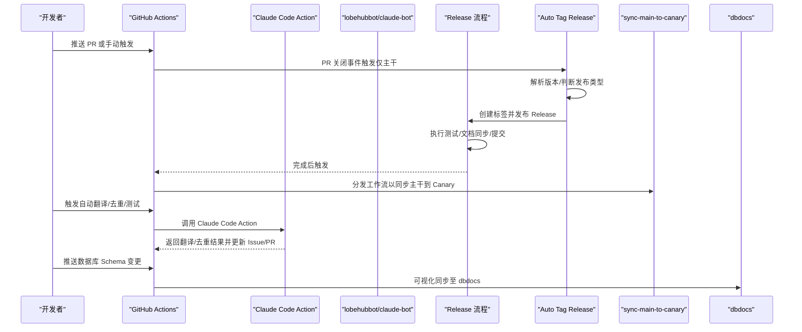

图表来源
- [.github/workflows/auto-tag-release.yml](file://.github/workflows/auto-tag-release.yml#L1-L247)
- [.github/workflows/release.yml](file://.github/workflows/release.yml#L1-L82)
- [.github/workflows/sync.yml](file://.github/workflows/sync.yml#L1-L55)
- [.github/workflows/sync-database-schema.yml](file://.github/workflows/sync-database-schema.yml#L1-L30)
- [.github/workflows/claude-translator.yml](file://.github/workflows/claude-translator.yml#L1-L134)
- [.github/workflows/claude-dedupe-issues.yml](file://.github/workflows/claude-dedupe-issues.yml#L1-L41)

## 详细组件分析

### 自动翻译与内容处理（Claude Translator）
- 触发条件：Issues 新建、Issue 评论、PR Review 提交/编辑、PR Review 评论。
- 权限与安全：限制工具集，仅允许安全命令；通过系统提示与安全规则约束；对评论/标题/内容进行智能检测与格式化。
- 执行流程：获取上下文 → 检测语言/是否已翻译 → 生成英文翻译与原始内容对照 → 使用 gh 工具更新 Issue/PR。

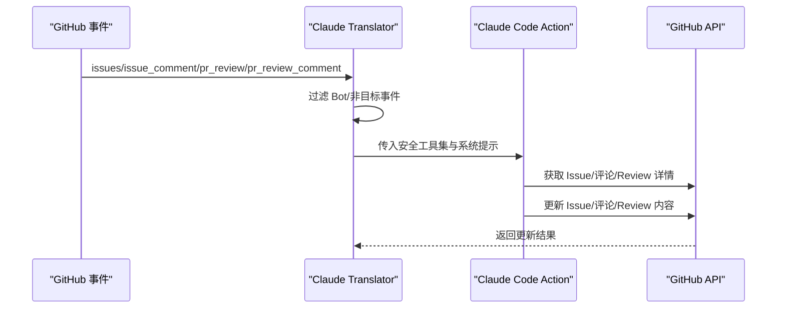

图表来源
- [.github/workflows/claude-translator.yml](file://.github/workflows/claude-translator.yml#L1-L134)

章节来源
- file://.github/workflows/claude-translator.yml#L1-L134

### 自动标签与发布（Auto Tag Release）
- 触发条件：PR 关闭在 main 分支，且满足“发布”或“补丁”判定规则。
- 版本判定：
  - 发布：PR 标题需符合“🚀 release: v{x.x.x}”格式。
  - 补丁：优先匹配 hotfix/* 或 release/* 分支；否则匹配标题前缀（style/feat/fix/refactor/hotfix/build）。
- 流程：
  - 准备主干 → 安装依赖 → 解析版本 → 若不存在则更新 package.json、生成 Changelog、提交并推送到 main。
  - 创建带注释的标签并推送到远端 → 创建 GitHub Release → 触发 sync-main-to-canary 工作流。
- 并发与取消：使用 concurrency 控制同 Ref 并发，命中则取消旧运行。

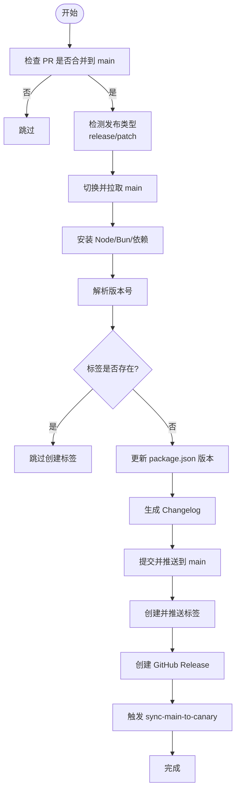

图表来源
- [.github/workflows/auto-tag-release.yml](file://.github/workflows/auto-tag-release.yml#L1-L247)

章节来源
- file://.github/workflows/auto-tag-release.yml#L1-L247

### 数据库 Schema 可视化同步
- 触发条件：推送至 main，且路径匹配数据库 Schema 文件。
- 步骤：安装依赖 → 可视化同步至 dbdocs（使用令牌）。

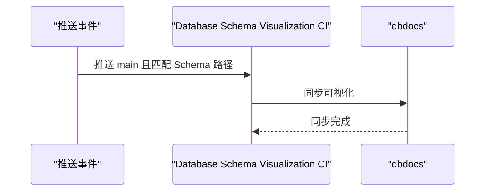

图表来源
- [.github/workflows/sync-database-schema.yml](file://.github/workflows/sync-database-schema.yml#L1-L30)

章节来源
- file://.github/workflows/sync-database-schema.yml#L1-L30

### Upstream 同步
- 触发条件：定时每 6 小时或手动触发；仅对 fork 仓库生效。
- 步骤：关闭“同步失败”标签问题 → 同步上游 main 至目标分支 → 失败时创建问题反馈。

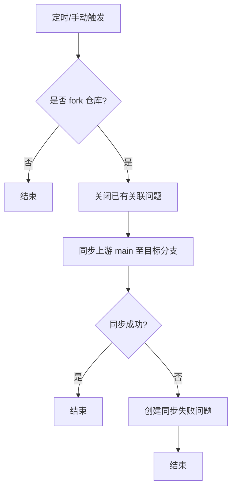

图表来源
- [.github/workflows/sync.yml](file://.github/workflows/sync.yml#L1-L55)

章节来源
- file://.github/workflows/sync.yml#L1-L55

### 质量与测试（Test CI）
- 触发条件：push、pull_request。
- 并发控制：concurrency 同 Ref 取消进行中的运行。
- Job 编排：
  - 去重检查：跳过重复内容的新一轮。
  - 包测试：单 Job 并行测试多个包，覆盖率上传至 Codecov。
  - 应用测试：分片（shard 1/2）并行，合并 Blob 报告后统一上传。
  - 桌面测试：独立 Job，使用 pnpm 并上传覆盖率。
  - 数据库测试：本地 Postgres 服务，测试覆盖率上传。
- 资源与超时：各 Job 设定合理超时，数据库服务健康检查。

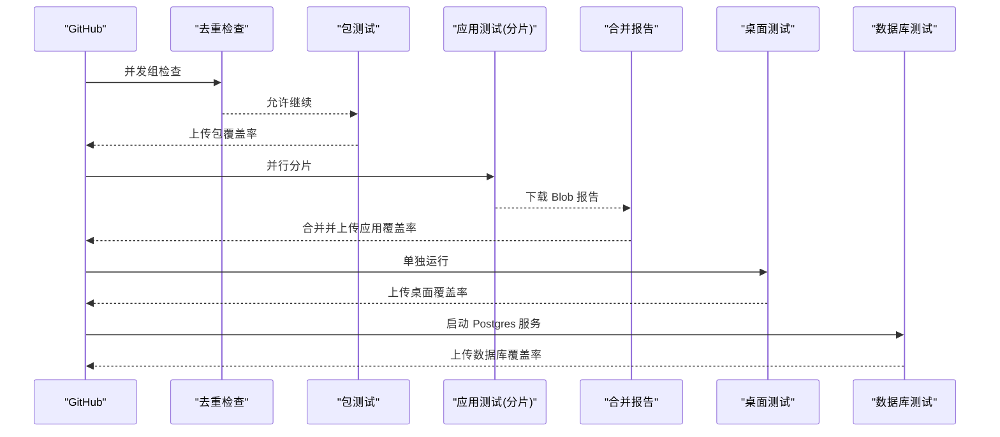

图表来源
- [.github/workflows/test.yml](file://.github/workflows/test.yml#L1-L268)

章节来源
- file://.github/workflows/test.yml#L1-L268

### E2E 测试（E2E CI）
- 触发条件：push、pull_request。
- 环境变量：预置数据库 URL、驱动、密钥、认证与 S3 Mock。
- Job：启动 Postgres 服务 → Playwright 安装 → 迁移数据库 → 构建 → 运行 E2E → 失败时上传报告与截图。

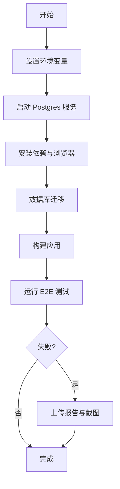

图表来源
- [.github/workflows/e2e.yml](file://.github/workflows/e2e.yml#L1-L95)

章节来源
- file://.github/workflows/e2e.yml#L1-L95

### 桌面应用构建（PR 与手动）
- PR 构建（Desktop PR Build）：
  - 触发：PR 同步/加/减标签或源分支以 release/* 开头。
  - 流程：代码质量检查 → 版本计算（基于 PR 编号与 CI 构建号）→ 多平台矩阵构建 → 归档产物 → 合并 macOS 多架构文件 → 临时发布并评论 PR。
- 手动构建（Desktop Manual Build）：
  - 触发：workflow_dispatch，可选择通道（nightly/beta/stable）、平台与版本覆盖。
  - 流程：版本生成 → 各平台构建 → 归档产物 → 合并 macOS 文件 → 生成合并产物归档。

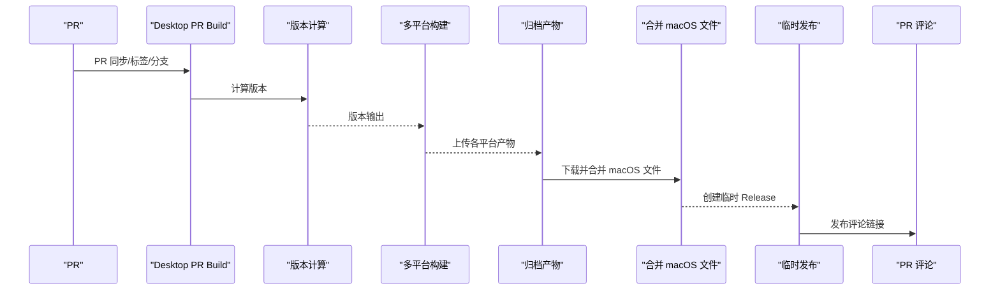

图表来源
- [.github/workflows/pr-build-desktop.yml](file://.github/workflows/pr-build-desktop.yml#L1-L358)

章节来源
- file://.github/workflows/pr-build-desktop.yml#L1-L358
- file://.github/workflows/manual-build-desktop.yml#L1-L311

### 包体积分析（Bundle Analyzer）
- 触发条件：workflow_dispatch。
- 步骤：安装 Node/Bun/pnpm → 生成 pnpm-lock.yaml → 构建并生成分析报告 → 归档报告与元数据 → 生成摘要评论。

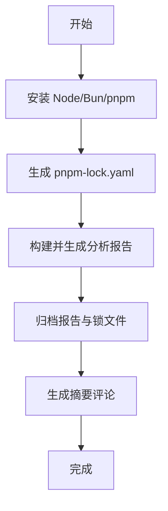

图表来源
- [.github/workflows/bundle-analyzer.yml](file://.github/workflows/bundle-analyzer.yml#L1-L116)

章节来源
- file://.github/workflows/bundle-analyzer.yml#L1-L116

### AI 辅助测试与去重
- Claude 自动测试（单元）：定时与手动触发，自动为指定模块补充单元测试，使用安全工具集与系统提示。
- Claude 自动 E2E 测试：定时与手动触发，准备数据库与前端环境，自动生成 E2E 测试并可上传失败产物。
- Claude Issue Dedupe：对新 Issue 或指定 Issue 执行去重检测，仅读取与加标签。

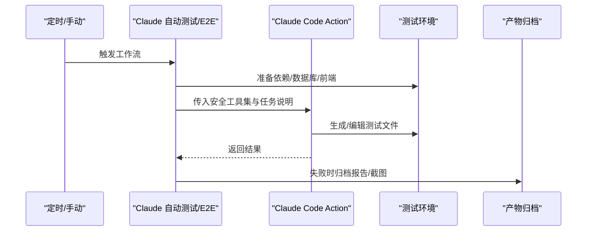

图表来源
- [.github/workflows/claude-auto-testing.yml](file://.github/workflows/claude-auto-testing.yml#L1-L75)
- [.github/workflows/claude-auto-e2e-testing.yml](file://.github/workflows/claude-auto-e2e-testing.yml#L1-L131)
- [.github/workflows/claude-dedupe-issues.yml](file://.github/workflows/claude-dedupe-issues.yml#L1-L41)

章节来源
- file://.github/workflows/claude-auto-testing.yml#L1-L75
- file://.github/workflows/claude-auto-e2e-testing.yml#L1-L131
- file://.github/workflows/claude-dedupe-issues.yml#L1-L41

## 依赖分析
- 触发链路依赖：
  - PR 关闭 → Auto Tag Release → Release CI → sync-main-to-canary。
  - 推送数据库 Schema → dbdocs 同步。
  - 定时/手动 → Claude 自动测试/E2E → 产物归档。
- 服务与工具依赖：
  - Postgres 服务用于测试与 E2E。
  - Playwright 用于 E2E 浏览器安装与运行。
  - Claude Code Action 用于 AI 辅助与翻译。
  - GitHub Releases 用于发布与归档。
- 密钥与令牌：
  - GH_TOKEN、CLAUDINE_CODE_OAUTH_TOKEN、DBDOCS_TOKEN、Apple 证书与 Team 信息、统计服务项目 ID 与地址等。

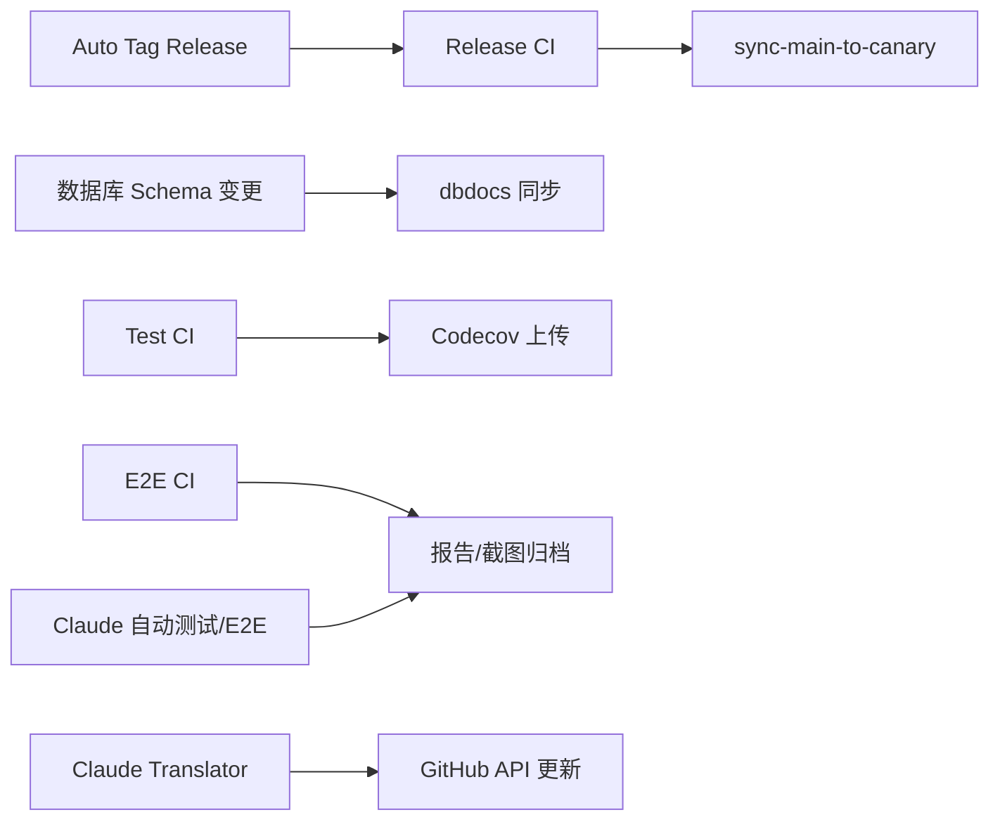

图表来源
- [.github/workflows/auto-tag-release.yml](file://.github/workflows/auto-tag-release.yml#L1-L247)
- [.github/workflows/release.yml](file://.github/workflows/release.yml#L1-L82)
- [.github/workflows/sync-database-schema.yml](file://.github/workflows/sync-database-schema.yml#L1-L30)
- [.github/workflows/test.yml](file://.github/workflows/test.yml#L1-L268)
- [.github/workflows/e2e.yml](file://.github/workflows/e2e.yml#L1-L95)
- [.github/workflows/claude-translator.yml](file://.github/workflows/claude-translator.yml#L1-L134)
- [.github/workflows/claude-auto-testing.yml](file://.github/workflows/claude-auto-testing.yml#L1-L75)
- [.github/workflows/claude-auto-e2e-testing.yml](file://.github/workflows/claude-auto-e2e-testing.yml#L1-L131)

章节来源
- file://.github/workflows/auto-tag-release.yml#L1-L247
- file://.github/workflows/release.yml#L1-L82
- file://.github/workflows/sync-database-schema.yml#L1-L30
- file://.github/workflows/test.yml#L1-L268
- file://.github/workflows/e2e.yml#L1-L95
- file://.github/workflows/claude-translator.yml#L1-L134
- file://.github/workflows/claude-auto-testing.yml#L1-L75
- file://.github/workflows/claude-auto-e2e-testing.yml#L1-L131

## 性能考虑
- 并发与去重：
  - 使用 concurrency 对同 Ref 取消进行中的运行，避免资源浪费。
  - Test CI 使用去重动作跳过相同内容的新一轮，减少重复执行。
- 分片与并行：
  - 应用测试采用分片（shard 1/2），提升吞吐。
  - 多平台构建并行，缩短整体耗时。
- 服务与缓存：
  - Postgres 服务健康检查参数合理，避免长时间等待。
  - Node/Bun/pnpm 缓存与冻结锁文件，提升安装速度。
- 资源限制：
  - 为内存密集型任务设置 NODE_OPTIONS，避免 OOM。
  - 限制 Claude 工具集与系统提示，降低误操作风险。

[本节为通用性能建议，不直接分析具体文件]

## 故障排除指南
- 自动标签与发布失败：
  - 检查 PR 标题/分支是否符合发布/补丁判定规则。
  - 确认标签是否已存在；若存在则跳过创建。
  - 查看 Release CI 中数据库测试与覆盖率上传是否异常。
- Upstream 同步失败：
  - 查看同步失败问题是否被创建；按教程手动同步。
  - 确认 fork 状态与权限。
- E2E 失败：
  - 下载归档的报告与截图，定位失败用例。
  - 检查数据库迁移与服务健康状态。
- 桌面构建失败：
  - 检查平台特定环境变量与证书配置（fork 场景可能缺少密钥）。
  - 确认 Electron 镜像配置已被清理，使用官方源。
- Claude 相关问题：
  - 确认 OAuth 令牌有效；检查工具白名单与系统提示。
  - 对翻译/去重任务，确认事件来源与发送者类型过滤。
- 覆盖率上传失败：
  - 检查 Codecov 令牌与报告文件路径。
  - 确认 PR 分支格式与 fork 场景的上传参数。

章节来源
- file://.github/workflows/auto-tag-release.yml#L1-L247
- file://.github/workflows/sync.yml#L1-L55
- file://.github/workflows/e2e.yml#L1-L95
- file://.github/workflows/pr-build-desktop.yml#L1-L358
- file://.github/workflows/claude-translator.yml#L1-L134
- file://.github/workflows/test.yml#L1-L268

## 结论
本工作流体系通过明确的触发条件、严格的权限与安全策略、合理的并发与去重机制、完善的测试与发布流程，实现了从内容翻译、问题处理、数据库可视化、质量保证到桌面应用发布的全链路自动化。建议持续关注触发频率与资源配额，定期审查 Claude 工具集与系统提示，完善失败归档与监控告警，以进一步提升稳定性与可观测性。

[本节为总结性内容，不直接分析具体文件]

## 附录
- 关键环境变量与密钥示例（按需配置）：
  - GH_TOKEN、CLAUDINE_CODE_OAUTH_TOKEN、DBDOCS_TOKEN、Apple 证书与密码、Umami 项目 ID 与地址、数据库连接字符串、S3 Mock 凭证等。
- 最佳实践清单：
  - 为每个工作流设置合理的超时与并发策略。
  - 使用去重与分片提升吞吐并降低成本。
  - 对 AI 辅助任务严格限制工具集与系统提示。
  - 完善失败归档与摘要评论，便于回溯。
  - 定期审查与精简触发器，避免不必要的运行。

[本节为通用建议，不直接分析具体文件]