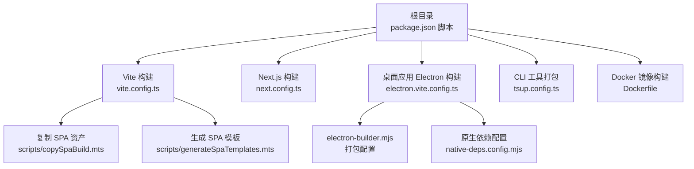
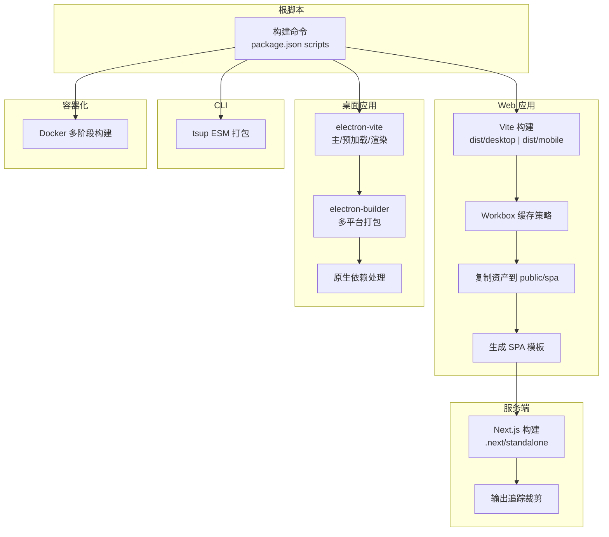
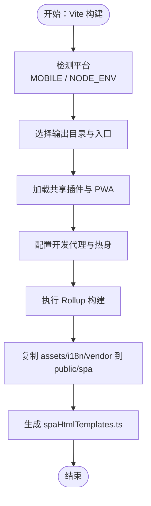
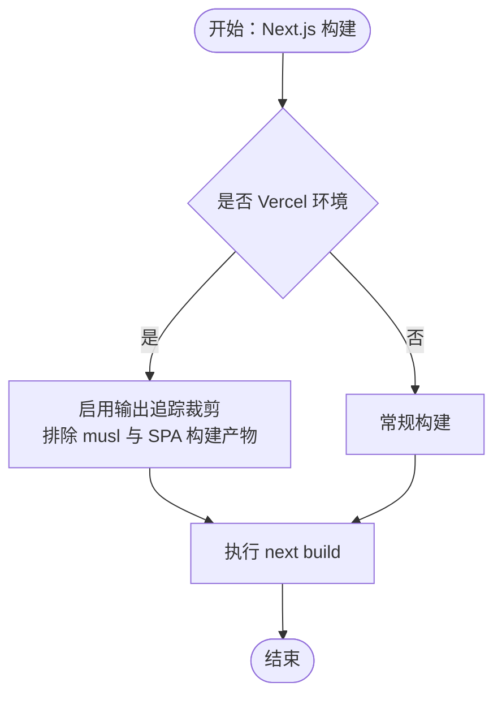
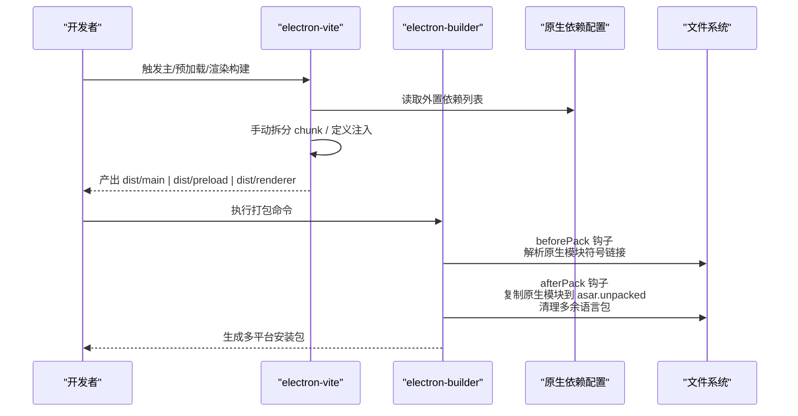
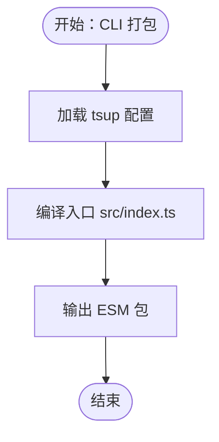
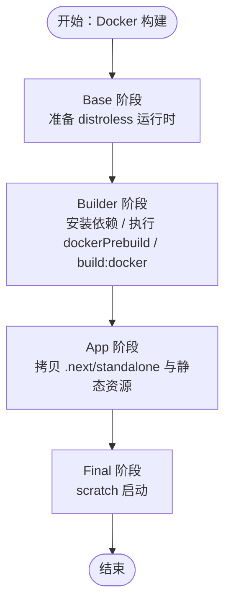
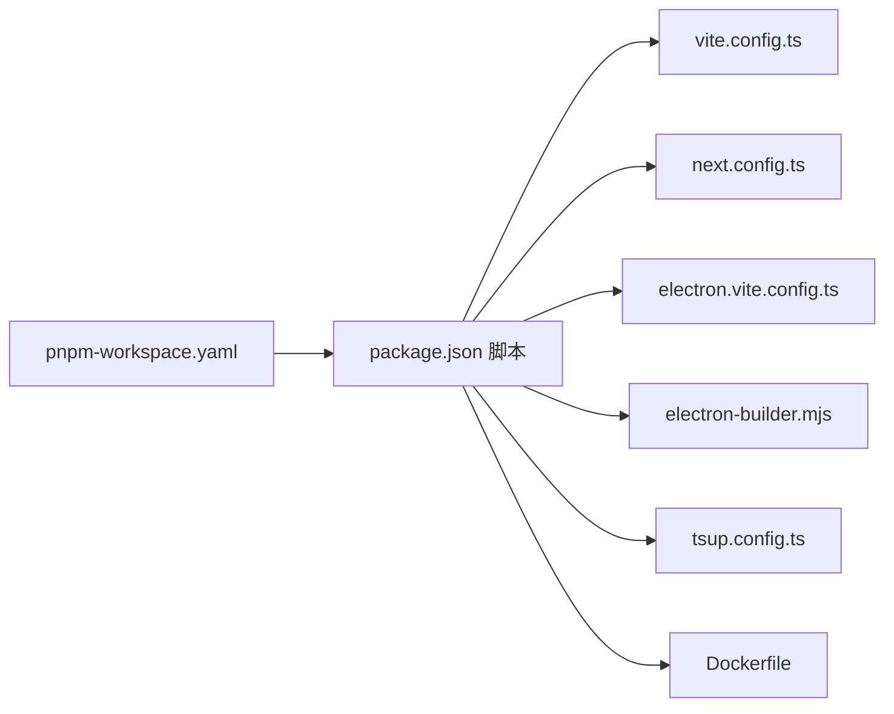

# 构建与打包

<cite>
**本文引用的文件**   
- [package.json](file://package.json)
- [pnpm-workspace.yaml](file://pnpm-workspace.yaml)
- [vite.config.ts](file://vite.config.ts)
- [next.config.ts](file://next.config.ts)
- [apps/desktop/electron.vite.config.ts](file://apps/desktop/electron.vite.config.ts)
- [apps/desktop/electron-builder.mjs](file://apps/desktop/electron-builder.mjs)
- [apps/desktop/native-deps.config.mjs](file://apps/desktop/native-deps.config.mjs)
- [apps/cli/tsup.config.ts](file://apps/cli/tsup.config.ts)
- [scripts/copySpaBuild.mts](file://scripts/copySpaBuild.mts)
- [scripts/generateSpaTemplates.mts](file://scripts/generateSpaTemplates.mts)
- [Dockerfile](file://Dockerfile)
</cite>

## 目录
1. [简介](#简介)
2. [项目结构](#项目结构)
3. [核心组件](#核心组件)
4. [架构总览](#架构总览)
5. [详细组件分析](#详细组件分析)
6. [依赖分析](#依赖分析)
7. [性能考虑](#性能考虑)
8. [故障排查指南](#故障排查指南)
9. [结论](#结论)
10. [附录](#附录)

## 简介
本文件系统性梳理 LobeHub 项目的构建与打包流程，覆盖多平台应用（Web 应用、桌面应用、移动应用）的构建配置与执行路径；详解 Electron 应用打包、Docker 镜像构建、CLI 工具打包的具体步骤；解释构建优化策略（代码分割、资源缓存、产物裁剪）；介绍多环境构建配置、构建产物验证与日志分析的质量保障流程；并提供构建失败处理、增量构建、并行构建等效率提升方案与环境配置指导。

## 项目结构
仓库采用 Monorepo 结构，使用 pnpm workspace 管理多包与共享脚本。根级构建脚本统一在根 package.json 的 scripts 字段中定义，分别驱动 Web SPA/Vite 构建、Next.js 构建、桌面应用 Electron 构建与打包、CLI 工具打包以及 Docker 镜像构建。

**图表来源**
- [package.json](file://package.json#L36-L122)
- [vite.config.ts](file://vite.config.ts#L1-L123)
- [next.config.ts](file://next.config.ts#L1-L27)
- [apps/desktop/electron.vite.config.ts](file://apps/desktop/electron.vite.config.ts#L1-L116)
- [apps/desktop/electron-builder.mjs](file://apps/desktop/electron-builder.mjs#L1-L307)
- [apps/desktop/native-deps.config.mjs](file://apps/desktop/native-deps.config.mjs#L1-L260)
- [apps/cli/tsup.config.ts](file://apps/cli/tsup.config.ts#L1-L12)
- [scripts/copySpaBuild.mts](file://scripts/copySpaBuild.mts#L1-L22)
- [scripts/generateSpaTemplates.mts](file://scripts/generateSpaTemplates.mts#L1-L48)
- [Dockerfile](file://Dockerfile#L1-L344)

**章节来源**
- [package.json](file://package.json#L36-L122)
- [pnpm-workspace.yaml](file://pnpm-workspace.yaml#L1-L23)

## 核心组件
- Web 应用（SPA + Next.js）
  - Vite 构建：区分 Web 与 Mobile 平台，输出至 dist/desktop 或 dist/mobile，并注入 PWA 缓存策略与 Workbox 配置。
  - Next.js 构建：针对 Vercel 输出追踪进行裁剪，排除 musl 二进制与 SPA/桌面/移动构建产物，减少冷启动体积。
- 桌面应用（Electron）
  - electron-vite 配置：主进程、预加载、渲染进程三段式构建，外置原生依赖，按命名空间拆分代码块，支持调试源码映射。
  - electron-builder 配置：多平台目标（macOS dmg/zip、Windows nsis、Linux AppImage/snap/deb/rpm）、自动更新通道、签名与公证、asar 解包原生模块、后处理清理多余语言包。
- 移动应用（React Native Expo）
  - 通过 Vite 构建移动端入口，配合 Metro/Expo 配置与运行时工具链（见 apps/mobile 目录）。
- CLI 工具
  - 使用 tsup 将 Node 侧入口编译为 ESM，设置 Banner 引导 shebang，保留特定依赖不外部化。
- Docker 镜像
  - 多阶段构建：Builder 阶段安装依赖、执行 dockerPrebuild、运行 build:docker（含 SPA、SPA 模板生成、Next 构建），App 阶段仅拷贝 .next/standalone 与必要静态资源，最终以 scratch 启动。

**章节来源**
- [vite.config.ts](file://vite.config.ts#L1-L123)
- [next.config.ts](file://next.config.ts#L1-L27)
- [apps/desktop/electron.vite.config.ts](file://apps/desktop/electron.vite.config.ts#L1-L116)
- [apps/desktop/electron-builder.mjs](file://apps/desktop/electron-builder.mjs#L1-L307)
- [apps/desktop/native-deps.config.mjs](file://apps/desktop/native-deps.config.mjs#L1-L260)
- [apps/cli/tsup.config.ts](file://apps/cli/tsup.config.ts#L1-L12)
- [Dockerfile](file://Dockerfile#L1-L344)

## 架构总览
下图展示从根脚本到各子系统的构建与打包路径，以及关键的优化点与产物落地位置。

**图表来源**
- [package.json](file://package.json#L36-L122)
- [vite.config.ts](file://vite.config.ts#L1-L123)
- [next.config.ts](file://next.config.ts#L1-L27)
- [apps/desktop/electron.vite.config.ts](file://apps/desktop/electron.vite.config.ts#L1-L116)
- [apps/desktop/electron-builder.mjs](file://apps/desktop/electron-builder.mjs#L1-L307)
- [apps/desktop/native-deps.config.mjs](file://apps/desktop/native-deps.config.mjs#L1-L260)
- [apps/cli/tsup.config.ts](file://apps/cli/tsup.config.ts#L1-L12)
- [Dockerfile](file://Dockerfile#L1-L344)

## 详细组件分析

### Web 应用构建（Vite + PWA）
- 平台识别与输出
  - 通过环境变量区分 Web 与 Mobile，选择不同入口与输出目录。
  - 定义 Rollup 输出策略与共享插件集，确保跨平台一致的构建体验。
- PWA 与缓存策略
  - 注入 VitePWA 插件，启用 Workbox Runtime Caching，对字体、图片、API 请求分别采用 StaleWhileRevalidate、CacheFirst、NetworkFirst 等策略，限制最大文件尺寸，提升离线与弱网体验。
- 开发代理与热身
  - 提供本地开发代理，将 /api、/trpc 等路由转发至本地服务端口；服务启动前预热客户端入口文件，缩短首开时间。
- 产物复制与模板生成
  - 构建完成后，复制 dist/desktop 与 dist/mobile 的 assets/i18n/vendor 到公共目录 public/spa，便于服务端渲染与静态托管。
  - 生成 spaHtmlTemplates.ts，根据是否本地存在移动构建决定从构建产物内联还是从源文件导入，保证 Vercel 环境下的可用性。

**图表来源**
- [vite.config.ts](file://vite.config.ts#L1-L123)
- [scripts/copySpaBuild.mts](file://scripts/copySpaBuild.mts#L1-L22)
- [scripts/generateSpaTemplates.mts](file://scripts/generateSpaTemplates.mts#L1-L48)

**章节来源**
- [vite.config.ts](file://vite.config.ts#L16-L123)
- [scripts/copySpaBuild.mts](file://scripts/copySpaBuild.mts#L1-L22)
- [scripts/generateSpaTemplates.mts](file://scripts/generateSpaTemplates.mts#L1-L48)

### Next.js 构建（Vercel 优化）
- 输出追踪裁剪
  - 在 Vercel 环境下，排除 musl 二进制与 SPA/桌面/移动构建产物，显著降低函数冷启动体积与时间。
- 构建命令
  - 根脚本提供 build:docker 与 build:next，分别面向 Docker 与 Vercel 场景，确保内存上限与 CDN 基址正确传递。

**图表来源**
- [next.config.ts](file://next.config.ts#L1-L27)
- [package.json](file://package.json#L39-L41)

**章节来源**
- [next.config.ts](file://next.config.ts#L1-L27)
- [package.json](file://package.json#L39-L41)

### 桌面应用构建（Electron）
- electron-vite 配置
  - 主进程、预加载、渲染进程三段式构建，外置原生依赖，避免打包 .node 绑定导致的兼容性问题。
  - 通过手动拆分 chunk，按 i18n 命名空间拆分 locales，减少单文件体积。
  - 渲染端注入 define 与共享插件，保持与 Web 端一致的构建体验。
- electron-builder 配置
  - 多平台目标：macOS dmg/zip、Windows nsis、Linux 多种格式；自动更新通道由 UPDATE_CHANNEL 决定；可配置自定义更新服务器或回退 GitHub。
  - 原生模块处理：asarUnpack 显式解包，beforePack/afterPack 钩子中解析 pnpm 符号链接，确保原生模块被正确复制到 asar.unpacked。
  - 后处理：清理 Electron Framework 多余语言包，macOS 下复制 Liquid Glass Assets.car。
- 原生依赖配置
  - 自动解析 nativeModules 的完整依赖树，生成 files、asarUnpack、external 配置，解决 pnpm workspace 与符号链接带来的打包问题。

**图表来源**
- [apps/desktop/electron.vite.config.ts](file://apps/desktop/electron.vite.config.ts#L1-L116)
- [apps/desktop/electron-builder.mjs](file://apps/desktop/electron-builder.mjs#L1-L307)
- [apps/desktop/native-deps.config.mjs](file://apps/desktop/native-deps.config.mjs#L1-L260)

**章节来源**
- [apps/desktop/electron.vite.config.ts](file://apps/desktop/electron.vite.config.ts#L1-L116)
- [apps/desktop/electron-builder.mjs](file://apps/desktop/electron-builder.mjs#L1-L307)
- [apps/desktop/native-deps.config.mjs](file://apps/desktop/native-deps.config.mjs#L1-L260)

### CLI 工具打包
- 使用 tsup 将 Node 入口编译为 ESM，设置 shebang 引导，保留特定依赖不外部化，适配跨平台执行。

**图表来源**
- [apps/cli/tsup.config.ts](file://apps/cli/tsup.config.ts#L1-L12)

**章节来源**
- [apps/cli/tsup.config.ts](file://apps/cli/tsup.config.ts#L1-L12)

### Docker 镜像构建
- 多阶段构建
  - Base 阶段：准备 distroless 运行时与代理链路；Builder 阶段：安装依赖、执行 dockerPrebuild、运行 build:docker（含 SPA、SPA 模板生成、Next 构建）。
  - App 阶段：仅拷贝 .next/standalone、静态资源、数据库迁移脚本与必要依赖，最终以 scratch 启动。
- 环境变量与镜像参数
  - 支持 USE_CN_MIRROR、NEXT_PUBLIC_* 等构建期参数注入；生产阶段设置 NODE_OPTIONS、HOSTNAME、PORT 等运行时环境。
- 产物落地
  - .next/standalone 与 public/spa、migrations 等被精确复制到镜像中，确保最小化运行时镜像。

**图表来源**
- [Dockerfile](file://Dockerfile#L1-L344)

**章节来源**
- [Dockerfile](file://Dockerfile#L1-L344)

## 依赖分析
- Monorepo 工作区
  - pnpm-workspace.yaml 声明 packages/** 与 e2e、桌面主进程工作区，统一管理依赖与版本覆盖。
- 依赖覆盖与补丁
  - overrides 与 patchedDependencies 确保关键库版本一致性与安全修复。
- 构建脚本耦合
  - 根脚本串联 Vite、Next、Electron、CLI、Docker 构建，形成端到端流水线。

**图表来源**
- [pnpm-workspace.yaml](file://pnpm-workspace.yaml#L1-L23)
- [package.json](file://package.json#L36-L122)

**章节来源**
- [pnpm-workspace.yaml](file://pnpm-workspace.yaml#L1-L23)
- [package.json](file://package.json#L36-L122)

## 性能考虑
- 代码分割与按需加载
  - electron-vite 对 i18n 资源按命名空间拆分，减少单文件体积，提升加载速度。
- 资源缓存与网络策略
  - VitePWA 使用 Workbox 对字体、图片、API 接口采用不同缓存策略，结合最大文件大小限制，平衡离线可用性与存储占用。
- 输出追踪裁剪
  - Next.js 在 Vercel 环境下排除 musl 二进制与 SPA 构建产物，显著降低冷启动体积。
- 并行与增量
  - Vite Dev Server 预热客户端入口，缩短首次访问等待；Docker 构建阶段复用 .next/standalone，减少重复计算。
- 内存与稳定性
  - 根脚本与 Dockerfile 设置 NODE_OPTIONS --max-old-space-size，缓解大体量构建的内存压力。

**章节来源**
- [apps/desktop/electron.vite.config.ts](file://apps/desktop/electron.vite.config.ts#L55-L66)
- [vite.config.ts](file://vite.config.ts#L64-L103)
- [next.config.ts](file://next.config.ts#L9-L20)
- [Dockerfile](file://Dockerfile#L68-L98)

## 故障排查指南
- 桌面应用原生模块无法加载
  - 确认 electron-builder 的 asarUnpack 与原生依赖配置一致；检查 beforePack/afterPack 是否正确解析符号链接并复制到 asar.unpacked。
  - 参考：[apps/desktop/electron-builder.mjs](file://apps/desktop/electron-builder.mjs#L107-L190)，[apps/desktop/native-deps.config.mjs](file://apps/desktop/native-deps.config.mjs#L149-L227)
- Electron 更新通道与发布源
  - UPDATE_CHANNEL 决定发布 provider（generic 或 github），UPDATE_SERVER_URL 存在时优先 generic；确认 URL 末尾不含多余频道路径。
  - 参考：[apps/desktop/electron-builder.mjs](file://apps/desktop/electron-builder.mjs#L45-L69)
- Web 应用缓存命中异常
  - 检查 VitePWA 的 runtimeCaching 与 globPatterns，确认字体、图片、API 路由匹配规则；调整最大文件尺寸与过期策略。
  - 参考：[vite.config.ts](file://vite.config.ts#L64-L103)
- Next.js 构建体积过大
  - 在 Vercel 环境下确认 outputFileTracingExcludes 是否包含 dist/desktop、dist/mobile、public/spa 等无关目录。
  - 参考：[next.config.ts](file://next.config.ts#L9-L20)
- Docker 构建失败或内存溢出
  - 提升 NODE_OPTIONS --max-old-space-size；确保 USE_CN_MIRROR 下的镜像源与依赖下载配置正确。
  - 参考：[Dockerfile](file://Dockerfile#L68-L98)
- SPA 模板未生成或导入错误
  - 确认 scripts/generateSpaTemplates.mts 是否成功读取 dist/desktop 与 dist/mobile 的 HTML；若无本地移动构建，需从源文件导入。
  - 参考：[scripts/generateSpaTemplates.mts](file://scripts/generateSpaTemplates.mts#L14-L39)

**章节来源**
- [apps/desktop/electron-builder.mjs](file://apps/desktop/electron-builder.mjs#L45-L69)
- [apps/desktop/native-deps.config.mjs](file://apps/desktop/native-deps.config.mjs#L149-L227)
- [vite.config.ts](file://vite.config.ts#L64-L103)
- [next.config.ts](file://next.config.ts#L9-L20)
- [Dockerfile](file://Dockerfile#L68-L98)
- [scripts/generateSpaTemplates.mts](file://scripts/generateSpaTemplates.mts#L14-L39)

## 结论
LobeHub 的构建与打包体系围绕 Monorepo 与多平台应用展开：Web 应用通过 Vite + PWA 实现快速迭代与离线体验；服务端基于 Next.js 输出追踪裁剪，适配 Vercel 高效运行；桌面应用采用 electron-vite + electron-builder，配合原生依赖专项处理，实现稳定跨平台分发；CLI 工具与 Docker 镜像分别满足命令行与容器化部署场景。整体流程强调可观测性、可维护性与性能优化，适合规模化团队协作与持续交付。

## 附录
- 常用构建命令速览
  - Web：构建 SPA 与 Next.js，复制 SPA 资产并生成模板
    - [package.json](file://package.json#L37-L46)
  - Docker：构建 SPA、SPA 模板、Next 并生成 sitemap
    - [package.json](file://package.json#L39-L46)
  - 桌面：构建主进程与渲染进程、打包应用
    - [package.json](file://package.json#L52-L59)
  - CLI：打包 Node 入口为 ESM
    - [apps/cli/tsup.config.ts](file://apps/cli/tsup.config.ts#L1-L12)
  - Next：生产构建
    - [package.json](file://package.json#L40-L41)