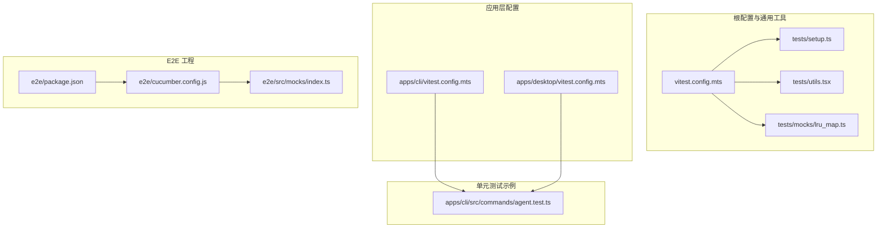
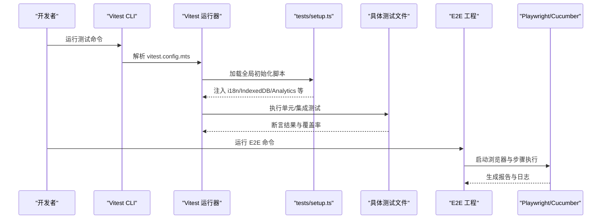
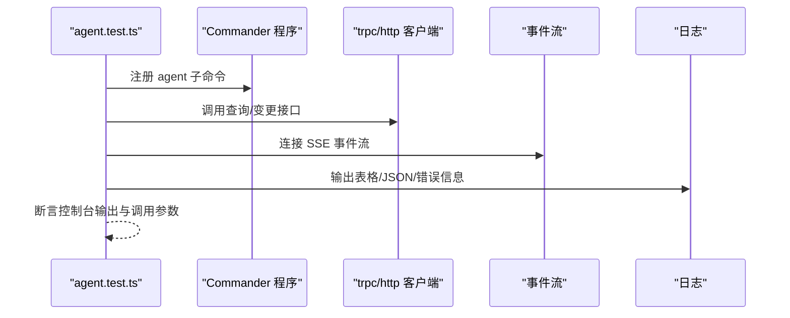
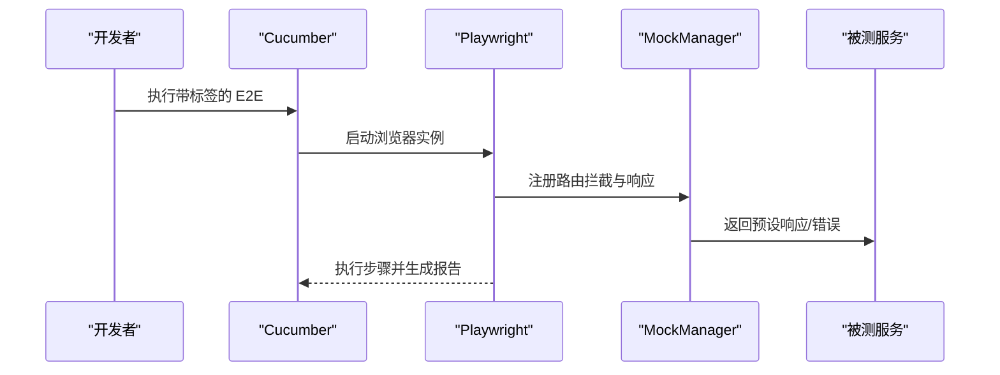
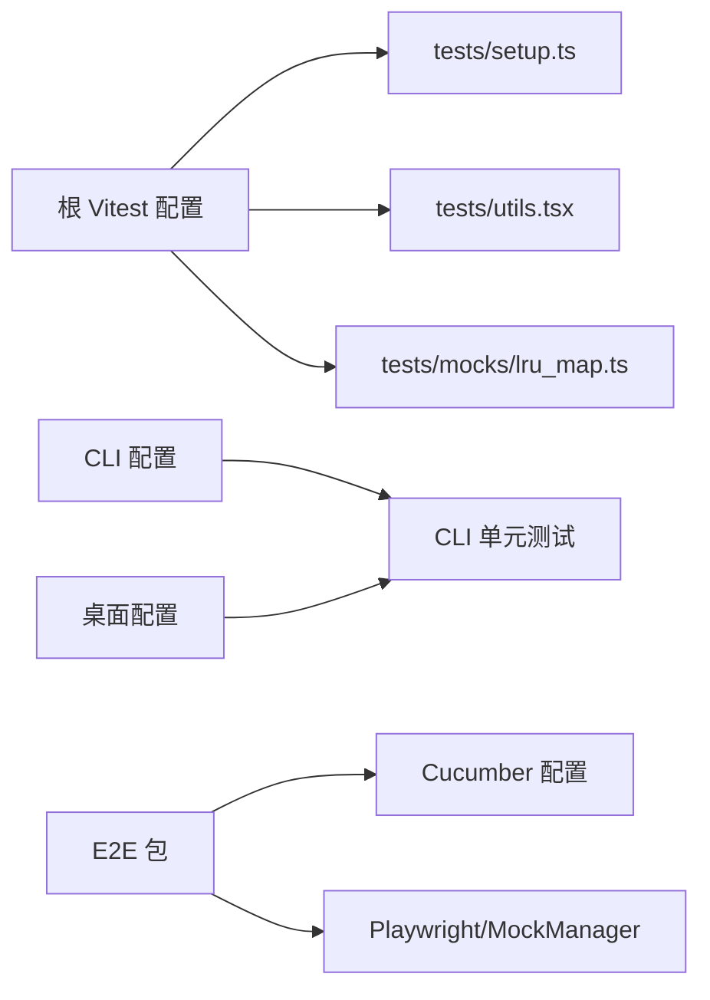

# 自动化测试

<cite>
**本文引用的文件**
- [vitest.config.mts（根）](file://vitest.config.mts)
- [tests/setup.ts](file://tests/setup.ts)
- [tests/utils.tsx](file://tests/utils.tsx)
- [tests/mocks/lru_map.ts](file://tests/mocks/lru_map.ts)
- [apps/cli/vitest.config.mts](file://apps/cli/vitest.config.mts)
- [apps/desktop/vitest.config.mts](file://apps/desktop/vitest.config.mts)
- [apps/cli/src/commands/agent.test.ts](file://apps/cli/src/commands/agent.test.ts)
- [e2e/package.json](file://e2e/package.json)
- [e2e/cucumber.config.js](file://e2e/cucumber.config.js)
- [e2e/src/mocks/index.ts](file://e2e/src/mocks/index.ts)
- [.github/workflows/test.yml](file://.github/workflows/test.yml)
</cite>

## 目录

1. [简介](#简介)
2. [项目结构](#项目结构)
3. [核心组件](#核心组件)
4. [架构总览](#架构总览)
5. [详细组件分析](#详细组件分析)
6. [依赖分析](#依赖分析)
7. [性能考虑](#性能考虑)
8. [故障排查指南](#故障排查指南)
9. [结论](#结论)
10. [附录](#附录)

## 简介

本文件系统性梳理 LobeHub 的自动化测试体系，覆盖单元测试、集成测试与端到端测试（E2E），重点说明 Vitest 测试框架配置、测试覆盖率统计、测试数据 mock、E2E 自动化流程（浏览器与 API）、测试环境隔离与数据管理、测试报告生成、失败处理与重试、并行优化与最佳实践。目标是帮助开发者快速理解并高效扩展测试能力。

## 项目结构

围绕测试的关键目录与文件如下：

- 根级 Vitest 配置与通用测试工具：vitest.config.mts、tests/setup.ts、tests/utils.tsx、tests/mocks/lru_map.ts
- 应用层子配置：apps/cli/vitest.config.mts、apps/desktop/vitest.config.mts
- 单元测试示例：apps/cli/src/commands/agent.test.ts
- E2E 工程：e2e/package.json、e2e/cucumber.config.js、e2e/src/mocks/index.ts
- CI 覆盖率上传：.github/workflows/test.yml

图表来源

- [vitest.config.mts（根）](file://vitest.config.mts#L1-L113)
- [tests/setup.ts](file://tests/setup.ts#L1-L76)
- [tests/utils.tsx](file://tests/utils.tsx#L1-L58)
- [tests/mocks/lru_map.ts](file://tests/mocks/lru_map.ts#L1-L41)
- [apps/cli/vitest.config.mts](file://apps/cli/vitest.config.mts#L1-L24)
- [apps/desktop/vitest.config.mts](file://apps/desktop/vitest.config.mts#L1-L20)
- [apps/cli/src/commands/agent.test.ts](file://apps/cli/src/commands/agent.test.ts#L1-L398)
- [e2e/package.json](file://e2e/package.json#L1-L30)
- [e2e/cucumber.config.js](file://e2e/cucumber.config.js#L1-L22)
- [e2e/src/mocks/index.ts](file://e2e/src/mocks/index.ts#L1-L159)

章节来源

- [vitest.config.mts（根）](file://vitest.config.mts#L1-L113)
- [tests/setup.ts](file://tests/setup.ts#L1-L76)
- [tests/utils.tsx](file://tests/utils.tsx#L1-L58)
- [tests/mocks/lru_map.ts](file://tests/mocks/lru_map.ts#L1-L41)
- [apps/cli/vitest.config.mts](file://apps/cli/vitest.config.mts#L1-L24)
- [apps/desktop/vitest.config.mts](file://apps/desktop/vitest.config.mts#L1-L20)
- [apps/cli/src/commands/agent.test.ts](file://apps/cli/src/commands/agent.test.ts#L1-L398)
- [e2e/package.json](file://e2e/package.json#L1-L30)
- [e2e/cucumber.config.js](file://e2e/cucumber.config.js#L1-L22)
- [e2e/src/mocks/index.ts](file://e2e/src/mocks/index.ts#L1-L159)

## 核心组件

- 根级 Vitest 配置：统一别名、覆盖率、环境、排除规则、服务端依赖内联、全局初始化脚本等。
- 通用测试工具：tests/setup.ts（i18n 初始化、IndexedDB 兼容、Ant Design 主题、Analytics Hook 全局 mock、Node 环境 WebCrypto 补丁）、tests/utils.tsx（服务类一致性测试辅助）、tests/mocks/lru_map.ts（LRU 缓存模拟）。
- 应用层配置：CLI 与桌面应用各自独立的 Vitest 配置，分别面向 Node 环境与主进程代码。
- E2E 工程：Cucumber + Playwright，通过路由拦截实现 tRPC/REST API mock，支持标签化执行与报告输出。
- CI 覆盖率上传：按包维度收集 lcov 并上传至 codecov。

章节来源

- [vitest.config.mts（根）](file://vitest.config.mts#L41-L112)
- [tests/setup.ts](file://tests/setup.ts#L1-L76)
- [tests/utils.tsx](file://tests/utils.tsx#L1-L58)
- [tests/mocks/lru_map.ts](file://tests/mocks/lru_map.ts#L1-L41)
- [apps/cli/vitest.config.mts](file://apps/cli/vitest.config.mts#L1-L24)
- [apps/desktop/vitest.config.mts](file://apps/desktop/vitest.config.mts#L1-L20)
- [e2e/package.json](file://e2e/package.json#L1-L30)
- [e2e/cucumber.config.js](file://e2e/cucumber.config.js#L1-L22)
- [.github/workflows/test.yml](file://.github/workflows/test.yml#L70-L100)

## 架构总览

下图展示从命令行到测试运行器、再到 E2E 执行的整体流程与关键交互点。

图表来源

- [vitest.config.mts（根）](file://vitest.config.mts#L41-L112)
- [tests/setup.ts](file://tests/setup.ts#L1-L76)
- [apps/cli/src/commands/agent.test.ts](file://apps/cli/src/commands/agent.test.ts#L1-L398)
- [e2e/package.json](file://e2e/package.json#L6-L15)
- [e2e/cucumber.config.js](file://e2e/cucumber.config.js#L1-L22)

## 详细组件分析

### Vitest 根配置与覆盖率

- 别名映射：将 @/、@/database、@/utils、@/types 等路径映射到源码或包路径，便于统一导入。
- 覆盖率：默认关闭全量覆盖率，仅对应用层生成文本、JSON、lcov 报告；排除 migrations、打包产物、第三方包与 mocks。
- 环境：默认使用 happy-dom，适合 DOM/JSX 场景；部分应用使用 node 环境。
- 排除：忽略 node_modules、docs、locales、public、以及各应用与 e2e 目录，避免重复扫描。
- 服务器依赖内联：将 canvas、UI 组件库等内联进 server，提升启动速度。
- 全局初始化：加载 tests/setup.ts，确保测试前的全局状态一致。

章节来源

- [vitest.config.mts（根）](file://vitest.config.mts#L41-L112)

### 通用测试初始化与工具

- tests/setup.ts
  - 使用 fake-indexeddb/auto 与 fake localStorage，适配基于 IndexedDB 的存储库（如 Dexie）。
  - 初始化 i18next，避免在非 React 模块中调用翻译时出现模块冲突。
  - 对 Analytics Hook 与认证模块进行全局 mock，减少外部依赖。
  - 在 Node 环境注入 WebCrypto，满足加密相关测试需求。
  - 关闭 Ant Design 的样式哈希，避免快照差异。
  - 将 React 暴露为全局变量，简化测试导入。
- tests/utils.tsx
  - 提供 testService 辅助函数，用于校验服务类的箭头函数实现、异步性与可选自定义检查。
- tests/mocks/lru_map.ts
  - 提供 LRUMap 的轻量实现，用于替代真实缓存，便于断言容量与淘汰行为。

章节来源

- [tests/setup.ts](file://tests/setup.ts#L1-L76)
- [tests/utils.tsx](file://tests/utils.tsx#L1-L58)
- [tests/mocks/lru_map.ts](file://tests/mocks/lru_map.ts#L1-L41)

### 应用层 Vitest 配置

- CLI 应用
  - 通过别名将设备网关客户端指向本地源码，便于在 CLI 测试中直接引用。
  - 使用 Node 环境，开启覆盖率与文本 / JSON/LCOV 报告。
  - 屏蔽未处理的 Promise 拒绝警告，避免干扰控制台输出。
- 桌面应用
  - 主进程别名映射至 src/main 与 src/common。
  - 使用 Node 环境，启用覆盖率与报告目录。
  - 指定主进程专用的 setup 文件，注入特定 mock。

章节来源

- [apps/cli/vitest.config.mts](file://apps/cli/vitest.config.mts#L1-L24)
- [apps/desktop/vitest.config.mts](file://apps/desktop/vitest.config.mts#L1-L20)

### 单元测试示例：CLI 命令测试

该测试文件展示了如何对 CLI 子命令进行行为验证与错误分支覆盖：

- 使用 hoisted mock 与 vi.mock 对外部依赖（API 客户端、HTTP 认证、事件流、日志）进行隔离。
- 使用 beforeEach/afterEach 清理进程退出与控制台 spy，保证测试隔离。
- 针对 list/view/create/edit/delete/duplicate/run/status 等子命令进行参数解析、请求调用与输出断言。
- 验证 SSE 事件流连接、鉴权头传递、JSON 输出、历史查询标志等细节。

图表来源

- [apps/cli/src/commands/agent.test.ts](file://apps/cli/src/commands/agent.test.ts#L1-L398)

章节来源

- [apps/cli/src/commands/agent.test.ts](file://apps/cli/src/commands/agent.test.ts#L1-L398)

### E2E 测试自动化

- 工程脚本
  - 支持普通执行、CI 构建后执行、有头浏览器模式、按标签选择场景（社区、路由、冒烟测试）。
- Cucumber 配置
  - 输出进度条、HTML 与 JSON 报告；禁用并行执行；按标签过滤；设置超时时间。
- API Mock 框架
  - 基于 Playwright 的 route 拦截，集中注册 tRPC/REST 响应；支持按域启用 / 禁用、动态添加处理器。
  - 提供 createTrpcResponse、createTrpcError、createJsonResponse 等便捷函数。

图表来源

- [e2e/package.json](file://e2e/package.json#L6-L15)
- [e2e/cucumber.config.js](file://e2e/cucumber.config.js#L1-L22)
- [e2e/src/mocks/index.ts](file://e2e/src/mocks/index.ts#L49-L159)

章节来源

- [e2e/package.json](file://e2e/package.json#L1-L30)
- [e2e/cucumber.config.js](file://e2e/cucumber.config.js#L1-L22)
- [e2e/src/mocks/index.ts](file://e2e/src/mocks/index.ts#L1-L159)

### 测试覆盖率统计与 CI 上报

- 根配置生成 lcov 文本摘要与 JSON 报表；报告目录位于 coverage/app。
- CI 工作流遍历包列表，检测对应包的 lcov.info 并上传至 codecov，按 flag 标记包名。

章节来源

- [vitest.config.mts（根）](file://vitest.config.mts#L63-L79)
- [.github/workflows/test.yml](file://.github/workflows/test.yml#L70-L100)

## 依赖分析

- 组件耦合
  - 根配置与通用工具高度内聚，其他应用配置复用其别名与覆盖率策略。
  - CLI / 桌面应用配置与根配置保持一致的覆盖率与环境设定。
  - E2E 工程独立于应用层，通过 Playwright 与路由拦截实现 API mock。
- 外部依赖
  - Vitest 生态（happy-dom、canvas-mock、@lobehub/ui 等）通过 server 内联优化启动性能。
  - Cucumber 与 Playwright 提供稳定的 E2E 执行与报告能力。

图表来源

- [vitest.config.mts（根）](file://vitest.config.mts#L41-L112)
- [tests/setup.ts](file://tests/setup.ts#L1-L76)
- [tests/utils.tsx](file://tests/utils.tsx#L1-L58)
- [tests/mocks/lru_map.ts](file://tests/mocks/lru_map.ts#L1-L41)
- [apps/cli/vitest.config.mts](file://apps/cli/vitest.config.mts#L1-L24)
- [apps/desktop/vitest.config.mts](file://apps/desktop/vitest.config.mts#L1-L20)
- [e2e/package.json](file://e2e/package.json#L1-L30)
- [e2e/cucumber.config.js](file://e2e/cucumber.config.js#L1-L22)

章节来源

- [vitest.config.mts（根）](file://vitest.config.mts#L41-L112)
- [apps/cli/vitest.config.mts](file://apps/cli/vitest.config.mts#L1-L24)
- [apps/desktop/vitest.config.mts](file://apps/desktop/vitest.config.mts#L1-L20)
- [e2e/package.json](file://e2e/package.json#L1-L30)
- [e2e/cucumber.config.js](file://e2e/cucumber.config.js#L1-L22)

## 性能考虑

- 服务器依赖内联：将 canvas、UI 组件库等内联进 server，减少冷启动时间与模块解析开销。
- 环境选择：DOM/JSX 场景使用 happy-dom，Node 场景使用 node，避免不必要的浏览器环境成本。
- 排除策略：忽略构建产物、文档、公共资源与各应用目录，缩小扫描范围。
- E2E 并行：当前 Cucumber 配置为串行执行，若稳定性达标可考虑逐步引入并行以缩短总耗时。
- 覆盖率粒度：仅对应用层生成覆盖率，避免第三方与迁移脚本影响整体指标。

章节来源

- [vitest.config.mts（根）](file://vitest.config.mts#L41-L112)
- [e2e/cucumber.config.js](file://e2e/cucumber.config.js#L13-L13)

## 故障排查指南

- 模块污染与 Mock 失效
  - 使用 vi.resetModules () 清理模块缓存；在 beforeEach 中 vi.clearAllMocks () 重置所有 mock。
- 测试数据污染
  - 在 beforeEach/afterEach 中清理数据库状态或重置 mock 数据。
- 异步问题
  - React Hooks 或状态更新需包裹 act ()，确保副作用在断言前完成。
- 控制台噪音
  - CLI 配置中屏蔽未处理拒绝警告，避免干扰日志。
- E2E 路由拦截异常
  - 捕获 mock handler 错误并回退 route.continue ()，保证测试不中断。

章节来源

- [.agents/skills/testing/SKILL.md](file://.agents/skills/testing/SKILL.md#L114-L120)
- [apps/cli/vitest.config.mts](file://apps/cli/vitest.config.mts#L20-L22)
- [e2e/src/mocks/index.ts](file://e2e/src/mocks/index.ts#L74-L84)

## 结论

LobeHub 的测试体系以 Vitest 为核心，结合根级配置与通用工具，形成统一的单元与集成测试基线；E2E 采用 Cucumber+Playwright，通过路由拦截实现可控的 API mock。配合 CI 覆盖率上报与严格的排除策略，既保证了测试效率，也维持了质量指标的稳定性。建议在确保稳定性的前提下，逐步探索 E2E 并行与更细粒度的覆盖率策略。

## 附录

### 测试用例编写规范

- 命名与分组：使用语义化描述，按功能模块组织 describe/it。
- Mock 策略：优先 hoisted mock，隔离外部依赖；必要时使用 vi.mock 与 vi.resetAllMocks。
- 断言覆盖：关注关键路径、边界条件与错误分支；对控制台输出、网络请求参数与返回值进行断言。
- 环境与初始化：遵循 tests/setup.ts 的全局约定，避免跨测试污染。

### 最佳实践清单

- 使用 tests/utils.tsx 的 testService 辅助函数统一校验服务类实现。
- 在 Node 环境测试中，确保 WebCrypto、i18n、IndexedDB 等依赖已正确初始化。
- E2E 中优先使用 MockManager 的路由拦截，减少真实后端依赖。
- CI 中按包上传覆盖率，便于定位低覆盖区域并持续改进。
