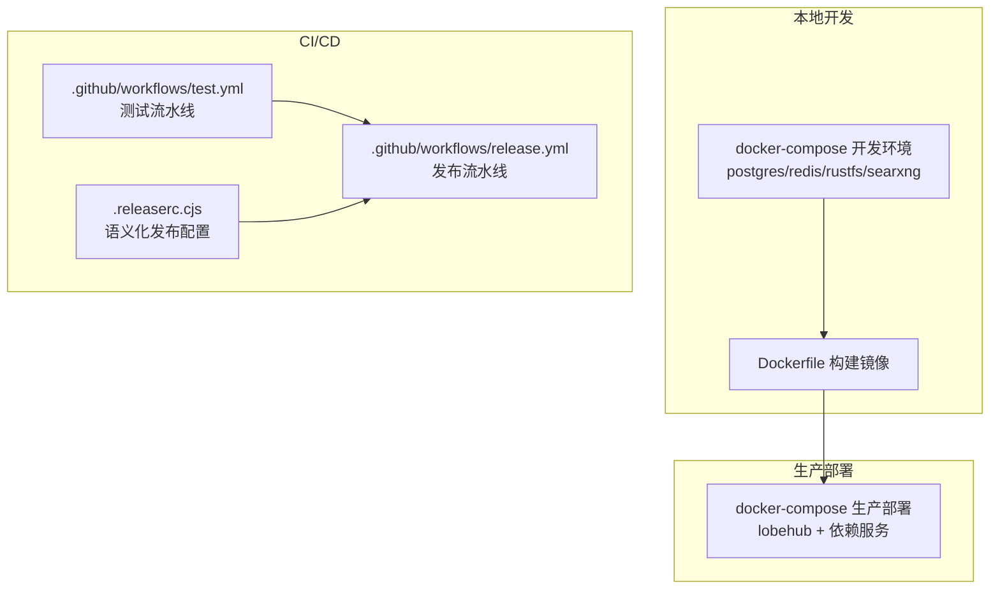
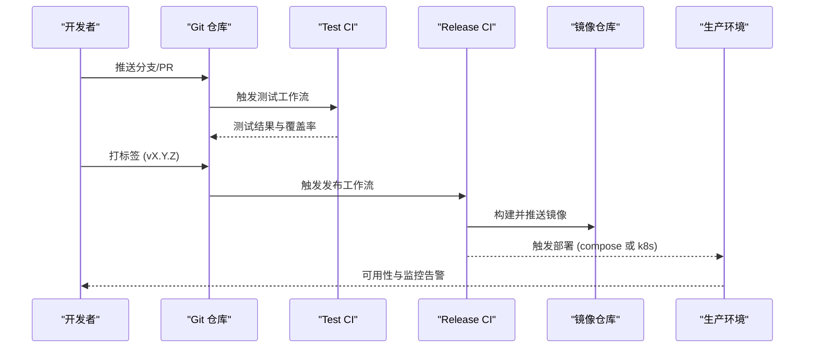
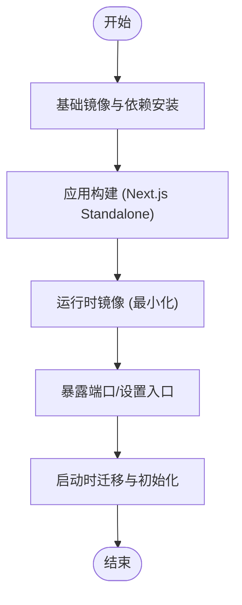
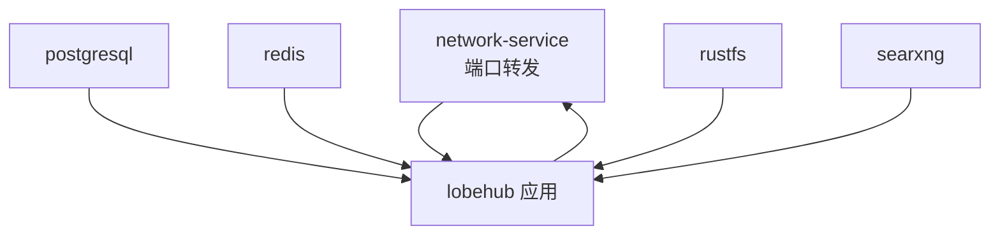
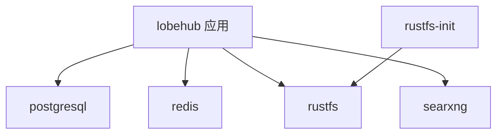
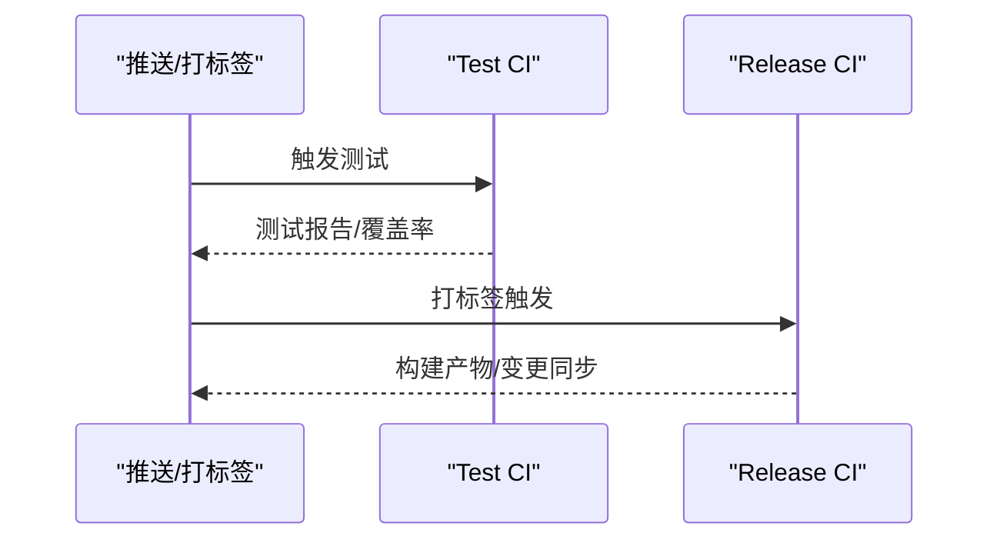
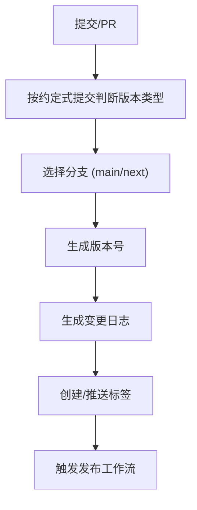
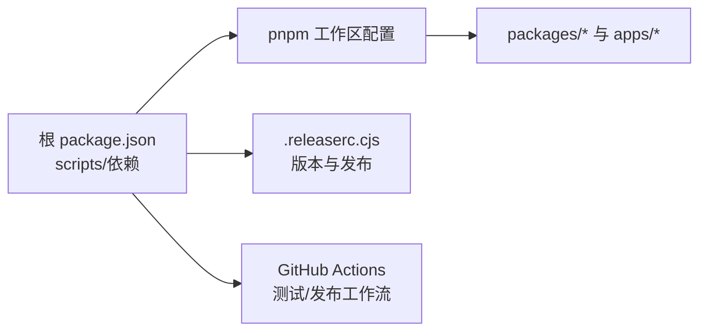

# 部署与发布

<cite>
**本文引用的文件**
- [Dockerfile](file://Dockerfile)
- [docker-compose 开发环境](file://docker-compose/dev/docker-compose.yml)
- [docker-compose 生产部署](file://docker-compose/deploy/docker-compose.yml)
- [GitHub Actions 测试工作流](file://.github/workflows/test.yml)
- [GitHub Actions 发布工作流](file://.github/workflows/release.yml)
- [语义化发布配置](file://.releaserc.cjs)
- [根包管理脚本定义](file://package.json)
- [pnpm 工作区配置](file://pnpm-workspace.yaml)
</cite>

## 目录

1. [简介](#简介)
2. [项目结构](#项目结构)
3. [核心组件](#核心组件)
4. [架构总览](#架构总览)
5. [详细组件分析](#详细组件分析)
6. [依赖关系分析](#依赖关系分析)
7. [性能考量](#性能考量)
8. [故障排查指南](#故障排查指南)
9. [结论](#结论)
10. [附录](#附录)

## 简介

本文件面向 LobeHub 项目的部署与发布流程，覆盖多环境部署（开发、测试、生产）、自动化发布（版本管理、发布标签、变更日志）、容器化与传统服务器部署、以及蓝绿 / 金丝雀 / 滚动更新等高级发布策略。同时给出发布回滚、健康检查、监控告警、部署失败处理、灰度与 A/B 测试等运维保障实践建议。

## 项目结构

LobeHub 采用多应用与多包的工作区组织，结合 Docker 与 docker-compose 提供本地开发与生产部署能力；通过 GitHub Actions 实现测试与发布流水线；使用语义化发布工具链自动生成版本与变更日志。

图表来源

- [docker-compose 开发环境](file://docker-compose/dev/docker-compose.yml#L1-L123)
- [docker-compose 生产部署](file://docker-compose/deploy/docker-compose.yml#L1-L144)
- [GitHub Actions 测试工作流](file://.github/workflows/test.yml#L1-L268)
- [GitHub Actions 发布工作流](file://.github/workflows/release.yml#L1-L82)
- [语义化发布配置](file://.releaserc.cjs#L1-L19)

章节来源

- [docker-compose 开发环境](file://docker-compose/dev/docker-compose.yml#L1-L123)
- [docker-compose 生产部署](file://docker-compose/deploy/docker-compose.yml#L1-L144)
- [GitHub Actions 测试工作流](file://.github/workflows/test.yml#L1-L268)
- [GitHub Actions 发布工作流](file://.github/workflows/release.yml#L1-L82)
- [语义化发布配置](file://.releaserc.cjs#L1-L19)

## 核心组件

- 容器镜像与构建
  - 使用单 Dockerfile 多阶段构建，产出最小化运行时镜像，内置数据库迁移脚本与静态资源拷贝，支持代理与证书配置。
- 本地开发编排
  - docker-compose 开发环境包含数据库、缓存、对象存储、搜索引擎等依赖服务，便于一键启动与联调。
- 生产部署编排
  - docker-compose 生产环境以服务形式编排应用与依赖，提供健康检查、端口映射与持久化卷。
- 自动化测试与发布
  - GitHub Actions 测试工作流执行包测试、应用测试与覆盖率上传；发布工作流在打标签后触发，完成构建与产物同步。
- 版本与变更日志
  - 基于语义化发布配置，自动根据提交类型生成版本号与变更日志，并在准备阶段执行变更日志生成脚本。

章节来源

- [Dockerfile](file://Dockerfile#L1-L344)
- [docker-compose 开发环境](file://docker-compose/dev/docker-compose.yml#L1-L123)
- [docker-compose 生产部署](file://docker-compose/deploy/docker-compose.yml#L1-L144)
- [GitHub Actions 测试工作流](file://.github/workflows/test.yml#L1-L268)
- [GitHub Actions 发布工作流](file://.github/workflows/release.yml#L1-L82)
- [语义化发布配置](file://.releaserc.cjs#L1-L19)

## 架构总览

下图展示从代码提交到生产发布的整体路径：开发者在本地或 CI 中运行测试，通过语义化发布生成版本与变更日志，最终以容器镜像形式部署至生产环境。

图表来源

- [GitHub Actions 测试工作流](file://.github/workflows/test.yml#L1-L268)
- [GitHub Actions 发布工作流](file://.github/workflows/release.yml#L1-L82)
- [语义化发布配置](file://.releaserc.cjs#L1-L19)

## 详细组件分析

### 容器镜像与构建（Dockerfile）

- 多阶段构建
  - 基础镜像与依赖安装、应用构建、运行时镜像三阶段，确保最终镜像最小化。
  - 构建阶段注入环境变量（如分析平台 DSN、特性开关）与预构建步骤，剔除桌面专属代码后进行 Next.js Standalone 构建。
- 运行时优化
  - 使用最小基础镜像与独立用户运行，暴露端口并设置入口命令。
  - 支持代理链路与证书路径配置，适配复杂网络环境。
- 数据库迁移与静态资源
  - 将迁移脚本与 SPA 资源复制进运行时镜像，启动时由脚本负责迁移与初始化。

图表来源

- [Dockerfile](file://Dockerfile#L1-L344)

章节来源

- [Dockerfile](file://Dockerfile#L1-L344)

### 本地开发编排（docker-compose 开发环境）

- 服务编排
  - 提供网络服务容器作为统一网关，映射必要端口；数据库、缓存、对象存储、搜索引擎等服务均配置健康检查。
- 环境变量与持久化
  - 通过 .env 注入环境变量，数据卷持久化，便于本地调试与数据保留。
- 启动顺序与等待
  - 通过网络服务容器统一暴露端口，配合 wait 等机制保证依赖可用后再启动应用。

图表来源

- [docker-compose 开发环境](file://docker-compose/dev/docker-compose.yml#L1-L123)

章节来源

- [docker-compose 开发环境](file://docker-compose/dev/docker-compose.yml#L1-L123)

### 生产部署编排（docker-compose 生产环境）

- 服务编排
  - 应用服务依赖数据库、缓存、对象存储与搜索引擎，具备健康检查与重启策略。
  - 对象存储初始化任务仅执行一次，确保桶与权限配置正确。
- 环境变量与端口映射
  - 映射应用端口，注入密钥与连接串，启用特定功能参数（如视觉模型图片 base64）。
- 持久化与可维护性
  - 数据卷用于数据库与缓存持久化，便于备份与升级。

图表来源

- [docker-compose 生产部署](file://docker-compose/deploy/docker-compose.yml#L1-L144)

章节来源

- [docker-compose 生产部署](file://docker-compose/deploy/docker-compose.yml#L1-L144)

### 自动化测试与发布（GitHub Actions）

- 测试工作流
  - 包测试、应用分片测试、覆盖率合并与上传，数据库测试在受控 Postgres 容器中执行。
  - 使用并发跳过重复运行，节省资源。
- 发布工作流
  - 在匹配版本标签时触发，拉取代码、安装依赖、执行 Lint 与测试、生成文档同步、推送变更。
  - 内置 Postgres 服务用于数据库测试。

图表来源

- [GitHub Actions 测试工作流](file://.github/workflows/test.yml#L1-L268)
- [GitHub Actions 发布工作流](file://.github/workflows/release.yml#L1-L82)

章节来源

- [GitHub Actions 测试工作流](file://.github/workflows/test.yml#L1-L268)
- [GitHub Actions 发布工作流](file://.github/workflows/release.yml#L1-L82)

### 版本与变更日志（语义化发布）

- 分支策略
  - 主分支与预发布分支配置，支持预发布标记。
- 插件扩展
  - 在准备阶段执行变更日志生成脚本，确保每次发布前生成最新变更记录。
- 与发布工作流联动
  - 发布工作流与测试工作流共同构成 “先测后发” 的质量门禁。

图表来源

- [语义化发布配置](file://.releaserc.cjs#L1-L19)
- [GitHub Actions 发布工作流](file://.github/workflows/release.yml#L1-L82)

章节来源

- [语义化发布配置](file://.releaserc.cjs#L1-L19)
- [GitHub Actions 发布工作流](file://.github/workflows/release.yml#L1-L82)

### 多环境部署策略

- 开发环境
  - 使用 docker-compose 开发环境快速搭建，适合本地联调与集成测试。
- 测试环境
  - 建议复用生产编排，但使用独立数据库与缓存实例，避免污染生产数据。
- 生产环境
  - 使用生产编排并结合负载均衡与反向代理，开启健康检查与日志采集。

章节来源

- [docker-compose 开发环境](file://docker-compose/dev/docker-compose.yml#L1-L123)
- [docker-compose 生产部署](file://docker-compose/deploy/docker-compose.yml#L1-L144)

### 高级发布策略

- 蓝绿部署
  - 通过切换流量指向新旧两套服务实现零停机发布，适用于重大功能或架构变更。
- 金丝雀发布
  - 逐步将部分流量导入新版本，结合指标阈值与告警决定是否扩大流量或回滚。
- 滚动更新
  - 逐批替换实例，保持服务可用性，适合常规小版本迭代。

说明：上述策略为通用实践建议，具体实施需结合负载均衡、服务网格与可观测性体系。

### 运维保障措施

- 健康检查
  - 编排文件已内置健康检查指令，建议在生产环境中增加探针与自动重启策略。
- 监控告警
  - 建议接入指标与日志采集系统，对错误率、延迟、资源使用率设置阈值告警。
- 发布回滚
  - 通过版本标签与镜像版本管理，快速回滚至上一个稳定版本。
- 灰度与 A/B 测试
  - 通过路由分流或网关规则实现灰度发布；结合埋点与指标评估效果。

## 依赖关系分析

- 工作区与包管理
  - pnpm 工作区统一管理多包与应用，根 package.json 定义构建、测试、发布与文档工作流脚本。
- 依赖覆盖与补丁
  - 通过 overrides 与 patches 统一版本与修复第三方依赖问题，减少安全风险。

图表来源

- [根包管理脚本定义](file://package.json#L1-L517)
- [pnpm 工作区配置](file://pnpm-workspace.yaml#L1-L23)
- [语义化发布配置](file://.releaserc.cjs#L1-L19)
- [GitHub Actions 测试工作流](file://.github/workflows/test.yml#L1-L268)
- [GitHub Actions 发布工作流](file://.github/workflows/release.yml#L1-L82)

章节来源

- [根包管理脚本定义](file://package.json#L1-L517)
- [pnpm 工作区配置](file://pnpm-workspace.yaml#L1-L23)

## 性能考量

- 构建与镜像
  - 多阶段构建与输出追踪可显著减小镜像体积，提升启动速度。
- 运行时
  - 最小化运行时镜像、合理的内存选项与证书路径配置有助于降低资源占用与提高稳定性。
- 测试与发布
  - 并行化测试与覆盖率合并可缩短 CI 时间，提升发布效率。

## 故障排查指南

- 构建失败
  - 检查构建阶段环境变量与依赖安装步骤，确认代理与镜像源配置。
- 健康检查失败
  - 查看编排中的健康检查配置与日志，确认数据库、缓存与对象存储服务可达。
- 发布失败
  - 关注发布工作流日志与测试覆盖率，确保所有测试通过且变更日志生成成功。
- 回滚操作
  - 使用上一个稳定版本标签回滚，验证服务可用性与数据一致性。

章节来源

- [GitHub Actions 测试工作流](file://.github/workflows/test.yml#L1-L268)
- [GitHub Actions 发布工作流](file://.github/workflows/release.yml#L1-L82)
- [docker-compose 开发环境](file://docker-compose/dev/docker-compose.yml#L1-L123)
- [docker-compose 生产部署](file://docker-compose/deploy/docker-compose.yml#L1-L144)

## 结论

LobeHub 的部署与发布体系以容器化为核心，结合 GitHub Actions 实现自动化测试与发布，辅以语义化版本与变更日志管理。通过 docker-compose 快速搭建开发与生产环境，配合健康检查与可观测性，可实现稳定高效的交付流程。建议在生产环境中引入蓝绿 / 金丝雀等高级发布策略与完善的监控告警体系，进一步提升发布质量与风险控制能力。

## 附录

- 常用命令参考
  - 本地开发：启动依赖服务与应用，执行数据库迁移。
  - 构建镜像：使用 Dockerfile 构建本地镜像，支持国内镜像加速参数。
  - 发布流程：打标签触发发布工作流，生成变更日志并推送镜像。
- 参考文件
  - Dockerfile、docker-compose 开发与生产编排、测试与发布工作流、语义化发布配置、根包管理脚本与工作区配置。
