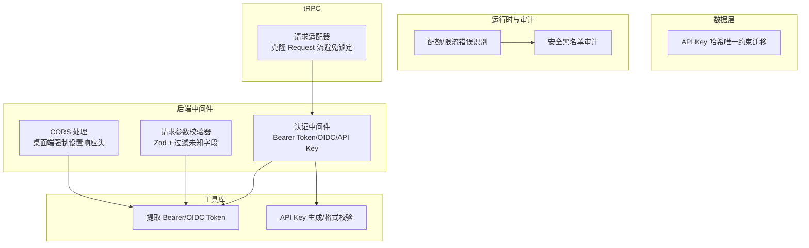
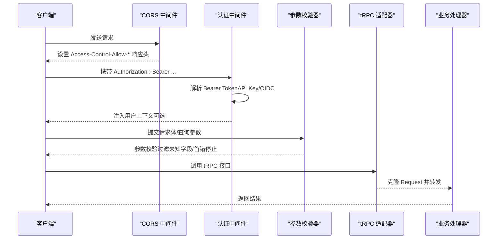
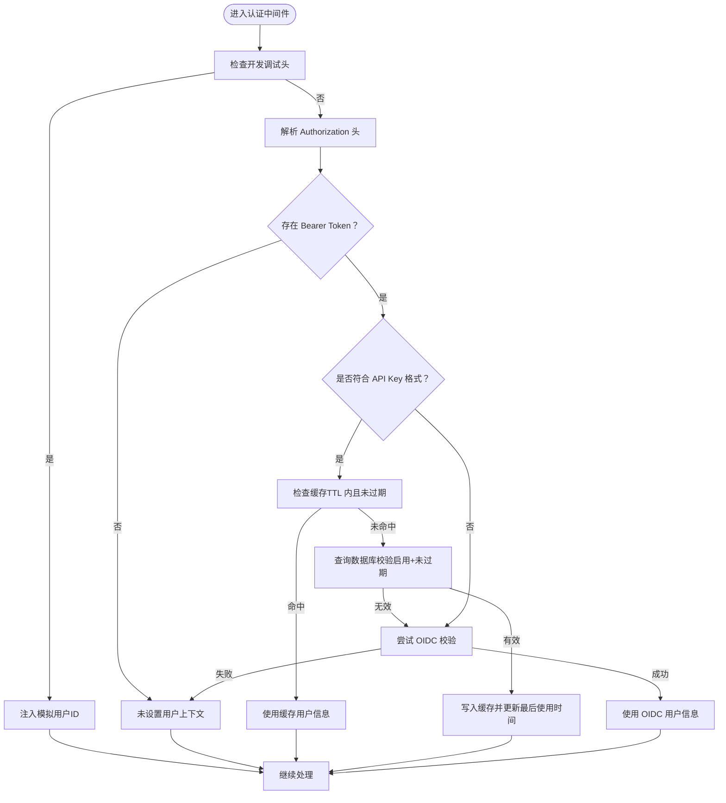
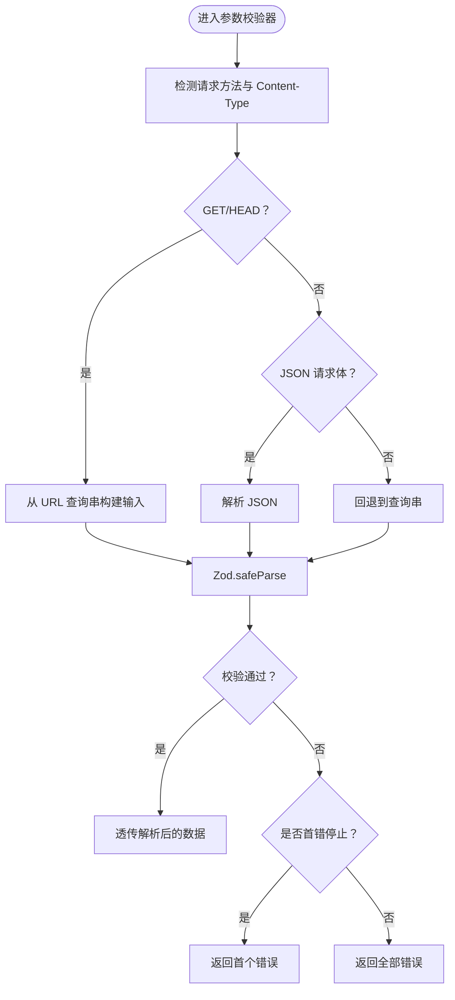
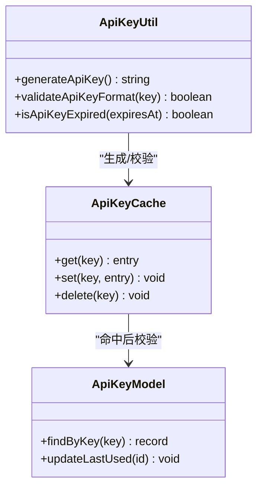
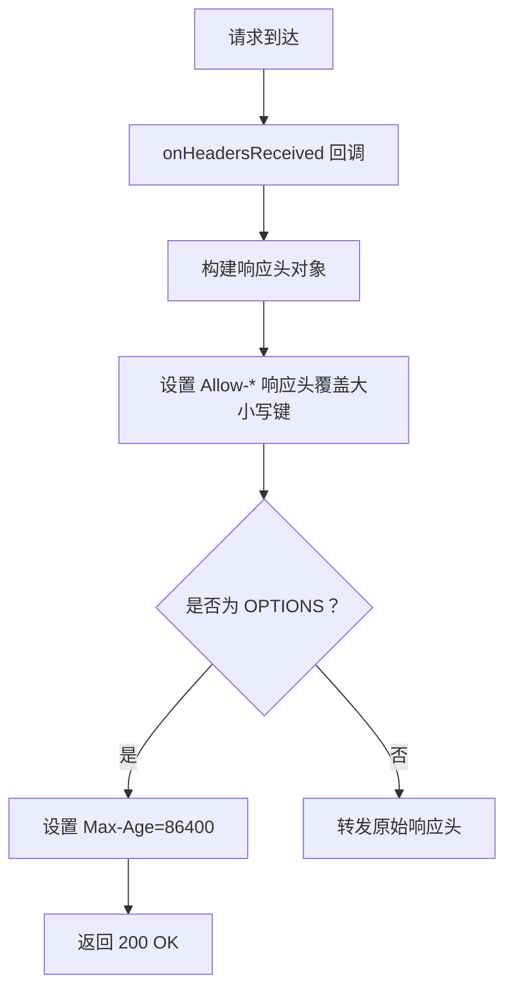
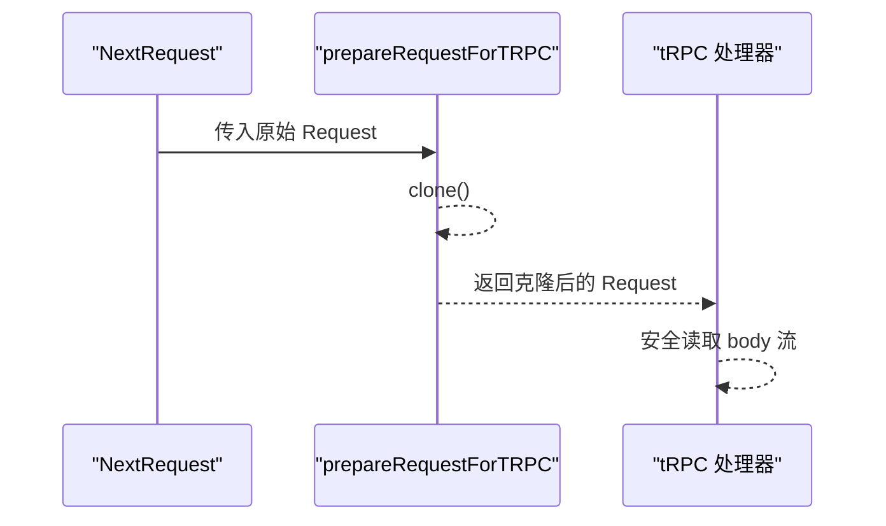
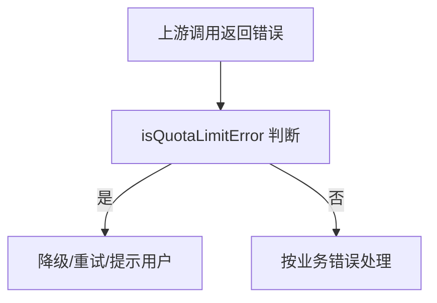
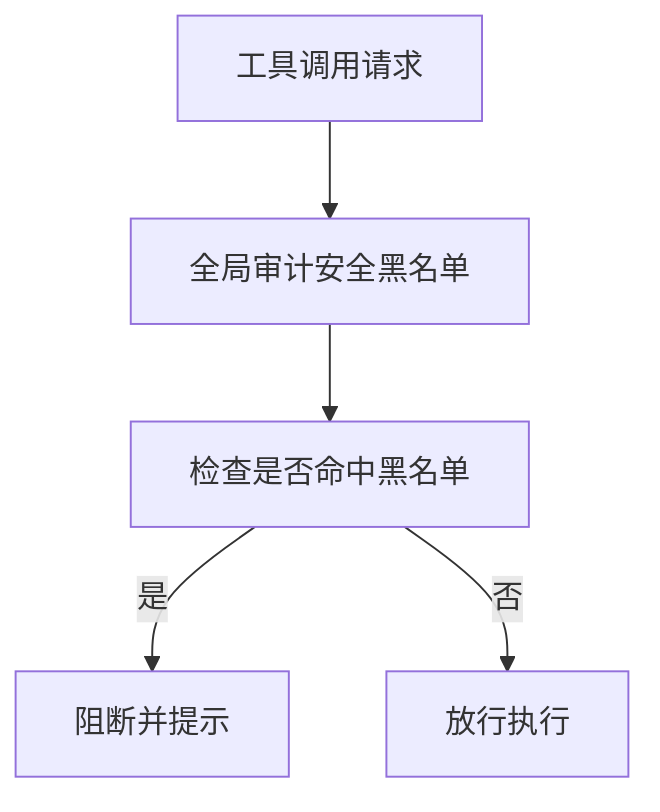
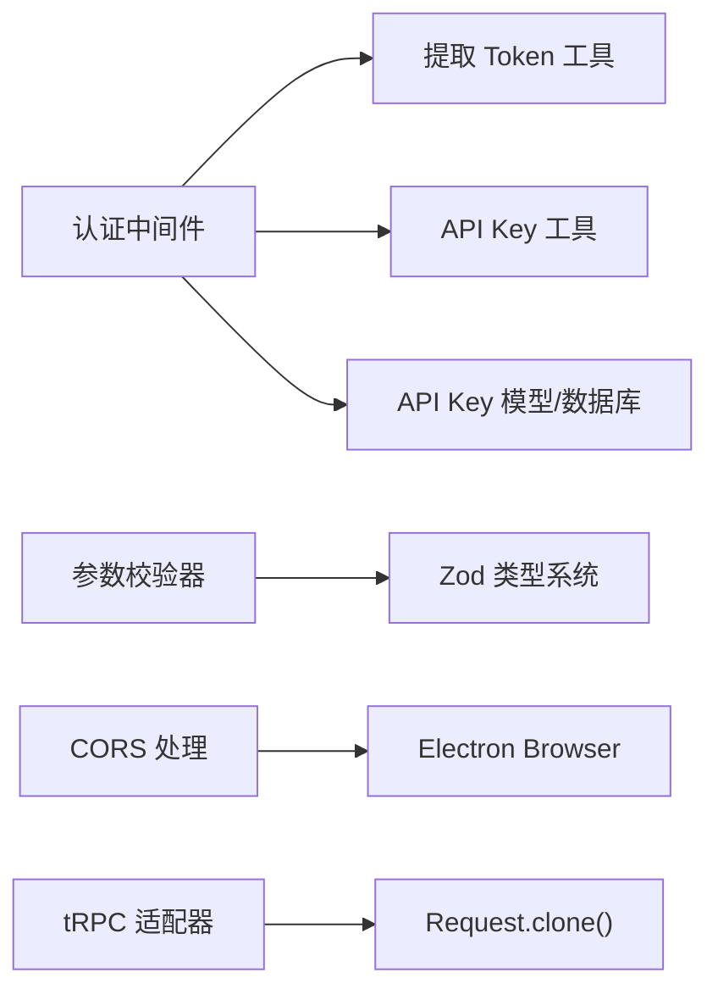

# API 安全防护

<cite>
**本文引用的文件**
- [packages/openapi/src/middleware/auth.ts](file://packages/openapi/src/middleware/auth.ts)
- [src/app/(backend)/middleware/validate/createValidator.ts](file://src/app/(backend)/middleware/validate/createValidator.ts)
- [packages/utils/src/server/auth.ts](file://packages/utils/src/server/auth.ts)
- [packages/utils/src/apiKey.ts](file://packages/utils/src/apiKey.ts)
- [apps/desktop/src/main/core/browser/Browser.ts](file://apps/desktop/src/main/core/browser/Browser.ts)
- [apps/desktop/src/main/utils/__tests__/http-headers.test.ts](file://apps/desktop/src/main/utils/__tests__/http-headers.test.ts)
- [apps/desktop/src/main/core/infrastructure/__tests__/StaticFileServerManager.test.ts](file://apps/desktop/src/main/core/infrastructure/__tests__/StaticFileServerManager.test.ts)
- [packages/database/migrations/0089_add_api_key_hash.sql](file://packages/database/migrations/0089_add_api_key_hash.sql)
- [src/server/modules/ModelRuntime/apiKeyManager.test.ts](file://src/server/modules/ModelRuntime/apiKeyManager.test.ts)
- [packages/utils/src/client/apiKeyManager.ts](file://packages/utils/src/client/apiKeyManager.ts)
- [src/app/(backend)/middleware/auth/utils.ts](file://src/app/(backend)/middleware/auth/utils.ts)
- [src/app/(backend)/middleware/auth/index.ts](file://src/app/(backend)/middleware/auth/index.ts)
- [src/libs/trpc/utils/request-adapter.ts](file://src/libs/trpc/utils/request-adapter.ts)
- [packages/model-runtime/src/utils/isQuotaLimitError.ts](file://packages/model-runtime/src/utils/isQuotaLimitError.ts)
- [packages/model-runtime/src/core/anthropicCompatibleFactory/index.ts](file://packages/model-runtime/src/core/anthropicCompatibleFactory/index.ts)
- [packages/agent-runtime/src/audit/createSecurityBlacklistAudit.ts](file://packages/agent-runtime/src/audit/createSecurityBlacklistAudit.ts)
- [packages/agent-runtime/src/audit/globalAudit.ts](file://packages/agent-runtime/src/audit/globalAudit.ts)
- [packages/types/src/tool/builtin.ts](file://packages/types/src/tool/builtin.ts)
</cite>

## 目录

1. 引言
2. 项目结构
3. 核心组件
4. 架构总览
5. 组件详解
6. 依赖关系分析
7. 性能考量
8. 故障排查指南
9. 结论
10. 附录

## 引言

本文件面向 LobeHub 的 API 安全防护，聚焦 tRPC 接口的安全设计与落地实践，涵盖请求验证、参数过滤、类型安全、认证与授权（Bearer Token、API Key、OIDC）、速率限制与防滥用、安全中间件（CORS、请求头校验、响应压缩）、版本控制与兼容性、安全更新发布以及监控与审计等运维保障。

## 项目结构

围绕 API 安全的关键目录与文件如下：

- 中间件与安全：认证中间件、请求参数校验器、CORS 处理
- 工具库：Bearer Token 提取、API Key 生成与格式校验
- 数据层：API Key 哈希唯一约束迁移
- 运行时与审计：配额限制识别、安全黑名单审计
- tRPC 请求适配：解决 Next.js 16 下流体被占用导致的错误

**图表来源**

- [packages/openapi/src/middleware/auth.ts](file://packages/openapi/src/middleware/auth.ts#L49-L206)
- [src/app/(backend)/middleware/validate/createValidator.ts](<file://src/app/(backend)/middleware/validate/createValidator.ts#L46-L80>)
- [packages/utils/src/server/auth.ts](file://packages/utils/src/server/auth.ts#L23-L60)
- [packages/utils/src/apiKey.ts](file://packages/utils/src/apiKey.ts#L9-L60)
- [apps/desktop/src/main/core/browser/Browser.ts](file://apps/desktop/src/main/core/browser/Browser.ts#L516-L539)
- [packages/database/migrations/0089_add_api_key_hash.sql](file://packages/database/migrations/0089_add_api_key_hash.sql#L1-L3)
- [packages/model-runtime/src/utils/isQuotaLimitError.ts](file://packages/model-runtime/src/utils/isQuotaLimitError.ts#L1-L14)
- [packages/agent-runtime/src/audit/createSecurityBlacklistAudit.ts](file://packages/agent-runtime/src/audit/createSecurityBlacklistAudit.ts#L15-L21)
- [src/libs/trpc/utils/request-adapter.ts](file://src/libs/trpc/utils/request-adapter.ts#L16-L19)

**章节来源**

- [packages/openapi/src/middleware/auth.ts](file://packages/openapi/src/middleware/auth.ts#L49-L206)
- [src/app/(backend)/middleware/validate/createValidator.ts](<file://src/app/(backend)/middleware/validate/createValidator.ts#L46-L80>)
- [packages/utils/src/server/auth.ts](file://packages/utils/src/server/auth.ts#L23-L60)
- [packages/utils/src/apiKey.ts](file://packages/utils/src/apiKey.ts#L9-L60)
- [apps/desktop/src/main/core/browser/Browser.ts](file://apps/desktop/src/main/core/browser/Browser.ts#L516-L539)
- [packages/database/migrations/0089_add_api_key_hash.sql](file://packages/database/migrations/0089_add_api_key_hash.sql#L1-L3)
- [packages/model-runtime/src/utils/isQuotaLimitError.ts](file://packages/model-runtime/src/utils/isQuotaLimitError.ts#L1-L14)
- [packages/agent-runtime/src/audit/createSecurityBlacklistAudit.ts](file://packages/agent-runtime/src/audit/createSecurityBlacklistAudit.ts#L15-L21)
- [src/libs/trpc/utils/request-adapter.ts](file://src/libs/trpc/utils/request-adapter.ts#L16-L19)

## 核心组件

- 认证中间件：支持 Bearer Token（API Key 与 OIDC），开发模式调试放行，失败不直接抛错，由路由决定是否强制认证
- 请求参数校验器：基于 Zod，自动过滤未知字段、可选首错停止、统一 422 错误返回
- API Key 管理：服务端缓存 + 数据库校验、过期检查、最后使用时间更新；客户端支持轮询 / 随机选择
- CORS 安全：桌面端强制设置允许来源、方法、头部与凭据，并在预检请求中设置最大缓存
- tRPC 请求适配：克隆 Request 以避免 Next.js 16 下流被占用导致的错误
- 运行时审计与限流：识别配额耗尽类错误并进行降级或提示；全局安全黑名单审计阻止高风险工具调用

**章节来源**

- [packages/openapi/src/middleware/auth.ts](file://packages/openapi/src/middleware/auth.ts#L49-L206)
- [src/app/(backend)/middleware/validate/createValidator.ts](<file://src/app/(backend)/middleware/validate/createValidator.ts#L46-L80>)
- [packages/utils/src/apiKey.ts](file://packages/utils/src/apiKey.ts#L9-L60)
- [packages/utils/src/client/apiKeyManager.ts](file://packages/utils/src/client/apiKeyManager.ts#L28-L38)
- [apps/desktop/src/main/core/browser/Browser.ts](file://apps/desktop/src/main/core/browser/Browser.ts#L516-L539)
- [src/libs/trpc/utils/request-adapter.ts](file://src/libs/trpc/utils/request-adapter.ts#L16-L19)
- [packages/model-runtime/src/utils/isQuotaLimitError.ts](file://packages/model-runtime/src/utils/isQuotaLimitError.ts#L10-L14)
- [packages/agent-runtime/src/audit/createSecurityBlacklistAudit.ts](file://packages/agent-runtime/src/audit/createSecurityBlacklistAudit.ts#L15-L21)

## 架构总览

下图展示从请求进入系统到 tRPC 处理的关键路径，以及安全组件的介入点。

**图表来源**

- [apps/desktop/src/main/core/browser/Browser.ts](file://apps/desktop/src/main/core/browser/Browser.ts#L516-L539)
- [packages/openapi/src/middleware/auth.ts](file://packages/openapi/src/middleware/auth.ts#L49-L206)
- [src/app/(backend)/middleware/validate/createValidator.ts](<file://src/app/(backend)/middleware/validate/createValidator.ts#L46-L80>)
- [src/libs/trpc/utils/request-adapter.ts](file://src/libs/trpc/utils/request-adapter.ts#L16-L19)

## 组件详解

### 认证与授权（Bearer Token、API Key、OIDC）

- 支持两种令牌来源：
  - API Key：前缀格式校验，命中后优先走数据库校验（启用 / 未过期），同时写入内存缓存（带 TTL）以降低 DB 压力
  - OIDC：当开启 OIDC 且非 API Key 格式时，走 OIDC JWT 校验
- 开发模式调试：通过特定请求头可绕过认证，注入模拟用户 ID
- 强制认证中间件：在需要鉴权的路由上使用，未认证则返回 401

**图表来源**

- [packages/openapi/src/middleware/auth.ts](file://packages/openapi/src/middleware/auth.ts#L49-L206)
- [packages/utils/src/server/auth.ts](file://packages/utils/src/server/auth.ts#L23-L38)
- [packages/utils/src/apiKey.ts](file://packages/utils/src/apiKey.ts#L56-L60)

**章节来源**

- [packages/openapi/src/middleware/auth.ts](file://packages/openapi/src/middleware/auth.ts#L49-L206)
- [packages/utils/src/server/auth.ts](file://packages/utils/src/server/auth.ts#L23-L38)
- [packages/utils/src/apiKey.ts](file://packages/utils/src/apiKey.ts#L56-L60)
- [src/app/(backend)/middleware/auth/utils.ts](<file://src/app/(backend)/middleware/auth/utils.ts#L14-L22>)
- [src/app/(backend)/middleware/auth/index.ts](<file://src/app/(backend)/middleware/auth/index.ts#L70-L114>)

### 请求验证与参数过滤（Zod 类型安全）

- 自动识别 GET 查询参数与 JSON 请求体
- 可配置 “仅保留模型字段”（strip），自动丢弃未知字段
- 可配置 “首错停止”，减少错误噪音
- 统一 422 返回结构，便于前端处理

**图表来源**

- [src/app/(backend)/middleware/validate/createValidator.ts](<file://src/app/(backend)/middleware/validate/createValidator.ts#L15-L74>)

**章节来源**

- [src/app/(backend)/middleware/validate/createValidator.ts](<file://src/app/(backend)/middleware/validate/createValidator.ts#L46-L80>)

### API Key 管理与安全

- 生成：高熵随机字符串 + 时间戳 + 计数器，确保唯一性
- 格式校验：严格正则匹配前缀与长度
- 存储：迁移新增 key_hash 字段并建立唯一索引，提升检索与去重效率
- 使用：服务端缓存 + 数据库双重校验，过期即剔除；最后使用时间异步更新
- 客户端：支持随机与轮询两种选择模式，便于多 Key 负载均衡

**图表来源**

- [packages/utils/src/apiKey.ts](file://packages/utils/src/apiKey.ts#L9-L60)
- [packages/database/migrations/0089_add_api_key_hash.sql](file://packages/database/migrations/0089_add_api_key_hash.sql#L1-L3)
- [packages/openapi/src/middleware/auth.ts](file://packages/openapi/src/middleware/auth.ts#L136-L155)
- [packages/utils/src/client/apiKeyManager.ts](file://packages/utils/src/client/apiKeyManager.ts#L28-L38)

**章节来源**

- [packages/utils/src/apiKey.ts](file://packages/utils/src/apiKey.ts#L9-L60)
- [packages/database/migrations/0089_add_api_key_hash.sql](file://packages/database/migrations/0089_add_api_key_hash.sql#L1-L3)
- [packages/openapi/src/middleware/auth.ts](file://packages/openapi/src/middleware/auth.ts#L136-L155)
- [packages/utils/src/client/apiKeyManager.ts](file://packages/utils/src/client/apiKeyManager.ts#L28-L38)
- [src/server/modules/ModelRuntime/apiKeyManager.test.ts](file://src/server/modules/ModelRuntime/apiKeyManager.test.ts#L82-L117)

### CORS 配置与请求头验证

- 桌面端浏览器模块在收到响应头时，强制设置以下 CORS 相关响应头，避免大小写键冲突导致重复或覆盖：
  - Access-Control-Allow-Origin
  - Access-Control-Allow-Methods
  - Access-Control-Allow-Headers
  - Access-Control-Allow-Credentials
- 对于 OPTIONS 预检请求，设置 Max-Age 缓存
- 单元测试覆盖了不同大小写键与无 Origin 场景下的行为

**图表来源**

- [apps/desktop/src/main/core/browser/Browser.ts](file://apps/desktop/src/main/core/browser/Browser.ts#L516-L539)
- [apps/desktop/src/main/utils/**tests**/http-headers.test.ts](file://apps/desktop/src/main/utils/__tests__/http-headers.test.ts#L51-L61)
- [apps/desktop/src/main/core/infrastructure/**tests**/StaticFileServerManager.test.ts](file://apps/desktop/src/main/core/infrastructure/__tests__/StaticFileServerManager.test.ts#L384-L443)

**章节来源**

- [apps/desktop/src/main/core/browser/Browser.ts](file://apps/desktop/src/main/core/browser/Browser.ts#L516-L539)
- [apps/desktop/src/main/utils/**tests**/http-headers.test.ts](file://apps/desktop/src/main/utils/__tests__/http-headers.test.ts#L51-L61)
- [apps/desktop/src/main/core/infrastructure/**tests**/StaticFileServerManager.test.ts](file://apps/desktop/src/main/core/infrastructure/__tests__/StaticFileServerManager.test.ts#L384-L443)

### tRPC 请求适配与类型安全

- 在 Next.js 16 中，若请求体流已被占用，tRPC 的 fetchRequestHandler 会报错。通过 clone Request 创建独立流，确保安全读取
- 与认证中间件配合，在进入 tRPC 处理前完成身份与参数校验

**图表来源**

- [src/libs/trpc/utils/request-adapter.ts](file://src/libs/trpc/utils/request-adapter.ts#L16-L19)

**章节来源**

- [src/libs/trpc/utils/request-adapter.ts](file://src/libs/trpc/utils/request-adapter.ts#L16-L19)

### 速率限制与防滥用

- 配额 / 限流识别：内置对多家供应商常见 “资源耗尽 / 配额超限 / 速率限制” 等错误的识别逻辑，便于上层降级或提示
- tRPC 适配器：通过克隆请求避免并发场景下流被占用引发的异常
- API Key 缓存：减少频繁数据库访问，缓解突发流量压力

**图表来源**

- [packages/model-runtime/src/utils/isQuotaLimitError.ts](file://packages/model-runtime/src/utils/isQuotaLimitError.ts#L10-L14)
- [packages/model-runtime/src/core/anthropicCompatibleFactory/index.ts](file://packages/model-runtime/src/core/anthropicCompatibleFactory/index.ts#L698-L715)
- [src/libs/trpc/utils/request-adapter.ts](file://src/libs/trpc/utils/request-adapter.ts#L16-L19)
- [packages/openapi/src/middleware/auth.ts](file://packages/openapi/src/middleware/auth.ts#L136-L155)

**章节来源**

- [packages/model-runtime/src/utils/isQuotaLimitError.ts](file://packages/model-runtime/src/utils/isQuotaLimitError.ts#L10-L14)
- [packages/model-runtime/src/core/anthropicCompatibleFactory/index.ts](file://packages/model-runtime/src/core/anthropicCompatibleFactory/index.ts#L698-L715)
- [src/libs/trpc/utils/request-adapter.ts](file://src/libs/trpc/utils/request-adapter.ts#L16-L19)
- [packages/openapi/src/middleware/auth.ts](file://packages/openapi/src/middleware/auth.ts#L136-L155)

### 安全审计与工具干预

- 全局安全黑名单审计：默认启用，不可绕过，用于拦截高风险工具调用
- 动态干预配置：支持基于运行时上下文的动态决策，结合默认黑白名单策略

**图表来源**

- [packages/agent-runtime/src/audit/createSecurityBlacklistAudit.ts](file://packages/agent-runtime/src/audit/createSecurityBlacklistAudit.ts#L15-L21)
- [packages/agent-runtime/src/audit/globalAudit.ts](file://packages/agent-runtime/src/audit/globalAudit.ts#L5-L7)
- [packages/types/src/tool/builtin.ts](file://packages/types/src/tool/builtin.ts#L118-L134)

**章节来源**

- [packages/agent-runtime/src/audit/createSecurityBlacklistAudit.ts](file://packages/agent-runtime/src/audit/createSecurityBlacklistAudit.ts#L15-L21)
- [packages/agent-runtime/src/audit/globalAudit.ts](file://packages/agent-runtime/src/audit/globalAudit.ts#L5-L7)
- [packages/types/src/tool/builtin.ts](file://packages/types/src/tool/builtin.ts#L118-L134)

## 依赖关系分析

- 认证中间件依赖：
  - 服务器端 API Key 模型与数据库适配
  - OIDC JWT 校验工具
  - Bearer Token 提取工具
- 参数校验器依赖：
  - Zod 类型系统
  - NextRequest/NextResponse
- CORS 处理依赖：
  - Electron Browser 模块事件钩子
  - 响应头操作工具
- tRPC 适配器依赖：
  - Request.clone()

**图表来源**

- [packages/openapi/src/middleware/auth.ts](file://packages/openapi/src/middleware/auth.ts#L5-L10)
- [src/app/(backend)/middleware/validate/createValidator.ts](<file://src/app/(backend)/middleware/validate/createValidator.ts#L2-L3>)
- [apps/desktop/src/main/core/browser/Browser.ts](file://apps/desktop/src/main/core/browser/Browser.ts#L502-L539)
- [src/libs/trpc/utils/request-adapter.ts](file://src/libs/trpc/utils/request-adapter.ts#L16-L19)

**章节来源**

- [packages/openapi/src/middleware/auth.ts](file://packages/openapi/src/middleware/auth.ts#L5-L10)
- [src/app/(backend)/middleware/validate/createValidator.ts](<file://src/app/(backend)/middleware/validate/createValidator.ts#L2-L3>)
- [apps/desktop/src/main/core/browser/Browser.ts](file://apps/desktop/src/main/core/browser/Browser.ts#L502-L539)
- [src/libs/trpc/utils/request-adapter.ts](file://src/libs/trpc/utils/request-adapter.ts#L16-L19)

## 性能考量

- API Key 缓存：5 分钟 TTL，命中后直接返回，显著降低数据库压力
- 参数校验：strip 过滤未知字段，减少后续处理开销
- 请求流克隆：避免 Next.js 16 并发场景下的流占用问题，提高稳定性
- CORS 强制设置：减少跨域协商成本，提升首包性能

\[本节为通用建议，无需具体文件分析]

## 故障排查指南

- 认证失败
  - 检查 Authorization 头格式是否为标准 Bearer
  - 若使用 API Key，请确认格式与有效期
  - 开发环境可通过调试头绕过认证定位问题
- 参数校验失败
  - 查看 422 返回的 issues 数组，定位首个或全部错误
  - 确认请求体 Content-Type 与方法是否正确
- CORS 问题
  - 确认响应头是否包含 Allow-\* 字段
  - 预检请求是否返回 200 且包含 Max-Age
- tRPC 报错 “body 已被占用”
  - 确认已使用请求适配器克隆 Request
- 配额 / 限流
  - 观察错误消息是否命中配额限制识别逻辑
  - 考虑切换 API Key 或降低请求频率

**章节来源**

- [packages/openapi/src/middleware/auth.ts](file://packages/openapi/src/middleware/auth.ts#L49-L206)
- [src/app/(backend)/middleware/validate/createValidator.ts](<file://src/app/(backend)/middleware/validate/createValidator.ts#L65-L70>)
- [apps/desktop/src/main/core/browser/Browser.ts](file://apps/desktop/src/main/core/browser/Browser.ts#L520-L539)
- [src/libs/trpc/utils/request-adapter.ts](file://src/libs/trpc/utils/request-adapter.ts#L16-L19)
- [packages/model-runtime/src/utils/isQuotaLimitError.ts](file://packages/model-runtime/src/utils/isQuotaLimitError.ts#L10-L14)

## 结论

LobeHub 的 API 安全体系以 “类型安全 + 参数过滤 + 多源认证 + 缓存优化 + CORS 强制 + tRPC 适配” 为核心，既保证了接口的健壮性与可维护性，又兼顾了性能与可观测性。配合运行时审计与配额识别，能够有效抵御滥用与越权访问，满足生产环境的安全要求。

\[本节为总结，无需具体文件分析]

## 附录

- API Key 哈希迁移：新增 key_hash 字段并建立唯一索引，提升检索与去重效率
- 客户端 Key 管理：支持随机与轮询两种模式，便于多 Key 负载均衡

**章节来源**

- [packages/database/migrations/0089_add_api_key_hash.sql](file://packages/database/migrations/0089_add_api_key_hash.sql#L1-L3)
- [packages/utils/src/client/apiKeyManager.ts](file://packages/utils/src/client/apiKeyManager.ts#L28-L38)
