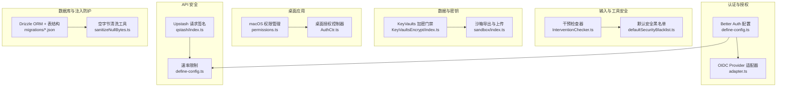
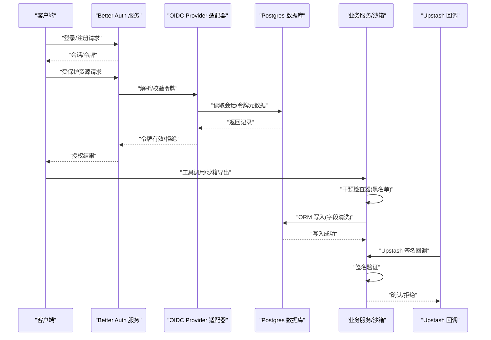
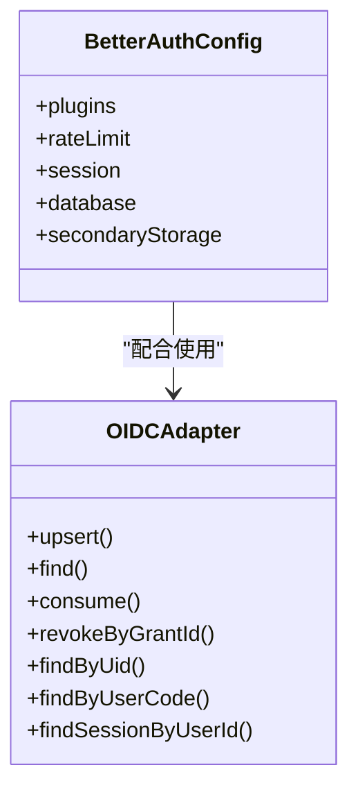
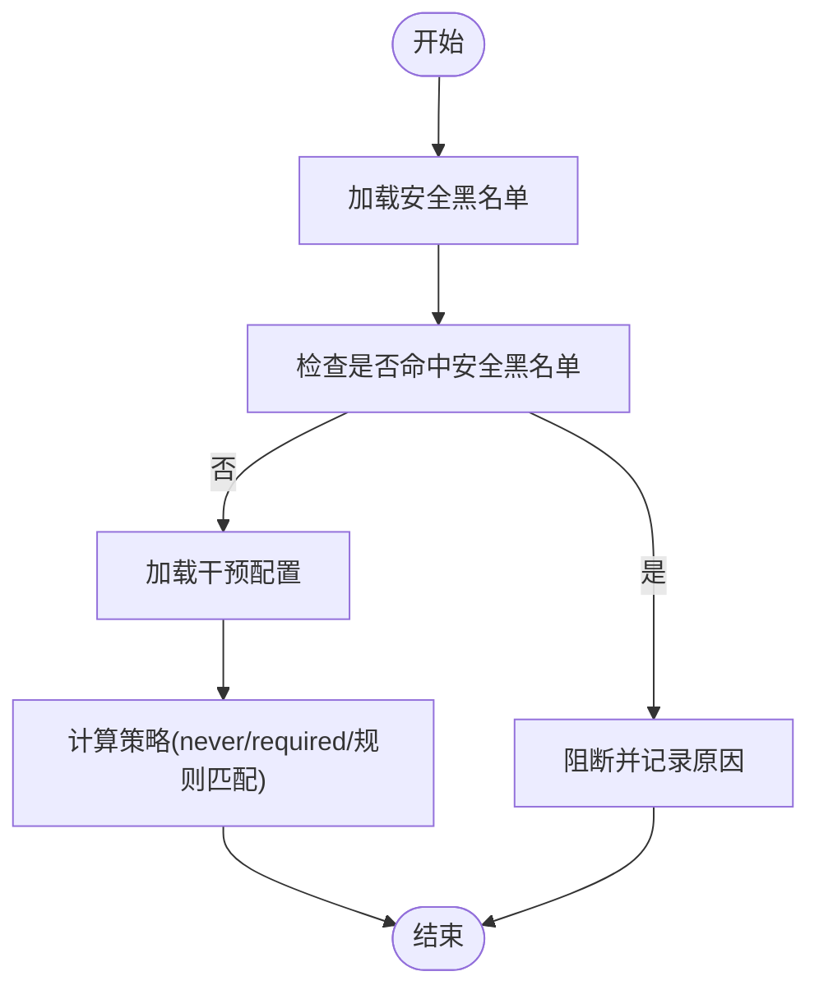
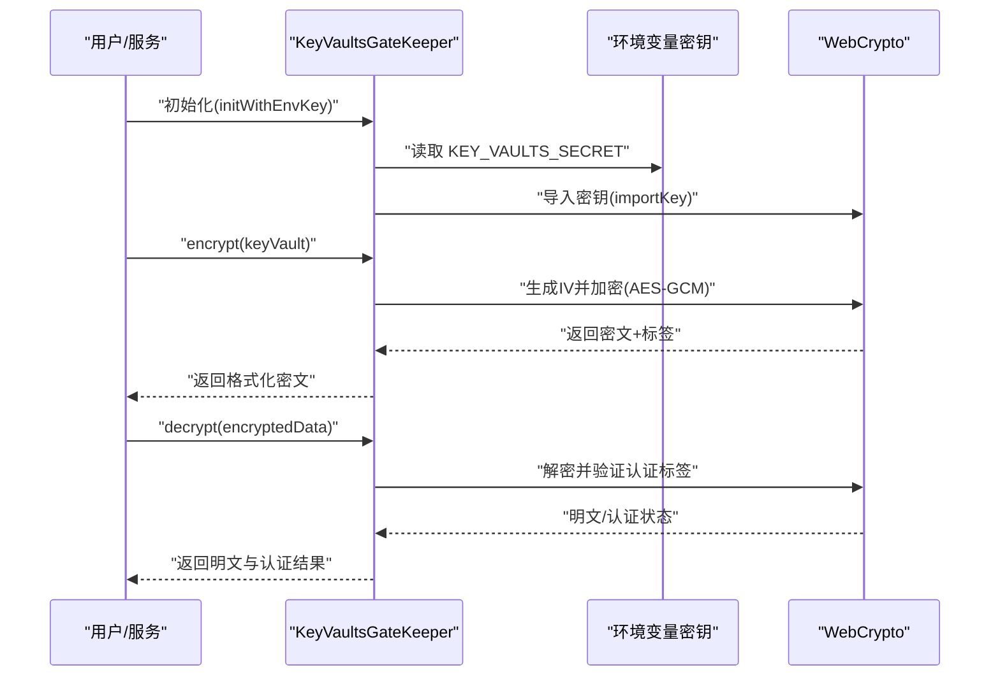
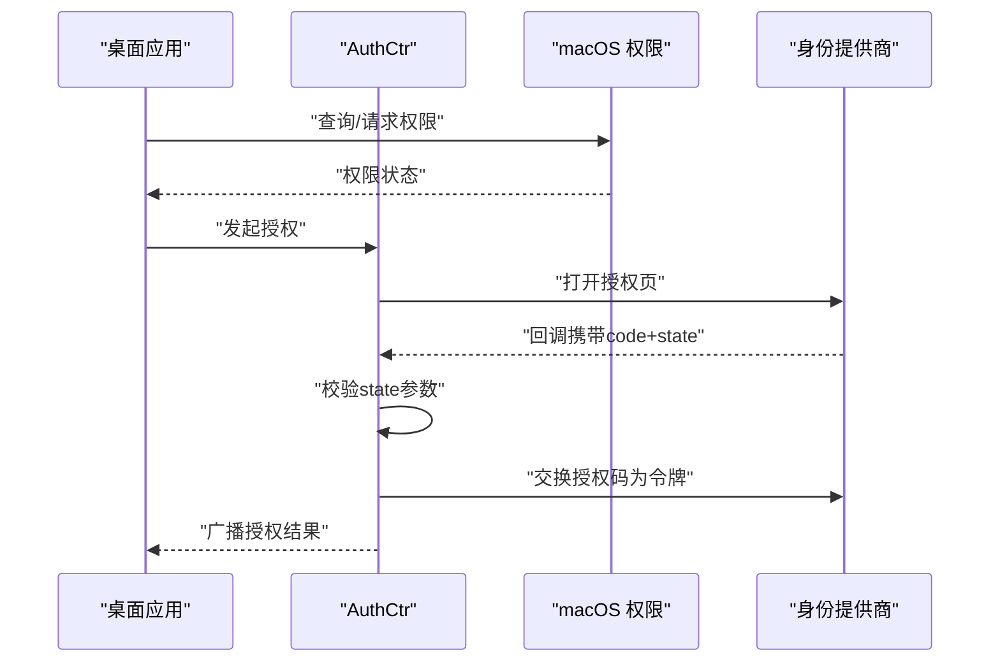
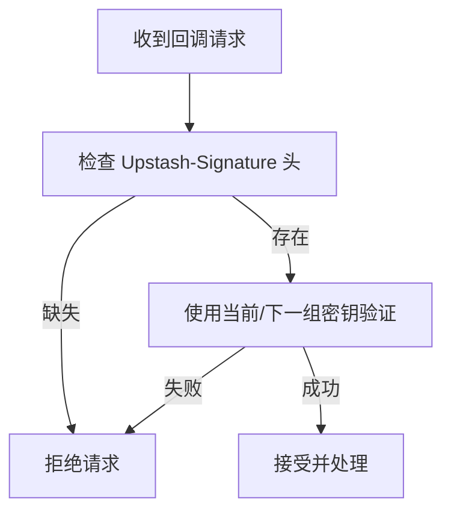
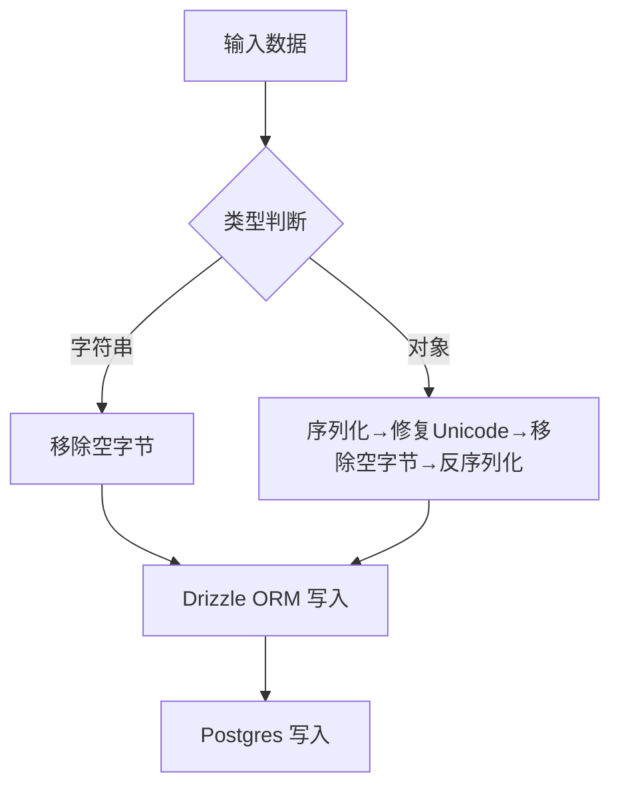
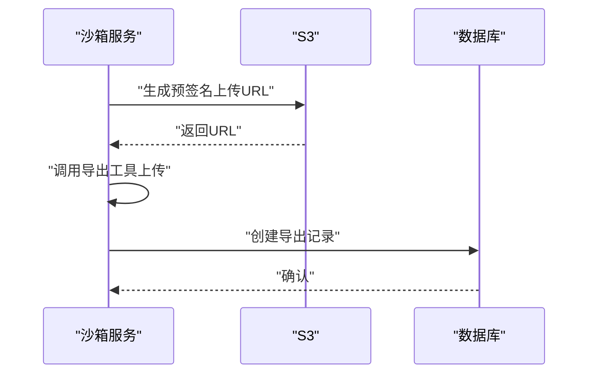
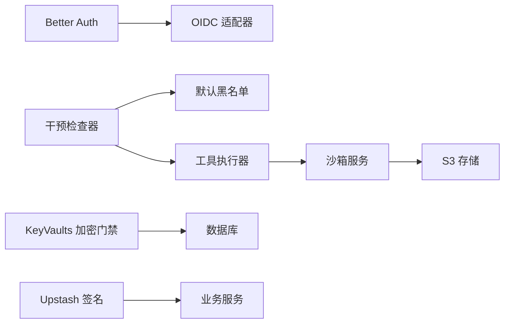

# 安全加固

<cite>
**本文引用的文件**
- [src/auth.ts](file://src/auth.ts)
- [packages/agent-runtime/src/core/InterventionChecker.ts](file://packages/agent-runtime/src/core/InterventionChecker.ts)
- [packages/agent-runtime/src/audit/defaultSecurityBlacklist.ts](file://packages/agent-runtime/src/audit/defaultSecurityBlacklist.ts)
- [src/libs/better-auth/define-config.ts](file://src/libs/better-auth/define-config.ts)
- [src/libs/oidc-provider/adapter.ts](file://src/libs/oidc-provider/adapter.ts)
- [src/server/modules/KeyVaultsEncrypt/index.ts](file://src/server/modules/KeyVaultsEncrypt/index.ts)
- [apps/desktop/src/main/utils/permissions.ts](file://apps/desktop/src/main/utils/permissions.ts)
- [apps/desktop/src/main/controllers/AuthCtr.ts](file://apps/desktop/src/main/controllers/AuthCtr.ts)
- [src/server/services/sandbox/index.ts](file://src/server/services/sandbox/index.ts)
- [packages/builtin-tool-cloud-sandbox/src/executor/index.ts](file://packages/builtin-tool-cloud-sandbox/src/executor/index.ts)
- [packages/database/migrations/meta/0071_snapshot.json](file://packages/database/migrations/meta/0071_snapshot.json)
- [packages/database/migrations/meta/0067_snapshot.json](file://packages/database/migrations/meta/0067_snapshot.json)
- [packages/database/migrations/meta/0082_snapshot.json](file://packages/database/migrations/meta/0082_snapshot.json)
- [packages/database/migrations/meta/0081_snapshot.json](file://packages/database/migrations/meta/0081_snapshot.json)
- [src/libs/qstash/index.ts](file://src/libs/qstash/index.ts)
- [packages/utils/sanitizeNullBytes.ts](file://packages/utils/sanitizeNullBytes.ts)
- [src/server/routers/lambda/userMemories.ts](file://src/server/routers/lambda/userMemories.ts)
</cite>

## 目录

1. [简介](#简介)
2. [项目结构](#项目结构)
3. [核心组件](#核心组件)
4. [架构总览](#架构总览)
5. [详细组件分析](#详细组件分析)
6. [依赖关系分析](#依赖关系分析)
7. [性能与安全权衡](#性能与安全权衡)
8. [故障排查指南](#故障排查指南)
9. [结论](#结论)
10. [附录](#附录)

## 简介

本文件面向 LobeHub 项目的 “安全加固” 目标，系统梳理并说明当前实现中的安全实践与可改进点，覆盖输入验证、SQL 注入防护、XSS 防范、身份认证与授权（含 OAuth、OIDC、JWT）、数据加密（传输与存储）、API 安全（速率限制、请求签名、防重放）、桌面应用安全（权限与沙箱）、安全审计与合规建议等。文档以 “可落地” 的方式呈现，既给出代码级依据，也提供架构与流程图示，帮助开发者与运维人员快速定位与优化。

## 项目结构

围绕安全主题，本项目的关键安全相关模块分布如下：

- 身份认证与授权：Better Auth 配置、OIDC Provider 适配器、OAuth/SSO 插件
- 输入与工具调用安全：干预检查器与默认黑名单
- 数据加密与密钥管理：服务端对称加密门禁
- 桌面应用安全：macOS 权限管理、桌面端授权控制器
- API 安全：速率限制、Upstash 请求签名校验
- 数据库与注入防护：Drizzle ORM + 字段清洗工具
- 沙箱导出与隐私：按日期分片上传与最小化暴露

图表来源

- [src/libs/better-auth/define-config.ts](file://src/libs/better-auth/define-config.ts#L95-L333)
- [src/libs/oidc-provider/adapter.ts](file://src/libs/oidc-provider/adapter.ts#L32-L587)
- [packages/agent-runtime/src/core/InterventionChecker.ts](file://packages/agent-runtime/src/core/InterventionChecker.ts#L30-L248)
- [packages/agent-runtime/src/audit/defaultSecurityBlacklist.ts](file://packages/agent-runtime/src/audit/defaultSecurityBlacklist.ts)
- [src/server/modules/KeyVaultsEncrypt/index.ts](file://src/server/modules/KeyVaultsEncrypt/index.ts#L9-L126)
- [src/server/services/sandbox/index.ts](file://src/server/services/sandbox/index.ts#L95-L136)
- [apps/desktop/src/main/utils/permissions.ts](file://apps/desktop/src/main/utils/permissions.ts#L1-L376)
- [apps/desktop/src/main/controllers/AuthCtr.ts](file://apps/desktop/src/main/controllers/AuthCtr.ts#L216-L240)
- [src/libs/qstash/index.ts](file://src/libs/qstash/index.ts#L41-L60)
- [packages/utils/sanitizeNullBytes.ts](file://packages/utils/sanitizeNullBytes.ts#L1-L24)
- [packages/database/migrations/meta/0071_snapshot.json](file://packages/database/migrations/meta/0071_snapshot.json#L7478-L7531)

章节来源

- [src/libs/better-auth/define-config.ts](file://src/libs/better-auth/define-config.ts#L95-L333)
- [src/libs/oidc-provider/adapter.ts](file://src/libs/oidc-provider/adapter.ts#L32-L587)
- [packages/agent-runtime/src/core/InterventionChecker.ts](file://packages/agent-runtime/src/core/InterventionChecker.ts#L30-L248)
- [packages/agent-runtime/src/audit/defaultSecurityBlacklist.ts](file://packages/agent-runtime/src/audit/defaultSecurityBlacklist.ts)
- [src/server/modules/KeyVaultsEncrypt/index.ts](file://src/server/modules/KeyVaultsEncrypt/index.ts#L9-L126)
- [src/server/services/sandbox/index.ts](file://src/server/services/sandbox/index.ts#L95-L136)
- [apps/desktop/src/main/utils/permissions.ts](file://apps/desktop/src/main/utils/permissions.ts#L1-L376)
- [apps/desktop/src/main/controllers/AuthCtr.ts](file://apps/desktop/src/main/controllers/AuthCtr.ts#L216-L240)
- [src/libs/qstash/index.ts](file://src/libs/qstash/index.ts#L41-L60)
- [packages/utils/sanitizeNullBytes.ts](file://packages/utils/sanitizeNullBytes.ts#L1-L24)
- [packages/database/migrations/meta/0071_snapshot.json](file://packages/database/migrations/meta/0071_snapshot.json#L7478-L7531)

## 核心组件

- 认证与授权（Better Auth + OIDC）
  - 使用 Better Auth 提供邮箱 / 密码、魔法链接、邮箱 OTP、Passkey、通用 OAuth 插件，并启用会话缓存与数据库回退存储，支持速率限制与白名单邮箱策略。
  - OIDC Provider 适配器基于 Drizzle ORM 将令牌、授权码、刷新令牌、设备码、交互记录、会话等持久化到 Postgres，内置过期与消费标记逻辑，支持刷新令牌宽限期。
- 输入与工具调用安全（干预检查器）
  - 在工具调用前执行安全黑名单检查，匹配失败即阻断；支持复杂参数匹配（精确、前缀、通配符、正则）与规则集。
- 数据与密钥（KeyVaults 加密门禁）
  - 基于 WebCrypto 的 AES-GCM 对用户私钥库进行加解密，支持环境变量密钥长度校验与认证标签验证。
- 桌面应用安全（macOS 权限与授权）
  - 统一的 macOS 权限查询与引导接口，动态加载原生模块避免非 macOS 平台加载错误；桌面授权控制器严格校验 state 参数与授权码交换流程。
- API 安全（速率限制与签名）
  - Better Auth 自定义速率限制规则；Upstash 请求签名校验确保回调链路可信。
- 数据库与注入防护
  - Drizzle ORM + 类型安全表结构；PostgreSQL 空字节清洗工具防止写入导致的异常。

章节来源

- [src/libs/better-auth/define-config.ts](file://src/libs/better-auth/define-config.ts#L95-L333)
- [src/libs/oidc-provider/adapter.ts](file://src/libs/oidc-provider/adapter.ts#L32-L587)
- [packages/agent-runtime/src/core/InterventionChecker.ts](file://packages/agent-runtime/src/core/InterventionChecker.ts#L30-L248)
- [src/server/modules/KeyVaultsEncrypt/index.ts](file://src/server/modules/KeyVaultsEncrypt/index.ts#L9-L126)
- [apps/desktop/src/main/utils/permissions.ts](file://apps/desktop/src/main/utils/permissions.ts#L1-L376)
- [apps/desktop/src/main/controllers/AuthCtr.ts](file://apps/desktop/src/main/controllers/AuthCtr.ts#L216-L240)
- [src/libs/qstash/index.ts](file://src/libs/qstash/index.ts#L41-L60)
- [packages/utils/sanitizeNullBytes.ts](file://packages/utils/sanitizeNullBytes.ts#L1-L24)

## 架构总览

下图展示从客户端到后端服务、数据库与外部系统的整体安全交互路径，强调认证、授权、API 安全与数据保护的关键节点。

图表来源

- [src/libs/better-auth/define-config.ts](file://src/libs/better-auth/define-config.ts#L95-L333)
- [src/libs/oidc-provider/adapter.ts](file://src/libs/oidc-provider/adapter.ts#L32-L587)
- [src/server/services/sandbox/index.ts](file://src/server/services/sandbox/index.ts#L95-L136)
- [src/libs/qstash/index.ts](file://src/libs/qstash/index.ts#L41-L60)
- [packages/utils/sanitizeNullBytes.ts](file://packages/utils/sanitizeNullBytes.ts#L1-L24)

## 详细组件分析

### 认证与授权（Better Auth + OIDC）

- Better Auth 配置要点
  - 会话缓存与数据库回退，提升性能与可靠性。
  - 速率限制自定义规则，限制敏感端点（如重置密码、发送验证邮件）的请求频率。
  - 支持邮箱白名单、Passkey、邮箱 OTP、通用 OAuth、魔法链接等多因子能力。
  - 用户模型映射与数据库钩子，保证新用户初始化一致性。
- OIDC Provider 适配器要点
  - 将 OIDC 相关实体映射到 Postgres 表，统一管理过期时间与消费标记。
  - 刷新令牌支持宽限期，缓解网络抖动或客户端未及时保存新令牌的情况。
  - 设备码、交互记录、会话等均有独立表与查询逻辑，便于审计与排障。

图表来源

- [src/libs/better-auth/define-config.ts](file://src/libs/better-auth/define-config.ts#L95-L333)
- [src/libs/oidc-provider/adapter.ts](file://src/libs/oidc-provider/adapter.ts#L32-L587)

章节来源

- [src/libs/better-auth/define-config.ts](file://src/libs/better-auth/define-config.ts#L95-L333)
- [src/libs/oidc-provider/adapter.ts](file://src/libs/oidc-provider/adapter.ts#L32-L587)

### 输入与工具调用安全（干预检查器）

- 黑名单优先：在任何其他干预策略之前执行，命中即阻断。
- 规则匹配：支持字符串、前缀、通配符、正则等多种匹配类型，参数值标准化后再比较。
- 工具键生成：基于标识符、API 名称与参数哈希生成唯一键，便于追踪与去重。
- 默认黑名单：集中维护常见高危命令与参数模式，可按需扩展。

图表来源

- [packages/agent-runtime/src/core/InterventionChecker.ts](file://packages/agent-runtime/src/core/InterventionChecker.ts#L30-L248)
- [packages/agent-runtime/src/audit/defaultSecurityBlacklist.ts](file://packages/agent-runtime/src/audit/defaultSecurityBlacklist.ts)

章节来源

- [packages/agent-runtime/src/core/InterventionChecker.ts](file://packages/agent-runtime/src/core/InterventionChecker.ts#L30-L248)
- [packages/agent-runtime/src/audit/defaultSecurityBlacklist.ts](file://packages/agent-runtime/src/audit/defaultSecurityBlacklist.ts)

### 数据与密钥（KeyVaults 加密门禁）

- 密钥导入：从环境变量导入 AES-GCM 密钥，校验长度（128/192/256 位）。
- 加密：随机生成 12 字节 IV，使用 AES-GCM 加密，输出格式包含 IV、认证标签与密文。
- 解密：组合密文与认证标签，尝试解密并验证认证标签，返回明文与认证状态。
- 用户密钥库获取：解密存储的用户密钥库 JSON，仅当认证通过时解析。

图表来源

- [src/server/modules/KeyVaultsEncrypt/index.ts](file://src/server/modules/KeyVaultsEncrypt/index.ts#L9-L126)

章节来源

- [src/server/modules/KeyVaultsEncrypt/index.ts](file://src/server/modules/KeyVaultsEncrypt/index.ts#L9-L126)

### 桌面应用安全（macOS 权限与授权）

- 权限管理：动态加载 node-mac-permissions，提供麦克风、摄像头、屏幕录制、辅助功能、全盘访问等权限查询与引导。
- 授权控制器：严格校验 OAuth state 参数，防止 CSRF；轮询授权码后进行令牌交换，广播授权进度与状态。

图表来源

- [apps/desktop/src/main/utils/permissions.ts](file://apps/desktop/src/main/utils/permissions.ts#L1-L376)
- [apps/desktop/src/main/controllers/AuthCtr.ts](file://apps/desktop/src/main/controllers/AuthCtr.ts#L216-L240)

章节来源

- [apps/desktop/src/main/utils/permissions.ts](file://apps/desktop/src/main/utils/permissions.ts#L1-L376)
- [apps/desktop/src/main/controllers/AuthCtr.ts](file://apps/desktop/src/main/controllers/AuthCtr.ts#L216-L240)

### API 安全（速率限制与请求签名）

- 速率限制：Better Auth 自定义规则限制重置密码与发送验证邮件的频率，降低暴力与滥用风险。
- Upstash 请求签名：校验 Upstash 回调请求头中的签名，缺失或失败直接拒绝，防止伪造回调。

图表来源

- [src/libs/qstash/index.ts](file://src/libs/qstash/index.ts#L41-L60)
- [src/libs/better-auth/define-config.ts](file://src/libs/better-auth/define-config.ts#L256-L261)

章节来源

- [src/libs/qstash/index.ts](file://src/libs/qstash/index.ts#L41-L60)
- [src/libs/better-auth/define-config.ts](file://src/libs/better-auth/define-config.ts#L256-L261)

### 数据库与注入防护

- ORM 与表结构：Drizzle ORM + 迁移快照，类型安全约束与索引设计，减少手写 SQL 机会。
- 空字节清洗：PostgreSQL 不支持文本 / JSONB 中的空字节，提供清洗工具在入库前修复与清理。

图表来源

- [packages/utils/sanitizeNullBytes.ts](file://packages/utils/sanitizeNullBytes.ts#L1-L24)
- [packages/database/migrations/meta/0071_snapshot.json](file://packages/database/migrations/meta/0071_snapshot.json#L7478-L7531)

章节来源

- [packages/utils/sanitizeNullBytes.ts](file://packages/utils/sanitizeNullBytes.ts#L1-L24)
- [packages/database/migrations/meta/0071_snapshot.json](file://packages/database/migrations/meta/0071_snapshot.json#L7478-L7531)

### 沙箱导出与隐私（按日期分片）

- 上传策略：按日期分片（YYYY-MM-DD）与话题 ID 组合键，降低跨日 / 跨话题的数据关联度，满足隐私合规要求。
- 流程：生成预签名 URL → 调用沙箱导出工具 → 校验上传结果 → 创建持久化记录。

图表来源

- [src/server/services/sandbox/index.ts](file://src/server/services/sandbox/index.ts#L95-L136)
- [packages/builtin-tool-cloud-sandbox/src/executor/index.ts](file://packages/builtin-tool-cloud-sandbox/src/executor/index.ts#L49-L86)

章节来源

- [src/server/services/sandbox/index.ts](file://src/server/services/sandbox/index.ts#L95-L136)
- [packages/builtin-tool-cloud-sandbox/src/executor/index.ts](file://packages/builtin-tool-cloud-sandbox/src/executor/index.ts#L49-L86)

## 依赖关系分析

- 认证层：Better Auth 作为统一入口，OIDC 适配器负责令牌与会话持久化。
- 工具层：干预检查器依赖默认黑名单；工具执行器与沙箱服务协同完成导出与上传。
- 数据层：ORM + 清洗工具保障写入安全；KeyVaults 加密门禁保护敏感数据。
- 外部集成：Upstash 签名校验；桌面端权限管理依赖原生模块。

图表来源

- [src/libs/better-auth/define-config.ts](file://src/libs/better-auth/define-config.ts#L95-L333)
- [src/libs/oidc-provider/adapter.ts](file://src/libs/oidc-provider/adapter.ts#L32-L587)
- [packages/agent-runtime/src/core/InterventionChecker.ts](file://packages/agent-runtime/src/core/InterventionChecker.ts#L30-L248)
- [src/server/modules/KeyVaultsEncrypt/index.ts](file://src/server/modules/KeyVaultsEncrypt/index.ts#L9-L126)
- [src/server/services/sandbox/index.ts](file://src/server/services/sandbox/index.ts#L95-L136)
- [src/libs/qstash/index.ts](file://src/libs/qstash/index.ts#L41-L60)

章节来源

- [src/libs/better-auth/define-config.ts](file://src/libs/better-auth/define-config.ts#L95-L333)
- [src/libs/oidc-provider/adapter.ts](file://src/libs/oidc-provider/adapter.ts#L32-L587)
- [packages/agent-runtime/src/core/InterventionChecker.ts](file://packages/agent-runtime/src/core/InterventionChecker.ts#L30-L248)
- [src/server/modules/KeyVaultsEncrypt/index.ts](file://src/server/modules/KeyVaultsEncrypt/index.ts#L9-L126)
- [src/server/services/sandbox/index.ts](file://src/server/services/sandbox/index.ts#L95-L136)
- [src/libs/qstash/index.ts](file://src/libs/qstash/index.ts#L41-L60)

## 性能与安全权衡

- 会话缓存与数据库回退：提升响应速度的同时保留兜底一致性，建议监控缓存命中率与回退触发频次。
- ORM 与索引：Drizzle ORM 减少手写 SQL，配合迁移快照与索引设计提升查询效率；注意避免 N+1 查询与不必要的 JOIN。
- 加密开销：AES-GCM 加解密与认证标签验证带来 CPU 开销，建议批量处理与合理缓存密钥材料。
- 速率限制：针对高频端点设置合理窗口与阈值，避免误伤正常用户。

\[本节为通用指导，无需特定文件引用]

## 故障排查指南

- 认证与授权
  - 会话无效或过期：检查 OIDC 适配器的过期与消费标记逻辑，确认刷新令牌宽限期内的复用行为。
  - OAuth 回调失败：核对 Better Auth 的信任域名与 state 校验，桌面端授权控制器严格比对 state。
- 工具调用被阻断
  - 检查干预检查器的规则匹配与参数哈希生成，确认是否误命中黑名单。
- 数据写入异常
  - 若出现 PostgreSQL 写入失败，检查空字节清洗工具是否正确处理输入。
- API 回调被拒
  - 核对 Upstash 签名密钥配置与请求头，确认签名验证流程。
- 桌面权限问题
  - macOS 权限未授予时，检查动态加载与系统设置跳转逻辑。

章节来源

- [src/libs/oidc-provider/adapter.ts](file://src/libs/oidc-provider/adapter.ts#L296-L328)
- [apps/desktop/src/main/controllers/AuthCtr.ts](file://apps/desktop/src/main/controllers/AuthCtr.ts#L230-L237)
- [packages/agent-runtime/src/core/InterventionChecker.ts](file://packages/agent-runtime/src/core/InterventionChecker.ts#L103-L124)
- [packages/utils/sanitizeNullBytes.ts](file://packages/utils/sanitizeNullBytes.ts#L1-L24)
- [src/libs/qstash/index.ts](file://src/libs/qstash/index.ts#L41-L60)
- [apps/desktop/src/main/utils/permissions.ts](file://apps/desktop/src/main/utils/permissions.ts#L130-L189)

## 结论

LobeHub 在安全方面已具备较为完善的基础设施：认证与授权采用 Better Auth + OIDC，API 层具备速率限制与请求签名，工具调用前有安全黑名单拦截，桌面端具备 macOS 权限管理与严格的授权流程，数据层面通过 ORM 与清洗工具降低注入风险，并提供对称加密门禁保护敏感数据。建议持续完善安全审计、漏洞扫描与渗透测试流程，强化密钥轮换与最小权限原则，确保在演进中保持安全基线不退化。

\[本节为总结性内容，无需特定文件引用]

## 附录

- 安全审计与合规建议
  - 定期进行代码安全审查，重点检查输入参数、工具调用参数与数据库写入路径。
  - 引入自动化漏洞扫描（静态与依赖扫描），结合渗透测试识别边界风险。
  - 制定密钥轮换策略与密钥生命周期管理规范，定期轮换环境变量密钥。
  - 明确数据最小化与隐私合规（如 GDPR/CCPA）策略，沙箱导出遵循日期分片与最小暴露原则。
- 安全事件响应
  - 建立事件分级与处置流程，明确通知范围、影响评估与修复时限。
  - 配置日志与告警，覆盖认证失败、API 异常、工具调用阻断与密钥异常使用场景。

\[本节为通用指导，无需特定文件引用]
