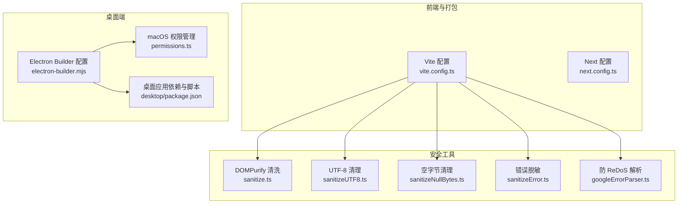
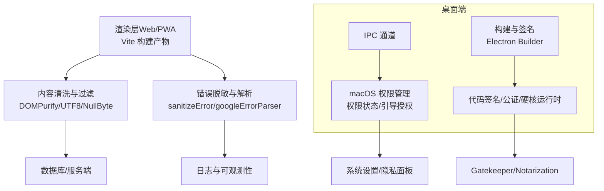
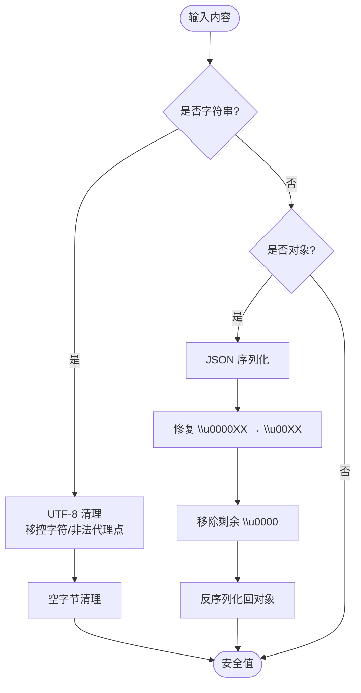
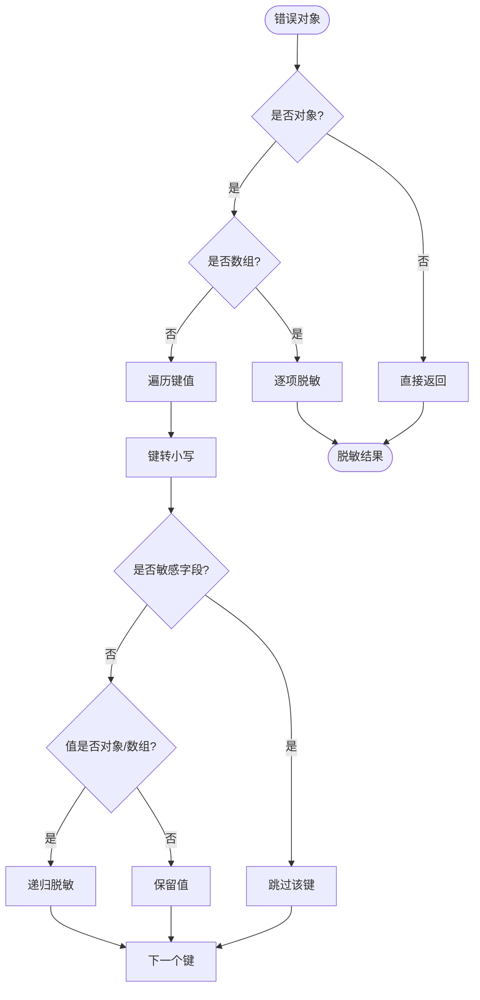
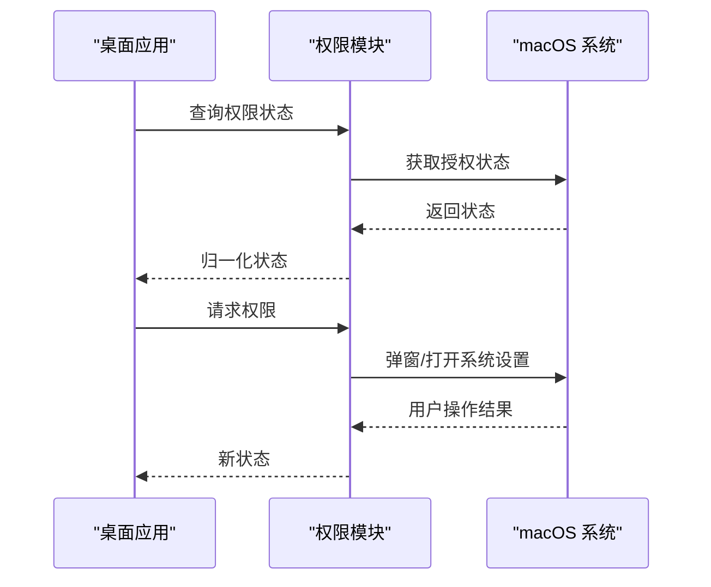
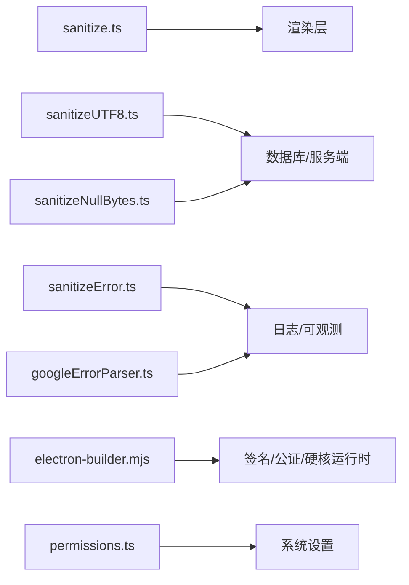

# 应用安全防护

<cite>
**本文引用的文件**
- [apps/desktop/src/main/utils/permissions.ts](file://apps/desktop/src/main/utils/permissions.ts)
- [packages/utils/src/client/sanitize.ts](file://packages/utils/src/client/sanitize.ts)
- [packages/utils/src/sanitizeUTF8.ts](file://packages/utils/src/sanitizeUTF8.ts)
- [packages/utils/src/sanitizeNullBytes.ts](file://packages/utils/src/sanitizeNullBytes.ts)
- [packages/model-runtime/src/utils/sanitizeError.ts](file://packages/model-runtime/src/utils/sanitizeError.ts)
- [packages/model-runtime/src/utils/googleErrorParser.ts](file://packages/model-runtime/src/utils/googleErrorParser.ts)
- [apps/desktop/electron-builder.mjs](file://apps/desktop/electron-builder.mjs)
- [apps/desktop/package.json](file://apps/desktop/package.json)
- [vite.config.ts](file://vite.config.ts)
- [next.config.ts](file://next.config.ts)
- [docs/development/basic/architecture.zh-CN.mdx](file://docs/development/basic/architecture.zh-CN.mdx)
</cite>

## 目录

1. [简介](#简介)
2. [项目结构](#项目结构)
3. [核心组件](#核心组件)
4. [架构总览](#架构总览)
5. [详细组件分析](#详细组件分析)
6. [依赖关系分析](#依赖关系分析)
7. [性能考量](#性能考量)
8. [故障排查指南](#故障排查指南)
9. [结论](#结论)
10. [附录](#附录)

## 简介

本文件面向 LobeHub 前后端与桌面应用的安全防护实践，系统梳理并解释以下方面：

- 前端安全：XSS 防护、CSRF 防护、点击劫持防护、输入验证与过滤（含客户端与服务端）、内容安全策略（CSP）等
- 错误处理与异常管理：敏感信息脱敏、错误页面设计、异常日志记录
- 桌面应用原生安全：macOS 权限控制、代码签名与公证、沙箱与硬核运行时、Entitlements 等
- 最佳实践与常见漏洞预防

## 项目结构

围绕安全主题的关键位置如下：

- 前端与桌面打包配置：Vite 与 Electron Builder
- 前端安全工具：DOMPurify 清洗、UTF-8 / 空字节清理、错误脱敏
- 桌面端权限与签名：macOS 权限管理、代码签名与公证、Entitlements
- 文档与架构说明：安全措施概览

**图表来源**

- [vite.config.ts](file://vite.config.ts#L1-L123)
- [next.config.ts](file://next.config.ts#L1-L27)
- [packages/utils/src/client/sanitize.ts](file://packages/utils/src/client/sanitize.ts#L1-L34)
- [packages/utils/src/sanitizeUTF8.ts](file://packages/utils/src/sanitizeUTF8.ts#L1-L15)
- [packages/utils/src/sanitizeNullBytes.ts](file://packages/utils/src/sanitizeNullBytes.ts#L1-L25)
- [packages/model-runtime/src/utils/sanitizeError.ts](file://packages/model-runtime/src/utils/sanitizeError.ts#L1-L60)
- [packages/model-runtime/src/utils/googleErrorParser.ts](file://packages/model-runtime/src/utils/googleErrorParser.ts#L35-L270)
- [apps/desktop/electron-builder.mjs](file://apps/desktop/electron-builder.mjs#L1-L307)
- [apps/desktop/src/main/utils/permissions.ts](file://apps/desktop/src/main/utils/permissions.ts#L1-L376)
- [apps/desktop/package.json](file://apps/desktop/package.json#L1-L123)

**章节来源**

- [vite.config.ts](file://vite.config.ts#L1-L123)
- [next.config.ts](file://next.config.ts#L1-L27)
- [apps/desktop/electron-builder.mjs](file://apps/desktop/electron-builder.mjs#L1-L307)
- [apps/desktop/src/main/utils/permissions.ts](file://apps/desktop/src/main/utils/permissions.ts#L1-L376)
- [apps/desktop/package.json](file://apps/desktop/package.json#L1-L123)

## 核心组件

- 前端内容清洗与输入过滤
  - DOMPurify 清洗 SVG/HTML，移除事件处理器与危险标签
  - UTF-8 控制字符与非法代理点清理
  - PostgreSQL 入库前空字节与损坏 Unicode 修复
- 错误与异常管理
  - 错误对象敏感字段脱敏
  - 防 ReDoS 的状态码提取逻辑
- 桌面端原生安全
  - macOS 权限状态检查与引导授权
  - 代码签名与公证、硬核运行时、Entitlements
  - 平台特定扩展信息（URL Scheme、使用说明）

**章节来源**

- [packages/utils/src/client/sanitize.ts](file://packages/utils/src/client/sanitize.ts#L1-L34)
- [packages/utils/src/sanitizeUTF8.ts](file://packages/utils/src/sanitizeUTF8.ts#L1-L15)
- [packages/utils/src/sanitizeNullBytes.ts](file://packages/utils/src/sanitizeNullBytes.ts#L1-L25)
- [packages/model-runtime/src/utils/sanitizeError.ts](file://packages/model-runtime/src/utils/sanitizeError.ts#L1-L60)
- [packages/model-runtime/src/utils/googleErrorParser.ts](file://packages/model-runtime/src/utils/googleErrorParser.ts#L35-L270)
- [apps/desktop/src/main/utils/permissions.ts](file://apps/desktop/src/main/utils/permissions.ts#L1-L376)
- [apps/desktop/electron-builder.mjs](file://apps/desktop/electron-builder.mjs#L241-L271)

## 架构总览

下图展示前端与桌面端在安全方面的关键交互路径与职责边界。

**图表来源**

- [vite.config.ts](file://vite.config.ts#L64-L103)
- [packages/utils/src/client/sanitize.ts](file://packages/utils/src/client/sanitize.ts#L8-L33)
- [packages/utils/src/sanitizeUTF8.ts](file://packages/utils/src/sanitizeUTF8.ts#L5-L14)
- [packages/utils/src/sanitizeNullBytes.ts](file://packages/utils/src/sanitizeNullBytes.ts#L9-L24)
- [packages/model-runtime/src/utils/sanitizeError.ts](file://packages/model-runtime/src/utils/sanitizeError.ts#L5-L59)
- [packages/model-runtime/src/utils/googleErrorParser.ts](file://packages/model-runtime/src/utils/googleErrorParser.ts#L40-L60)
- [apps/desktop/src/main/utils/permissions.ts](file://apps/desktop/src/main/utils/permissions.ts#L106-L143)
- [apps/desktop/electron-builder.mjs](file://apps/desktop/electron-builder.mjs#L241-L271)

## 详细组件分析

### 前端内容清洗与输入过滤

- DOMPurify 清洗 SVG/HTML
  - 移除事件处理器属性与危险标签，保留安全 SVG 结构
  - 适用于富文本 / 动态 SVG 渲染场景
- UTF-8 清理
  - 移除控制字符、替换字符与未配对代理点，避免数据库与渲染问题
- 空字节清理与 Unicode 修复
  - 在入库前移除空字节，恢复损坏的 Unicode 转义序列，确保 JSONB 存储稳定

**图表来源**

- [packages/utils/src/sanitizeUTF8.ts](file://packages/utils/src/sanitizeUTF8.ts#L5-L14)
- [packages/utils/src/sanitizeNullBytes.ts](file://packages/utils/src/sanitizeNullBytes.ts#L9-L24)

**章节来源**

- [packages/utils/src/client/sanitize.ts](file://packages/utils/src/client/sanitize.ts#L1-L34)
- [packages/utils/src/sanitizeUTF8.ts](file://packages/utils/src/sanitizeUTF8.ts#L1-L15)
- [packages/utils/src/sanitizeNullBytes.ts](file://packages/utils/src/sanitizeNullBytes.ts#L1-L25)

### 错误处理与异常管理

- 错误脱敏
  - 递归扫描错误对象，剔除敏感字段（如 headers、authorization、token、key、secret、password 等），保留安全结构
- 防 ReDoS 的状态码提取
  - 使用字符串遍历替代正则，避免灾难性回溯；快速判断错误消息中的状态码片段

**图表来源**

- [packages/model-runtime/src/utils/sanitizeError.ts](file://packages/model-runtime/src/utils/sanitizeError.ts#L5-L59)
- [packages/model-runtime/src/utils/googleErrorParser.ts](file://packages/model-runtime/src/utils/googleErrorParser.ts#L40-L60)

**章节来源**

- [packages/model-runtime/src/utils/sanitizeError.ts](file://packages/model-runtime/src/utils/sanitizeError.ts#L1-L60)
- [packages/model-runtime/src/utils/googleErrorParser.ts](file://packages/model-runtime/src/utils/googleErrorParser.ts#L35-L270)

### 桌面端原生安全配置（macOS）

- 权限管理
  - 动态加载 macOS 专用模块，按需检查与请求权限（无障碍、麦克风、相机、屏幕录制、全盘访问、输入监控等）
  - 对非 macOS 平台进行降级处理，避免模块加载失败
- 代码签名与公证
  - 根据环境变量决定是否启用签名与公证；未配置证书时禁用自动发现，避免构建失败
  - 启用硬核运行时与 Entitlements 继承，提升沙箱隔离强度
- 扩展信息
  - 注册应用协议 Scheme，设置多类使用说明（隐私与系统设置提示）

**图表来源**

- [apps/desktop/src/main/utils/permissions.ts](file://apps/desktop/src/main/utils/permissions.ts#L106-L143)
- [apps/desktop/src/main/utils/permissions.ts](file://apps/desktop/src/main/utils/permissions.ts#L249-L272)
- [apps/desktop/electron-builder.mjs](file://apps/desktop/electron-builder.mjs#L241-L271)

**章节来源**

- [apps/desktop/src/main/utils/permissions.ts](file://apps/desktop/src/main/utils/permissions.ts#L1-L376)
- [apps/desktop/electron-builder.mjs](file://apps/desktop/electron-builder.mjs#L75-L80)
- [apps/desktop/electron-builder.mjs](file://apps/desktop/electron-builder.mjs#L241-L271)
- [apps/desktop/package.json](file://apps/desktop/package.json#L107-L121)

### 内容安全策略（CSP）与前端安全

- 当前仓库未直接提供 CSP 头部配置文件，但前端构建与 PWA 缓存策略由 Vite 配置管理
- 建议在服务端或边缘层注入 CSP 头部，结合 Vite 的静态资源缓存策略，形成完整的前端安全基线

**章节来源**

- [vite.config.ts](file://vite.config.ts#L64-L103)

### CSRF 防护与 SameSite Cookie

- 文档中明确采用 SameSite Cookie 与 Token 验证作为 CSRF 防护手段
- 建议在服务端严格校验 SameSite 属性与 CSRF Token，并在跨站请求中统一携带

**章节来源**

- [docs/development/basic/architecture.zh-CN.mdx](file://docs/development/basic/architecture.zh-CN.mdx#L131-L138)

### 点击劫持防护

- 建议在服务端设置 X-Frame-Options 或通过 CSP frame-ancestors 限制嵌入
- 前端可通过 meta 或响应头控制 frame-busting 策略

\[本节为通用建议，不直接分析具体文件]

## 依赖关系分析

- 前端安全工具链
  - DOMPurify 用于内容清洗
  - 自研 UTF-8 与空字节清理用于输入净化
  - 错误脱敏与防 ReDoS 解析用于异常安全
- 桌面端安全链路
  - Electron Builder 负责签名、公证、硬核运行时与 Entitlements
  - macOS 权限模块负责权限状态与引导授权

**图表来源**

- [packages/utils/src/client/sanitize.ts](file://packages/utils/src/client/sanitize.ts#L8-L33)
- [packages/utils/src/sanitizeUTF8.ts](file://packages/utils/src/sanitizeUTF8.ts#L5-L14)
- [packages/utils/src/sanitizeNullBytes.ts](file://packages/utils/src/sanitizeNullBytes.ts#L9-L24)
- [packages/model-runtime/src/utils/sanitizeError.ts](file://packages/model-runtime/src/utils/sanitizeError.ts#L5-L59)
- [packages/model-runtime/src/utils/googleErrorParser.ts](file://packages/model-runtime/src/utils/googleErrorParser.ts#L40-L60)
- [apps/desktop/electron-builder.mjs](file://apps/desktop/electron-builder.mjs#L241-L271)
- [apps/desktop/src/main/utils/permissions.ts](file://apps/desktop/src/main/utils/permissions.ts#L106-L143)

**章节来源**

- [packages/utils/src/client/sanitize.ts](file://packages/utils/src/client/sanitize.ts#L1-L34)
- [packages/utils/src/sanitizeUTF8.ts](file://packages/utils/src/sanitizeUTF8.ts#L1-L15)
- [packages/utils/src/sanitizeNullBytes.ts](file://packages/utils/src/sanitizeNullBytes.ts#L1-L25)
- [packages/model-runtime/src/utils/sanitizeError.ts](file://packages/model-runtime/src/utils/sanitizeError.ts#L1-L60)
- [packages/model-runtime/src/utils/googleErrorParser.ts](file://packages/model-runtime/src/utils/googleErrorParser.ts#L35-L270)
- [apps/desktop/electron-builder.mjs](file://apps/desktop/electron-builder.mjs#L1-L307)
- [apps/desktop/src/main/utils/permissions.ts](file://apps/desktop/src/main/utils/permissions.ts#L1-L376)

## 性能考量

- DOMPurify 清洗与字符串遍历清理均具备 O (n) 级复杂度，适合常规前端场景
- 防 ReDoS 的状态码提取避免了正则回溯风险，保证在大输入下的稳定性
- 建议在高频输入场景中结合前端缓存与服务端二次校验，降低重复计算成本

\[本节提供通用指导，不直接分析具体文件]

## 故障排查指南

- macOS 权限相关
  - 若权限模块未生效，确认运行平台为 macOS；非 macOS 将返回 “已授权” 状态
  - 全盘访问无法程序化授予，需引导用户手动开启
- 构建与签名
  - 未配置 Apple 证书时会禁用自动发现，避免构建失败；请按需配置证书或在本地关闭公证
- 错误日志与脱敏
  - 确认错误对象中敏感字段已被剔除；若仍出现异常，检查脱敏规则覆盖范围
- 输入异常
  - 若出现数据库插入失败或乱码，检查 UTF-8 与空字节清理流程是否正确执行

**章节来源**

- [apps/desktop/src/main/utils/permissions.ts](file://apps/desktop/src/main/utils/permissions.ts#L49-L51)
- [apps/desktop/src/main/utils/permissions.ts](file://apps/desktop/src/main/utils/permissions.ts#L287-L296)
- [apps/desktop/electron-builder.mjs](file://apps/desktop/electron-builder.mjs#L75-L80)
- [packages/model-runtime/src/utils/sanitizeError.ts](file://packages/model-runtime/src/utils/sanitizeError.ts#L18-L36)

## 结论

LobeHub 在前端与桌面端已建立较为完善的安全基线：

- 前端侧通过 DOMPurify、UTF-8 / 空字节清理与错误脱敏，有效降低 XSS、数据污染与敏感信息泄露风险
- 桌面端通过 macOS 权限管理与代码签名 / 公证、硬核运行时、Entitlements，强化原生平台安全
- 文档明确了 CSRF、CSP、SSRF、SQL 注入等安全要点，建议在服务端与边缘层落地

建议持续补充：

- 在服务端 / 边缘层注入 CSP 头部
- 明确错误页面与异常日志的最小暴露原则
- 对第三方依赖进行定期安全审计与升级

\[本节为总结性内容，不直接分析具体文件]

## 附录

- 安全配置最佳实践清单
  - 前端
    - 对所有用户可控输入进行 DOMPurify 清洗与长度 / 类型校验
    - 使用 CSP 限制脚本来源与内联脚本
    - 对富媒体（SVG / 图片）渲染前执行内容净化
  - 服务端
    - 参数化查询防止 SQL 注入
    - 严格的 SameSite Cookie 与 CSRF Token 校验
    - SSRF 白名单与出站请求限制
  - 桌面端
    - 仅在必要时请求敏感权限，并提供清晰的使用说明
    - 启用代码签名与公证，开启硬核运行时与最小权限 Entitlements
    - 对全盘访问等高危权限进行二次确认与降级处理

\[本节为通用建议，不直接分析具体文件]
