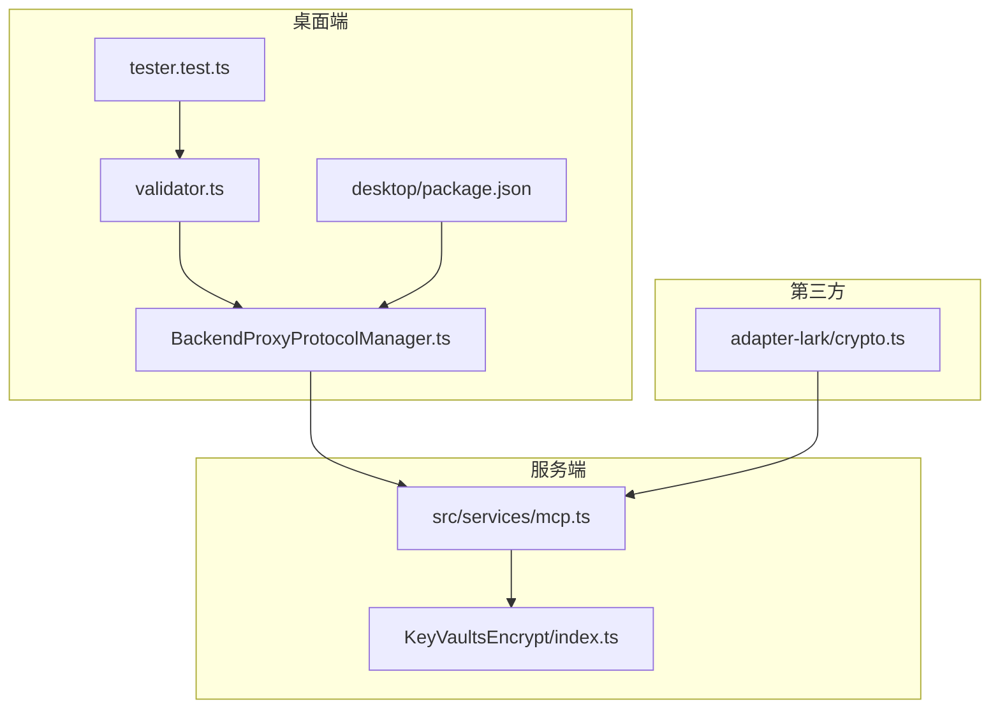
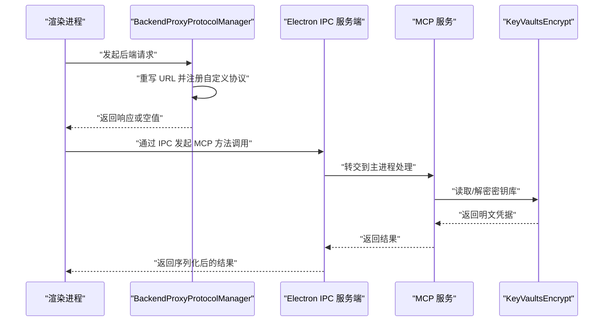
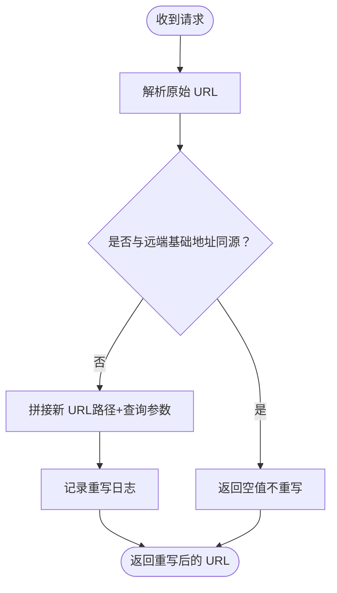
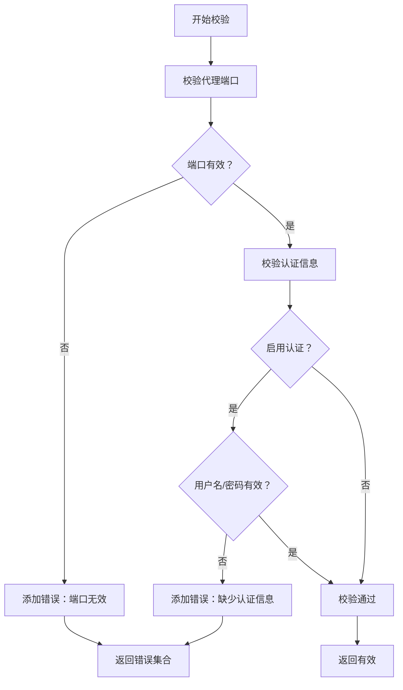
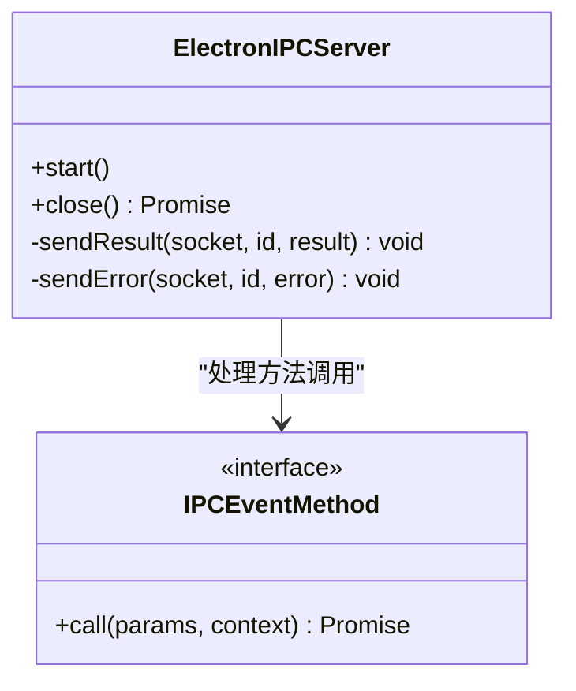
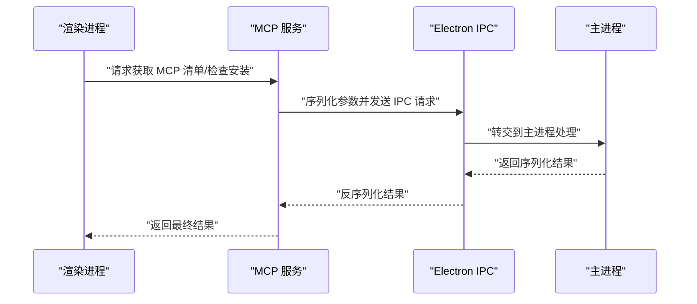
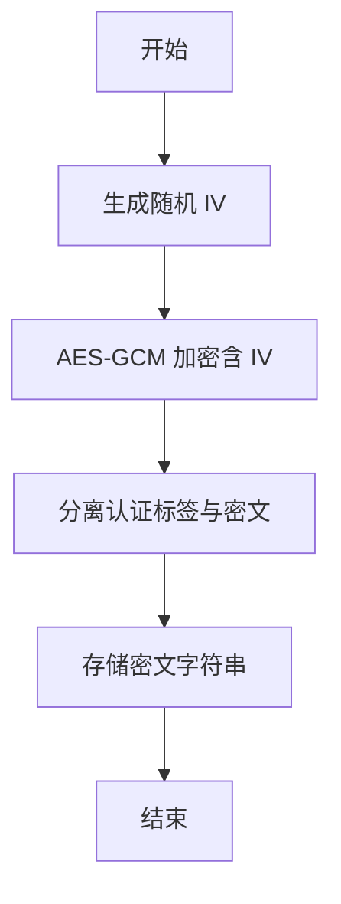
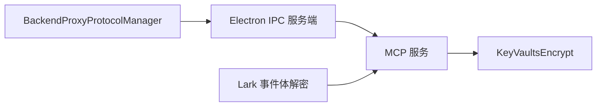

# 传输层加密

<cite>
**本文引用的文件**
- [apps/desktop/package.json](file://apps/desktop/package.json)
- [apps/desktop/src/main/core/infrastructure/BackendProxyProtocolManager.ts](file://apps/desktop/src/main/core/infrastructure/BackendProxyProtocolManager.ts)
- [apps/desktop/src/main/modules/networkProxy/validator.ts](file://apps/desktop/src/main/modules/networkProxy/validator.ts)
- [apps/desktop/src/main/modules/networkProxy/__tests__/tester.test.ts](file://apps/desktop/src/main/modules/networkProxy/__tests__/tester.test.ts)
- [src/services/mcp.ts](file://src/services/mcp.ts)
- [packages/electron-server-ipc/src/ipcServer.ts](file://packages/electron-server-ipc/src/ipcServer.ts)
- [packages/electron-server-ipc/src/types/index.ts](file://packages/electron-server-ipc/src/types/index.ts)
- [.env.example](file://.env.example)
- [docs/self-hosting/faq/proxy-with-unable-to-verify-leaf-signature.mdx](file://docs/self-hosting/faq/proxy-with-unable-to-verify-leaf-signature.mdx)
- [src/server/modules/KeyVaultsEncrypt/index.ts](file://src/server/modules/KeyVaultsEncrypt/index.ts)
- [src/server/modules/KeyVaultsEncrypt/index.test.ts](file://src/server/modules/KeyVaultsEncrypt/index.test.ts)
- [packages/adapter-lark/src/crypto.ts](file://packages/adapter-lark/src/crypto.ts)
</cite>

## 目录
1. [简介](#简介)
2. [项目结构](#项目结构)
3. [核心组件](#核心组件)
4. [架构总览](#架构总览)
5. [组件详解](#组件详解)
6. [依赖关系分析](#依赖关系分析)
7. [性能考量](#性能考量)
8. [故障排查指南](#故障排查指南)
9. [结论](#结论)
10. [附录](#附录)

## 简介
本文件聚焦于 LobeHub 项目的传输层加密（TLS/SSL）与安全通信实践，覆盖以下方面：
- HTTPS 证书配置与证书链验证、OCSP Stapling 的可实施性评估
- API 网关侧的加密通信：上游服务连接加密、反向代理 SSL 终止、负载均衡器 TLS 配置建议
- 桌面应用的网络通信加密：Electron 应用的 HTTPS 请求、MCP 协议的安全传输、IPC 通信的加密保护
- 证书自动续期、监控告警与错误处理的运维建议
- 加密套件与协议版本选择、性能优化要点

说明：仓库中未发现显式的 OCSP Stapling 实现或 Nginx/TLS 负载均衡器配置文件；本文件在“实现现状”部分基于现有代码进行陈述，在“最佳实践”部分提供可落地的建议。

## 项目结构
围绕传输层加密的关键目录与文件：
- 桌面端网络代理与后端协议重写：apps/desktop/src/main/core/infrastructure/BackendProxyProtocolManager.ts
- 桌面端网络代理校验与测试：apps/desktop/src/main/modules/networkProxy/validator.ts、tester.test.ts
- 桌面端应用依赖清单（含代理与 HTTPS 相关库）：apps/desktop/package.json
- MCP 客户端服务：src/services/mcp.ts
- Electron IPC 服务端：packages/electron-server-ipc/src/ipcServer.ts、types/index.ts
- 环境变量示例（包含安全相关开关）：.env.example
- 证书链验证问题排障文档：docs/self-hosting/faq/proxy-with-unable-to-verify-leaf-signature.mdx
- 服务器侧密钥库加解密模块：src/server/modules/KeyVaultsEncrypt/index.ts、index.test.ts
- 第三方平台事件体解密工具（AES-256-CBC）：packages/adapter-lark/src/crypto.ts

图表来源
- [apps/desktop/src/main/core/infrastructure/BackendProxyProtocolManager.ts](file://apps/desktop/src/main/core/infrastructure/BackendProxyProtocolManager.ts#L78-L114)
- [apps/desktop/src/main/modules/networkProxy/validator.ts](file://apps/desktop/src/main/modules/networkProxy/validator.ts#L43-L80)
- [apps/desktop/src/main/modules/networkProxy/__tests__/tester.test.ts](file://apps/desktop/src/main/modules/networkProxy/__tests__/tester.test.ts#L512-L531)
- [apps/desktop/package.json](file://apps/desktop/package.json#L43-L106)
- [src/services/mcp.ts](file://src/services/mcp.ts#L227-L273)
- [src/server/modules/KeyVaultsEncrypt/index.ts](file://src/server/modules/KeyVaultsEncrypt/index.ts#L44-L89)
- [packages/adapter-lark/src/crypto.ts](file://packages/adapter-lark/src/crypto.ts#L1-L16)

章节来源
- [apps/desktop/src/main/core/infrastructure/BackendProxyProtocolManager.ts](file://apps/desktop/src/main/core/infrastructure/BackendProxyProtocolManager.ts#L78-L114)
- [apps/desktop/src/main/modules/networkProxy/validator.ts](file://apps/desktop/src/main/modules/networkProxy/validator.ts#L43-L80)
- [apps/desktop/src/main/modules/networkProxy/__tests__/tester.test.ts](file://apps/desktop/src/main/modules/networkProxy/__tests__/tester.test.ts#L512-L531)
- [apps/desktop/package.json](file://apps/desktop/package.json#L43-L106)
- [src/services/mcp.ts](file://src/services/mcp.ts#L227-L273)
- [src/server/modules/KeyVaultsEncrypt/index.ts](file://src/server/modules/KeyVaultsEncrypt/index.ts#L44-L89)
- [packages/adapter-lark/src/crypto.ts](file://packages/adapter-lark/src/crypto.ts#L1-L16)

## 核心组件
- 桌面端后端代理与协议重写：负责将渲染进程请求重写并转发至后端，支持自定义 scheme 注册与 URL 重写逻辑。
- 网络代理校验与连通性测试：对代理主机、端口、认证信息进行格式与范围校验，并提供代理连通性测试。
- Electron IPC 服务端：通过本地套接字提供方法调用通道，用于桌面端主进程与渲染进程之间的安全通信。
- MCP 客户端服务：封装 MCP 插件的安装检查与清单获取，使用 IPC 将敏感操作移交主进程执行。
- 服务器侧密钥库加解密：对用户私密凭据进行对称加密存储与解密，保障凭据在存储与传输中的机密性。
- 第三方平台事件体解密：针对特定平台事件体采用对称加密算法进行解密，确保数据在传输过程中的完整性与机密性。

章节来源
- [apps/desktop/src/main/core/infrastructure/BackendProxyProtocolManager.ts](file://apps/desktop/src/main/core/infrastructure/BackendProxyProtocolManager.ts#L78-L114)
- [apps/desktop/src/main/modules/networkProxy/validator.ts](file://apps/desktop/src/main/modules/networkProxy/validator.ts#L43-L80)
- [apps/desktop/src/main/modules/networkProxy/__tests__/tester.test.ts](file://apps/desktop/src/main/modules/networkProxy/__tests__/tester.test.ts#L512-L531)
- [packages/electron-server-ipc/src/ipcServer.ts](file://packages/electron-server-ipc/src/ipcServer.ts#L121-L160)
- [src/services/mcp.ts](file://src/services/mcp.ts#L227-L273)
- [src/server/modules/KeyVaultsEncrypt/index.ts](file://src/server/modules/KeyVaultsEncrypt/index.ts#L44-L89)
- [packages/adapter-lark/src/crypto.ts](file://packages/adapter-lark/src/crypto.ts#L1-L16)

## 架构总览
下图展示桌面端网络代理、IPC 与 MCP 服务的整体交互路径，以及与服务器侧密钥库的关系。

图表来源
- [apps/desktop/src/main/core/infrastructure/BackendProxyProtocolManager.ts](file://apps/desktop/src/main/core/infrastructure/BackendProxyProtocolManager.ts#L78-L114)
- [packages/electron-server-ipc/src/ipcServer.ts](file://packages/electron-server-ipc/src/ipcServer.ts#L121-L160)
- [src/services/mcp.ts](file://src/services/mcp.ts#L227-L273)
- [src/server/modules/KeyVaultsEncrypt/index.ts](file://src/server/modules/KeyVaultsEncrypt/index.ts#L44-L89)

## 组件详解

### 桌面端网络代理与协议重写
- 功能要点
  - 注册自定义协议处理器，拦截指定 scheme 的请求。
  - 对请求 URL 进行重写，将相对路径拼接到远端基础地址上。
  - 记录重写日志，便于调试与审计。
- 安全影响
  - 通过统一的协议重写与日志记录，有助于识别异常流量与潜在中间人攻击。
  - 代理配置需配合严格的校验与测试，避免将内部地址暴露给外部网络。

图表来源
- [apps/desktop/src/main/core/infrastructure/BackendProxyProtocolManager.ts](file://apps/desktop/src/main/core/infrastructure/BackendProxyProtocolManager.ts#L78-L114)

章节来源
- [apps/desktop/src/main/core/infrastructure/BackendProxyProtocolManager.ts](file://apps/desktop/src/main/core/infrastructure/BackendProxyProtocolManager.ts#L78-L114)

### 网络代理校验与连通性测试
- 校验规则
  - 代理端口必填，且在 1~65535 范围内。
  - 当启用认证时，用户名与密码必填。
  - 主机格式支持 IP 与域名正则校验。
- 连通性测试
  - 提供代理配置测试函数，对无 destroy 方法的代理对象也能优雅处理。
- 安全影响
  - 严格的输入校验可降低因错误配置导致的明文泄露风险。
  - 测试用例覆盖了多种边界情况，提升配置可靠性。

图表来源
- [apps/desktop/src/main/modules/networkProxy/validator.ts](file://apps/desktop/src/main/modules/networkProxy/validator.ts#L43-L80)

章节来源
- [apps/desktop/src/main/modules/networkProxy/validator.ts](file://apps/desktop/src/main/modules/networkProxy/validator.ts#L43-L80)
- [apps/desktop/src/main/modules/networkProxy/__tests__/tester.test.ts](file://apps/desktop/src/main/modules/networkProxy/__tests__/tester.test.ts#L512-L531)

### Electron IPC 服务端与方法调用
- 功能要点
  - 基于 TCP 套接字的 IPC 服务端，接收 JSON 消息并按行分隔。
  - 支持成功与错误响应的统一格式，便于前端解析。
  - 在非 Windows 平台清理本地套接字文件，避免残留。
- 安全影响
  - 本地 IPC 通道默认仅限本机访问，具备天然的边界隔离优势。
  - 建议结合进程权限控制与最小权限原则，限制 IPC 接口暴露的方法集。

图表来源
- [packages/electron-server-ipc/src/ipcServer.ts](file://packages/electron-server-ipc/src/ipcServer.ts#L121-L160)
- [packages/electron-server-ipc/src/types/index.ts](file://packages/electron-server-ipc/src/types/index.ts#L1-L10)

章节来源
- [packages/electron-server-ipc/src/ipcServer.ts](file://packages/electron-server-ipc/src/ipcServer.ts#L121-L160)
- [packages/electron-server-ipc/src/types/index.ts](file://packages/electron-server-ipc/src/types/index.ts#L1-L10)

### MCP 客户端服务与 IPC 集成
- 功能要点
  - 通过 IPC 将 MCP 清单获取与安装检查委托给主进程执行，避免在渲染进程中直接暴露敏感参数。
  - 使用序列化/反序列化工具传递复杂参数，保证跨进程数据一致性。
- 安全影响
  - 将敏感操作移出渲染进程，降低凭据泄露风险。
  - 结合 IPC 服务端的错误处理与日志记录，便于追踪异常。

图表来源
- [src/services/mcp.ts](file://src/services/mcp.ts#L227-L273)
- [packages/electron-server-ipc/src/ipcServer.ts](file://packages/electron-server-ipc/src/ipcServer.ts#L121-L160)

章节来源
- [src/services/mcp.ts](file://src/services/mcp.ts#L227-L273)

### 服务器侧密钥库加解密
- 功能要点
  - 使用对称加密（AES-GCM）对用户私密凭据进行加密与解密。
  - 生成随机初始化向量（IV），分离认证标签与密文，形成可逆的密文格式。
- 安全影响
  - 采用标准 AEAD 算法，提供机密性与完整性保护。
  - 密钥长度需满足要求，避免弱密钥导致的安全隐患。

图表来源
- [src/server/modules/KeyVaultsEncrypt/index.ts](file://src/server/modules/KeyVaultsEncrypt/index.ts#L44-L89)

章节来源
- [src/server/modules/KeyVaultsEncrypt/index.ts](file://src/server/modules/KeyVaultsEncrypt/index.ts#L44-L89)
- [src/server/modules/KeyVaultsEncrypt/index.test.ts](file://src/server/modules/KeyVaultsEncrypt/index.test.ts#L36-L71)

### 第三方平台事件体解密（AES-256-CBC）
- 功能要点
  - 基于 SHA-256 派生密钥，使用 AES-256-CBC 解密事件体。
- 安全影响
  - 采用标准对称加密算法，确保事件体在传输过程中的机密性。
  - 注意填充与 IV 处理的一致性，避免解密失败或安全漏洞。

章节来源
- [packages/adapter-lark/src/crypto.ts](file://packages/adapter-lark/src/crypto.ts#L1-L16)

## 依赖关系分析
- 桌面端网络代理依赖 Electron Session 的 protocol.handle 机制，通过自定义 scheme 重写请求。
- Electron IPC 服务端依赖 Node.js net 模块与文件系统，用于本地套接字与文件清理。
- MCP 服务通过 IPC 将敏感操作移交主进程，减少渲染进程中的敏感上下文暴露。
- 服务器侧密钥库模块为 MCP 与其它服务提供凭据解密能力，确保凭据在存储与传输中的机密性。

图表来源
- [apps/desktop/src/main/core/infrastructure/BackendProxyProtocolManager.ts](file://apps/desktop/src/main/core/infrastructure/BackendProxyProtocolManager.ts#L78-L114)
- [packages/electron-server-ipc/src/ipcServer.ts](file://packages/electron-server-ipc/src/ipcServer.ts#L121-L160)
- [src/services/mcp.ts](file://src/services/mcp.ts#L227-L273)
- [src/server/modules/KeyVaultsEncrypt/index.ts](file://src/server/modules/KeyVaultsEncrypt/index.ts#L44-L89)
- [packages/adapter-lark/src/crypto.ts](file://packages/adapter-lark/src/crypto.ts#L1-L16)

章节来源
- [apps/desktop/src/main/core/infrastructure/BackendProxyProtocolManager.ts](file://apps/desktop/src/main/core/infrastructure/BackendProxyProtocolManager.ts#L78-L114)
- [packages/electron-server-ipc/src/ipcServer.ts](file://packages/electron-server-ipc/src/ipcServer.ts#L121-L160)
- [src/services/mcp.ts](file://src/services/mcp.ts#L227-L273)
- [src/server/modules/KeyVaultsEncrypt/index.ts](file://src/server/modules/KeyVaultsEncrypt/index.ts#L44-L89)
- [packages/adapter-lark/src/crypto.ts](file://packages/adapter-lark/src/crypto.ts#L1-L16)

## 性能考量
- 代理与 IPC
  - 代理重写与日志记录应避免高频写入，建议在调试模式开启日志，生产环境关闭或降级。
  - IPC 消息按行分隔，建议批量合并小消息以减少握手开销。
- 加密与解密
  - AES-GCM 与 CBC 解密均为 CPU 密集型操作，建议在主进程执行并缓存必要状态，避免重复计算。
  - 对称密钥长度与随机数生成应使用系统安全熵源，避免阻塞与抖动。
- 网络栈
  - Electron 中的代理库与 HTTPS 代理库已内置连接池与复用策略，建议保持默认配置以获得最佳性能。

章节来源
- [apps/desktop/package.json](file://apps/desktop/package.json#L83-L101)
- [src/server/modules/KeyVaultsEncrypt/index.ts](file://src/server/modules/KeyVaultsEncrypt/index.ts#L44-L89)
- [packages/adapter-lark/src/crypto.ts](file://packages/adapter-lark/src/crypto.ts#L1-L16)

## 故障排查指南
- 证书链验证失败（UNABLE_TO_VERIFY_LEAF_SIGNATURE）
  - 现象：使用代理（如自签名证书）时出现证书验证错误。
  - 临时规避：通过环境变量禁用证书校验（不推荐长期使用）。
  - 更安全方案：正确安装中间证书、替换为受信 CA 签发的证书、在代码中正确配置证书链。
- 代理配置错误
  - 端口不在有效范围、认证信息缺失会导致校验失败。
  - 建议：使用连通性测试函数验证代理可用性，逐步缩小问题范围。
- IPC 通信异常
  - 检查套接字文件是否存在与权限，非 Windows 平台需清理残留文件。
  - 关注错误响应格式，结合日志定位具体方法与参数问题。

章节来源
- [docs/self-hosting/faq/proxy-with-unable-to-verify-leaf-signature.mdx](file://docs/self-hosting/faq/proxy-with-unable-to-verify-leaf-signature.mdx#L16-L84)
- [apps/desktop/src/main/modules/networkProxy/validator.ts](file://apps/desktop/src/main/modules/networkProxy/validator.ts#L43-L80)
- [apps/desktop/src/main/modules/networkProxy/__tests__/tester.test.ts](file://apps/desktop/src/main/modules/networkProxy/__tests__/tester.test.ts#L512-L531)
- [packages/electron-server-ipc/src/ipcServer.ts](file://packages/electron-server-ipc/src/ipcServer.ts#L144-L160)

## 结论
- 仓库中未发现显式的 TLS/SSL 配置文件与 OCSP Stapling 实现，但通过 Electron 代理、IPC 与服务器侧对称加密等机制，已在多处实现了传输与存储层面的安全加固。
- 建议在部署层补充完善的证书管理与监控告警体系，并在桌面端与服务端持续强化密钥轮换与最小权限原则。

## 附录

### 环境变量与安全相关配置
- 安全相关开关与示例：参考环境变量示例文件中的安全与 CSP 设置项，确保生产环境启用必要的安全头与防护策略。

章节来源
- [.env.example](file://.env.example#L1-L411)