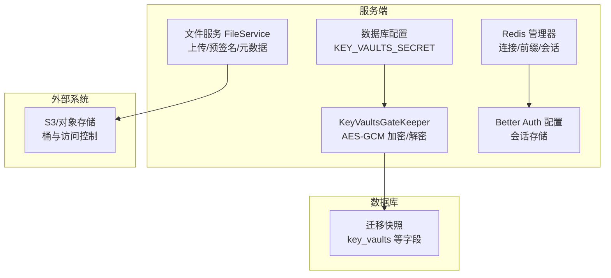
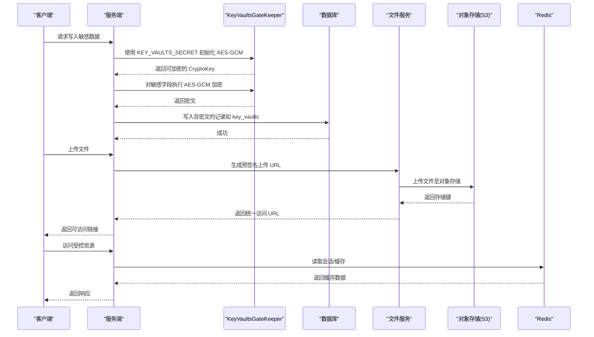
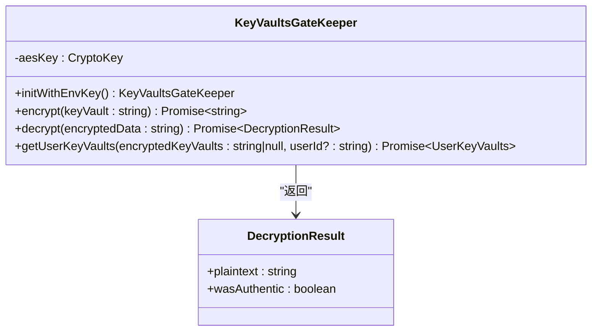
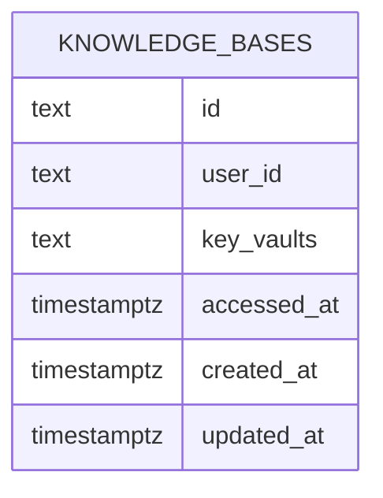
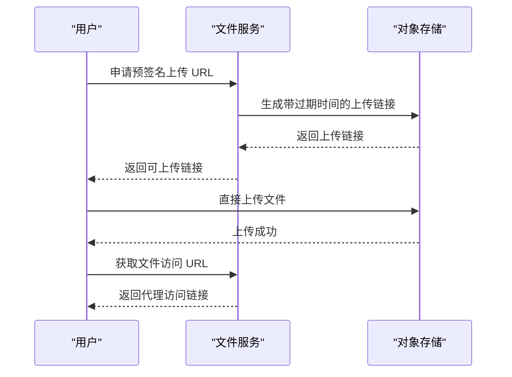
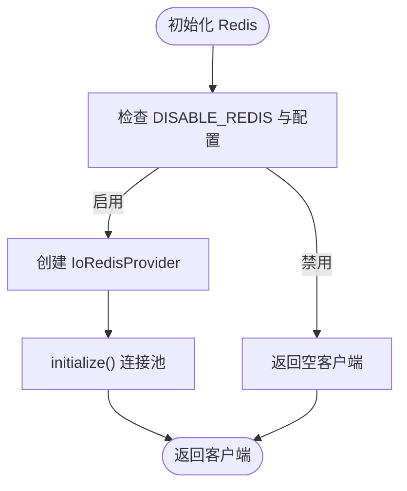
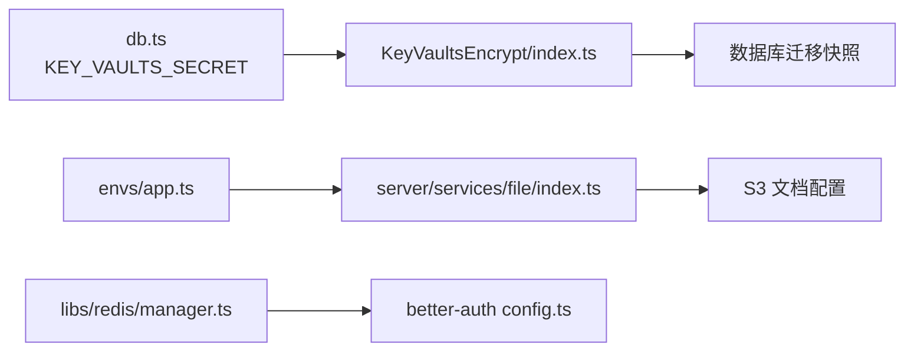

# 存储加密

<cite>
**本文引用的文件**
- [src/server/modules/KeyVaultsEncrypt/index.ts](file://src/server/modules/KeyVaultsEncrypt/index.ts)
- [src/config/db.ts](file://src/config/db.ts)
- [packages/database/migrations/meta/0086_snapshot.json](file://packages/database/migrations/meta/0086_snapshot.json)
- [src/server/services/file/index.ts](file://src/server/services/file/index.ts)
- [docs/self-hosting/advanced/s3.mdx](file://docs/self-hosting/advanced/s3.mdx)
- [docs/self-hosting/advanced/redis.mdx](file://docs/self-hosting/advanced/redis.mdx)
- [src/libs/redis/manager.ts](file://src/libs/redis/manager.ts)
- [src/libs/better-auth/utils/config.ts](file://src/libs/better-auth/utils/config.ts)
- [packages/utils/src/server/apiKeyHash.ts](file://packages/utils/src/server/apiKeyHash.ts)
- [src/envs/app.ts](file://src/envs/app.ts)
</cite>

## 目录

1. [简介](#简介)
2. [项目结构](#项目结构)
3. [核心组件](#核心组件)
4. [架构总览](#架构总览)
5. [详细组件分析](#详细组件分析)
6. [依赖关系分析](#依赖关系分析)
7. [性能考量](#性能考量)
8. [故障排查指南](#故障排查指南)
9. [结论](#结论)
10. [附录](#附录)

## 简介

本文件系统性梳理 LobeHub 的 “存储加密” 实现与最佳实践，覆盖以下方面：

- 数据库字段级加密：敏感字段加密、加密索引设计、查询性能优化
- 文件存储加密策略：上传文件加密、存储桶加密、文件访问控制
- 缓存数据保护：Redis 加密、内存数据保护、会话数据加密
- 业务数据保护：知识库内容加密、用户数据脱敏、审计日志加密
- 技术选型与密钥管理：加密算法选择、密钥管理、性能影响评估

## 项目结构

围绕 “存储加密” 的关键代码与配置分布如下：

- 密钥与加密门卫：服务端密钥加载与 AES-GCM 加解密逻辑
- 数据库迁移快照：包含 key_vaults 等敏感字段定义
- 文件服务：统一的文件上传、元数据校验、预签名 URL 生成与访问
- 缓存与会话：Redis 管理器、Better Auth 集成、会话存储
- S3 / 对象存储：部署文档中的环境变量与访问控制说明
- 应用与环境：应用 URL、内部 URL、可信客户端密钥等

**图表来源**

- [src/server/modules/KeyVaultsEncrypt/index.ts](file://src/server/modules/KeyVaultsEncrypt/index.ts#L1-L126)
- [src/config/db.ts](file://src/config/db.ts#L1-L28)
- [packages/database/migrations/meta/0086_snapshot.json](file://packages/database/migrations/meta/0086_snapshot.json#L1338-L1343)
- [src/server/services/file/index.ts](file://src/server/services/file/index.ts#L1-L361)
- [docs/self-hosting/advanced/s3.mdx](file://docs/self-hosting/advanced/s3.mdx#L29-L55)
- [docs/self-hosting/advanced/redis.mdx](file://docs/self-hosting/advanced/redis.mdx#L1-L130)
- [src/libs/redis/manager.ts](file://src/libs/redis/manager.ts#L1-L142)
- [src/libs/better-auth/utils/config.ts](file://src/libs/better-auth/utils/config.ts#L88-L110)

**章节来源**

- [src/server/modules/KeyVaultsEncrypt/index.ts](file://src/server/modules/KeyVaultsEncrypt/index.ts#L1-L126)
- [src/config/db.ts](file://src/config/db.ts#L1-L28)
- [packages/database/migrations/meta/0086_snapshot.json](file://packages/database/migrations/meta/0086_snapshot.json#L1338-L1343)
- [src/server/services/file/index.ts](file://src/server/services/file/index.ts#L1-L361)
- [docs/self-hosting/advanced/s3.mdx](file://docs/self-hosting/advanced/s3.mdx#L29-L55)
- [docs/self-hosting/advanced/redis.mdx](file://docs/self-hosting/advanced/redis.mdx#L1-L130)
- [src/libs/redis/manager.ts](file://src/libs/redis/manager.ts#L1-L142)
- [src/libs/better-auth/utils/config.ts](file://src/libs/better-auth/utils/config.ts#L88-L110)

## 核心组件

- KeyVaultsGateKeeper：基于 WebCrypto 的 AES-GCM 实现，负责用户私有数据（如密钥库）的加解密与认证
- 数据库配置：集中读取 KEY_VAULTS_SECRET 并进行长度校验
- 文件服务：统一封装上传、预签名 URL、元数据校验与下载流程
- Redis 管理器：提供单例 / 前缀化客户端，支持会话与缓存场景
- Better Auth：通过 Redis 提供会话存储与令牌管理
- S3 / 对象存储：通过环境变量配置端点、桶名、ACL、路径风格等

**章节来源**

- [src/server/modules/KeyVaultsEncrypt/index.ts](file://src/server/modules/KeyVaultsEncrypt/index.ts#L1-L126)
- [src/config/db.ts](file://src/config/db.ts#L1-L28)
- [src/server/services/file/index.ts](file://src/server/services/file/index.ts#L1-L361)
- [src/libs/redis/manager.ts](file://src/libs/redis/manager.ts#L1-L142)
- [src/libs/better-auth/utils/config.ts](file://src/libs/better-auth/utils/config.ts#L88-L110)
- [docs/self-hosting/advanced/s3.mdx](file://docs/self-hosting/advanced/s3.mdx#L29-L55)

## 架构总览

下图展示 “存储加密” 的端到端流程：从密钥加载、数据加密入库、文件上传与访问控制，到缓存与会话保护。

**图表来源**

- [src/server/modules/KeyVaultsEncrypt/index.ts](file://src/server/modules/KeyVaultsEncrypt/index.ts#L16-L42)
- [src/config/db.ts](file://src/config/db.ts#L11-L20)
- [src/server/services/file/index.ts](file://src/server/services/file/index.ts#L62-L81)
- [docs/self-hosting/advanced/s3.mdx](file://docs/self-hosting/advanced/s3.mdx#L29-L55)
- [src/libs/redis/manager.ts](file://src/libs/redis/manager.ts#L21-L43)

## 详细组件分析

### 数据库字段级加密（KeyVaultsGateKeeper）

- 密钥来源：从服务器环境变量加载 KEY_VAULTS_SECRET，并进行长度校验（16/24/32 字节）
- 加密算法：AES-GCM，使用 12 字节随机 IV；认证标签与密文拼接存储
- 解密流程：解析分段数据，组合密文与认证标签后解密；异常时返回非认证结果
- 用户密钥库解析：对已加密的用户密钥库字符串进行解密与 JSON 解析

**图表来源**

- [src/server/modules/KeyVaultsEncrypt/index.ts](file://src/server/modules/KeyVaultsEncrypt/index.ts#L9-L125)

**章节来源**

- [src/server/modules/KeyVaultsEncrypt/index.ts](file://src/server/modules/KeyVaultsEncrypt/index.ts#L1-L126)
- [src/config/db.ts](file://src/config/db.ts#L11-L20)

### 数据库迁移与敏感字段（key_vaults）

- 迁移快照中包含 key_vaults 字段，类型为 text，用于存放加密后的用户密钥库
- 建议在该字段上建立合适的索引以支持按用户检索，但需注意索引对密文的影响

**图表来源**

- [packages/database/migrations/meta/0086_snapshot.json](file://packages/database/migrations/meta/0086_snapshot.json#L1338-L1343)

**章节来源**

- [packages/database/migrations/meta/0086_snapshot.json](file://packages/database/migrations/meta/0086_snapshot.json#L1338-L1343)

### 文件存储加密策略

- 上传流程：生成预签名上传 URL，将文件直接上传至对象存储（S3 兼容）
- 访问控制：通过预签名 URL 控制访问时长；部署文档建议合理设置 ACL 与路径风格
- 客户端访问：统一代理 URL（APP_URL/f/:id），便于后续接入鉴权与审计

**图表来源**

- [src/server/services/file/index.ts](file://src/server/services/file/index.ts#L62-L81)
- [docs/self-hosting/advanced/s3.mdx](file://docs/self-hosting/advanced/s3.mdx#L29-L55)
- [src/envs/app.ts](file://src/envs/app.ts#L106-L108)

**章节来源**

- [src/server/services/file/index.ts](file://src/server/services/file/index.ts#L1-L361)
- [docs/self-hosting/advanced/s3.mdx](file://docs/self-hosting/advanced/s3.mdx#L29-L55)
- [src/envs/app.ts](file://src/envs/app.ts#L106-L108)

### 缓存数据保护（Redis 与会话）

- Redis 管理器：支持单例初始化、前缀化客户端、禁用开关；用于会话与缓存
- Better Auth：通过 Redis 存储会话与令牌，提升跨实例共享与验证效率
- 生产建议：启用 TLS、持久化（RDB/AOF）、高可用（Sentinel/Cluster）

**图表来源**

- [src/libs/redis/manager.ts](file://src/libs/redis/manager.ts#L4-L43)
- [docs/self-hosting/advanced/redis.mdx](file://docs/self-hosting/advanced/redis.mdx#L1-L130)

**章节来源**

- [src/libs/redis/manager.ts](file://src/libs/redis/manager.ts#L1-L142)
- [src/libs/better-auth/utils/config.ts](file://src/libs/better-auth/utils/config.ts#L88-L110)
- [docs/self-hosting/advanced/redis.mdx](file://docs/self-hosting/advanced/redis.mdx#L1-L130)

### 知识库内容加密与用户数据脱敏

- 知识库表结构：包含 user_id、settings、accessed_at 等字段，建议对敏感字段采用字段级加密
- 用户数据脱敏：对可识别信息（如邮箱、手机号）在展示层进行脱敏处理；存储层保留加密或匿名化字段
- 审计日志加密：对日志中的敏感字段（如请求体、响应体片段）进行加密或去标识化

\[本节为通用实践说明，不直接分析具体文件，故无 “章节来源”]

### API Key 哈希与密钥派生

- API Key 哈希：基于 HMAC-SHA256，使用 KEY_VAULTS_SECRET 作为密钥源，用于不可逆校验
- 建议：对 API Key 的存储与传输均采用最小权限原则与加密通道

**章节来源**

- [packages/utils/src/server/apiKeyHash.ts](file://packages/utils/src/server/apiKeyHash.ts#L1-L13)
- [src/config/db.ts](file://src/config/db.ts#L11-L20)

## 依赖关系分析

- KeyVaultsGateKeeper 依赖数据库配置模块加载密钥
- 文件服务依赖对象存储实现（S3 兼容），并通过统一 URL 暴露给客户端
- Redis 管理器为 Better Auth 与缓存提供底层连接能力
- 应用环境变量决定对外 URL 与内部 URL，影响文件代理与会话回源

**图表来源**

- [src/config/db.ts](file://src/config/db.ts#L11-L20)
- [src/server/modules/KeyVaultsEncrypt/index.ts](file://src/server/modules/KeyVaultsEncrypt/index.ts#L16-L42)
- [packages/database/migrations/meta/0086_snapshot.json](file://packages/database/migrations/meta/0086_snapshot.json#L1338-L1343)
- [src/server/services/file/index.ts](file://src/server/services/file/index.ts#L1-L361)
- [docs/self-hosting/advanced/s3.mdx](file://docs/self-hosting/advanced/s3.mdx#L29-L55)
- [src/libs/redis/manager.ts](file://src/libs/redis/manager.ts#L1-L142)
- [src/libs/better-auth/utils/config.ts](file://src/libs/better-auth/utils/config.ts#L88-L110)
- [src/envs/app.ts](file://src/envs/app.ts#L106-L108)

**章节来源**

- [src/config/db.ts](file://src/config/db.ts#L1-L28)
- [src/server/modules/KeyVaultsEncrypt/index.ts](file://src/server/modules/KeyVaultsEncrypt/index.ts#L1-L126)
- [src/server/services/file/index.ts](file://src/server/services/file/index.ts#L1-L361)
- [src/libs/redis/manager.ts](file://src/libs/redis/manager.ts#L1-L142)
- [src/libs/better-auth/utils/config.ts](file://src/libs/better-auth/utils/config.ts#L88-L110)
- [src/envs/app.ts](file://src/envs/app.ts#L106-L108)

## 性能考量

- AES-GCM：硬件加速可用时性能优异；IV 长度与认证开销可控
- Redis：内存型缓存，读写延迟低；生产需关注持久化与高可用带来的额外开销
- 对象存储：预签名上传减少服务端中转，降低 CPU 占用；注意网络抖动与重试策略
- 数据库：字段级加密会增加写入与解密成本；建议仅对必要字段加密并配合索引优化

\[本节为通用指导，不直接分析具体文件，故无 “章节来源”]

## 故障排查指南

- 密钥错误
  - 现象：初始化失败或解密返回非认证
  - 排查：确认 KEY_VAULTS_SECRET 是否设置且长度合法；检查环境变量是否被覆盖
- 文件上传失败
  - 现象：预签名 URL 无效或上传报错
  - 排查：核对 S3_ENDPOINT、S3_BUCKET、ACL 设置与路径风格；检查网络连通性
- Redis 不生效
  - 现象：会话丢失或缓存未命中
  - 排查：确认 DISABLE_REDIS 未启用；检查 REDIS_URL、TLS、密码与前缀配置
- API Key 校验失败
  - 现象：哈希不匹配
  - 排查：确认 KEY_VAULTS_SECRET 一致；避免明文泄露与重复计算

**章节来源**

- [src/server/modules/KeyVaultsEncrypt/index.ts](file://src/server/modules/KeyVaultsEncrypt/index.ts#L16-L42)
- [docs/self-hosting/advanced/s3.mdx](file://docs/self-hosting/advanced/s3.mdx#L29-L55)
- [docs/self-hosting/advanced/redis.mdx](file://docs/self-hosting/advanced/redis.mdx#L1-L130)
- [packages/utils/src/server/apiKeyHash.ts](file://packages/utils/src/server/apiKeyHash.ts#L1-L13)

## 结论

LobeHub 在存储加密方面形成了 “密钥集中管理 + 字段级加密 + 外部存储与缓存协同” 的体系：

- 服务端通过 AES-GCM 对用户私有数据进行强加密，密钥由环境变量集中管理
- 文件上传采用预签名直传对象存储，结合统一代理 URL 实现访问控制
- Redis 与 Better Auth 提供高效的会话与缓存能力，建议在生产中开启 TLS 与持久化
- 建议持续完善索引设计、监控告警与密钥轮换流程，确保长期安全与合规

\[本节为总结性内容，不直接分析具体文件，故无 “章节来源”]

## 附录

- 加密算法选择：AES-GCM 适合需要认证的场景；HMAC-SHA256 适合不可逆校验
- 密钥管理：使用环境变量注入，定期轮换；避免硬编码与日志泄露
- 性能评估：建议在测试环境对比加密前后吞吐与延迟，结合业务峰值制定容量规划

\[本节为通用附录，不直接分析具体文件，故无 “章节来源”]
