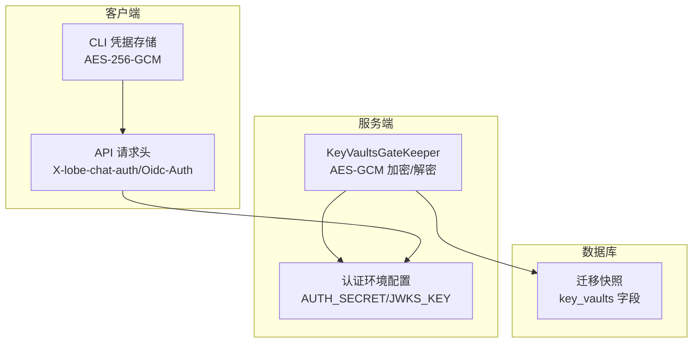
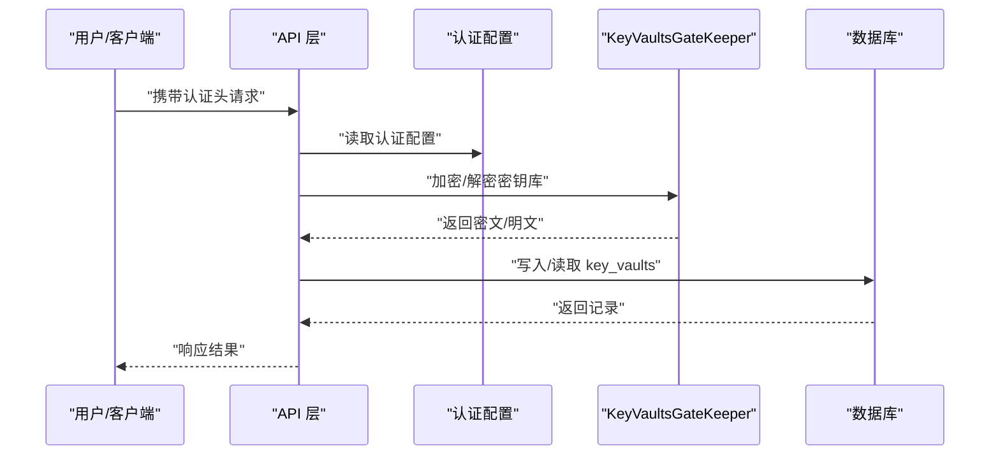
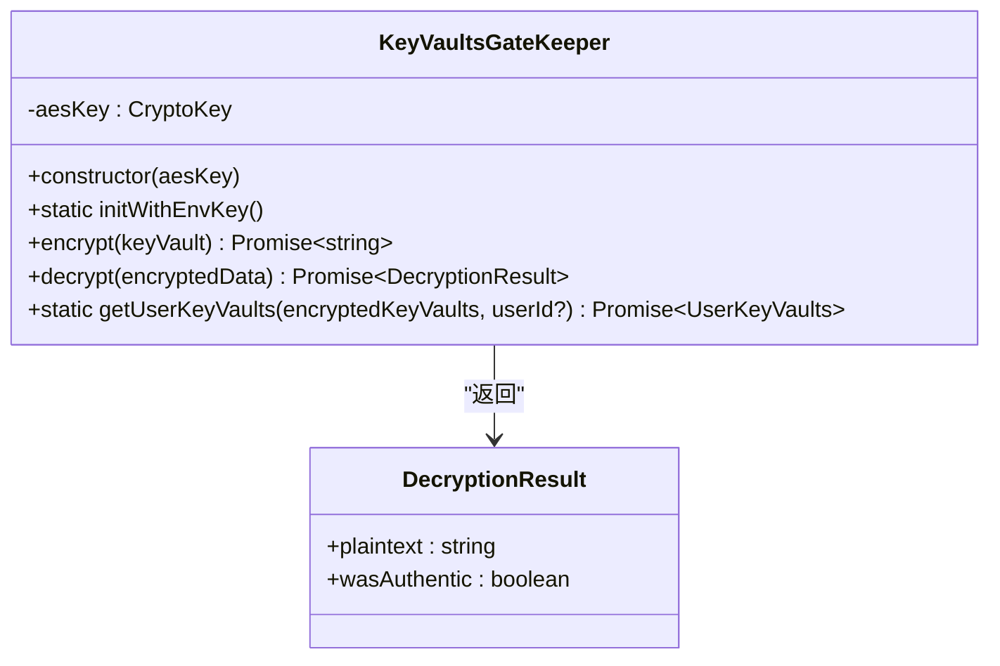
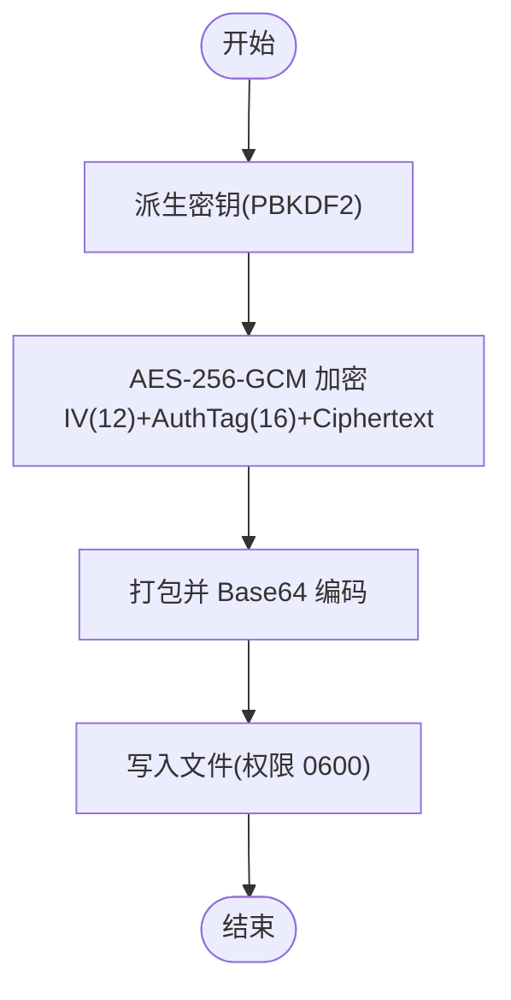
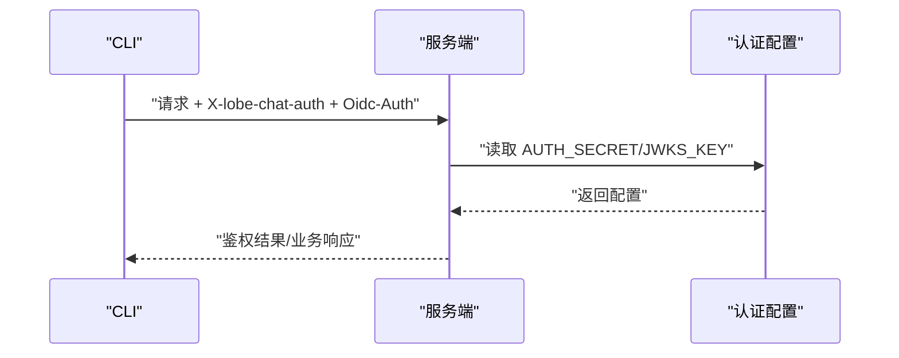
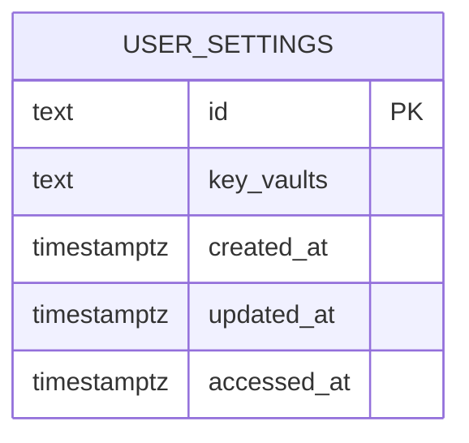
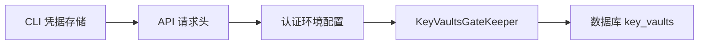

# 密钥管理

<cite>
**本文引用的文件**
- [src/server/modules/KeyVaultsEncrypt/index.ts](file://src/server/modules/KeyVaultsEncrypt/index.ts)
- [src/server/modules/KeyVaultsEncrypt/index.test.ts](file://src/server/modules/KeyVaultsEncrypt/index.test.ts)
- [apps/cli/src/auth/credentials.ts](file://apps/cli/src/auth/credentials.ts)
- [src/envs/auth.ts](file://src/envs/auth.ts)
- [scripts/_shared/checkDeprecatedAuth.js](file://scripts/_shared/checkDeprecatedAuth.js)
- [packages/database/migrations/meta/0086_snapshot.json](file://packages/database/migrations/meta/0086_snapshot.json)
- [packages/database/migrations/meta/0042_snapshot.json](file://packages/database/migrations/meta/0042_snapshot.json)
- [src/store/user/slices/settings/selectors/keyVaults.ts](file://src/store/user/slices/settings/selectors/keyVaults.ts)
- [apps/cli/src/api/http.ts](file://apps/cli/src/api/http.ts)
- [apps/cli/src/api/client.ts](file://apps/cli/src/api/client.ts)
</cite>

## 目录

1. [简介](#简介)
2. [项目结构](#项目结构)
3. [核心组件](#核心组件)
4. [架构总览](#架构总览)
5. [详细组件分析](#详细组件分析)
6. [依赖关系分析](#依赖关系分析)
7. [性能考量](#性能考量)
8. [故障排查指南](#故障排查指南)
9. [结论](#结论)
10. [附录](#附录)

## 简介

本文件系统化梳理 LobeHub 的密钥管理能力，覆盖密钥生成与轮换、存储与访问控制、生命周期管理、备份与灾难恢复、最佳实践与合规建议，并结合仓库中的实现进行深入解析。重点包含以下方面：

- 用户密钥库（Key Vaults）的对称加密与解密流程（AES-GCM）
- 认证与会话头校验机制（Better Auth/JWKS/ 内部 JWT）
- CLI 凭据本地加密存储（AES-256-GCM）
- 数据库中用户密钥库字段与迁移快照
- 过期时间与审计相关字段的设计思路
- 轮换与备份策略、故障转移与恢复建议

## 项目结构

围绕密钥管理的关键目录与文件如下：

- 服务端密钥库门禁：src/server/modules/KeyVaultsEncrypt
- CLI 凭据本地存储：apps/cli/src/auth
- 认证环境配置：src/envs/auth.ts
- 认证环境变量检查脚本：scripts/\_shared/checkDeprecatedAuth.js
- 数据库迁移快照：packages/database/migrations/meta
- 用户密钥库选择器：src/store/user/slices/settings/selectors
- CLI 认证请求头工具：apps/cli/src/api

**图表来源**

- [src/server/modules/KeyVaultsEncrypt/index.ts](file://src/server/modules/KeyVaultsEncrypt/index.ts#L1-L126)
- [src/envs/auth.ts](file://src/envs/auth.ts#L1-L303)
- [apps/cli/src/auth/credentials.ts](file://apps/cli/src/auth/credentials.ts#L1-L77)
- [apps/cli/src/api/http.ts](file://apps/cli/src/api/http.ts#L1-L60)
- [packages/database/migrations/meta/0086_snapshot.json](file://packages/database/migrations/meta/0086_snapshot.json#L1338-L1343)

**章节来源**

- [src/server/modules/KeyVaultsEncrypt/index.ts](file://src/server/modules/KeyVaultsEncrypt/index.ts#L1-L126)
- [apps/cli/src/auth/credentials.ts](file://apps/cli/src/auth/credentials.ts#L1-L77)
- [src/envs/auth.ts](file://src/envs/auth.ts#L1-L303)
- [packages/database/migrations/meta/0086_snapshot.json](file://packages/database/migrations/meta/0086_snapshot.json#L1338-L1343)

## 核心组件

- KeyVaultsGateKeeper：基于 WebCrypto 的对称密钥门禁，负责用户密钥库的加密与解密，支持完整性验证（AEAD）。
- CLI 凭据存储：在本地以 AES-256-GCM 对凭据进行加密存储，使用机器特征派生密钥。
- 认证环境配置：集中定义 Better Auth、JWKS、OIDC 等认证相关环境变量与默认值。
- 数据库迁移：提供 key_vaults 文本字段用于持久化用户密钥库数据。

**章节来源**

- [src/server/modules/KeyVaultsEncrypt/index.ts](file://src/server/modules/KeyVaultsEncrypt/index.ts#L9-L126)
- [apps/cli/src/auth/credentials.ts](file://apps/cli/src/auth/credentials.ts#L15-L42)
- [src/envs/auth.ts](file://src/envs/auth.ts#L107-L294)
- [packages/database/migrations/meta/0086_snapshot.json](file://packages/database/migrations/meta/0086_snapshot.json#L1338-L1343)

## 架构总览

下图展示密钥管理在系统中的交互路径：用户侧通过 CLI 或 Web 客户端发起请求；服务端根据认证配置校验请求头；对用户敏感的密钥库数据采用 AES-GCM 加密后落库或返回；解密时进行完整性校验并返回明文。

**图表来源**

- [apps/cli/src/api/http.ts](file://apps/cli/src/api/http.ts#L5-L47)
- [src/envs/auth.ts](file://src/envs/auth.ts#L107-L294)
- [src/server/modules/KeyVaultsEncrypt/index.ts](file://src/server/modules/KeyVaultsEncrypt/index.ts#L16-L124)
- [packages/database/migrations/meta/0086_snapshot.json](file://packages/database/migrations/meta/0086_snapshot.json#L1338-L1343)

## 详细组件分析

### KeyVaultsGateKeeper 组件

KeyVaultsGateKeeper 是用户密钥库的对称加密门禁，采用 AES-GCM 模式，具备以下特性：

- 初始化：从环境变量加载密钥并导入为 CryptoKey，校验长度（16/24/32 字节）。
- 加密：随机生成 12 字节 IV，使用 subtle.encrypt 输出密文与认证标签，拼接为 “iv:tag:ciphertext” 格式。
- 解密：拆分三段，组合密文与认证标签，subtle.decrypt 成功则返回明文与真实性标记，失败返回空明文与假标记。
- 用户密钥库解析：对已加密的字符串进行解密与 JSON 解析，异常时记录错误并返回空对象。

**图表来源**

- [src/server/modules/KeyVaultsEncrypt/index.ts](file://src/server/modules/KeyVaultsEncrypt/index.ts#L4-L126)

**章节来源**

- [src/server/modules/KeyVaultsEncrypt/index.ts](file://src/server/modules/KeyVaultsEncrypt/index.ts#L16-L124)
- [src/server/modules/KeyVaultsEncrypt/index.test.ts](file://src/server/modules/KeyVaultsEncrypt/index.test.ts#L1-L38)

### CLI 凭据本地存储组件

CLI 在本地以 AES-256-GCM 存储凭据，流程如下：

- 派生密钥：基于主机名与用户名等机器特征，使用 PBKDF2-SHA256 派生固定长度密钥。
- 加密：随机生成 12 字节 IV，生成 16 字节认证标签，打包为 iv+tag+ciphertext 并 base64 编码。
- 解密：从 base64 解码后拆分三段，设置认证标签进行解密。
- 文件权限：凭据目录 0700，文件 0600，避免非所有者读取。

**图表来源**

- [apps/cli/src/auth/credentials.ts](file://apps/cli/src/auth/credentials.ts#L15-L48)

**章节来源**

- [apps/cli/src/auth/credentials.ts](file://apps/cli/src/auth/credentials.ts#L15-L77)

### 认证与请求头校验

- 认证配置：Better Auth 秘钥、JWKS 密钥、OIDC 相关参数、内部 JWT 过期时间等均通过环境变量集中管理。
- 请求头：CLI 与服务端约定头部 X-lobe-chat-auth 与 Oidc-Auth，用于区分不同场景的认证信息。
- 兼容性检查：脚本检测过时的认证环境变量并给出迁移指引。

**图表来源**

- [src/envs/auth.ts](file://src/envs/auth.ts#L107-L294)
- [apps/cli/src/api/http.ts](file://apps/cli/src/api/http.ts#L5-L47)
- [scripts/\_shared/checkDeprecatedAuth.js](file://scripts/_shared/checkDeprecatedAuth.js#L235-L299)

**章节来源**

- [src/envs/auth.ts](file://src/envs/auth.ts#L107-L294)
- [apps/cli/src/api/http.ts](file://apps/cli/src/api/http.ts#L5-L47)
- [apps/cli/src/api/client.ts](file://apps/cli/src/api/client.ts#L1-L30)
- [scripts/\_shared/checkDeprecatedAuth.js](file://scripts/_shared/checkDeprecatedAuth.js#L235-L299)

### 数据库与密钥库字段

- key_vaults 字段：在多个迁移快照中出现，类型为 text，用于存储加密后的用户密钥库。
- 相关字段：created_at/updated_at/accessed_at 等时间戳字段，便于审计与生命周期追踪。
- 设计建议：建议在该字段上增加索引或分区策略以提升查询性能（视业务规模而定）。

**图表来源**

- [packages/database/migrations/meta/0086_snapshot.json](file://packages/database/migrations/meta/0086_snapshot.json#L1338-L1383)
- [packages/database/migrations/meta/0042_snapshot.json](file://packages/database/migrations/meta/0042_snapshot.json#L665-L704)

**章节来源**

- [packages/database/migrations/meta/0086_snapshot.json](file://packages/database/migrations/meta/0086_snapshot.json#L1338-L1383)
- [packages/database/migrations/meta/0042_snapshot.json](file://packages/database/migrations/meta/0042_snapshot.json#L665-L704)

### 用户密钥库选择器

- keyVaultsSettings：从用户设置中提取 keyVaults 映射。
- getVaultByProvider：按提供商获取对应密钥配置。
- 用途：前端展示与编辑用户密钥库时使用。

**章节来源**

- [src/store/user/slices/settings/selectors/keyVaults.ts](file://src/store/user/slices/settings/selectors/keyVaults.ts#L1-L16)

## 依赖关系分析

- KeyVaultsGateKeeper 依赖于环境配置模块提供的密钥材料，并通过 WebCrypto 实现加密 / 解密。
- CLI 凭据存储独立于服务端，但与 API 请求头配合完成本地安全存储与远端认证。
- 数据库迁移快照定义了 key_vaults 字段，是密钥库持久化的基础。
- 认证环境配置贯穿服务端与 CLI，确保一致的鉴权策略。

**图表来源**

- [src/envs/auth.ts](file://src/envs/auth.ts#L107-L294)
- [src/server/modules/KeyVaultsEncrypt/index.ts](file://src/server/modules/KeyVaultsEncrypt/index.ts#L16-L42)
- [apps/cli/src/auth/credentials.ts](file://apps/cli/src/auth/credentials.ts#L15-L42)
- [apps/cli/src/api/http.ts](file://apps/cli/src/api/http.ts#L5-L47)
- [packages/database/migrations/meta/0086_snapshot.json](file://packages/database/migrations/meta/0086_snapshot.json#L1338-L1343)

**章节来源**

- [src/envs/auth.ts](file://src/envs/auth.ts#L107-L294)
- [src/server/modules/KeyVaultsEncrypt/index.ts](file://src/server/modules/KeyVaultsEncrypt/index.ts#L16-L42)
- [apps/cli/src/auth/credentials.ts](file://apps/cli/src/auth/credentials.ts#L15-L42)
- [apps/cli/src/api/http.ts](file://apps/cli/src/api/http.ts#L5-L47)
- [packages/database/migrations/meta/0086_snapshot.json](file://packages/database/migrations/meta/0086_snapshot.json#L1338-L1343)

## 性能考量

- AES-GCM 加密 / 解密：WebCrypto 在浏览器与 Node 环境均高效，适合高频加解密场景。
- IV 随机性：每次加密使用随机 12 字节 IV，避免重复 IV 导致的安全问题。
- 认证标签：解密阶段进行完整性校验，失败即回退为空明文，避免错误数据污染。
- 数据库存储：key_vaults 为文本字段，建议在高并发场景下评估索引与查询模式，必要时引入缓存层。
- CLI 存储：本地加密仅做防 casual 读取，不替代系统级安全策略（如文件系统加密、最小权限原则）。

\[本节为通用性能建议，无需特定文件引用]

## 故障排查指南

- 环境变量缺失或格式错误
  - 症状：初始化 KeyVaultsGateKeeper 抛出错误，提示未设置或长度不符合。
  - 处理：生成符合要求的密钥并正确设置环境变量，参考测试用例中的示例。
- 解密失败或明文为空
  - 症状：解密返回空明文且真实性标记为假。
  - 处理：确认密钥未被篡改、格式正确（iv:tag:ciphertext），以及认证标签匹配。
- CLI 凭据无法读取
  - 症状：本地凭据文件读取失败或解密异常。
  - 处理：检查文件权限（0600）、派生密钥是否因主机信息变化导致不一致；必要时重新保存。
- 认证头无效
  - 症状：服务端拒绝请求或鉴权失败。
  - 处理：核对 X-lobe-chat-auth 与 Oidc-Auth 头部是否正确生成与传递；检查 AUTH_SECRET/JWKS_KEY 是否配置。

**章节来源**

- [src/server/modules/KeyVaultsEncrypt/index.ts](file://src/server/modules/KeyVaultsEncrypt/index.ts#L16-L42)
- [src/server/modules/KeyVaultsEncrypt/index.test.ts](file://src/server/modules/KeyVaultsEncrypt/index.test.ts#L11-L38)
- [apps/cli/src/auth/credentials.ts](file://apps/cli/src/auth/credentials.ts#L50-L77)
- [apps/cli/src/api/http.ts](file://apps/cli/src/api/http.ts#L5-L47)
- [scripts/\_shared/checkDeprecatedAuth.js](file://scripts/_shared/checkDeprecatedAuth.js#L235-L299)

## 结论

LobeHub 的密钥管理以对称加密为核心，结合认证配置与本地存储策略，形成从生成、存储、传输到持久化的闭环。建议在生产环境中：

- 强制轮换密钥并建立自动化轮换流程
- 对 key_vaults 字段实施访问审计与最小权限控制
- 将密钥材料置于安全的密钥管理系统（如 KMS/HSM），避免硬编码
- 制定备份与灾难恢复预案，定期演练

\[本节为总结性内容，无需特定文件引用]

## 附录

### 密钥生成与轮换策略

- 生成：使用强随机源生成 256 位密钥，按需导出为 CryptoKey 或本地存储。
- 轮换：采用双密钥并行策略（新旧密钥并行），在解密成功后更新为新密钥，随后清理旧密钥。
- 过期：为密钥库条目添加 created_at/updated_at 字段，结合业务策略定期清理长期未使用的密钥。

**章节来源**

- [src/server/modules/KeyVaultsEncrypt/index.ts](file://src/server/modules/KeyVaultsEncrypt/index.ts#L16-L42)
- [packages/database/migrations/meta/0086_snapshot.json](file://packages/database/migrations/meta/0086_snapshot.json#L1362-L1383)

### 密钥存储与访问控制

- 存储：服务端以 AES-GCM 存储密钥库；CLI 本地以 AES-256-GCM 存储凭据。
- 访问控制：限制密钥材料的可见范围，仅授予必要进程与用户；对 key_vaults 字段进行最小权限访问。
- 审计：利用 accessed_at/updated_at 字段记录访问与变更时间，配合日志审计。

**章节来源**

- [src/server/modules/KeyVaultsEncrypt/index.ts](file://src/server/modules/KeyVaultsEncrypt/index.ts#L47-L102)
- [apps/cli/src/auth/credentials.ts](file://apps/cli/src/auth/credentials.ts#L44-L77)
- [packages/database/migrations/meta/0086_snapshot.json](file://packages/database/migrations/meta/0086_snapshot.json#L1362-L1383)

### 密钥生命周期管理

- 创建：生成密钥并加密后写入数据库。
- 分发：通过受控接口下发密钥材料（避免明文传输）。
- 使用：按需解密并执行业务逻辑，完成后释放内存。
- 归档：对不再活跃的密钥库进行归档与脱敏处理。
- 销毁：删除数据库记录与本地缓存，确保密钥材料不可恢复。

**章节来源**

- [src/server/modules/KeyVaultsEncrypt/index.ts](file://src/server/modules/KeyVaultsEncrypt/index.ts#L104-L124)
- [src/store/user/slices/settings/selectors/keyVaults.ts](file://src/store/user/slices/settings/selectors/keyVaults.ts#L6-L16)

### 备份与灾难恢复

- 备份：定期导出 key_vaults 字段与相关元数据，加密后离线存储。
- 恢复：在新实例中导入备份并验证完整性；若密钥轮换，优先使用新密钥解密。
- 故障转移：多副本部署时，确保密钥材料同步与一致性；使用只读副本进行审计查询。

**章节来源**

- [packages/database/migrations/meta/0086_snapshot.json](file://packages/database/migrations/meta/0086_snapshot.json#L1338-L1343)

### 最佳实践与合规建议

- 密钥材料：使用硬件安全模块或托管密钥服务；避免将密钥写入版本控制系统。
- 环境变量：通过密钥管理服务注入，定期轮换；使用脚本检查过时配置。
- 传输安全：强制 HTTPS/TLS，严格校验证书链；对敏感头进行最小暴露。
- 日志与监控：记录密钥操作事件与异常行为，设置告警阈值。
- 合规：遵循所在地区的数据保护法规（如 GDPR、CCPA），明确数据保留与删除策略。

**章节来源**

- [src/envs/auth.ts](file://src/envs/auth.ts#L107-L294)
- [scripts/\_shared/checkDeprecatedAuth.js](file://scripts/_shared/checkDeprecatedAuth.js#L235-L299)
