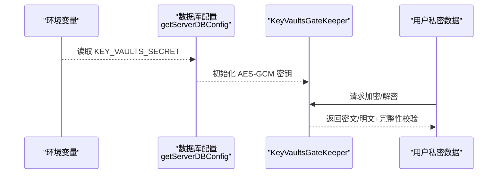
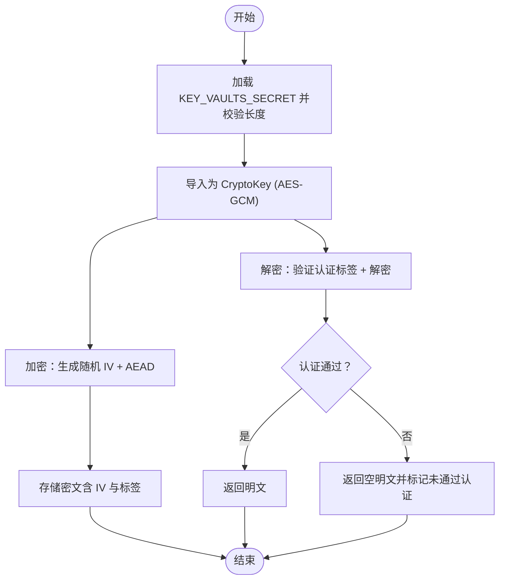
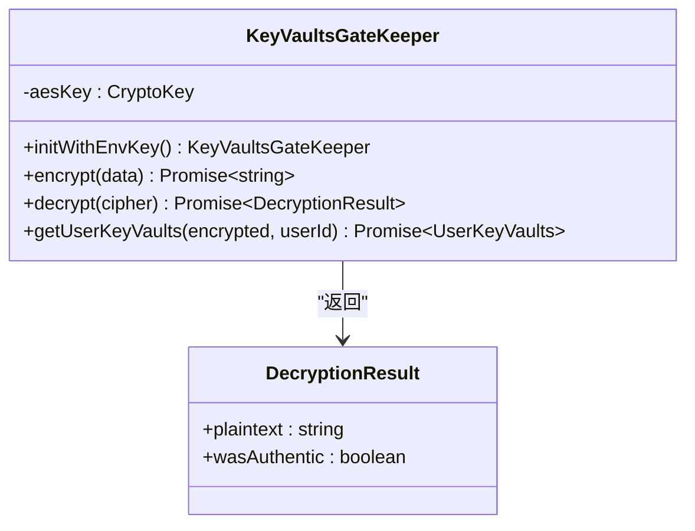
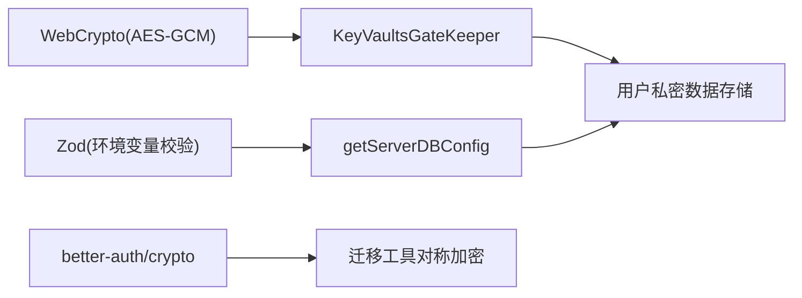

# 数据加密与密钥管理

<cite>
**本文档引用的文件**
- [src/server/modules/KeyVaultsEncrypt/index.ts](file://src/server/modules/KeyVaultsEncrypt/index.ts)
- [src/config/db.ts](file://src/config/db.ts)
- [src/server/services/comfyui/__tests__/utils/cacheManager.test.ts](file://src/server/services/comfyui/__tests__/utils/cacheManager.test.ts)
- [src/features/DevPanel/CacheViewer/DataTable/index.tsx](file://src/features/DevPanel/CacheViewer/DataTable/index.tsx)
- [src/libs/swr/localStorageProvider.ts](file://src/libs/swr/localStorageProvider.ts)
- [apps/desktop/src/main/services/fileSrv.ts](file://apps/desktop/src/main/services/fileSrv.ts)
- [apps/cli/src/auth/credentials.test.ts](file://apps/cli/src/auth/credentials.test.ts)
- [scripts/_shared/checkDeprecatedAuth.js](file://scripts/_shared/checkDeprecatedAuth.js)
- [docs/self-hosting/faq/proxy-with-unable-to-verify-leaf-signature.mdx](file://docs/self-hosting/faq/proxy-with-unable-to-verify-leaf-signature.mdx)
- [scripts/clerk-to-betterauth/_internal/utils.ts](file://scripts/clerk-to-betterauth/_internal/utils.ts)
- [packages/utils/src/client/xor-obfuscation.test.ts](file://packages/utils/src/client/xor-obfuscation.test.ts)
- [package.json](file://package.json)
</cite>

## 目录
1. [引言](#引言)
2. [项目结构](#项目结构)
3. [核心组件](#核心组件)
4. [架构总览](#架构总览)
5. [详细组件分析](#详细组件分析)
6. [依赖关系分析](#依赖关系分析)
7. [性能考虑](#性能考虑)
8. [故障排查指南](#故障排查指南)
9. [结论](#结论)
10. [附录](#附录)

## 引言
本文件面向 LobeHub 项目，系统化梳理其在“传输层加密（TLS/SSL）”、“静态数据加密”、“密钥管理系统”、“环境变量与配置保护”、“敏感数据脱敏”、“备份与恢复”等方面的安全实践与实现要点，并给出可操作的技术建议与最佳实践。

## 项目结构
围绕加密与密钥管理的关键目录与文件如下：
- 服务器端密钥与静态数据加密：src/server/modules/KeyVaultsEncrypt
- 数据库与密钥相关环境变量配置：src/config/db.ts
- 客户端缓存与本地存储保护：src/libs/swr/localStorageProvider.ts、src/features/DevPanel/CacheViewer
- 文件存储服务：apps/desktop/src/main/services/fileSrv.ts
- CLI 凭据保护：apps/cli/src/auth/credentials.test.ts
- 认证与迁移工具中的对称加密：scripts/clerk-to-betterauth/_internal/utils.ts
- XOR 脱敏工具：packages/utils/src/client/xor-obfuscation.test.ts
- 传输层证书校验与代理问题处理：docs/self-hosting/faq/proxy-with-unable-to-verify-leaf-signature.mdx
- 自检脚本：scripts/_shared/checkDeprecatedAuth.js
- 项目依赖与工具：package.json

```mermaid
graph TB
subgraph "服务器端"
KV["KeyVaultsGateKeeper<br/>AES-GCM 加密"]
CFG["数据库与密钥配置<br/>getServerDBConfig"]
end
subgraph "客户端"
SWR["SWR 本地存储提供者<br/>localStorageProvider"]
DEV["开发面板缓存查看器<br/>CacheViewer"]
end
subgraph "桌面应用"
FS["文件上传服务<br/>fileSrv"]
end
subgraph "CLI"
CLI["凭据测试与保护<br/>credentials.test"]
end
subgraph "迁移与工具"
MIG["对称加密工具<br/>clerk-to-betterauth"]
XOR["XOR 脱敏工具<br/>xor-obfuscation.test"]
end
subgraph "部署与运维"
AUTHCHK["认证自检脚本<br/>checkDeprecatedAuth"]
TLSFAQ["TLS 证书问题 FAQ<br/>proxy-with-unable-to-verify-leaf-signature"]
end
KV --> CFG
SWR --> DEV
FS --> KV
CLI --> KV
MIG --> KV
XOR --> KV
AUTHCHK --> CFG
TLSFAQ --> CFG
```

**图表来源**
- [src/server/modules/KeyVaultsEncrypt/index.ts](file://src/server/modules/KeyVaultsEncrypt/index.ts#L1-L126)
- [src/config/db.ts](file://src/config/db.ts#L1-L28)
- [src/libs/swr/localStorageProvider.ts](file://src/libs/swr/localStorageProvider.ts#L174-L222)
- [src/features/DevPanel/CacheViewer/DataTable/index.tsx](file://src/features/DevPanel/CacheViewer/DataTable/index.tsx#L1-L33)
- [apps/desktop/src/main/services/fileSrv.ts](file://apps/desktop/src/main/services/fileSrv.ts#L56-L86)
- [apps/cli/src/auth/credentials.test.ts](file://apps/cli/src/auth/credentials.test.ts#L95-L130)
- [scripts/clerk-to-betterauth/_internal/utils.ts](file://scripts/clerk-to-betterauth/_internal/utils.ts#L1-L36)
- [packages/utils/src/client/xor-obfuscation.test.ts](file://packages/utils/src/client/xor-obfuscation.test.ts#L211-L370)
- [scripts/_shared/checkDeprecatedAuth.js](file://scripts/_shared/checkDeprecatedAuth.js#L206-L299)
- [docs/self-hosting/faq/proxy-with-unable-to-verify-leaf-signature.mdx](file://docs/self-hosting/faq/proxy-with-unable-to-verify-leaf-signature.mdx#L51-L84)

**章节来源**
- [src/server/modules/KeyVaultsEncrypt/index.ts](file://src/server/modules/KeyVaultsEncrypt/index.ts#L1-L126)
- [src/config/db.ts](file://src/config/db.ts#L1-L28)

## 核心组件
- KeyVaultsGateKeeper：基于 WebCrypto 的 AES-GCM 对称加密门禁，负责用户私密数据的加解密与完整性校验。
- 数据库与密钥配置：集中定义并校验 KEY_VAULTS_SECRET 等关键环境变量。
- SWR 本地存储提供者：将缓存持久化到 localStorage，并支持多标签页同步与白名单键过滤。
- 文件上传服务：负责本地文件存储路径与目录创建。
- CLI 凭据测试：验证凭据文件的保存、读取与再加密行为。
- 迁移工具中的对称加密：使用 better-auth/crypto 的对称加密能力生成备份码。
- XOR 脱敏工具：对负载进行可逆的异或脱敏，便于日志与调试场景。
- 认证自检脚本：检查过时或废弃的认证相关环境变量。
- TLS 证书问题 FAQ：提供证书链验证失败的替代与修复建议。

**章节来源**
- [src/server/modules/KeyVaultsEncrypt/index.ts](file://src/server/modules/KeyVaultsEncrypt/index.ts#L1-L126)
- [src/config/db.ts](file://src/config/db.ts#L1-L28)
- [src/libs/swr/localStorageProvider.ts](file://src/libs/swr/localStorageProvider.ts#L174-L222)
- [apps/desktop/src/main/services/fileSrv.ts](file://apps/desktop/src/main/services/fileSrv.ts#L56-L86)
- [apps/cli/src/auth/credentials.test.ts](file://apps/cli/src/auth/credentials.test.ts#L95-L130)
- [scripts/clerk-to-betterauth/_internal/utils.ts](file://scripts/clerk-to-betterauth/_internal/utils.ts#L1-L36)
- [packages/utils/src/client/xor-obfuscation.test.ts](file://packages/utils/src/client/xor-obfuscation.test.ts#L211-L370)
- [scripts/_shared/checkDeprecatedAuth.js](file://scripts/_shared/checkDeprecatedAuth.js#L206-L299)
- [docs/self-hosting/faq/proxy-with-unable-to-verify-leaf-signature.mdx](file://docs/self-hosting/faq/proxy-with-unable-to-verify-leaf-signature.mdx#L51-L84)

## 架构总览
下图展示从“密钥加载”到“数据加解密”的端到端流程，以及与配置、缓存、文件存储、CLI 和迁移工具的交互关系。



**图表来源**
- [src/config/db.ts](file://src/config/db.ts#L1-L28)
- [src/server/modules/KeyVaultsEncrypt/index.ts](file://src/server/modules/KeyVaultsEncrypt/index.ts#L16-L42)

## 详细组件分析

### 传输层加密（TLS/SSL）与证书管理
- 证书链验证失败的常见原因与修复建议：
  - 在代理或中间人证书环境下，可通过正确安装根/中间证书、替换为受信任 CA 签发的证书、确保代码中证书链完整等方式解决。
  - 仅在完全可信的私有环境中临时放宽证书校验（例如设置相关环境变量），并在问题解决后恢复默认校验。
- 与部署相关的注意事项：
  - 代理与反向代理需正确传递与转发证书链，避免截断导致验证失败。
  - 生产环境优先使用 Let's Encrypt 等可信 CA 的自动续期证书，配合正确的证书链配置与定期健康检查。

**章节来源**
- [docs/self-hosting/faq/proxy-with-unable-to-verify-leaf-signature.mdx](file://docs/self-hosting/faq/proxy-with-unable-to-verify-leaf-signature.mdx#L51-L84)

### 静态数据加密策略
- 用户私密数据加密（服务器端）：
  - 使用 AES-GCM 对称加密，随机初始化向量（IV），并包含认证标签（AEAD）以保证机密性与完整性。
  - 密钥来源于环境变量 KEY_VAULTS_SECRET，需满足 128/192/256 位长度要求，并通过 WebCrypto 导入。
  - 解密过程包含完整性校验，失败时返回空明文与未通过认证标记。
- 缓存与本地存储保护：
  - SWR 本地存储提供者将缓存写入 localStorage，并在页面卸载时触发持久化；同时监听 storage 事件进行跨标签页同步。
  - 开发面板缓存查看器用于调试与审计缓存条目，注意避免在生产中暴露敏感数据。
- 文件存储保护：
  - 文件上传服务负责目标目录存在性检查与最终保存路径，建议在存储层启用访问控制与最小权限原则。
- CLI 凭据保护：
  - 测试覆盖了凭据文件的保存、读取与再加密逻辑，确保敏感凭据不会以明文形式长期驻留。



**图表来源**
- [src/server/modules/KeyVaultsEncrypt/index.ts](file://src/server/modules/KeyVaultsEncrypt/index.ts#L16-L102)

**章节来源**
- [src/server/modules/KeyVaultsEncrypt/index.ts](file://src/server/modules/KeyVaultsEncrypt/index.ts#L1-L126)
- [src/libs/swr/localStorageProvider.ts](file://src/libs/swr/localStorageProvider.ts#L174-L222)
- [src/features/DevPanel/CacheViewer/DataTable/index.tsx](file://src/features/DevPanel/CacheViewer/DataTable/index.tsx#L1-L33)
- [apps/desktop/src/main/services/fileSrv.ts](file://apps/desktop/src/main/services/fileSrv.ts#L56-L86)
- [apps/cli/src/auth/credentials.test.ts](file://apps/cli/src/auth/credentials.test.ts#L95-L130)

### 密钥管理系统设计
- 密钥生成与长度校验：
  - 通过命令生成符合长度要求的 Base64 密钥，确保导入 WebCrypto 时满足 128/192/256 位。
- 密钥轮换与存储：
  - 采用环境变量集中管理密钥，不将密钥硬编码于源码；轮换时更新环境变量并重新部署。
- 密钥销毁：
  - 通过删除或撤销环境变量实现销毁；确保旧密钥不再被任何组件加载。
- 与迁移工具的结合：
  - 使用 better-auth/crypto 的对称加密能力生成备份码，便于灾难恢复场景下的密钥恢复。



**图表来源**
- [src/server/modules/KeyVaultsEncrypt/index.ts](file://src/server/modules/KeyVaultsEncrypt/index.ts#L1-L126)

**章节来源**
- [src/server/modules/KeyVaultsEncrypt/index.ts](file://src/server/modules/KeyVaultsEncrypt/index.ts#L1-L126)
- [scripts/clerk-to-betterauth/_internal/utils.ts](file://scripts/clerk-to-betterauth/_internal/utils.ts#L1-L36)

### 环境变量加密与配置保护
- 关键环境变量：
  - KEY_VAULTS_SECRET：用于 AES-GCM 的主密钥。
  - 其他与数据库、文件删除策略等相关的环境变量由 getServerDBConfig 统一校验与导出。
- 自检与合规：
  - 认证相关环境变量的废弃项检查脚本会在发现过时配置时输出警告或错误并终止流程，确保部署一致性与安全性。

**章节来源**
- [src/config/db.ts](file://src/config/db.ts#L1-L28)
- [scripts/_shared/checkDeprecatedAuth.js](file://scripts/_shared/checkDeprecatedAuth.js#L206-L299)

### 敏感数据脱敏与日志安全
- XOR 脱敏工具：
  - 对负载进行可逆异或脱敏，便于日志记录与调试，但不应作为生产级机密保护手段。
- CLI 凭据测试：
  - 验证凭据文件在读取前后的再加密行为，防止明文泄露。

**章节来源**
- [packages/utils/src/client/xor-obfuscation.test.ts](file://packages/utils/src/client/xor-obfuscation.test.ts#L211-L370)
- [apps/cli/src/auth/credentials.test.ts](file://apps/cli/src/auth/credentials.test.ts#L95-L130)

### 备份与恢复流程
- 备份码生成：
  - 使用对称加密生成备份码，便于在密钥丢失或损坏时恢复用户私密数据。
- 恢复流程建议：
  - 严格限制备份码的访问范围与存储介质；在恢复过程中使用新密钥重新导入并解密数据。

**章节来源**
- [scripts/clerk-to-betterauth/_internal/utils.ts](file://scripts/clerk-to-betterauth/_internal/utils.ts#L1-L36)

## 依赖关系分析
- 核心依赖：
  - WebCrypto（用于 AES-GCM）、Zod（用于环境变量校验）、better-auth/crypto（用于对称加密与备份码生成）。
- 工具链与脚本：
  - 通过自检脚本与文档 FAQ 协同保障部署阶段的密钥与证书配置正确性。



**图表来源**
- [src/server/modules/KeyVaultsEncrypt/index.ts](file://src/server/modules/KeyVaultsEncrypt/index.ts#L16-L42)
- [src/config/db.ts](file://src/config/db.ts#L15-L24)
- [scripts/clerk-to-betterauth/_internal/utils.ts](file://scripts/clerk-to-betterauth/_internal/utils.ts#L1-L14)

**章节来源**
- [package.json](file://package.json#L158-L404)

## 性能考虑
- AES-GCM 的随机 IV 与认证标签开销较小，适合高频加解密场景。
- SWR 本地存储提供者在页面卸载时触发持久化，避免频繁写入；跨标签页同步采用白名单键过滤，降低冲突与写放大。
- 文件上传服务在保存前进行目录存在性检查，减少 IO 错误重试成本。

[本节为通用指导，无需特定文件引用]

## 故障排查指南
- 证书链验证失败：
  - 检查代理/反向代理是否正确传递证书链；确保证书由受信任 CA 签发；必要时放宽校验仅限临时环境。
- 密钥长度不合法：
  - 确保 KEY_VAULTS_SECRET 经过 Base64 解码后长度为 16/24/32 字节；重新生成并更新环境变量。
- 解密失败或认证未通过：
  - 检查密文格式是否为“IV:标签:密文”三段；确认密钥未被轮换或篡改；核对存储介质完整性。
- 缓存数据异常：
  - 使用开发面板查看缓存条目；确认白名单键过滤生效；避免在生产中暴露敏感数据。
- CLI 凭据异常：
  - 检查凭据文件是否存在且可读；确认再加密逻辑是否成功执行。

**章节来源**
- [docs/self-hosting/faq/proxy-with-unable-to-verify-leaf-signature.mdx](file://docs/self-hosting/faq/proxy-with-unable-to-verify-leaf-signature.mdx#L51-L84)
- [src/server/modules/KeyVaultsEncrypt/index.ts](file://src/server/modules/KeyVaultsEncrypt/index.ts#L26-L33)
- [src/features/DevPanel/CacheViewer/DataTable/index.tsx](file://src/features/DevPanel/CacheViewer/DataTable/index.tsx#L1-L33)
- [apps/cli/src/auth/credentials.test.ts](file://apps/cli/src/auth/credentials.test.ts#L95-L130)

## 结论
LobeHub 在服务器端采用 AES-GCM 对称加密保护用户私密数据，结合严格的密钥长度校验与完整性验证；在客户端通过 SWR 本地存储提供者与开发面板工具提升缓存与调试体验；在部署层面通过自检脚本与 FAQ 文档强化 TLS 证书与环境变量的合规性。建议在生产环境中持续完善密钥轮换与备份恢复流程，并加强存储层访问控制与最小权限原则。

[本节为总结性内容，无需特定文件引用]

## 附录
- 环境变量与配置建议：
  - KEY_VAULTS_SECRET：使用强随机 Base64 密钥，定期轮换；在 CI/CD 中通过密钥管理服务注入。
  - 数据库连接与文件删除策略：通过 getServerDBConfig 统一校验，避免硬编码。
- 最佳实践清单：
  - 传输层：优先使用可信 CA 的自动续期证书，正确配置证书链。
  - 静态数据：对敏感字段与私密数据统一采用 AES-GCM；避免在日志中输出明文。
  - 密钥管理：密钥集中存储与轮换，备份码仅在恢复流程中使用。
  - 配置保护：通过自检脚本与文档 FAQ 持续监控部署合规性。

[本节为通用指导，无需特定文件引用]