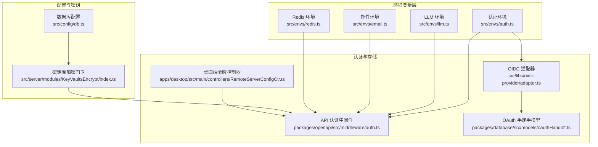
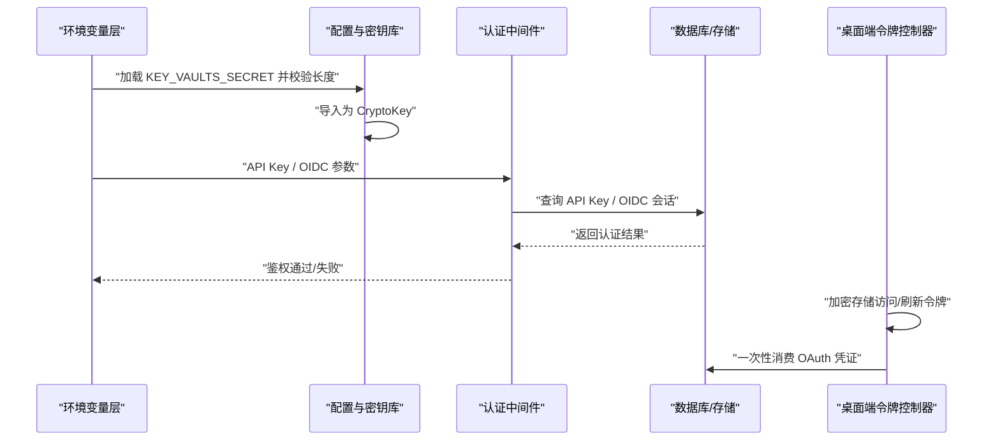
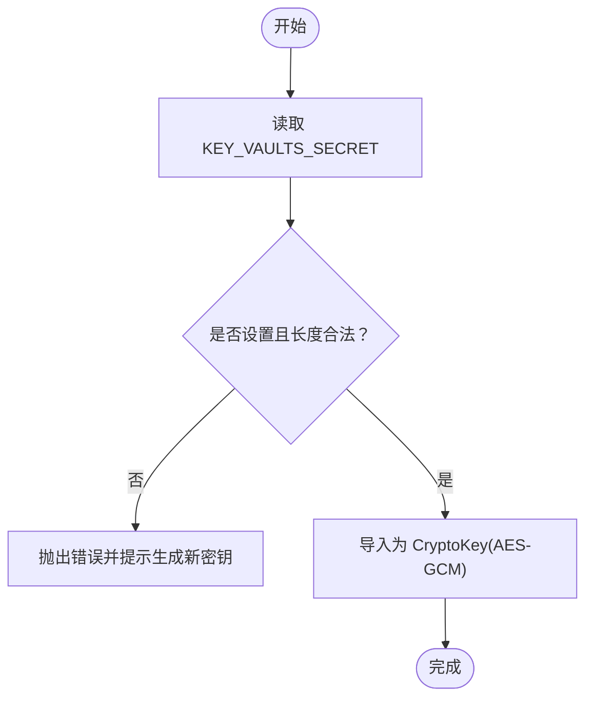
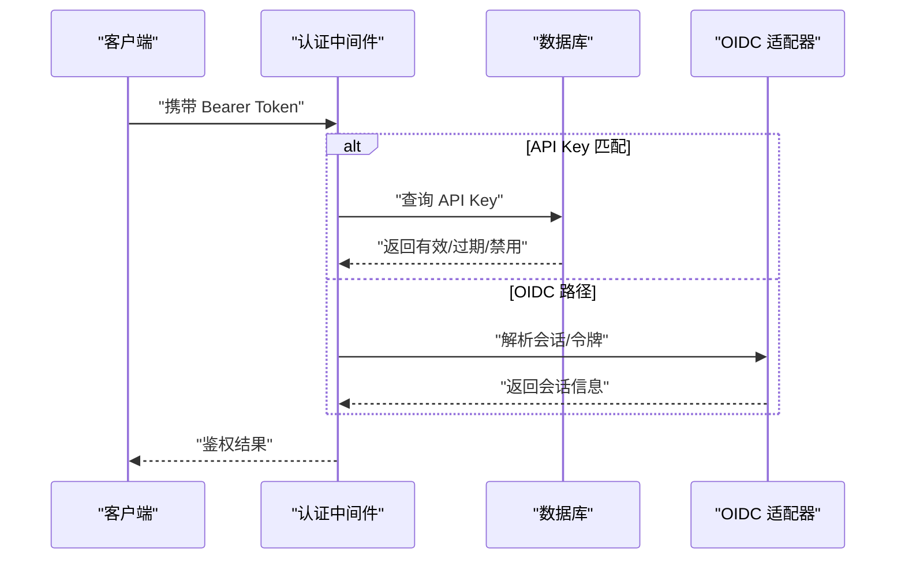
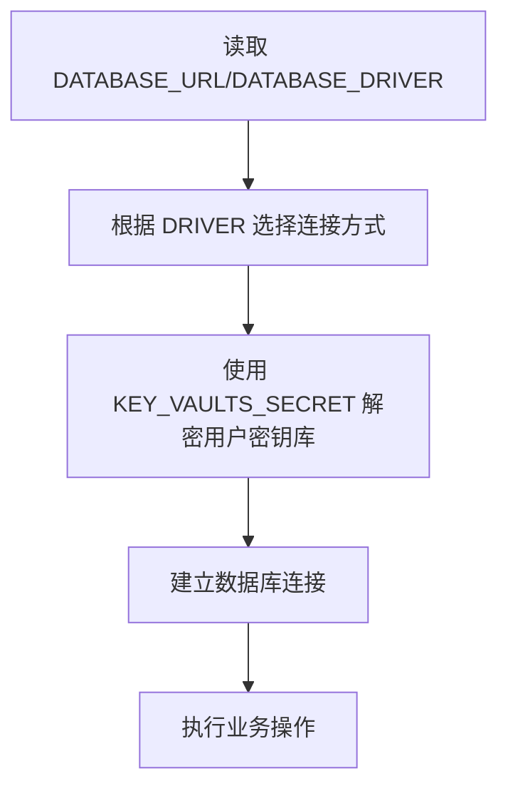
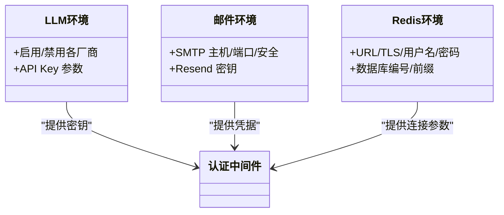
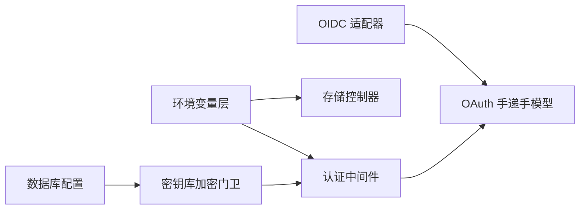

# 环境安全配置

<cite>
**本文引用的文件**
- [src/envs/auth.ts](file://src/envs/auth.ts)
- [src/envs/email.ts](file://src/envs/email.ts)
- [src/envs/llm.ts](file://src/envs/llm.ts)
- [src/envs/redis.ts](file://src/envs/redis.ts)
- [src/config/db.ts](file://src/config/db.ts)
- [src/server/modules/KeyVaultsEncrypt/index.ts](file://src/server/modules/KeyVaultsEncrypt/index.ts)
- [apps/desktop/src/main/controllers/RemoteServerConfigCtr.ts](file://apps/desktop/src/main/controllers/RemoteServerConfigCtr.ts)
- [packages/database/src/models/oauthHandoff.ts](file://packages/database/src/models/oauthHandoff.ts)
- [src/libs/oidc-provider/adapter.ts](file://src/libs/oidc-provider/adapter.ts)
- [packages/openapi/src/middleware/auth.ts](file://packages/openapi/src/middleware/auth.ts)
- [scripts/generate-oidc-jwk.mjs](file://scripts/generate-oidc-jwk.mjs)
</cite>

## 目录

1. [简介](#简介)
2. [项目结构](#项目结构)
3. [核心组件](#核心组件)
4. [架构总览](#架构总览)
5. [详细组件分析](#详细组件分析)
6. [依赖关系分析](#依赖关系分析)
7. [性能考量](#性能考量)
8. [故障排查指南](#故障排查指南)
9. [结论](#结论)
10. [附录](#附录)

## 简介

本文件面向 LobeHub 自托管与多端运行场景，系统化梳理环境安全配置，覆盖以下方面：

- 环境变量加密与保护：敏感配置加密、密钥长度校验、运行时验证
- 认证配置安全：API 密钥管理、OAuth/OIDC 配置、令牌存储与轮换
- 数据库连接安全：连接字符串解析、密钥库保护、连接池与凭据轮换
- 第三方服务集成安全：外部 API 密钥管理、服务间认证、数据传输保护
- 安全检查清单、常见错误与运维审计建议

## 项目结构

围绕 “环境变量 + 加密模块 + 认证中间件 + 存储适配” 的安全路径，关键文件分布如下：

- 环境变量定义与校验：src/envs/\*.ts（认证、邮件、LLM、Redis）
- 数据库与密钥库：src/config/db.ts、src/server/modules/KeyVaultsEncrypt/index.ts
- 桌面端令牌存储：apps/desktop/src/main/controllers/RemoteServerConfigCtr.ts
- OAuth 手递手与 OIDC 适配：packages/database/src/models/oauthHandoff.ts、src/libs/oidc-provider/adapter.ts
- API 认证中间件：packages/openapi/src/middleware/auth.ts
- OIDC JWKS 生成脚本：scripts/generate-oidc-jwk.mjs

**图表来源**

- [src/envs/auth.ts](file://src/envs/auth.ts#L107-L296)
- [src/envs/email.ts](file://src/envs/email.ts#L21-L50)
- [src/envs/llm.ts](file://src/envs/llm.ts#L4-L454)
- [src/envs/redis.ts](file://src/envs/redis.ts#L21-L64)
- [src/config/db.ts](file://src/config/db.ts#L4-L27)
- [src/server/modules/KeyVaultsEncrypt/index.ts](file://src/server/modules/KeyVaultsEncrypt/index.ts#L1-L42)
- [packages/openapi/src/middleware/auth.ts](file://packages/openapi/src/middleware/auth.ts#L136-L171)
- [src/libs/oidc-provider/adapter.ts](file://src/libs/oidc-provider/adapter.ts#L46-L95)
- [packages/database/src/models/oauthHandoff.ts](file://packages/database/src/models/oauthHandoff.ts#L1-L38)
- [apps/desktop/src/main/controllers/RemoteServerConfigCtr.ts](file://apps/desktop/src/main/controllers/RemoteServerConfigCtr.ts#L177-L313)

**章节来源**

- [src/envs/auth.ts](file://src/envs/auth.ts#L107-L296)
- [src/envs/email.ts](file://src/envs/email.ts#L21-L50)
- [src/envs/llm.ts](file://src/envs/llm.ts#L4-L454)
- [src/envs/redis.ts](file://src/envs/redis.ts#L21-L64)
- [src/config/db.ts](file://src/config/db.ts#L4-L27)
- [src/server/modules/KeyVaultsEncrypt/index.ts](file://src/server/modules/KeyVaultsEncrypt/index.ts#L1-L42)
- [packages/openapi/src/middleware/auth.ts](file://packages/openapi/src/middleware/auth.ts#L136-L171)
- [src/libs/oidc-provider/adapter.ts](file://src/libs/oidc-provider/adapter.ts#L46-L95)
- [packages/database/src/models/oauthHandoff.ts](file://packages/database/src/models/oauthHandoff.ts#L1-L38)
- [apps/desktop/src/main/controllers/RemoteServerConfigCtr.ts](file://apps/desktop/src/main/controllers/RemoteServerConfigCtr.ts#L177-L313)

## 核心组件

- 环境变量定义与校验
  - 认证环境：涵盖多种 OAuth 提供商与 OIDC/JWKS 配置，支持布尔开关与字符串校验。
  - 邮件环境：支持 SMTP 与 Resend，含主机、端口、用户名、密码、发件人等。
  - LLM 环境：集中声明各模型厂商的 API Key 开关与参数，便于统一启用 / 禁用与密钥管理。
  - Redis 环境：支持 URL、TLS、用户名 / 密码、数据库编号与前缀。
- 数据库与密钥库
  - 数据库配置导出 KEY_VAULTS_SECRET，用于用户密钥库的对称加密。
  - 密钥库加密门卫负责从环境加载并校验密钥长度，导入为 WebCrypto 的 CryptoKey。
- 认证与令牌存储
  - API 认证中间件：优先匹配 API Key，否则尝试 OIDC；支持缓存与最后使用时间更新。
  - 桌面端令牌控制器：基于平台安全存储进行令牌加解密，不支持时记录警告并降级存储。
  - OAuth 手递手模型：一次性消费机制，带 5 分钟 TTL，避免重放。
  - OIDC 适配器：将 OIDCK/V、授权码、刷新令牌等映射到数据库表。

**章节来源**

- [src/envs/auth.ts](file://src/envs/auth.ts#L107-L296)
- [src/envs/email.ts](file://src/envs/email.ts#L21-L50)
- [src/envs/llm.ts](file://src/envs/llm.ts#L4-L454)
- [src/envs/redis.ts](file://src/envs/redis.ts#L21-L64)
- [src/config/db.ts](file://src/config/db.ts#L4-L27)
- [src/server/modules/KeyVaultsEncrypt/index.ts](file://src/server/modules/KeyVaultsEncrypt/index.ts#L16-L42)
- [packages/openapi/src/middleware/auth.ts](file://packages/openapi/src/middleware/auth.ts#L136-L171)
- [apps/desktop/src/main/controllers/RemoteServerConfigCtr.ts](file://apps/desktop/src/main/controllers/RemoteServerConfigCtr.ts#L177-L313)
- [packages/database/src/models/oauthHandoff.ts](file://packages/database/src/models/oauthHandoff.ts#L19-L38)
- [src/libs/oidc-provider/adapter.ts](file://src/libs/oidc-provider/adapter.ts#L46-L95)

## 架构总览

下图展示从环境变量到认证与存储的关键链路，以及密钥库加密在其中的位置。

**图表来源**

- [src/config/db.ts](file://src/config/db.ts#L4-L27)
- [src/server/modules/KeyVaultsEncrypt/index.ts](file://src/server/modules/KeyVaultsEncrypt/index.ts#L16-L42)
- [packages/openapi/src/middleware/auth.ts](file://packages/openapi/src/middleware/auth.ts#L136-L171)
- [packages/database/src/models/oauthHandoff.ts](file://packages/database/src/models/oauthHandoff.ts#L36-L38)
- [apps/desktop/src/main/controllers/RemoteServerConfigCtr.ts](file://apps/desktop/src/main/controllers/RemoteServerConfigCtr.ts#L177-L313)

## 详细组件分析

### 环境变量加密与保护机制

- 密钥库对称加密
  - 从数据库配置中读取 KEY_VAULTS_SECRET，要求 base64 解码后长度为 16/24/32 字节（对应 128/192/256 位）。
  - 使用 WebCrypto 导入为 AES-GCM 的 CryptoKey，用于后续对用户密钥库的加解密。
- 运行时校验与错误提示
  - 未设置或长度不合法时抛出明确错误，指引生成新密钥。
- 建议
  - 使用强随机源生成密钥，妥善保管并定期轮换。
  - 将密钥以只读权限存储于 CI/CD 或密钥管理系统，并限制可见范围。

**图表来源**

- [src/server/modules/KeyVaultsEncrypt/index.ts](file://src/server/modules/KeyVaultsEncrypt/index.ts#L16-L42)
- [src/config/db.ts](file://src/config/db.ts#L11-L20)

**章节来源**

- [src/server/modules/KeyVaultsEncrypt/index.ts](file://src/server/modules/KeyVaultsEncrypt/index.ts#L16-L42)
- [src/config/db.ts](file://src/config/db.ts#L11-L20)

### 认证配置安全（API 密钥、OAuth、OIDC、令牌存储）

- API 密钥管理
  - 中间件优先匹配 API Key，命中后写入缓存并异步更新 “最后使用时间”。
  - 支持过期与禁用检测，失败时记录日志。
- OAuth/OIDC 配置
  - 多提供商 ID/Secret/IUSSUER 统一由认证环境加载，ENABLE_OIDC 由 JWKS_KEY 是否存在决定。
  - OIDC 适配器将不同模型映射到对应数据库表，确保会话与令牌持久化。
- 令牌存储与降级策略
  - 桌面端优先使用平台安全存储进行加解密；若不可用则记录警告并降级存储明文令牌。
  - 提供一次性清除接口，确保令牌被彻底删除。
- OAuth 手递手
  - 一次性消费与 5 分钟 TTL，防止重放与泄露扩散。

**图表来源**

- [packages/openapi/src/middleware/auth.ts](file://packages/openapi/src/middleware/auth.ts#L136-L171)
- [src/libs/oidc-provider/adapter.ts](file://src/libs/oidc-provider/adapter.ts#L46-L95)
- [src/envs/auth.ts](file://src/envs/auth.ts#L107-L296)

**章节来源**

- [packages/openapi/src/middleware/auth.ts](file://packages/openapi/src/middleware/auth.ts#L136-L171)
- [src/envs/auth.ts](file://src/envs/auth.ts#L107-L296)
- [src/libs/oidc-provider/adapter.ts](file://src/libs/oidc-provider/adapter.ts#L46-L95)
- [packages/database/src/models/oauthHandoff.ts](file://packages/database/src/models/oauthHandoff.ts#L36-L38)
- [apps/desktop/src/main/controllers/RemoteServerConfigCtr.ts](file://apps/desktop/src/main/controllers/RemoteServerConfigCtr.ts#L177-L313)

### 数据库连接安全（连接字符串、连接池、凭据轮换）

- 连接字符串与驱动
  - 支持 neon/node 两种驱动，数据库 URL 可选，便于在不同部署形态间切换。
- 密钥库保护
  - 通过 KEY_VAULTS_SECRET 对用户侧敏感配置进行对称加密，避免明文落盘。
- 凭据轮换建议
  - 更换 KEY_VAULTS_SECRET 后，需重新导入旧数据并清理历史缓存，确保平滑过渡。

**图表来源**

- [src/config/db.ts](file://src/config/db.ts#L4-L27)
- [src/server/modules/KeyVaultsEncrypt/index.ts](file://src/server/modules/KeyVaultsEncrypt/index.ts#L16-L42)

**章节来源**

- [src/config/db.ts](file://src/config/db.ts#L4-L27)
- [src/server/modules/KeyVaultsEncrypt/index.ts](file://src/server/modules/KeyVaultsEncrypt/index.ts#L16-L42)

### 第三方服务集成安全（外部 API 密钥、服务间认证、数据传输）

- 外部 API 密钥管理
  - LLM 环境集中声明各厂商 API Key 的开关与参数，便于统一启用 / 禁用与最小暴露。
- 服务间认证
  - 认证中间件支持 API Key 与 OIDC 双通道，结合 JWKS 实现内部服务签名 / 验签。
- 数据传输保护
  - Redis 支持 TLS 开关；邮件支持 SMTP 安全端口与 SSL/TLS；COMFYUI 支持自定义头部与认证类型。

**图表来源**

- [src/envs/llm.ts](file://src/envs/llm.ts#L4-L454)
- [src/envs/email.ts](file://src/envs/email.ts#L21-L50)
- [src/envs/redis.ts](file://src/envs/redis.ts#L21-L64)
- [packages/openapi/src/middleware/auth.ts](file://packages/openapi/src/middleware/auth.ts#L136-L171)

**章节来源**

- [src/envs/llm.ts](file://src/envs/llm.ts#L4-L454)
- [src/envs/email.ts](file://src/envs/email.ts#L21-L50)
- [src/envs/redis.ts](file://src/envs/redis.ts#L21-L64)
- [packages/openapi/src/middleware/auth.ts](file://packages/openapi/src/middleware/auth.ts#L136-L171)

## 依赖关系分析

- 环境变量层为上层组件提供输入，认证中间件与存储控制器依赖其配置。
- 密钥库加密门卫独立于业务逻辑，仅依赖数据库配置中的密钥。
- OIDC 适配器与 OAuth 手递手模型共同保障会话与凭证安全。

**图表来源**

- [src/envs/auth.ts](file://src/envs/auth.ts#L107-L296)
- [src/server/modules/KeyVaultsEncrypt/index.ts](file://src/server/modules/KeyVaultsEncrypt/index.ts#L16-L42)
- [src/libs/oidc-provider/adapter.ts](file://src/libs/oidc-provider/adapter.ts#L46-L95)
- [packages/database/src/models/oauthHandoff.ts](file://packages/database/src/models/oauthHandoff.ts#L19-L38)
- [packages/openapi/src/middleware/auth.ts](file://packages/openapi/src/middleware/auth.ts#L136-L171)

**章节来源**

- [src/envs/auth.ts](file://src/envs/auth.ts#L107-L296)
- [src/server/modules/KeyVaultsEncrypt/index.ts](file://src/server/modules/KeyVaultsEncrypt/index.ts#L16-L42)
- [src/libs/oidc-provider/adapter.ts](file://src/libs/oidc-provider/adapter.ts#L46-L95)
- [packages/database/src/models/oauthHandoff.ts](file://packages/database/src/models/oauthHandoff.ts#L19-L38)
- [packages/openapi/src/middleware/auth.ts](file://packages/openapi/src/middleware/auth.ts#L136-L171)

## 性能考量

- API Key 缓存：中间件对已验证的 API Key 进行缓存，减少重复查询开销。
- OIDC 会话映射：适配器按模型名映射到表，避免不必要的跨表查询。
- Redis TLS：在高并发场景开启 TLS 会增加 CPU 开销，需结合网络与硬件评估。
- 令牌存储降级：桌面端在不支持安全存储时的明文存储仅作临时降级，应尽快修复平台能力。

## 故障排查指南

- 密钥库初始化报错
  - 症状：启动时报错提示未设置或密钥长度非法。
  - 排查：确认 KEY_VAULTS_SECRET 已设置且 base64 解码后长度为 16/24/32 字节。
  - 参考：[src/server/modules/KeyVaultsEncrypt/index.ts](file://src/server/modules/KeyVaultsEncrypt/index.ts#L16-L42)
- API Key 未生效或频繁失效
  - 症状：请求返回鉴权失败或提示过期 / 禁用。
  - 排查：检查 API Key 是否正确写入数据库、是否过期、是否被禁用；查看中间件日志。
  - 参考：[packages/openapi/src/middleware/auth.ts](file://packages/openapi/src/middleware/auth.ts#L136-L171)
- OIDC 登录异常
  - 症状：无法通过 OIDC 完成登录。
  - 排查：确认 ENABLE_OIDC 与 JWKS_KEY 配置；检查 OIDC 适配器映射表是否正确。
  - 参考：[src/envs/auth.ts](file://src/envs/auth.ts#L195-L198), [src/libs/oidc-provider/adapter.ts](file://src/libs/oidc-provider/adapter.ts#L46-L95)
- 桌面端令牌存储异常
  - 症状：令牌无法解密或提示未加密存储。
  - 排查：确认平台安全存储可用性；若不可用，将采用明文存储并记录警告。
  - 参考：[apps/desktop/src/main/controllers/RemoteServerConfigCtr.ts](file://apps/desktop/src/main/controllers/RemoteServerConfigCtr.ts#L193-L205)
- OAuth 手递手失败
  - 症状：凭证无效或已过期。
  - 排查：确认 5 分钟 TTL 内使用；检查一次性消费逻辑。
  - 参考：[packages/database/src/models/oauthHandoff.ts](file://packages/database/src/models/oauthHandoff.ts#L36-L38)

**章节来源**

- [src/server/modules/KeyVaultsEncrypt/index.ts](file://src/server/modules/KeyVaultsEncrypt/index.ts#L16-L42)
- [packages/openapi/src/middleware/auth.ts](file://packages/openapi/src/middleware/auth.ts#L136-L171)
- [src/envs/auth.ts](file://src/envs/auth.ts#L195-L198)
- [src/libs/oidc-provider/adapter.ts](file://src/libs/oidc-provider/adapter.ts#L46-L95)
- [apps/desktop/src/main/controllers/RemoteServerConfigCtr.ts](file://apps/desktop/src/main/controllers/RemoteServerConfigCtr.ts#L193-L205)
- [packages/database/src/models/oauthHandoff.ts](file://packages/database/src/models/oauthHandoff.ts#L36-L38)

## 结论

LobeHub 在环境安全方面提供了完善的基础设施：

- 通过严格的环境变量校验与密钥库对称加密，降低敏感信息泄露风险；
- 认证中间件与 OIDC 适配器实现灵活的多通道认证与会话持久化；
- 桌面端令牌控制器具备降级策略，兼顾可用性与安全性；
- LLM / 邮件 / Redis 等第三方集成均提供最小暴露与传输保护选项。

建议在生产环境中配合密钥轮换、最小权限与审计日志，持续完善安全基线。

## 附录

### 安全配置检查清单

- 环境变量
  - [ ] 已设置 KEY_VAULTS_SECRET，长度为 16/24/32 字节
  - [ ] API 密钥按需启用，最小化暴露
  - [ ] SMTP/Resend/Redis/TLS 等参数完整且正确
- 认证
  - [ ] ENABLE_OIDC 与 JWKS_KEY 配置一致
  - [ ] OIDC 适配器映射表正确
  - [ ] OAuth 手递手 TTL 与一次性消费逻辑正常
- 存储
  - [ ] 桌面端安全存储可用；不可用时有明确告警
  - [ ] 令牌清除接口可正常使用
- 运维
  - [ ] 定期轮换密钥与 API 密钥
  - [ ] 启用审计日志，监控异常登录与密钥变更

### 常见配置错误

- 密钥长度不合法：导致密钥库初始化失败
- OIDC 未配置 JWKS：ENABLE_OIDC 无法启用
- Redis TLS 误配：连接失败或性能下降
- 桌面端安全存储不可用：令牌明文存储带来风险

### 运维审计建议

- 定期审计环境变量与密钥库使用情况
- 监控 API Key 与 OIDC 登录成功率与错误日志
- 对 OAuth 手递手使用进行追踪与超时告警
- 对 Redis/TLS 与邮件传输进行健康检查
