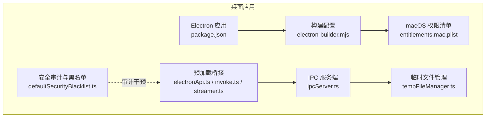
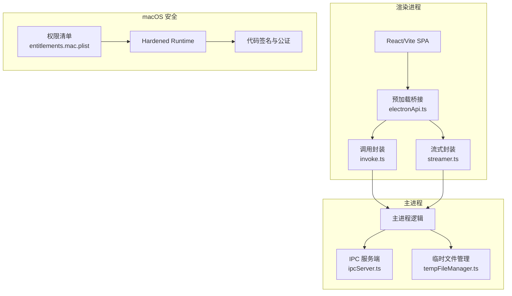
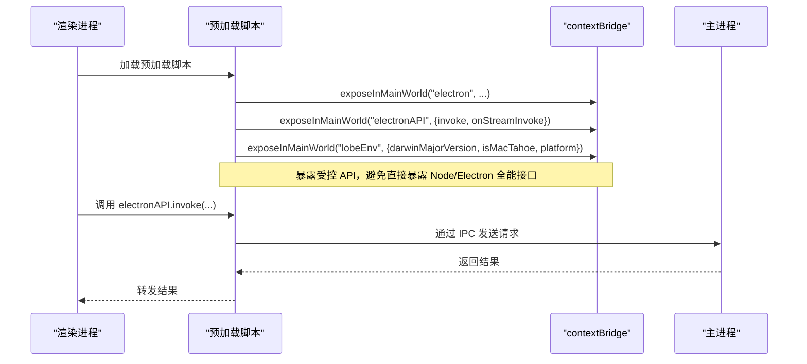
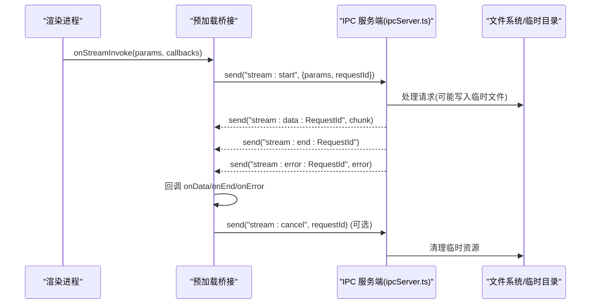
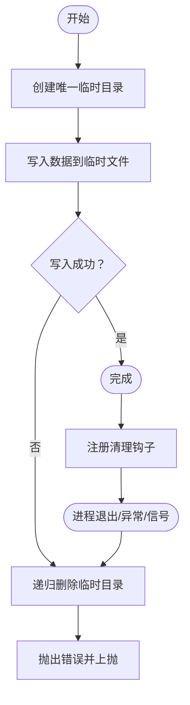
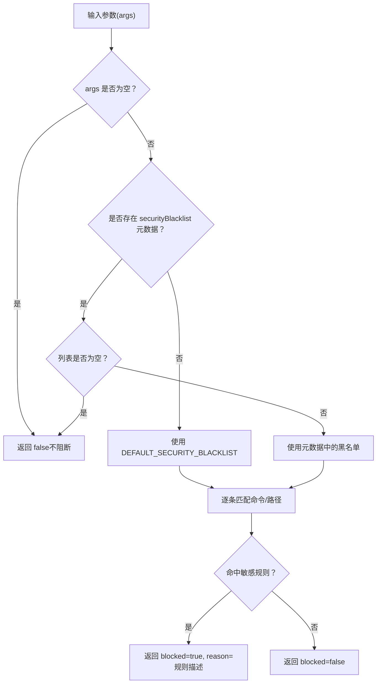
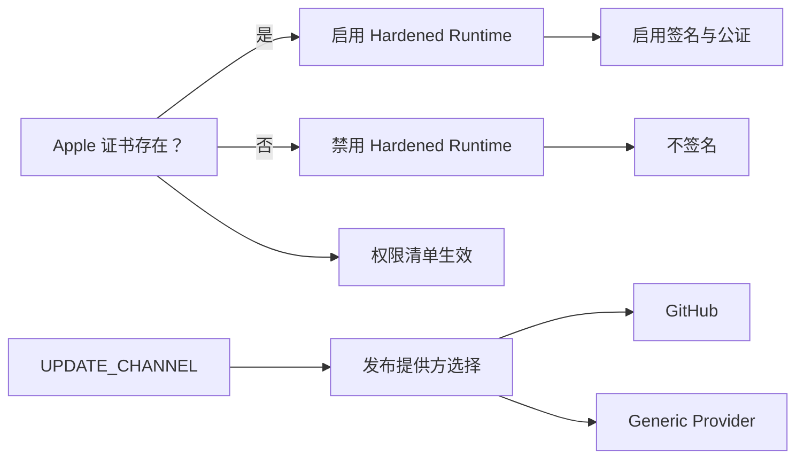
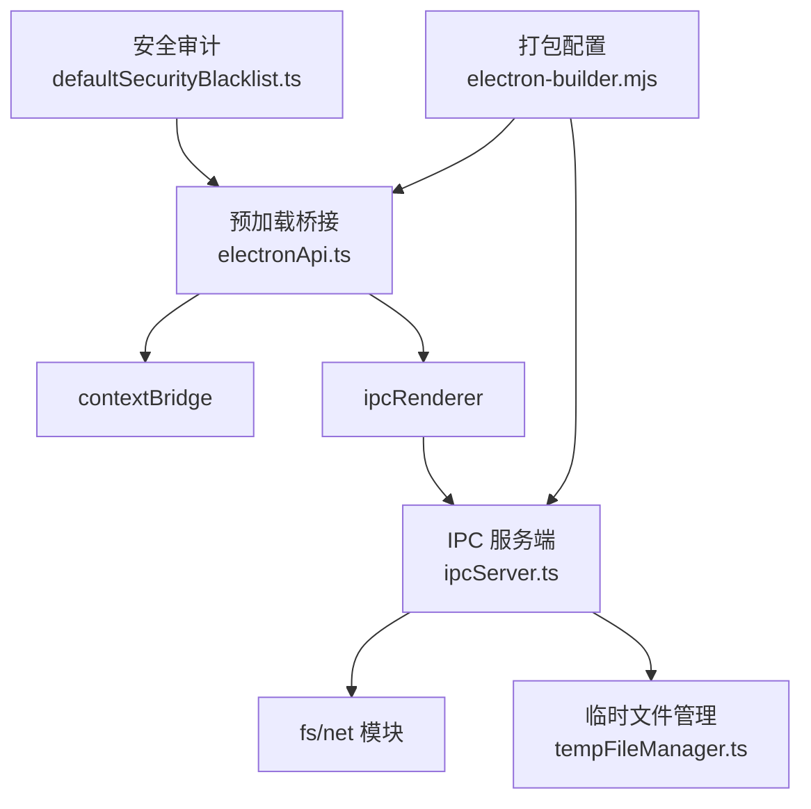

# 桌面应用安全

<cite>
**本文引用的文件**
- [apps/desktop/package.json](file://apps/desktop/package.json)
- [apps/desktop/electron-builder.mjs](file://apps/desktop/electron-builder.mjs)
- [apps/desktop/build/entitlements.mac.plist](file://apps/desktop/build/entitlements.mac.plist)
- [apps/desktop/src/preload/electronApi.ts](file://apps/desktop/src/preload/electronApi.ts)
- [apps/desktop/src/preload/invoke.ts](file://apps/desktop/src/preload/invoke.ts)
- [apps/desktop/src/preload/streamer.ts](file://apps/desktop/src/preload/streamer.ts)
- [packages/electron-server-ipc/src/ipcServer.ts](file://packages/electron-server-ipc/src/ipcServer.ts)
- [packages/electron-server-ipc/src/ipcServer.test.ts](file://packages/electron-server-ipc/src/ipcServer.test.ts)
- [packages/fetch-sse/src/__tests__/request.test.ts](file://packages/fetch-sse/src/__tests__/request.test.ts)
- [src/server/utils/tempFileManager.ts](file://src/server/utils/tempFileManager.ts)
- [src/server/utils/__tests__/tempFileManager.test.ts](file://src/server/utils/__tests__/tempFileManager.test.ts)
- [packages/agent-runtime/src/audit/defaultSecurityBlacklist.ts](file://packages/agent-runtime/src/audit/defaultSecurityBlacklist.ts)
- [packages/agent-runtime/src/audit/__tests__/createSecurityBlacklistAudit.test.ts](file://packages/agent-runtime/src/audit/__tests__/createSecurityBlacklistAudit.test.ts)
- [apps/desktop/Development.md](file://apps/desktop/Development.md)
- [apps/desktop/dev-app-update.yml](file://apps/desktop/dev-app-update.yml)
</cite>

## 目录

1. [简介](#简介)
2. [项目结构](#项目结构)
3. [核心组件](#核心组件)
4. [架构总览](#架构总览)
5. [组件深度解析](#组件深度解析)
6. [依赖关系分析](#依赖关系分析)
7. [性能与安全权衡](#性能与安全权衡)
8. [故障排查指南](#故障排查指南)
9. [结论](#结论)
10. [附录](#附录)

## 简介

本文件面向 LobeHub 桌面应用（基于 Electron）的安全配置与实践，聚焦以下方面：

- macOS 平台安全：Hardened Runtime、权限声明、代码签名与公证、沙箱能力
- Electron 安全架构：主进程与渲染进程隔离、Node.js 集成安全、上下文隔离
- IPC 通信安全：消息验证、权限检查、数据序列化与流式传输安全
- 文件系统安全：临时文件清理、配置文件保护、用户数据隔离
- 打包与更新安全：应用打包配置、自动更新通道与源、本地更新测试
- 安全审计与合规：默认黑名单、干预检查、漏洞扫描与合规建议

## 项目结构

桌面应用相关的关键目录与文件：

- 打包与平台配置：apps/desktop/electron-builder.mjs、apps/desktop/build/entitlements.mac.plist
- 预加载与桥接：apps/desktop/src/preload/\*.ts
- IPC 服务端：packages/electron-server-ipc/src/ipcServer.ts
- 临时文件管理：src/server/utils/tempFileManager.ts
- 安全审计与黑名单：packages/agent-runtime/src/audit/\*
- 开发与架构说明：apps/desktop/Development.md
- 自动更新测试：apps/desktop/dev-app-update.yml

**图表来源**

- [apps/desktop/package.json](file://apps/desktop/package.json#L1-L123)
- [apps/desktop/electron-builder.mjs](file://apps/desktop/electron-builder.mjs#L102-L307)
- [apps/desktop/build/entitlements.mac.plist](file://apps/desktop/build/entitlements.mac.plist#L1-L22)
- [apps/desktop/src/preload/electronApi.ts](file://apps/desktop/src/preload/electronApi.ts#L1-L32)
- [apps/desktop/src/preload/invoke.ts](file://apps/desktop/src/preload/invoke.ts#L1-L9)
- [apps/desktop/src/preload/streamer.ts](file://apps/desktop/src/preload/streamer.ts#L1-L59)
- [packages/electron-server-ipc/src/ipcServer.ts](file://packages/electron-server-ipc/src/ipcServer.ts#L121-L160)
- [src/server/utils/tempFileManager.ts](file://src/server/utils/tempFileManager.ts#L1-L67)
- [packages/agent-runtime/src/audit/defaultSecurityBlacklist.ts](file://packages/agent-runtime/src/audit/defaultSecurityBlacklist.ts#L1-L338)

**章节来源**

- [apps/desktop/package.json](file://apps/desktop/package.json#L1-L123)
- [apps/desktop/electron-builder.mjs](file://apps/desktop/electron-builder.mjs#L102-L307)
- [apps/desktop/Development.md](file://apps/desktop/Development.md#L497-L533)

## 核心组件

- 预加载桥接与上下文隔离：通过 contextBridge 将受控 API 暴露给渲染进程，避免直接暴露 Node.js/Electron 全部能力。
- IPC 服务端：基于 Unix 套接字 / 命名管道的 IPC 服务，负责请求处理、结果与错误响应、资源清理。
- 临时文件管理：跨平台创建唯一临时目录，写入失败立即清理，注册进程退出 / 异常 / 信号钩子确保资源回收。
- 安全审计与黑名单：内置默认黑名单规则，覆盖文件系统危险操作、敏感路径访问、网络与远程访问、内核参数修改等。
- 打包与平台配置：macOS Hardened Runtime、权限声明、代码签名与公证、自动更新通道与发布源。

**章节来源**

- [apps/desktop/src/preload/electronApi.ts](file://apps/desktop/src/preload/electronApi.ts#L1-L32)
- [apps/desktop/src/preload/invoke.ts](file://apps/desktop/src/preload/invoke.ts#L1-L9)
- [apps/desktop/src/preload/streamer.ts](file://apps/desktop/src/preload/streamer.ts#L1-L59)
- [packages/electron-server-ipc/src/ipcServer.ts](file://packages/electron-server-ipc/src/ipcServer.ts#L121-L160)
- [src/server/utils/tempFileManager.ts](file://src/server/utils/tempFileManager.ts#L1-L67)
- [packages/agent-runtime/src/audit/defaultSecurityBlacklist.ts](file://packages/agent-runtime/src/audit/defaultSecurityBlacklist.ts#L1-L338)

## 架构总览

下图展示桌面应用在 macOS 上的整体安全架构与关键交互：

**图表来源**

- [apps/desktop/src/preload/electronApi.ts](file://apps/desktop/src/preload/electronApi.ts#L1-L32)
- [apps/desktop/src/preload/invoke.ts](file://apps/desktop/src/preload/invoke.ts#L1-L9)
- [apps/desktop/src/preload/streamer.ts](file://apps/desktop/src/preload/streamer.ts#L1-L59)
- [packages/electron-server-ipc/src/ipcServer.ts](file://packages/electron-server-ipc/src/ipcServer.ts#L121-L160)
- [src/server/utils/tempFileManager.ts](file://src/server/utils/tempFileManager.ts#L1-L67)
- [apps/desktop/build/entitlements.mac.plist](file://apps/desktop/build/entitlements.mac.plist#L1-L22)
- [apps/desktop/electron-builder.mjs](file://apps/desktop/electron-builder.mjs#L241-L271)

## 组件深度解析

### 预加载桥接与上下文隔离

- 通过 contextBridge 将受控 API 暴露至渲染进程，避免直接注入全局对象。
- 暴露内容包括：electronAPI、invoke、onStreamInvoke，以及平台信息（darwin 主版本、是否 macOS Tahoe、平台标识）。
- 错误处理：对 API 暴露过程进行 try/catch，仅记录日志，不抛出异常，保证稳定性。

**图表来源**

- [apps/desktop/src/preload/electronApi.ts](file://apps/desktop/src/preload/electronApi.ts#L7-L32)
- [apps/desktop/src/preload/invoke.ts](file://apps/desktop/src/preload/invoke.ts#L1-L9)
- [apps/desktop/src/preload/streamer.ts](file://apps/desktop/src/preload/streamer.ts#L1-L59)

**章节来源**

- [apps/desktop/src/preload/electronApi.ts](file://apps/desktop/src/preload/electronApi.ts#L1-L32)
- [apps/desktop/src/preload/invoke.ts](file://apps/desktop/src/preload/invoke.ts#L1-L9)
- [apps/desktop/src/preload/streamer.ts](file://apps/desktop/src/preload/streamer.ts#L1-L59)

### IPC 通信与安全

- 请求处理：服务端接收请求后执行业务逻辑，捕获异常并返回结构化错误；成功时发送 JSON 结果。
- 响应格式：每条响应以换行分隔，便于流式解析；包含 id 与 result 或 error 字段。
- 资源清理：关闭服务时删除 Unix 套接字文件（非 Windows），避免残留影响后续启动。
- 流式传输：渲染侧通过 onStreamInvoke 订阅事件，支持数据块、响应头、结束与错误回调，并提供取消清理函数。

**图表来源**

- [apps/desktop/src/preload/streamer.ts](file://apps/desktop/src/preload/streamer.ts#L23-L59)
- [packages/electron-server-ipc/src/ipcServer.ts](file://packages/electron-server-ipc/src/ipcServer.ts#L121-L160)

**章节来源**

- [packages/electron-server-ipc/src/ipcServer.ts](file://packages/electron-server-ipc/src/ipcServer.ts#L121-L160)
- [apps/desktop/src/preload/streamer.ts](file://apps/desktop/src/preload/streamer.ts#L1-L59)

### 文件系统安全与临时文件管理

- 临时目录：使用跨平台临时目录创建唯一子目录，避免冲突与竞态。
- 写入策略：写入失败立即触发清理，防止残留半成品文件。
- 清理钩子：注册进程退出、未捕获异常、SIGINT/SIGTERM 信号的清理逻辑，确保资源回收。
- 测试覆盖：单元测试验证写入失败清理、目录不存在跳过清理、注册钩子行为。

**图表来源**

- [src/server/utils/tempFileManager.ts](file://src/server/utils/tempFileManager.ts#L1-L67)

**章节来源**

- [src/server/utils/tempFileManager.ts](file://src/server/utils/tempFileManager.ts#L1-L67)
- [src/server/utils/**tests**/tempFileManager.test.ts](file://src/server/utils/__tests__/tempFileManager.test.ts#L48-L94)

### 安全审计与默认黑名单

- 默认黑名单：覆盖系统配置危险命令、危险文件路径、网络与远程访问、包管理器危险操作、内核与系统核心、特权提升等场景。
- 审计策略：当工具参数为空或元数据缺失时，回退到默认黑名单；检测到敏感路径或命令时阻断并提示原因。
- 测试验证：针对典型危险命令与敏感路径的阻断行为进行单元测试。

**图表来源**

- [packages/agent-runtime/src/audit/defaultSecurityBlacklist.ts](file://packages/agent-runtime/src/audit/defaultSecurityBlacklist.ts#L1-L338)
- [packages/agent-runtime/src/audit/**tests**/createSecurityBlacklistAudit.test.ts](file://packages/agent-runtime/src/audit/__tests__/createSecurityBlacklistAudit.test.ts#L38-L69)

**章节来源**

- [packages/agent-runtime/src/audit/defaultSecurityBlacklist.ts](file://packages/agent-runtime/src/audit/defaultSecurityBlacklist.ts#L1-L338)
- [packages/agent-runtime/src/audit/**tests**/createSecurityBlacklistAudit.test.ts](file://packages/agent-runtime/src/audit/__tests__/createSecurityBlacklistAudit.test.ts#L38-L69)

### macOS 平台安全配置

- Hardened Runtime：根据是否具备 Apple 证书决定启用状态，配合权限清单使用。
- 权限声明：麦克风与摄像头设备权限键值开启，允许运行时按需访问。
- 代码签名与公证：未检测到证书时禁用自动发现签名身份，产物不进行签名；检测到证书则启用签名与公证。
- 自动更新：根据 UPDATE_CHANNEL 选择发布提供方（GitHub 或通用 Generic Provider），支持自定义 UPDATE_SERVER_URL。
- 协议与扩展：根据频道动态生成 URL Scheme，支持多目标平台打包。

**图表来源**

- [apps/desktop/electron-builder.mjs](file://apps/desktop/electron-builder.mjs#L75-L80)
- [apps/desktop/electron-builder.mjs](file://apps/desktop/electron-builder.mjs#L241-L271)
- [apps/desktop/electron-builder.mjs](file://apps/desktop/electron-builder.mjs#L45-L69)
- [apps/desktop/build/entitlements.mac.plist](file://apps/desktop/build/entitlements.mac.plist#L1-L22)

**章节来源**

- [apps/desktop/electron-builder.mjs](file://apps/desktop/electron-builder.mjs#L75-L80)
- [apps/desktop/electron-builder.mjs](file://apps/desktop/electron-builder.mjs#L241-L271)
- [apps/desktop/electron-builder.mjs](file://apps/desktop/electron-builder.mjs#L45-L69)
- [apps/desktop/build/entitlements.mac.plist](file://apps/desktop/build/entitlements.mac.plist#L1-L22)

### 自动更新安全与本地测试

- 本地更新测试：通过 dev-app-update.yml 指定 generic provider 的 URL 与 channel，结合 UPDATE_SERVER_URL 动态切换频道。
- 更新通道：稳定、夜间、金丝雀三种频道，支持通过环境变量控制发布源与缓存目录名。
- 安全注意：生产环境建议使用签名与公证，发布源采用可信 CDN 或官方仓库；本地测试仅用于开发验证。

**章节来源**

- [apps/desktop/dev-app-update.yml](file://apps/desktop/dev-app-update.yml#L1-L16)
- [apps/desktop/electron-builder.mjs](file://apps/desktop/electron-builder.mjs#L22-L36)
- [apps/desktop/electron-builder.mjs](file://apps/desktop/electron-builder.mjs#L45-L69)

## 依赖关系分析

- 预加载桥接依赖 Electron 的 contextBridge 与 ipcRenderer，确保只暴露必要 API。
- IPC 服务端依赖 Node 的 net/fs 模块，负责套接字监听与文件系统操作。
- 临时文件管理依赖 Node 的 fs/os/path，提供跨平台安全的临时目录与清理。
- 安全审计依赖默认黑名单配置，作为最后一道防线。
- 打包配置依赖 electron-builder，统一管理 macOS 权限、签名、公证与发布。

**图表来源**

- [apps/desktop/src/preload/electronApi.ts](file://apps/desktop/src/preload/electronApi.ts#L1-L32)
- [packages/electron-server-ipc/src/ipcServer.ts](file://packages/electron-server-ipc/src/ipcServer.ts#L121-L160)
- [src/server/utils/tempFileManager.ts](file://src/server/utils/tempFileManager.ts#L1-L67)
- [packages/agent-runtime/src/audit/defaultSecurityBlacklist.ts](file://packages/agent-runtime/src/audit/defaultSecurityBlacklist.ts#L1-L338)
- [apps/desktop/electron-builder.mjs](file://apps/desktop/electron-builder.mjs#L102-L307)

**章节来源**

- [apps/desktop/src/preload/electronApi.ts](file://apps/desktop/src/preload/electronApi.ts#L1-L32)
- [packages/electron-server-ipc/src/ipcServer.ts](file://packages/electron-server-ipc/src/ipcServer.ts#L121-L160)
- [src/server/utils/tempFileManager.ts](file://src/server/utils/tempFileManager.ts#L1-L67)
- [packages/agent-runtime/src/audit/defaultSecurityBlacklist.ts](file://packages/agent-runtime/src/audit/defaultSecurityBlacklist.ts#L1-L338)
- [apps/desktop/electron-builder.mjs](file://apps/desktop/electron-builder.mjs#L102-L307)

## 性能与安全权衡

- 上下文隔离与最小暴露：通过 contextBridge 暴露受控 API，降低攻击面，但会增加 IPC 调用开销；可通过批量请求与流式传输优化体验。
- Hardened Runtime：启用后限制 JIT/DYLD 等能力，提升安全性但可能影响部分动态加载模块；需在权限清单中显式声明例外。
- 临时文件清理：写入失败立即清理可避免磁盘碎片，但频繁创建 / 删除临时目录会带来 I/O 压力；建议在高并发场景下合并写入或复用目录。
- 黑名单审计：默认黑名单规则覆盖广泛，但可能误报；建议结合业务场景定制元数据黑名单，减少误拦截。

\[本节为通用指导，无需列出具体文件来源]

## 故障排查指南

- IPC 请求体类型不支持：当请求体为对象、数字、布尔等不受支持类型时，将抛出 “不支持的 IPC 代理请求体类型” 错误并记录警告；请确保传递 ArrayBuffer/Uint8Array 等受支持类型。
- IPC 服务端启动失败：检查套接字路径是否存在、权限是否正确；服务端会在启动前移除已存在的套接字文件，若失败需手动清理。
- 临时文件写入失败：写入异常会触发清理，同时抛出错误；检查磁盘空间、权限与路径有效性。
- 预加载桥接错误：API 暴露阶段的错误会被捕获并记录日志，不会中断应用启动；请查看控制台输出定位问题。

**章节来源**

- [packages/fetch-sse/src/**tests**/request.test.ts](file://packages/fetch-sse/src/__tests__/request.test.ts#L410-L494)
- [packages/electron-server-ipc/src/ipcServer.test.ts](file://packages/electron-server-ipc/src/ipcServer.test.ts#L74-L101)
- [src/server/utils/**tests**/tempFileManager.test.ts](file://src/server/utils/__tests__/tempFileManager.test.ts#L48-L94)

## 结论

LobeHub 桌面应用在 Electron 基础上构建了多层次的安全体系：

- macOS 平台通过 Hardened Runtime、权限清单与签名 / 公证保障应用完整性与最小权限原则；
- Electron 层通过上下文隔离与受控 API 暴露、严格的 IPC 数据校验与流式传输，降低主 / 渲染进程间攻击面；
- 文件系统层面通过临时目录与清理钩子，确保资源及时回收；
- 安全审计通过默认黑名单与干预检查，形成最后一道防线；
- 打包与更新通过多通道与可信发布源，保障分发安全。

建议持续完善：

- 引入自动化漏洞扫描与合规检查流程；
- 在生产环境启用签名与公证，并对发布源进行严格审计；
- 对 IPC 请求体类型与大小进行更严格的白名单与限额控制；
- 结合业务场景细化黑名单与干预策略，平衡安全与可用性。

\[本节为总结性内容，无需列出具体文件来源]

## 附录

- 架构图参考：桌面端架构图展示了主进程、渲染进程、预加载脚本与 IPC 通信的关系。

**章节来源**

- [apps/desktop/Development.md](file://apps/desktop/Development.md#L497-L533)
