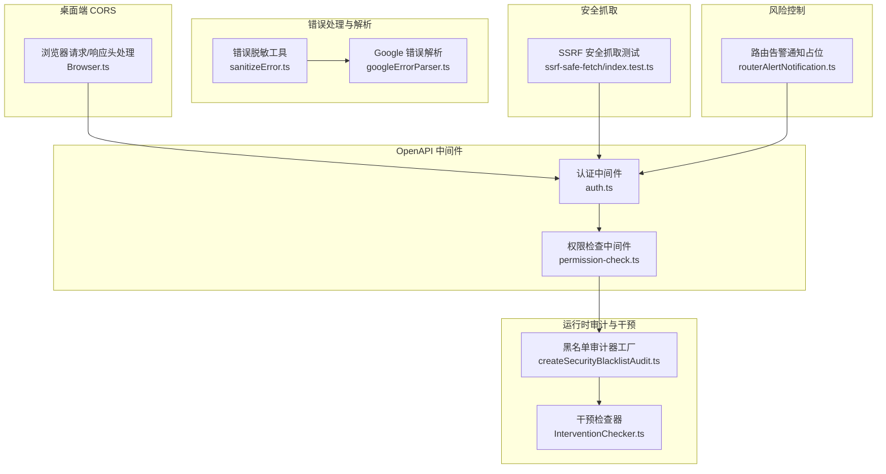
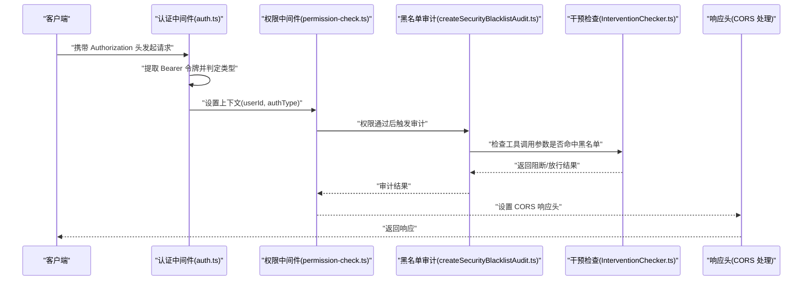
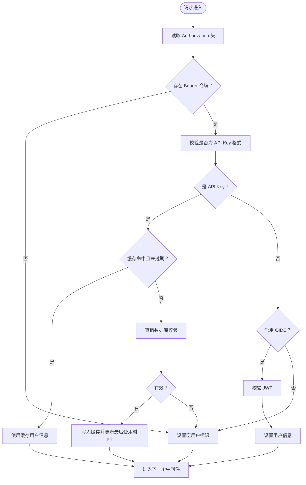
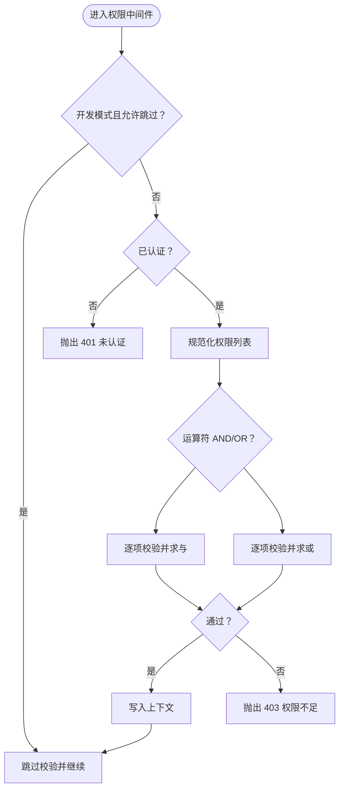
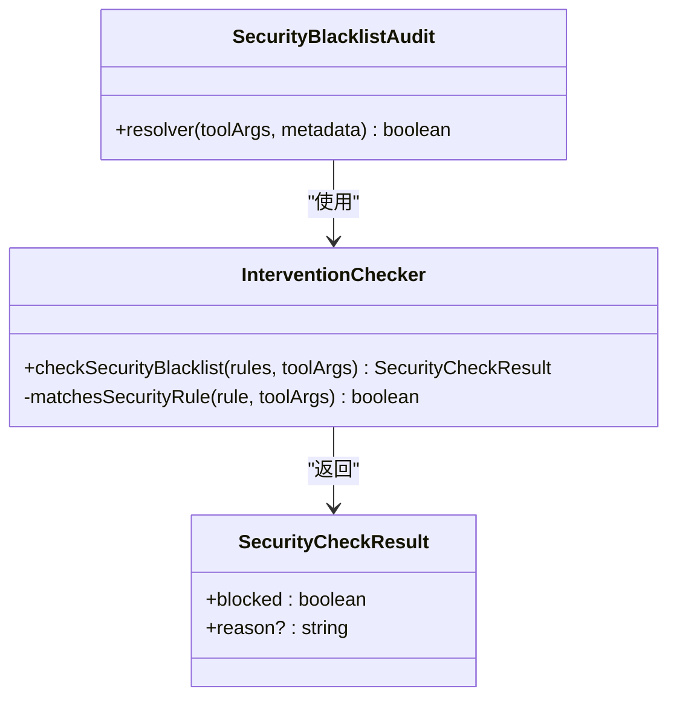
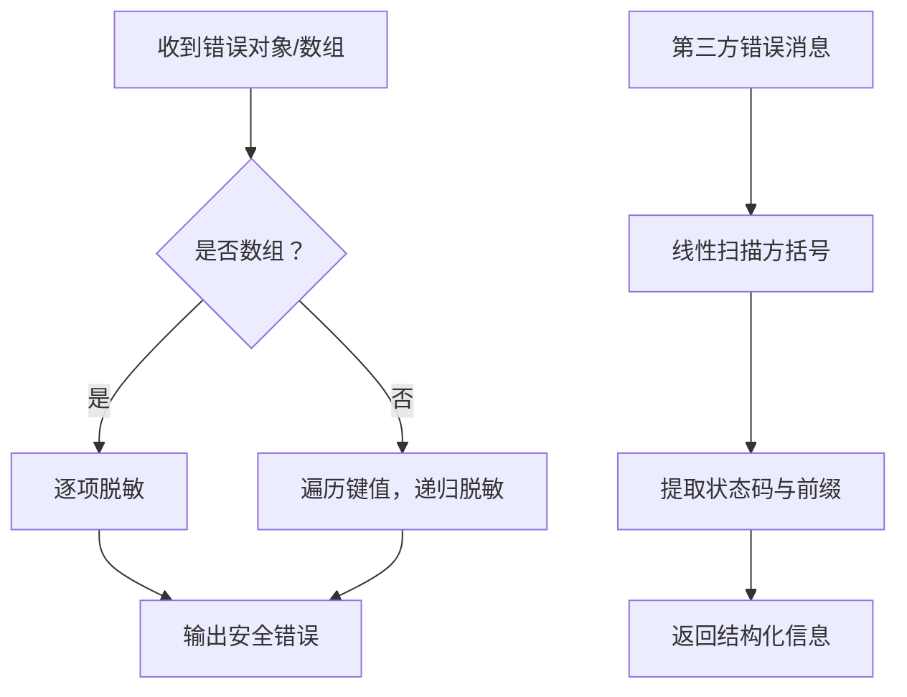
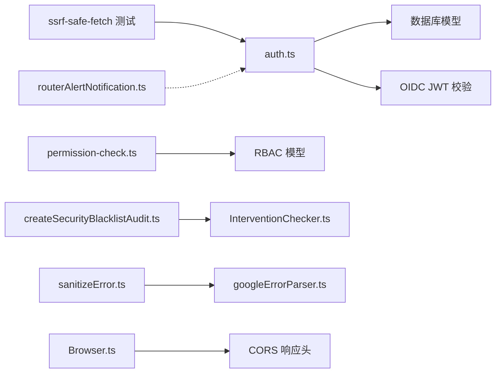

# API 安全防护

<cite>
**本文引用的文件**
- [packages/openapi/src/middleware/auth.ts](file://packages/openapi/src/middleware/auth.ts)
- [packages/openapi/src/middleware/permission-check.ts](file://packages/openapi/src/middleware/permission-check.ts)
- [packages/agent-runtime/src/audit/createSecurityBlacklistAudit.ts](file://packages/agent-runtime/src/audit/createSecurityBlacklistAudit.ts)
- [packages/agent-runtime/src/core/InterventionChecker.ts](file://packages/agent-runtime/src/core/InterventionChecker.ts)
- [packages/model-runtime/src/utils/sanitizeError.ts](file://packages/model-runtime/src/utils/sanitizeError.ts)
- [packages/model-runtime/src/utils/googleErrorParser.ts](file://packages/model-runtime/src/utils/googleErrorParser.ts)
- [src/server/services/riskControl/routerAlertNotification.ts](file://src/server/services/riskControl/routerAlertNotification.ts)
- [apps/desktop/src/main/core/browser/Browser.ts](file://apps/desktop/src/main/core/browser/Browser.ts)
- [packages/utils/src/server/index.ts](file://packages/utils/src/server/index.ts)
- [packages/ssrf-safe-fetch/index.test.ts](file://packages/ssrf-safe-fetch/index.test.ts)
- [docs/development/basic/architecture.zh-CN.mdx](file://docs/development/basic/architecture.zh-CN.mdx)
</cite>

## 目录

1. [简介](#简介)
2. [项目结构](#项目结构)
3. [核心组件](#核心组件)
4. [架构总览](#架构总览)
5. [组件详解](#组件详解)
6. [依赖关系分析](#依赖关系分析)
7. [性能考量](#性能考量)
8. [故障排查指南](#故障排查指南)
9. [结论](#结论)
10. [附录](#附录)

## 简介

本文件面向 LobeHub 项目的 API 安全防护体系，系统性梳理请求认证中间件（JWT 令牌验证、API 密钥管理）、访问控制（端点权限验证、参数校验、数据过滤）、风控策略（频率限制、IP 白名单、异常行为检测、攻击防护）、安全响应处理（错误标准化、敏感信息脱敏、安全日志）以及最佳实践（HTTPS 强制、CORS 配置、XSS 防护、SQL 注入防护）。文档同时给出可视化图示与定位路径，便于开发者快速理解与落地。

## 项目结构

围绕 API 安全的关键模块分布于 OpenAPI 中间件、RBAC 权限模型、运行时审计与干预、错误处理与解析工具、桌面端浏览器 CORS 处理、SSRF 安全抓取、以及风险控制告警服务等位置。

**图表来源**

- [packages/openapi/src/middleware/auth.ts](file://packages/openapi/src/middleware/auth.ts#L49-L206)
- [packages/openapi/src/middleware/permission-check.ts](file://packages/openapi/src/middleware/permission-check.ts#L43-L129)
- [packages/agent-runtime/src/audit/createSecurityBlacklistAudit.ts](file://packages/agent-runtime/src/audit/createSecurityBlacklistAudit.ts#L15-L31)
- [packages/agent-runtime/src/core/InterventionChecker.ts](file://packages/agent-runtime/src/core/InterventionChecker.ts#L39-L124)
- [packages/model-runtime/src/utils/sanitizeError.ts](file://packages/model-runtime/src/utils/sanitizeError.ts#L5-L59)
- [packages/model-runtime/src/utils/googleErrorParser.ts](file://packages/model-runtime/src/utils/googleErrorParser.ts#L40-L67)
- [apps/desktop/src/main/core/browser/Browser.ts](file://apps/desktop/src/main/core/browser/Browser.ts#L502-L539)
- [packages/ssrf-safe-fetch/index.test.ts](file://packages/ssrf-safe-fetch/index.test.ts#L263-L285)
- [src/server/services/riskControl/routerAlertNotification.ts](file://src/server/services/riskControl/routerAlertNotification.ts#L1-L30)

**章节来源**

- [packages/openapi/src/middleware/auth.ts](file://packages/openapi/src/middleware/auth.ts#L49-L206)
- [packages/openapi/src/middleware/permission-check.ts](file://packages/openapi/src/middleware/permission-check.ts#L43-L129)
- [packages/agent-runtime/src/audit/createSecurityBlacklistAudit.ts](file://packages/agent-runtime/src/audit/createSecurityBlacklistAudit.ts#L15-L31)
- [packages/agent-runtime/src/core/InterventionChecker.ts](file://packages/agent-runtime/src/core/InterventionChecker.ts#L39-L124)
- [packages/model-runtime/src/utils/sanitizeError.ts](file://packages/model-runtime/src/utils/sanitizeError.ts#L5-L59)
- [packages/model-runtime/src/utils/googleErrorParser.ts](file://packages/model-runtime/src/utils/googleErrorParser.ts#L40-L67)
- [apps/desktop/src/main/core/browser/Browser.ts](file://apps/desktop/src/main/core/browser/Browser.ts#L502-L539)
- [packages/ssrf-safe-fetch/index.test.ts](file://packages/ssrf-safe-fetch/index.test.ts#L263-L285)
- [src/server/services/riskControl/routerAlertNotification.ts](file://src/server/services/riskControl/routerAlertNotification.ts#L1-L30)

## 核心组件

- 认证中间件：支持 OIDC JWT 与 API Key 双通道认证；含缓存优化与调试模式绕过。
- 权限检查中间件：基于 RBAC 的多权限校验（AND/OR），支持开发模式跳过。
- 黑名单审计与干预：运行时对工具调用参数进行安全规则匹配，必要时阻断。
- 错误脱敏与解析：统一清理敏感字段，避免泄露；解析第三方错误中的状态码，规避 ReDoS。
- 桌面端 CORS：强制设置跨域响应头，避免重复与大小写问题。
- SSRF 安全抓取：通过白名单与私网地址策略限制出站请求。
- 风控告警（占位）：提供告警阈值与发送接口的抽象定义。

**章节来源**

- [packages/openapi/src/middleware/auth.ts](file://packages/openapi/src/middleware/auth.ts#L49-L206)
- [packages/openapi/src/middleware/permission-check.ts](file://packages/openapi/src/middleware/permission-check.ts#L43-L129)
- [packages/agent-runtime/src/audit/createSecurityBlacklistAudit.ts](file://packages/agent-runtime/src/audit/createSecurityBlacklistAudit.ts#L15-L31)
- [packages/agent-runtime/src/core/InterventionChecker.ts](file://packages/agent-runtime/src/core/InterventionChecker.ts#L39-L124)
- [packages/model-runtime/src/utils/sanitizeError.ts](file://packages/model-runtime/src/utils/sanitizeError.ts#L5-L59)
- [packages/model-runtime/src/utils/googleErrorParser.ts](file://packages/model-runtime/src/utils/googleErrorParser.ts#L40-L67)
- [apps/desktop/src/main/core/browser/Browser.ts](file://apps/desktop/src/main/core/browser/Browser.ts#L502-L539)
- [packages/ssrf-safe-fetch/index.test.ts](file://packages/ssrf-safe-fetch/index.test.ts#L263-L285)
- [src/server/services/riskControl/routerAlertNotification.ts](file://src/server/services/riskControl/routerAlertNotification.ts#L1-L30)

## 架构总览

下图展示从请求进入至响应返回的关键安全链路：认证、权限、审计、错误处理与响应头设置。

**图表来源**

- [packages/openapi/src/middleware/auth.ts](file://packages/openapi/src/middleware/auth.ts#L49-L206)
- [packages/openapi/src/middleware/permission-check.ts](file://packages/openapi/src/middleware/permission-check.ts#L43-L129)
- [packages/agent-runtime/src/audit/createSecurityBlacklistAudit.ts](file://packages/agent-runtime/src/audit/createSecurityBlacklistAudit.ts#L15-L31)
- [packages/agent-runtime/src/core/InterventionChecker.ts](file://packages/agent-runtime/src/core/InterventionChecker.ts#L39-L124)
- [apps/desktop/src/main/core/browser/Browser.ts](file://apps/desktop/src/main/core/browser/Browser.ts#L502-L539)

## 组件详解

### 认证中间件：JWT 与 API Key

- 支持两种认证方式：
  - API Key：lb- 前缀的短密钥，具备启用状态、过期时间与最后使用时间；采用内存缓存降低数据库压力，并定期清理过期条目。
  - OIDC JWT：当启用 OIDC 时，直接校验 JWT 并提取用户标识。
- 开发模式支持通过特殊请求头绕过认证，便于本地调试。
- 认证成功后将用户标识与认证类型注入上下文，供后续中间件与处理器使用。

**图表来源**

- [packages/openapi/src/middleware/auth.ts](file://packages/openapi/src/middleware/auth.ts#L49-L206)

**章节来源**

- [packages/openapi/src/middleware/auth.ts](file://packages/openapi/src/middleware/auth.ts#L49-L206)

### 权限检查中间件：RBAC 与多权限策略

- 基于 RBAC 的权限模型，支持：
  - 单权限校验
  - 任一权限满足（OR）
  - 全部权限满足（AND）
- 支持开发模式跳过权限校验，便于联调。
- 将权限校验结果写入上下文，供处理器复用。

**图表来源**

- [packages/openapi/src/middleware/permission-check.ts](file://packages/openapi/src/middleware/permission-check.ts#L43-L129)

**章节来源**

- [packages/openapi/src/middleware/permission-check.ts](file://packages/openapi/src/middleware/permission-check.ts#L43-L129)

### 运行时审计与干预：安全黑名单

- 黑名单审计器工厂根据元数据或默认规则生成动态审计器。
- 干预检查器对工具调用参数进行匹配，命中即阻断并附带原因。
- 默认策略不可被自动运行模式绕过，确保关键安全阈值。

**图表来源**

- [packages/agent-runtime/src/audit/createSecurityBlacklistAudit.ts](file://packages/agent-runtime/src/audit/createSecurityBlacklistAudit.ts#L15-L31)
- [packages/agent-runtime/src/core/InterventionChecker.ts](file://packages/agent-runtime/src/core/InterventionChecker.ts#L39-L124)

**章节来源**

- [packages/agent-runtime/src/audit/createSecurityBlacklistAudit.ts](file://packages/agent-runtime/src/audit/createSecurityBlacklistAudit.ts#L15-L31)
- [packages/agent-runtime/src/core/InterventionChecker.ts](file://packages/agent-runtime/src/core/InterventionChecker.ts#L39-L124)

### 错误处理与响应：脱敏与解析

- 错误脱敏：递归移除敏感字段（如 headers、authorization、apikey 等），大小写不敏感，保留安全信息。
- 错误解析：从第三方错误消息中提取状态码与前缀文本，避免正则 ReDoS，采用线性扫描策略。
- 响应头：桌面端强制设置 CORS 相关响应头，避免大小写与重复问题。

**图表来源**

- [packages/model-runtime/src/utils/sanitizeError.ts](file://packages/model-runtime/src/utils/sanitizeError.ts#L5-L59)
- [packages/model-runtime/src/utils/googleErrorParser.ts](file://packages/model-runtime/src/utils/googleErrorParser.ts#L40-L67)
- [apps/desktop/src/main/core/browser/Browser.ts](file://apps/desktop/src/main/core/browser/Browser.ts#L502-L539)

**章节来源**

- [packages/model-runtime/src/utils/sanitizeError.ts](file://packages/model-runtime/src/utils/sanitizeError.ts#L5-L59)
- [packages/model-runtime/src/utils/googleErrorParser.ts](file://packages/model-runtime/src/utils/googleErrorParser.ts#L40-L67)
- [apps/desktop/src/main/core/browser/Browser.ts](file://apps/desktop/src/main/core/browser/Browser.ts#L502-L539)

### SSRF 防护与白名单

- 通过环境变量与测试用例验证 SSRF 安全抓取能力，支持允许私网地址与 IP 白名单列表，防止内部网络探测与 SSRF 攻击。

**章节来源**

- [packages/ssrf-safe-fetch/index.test.ts](file://packages/ssrf-safe-fetch/index.test.ts#L263-L285)

### 风控告警（占位）

- 提供告警阈值与发送接口的抽象定义，当前为占位实现，便于后续接入监控系统。

**章节来源**

- [src/server/services/riskControl/routerAlertNotification.ts](file://src/server/services/riskControl/routerAlertNotification.ts#L1-L30)

## 依赖关系分析

- 认证中间件依赖数据库模型与 OIDC JWT 校验工具，输出用户标识与认证类型。
- 权限中间件依赖 RBAC 模型，读取用户权限并进行 AND/OR 判断。
- 审计与干预链路独立于业务，仅消费工具调用参数与规则集。
- 错误处理工具与解析工具解耦于上游服务，统一输出安全的错误形态。
- 桌面端浏览器模块负责响应头的强制设置，避免跨域问题。
- SSRF 抓取测试覆盖集成场景，保障出站请求安全。

**图表来源**

- [packages/openapi/src/middleware/auth.ts](file://packages/openapi/src/middleware/auth.ts#L5-L10)
- [packages/openapi/src/middleware/permission-check.ts](file://packages/openapi/src/middleware/permission-check.ts#L5-L6)
- [packages/agent-runtime/src/audit/createSecurityBlacklistAudit.ts](file://packages/agent-runtime/src/audit/createSecurityBlacklistAudit.ts#L1-L7)
- [packages/agent-runtime/src/core/InterventionChecker.ts](file://packages/agent-runtime/src/core/InterventionChecker.ts#L1-L9)
- [packages/model-runtime/src/utils/sanitizeError.ts](file://packages/model-runtime/src/utils/sanitizeError.ts#L1-L4)
- [packages/model-runtime/src/utils/googleErrorParser.ts](file://packages/model-runtime/src/utils/googleErrorParser.ts#L1-L6)
- [apps/desktop/src/main/core/browser/Browser.ts](file://apps/desktop/src/main/core/browser/Browser.ts#L502-L539)
- [packages/ssrf-safe-fetch/index.test.ts](file://packages/ssrf-safe-fetch/index.test.ts#L263-L285)
- [src/server/services/riskControl/routerAlertNotification.ts](file://src/server/services/riskControl/routerAlertNotification.ts#L1-L30)

**章节来源**

- 同上各文件

## 性能考量

- 认证缓存：API Key 校验结果缓存 5 分钟，减少数据库压力；定时清理过期缓存条目。
- 权限校验：权限列表标准化与按运算符快速判断，避免冗余查询。
- 错误处理：递归脱敏与线性扫描均避免复杂正则，降低 CPU 开销。
- CORS 设置：桌面端统一设置响应头，减少浏览器重复协商成本。

**章节来源**

- [packages/openapi/src/middleware/auth.ts](file://packages/openapi/src/middleware/auth.ts#L15-L43)
- [packages/openapi/src/middleware/permission-check.ts](file://packages/openapi/src/middleware/permission-check.ts#L61-L86)
- [packages/model-runtime/src/utils/sanitizeError.ts](file://packages/model-runtime/src/utils/sanitizeError.ts#L5-L59)
- [packages/model-runtime/src/utils/googleErrorParser.ts](file://packages/model-runtime/src/utils/googleErrorParser.ts#L40-L67)
- [apps/desktop/src/main/core/browser/Browser.ts](file://apps/desktop/src/main/core/browser/Browser.ts#L502-L539)

## 故障排查指南

- 认证失败
  - 检查 Authorization 头格式与令牌类型（API Key 或 JWT）。
  - 若为 API Key，确认启用状态与有效期；查看缓存是否命中。
  - 若为 OIDC，确认 ENABLE_OIDC 已开启且 JWT 可被正确校验。
- 权限不足
  - 确认用户是否已认证；核对所需权限集合与运算符（AND/OR）。
  - 开发模式下权限可能被跳过，检查 skipInDev 配置。
- 黑名单阻断
  - 查看审计器返回的阻断原因；调整工具调用参数或规则集。
- 错误泄露
  - 确保错误对象经过脱敏处理；检查敏感字段是否被遗漏。
- CORS 问题
  - 桌面端已强制设置响应头，检查请求头 Origin 是否正确传递。
- SSRF 风险
  - 核对私网与白名单配置；确保仅允许受信域名与 IP。

**章节来源**

- [packages/openapi/src/middleware/auth.ts](file://packages/openapi/src/middleware/auth.ts#L190-L203)
- [packages/openapi/src/middleware/permission-check.ts](file://packages/openapi/src/middleware/permission-check.ts#L54-L103)
- [packages/agent-runtime/src/audit/createSecurityBlacklistAudit.ts](file://packages/agent-runtime/src/audit/createSecurityBlacklistAudit.ts#L15-L31)
- [packages/model-runtime/src/utils/sanitizeError.ts](file://packages/model-runtime/src/utils/sanitizeError.ts#L18-L36)
- [apps/desktop/src/main/core/browser/Browser.ts](file://apps/desktop/src/main/core/browser/Browser.ts#L502-L539)
- [packages/ssrf-safe-fetch/index.test.ts](file://packages/ssrf-safe-fetch/index.test.ts#L263-L285)

## 结论

LobeHub 的 API 安全体系以 “认证 — 权限 — 审计 — 响应” 为主线，结合缓存优化、RBAC 策略、黑名单阻断、错误脱敏与 CORS 强制设置，形成多层防护闭环。建议在生产环境中启用 OIDC、严格管理 API Key 生命周期、完善风控告警与日志审计，并持续评估与迭代安全规则。

## 附录

- 最佳实践清单
  - HTTPS 强制：所有外部通信使用 TLS。
  - CORS 配置：桌面端已强制设置，线上环境需确保代理层一致。
  - XSS 防护：输出净化与 CSP 头已在架构文档中提及。
  - SQL 注入防护：Drizzle ORM 参数化查询已在架构文档中提及。
  - CSRF 防护：SameSite Cookie 与 Token 验证已在架构文档中提及。
  - 速率限制：边缘层限流已在架构文档中提及。
  - SSRF 防护：白名单与私网限制已在 SSRF 测试中体现。

**章节来源**

- [docs/development/basic/architecture.zh-CN.mdx](file://docs/development/basic/architecture.zh-CN.mdx#L131-L138)
- [apps/desktop/src/main/core/browser/Browser.ts](file://apps/desktop/src/main/core/browser/Browser.ts#L502-L539)
- [packages/ssrf-safe-fetch/index.test.ts](file://packages/ssrf-safe-fetch/index.test.ts#L263-L285)
