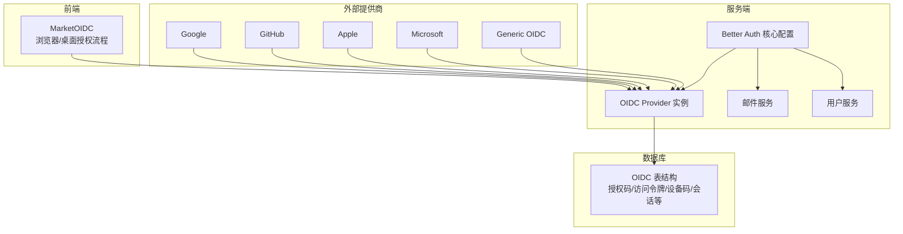
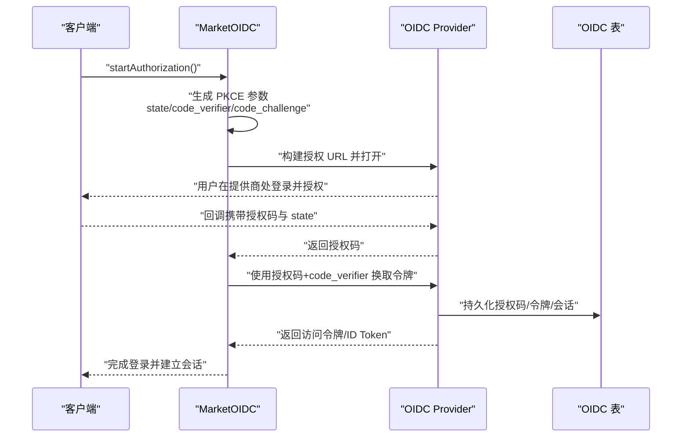
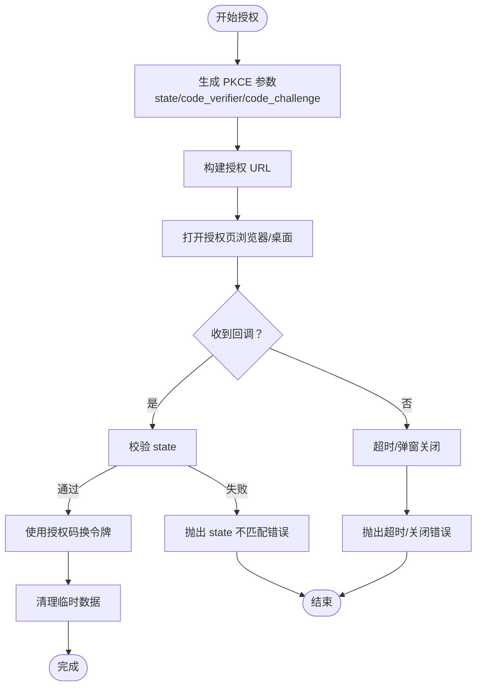
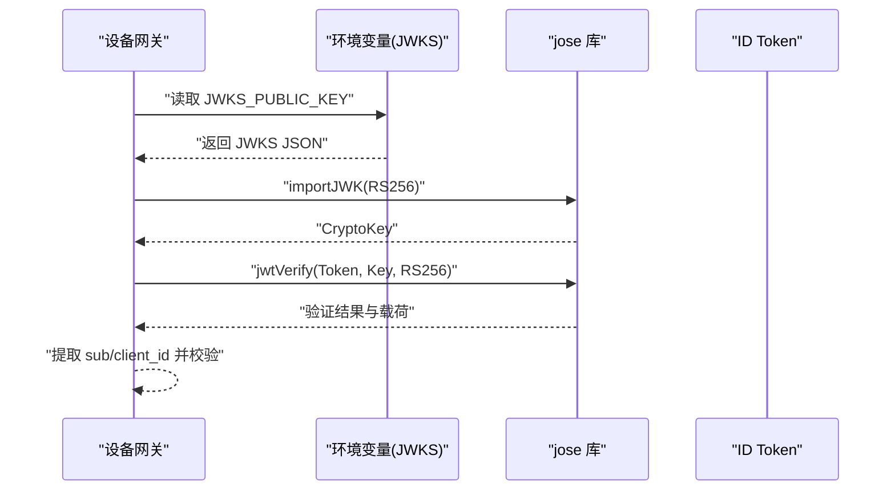
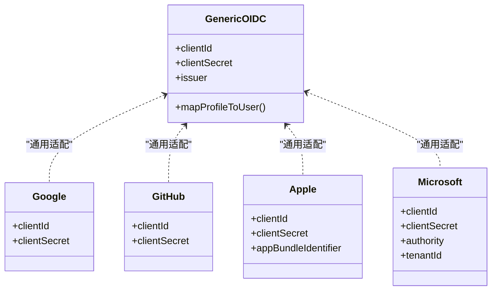
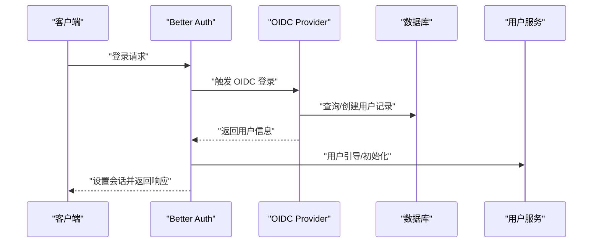
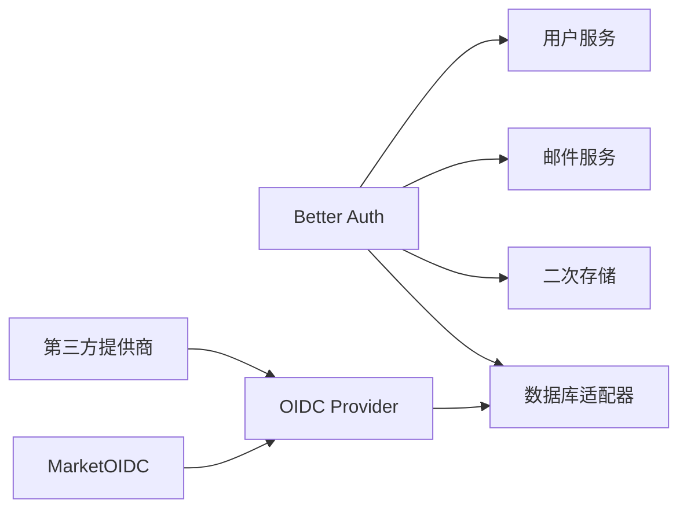

# OAuth2.0 与 OIDC 认证

<cite>
**本文引用的文件**
- [src/auth.ts](file://src/auth.ts)
- [src/libs/better-auth/define-config.ts](file://src/libs/better-auth/define-config.ts)
- [src/envs/auth.ts](file://src/envs/auth.ts)
- [src/libs/better-auth/sso/providers/generic-oidc.ts](file://src/libs/better-auth/sso/providers/generic-oidc.ts)
- [src/libs/better-auth/sso/providers/google.ts](file://src/libs/better-auth/sso/providers/google.ts)
- [src/libs/better-auth/sso/providers/github.ts](file://src/libs/better-auth/sso/providers/github.ts)
- [src/libs/better-auth/sso/providers/apple.ts](file://src/libs/better-auth/sso/providers/apple.ts)
- [src/libs/better-auth/sso/providers/microsoft.ts](file://src/libs/better-auth/sso/providers/microsoft.ts)
- [src/layout/AuthProvider/MarketAuth/oidc.ts](file://src/layout/AuthProvider/MarketAuth/oidc.ts)
- [apps/device-gateway/src/auth.ts](file://apps/device-gateway/src/auth.ts)
- [src/server/services/oidc/oidcProvider.ts](file://src/server/services/oidc/oidcProvider.ts)
- [packages/database/migrations/0020_add_oidc.sql](file://packages/database/migrations/0020_add_oidc.sql)
- [scripts/generate-oidc-jwk.mjs](file://scripts/generate-oidc-jwk.mjs)
- [src/libs/better-auth/sso/helpers.ts](file://src/libs/better-auth/sso/helpers.ts)
- [src/libs/better-auth/utils/config.ts](file://src/libs/better-auth/utils/config.ts)
- [src/libs/better-auth/plugins/email-whitelist.ts](file://src/libs/better-auth/plugins/email-whitelist.ts)
- [src/libs/better-auth/email-templates/index.ts](file://src/libs/better-auth/email-templates/index.ts)
- [src/server/services/email/index.ts](file://src/server/services/email/index.ts)
- [src/server/services/user/index.ts](file://src/server/services/user/index.ts)
- [src/libs/better-auth/sso/providers/logto.ts](file://src/libs/better-auth/sso/providers/logto.ts)
- [src/libs/better-auth/sso/providers/keycloak.ts](file://src/libs/better-auth/sso/providers/keycloak.ts)
- [src/libs/better-auth/sso/providers/auth0.ts](file://src/libs/better-auth/sso/providers/auth0.ts)
- [src/libs/better-auth/sso/providers/authelia.ts](file://src/libs/better-auth/sso/providers/authelia.ts)
- [src/libs/better-auth/sso/providers/authentik.ts](file://src/libs/better-auth/sso/providers/authentik.ts)
- [src/libs/better-auth/sso/providers/cloudflare-zero-trust.ts](file://src/libs/better-auth/sso/providers/cloudflare-zero-trust.ts)
- [src/libs/better-auth/sso/providers/okta.ts](file://src/libs/better-auth/sso/providers/okta.ts)
- [src/libs/better-auth/sso/providers/zitadel.ts](file://src/libs/better-auth/sso/providers/zitadel.ts)
- [src/libs/better-auth/sso/providers/feishu.ts](file://src/libs/better-auth/sso/providers/feishu.ts)
- [src/libs/better-auth/sso/providers/wechat.ts](file://src/libs/better-auth/sso/providers/wechat.ts)
- [src/libs/better-auth/sso/providers/casdoor.ts](file://src/libs/better-auth/sso/providers/casdoor.ts)
</cite>

## 目录
1. [简介](#简介)
2. [项目结构](#项目结构)
3. [核心组件](#核心组件)
4. [架构总览](#架构总览)
5. [详细组件分析](#详细组件分析)
6. [依赖关系分析](#依赖关系分析)
7. [性能考量](#性能考量)
8. [故障排查指南](#故障排查指南)
9. [结论](#结论)
10. [附录](#附录)

## 简介
本文件面向 LobeHub 的 OAuth2.0 与 OIDC 认证体系，系统性梳理授权码流程（PKCE）、隐式流程、客户端凭证流程、设备授权流程，以及 OIDC Connect 的集成方式（ID Token 验证、用户信息映射、多因素认证支持）。同时覆盖第三方认证提供商（Google、GitHub、Microsoft、Apple 等）的配置与适配，认证中间件与令牌解析、用户映射、会话建立的核心逻辑，并总结认证失败处理、重定向安全、CSRF 防护等安全最佳实践。

## 项目结构
围绕认证的关键目录与文件如下：
- 认证核心配置：Better Auth 定义与插件装配
- OIDC 提供商：内置与通用 OIDC 提供商定义
- 市场端 OIDC 流程：浏览器与桌面的授权与轮询
- 设备网关：桌面端令牌验证（JWKS/RSA）
- 数据库：OIDC 相关表结构
- 环境变量：认证相关密钥与提供商参数
- 工具脚本：JWKS 生成工具

**图表来源**
- [src/layout/AuthProvider/MarketAuth/oidc.ts](file://src/layout/AuthProvider/MarketAuth/oidc.ts#L1-L478)
- [src/libs/better-auth/define-config.ts](file://src/libs/better-auth/define-config.ts#L1-L333)
- [src/server/services/oidc/oidcProvider.ts](file://src/server/services/oidc/oidcProvider.ts#L1-L27)
- [packages/database/migrations/0020_add_oidc.sql](file://packages/database/migrations/0020_add_oidc.sql#L1-L125)
- [src/libs/better-auth/sso/providers/generic-oidc.ts](file://src/libs/better-auth/sso/providers/generic-oidc.ts#L1-L45)
- [src/libs/better-auth/sso/providers/google.ts](file://src/libs/better-auth/sso/providers/google.ts#L1-L31)
- [src/libs/better-auth/sso/providers/github.ts](file://src/libs/better-auth/sso/providers/github.ts#L1-L31)
- [src/libs/better-auth/sso/providers/apple.ts](file://src/libs/better-auth/sso/providers/apple.ts#L1-L34)
- [src/libs/better-auth/sso/providers/microsoft.ts](file://src/libs/better-auth/sso/providers/microsoft.ts#L1-L38)

**章节来源**
- [src/auth.ts](file://src/auth.ts#L1-L6)
- [src/libs/better-auth/define-config.ts](file://src/libs/better-auth/define-config.ts#L1-L333)
- [src/envs/auth.ts](file://src/envs/auth.ts#L1-L303)

## 核心组件
- Better Auth 核心配置：集中管理密码、邮箱验证码、魔法链接、Passkey、社交登录、通用 OAuth、管理员、二次存储、数据库钩子、速率限制等。
- OIDC Provider 实例：按需初始化，受环境开关控制；与数据库交互维护 OIDC 生命周期数据。
- 市场端 OIDC 工具类：封装 PKCE 参数生成、授权 URL 构建、授权码交换、浏览器/桌面授权流程、轮询与错误处理。
- 第三方提供商：内置 Google、GitHub、Apple、Microsoft，以及通用 OIDC 适配器。
- 设备网关：基于 JWKS 的 RS256 公钥导入与 JWT 验证，提取用户标识与客户端标识。
- 数据库：OIDC 表结构覆盖授权码、访问令牌、刷新令牌、设备码、会话、同意记录、交互记录、客户端等。

**章节来源**
- [src/libs/better-auth/define-config.ts](file://src/libs/better-auth/define-config.ts#L95-L332)
- [src/server/services/oidc/oidcProvider.ts](file://src/server/services/oidc/oidcProvider.ts#L15-L26)
- [src/layout/AuthProvider/MarketAuth/oidc.ts](file://src/layout/AuthProvider/MarketAuth/oidc.ts#L17-L478)
- [apps/device-gateway/src/auth.ts](file://apps/device-gateway/src/auth.ts#L1-L37)
- [packages/database/migrations/0020_add_oidc.sql](file://packages/database/migrations/0020_add_oidc.sql#L1-L125)

## 架构总览
下图展示从浏览器到服务端的授权码流程（含 PKCE），以及 OIDC Provider 的实例化与数据库交互。

**图表来源**
- [src/layout/AuthProvider/MarketAuth/oidc.ts](file://src/layout/AuthProvider/MarketAuth/oidc.ts#L183-L390)
- [src/server/services/oidc/oidcProvider.ts](file://src/server/services/oidc/oidcProvider.ts#L15-L26)
- [packages/database/migrations/0020_add_oidc.sql](file://packages/database/migrations/0020_add_oidc.sql#L1-L125)

## 详细组件分析

### 授权码流程（PKCE）与浏览器/桌面授权
- PKCE 参数生成：随机 code_verifier，通过 SHA-256 生成 code_challenge，并以安全字符集编码；state 随机生成用于 CSRF 防护。
- 授权 URL 构建：拼接 client_id、redirect_uri、response_type=code、scope、state、code_challenge、code_challenge_method=S256。
- 令牌交换：校验 state 一致性，读取 code_verifier，向令牌端点发起授权码兑换请求，处理非 2xx 错误并记录元信息。
- 浏览器弹窗：打开新窗口，监听消息事件与本地存储变化，优雅处理弹窗关闭与超时。
- 桌面授权：通过 IPC 打开系统浏览器，随后轮询手把手端点（handoff），等待授权结果或过期/消耗状态。

**图表来源**
- [src/layout/AuthProvider/MarketAuth/oidc.ts](file://src/layout/AuthProvider/MarketAuth/oidc.ts#L39-L95)
- [src/layout/AuthProvider/MarketAuth/oidc.ts](file://src/layout/AuthProvider/MarketAuth/oidc.ts#L100-L117)
- [src/layout/AuthProvider/MarketAuth/oidc.ts](file://src/layout/AuthProvider/MarketAuth/oidc.ts#L122-L178)
- [src/layout/AuthProvider/MarketAuth/oidc.ts](file://src/layout/AuthProvider/MarketAuth/oidc.ts#L183-L390)

**章节来源**
- [src/layout/AuthProvider/MarketAuth/oidc.ts](file://src/layout/AuthProvider/MarketAuth/oidc.ts#L17-L478)

### 隐式流程与客户端凭证流程
- 隐式流程：在浏览器端直接由授权服务器返回 access_token（不推荐），本仓库未见显式启用。
- 客户端凭证流程：用于机器对机器场景，Better Auth 的 genericOAuth 插件可承载该流程；本仓库通过通用 OIDC 提供商适配实现。

**章节来源**
- [src/libs/better-auth/sso/providers/generic-oidc.ts](file://src/libs/better-auth/sso/providers/generic-oidc.ts#L11-L26)

### OIDC Connect 集成与 ID Token 验证
- OIDC Provider 实例：按需创建，受 ENABLE_OIDC 开关控制；与数据库交互维护 OIDC 生命周期数据。
- ID Token 验证：通过 JWKS 获取公钥，使用 RS256 算法验证签名；桌面网关示例展示了公钥导入与 jwtVerify 的调用路径。
- 用户信息映射：通用 OIDC 提供商将上游字段映射为 Better Auth 用户字段，优先级策略确保名称可用。
- 多因素认证支持：Better Auth 支持多种认证方式组合，结合 OIDC Provider 可满足多因素场景。

**图表来源**
- [apps/device-gateway/src/auth.ts](file://apps/device-gateway/src/auth.ts#L1-L37)
- [src/envs/auth.ts](file://src/envs/auth.ts#L95-L102)
- [scripts/generate-oidc-jwk.mjs](file://scripts/generate-oidc-jwk.mjs)

**章节来源**
- [src/server/services/oidc/oidcProvider.ts](file://src/server/services/oidc/oidcProvider.ts#L15-L26)
- [apps/device-gateway/src/auth.ts](file://apps/device-gateway/src/auth.ts#L1-L37)
- [src/libs/better-auth/sso/providers/generic-oidc.ts](file://src/libs/better-auth/sso/providers/generic-oidc.ts#L21-L23)

### 设备授权流程（Device Flow）
- 设备码生成：OIDC Provider 生成设备码与用户码，绑定客户端与用户会话。
- 轮询验证：客户端以设备码轮询令牌端点，等待用户在授权端完成授权。
- 用户授权确认：用户在授权端确认授权后，令牌端点返回授权码或令牌。
- 过期与消耗处理：对 404/410 状态进行明确错误提示，避免重复使用已消费的设备码。

说明：设备授权流程的具体实现位于 OIDC Provider 层，配合数据库中的 oidc_device_codes 表进行状态管理。

**章节来源**
- [packages/database/migrations/0020_add_oidc.sql](file://packages/database/migrations/0020_add_oidc.sql#L59-L71)
- [src/server/services/oidc/oidcProvider.ts](file://src/server/services/oidc/oidcProvider.ts#L15-L26)

### 第三方认证提供商集成
- 内置提供商：Google、GitHub、Apple、Microsoft，均通过环境变量注入 clientId/clientSecret/tenant 等参数。
- 通用 OIDC：支持任意符合 OIDC 规范的提供商，通过 issuer、clientId、clientSecret 配置。
- 其他提供商：Logto、Keycloak、Auth0、Authelia、Authentik、Cloudflare Zero Trust、Okta、Zitadel、飞书、微信、Casdoor 等，均以类似模式在 Better Auth 中注册。

**图表来源**
- [src/libs/better-auth/sso/providers/generic-oidc.ts](file://src/libs/better-auth/sso/providers/generic-oidc.ts#L1-L45)
- [src/libs/better-auth/sso/providers/google.ts](file://src/libs/better-auth/sso/providers/google.ts#L1-L31)
- [src/libs/better-auth/sso/providers/github.ts](file://src/libs/better-auth/sso/providers/github.ts#L1-L31)
- [src/libs/better-auth/sso/providers/apple.ts](file://src/libs/better-auth/sso/providers/apple.ts#L1-L34)
- [src/libs/better-auth/sso/providers/microsoft.ts](file://src/libs/better-auth/sso/providers/microsoft.ts#L1-L38)

**章节来源**
- [src/libs/better-auth/sso/providers/google.ts](file://src/libs/better-auth/sso/providers/google.ts#L11-L27)
- [src/libs/better-auth/sso/providers/github.ts](file://src/libs/better-auth/sso/providers/github.ts#L11-L27)
- [src/libs/better-auth/sso/providers/apple.ts](file://src/libs/better-auth/sso/providers/apple.ts#L12-L18)
- [src/libs/better-auth/sso/providers/microsoft.ts](file://src/libs/better-auth/sso/providers/microsoft.ts#L12-L18)
- [src/libs/better-auth/sso/providers/generic-oidc.ts](file://src/libs/better-auth/sso/providers/generic-oidc.ts#L11-L26)

### 认证中间件与令牌解析、用户映射、会话建立
- Better Auth 中间件：自动处理会话缓存、二次存储、数据库钩子、账户关联策略、可信来源白名单等。
- 令牌解析：通过 OIDC Provider 与 JWKS 验证 ID Token；桌面网关使用 jose 库进行 RS256 验证。
- 用户映射：通用 OIDC 提供商将上游字段映射为 Better Auth 用户字段，优先级策略保证名称可用。
- 会话建立：登录成功后 Better Auth 自动写入会话 Cookie/存储，移动端通过 Expo 插件与 Passkey 插件增强体验。

**图表来源**
- [src/libs/better-auth/define-config.ts](file://src/libs/better-auth/define-config.ts#L203-L218)
- [src/server/services/user/index.ts](file://src/server/services/user/index.ts)

**章节来源**
- [src/libs/better-auth/define-config.ts](file://src/libs/better-auth/define-config.ts#L95-L332)
- [apps/device-gateway/src/auth.ts](file://apps/device-gateway/src/auth.ts#L21-L36)

## 依赖关系分析
- Better Auth 作为统一认证内核，依赖数据库适配器、二次存储、邮件服务、用户服务。
- OIDC Provider 依赖数据库实例，维护 OIDC 生命周期表。
- 市场端 OIDC 工具类依赖环境变量与 OIDC Provider。
- 第三方提供商通过 Better Auth 的通用 OAuth 插件或内置适配器接入。

**图表来源**
- [src/libs/better-auth/define-config.ts](file://src/libs/better-auth/define-config.ts#L1-L333)
- [src/server/services/oidc/oidcProvider.ts](file://src/server/services/oidc/oidcProvider.ts#L1-L27)
- [src/layout/AuthProvider/MarketAuth/oidc.ts](file://src/layout/AuthProvider/MarketAuth/oidc.ts#L1-L478)

**章节来源**
- [src/libs/better-auth/define-config.ts](file://src/libs/better-auth/define-config.ts#L1-L333)
- [src/server/services/oidc/oidcProvider.ts](file://src/server/services/oidc/oidcProvider.ts#L1-L27)

## 性能考量
- 会话缓存：Better Auth 启用 Cookie 缓存与二次存储，降低频繁查询数据库的压力。
- 数据库连接：Drizzle 适配器支持实验性 join，优化复杂查询性能。
- 代理网络：开发环境下为 OAuth 请求配置全局代理，减少网络延迟与失败率。
- 令牌交换：浏览器端采用一次性 PKCE 参数，避免重放攻击的同时保持低延迟。

**章节来源**
- [src/libs/better-auth/define-config.ts](file://src/libs/better-auth/define-config.ts#L177-L197)
- [src/libs/better-auth/define-config.ts](file://src/libs/better-auth/define-config.ts#L34-L48)

## 故障排查指南
- 授权失败（状态不匹配）：检查 sessionStorage 中 state 是否一致，确认回调是否被篡改。
- 无法打开弹窗：检查浏览器弹窗拦截设置，或切换到桌面系统浏览器。
- 超时/弹窗关闭：确认回调页面是否正确写入本地存储或消息通道，注意跨域隔离导致的 COOP 限制。
- 令牌交换失败：检查授权码是否过期、code_verifier 是否正确、redirect_uri 是否一致。
- OIDC 未启用：确认 ENABLE_OIDC 开关与 JWKS_KEY 配置，确保 OIDC Provider 正常初始化。
- 设备码过期/已消耗：重新发起设备授权流程，避免重复使用已消费的设备码。
- 邮件模板发送失败：检查邮件服务配置与模板渲染逻辑。

**章节来源**
- [src/layout/AuthProvider/MarketAuth/oidc.ts](file://src/layout/AuthProvider/MarketAuth/oidc.ts#L122-L178)
- [src/layout/AuthProvider/MarketAuth/oidc.ts](file://src/layout/AuthProvider/MarketAuth/oidc.ts#L244-L390)
- [src/envs/auth.ts](file://src/envs/auth.ts#L195-L196)
- [src/server/services/oidc/oidcProvider.ts](file://src/server/services/oidc/oidcProvider.ts#L17-L19)

## 结论
LobeHub 的认证体系以 Better Auth 为核心，结合 OIDC Provider 与通用/内置第三方提供商，实现了完整的 OAuth2.0 与 OIDC 集成。通过 PKCE、CSRF 防护、会话缓存与二次存储、邮件与用户引导等机制，兼顾安全性与易用性。设备授权流程与桌面令牌验证进一步完善了跨端登录体验。建议在生产环境中严格配置可信来源、启用 JWKS 与 OIDC、完善监控与告警，持续优化用户体验与安全基线。

## 附录
- OIDC 表结构概览：授权码、访问令牌、刷新令牌、设备码、会话、同意记录、交互记录、客户端等。
- JWKS 生成脚本：用于生成 RS256 密钥对，供 OIDC 与桌面令牌验证使用。

**章节来源**
- [packages/database/migrations/0020_add_oidc.sql](file://packages/database/migrations/0020_add_oidc.sql#L1-L125)
- [scripts/generate-oidc-jwk.mjs](file://scripts/generate-oidc-jwk.mjs)