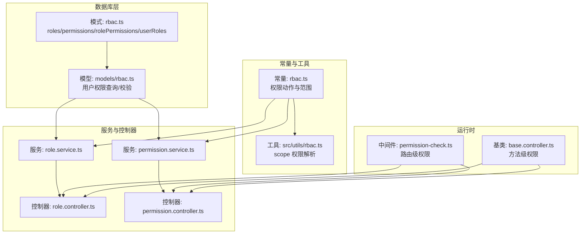
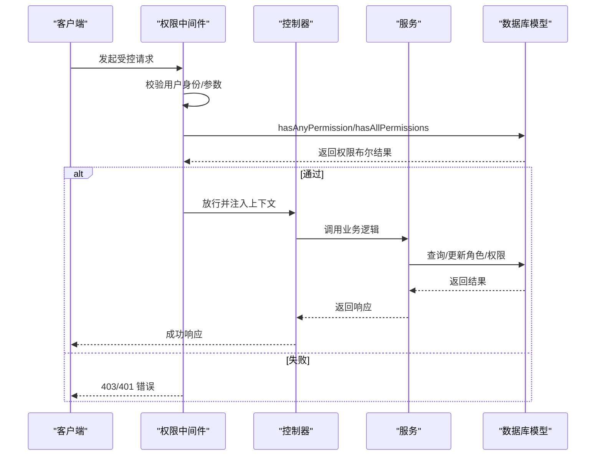
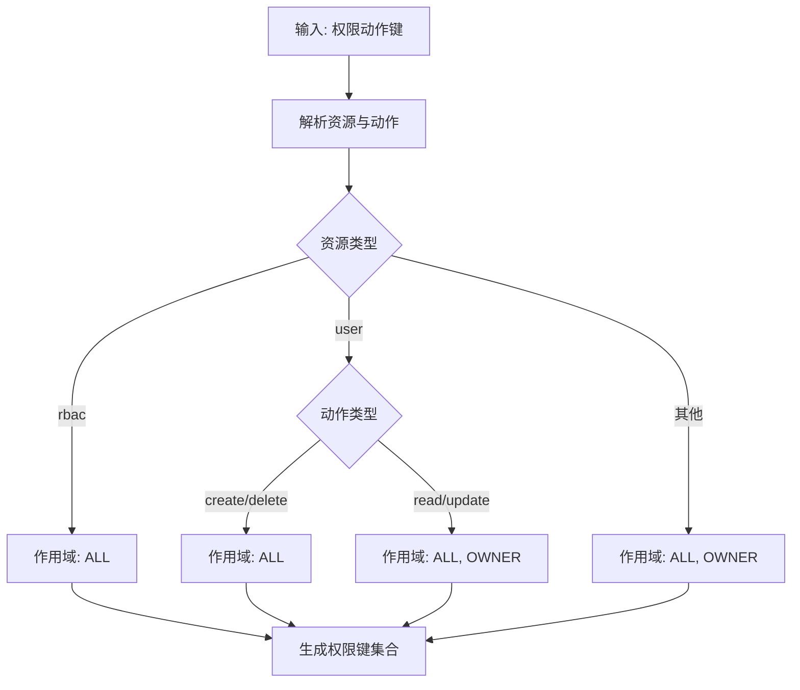
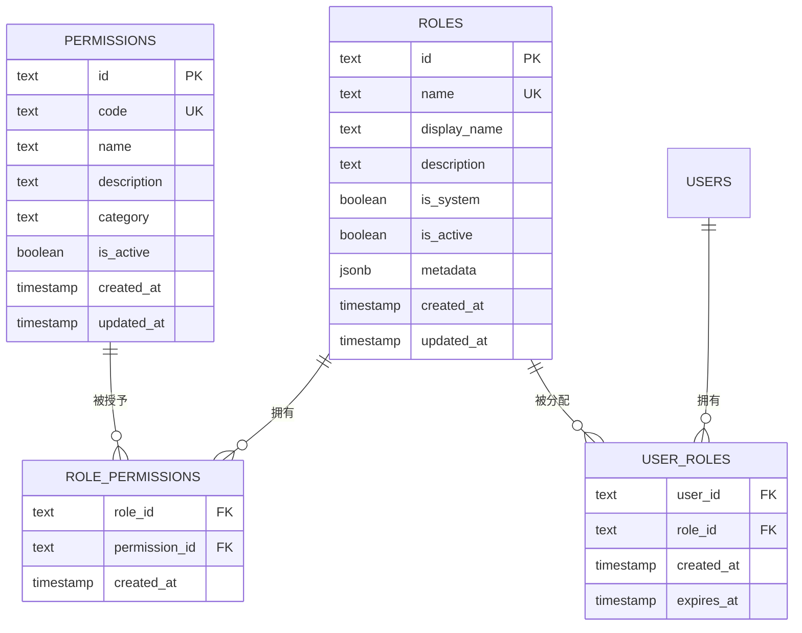
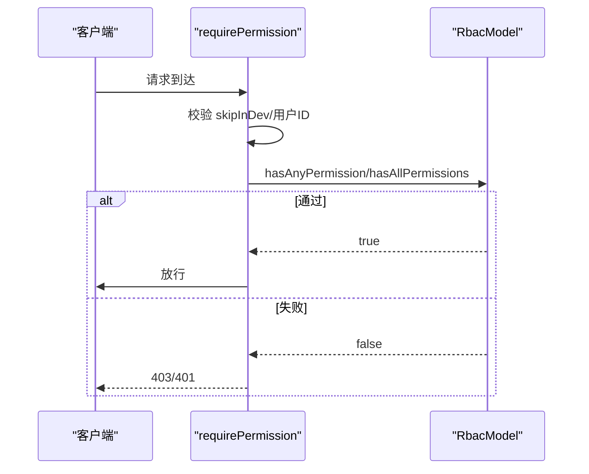
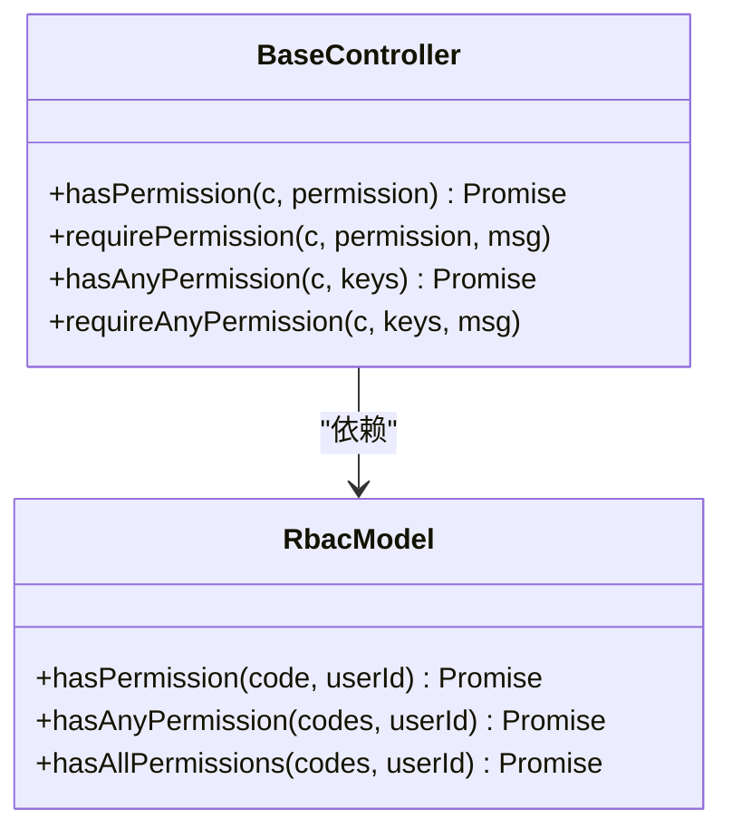
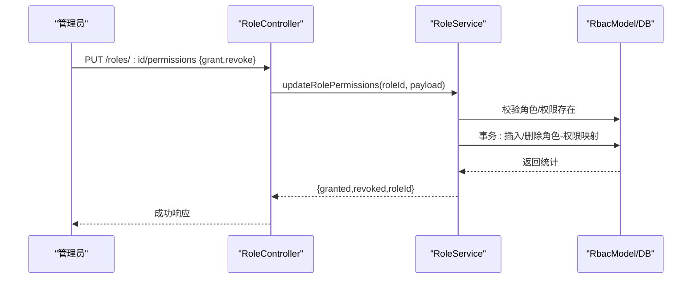
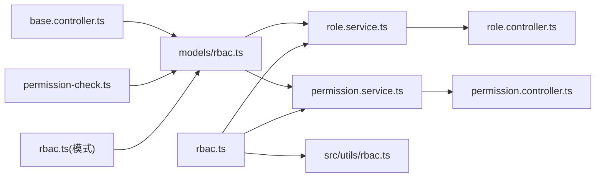

# RBAC 权限控制

<cite>
**本文档引用的文件**
- [packages/const/src/rbac.ts](file://packages/const/src/rbac.ts)
- [src/utils/rbac.ts](file://src/utils/rbac.ts)
- [packages/database/src/schemas/rbac.ts](file://packages/database/src/schemas/rbac.ts)
- [packages/database/src/models/rbac.ts](file://packages/database/src/models/rbac.ts)
- [packages/openapi/src/middleware/permission-check.ts](file://packages/openapi/src/middleware/permission-check.ts)
- [packages/openapi/src/common/base.controller.ts](file://packages/openapi/src/common/base.controller.ts)
- [packages/openapi/src/controllers/role.controller.ts](file://packages/openapi/src/controllers/role.controller.ts)
- [packages/openapi/src/services/role.service.ts](file://packages/openapi/src/services/role.service.ts)
- [packages/openapi/src/controllers/permission.controller.ts](file://packages/openapi/src/controllers/permission.controller.ts)
- [packages/openapi/src/services/permission.service.ts](file://packages/openapi/src/services/permission.service.ts)
</cite>

## 目录
1. [简介](#简介)
2. [项目结构](#项目结构)
3. [核心组件](#核心组件)
4. [架构总览](#架构总览)
5. [详细组件分析](#详细组件分析)
6. [依赖关系分析](#依赖关系分析)
7. [性能考虑](#性能考虑)
8. [故障排查指南](#故障排查指南)
9. [结论](#结论)
10. [附录](#附录)

## 简介
本文件面向 LobeHub 的 RBAC（基于角色的权限控制）系统，提供从权限模型设计到运行时执行、从 API 层到数据库层的全栈文档。内容涵盖：
- 角色与权限的定义与作用域
- 资源访问控制（API 端点、数据、功能模块）
- 权限检查的实现逻辑（运行时验证、AND/OR 语义、错误处理）
- 动态权限管理（规则配置、批量更新、审计）
- 权限控制中间件（路由级、组件级、方法级）
- 最佳实践（最小权限、权限分离、定期审查）

## 项目结构
RBAC 相关能力分布在常量定义、数据库模式与模型、OpenAPI 控制器与服务、以及权限中间件中，形成“常量定义 → 数据模型 → 业务服务 → 控制器 → 中间件”的分层。

图表来源
- [packages/const/src/rbac.ts](file://packages/const/src/rbac.ts#L1-L239)
- [src/utils/rbac.ts](file://src/utils/rbac.ts#L1-L45)
- [packages/database/src/schemas/rbac.ts](file://packages/database/src/schemas/rbac.ts#L1-L92)
- [packages/database/src/models/rbac.ts](file://packages/database/src/models/rbac.ts#L1-L224)
- [packages/openapi/src/controllers/role.controller.ts](file://packages/openapi/src/controllers/role.controller.ts#L1-L184)
- [packages/openapi/src/services/role.service.ts](file://packages/openapi/src/services/role.service.ts#L1-L504)
- [packages/openapi/src/controllers/permission.controller.ts](file://packages/openapi/src/controllers/permission.controller.ts#L1-L111)
- [packages/openapi/src/services/permission.service.ts](file://packages/openapi/src/services/permission.service.ts#L1-L95)
- [packages/openapi/src/middleware/permission-check.ts](file://packages/openapi/src/middleware/permission-check.ts#L1-L171)
- [packages/openapi/src/common/base.controller.ts](file://packages/openapi/src/common/base.controller.ts#L197-L259)

章节来源
- [packages/const/src/rbac.ts](file://packages/const/src/rbac.ts#L1-L239)
- [packages/database/src/schemas/rbac.ts](file://packages/database/src/schemas/rbac.ts#L1-L92)

## 核心组件
- 权限动作与范围常量：定义系统内所有可执行动作（如 agent:create、rbac:role_update），并根据资源类型推导允许的作用域（ALL、OWNER），生成完整的权限键集合。
- 数据库模式：包含角色表、权限表、角色-权限关联表、用户-角色关联表，并支持临时角色过期时间。
- 权限模型：封装用户权限查询、权限校验（单个/任意/全部）、用户角色查询、用户角色更新等核心逻辑。
- OpenAPI 控制器与服务：提供角色与权限的 CRUD、角色权限批量更新、权限列表查询等接口。
- 权限中间件与基类：在路由层与方法层提供统一的权限检查入口，支持 AND/OR 语义与开发环境跳过。

章节来源
- [packages/const/src/rbac.ts](file://packages/const/src/rbac.ts#L8-L156)
- [packages/database/src/schemas/rbac.ts](file://packages/database/src/schemas/rbac.ts#L7-L92)
- [packages/database/src/models/rbac.ts](file://packages/database/src/models/rbac.ts#L14-L224)
- [packages/openapi/src/controllers/role.controller.ts](file://packages/openapi/src/controllers/role.controller.ts#L17-L184)
- [packages/openapi/src/services/role.service.ts](file://packages/openapi/src/services/role.service.ts#L21-L504)
- [packages/openapi/src/controllers/permission.controller.ts](file://packages/openapi/src/controllers/permission.controller.ts#L15-L111)
- [packages/openapi/src/services/permission.service.ts](file://packages/openapi/src/services/permission.service.ts#L17-L95)
- [packages/openapi/src/middleware/permission-check.ts](file://packages/openapi/src/middleware/permission-check.ts#L43-L171)
- [packages/openapi/src/common/base.controller.ts](file://packages/openapi/src/common/base.controller.ts#L197-L259)

## 架构总览
下图展示从请求进入至权限判定的整体流程，包括路由中间件、控制器、服务与数据库模型之间的交互。

图表来源
- [packages/openapi/src/middleware/permission-check.ts](file://packages/openapi/src/middleware/permission-check.ts#L43-L129)
- [packages/database/src/models/rbac.ts](file://packages/database/src/models/rbac.ts#L89-L156)
- [packages/openapi/src/common/base.controller.ts](file://packages/openapi/src/common/base.controller.ts#L207-L259)

## 详细组件分析

### 权限模型与作用域设计
- 权限动作：以“资源:动作”形式定义，覆盖代理、AI 基础设施、API Key、文档、文件、知识库、消息、翻译、RBAC 管理、会话、会话组、话题、用户等。
- 作用域：默认支持 ALL 与 OWNER；RBAC 与 user 资源有特殊策略（如 user 的 create/delete 仅 ALL，而 read/update 允许 OWNER）。
- 权限键生成：将动作与允许的作用域组合，生成最终权限键集合，便于运行时匹配。

图表来源
- [packages/const/src/rbac.ts](file://packages/const/src/rbac.ts#L169-L188)
- [packages/const/src/rbac.ts](file://packages/const/src/rbac.ts#L195-L214)

章节来源
- [packages/const/src/rbac.ts](file://packages/const/src/rbac.ts#L8-L156)
- [packages/const/src/rbac.ts](file://packages/const/src/rbac.ts#L169-L188)
- [packages/const/src/rbac.ts](file://packages/const/src/rbac.ts#L195-L214)

### 数据库模型与关系
- 角色表（roles）：唯一名称、显示名、描述、系统/激活状态、元数据与时间戳。
- 权限表（permissions）：唯一 code、名称、描述、分类、激活状态。
- 关联表：
  - 角色-权限（rolePermissions）：多对多，主键为 (roleId, permissionId)，带索引。
  - 用户-角色（userRoles）：多对多，支持临时角色过期时间。
- 查询路径：用户权限 = 用户关联角色 → 角色关联权限 → 过滤激活状态与未过期角色。

图表来源
- [packages/database/src/schemas/rbac.ts](file://packages/database/src/schemas/rbac.ts#L7-L92)

章节来源
- [packages/database/src/schemas/rbac.ts](file://packages/database/src/schemas/rbac.ts#L7-L92)
- [packages/database/src/models/rbac.ts](file://packages/database/src/models/rbac.ts#L28-L81)

### 权限检查与中间件
- 中间件职责：在路由层拦截请求，读取上下文中的用户 ID，调用 RbacModel 执行权限校验，支持 AND/OR 与开发环境跳过。
- 错误处理：未认证返回 401，权限不足返回 403，并记录详细原因（所需权限、运算符、用户 ID）。
- 上下文注入：通过 c.set 注入 checkedPermissions，供后续处理器使用。

图表来源
- [packages/openapi/src/middleware/permission-check.ts](file://packages/openapi/src/middleware/permission-check.ts#L43-L129)
- [packages/database/src/models/rbac.ts](file://packages/database/src/models/rbac.ts#L118-L156)

章节来源
- [packages/openapi/src/middleware/permission-check.ts](file://packages/openapi/src/middleware/permission-check.ts#L11-L171)

### 方法级权限与控制器基类
- 基类提供 hasPermission/requirePermission 与 hasAnyPermission/requireAnyPermission，统一在控制器中进行权限校验。
- 适用于组件内部或服务层的细粒度权限判断。

图表来源
- [packages/openapi/src/common/base.controller.ts](file://packages/openapi/src/common/base.controller.ts#L197-L259)
- [packages/database/src/models/rbac.ts](file://packages/database/src/models/rbac.ts#L89-L156)

章节来源
- [packages/openapi/src/common/base.controller.ts](file://packages/openapi/src/common/base.controller.ts#L197-L259)

### 角色与权限管理 API
- 角色管理：列出、创建、详情、更新、删除、清空权限映射、按角色查询权限列表。
- 权限管理：列表、详情、创建、更新、删除。
- 权限批量更新：grant/revoke 权限 ID 集合，自动去重与冲突消除，事务保证原子性。

图表来源
- [packages/openapi/src/controllers/role.controller.ts](file://packages/openapi/src/controllers/role.controller.ts#L106-L123)
- [packages/openapi/src/services/role.service.ts](file://packages/openapi/src/services/role.service.ts#L253-L357)
- [packages/database/src/models/rbac.ts](file://packages/database/src/models/rbac.ts#L197-L222)

章节来源
- [packages/openapi/src/controllers/role.controller.ts](file://packages/openapi/src/controllers/role.controller.ts#L17-L184)
- [packages/openapi/src/services/role.service.ts](file://packages/openapi/src/services/role.service.ts#L21-L504)

### 资源访问控制机制
- API 端点权限：通过 requireAnyPermission/requireAllPermissions 在路由层强制校验。
- 数据访问权限：RbacModel 在查询用户权限时过滤激活角色与未过期角色，确保权限有效性。
- 功能模块权限：通过 RBAC_PERMISSIONS 键集合与 getAllScopePermissions/getScopePermissions 动态解析权限范围，支持前端按需渲染。

章节来源
- [packages/openapi/src/middleware/permission-check.ts](file://packages/openapi/src/middleware/permission-check.ts#L71-L105)
- [packages/database/src/models/rbac.ts](file://packages/database/src/models/rbac.ts#L28-L50)
- [src/utils/rbac.ts](file://src/utils/rbac.ts#L10-L44)

## 依赖关系分析
- 常量层依赖：RBAC_PERMISSIONS 由 PERMISSION_ACTIONS 与作用域计算生成，供服务与工具函数使用。
- 服务层依赖：RoleService/PermissionService 使用 RbacModel 进行权限校验与数据访问。
- 控制器层依赖：控制器依赖对应服务，服务再依赖数据库模型与常量。
- 中间件依赖：中间件直接依赖 RbacModel 与数据库适配器。

图表来源
- [packages/const/src/rbac.ts](file://packages/const/src/rbac.ts#L1-L239)
- [src/utils/rbac.ts](file://src/utils/rbac.ts#L1-L45)
- [packages/database/src/schemas/rbac.ts](file://packages/database/src/schemas/rbac.ts#L1-L92)
- [packages/database/src/models/rbac.ts](file://packages/database/src/models/rbac.ts#L1-L224)
- [packages/openapi/src/services/role.service.ts](file://packages/openapi/src/services/role.service.ts#L1-L504)
- [packages/openapi/src/services/permission.service.ts](file://packages/openapi/src/services/permission.service.ts#L1-L95)
- [packages/openapi/src/controllers/role.controller.ts](file://packages/openapi/src/controllers/role.controller.ts#L1-L184)
- [packages/openapi/src/controllers/permission.controller.ts](file://packages/openapi/src/controllers/permission.controller.ts#L1-L111)
- [packages/openapi/src/middleware/permission-check.ts](file://packages/openapi/src/middleware/permission-check.ts#L1-L171)
- [packages/openapi/src/common/base.controller.ts](file://packages/openapi/src/common/base.controller.ts#L197-L259)

## 性能考虑
- 查询优化
  - 关联表索引：rolePermissions 与 userRoles 的复合主键与单列索引，减少 JOIN 与过滤成本。
  - 过滤条件：在用户权限查询中同时过滤激活状态与未过期角色，避免无效数据参与计算。
- 并发与事务
  - 批量权限更新使用事务，保证 grant/revoke 的一致性与原子性。
- 缓存建议
  - 可在应用层对热点用户权限进行短期缓存（如 Redis），结合权限变更事件失效，降低数据库压力。
- 日志与可观测性
  - 中间件与服务层均记录权限检查日志，便于定位性能瓶颈与异常。

章节来源
- [packages/database/src/schemas/rbac.ts](file://packages/database/src/schemas/rbac.ts#L59-L87)
- [packages/database/src/models/rbac.ts](file://packages/database/src/models/rbac.ts#L28-L50)
- [packages/openapi/src/services/role.service.ts](file://packages/openapi/src/services/role.service.ts#L289-L357)

## 故障排查指南
- 常见错误
  - 未认证：中间件检测到 userId 缺失，返回 401。
  - 权限不足：中间件或基类校验失败，返回 403，并包含所需权限与运算符信息。
  - 参数错误：控制器/服务对请求体进行校验，返回 400。
- 定位步骤
  - 查看中间件日志：确认是否跳过了开发环境校验、用户 ID 是否正确。
  - 核对权限键：确认请求使用的权限键是否存在于 RBAC_PERMISSIONS。
  - 检查角色与权限映射：确认角色处于激活状态且未过期，权限处于激活状态。
- 排障要点
  - 临时角色过期：userRoles.expiry 字段为空或未来时间才有效。
  - 批量更新冲突：grant 与 revoke 的交集会被抵消，确保传入的 ID 数组有效。

章节来源
- [packages/openapi/src/middleware/permission-check.ts](file://packages/openapi/src/middleware/permission-check.ts#L54-L103)
- [packages/openapi/src/common/base.controller.ts](file://packages/openapi/src/common/base.controller.ts#L207-L259)
- [packages/database/src/models/rbac.ts](file://packages/database/src/models/rbac.ts#L44-L46)

## 结论
LobeHub 的 RBAC 系统以清晰的权限动作与作用域定义为基础，配合数据库层面的角色-权限关联与用户-角色关联，实现了灵活且可扩展的权限控制。通过中间件与控制器基类，系统在路由与方法两个层级提供了统一的权限入口，支持 AND/OR 与开发环境跳过等实用特性。建议在生产环境中引入权限缓存与审计追踪，持续进行权限审查与最小权限实践，保障系统安全与合规。

## 附录
- 最小权限原则：仅授予完成任务所需的最小权限集合。
- 权限分离：将高危操作拆分为多个低权限动作，避免集中风险。
- 定期权限审查：周期性清理无效角色与过期临时角色，核对权限映射。
- 审计追踪：记录权限变更与访问日志，支持回溯与合规检查。