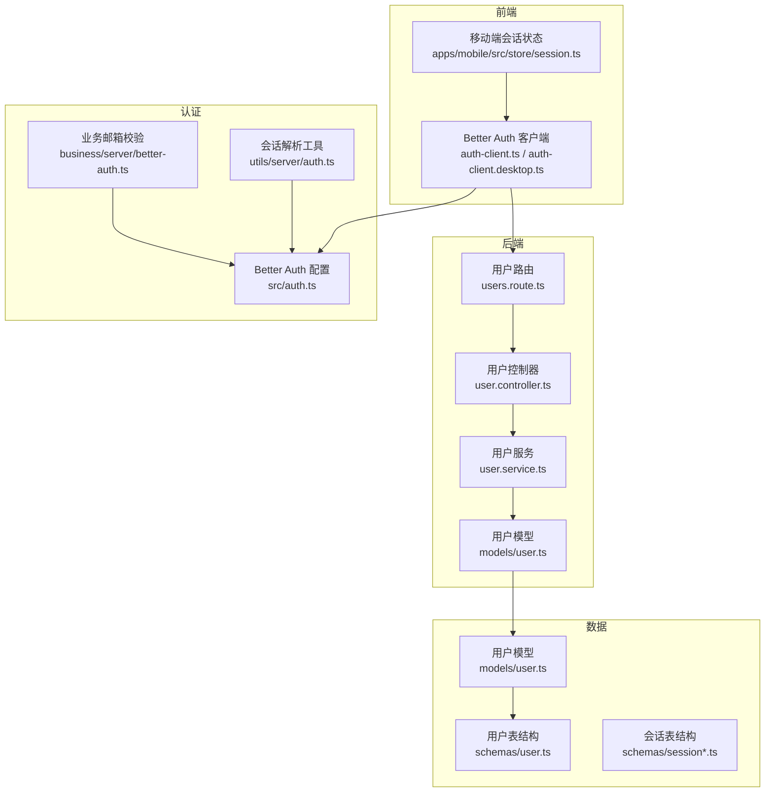
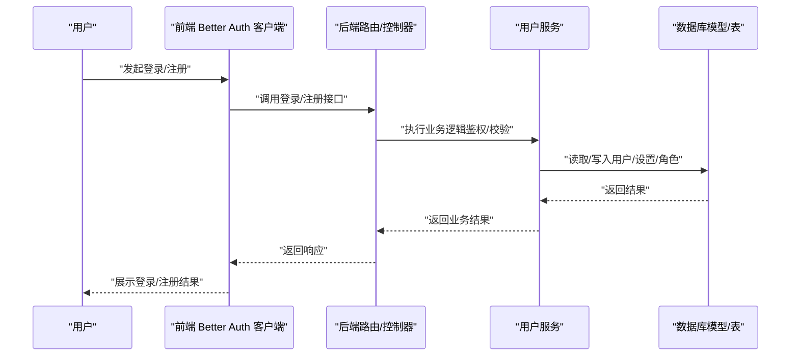
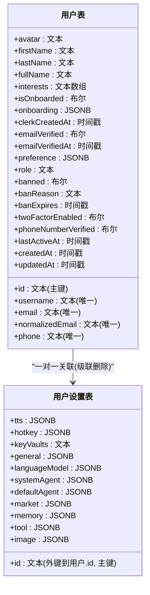
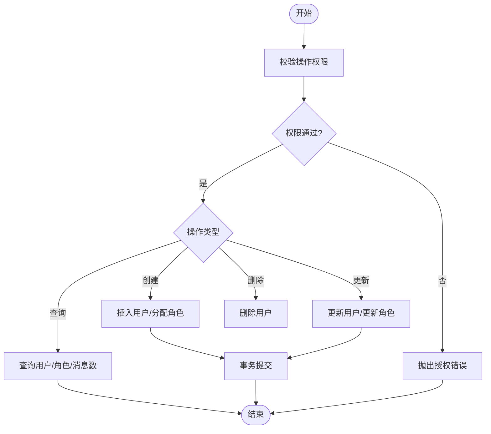
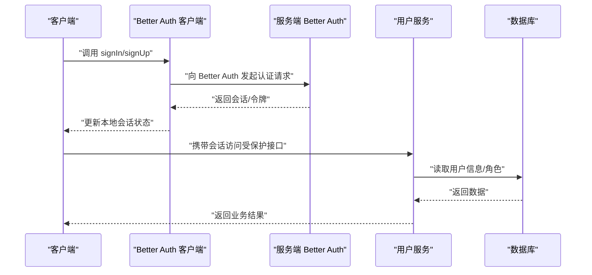
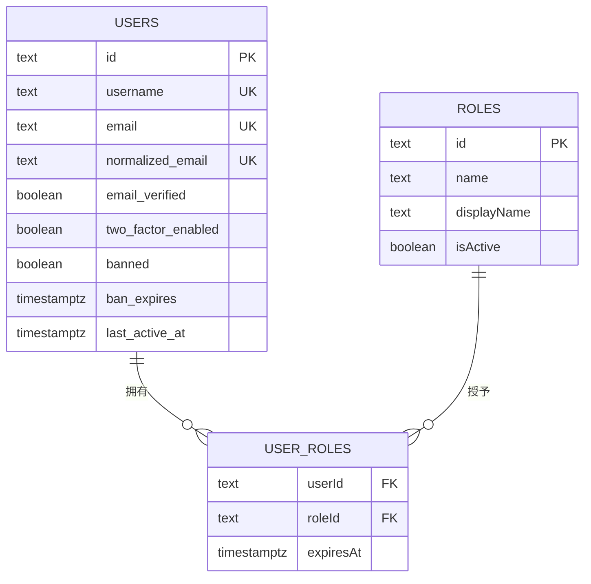
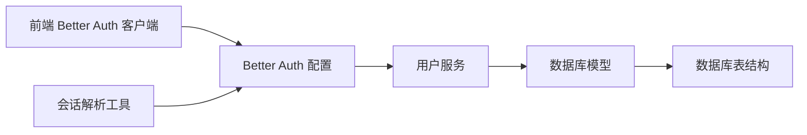

# 用户管理

<cite>
**本文引用的文件**
- [packages/const/src/user.ts](file://packages/const/src/user.ts)
- [packages/database/src/schemas/user.ts](file://packages/database/src/schemas/user.ts)
- [packages/database/src/models/user.ts](file://packages/database/src/models/user.ts)
- [packages/openapi/src/services/user.service.ts](file://packages/openapi/src/services/user.service.ts)
- [packages/openapi/src/routes/users.route.ts](file://packages/openapi/src/routes/users.route.ts)
- [packages/openapi/src/controllers/user.controller.ts](file://packages/openapi/src/controllers/user.controller.ts)
- [packages/openapi/src/types/user.type.ts](file://packages/openapi/src/types/user.type.ts)
- [packages/utils/src/server/auth.ts](file://packages/utils/src/server/auth.ts)
- [src/libs/better-auth/auth-client.ts](file://src/libs/better-auth/auth-client.ts)
- [src/libs/better-auth/auth-client.desktop.ts](file://src/libs/better-auth/auth-client.desktop.ts)
- [src/auth.ts](file://src/auth.ts)
- [src/business/server/better-auth.ts](file://src/business/server/better-auth.ts)
- [apps/mobile/src/store/session.ts](file://apps/mobile/src/store/session.ts)
- [packages/database/src/models/session.ts](file://packages/database/src/models/session.ts)
- [packages/database/src/schemas/session.ts](file://packages/database/src/schemas/session.ts)
- [packages/database/src/models/sessionGroup.ts](file://packages/database/src/models/sessionGroup.ts)
- [packages/database/src/schemas/sessionGroup.ts](file://packages/database/src/schemas/sessionGroup.ts)
- [scripts/clerk-to-betterauth/export-clerk-users-with-api.ts](file://scripts/clerk-to-betterauth/export-clerk-users-with-api.ts)
</cite>

## 目录

1. [简介](#简介)
2. [项目结构](#项目结构)
3. [核心组件](#核心组件)
4. [架构总览](#架构总览)
5. [详细组件分析](#详细组件分析)
6. [依赖关系分析](#依赖关系分析)
7. [性能考量](#性能考量)
8. [故障排查指南](#故障排查指南)
9. [结论](#结论)
10. [附录](#附录)

## 简介

本文件面向 LobeHub 的用户管理系统，围绕用户注册、登录、个人信息管理、状态与会话生命周期、角色与权限模型、安全与隐私保护、界面组件设计以及审计与异常行为检测等方面进行系统化说明。文档以仓库现有实现为依据，结合数据库模式、后端服务、认证客户端与前端交互，形成可读性强、便于实施的技术文档。

## 项目结构

用户管理相关代码主要分布在以下区域：

- 数据层：数据库表结构与模型封装，负责用户与用户设置、会话与会话组、插件安装等数据持久化。
- 业务层：用户服务实现，提供用户 CRUD、角色与权限管理、分页查询、审计日志等能力。
- 认证层：基于 Better Auth 的客户端与服务端配置，支持邮箱 / 密码、社交账号、魔法链接等多种登录方式，并提供会话状态管理。
- 前端层：React 客户端封装 Better Auth 能力，提供登录、注册、修改资料、绑定社交账号等 UI 交互。
- 迁移与工具：从 Clerk 迁移到 Better Auth 的用户导出脚本，保障历史用户平滑迁移。

图表来源

- [src/libs/better-auth/auth-client.ts](file://src/libs/better-auth/auth-client.ts#L1-L34)
- [src/libs/better-auth/auth-client.desktop.ts](file://src/libs/better-auth/auth-client.desktop.ts#L1-L59)
- [src/auth.ts](file://src/auth.ts#L1-L6)
- [src/business/server/better-auth.ts](file://src/business/server/better-auth.ts#L1-L5)
- [packages/utils/src/server/auth.ts](file://packages/utils/src/server/auth.ts#L1-L61)
- [packages/openapi/src/routes/users.route.ts](file://packages/openapi/src/routes/users.route.ts)
- [packages/openapi/src/controllers/user.controller.ts](file://packages/openapi/src/controllers/user.controller.ts)
- [packages/openapi/src/services/user.service.ts](file://packages/openapi/src/services/user.service.ts#L1-L547)
- [packages/database/src/schemas/user.ts](file://packages/database/src/schemas/user.ts#L1-L109)
- [packages/database/src/models/user.ts](file://packages/database/src/models/user.ts#L1-L418)
- [packages/database/src/schemas/session.ts](file://packages/database/src/schemas/session.ts)
- [packages/database/src/schemas/sessionGroup.ts](file://packages/database/src/schemas/sessionGroup.ts)
- [apps/mobile/src/store/session.ts](file://apps/mobile/src/store/session.ts)

章节来源

- [packages/database/src/schemas/user.ts](file://packages/database/src/schemas/user.ts#L1-L109)
- [packages/database/src/models/user.ts](file://packages/database/src/models/user.ts#L1-L418)
- [packages/openapi/src/services/user.service.ts](file://packages/openapi/src/services/user.service.ts#L1-L547)
- [packages/utils/src/server/auth.ts](file://packages/utils/src/server/auth.ts#L1-L61)
- [src/libs/better-auth/auth-client.ts](file://src/libs/better-auth/auth-client.ts#L1-L34)
- [src/libs/better-auth/auth-client.desktop.ts](file://src/libs/better-auth/auth-client.desktop.ts#L1-L59)
- [src/auth.ts](file://src/auth.ts#L1-L6)
- [src/business/server/better-auth.ts](file://src/business/server/better-auth.ts#L1-L5)
- [apps/mobile/src/store/session.ts](file://apps/mobile/src/store/session.ts)

## 核心组件

- 用户数据模型与默认偏好
  - 默认偏好与引导开关由常量定义，用于初始化新用户的偏好设置。
  - 用户表包含基础字段、SSO 标识、偏好、角色与封禁状态、两步验证、手机号验证、活跃时间等。
  - 用户设置表独立存储多类配置（如通用、热键、TTS、语言模型、默认代理、市场、记忆、工具、图片等），并支持密钥库加密存储。
- 用户服务
  - 提供当前用户查询、用户列表分页查询、创建用户、更新用户、删除用户、获取用户角色、更新用户角色、清空用户角色等接口。
  - 内置权限校验与审计日志记录，确保操作合规。
- 认证与会话
  - 基于 Better Auth 的客户端封装，支持邮箱 / 密码、社交账号、魔法链接登录；提供 useSession 等 React Hooks。
  - 服务端通过工具函数解析会话，提取 Bearer/OIDC Token，支撑 API 鉴权。
- 会话与会话组
  - 会话表与会话组表用于记录用户会话与会话分组信息，支撑跨设备与会话生命周期管理。
- 移动端会话状态
  - 移动端 Store 提供会话状态管理，与 Better Auth 客户端协同工作。

章节来源

- [packages/const/src/user.ts](file://packages/const/src/user.ts#L1-L22)
- [packages/database/src/schemas/user.ts](file://packages/database/src/schemas/user.ts#L1-L109)
- [packages/database/src/models/user.ts](file://packages/database/src/models/user.ts#L1-L418)
- [packages/openapi/src/services/user.service.ts](file://packages/openapi/src/services/user.service.ts#L1-L547)
- [packages/utils/src/server/auth.ts](file://packages/utils/src/server/auth.ts#L1-L61)
- [src/libs/better-auth/auth-client.ts](file://src/libs/better-auth/auth-client.ts#L1-L34)
- [src/libs/better-auth/auth-client.desktop.ts](file://src/libs/better-auth/auth-client.desktop.ts#L1-L59)
- [packages/database/src/schemas/session.ts](file://packages/database/src/schemas/session.ts)
- [packages/database/src/schemas/sessionGroup.ts](file://packages/database/src/schemas/sessionGroup.ts)
- [apps/mobile/src/store/session.ts](file://apps/mobile/src/store/session.ts)

## 架构总览

用户管理采用 “前端 Better Auth 客户端 + 后端 OpenAPI 路由 / 控制器 / 服务 + 数据库模型” 的分层架构。认证与授权贯穿前后端，用户状态通过会话在客户端与服务端之间保持一致。

图表来源

- [src/libs/better-auth/auth-client.ts](file://src/libs/better-auth/auth-client.ts#L1-L34)
- [packages/openapi/src/routes/users.route.ts](file://packages/openapi/src/routes/users.route.ts)
- [packages/openapi/src/controllers/user.controller.ts](file://packages/openapi/src/controllers/user.controller.ts)
- [packages/openapi/src/services/user.service.ts](file://packages/openapi/src/services/user.service.ts#L1-L547)
- [packages/database/src/models/user.ts](file://packages/database/src/models/user.ts#L1-L418)

## 详细组件分析

### 用户数据模型与默认偏好

- 默认偏好
  - 包含引导开关、实验功能开关、话题显示模式、发送快捷键等，作为新用户初始配置。
- 用户表结构
  - 关键字段：唯一标识、用户名 / 邮箱 / 手机号、头像、姓名、兴趣、引导状态、SSO 标识、偏好、角色与封禁状态、两步验证、手机号验证、活跃时间等。
  - 索引优化：邮箱 / 用户名 / 创建时间索引，以及仅对 banned=true 的部分索引，提升管理员查询性能。
- 用户设置表
  - 存储多维配置与密钥库（加密存储），与用户表一对一关联，支持级联删除。
- 用户模型方法
  - 获取用户状态（合并用户与设置）、获取 SSO 提供商、更新 / 删除设置、更新偏好与引导、按 ID / 用户名 / 邮箱查找用户、计算注册时长、获取 AI 生成所需信息等。
  - 密钥库解密：在获取用户状态时尝试解密 keyVaults，失败则忽略，保证健壮性。

图表来源

- [packages/database/src/schemas/user.ts](file://packages/database/src/schemas/user.ts#L1-L109)
- [packages/database/src/models/user.ts](file://packages/database/src/models/user.ts#L1-L418)

章节来源

- [packages/const/src/user.ts](file://packages/const/src/user.ts#L1-L22)
- [packages/database/src/schemas/user.ts](file://packages/database/src/schemas/user.ts#L1-L109)
- [packages/database/src/models/user.ts](file://packages/database/src/models/user.ts#L1-L418)

### 用户服务与权限控制

- 当前用户查询、用户列表分页查询、关键字过滤、按创建时间排序。
- 创建用户：校验用户名 / 邮箱 / ID 是否已存在，支持指定用户 ID 或自动生成；可同时分配角色。
- 更新用户：校验用户名 / 邮箱唯一性；可更新角色；记录审计日志。
- 删除用户：权限校验后删除，返回用户 ID。
- 角色管理：支持添加 / 移除角色、批量更新、清空角色；事务内保证一致性；校验角色存在且激活。
- 权限校验：基于 RBAC 权限名与作用域进行授权判断，未授权时抛出错误。
- 审计日志：统一记录操作类型、参数与结果，便于追踪。

图表来源

- [packages/openapi/src/services/user.service.ts](file://packages/openapi/src/services/user.service.ts#L1-L547)

章节来源

- [packages/openapi/src/services/user.service.ts](file://packages/openapi/src/services/user.service.ts#L1-L547)

### 认证与会话生命周期

- 前端 Better Auth 客户端
  - 封装登录、注册、修改邮箱、社交账号绑定 / 解绑、密码重置、会话状态 Hook 等能力。
  - 桌面端客户端支持远程服务器地址动态注入，延迟初始化客户端实例。
- 服务端会话解析
  - 通过 Better Auth API 获取会话，提取用户 ID，支持 Bearer Token 与 OIDC Auth Token 解析。
- 业务邮箱校验
  - 提供可扩展的邮箱校验钩子，便于集成企业邮箱策略。
- 会话与会话组
  - 会话表与会话组表支撑跨设备会话管理与分组能力。

图表来源

- [src/libs/better-auth/auth-client.ts](file://src/libs/better-auth/auth-client.ts#L1-L34)
- [src/libs/better-auth/auth-client.desktop.ts](file://src/libs/better-auth/auth-client.desktop.ts#L1-L59)
- [packages/utils/src/server/auth.ts](file://packages/utils/src/server/auth.ts#L1-L61)
- [packages/openapi/src/services/user.service.ts](file://packages/openapi/src/services/user.service.ts#L1-L547)

章节来源

- [src/libs/better-auth/auth-client.ts](file://src/libs/better-auth/auth-client.ts#L1-L34)
- [src/libs/better-auth/auth-client.desktop.ts](file://src/libs/better-auth/auth-client.desktop.ts#L1-L59)
- [packages/utils/src/server/auth.ts](file://packages/utils/src/server/auth.ts#L1-L61)
- [src/business/server/better-auth.ts](file://src/business/server/better-auth.ts#L1-L5)
- [packages/database/src/schemas/session.ts](file://packages/database/src/schemas/session.ts)
- [packages/database/src/schemas/sessionGroup.ts](file://packages/database/src/schemas/sessionGroup.ts)

### 角色与权限模型（RBAC）

- 用户 - 角色关联表与角色表构成 RBAC 基础。
- 用户服务提供角色增删改查与批量更新，事务内保证一致性。
- 权限校验基于操作权限名与作用域，支持目标用户上下文（如 USER_UPDATE: {targetUserId}）。
- 角色有效期：支持为角色分配过期时间，便于临时权限回收。

图表来源

- [packages/openapi/src/services/user.service.ts](file://packages/openapi/src/services/user.service.ts#L1-L547)
- [packages/database/src/schemas/user.ts](file://packages/database/src/schemas/user.ts#L1-L109)

章节来源

- [packages/openapi/src/services/user.service.ts](file://packages/openapi/src/services/user.service.ts#L1-L547)

### 用户界面组件与交互

- 登录 / 注册 / 修改资料 / 绑定社交账号等 UI 能力由 Better Auth 客户端暴露的方法提供。
- 移动端会话状态 Store 与 Better Auth 客户端协同，确保跨平台一致的用户态体验。
- 头像上传与个人设置页面可基于用户设置表中的 image/tts/tool 等配置项进行扩展。

章节来源

- [src/libs/better-auth/auth-client.ts](file://src/libs/better-auth/auth-client.ts#L1-L34)
- [src/libs/better-auth/auth-client.desktop.ts](file://src/libs/better-auth/auth-client.desktop.ts#L1-L59)
- [apps/mobile/src/store/session.ts](file://apps/mobile/src/store/session.ts)
- [packages/database/src/schemas/user.ts](file://packages/database/src/schemas/user.ts#L1-L109)

### 安全与隐私保护

- 密码加密与令牌管理
  - 认证框架内置密码处理与令牌签发 / 校验流程，具体实现由 Better Auth 提供。
- 敏感信息脱敏
  - 用户设置中的密钥库以加密形式存储，获取用户状态时尝试解密；失败则不暴露明文。
- 数据备份与恢复
  - 数据库表结构与模型支持标准备份 / 恢复流程；迁移脚本可用于历史用户数据迁移。
- 异常行为检测与账户安全
  - 用户表包含封禁状态、封禁原因、封禁到期时间、两步验证、手机号验证等字段，配合服务端权限校验与审计日志，实现基础的安全防护与风险控制。

章节来源

- [packages/database/src/models/user.ts](file://packages/database/src/models/user.ts#L1-L418)
- [packages/database/src/schemas/user.ts](file://packages/database/src/schemas/user.ts#L1-L109)
- [packages/openapi/src/services/user.service.ts](file://packages/openapi/src/services/user.service.ts#L1-L547)

### 用户操作审计与异常行为检测

- 审计日志
  - 用户服务在关键操作（创建 / 更新 / 删除 / 查询 / 角色变更）中记录日志，便于问题追溯与合规审计。
- 异常行为检测建议
  - 可结合用户活跃时间、封禁状态、两步验证启用情况、登录来源与频率等指标，建立简单规则引擎进行异常检测（概念性建议，非现有实现）。

章节来源

- [packages/openapi/src/services/user.service.ts](file://packages/openapi/src/services/user.service.ts#L1-L547)

### 从 Clerk 到 Better Auth 的迁移

- 迁移脚本
  - 提供从 Clerk 导出用户数据的工具脚本，便于历史用户数据迁移至新认证体系。

章节来源

- [scripts/clerk-to-betterauth/export-clerk-users-with-api.ts](file://scripts/clerk-to-betterauth/export-clerk-users-with-api.ts)

## 依赖关系分析

- 前端依赖 Better Auth 客户端，后端依赖 OpenAPI 路由 / 控制器 / 服务与数据库模型。
- 用户服务依赖 RBAC 模型与数据库表，提供统一的用户与角色管理接口。
- 认证工具函数依赖 Better Auth API，负责会话解析与令牌提取。

图表来源

- [src/libs/better-auth/auth-client.ts](file://src/libs/better-auth/auth-client.ts#L1-L34)
- [src/auth.ts](file://src/auth.ts#L1-L6)
- [packages/openapi/src/services/user.service.ts](file://packages/openapi/src/services/user.service.ts#L1-L547)
- [packages/database/src/models/user.ts](file://packages/database/src/models/user.ts#L1-L418)
- [packages/database/src/schemas/user.ts](file://packages/database/src/schemas/user.ts#L1-L109)
- [packages/utils/src/server/auth.ts](file://packages/utils/src/server/auth.ts#L1-L61)

章节来源

- [src/libs/better-auth/auth-client.ts](file://src/libs/better-auth/auth-client.ts#L1-L34)
- [src/auth.ts](file://src/auth.ts#L1-L6)
- [packages/openapi/src/services/user.service.ts](file://packages/openapi/src/services/user.service.ts#L1-L547)
- [packages/database/src/models/user.ts](file://packages/database/src/models/user.ts#L1-L418)
- [packages/database/src/schemas/user.ts](file://packages/database/src/schemas/user.ts#L1-L109)
- [packages/utils/src/server/auth.ts](file://packages/utils/src/server/auth.ts#L1-L61)

## 性能考量

- 数据库索引
  - 用户表对邮箱 / 用户名 / 创建时间建立索引，部分索引仅对 banned=true 生效，降低管理员查询成本。
- 查询优化
  - 用户服务在查询用户列表时并行获取角色与消息数，减少 N+1 查询开销。
  - 分页查询与条件拼接，避免一次性加载大量数据。
- 事务一致性
  - 角色更新采用事务，保证添加 / 移除角色的一致性与原子性。
- 会话与设置分离
  - 用户设置独立表与用户表关联，避免大对象影响用户主表性能。

章节来源

- [packages/database/src/schemas/user.ts](file://packages/database/src/schemas/user.ts#L1-L109)
- [packages/openapi/src/services/user.service.ts](file://packages/openapi/src/services/user.service.ts#L1-L547)

## 故障排查指南

- 会话解析失败
  - 检查请求头中 Authorization/Oidc-Auth 字段格式是否正确；确认 Better Auth 服务端可用。
- 用户不存在或权限不足
  - 确认用户 ID 是否正确；检查权限名与作用域是否匹配；查看审计日志定位具体操作。
- 密钥库解密失败
  - 确认密钥库内容与用户 ID 对应；若解密失败，系统将忽略并继续返回其他用户状态字段。
- 角色更新异常
  - 检查角色是否存在且处于激活状态；确认事务内无并发冲突；查看返回的错误集合。

章节来源

- [packages/utils/src/server/auth.ts](file://packages/utils/src/server/auth.ts#L1-L61)
- [packages/openapi/src/services/user.service.ts](file://packages/openapi/src/services/user.service.ts#L1-L547)
- [packages/database/src/models/user.ts](file://packages/database/src/models/user.ts#L1-L418)

## 结论

LobeHub 的用户管理系统以 Better Auth 为核心，结合 OpenAPI 服务与数据库模型，实现了从用户注册、登录、个人信息管理到角色与权限控制的完整闭环。通过默认偏好初始化、密钥库加密存储、会话生命周期管理与审计日志，系统在易用性、安全性与可维护性方面具备良好平衡。后续可在异常行为检测、细粒度权限与审计可视化方面进一步增强。

## 附录

- API 路由与控制器
  - 用户路由、控制器与类型定义位于 OpenAPI 相关目录，提供标准 REST 接口。
- 会话与会话组
  - 会话表与会话组表支撑跨设备会话管理，移动端 Store 与 Better Auth 客户端协同。

章节来源

- [packages/openapi/src/routes/users.route.ts](file://packages/openapi/src/routes/users.route.ts)
- [packages/openapi/src/controllers/user.controller.ts](file://packages/openapi/src/controllers/user.controller.ts)
- [packages/openapi/src/types/user.type.ts](file://packages/openapi/src/types/user.type.ts)
- [packages/database/src/schemas/session.ts](file://packages/database/src/schemas/session.ts)
- [packages/database/src/schemas/sessionGroup.ts](file://packages/database/src/schemas/sessionGroup.ts)
- [apps/mobile/src/store/session.ts](file://apps/mobile/src/store/session.ts)
