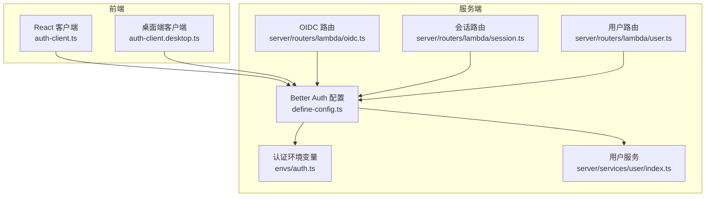
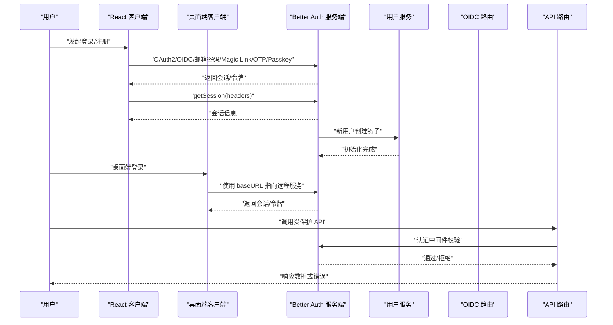
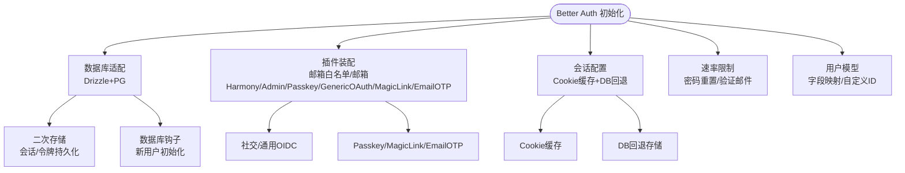
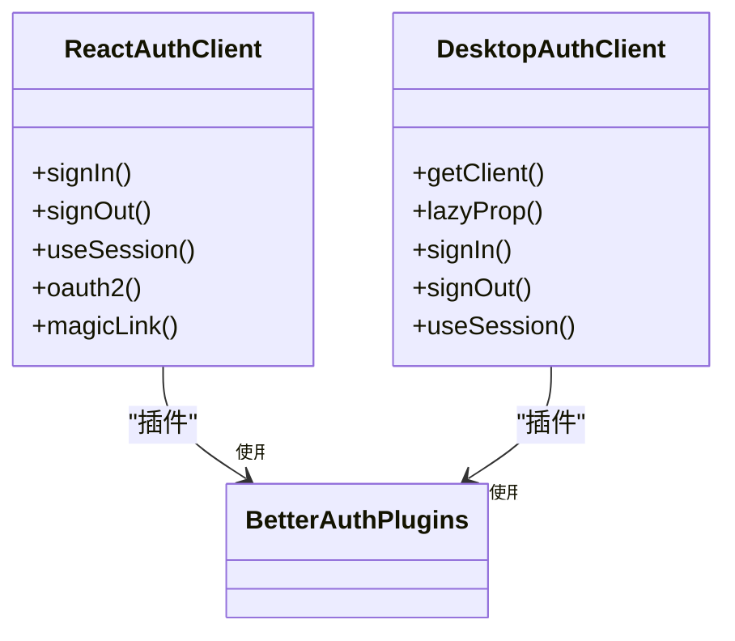
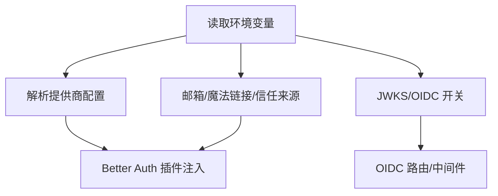
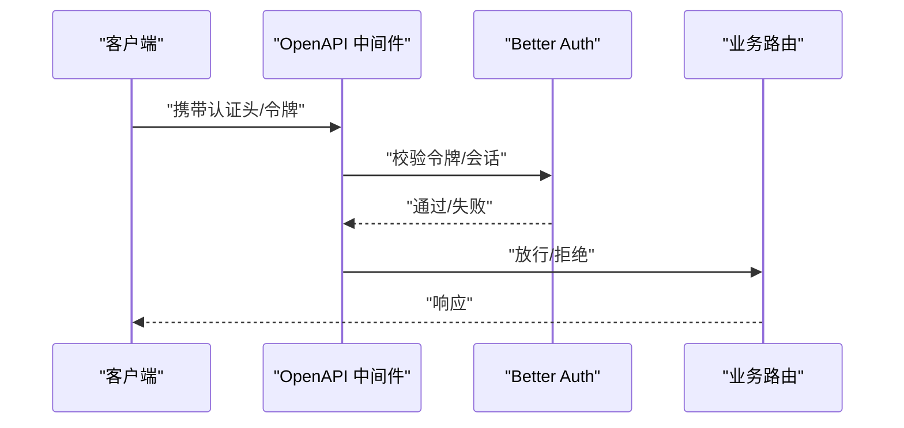
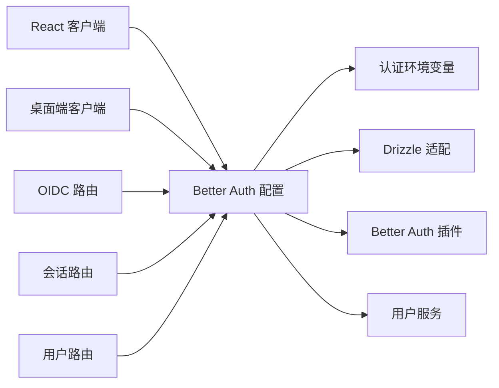

# 认证与授权

<cite>
**本文引用的文件**
- [src/auth.ts](file://src/auth.ts)
- [src/libs/better-auth/define-config.ts](file://src/libs/better-auth/define-config.ts)
- [src/libs/better-auth/auth-client.ts](file://src/libs/better-auth/auth-client.ts)
- [src/libs/better-auth/auth-client.desktop.ts](file://src/libs/better-auth/auth-client.desktop.ts)
- [src/envs/auth.ts](file://src/envs/auth.ts)
- [packages/utils/src/server/auth.ts](file://packages/utils/src/server/auth.ts)
- [src/business/server/better-auth.ts](file://src/business/server/better-auth.ts)
- [src/server/services/user/index.ts](file://src/server/services/user/index.ts)
- [src/libs/oidc-provider/jwt.ts](file://src/libs/oidc-provider/jwt.ts)
- [apps/device-gateway/src/auth.ts](file://apps/device-gateway/src/auth.ts)
- [packages/database/src/models/oauthHandoff.ts](file://packages/database/src/models/oauthHandoff.ts)
- [src/server/routers/lambda/oidc.ts](file://src/server/routers/lambda/oidc.ts)
- [src/server/routers/lambda/session.ts](file://src/server/routers/lambda/session.ts)
- [src/server/routers/lambda/user.ts](file://src/server/routers/lambda/user.ts)
- [packages/openapi/src/middleware/auth.ts](file://packages/openapi/src/middleware/auth.ts)
</cite>

## 目录

1. [引言](#引言)
2. [项目结构](#项目结构)
3. [核心组件](#核心组件)
4. [架构总览](#架构总览)
5. [组件详解](#组件详解)
6. [依赖关系分析](#依赖关系分析)
7. [性能考量](#性能考量)
8. [故障排查指南](#故障排查指南)
9. [结论](#结论)
10. [附录](#附录)

## 引言

本文件面向 LobeHub 项目的认证与授权体系，围绕基于 Better Auth 的统一认证内核，系统性梳理 OAuth2.0、OIDC、JWT 等多种认证方式的集成与配置；阐述用户权限管理机制（含会话管理、速率限制、邮箱白名单等）；说明多租户场景下的用户隔离与权限继承实践；并给出 API 认证中间件、请求拦截与令牌验证、权限检查的安全流程设计。同时覆盖用户注册、登录、登出的完整安全流程，以及密码安全策略、账户锁定机制、安全审计日志等安全管理实践。

## 项目结构

LobeHub 的认证与授权由 “前端 Better Auth 客户端 + 服务端 Better Auth 实例 + 环境变量与插件 + 路由与中间件” 构成，核心文件分布如下：

- 前端客户端：React / 桌面端 Better Auth 客户端封装，提供登录、登出、会话状态等能力
- 服务端实例：Better Auth 配置与插件装配，统一处理会话、邮箱验证、魔法链接、邮箱 OTP、Passkey、OAuth 等
- 环境变量：集中管理各认证提供商 ID/Secret、信任来源、OIDC/JWKS、内部 JWT 过期时间等
- 服务层：用户初始化、分析埋点、API Key 管理等
- 路由与中间件：Lambda 路由中的 OIDC、会话、用户相关接口；OpenAPI 中间件进行 API 层认证

图表来源

- [src/libs/better-auth/auth-client.ts](file://src/libs/better-auth/auth-client.ts#L1-L34)
- [src/libs/better-auth/auth-client.desktop.ts](file://src/libs/better-auth/auth-client.desktop.ts#L1-L59)
- [src/libs/better-auth/define-config.ts](file://src/libs/better-auth/define-config.ts#L95-L332)
- [src/envs/auth.ts](file://src/envs/auth.ts#L107-L294)
- [src/server/services/user/index.ts](file://src/server/services/user/index.ts#L20-L52)
- [src/server/routers/lambda/oidc.ts](file://src/server/routers/lambda/oidc.ts)
- [src/server/routers/lambda/session.ts](file://src/server/routers/lambda/session.ts)
- [src/server/routers/lambda/user.ts](file://src/server/routers/lambda/user.ts)

章节来源

- [src/auth.ts](file://src/auth.ts#L1-L6)
- [src/libs/better-auth/define-config.ts](file://src/libs/better-auth/define-config.ts#L95-L332)
- [src/envs/auth.ts](file://src/envs/auth.ts#L107-L294)

## 核心组件

- Better Auth 配置与插件
  - 统一会话、数据库适配、二次存储、实验性连接查询、用户钩子、速率限制、邮箱白名单、邮箱 Harmony、Admin、Passkey、Generic OAuth、Magic Link、Email OTP 等插件
  - 支持邮箱密码登录、邮箱验证、魔法链接登录、邮箱 OTP 登录、Passkey 登录、社交 / 通用 OIDC 登录
- 前端 Better Auth 客户端
  - React 客户端与桌面端客户端，统一暴露 signIn、signOut、useSession、oauth2、magicLink 等能力，并注入 inferAdditionalFields
- 认证环境变量
  - 提供所有认证提供商的 ID/Secret、信任来源、邮箱验证开关、魔法链接开关、禁用邮箱密码、JWKS、OIDC 开关、内部 JWT 过期时间等
- 用户服务与初始化
  - 新用户创建后触发业务初始化、分析埋点、事件追踪
- OIDC 与 JWT
  - 提供 OIDC 路由与 JWT 工具，支持内部服务间 JWT 验证与签名

章节来源

- [src/libs/better-auth/define-config.ts](file://src/libs/better-auth/define-config.ts#L262-L328)
- [src/libs/better-auth/auth-client.ts](file://src/libs/better-auth/auth-client.ts#L11-L33)
- [src/libs/better-auth/auth-client.desktop.ts](file://src/libs/better-auth/auth-client.desktop.ts#L15-L30)
- [src/envs/auth.ts](file://src/envs/auth.ts#L107-L294)
- [src/server/services/user/index.ts](file://src/server/services/user/index.ts#L27-L51)
- [src/libs/oidc-provider/jwt.ts](file://src/libs/oidc-provider/jwt.ts)

## 架构总览

下图展示从浏览器到服务端的认证调用链路，涵盖 OAuth2/OIDC、Magic Link、Email OTP、Passkey、邮箱密码等多种入口，以及会话获取、权限校验与 API 中间件拦截。

图表来源

- [src/libs/better-auth/auth-client.ts](file://src/libs/better-auth/auth-client.ts#L11-L33)
- [src/libs/better-auth/auth-client.desktop.ts](file://src/libs/better-auth/auth-client.desktop.ts#L19-L27)
- [src/libs/better-auth/define-config.ts](file://src/libs/better-auth/define-config.ts#L177-L184)
- [src/server/services/user/index.ts](file://src/server/services/user/index.ts#L27-L51)
- [src/server/routers/lambda/oidc.ts](file://src/server/routers/lambda/oidc.ts)
- [packages/openapi/src/middleware/auth.ts](file://packages/openapi/src/middleware/auth.ts)

## 组件详解

### Better Auth 配置与插件

- 会话与缓存
  - Cookie 缓存启用，最大缓存时长 10 分钟；同时保留数据库回退存储，确保高可用
- 数据库与二次存储
  - Drizzle 适配 PostgreSQL；开启实验性连接查询以提升性能；二次存储用于会话与令牌持久化
- 用户模型与字段映射
  - 用户名、全名、头像等字段映射；自定义 ID 生成器与 Better Auth 对齐
- 邮箱与验证
  - 邮箱验证链接过期时间、自动登录、发送模板；邮箱白名单插件；邮箱 Harmony 自定义校验器
- 多因子与便捷登录
  - Passkey：支持 rpID 与多 origin；Magic Link：可选启用，带过期时间；Email OTP：移动端手动触发，带过期与尝试次数限制
- 社交与通用 OIDC
  - 社交提供商与通用 OIDC 动态注入；账户关联策略允许不同邮箱且信任提供商
- 速率限制
  - 密码重置与验证邮件接口设置窗口与上限
- 数据库钩子
  - 新用户创建后触发业务初始化与分析埋点

图表来源

- [src/libs/better-auth/define-config.ts](file://src/libs/better-auth/define-config.ts#L177-L197)
- [src/libs/better-auth/define-config.ts](file://src/libs/better-auth/define-config.ts#L262-L328)
- [src/libs/better-auth/define-config.ts](file://src/libs/better-auth/define-config.ts#L203-L217)

章节来源

- [src/libs/better-auth/define-config.ts](file://src/libs/better-auth/define-config.ts#L95-L332)

### 前端 Better Auth 客户端

- React 客户端
  - 创建 Better Auth 客户端，注入 adminClient、inferAdditionalFields、genericOAuthClient、magicLinkClient 插件
  - 暴露 signIn、signOut、useSession、oauth2、magicLink 等方法
- 桌面端客户端
  - 延迟创建客户端，读取 Electron 存储中的远程 baseURL
  - 使用 Proxy 包装方法，确保函数绑定与代理调用

图表来源

- [src/libs/better-auth/auth-client.ts](file://src/libs/better-auth/auth-client.ts#L11-L33)
- [src/libs/better-auth/auth-client.desktop.ts](file://src/libs/better-auth/auth-client.desktop.ts#L15-L30)

章节来源

- [src/libs/better-auth/auth-client.ts](file://src/libs/better-auth/auth-client.ts#L1-L34)
- [src/libs/better-auth/auth-client.desktop.ts](file://src/libs/better-auth/auth-client.desktop.ts#L1-L59)

### 认证环境变量与 OIDC/JWKS

- 环境变量
  - 提供 Google、Apple、GitHub、Cognito、Microsoft、Auth0、Authelia、Authentik、Casdoor、Cloudflare Zero Trust、Feishu、Keycloak、Logto、Okta、WeChat、Zitadel 等提供商的 ID/Secret/Issuer/Region/UserPool 等
  - 控制邮箱验证、魔法链接、邮箱密码禁用、信任来源、允许邮箱列表、内部 JWT 过期时间、JWKS Key、OIDC 开关等
- OIDC 与 JWKS
  - 当 JWKS_KEY 设置时启用 OIDC；提供 OIDC Auth Header 常量与 JWT 工具

图表来源

- [src/envs/auth.ts](file://src/envs/auth.ts#L107-L294)
- [src/libs/oidc-provider/jwt.ts](file://src/libs/oidc-provider/jwt.ts)

章节来源

- [src/envs/auth.ts](file://src/envs/auth.ts#L107-L294)

### 会话管理与 API 认证中间件

- 会话获取
  - 通过 headers 调用 Better Auth 的 getSession 接口，提取用户 ID
- API 中间件
  - OpenAPI 中间件负责请求拦截、令牌提取与权限检查
- OIDC 与会话路由
  - OIDC 路由处理 OIDC 流程；会话路由提供会话状态查询；用户路由提供用户信息

图表来源

- [packages/utils/src/server/auth.ts](file://packages/utils/src/server/auth.ts#L5-L16)
- [packages/openapi/src/middleware/auth.ts](file://packages/openapi/src/middleware/auth.ts)

章节来源

- [packages/utils/src/server/auth.ts](file://packages/utils/src/server/auth.ts#L1-L61)
- [src/server/routers/lambda/oidc.ts](file://src/server/routers/lambda/oidc.ts)
- [src/server/routers/lambda/session.ts](file://src/server/routers/lambda/session.ts)
- [src/server/routers/lambda/user.ts](file://src/server/routers/lambda/user.ts)

### 多租户隔离与权限继承

- 账户关联策略
  - 允许不同邮箱且信任提供商的账户关联，便于跨源登录与账号合并
- 业务初始化
  - 新用户创建后触发业务初始化逻辑，结合业务特性实现租户维度的数据隔离与默认权限继承
- 会话与二次存储
  - 会话与令牌持久化于二次存储，保障跨实例一致性与高可用

章节来源

- [src/libs/better-auth/define-config.ts](file://src/libs/better-auth/define-config.ts#L97-L102)
- [src/server/services/user/index.ts](file://src/server/services/user/index.ts#L27-L51)

### 安全管理实践

- 密码安全策略
  - 最小 / 最大密码长度限制；兼容 Clerk 的 bcrypt 哈希迁移；默认使用 Better Auth 的密码验证
- 账户锁定与速率限制
  - 密码重置与验证邮件接口设置窗口与上限，防止暴力破解
- 邮箱验证与 OTP
  - 邮箱验证链接过期时间；移动端使用邮箱 OTP 手动触发，带过期与尝试次数限制
- 邮箱白名单
  - 仅允许白名单邮箱注册与登录
- 审计与埋点
  - 新用户注册完成后触发分析埋点与事件追踪，便于安全审计

章节来源

- [src/libs/better-auth/define-config.ts](file://src/libs/better-auth/define-config.ts#L109-L131)
- [src/libs/better-auth/define-config.ts](file://src/libs/better-auth/define-config.ts#L256-L261)
- [src/libs/better-auth/define-config.ts](file://src/libs/better-auth/define-config.ts#L143-L172)
- [src/libs/better-auth/define-config.ts](file://src/libs/better-auth/define-config.ts#L269-L291)
- [src/server/services/user/index.ts](file://src/server/services/user/index.ts#L37-L51)

## 依赖关系分析

- 组件耦合
  - 前端客户端依赖 Better Auth 配置；Better Auth 配置依赖环境变量与数据库适配；用户服务在数据库钩子中被调用
- 外部依赖
  - Better Auth 生态插件（Admin、Email Harmony、Passkey、Generic OAuth、Magic Link、Email OTP）
  - Drizzle 适配 PostgreSQL
  - OIDC/JWKS 与 JWT 工具
- 可能的循环依赖
  - 未见直接循环导入；Better Auth 配置作为中心枢纽，避免了客户端与服务端之间的直接耦合

图表来源

- [src/libs/better-auth/auth-client.ts](file://src/libs/better-auth/auth-client.ts#L11-L33)
- [src/libs/better-auth/auth-client.desktop.ts](file://src/libs/better-auth/auth-client.desktop.ts#L19-L27)
- [src/libs/better-auth/define-config.ts](file://src/libs/better-auth/define-config.ts#L185-L189)
- [src/envs/auth.ts](file://src/envs/auth.ts#L107-L294)
- [src/server/services/user/index.ts](file://src/server/services/user/index.ts#L20-L25)
- [src/server/routers/lambda/oidc.ts](file://src/server/routers/lambda/oidc.ts)
- [src/server/routers/lambda/session.ts](file://src/server/routers/lambda/session.ts)
- [src/server/routers/lambda/user.ts](file://src/server/routers/lambda/user.ts)

章节来源

- [src/libs/better-auth/define-config.ts](file://src/libs/better-auth/define-config.ts#L185-L189)

## 性能考量

- 实验性连接查询
  - 启用 Better Auth 的连接查询实验功能，显著降低多表关联查询的延迟，提升 /get-session、组织信息等接口性能
- 会话缓存
  - Cookie 缓存与数据库回退存储并行，兼顾性能与可靠性
- 二次存储
  - 会话与令牌持久化于二次存储，减少数据库压力并提高横向扩展能力

章节来源

- [src/libs/better-auth/define-config.ts](file://src/libs/better-auth/define-config.ts#L197-L197)
- [src/libs/better-auth/define-config.ts](file://src/libs/better-auth/define-config.ts#L177-L184)
- [src/libs/better-auth/define-config.ts](file://src/libs/better-auth/define-config.ts#L190-L190)

## 故障排查指南

- 常见问题定位
  - OAuth 回调失败：检查信任来源与提供商 ID/Secret；确认回调地址与信任来源一致
  - 邮箱验证 / OTP 不生效：确认邮箱服务配置与模板；移动端需手动触发 OTP
  - 会话获取失败：确认 headers 传递正确；检查 Cookie 缓存与数据库回退
  - OIDC/JWKS 无法验证：确认 JWKS Key 有效；检查 OIDC Issuer 与端点
- 日志与审计
  - 新用户注册事件已接入分析埋点，便于追踪异常行为与安全事件

章节来源

- [src/envs/auth.ts](file://src/envs/auth.ts#L107-L294)
- [src/libs/better-auth/define-config.ts](file://src/libs/better-auth/define-config.ts#L143-L172)
- [src/libs/better-auth/define-config.ts](file://src/libs/better-auth/define-config.ts#L269-L291)
- [src/server/services/user/index.ts](file://src/server/services/user/index.ts#L45-L51)

## 结论

LobeHub 的认证与授权体系以 Better Auth 为核心，通过完善的插件生态、灵活的环境变量配置、严格的速率限制与邮箱白名单策略，实现了对 OAuth2.0、OIDC、JWT、邮箱密码、魔法链接、邮箱 OTP、Passkey 等多种认证方式的支持。配合会话缓存、二次存储与实验性连接查询，既保证了安全性也兼顾了性能。多租户场景下的账户关联与业务初始化，进一步完善了用户隔离与权限继承机制。建议在生产环境中严格配置 OIDC/JWKS、邮箱服务与信任来源，并持续监控埋点与日志以强化安全审计。

## 附录

- 安全最佳实践清单
  - 强制启用邮箱验证与邮箱白名单
  - 启用魔法链接与 Passkey，降低密码泄露风险
  - 为 OIDC/JWKS 配置强密钥轮换与短有效期
  - 启用速率限制并定期审查
  - 在会话与令牌层面采用二次存储与回退策略
  - 对新用户注册事件进行埋点与审计
