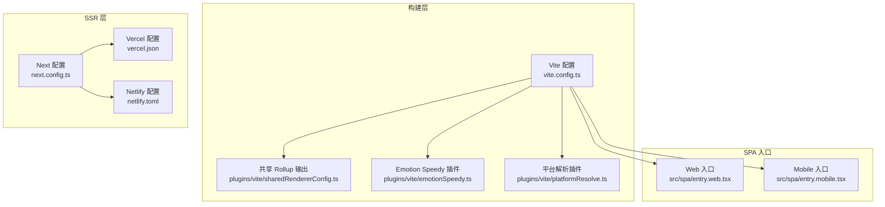
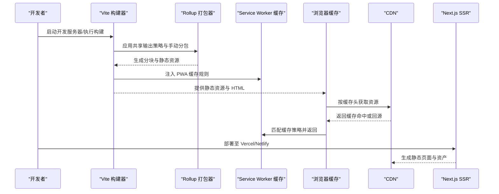
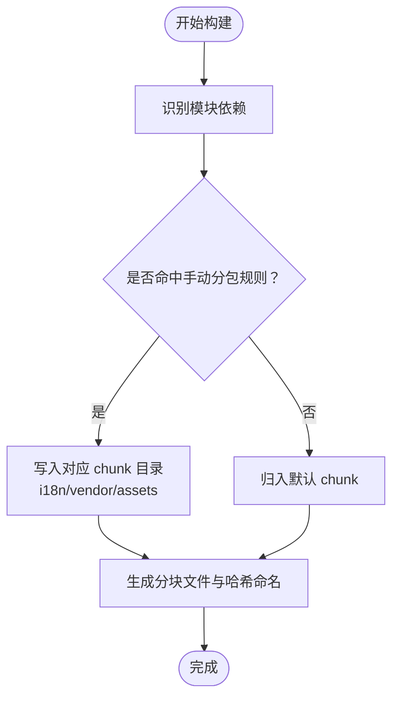
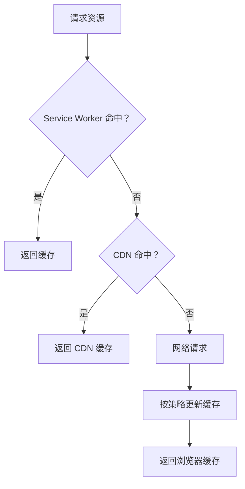
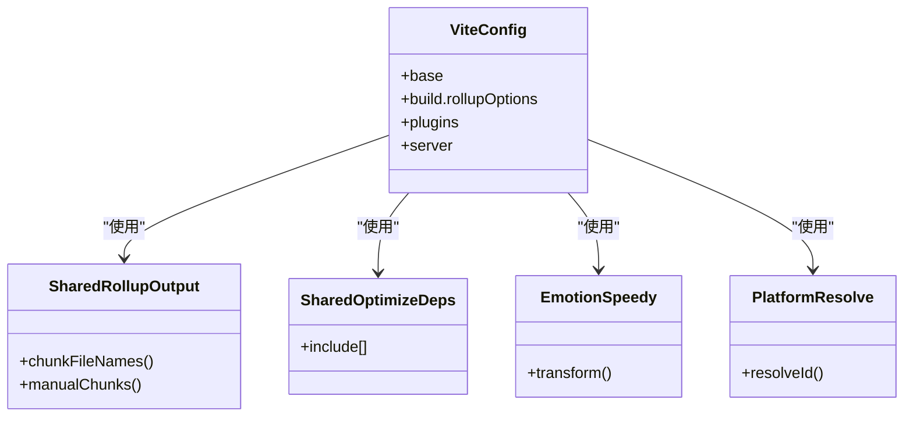
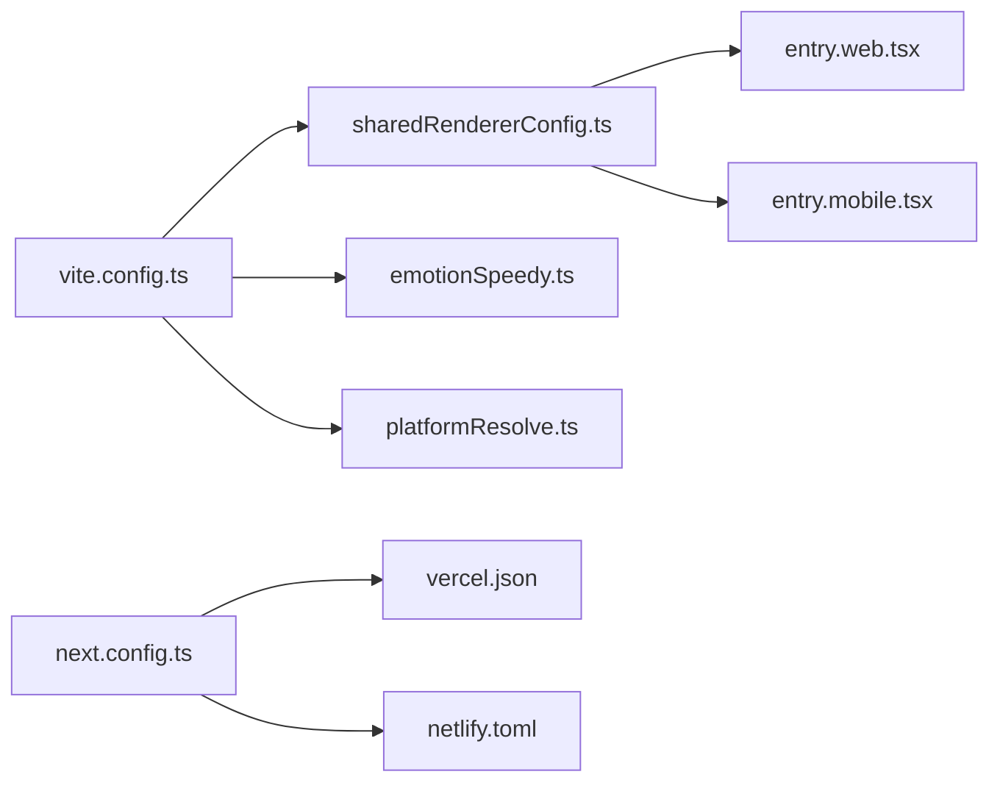

# 前端性能优化

<cite>
**本文引用的文件**
- [vite.config.ts](file://vite.config.ts)
- [package.json](file://package.json)
- [next.config.ts](file://next.config.ts)
- [vercel.json](file://vercel.json)
- [netlify.toml](file://netlify.toml)
- [plugins/vite/sharedRendererConfig.ts](file://plugins/vite/sharedRendererConfig.ts)
- [plugins/vite/emotionSpeedy.ts](file://plugins/vite/emotionSpeedy.ts)
- [plugins/vite/platformResolve.ts](file://plugins/vite/platformResolve.ts)
- [src/spa/entry.web.tsx](file://src/spa/entry.web.tsx)
- [src/spa/entry.mobile.tsx](file://src/spa/entry.mobile.tsx)
</cite>

## 目录
1. [简介](#简介)
2. [项目结构](#项目结构)
3. [核心组件](#核心组件)
4. [架构总览](#架构总览)
5. [详细组件分析](#详细组件分析)
6. [依赖关系分析](#依赖关系分析)
7. [性能考量与优化建议](#性能考量与优化建议)
8. [故障排查指南](#故障排查指南)
9. [结论](#结论)
10. [附录](#附录)

## 简介
本文件面向 LobeHub 前端性能优化，系统梳理并解释以下主题：代码分割策略（动态导入、路由级与组件级懒加载）、缓存优化（浏览器缓存、Service Worker 缓存、CDN 缓存、静态资源缓存最佳实践）、构建优化（Vite 构建配置、Rollup 输出与手动分包、Tree Shaking 与依赖预优化）、运行时性能优化（React 性能、虚拟滚动、图片懒加载、字体优化、关键渲染路径优化），以及性能监控与分析（Web Vitals、性能指标采集、性能回归检测）。

## 项目结构
LobeHub 采用多应用与多平台构建方式：
- SPA 应用通过 Vite 构建，分别支持 Web 与 Mobile 平台入口。
- Next.js 应用负责服务端渲染与静态导出，配合 Vercel/Netlify 部署。
- 插件化构建配置集中于 Vite 插件与共享 Rollup 输出策略，统一管理代码分割与缓存策略。

图表来源
- [vite.config.ts](file://vite.config.ts#L24-L122)
- [plugins/vite/sharedRendererConfig.ts](file://plugins/vite/sharedRendererConfig.ts#L103-L111)
- [plugins/vite/emotionSpeedy.ts](file://plugins/vite/emotionSpeedy.ts#L12-L25)
- [plugins/vite/platformResolve.ts](file://plugins/vite/platformResolve.ts#L16-L56)
- [src/spa/entry.web.tsx](file://src/spa/entry.web.tsx#L1-L27)
- [src/spa/entry.mobile.tsx](file://src/spa/entry.mobile.tsx#L1-L18)
- [next.config.ts](file://next.config.ts#L22-L24)
- [vercel.json](file://vercel.json#L1-L15)
- [netlify.toml](file://netlify.toml#L1-L10)

章节来源
- [vite.config.ts](file://vite.config.ts#L24-L122)
- [plugins/vite/sharedRendererConfig.ts](file://plugins/vite/sharedRendererConfig.ts#L103-L111)
- [src/spa/entry.web.tsx](file://src/spa/entry.web.tsx#L1-L27)
- [src/spa/entry.mobile.tsx](file://src/spa/entry.mobile.tsx#L1-L18)
- [next.config.ts](file://next.config.ts#L22-L24)
- [vercel.json](file://vercel.json#L1-L15)
- [netlify.toml](file://netlify.toml#L1-L10)

## 核心组件
- Vite 构建与代码分割：通过共享 Rollup 输出策略与手动分包函数，将 i18n、第三方 vendor、图标等模块拆分为独立 chunk，减少重复与提升缓存命中率。
- Emotion Speedy：强制启用 CSS-in-JS 运行时的高效模式，降低样式注入开销。
- 平台解析：按平台优先级解析文件变体，确保 Web/Mobile 构建的差异化与最小改动。
- Service Worker 缓存：基于 Vite PWA 插件配置，对字体、图片、API 请求进行差异化缓存策略，提升离线与弱网体验。
- SSR 优化：在 Vercel 上排除不兼容二进制文件与构建产物，缩小冷启动体积；Netlify 使用较大堆内存以避免构建失败。

章节来源
- [plugins/vite/sharedRendererConfig.ts](file://plugins/vite/sharedRendererConfig.ts#L61-L101)
- [plugins/vite/emotionSpeedy.ts](file://plugins/vite/emotionSpeedy.ts#L12-L25)
- [plugins/vite/platformResolve.ts](file://plugins/vite/platformResolve.ts#L16-L56)
- [vite.config.ts](file://vite.config.ts#L64-L103)
- [next.config.ts](file://next.config.ts#L9-L20)
- [netlify.toml](file://netlify.toml#L5-L6)

## 架构总览
下图展示从开发到部署的关键流程与性能优化点：

图表来源
- [vite.config.ts](file://vite.config.ts#L24-L122)
- [plugins/vite/sharedRendererConfig.ts](file://plugins/vite/sharedRendererConfig.ts#L103-L111)
- [next.config.ts](file://next.config.ts#L22-L24)
- [vercel.json](file://vercel.json#L1-L15)
- [netlify.toml](file://netlify.toml#L1-L10)

## 详细组件分析

### 代码分割与懒加载策略
- 路由级代码分割：SPA 入口根据平台选择不同路由配置，结合 React Router 的路由级懒加载可进一步拆分页面级 chunk，减少首屏加载体积。
- 组件级懒加载：对重型组件（如 AgentBuilder、图表、编辑器）采用动态导入与 Suspense 容器，仅在用户访问时加载。
- 手动分包与命名：共享 Rollup 输出策略将 i18n 与 vendor 模块拆分为独立目录与文件名，便于长期缓存与增量更新。
- 依赖预优化：通过 optimizeDeps 预打包常用库，缩短冷启动时间并减少请求次数。

图表来源
- [plugins/vite/sharedRendererConfig.ts](file://plugins/vite/sharedRendererConfig.ts#L61-L111)

章节来源
- [plugins/vite/sharedRendererConfig.ts](file://plugins/vite/sharedRendererConfig.ts#L61-L111)
- [src/spa/entry.web.tsx](file://src/spa/entry.web.tsx#L1-L27)
- [src/spa/entry.mobile.tsx](file://src/spa/entry.mobile.tsx#L1-L18)

### 缓存优化技术
- 浏览器缓存策略：通过 Vite 构建输出的哈希命名与 CDN 配置，结合 HTTP 缓存头实现强缓存与协商缓存。
- Service Worker 缓存：Vite PWA 插件配置了多条缓存规则：
  - 字体样式与字体文件分别采用 Stale-While-Revalidate 与 Cache First 策略，保障字体稳定加载。
  - 图片资源采用 Stale-While-Revalidate，并设置较长有效期与最大条目数。
  - API 请求采用 NetworkFirst，保证数据实时性。
- CDN 缓存配置：Vercel/Netlify 提供边缘缓存与压缩能力，建议结合资源指纹与长缓存策略。
- 静态资源缓存最佳实践：对第三方库与公共资源启用长期缓存；对业务内容启用短缓存或版本化更新。

图表来源
- [vite.config.ts](file://vite.config.ts#L64-L103)

章节来源
- [vite.config.ts](file://vite.config.ts#L64-L103)
- [vercel.json](file://vercel.json#L1-L15)
- [netlify.toml](file://netlify.toml#L1-L10)

### 构建优化
- Vite 构建配置：定义 base、输出目录、rollupOptions 输入与输出策略，启用 PWA 与开发代理打印。
- Rollup 输出与手动分包：通过 sharedRollupOutput 将 i18n 与 vendor 单独命名与存放，降低碎片化。
- 依赖预优化：sharedOptimizeDeps 列表包含 React 生态、UI 库、状态管理、国际化与常用工具库，显著减少冷启动时间。
- Emotion Speedy：在 antd-style 中强制启用高速样式注入，减少 DOM 操作与样式重排。
- 平台解析：按平台后缀优先解析，减少重复代码与构建成本。

图表来源
- [vite.config.ts](file://vite.config.ts#L24-L122)
- [plugins/vite/sharedRendererConfig.ts](file://plugins/vite/sharedRendererConfig.ts#L103-L192)
- [plugins/vite/emotionSpeedy.ts](file://plugins/vite/emotionSpeedy.ts#L12-L25)
- [plugins/vite/platformResolve.ts](file://plugins/vite/platformResolve.ts#L16-L56)

章节来源
- [vite.config.ts](file://vite.config.ts#L24-L122)
- [plugins/vite/sharedRendererConfig.ts](file://plugins/vite/sharedRendererConfig.ts#L103-L192)
- [plugins/vite/emotionSpeedy.ts](file://plugins/vite/emotionSpeedy.ts#L12-L25)
- [plugins/vite/platformResolve.ts](file://plugins/vite/platformResolve.ts#L16-L56)

### 运行时性能优化
- React 性能：使用 memo 与选择器（如 Zustand selectors）减少不必要的重渲染；合理拆分组件边界，避免大范围订阅。
- 虚拟滚动：对长列表采用虚拟滚动组件（如 react-virtuoso 或 virtua），仅渲染可视区域元素。
- 图片懒加载：对非首屏图片使用懒加载与合适的格式（WebP/AVIF），并设置占位符与尺寸声明。
- 字体优化：使用子集化字体与字体显示策略（FOIT/FOUT 控制），结合 Service Worker 缓存字体资源。
- 关键渲染路径优化：内联关键 CSS、延迟非关键脚本、压缩与去重资源、使用现代编码（如 Brotli/HTTP/2）。

章节来源
- [src/features/AgentBuilder/index.tsx](file://src/features/AgentBuilder/index.tsx#L14-L45)
- [package.json](file://package.json#L361-L368)

### 性能监控与分析
- Web Vitals 监控：在生产环境集成 Web Vitals 采集与上报，关注 LCP、FID、CLS 等指标。
- 性能指标采集：结合埋点与性能 API（PerformanceObserver、Navigation Timing），记录首屏、交互延迟与资源加载耗时。
- 性能回归检测：在 CI 中引入 Bundle 分析与阈值告警，对关键指标进行趋势对比与异常检测。

章节来源
- [package.json](file://package.json#L270-L273)

## 依赖关系分析
- 构建期耦合：Vite 配置依赖共享 Rollup 输出与插件；插件之间低耦合，职责清晰（样式、平台解析、Node polyfill）。
- 运行时耦合：SPA 入口依赖路由与全局 Provider；Next.js SSR 与部署平台配置相互独立但共同影响最终性能表现。
- 外部依赖：Vercel/Netlify 提供边缘缓存与构建环境；PWA 插件提供 Service Worker 缓存能力。

图表来源
- [vite.config.ts](file://vite.config.ts#L24-L122)
- [plugins/vite/sharedRendererConfig.ts](file://plugins/vite/sharedRendererConfig.ts#L103-L111)
- [plugins/vite/emotionSpeedy.ts](file://plugins/vite/emotionSpeedy.ts#L12-L25)
- [plugins/vite/platformResolve.ts](file://plugins/vite/platformResolve.ts#L16-L56)
- [src/spa/entry.web.tsx](file://src/spa/entry.web.tsx#L1-L27)
- [src/spa/entry.mobile.tsx](file://src/spa/entry.mobile.tsx#L1-L18)
- [next.config.ts](file://next.config.ts#L22-L24)
- [vercel.json](file://vercel.json#L1-L15)
- [netlify.toml](file://netlify.toml#L1-L10)

章节来源
- [vite.config.ts](file://vite.config.ts#L24-L122)
- [next.config.ts](file://next.config.ts#L22-L24)

## 性能考量与优化建议
- 代码分割
  - 对路由与重型组件进行动态导入，结合 Suspense 与骨架屏提升感知速度。
  - 维持 vendor 与 i18n 独立 chunk，避免热更新时大面积失效。
- 缓存策略
  - 对第三方库与公共资源启用长期缓存；对业务内容采用版本化或 ETag 协商缓存。
  - 结合 CDN 与边缘缓存，确保字体、图片与 API 响应的差异化缓存策略。
- 构建优化
  - 保持 optimizeDeps 列表精简且覆盖高频依赖；定期评估新增依赖对首屏的影响。
  - 使用 Bundle 分析工具（如 webpack-bundle-analyzer 或 Vite 自带分析）识别超大模块与重复依赖。
- 运行时优化
  - 采用虚拟滚动处理长列表；对图片使用懒加载与合适格式；控制字体加载策略。
  - 减少不必要的重渲染，使用 memo 与选择器；拆分组件边界，避免过度订阅。
- 监控与回归
  - 在 CI 中加入性能阈值与回归检测；对关键指标建立基线与告警。

## 故障排查指南
- 构建失败或内存不足
  - Netlify 构建已设置较大堆内存参数，若仍失败，检查依赖体积与并发任务。
- PWA 缓存未生效
  - 检查 Service Worker 注册与缓存规则匹配；确认 CDN 是否正确缓存静态资源。
- 首屏过慢
  - 使用 Bundle 分析定位大体积模块；优化第三方库加载顺序与按需引入。
- 字体闪烁或加载缓慢
  - 确认字体缓存策略与显示策略；检查本地字体与 CDN 字体的缓存头。

章节来源
- [netlify.toml](file://netlify.toml#L5-L6)
- [vite.config.ts](file://vite.config.ts#L64-L103)
- [package.json](file://package.json#L361-L368)

## 结论
通过系统化的代码分割、缓存策略、构建优化与运行时性能治理，LobeHub 能够在多平台与多部署环境下实现稳定的首屏性能与良好的用户体验。建议持续结合 Bundle 分析与 Web Vitals 监控，形成闭环的性能优化流程。

## 附录
- 关键配置参考路径
  - Vite 构建与 PWA：[vite.config.ts](file://vite.config.ts#L24-L122)
  - 共享 Rollup 输出与手动分包：[plugins/vite/sharedRendererConfig.ts](file://plugins/vite/sharedRendererConfig.ts#L103-L111)
  - Emotion Speedy 插件：[plugins/vite/emotionSpeedy.ts](file://plugins/vite/emotionSpeedy.ts#L12-L25)
  - 平台解析插件：[plugins/vite/platformResolve.ts](file://plugins/vite/platformResolve.ts#L16-L56)
  - SPA 入口（Web/Mobile）：[src/spa/entry.web.tsx](file://src/spa/entry.web.tsx#L1-L27)、[src/spa/entry.mobile.tsx](file://src/spa/entry.mobile.tsx#L1-L18)
  - Next.js SSR 与部署：[next.config.ts](file://next.config.ts#L22-L24)、[vercel.json](file://vercel.json#L1-L15)、[netlify.toml](file://netlify.toml#L1-L10)
  - 依赖与脚本：[package.json](file://package.json#L35-L123)