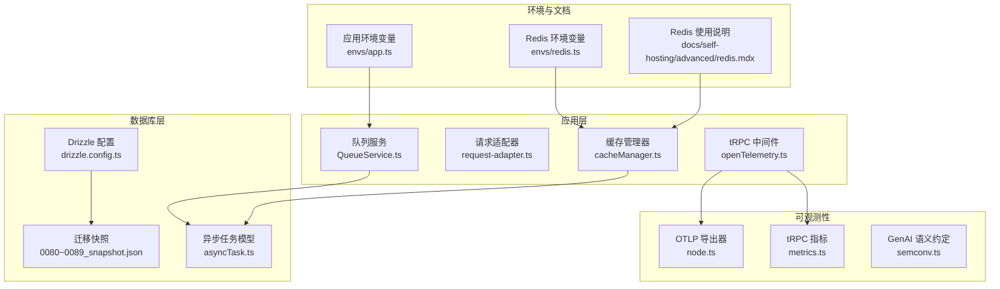
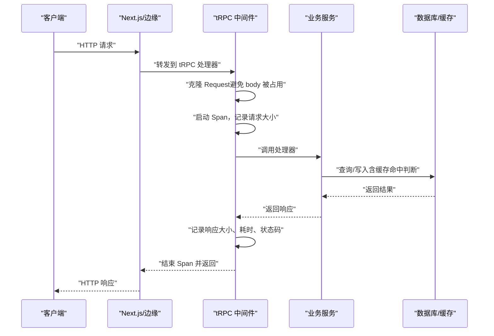
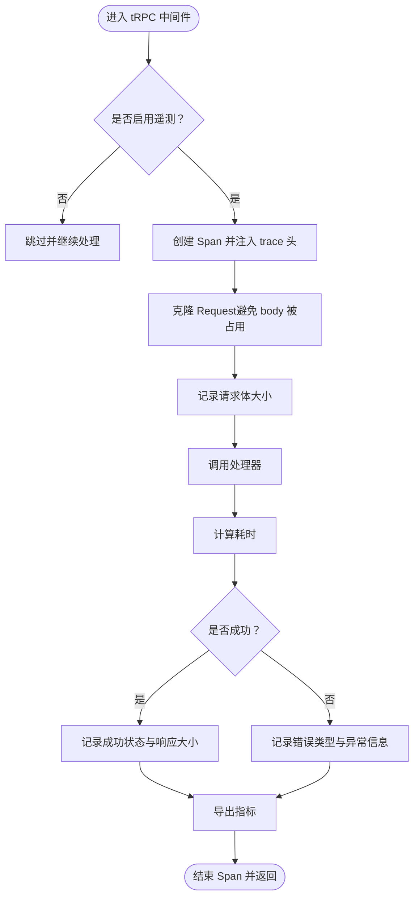
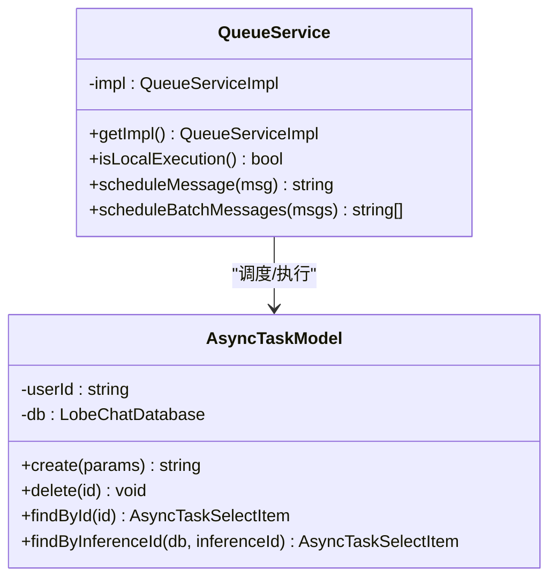
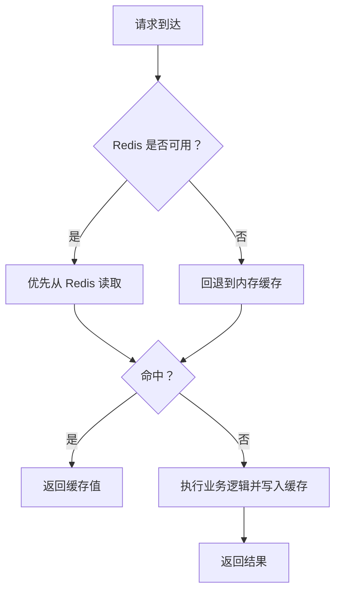
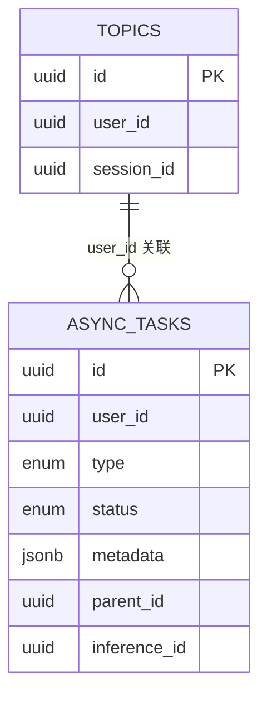
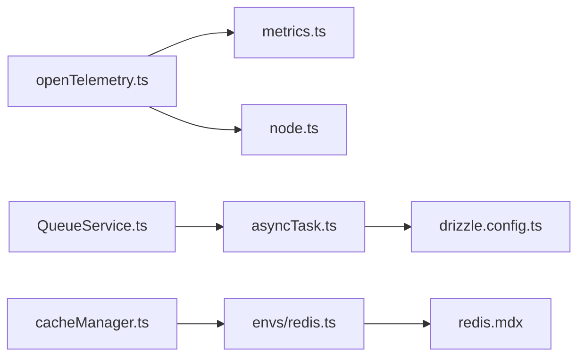

# 后端性能优化

<cite>
**本文引用的文件**
- [src/libs/trpc/middleware/openTelemetry.ts](file://src/libs/trpc/middleware/openTelemetry.ts)
- [packages/observability-otel/src/trpc/metrics.ts](file://packages/observability-otel/src/trpc/metrics.ts)
- [packages/observability-otel/src/node.ts](file://packages/observability-otel/src/node.ts)
- [src/libs/trpc/utils/request-adapter.ts](file://src/libs/trpc/utils/request-adapter.ts)
- [src/server/services/queue/QueueService.ts](file://src/server/services/queue/QueueService.ts)
- [src/server/services/comfyui/utils/cacheManager.ts](file://src/server/services/comfyui/utils/cacheManager.ts)
- [src/server/services/comfyui/__tests__/utils/cacheManager.test.ts](file://src/server/services/comfyui/__tests__/utils/cacheManager.test.ts)
- [packages/database/migrations/meta/0082_snapshot.json](file://packages/database/migrations/meta/0082_snapshot.json)
- [packages/database/migrations/meta/0081_snapshot.json](file://packages/database/migrations/meta/0081_snapshot.json)
- [packages/database/migrations/meta/0080_snapshot.json](file://packages/database/migrations/meta/0080_snapshot.json)
- [packages/database/migrations/meta/0089_snapshot.json](file://packages/database/migrations/meta/0089_snapshot.json)
- [packages/database/migrations/meta/0087_snapshot.json](file://packages/database/migrations/meta/0087_snapshot.json)
- [packages/database/migrations/meta/0075_snapshot.json](file://packages/database/migrations/meta/0075_snapshot.json)
- [packages/database/src/models/asyncTask.ts](file://packages/database/src/models/asyncTask.ts)
- [packages/database/src/models/__tests__/asyncTask.test.ts](file://packages/database/src/models/__tests__/asyncTask.test.ts)
- [drizzle.config.ts](file://drizzle.config.ts)
- [src/envs/redis.ts](file://src/envs/redis.ts)
- [docs/self-hosting/advanced/redis.mdx](file://docs/self-hosting/advanced/redis.mdx)
- [src/envs/app.ts](file://src/envs/app.ts)
- [src/services/message/__tests__/metadata-race-condition.test.ts](file://src/services/message/__tests__/metadata-race-condition.test.ts)
- [packages/model-runtime/src/core/streams/protocol.ts](file://packages/model-runtime/src/core/streams/protocol.ts)
- [packages/conversation-flow/src/transformation/MessageTransformer.ts](file://packages/conversation-flow/src/transformation/MessageTransformer.ts)
- [src/services/trace.ts](file://src/services/trace.ts)
- [packages/observability-otel/src/gen-ai/semconv.ts](file://packages/observability-otel/src/gen-ai/semconv.ts)
- [src/routes/(main)/eval/bench/[benchmarkId]/features/BenchmarkHeader/index.tsx](file://src/routes/(main)/eval/bench/[benchmarkId]/features/BenchmarkHeader/index.tsx)
</cite>

## 目录
1. [简介](#简介)
2. [项目结构](#项目结构)
3. [核心组件](#核心组件)
4. [架构总览](#架构总览)
5. [详细组件分析](#详细组件分析)
6. [依赖关系分析](#依赖关系分析)
7. [性能考量](#性能考量)
8. [故障排查指南](#故障排查指南)
9. [结论](#结论)
10. [附录](#附录)

## 简介
本文件面向 LobeHub 后端性能优化，系统性梳理数据库、tRPC、服务层、API 层与可观测性的优化策略与实践，覆盖查询优化、索引设计、连接池与读写分离、缓存层、请求批处理、错误处理优化、序列化性能、并发与异步任务、内存与 GC 调优、响应时间与吞吐量、负载均衡与限流、以及慢查询日志、APM、性能基准与压力测试方法。

## 项目结构
围绕性能优化的关键目录与文件：
- 数据库与迁移：drizzle 配置、多版本迁移快照（索引定义）
- tRPC 中间件与指标：OpenTelemetry 中间件、指标导出器
- 缓存与队列：Redis 环境变量、本地缓存管理器、队列服务
- 异步任务模型：异步任务表与索引
- 模型运行时与对话流：性能指标采集与聚合
- 基准评测与追踪：前端基准页面、遥测上报

**图表来源**
- [src/libs/trpc/middleware/openTelemetry.ts](file://src/libs/trpc/middleware/openTelemetry.ts#L68-L153)
- [src/libs/trpc/utils/request-adapter.ts](file://src/libs/trpc/utils/request-adapter.ts#L16-L20)
- [src/server/services/queue/QueueService.ts](file://src/server/services/queue/QueueService.ts#L1-L47)
- [src/server/services/comfyui/utils/cacheManager.ts](file://src/server/services/comfyui/utils/cacheManager.ts#L54-L92)
- [drizzle.config.ts](file://drizzle.config.ts#L10-L21)
- [packages/database/migrations/meta/0082_snapshot.json](file://packages/database/migrations/meta/0082_snapshot.json#L9369-L9420)
- [packages/observability-otel/src/node.ts](file://packages/observability-otel/src/node.ts#L124-L143)
- [packages/observability-otel/src/trpc/metrics.ts](file://packages/observability-otel/src/trpc/metrics.ts#L1-L31)
- [src/envs/redis.ts](file://src/envs/redis.ts#L21-L65)
- [docs/self-hosting/advanced/redis.mdx](file://docs/self-hosting/advanced/redis.mdx#L1-L130)
- [src/envs/app.ts](file://src/envs/app.ts#L84-L84)

**章节来源**
- [drizzle.config.ts](file://drizzle.config.ts#L10-L21)
- [src/envs/redis.ts](file://src/envs/redis.ts#L21-L65)
- [docs/self-hosting/advanced/redis.mdx](file://docs/self-hosting/advanced/redis.mdx#L1-L130)

## 核心组件
- tRPC 性能中间件：记录请求/响应大小、耗时、状态码、错误类型，并注入跟踪上下文头，支持下游链路透传
- tRPC 指标导出：直方图度量服务器端耗时、请求/响应体大小、消息数量等
- 请求适配器：在 Next.js 16 场景下克隆 Request，避免 body 被占用导致读取失败
- 队列服务：模块化实现，本地开发与生产队列模式切换，支持批量消息调度
- 缓存管理器：基于内存的 TTL 缓存，支持并发键访问与失效控制
- 数据库迁移与索引：多版本迁移快照中包含 topics 与 async_tasks 的复合索引
- 异步任务模型：封装任务创建、删除、查询与按推理 ID 查询
- 应用与 Redis 环境变量：统一解析与校验，支持 TLS、前缀、数据库索引等
- GenAI 语义约定：标准化 token 使用与操作时长指标，便于统一观测

**章节来源**
- [src/libs/trpc/middleware/openTelemetry.ts](file://src/libs/trpc/middleware/openTelemetry.ts#L68-L153)
- [packages/observability-otel/src/trpc/metrics.ts](file://packages/observability-otel/src/trpc/metrics.ts#L1-L31)
- [src/libs/trpc/utils/request-adapter.ts](file://src/libs/trpc/utils/request-adapter.ts#L16-L20)
- [src/server/services/queue/QueueService.ts](file://src/server/services/queue/QueueService.ts#L1-L47)
- [src/server/services/comfyui/utils/cacheManager.ts](file://src/server/services/comfyui/utils/cacheManager.ts#L54-L92)
- [packages/database/migrations/meta/0082_snapshot.json](file://packages/database/migrations/meta/0082_snapshot.json#L9369-L9420)
- [packages/database/src/models/asyncTask.ts](file://packages/database/src/models/asyncTask.ts#L1-L44)
- [src/envs/redis.ts](file://src/envs/redis.ts#L21-L65)
- [packages/observability-otel/src/gen-ai/semconv.ts](file://packages/observability-otel/src/gen-ai/semconv.ts#L168-L208)

## 架构总览
tRPC 请求在进入业务逻辑前通过 OpenTelemetry 中间件进行采样与指标记录；请求体在 Next.js 16 下由请求适配器安全克隆；业务侧可选择使用队列服务进行异步执行，或直接返回结果；缓存层用于热点数据加速；数据库通过 Drizzle 进行 schema 管理与迁移，配合索引提升查询效率。

**图表来源**
- [src/libs/trpc/utils/request-adapter.ts](file://src/libs/trpc/utils/request-adapter.ts#L16-L20)
- [src/libs/trpc/middleware/openTelemetry.ts](file://src/libs/trpc/middleware/openTelemetry.ts#L68-L153)

## 详细组件分析

### tRPC 性能中间件与指标
- 中间件职责：启用/禁用遥测、创建 Span、注入 trace 上下文头、计算耗时、记录请求/响应大小、错误归因与异常属性
- 指标维度：服务器端耗时直方图、请求/响应体大小直方图、每 RPC 请求/响应数量
- 适用场景：统一观测 tRPC 入口性能，定位慢请求与错误根因

**图表来源**
- [src/libs/trpc/middleware/openTelemetry.ts](file://src/libs/trpc/middleware/openTelemetry.ts#L68-L153)
- [packages/observability-otel/src/trpc/metrics.ts](file://packages/observability-otel/src/trpc/metrics.ts#L1-L31)
- [packages/observability-otel/src/node.ts](file://packages/observability-otel/src/node.ts#L124-L143)

**章节来源**
- [src/libs/trpc/middleware/openTelemetry.ts](file://src/libs/trpc/middleware/openTelemetry.ts#L68-L153)
- [packages/observability-otel/src/trpc/metrics.ts](file://packages/observability-otel/src/trpc/metrics.ts#L1-L31)
- [packages/observability-otel/src/node.ts](file://packages/observability-otel/src/node.ts#L124-L143)

### 请求适配器（Next.js 16 兼容）
- 问题背景：Next.js 16 中请求体可能被内部机制占用，导致 tRPC 无法读取
- 解决方案：克隆 Request，创建独立 body 流供 tRPC 安全消费
- 影响范围：所有 tRPC 请求处理器

**章节来源**
- [src/libs/trpc/utils/request-adapter.ts](file://src/libs/trpc/utils/request-adapter.ts#L16-L20)

### 队列服务与异步任务
- 队列服务：根据运行模式选择本地实现或生产队列实现，支持单条与批量消息调度
- 异步任务模型：提供创建、删除、按 ID/推理 ID 查询能力，配合迁移中的索引优化查询
- 优化建议：批量调度减少网络往返；合理设置任务超时与重试；利用复合索引加速高频查询

**图表来源**
- [src/server/services/queue/QueueService.ts](file://src/server/services/queue/QueueService.ts#L1-L47)
- [packages/database/src/models/asyncTask.ts](file://packages/database/src/models/asyncTask.ts#L1-L44)

**章节来源**
- [src/server/services/queue/QueueService.ts](file://src/server/services/queue/QueueService.ts#L1-L47)
- [packages/database/src/models/asyncTask.ts](file://packages/database/src/models/asyncTask.ts#L1-L44)
- [packages/database/migrations/meta/0082_snapshot.json](file://packages/database/migrations/meta/0082_snapshot.json#L1584-L1634)

### 缓存层优化（内存缓存与 Redis）
- 内存缓存：基于 TTL 的简单缓存管理器，支持并发键检查与失效
- Redis：作为可选的高性能缓存与会话存储，支持 TLS、前缀隔离、数据库索引
- 使用场景：认证会话、文件代理缓存、Agent 配置缓存

**图表来源**
- [src/envs/redis.ts](file://src/envs/redis.ts#L21-L65)
- [docs/self-hosting/advanced/redis.mdx](file://docs/self-hosting/advanced/redis.mdx#L1-L130)
- [src/server/services/comfyui/utils/cacheManager.ts](file://src/server/services/comfyui/utils/cacheManager.ts#L54-L92)

**章节来源**
- [src/envs/redis.ts](file://src/envs/redis.ts#L21-L65)
- [docs/self-hosting/advanced/redis.mdx](file://docs/self-hosting/advanced/redis.mdx#L1-L130)
- [src/server/services/comfyui/utils/cacheManager.ts](file://src/server/services/comfyui/utils/cacheManager.ts#L54-L92)
- [src/server/services/comfyui/__tests__/utils/cacheManager.test.ts](file://src/server/services/comfyui/__tests__/utils/cacheManager.test.ts#L129-L196)

### 数据库性能优化（查询、索引、连接池、读写分离）
- 查询优化：使用 Drizzle ORM 组合条件与投影字段，避免 N+1 查询
- 索引设计：迁移快照中包含 topics 与 async_tasks 的复合索引，覆盖常用过滤与排序字段
- 连接池：通过 Drizzle 配置连接参数（如最大连接数、空闲超时），结合应用层并发控制
- 读写分离：在高并发场景下将只读查询路由至只读副本，写入走主库

**图表来源**
- [packages/database/migrations/meta/0082_snapshot.json](file://packages/database/migrations/meta/0082_snapshot.json#L9369-L9420)
- [packages/database/migrations/meta/0082_snapshot.json](file://packages/database/migrations/meta/0082_snapshot.json#L1584-L1634)
- [drizzle.config.ts](file://drizzle.config.ts#L10-L21)

**章节来源**
- [packages/database/migrations/meta/0082_snapshot.json](file://packages/database/migrations/meta/0082_snapshot.json#L9369-L9420)
- [packages/database/migrations/meta/0081_snapshot.json](file://packages/database/migrations/meta/0081_snapshot.json#L9369-L9420)
- [packages/database/migrations/meta/0080_snapshot.json](file://packages/database/migrations/meta/0080_snapshot.json#L9369-L9420)
- [packages/database/migrations/meta/0089_snapshot.json](file://packages/database/migrations/meta/0089_snapshot.json#L10226-L10277)
- [packages/database/migrations/meta/0087_snapshot.json](file://packages/database/migrations/meta/0087_snapshot.json#L10008-L10059)
- [packages/database/migrations/meta/0075_snapshot.json](file://packages/database/migrations/meta/0075_snapshot.json#L1430-L1481)
- [drizzle.config.ts](file://drizzle.config.ts#L10-L21)

### 服务层性能优化（并发、异步、内存与 GC）
- 并发处理：队列服务支持批量消息调度，降低网络开销；缓存管理器支持并发键访问
- 异步任务：异步任务模型提供超时与元数据管理，配合索引提升查询效率
- 内存管理：缓存 TTL 控制内存占用；避免大对象重复构造；合理复用连接与资源
- 垃圾回收：减少短生命周期临时对象；避免闭包持有大对象；定期分析堆快照

**章节来源**
- [src/server/services/queue/QueueService.ts](file://src/server/services/queue/QueueService.ts#L1-L47)
- [src/server/services/comfyui/utils/cacheManager.ts](file://src/server/services/comfyui/utils/cacheManager.ts#L54-L92)
- [packages/database/src/models/asyncTask.ts](file://packages/database/src/models/asyncTask.ts#L1-L44)

### API 性能优化（响应时间、吞吐量、负载均衡、限流）
- 响应时间优化：tRPC 中间件记录耗时与大小，结合缓存与索引减少数据库往返
- 吞吐量提升：批量调度与请求适配器减少阻塞；队列服务解耦实时请求
- 负载均衡：将只读流量分发至多个实例；静态资源走 CDN
- 限流策略：基于令牌桶或漏桶算法对 tRPC 接口进行速率限制，防止突发流量击垮系统

[本节为通用指导，不直接分析具体文件]

### 性能监控与诊断（慢查询日志、APM、基准测试、压力测试）
- 慢查询日志：PostgreSQL 开启慢查询阈值与日志输出，结合 APM 观测
- APM 工具：OpenTelemetry 集成 Pg、HTTP 自动探针与自定义指标导出
- 性能基准：前端基准页面统计平均耗时、P99、成本等指标
- 压力测试：使用压测工具模拟高并发请求，验证队列与缓存行为

**章节来源**
- [packages/observability-otel/src/node.ts](file://packages/observability-otel/src/node.ts#L124-L143)
- [src/routes/(main)/eval/bench/[benchmarkId]/features/BenchmarkHeader/index.tsx](file://src/routes/(main)/eval/bench/[benchmarkId]/features/BenchmarkHeader/index.tsx#L160-L193)

## 依赖关系分析
- tRPC 中间件依赖 OpenTelemetry 指标导出器与 OTLP 导出器
- 队列服务依赖异步任务模型与 Drizzle 连接
- 缓存层依赖 Redis 环境变量与文档说明
- 数据库层依赖 Drizzle 配置与迁移快照

**图表来源**
- [src/libs/trpc/middleware/openTelemetry.ts](file://src/libs/trpc/middleware/openTelemetry.ts#L68-L153)
- [packages/observability-otel/src/trpc/metrics.ts](file://packages/observability-otel/src/trpc/metrics.ts#L1-L31)
- [packages/observability-otel/src/node.ts](file://packages/observability-otel/src/node.ts#L124-L143)
- [src/server/services/queue/QueueService.ts](file://src/server/services/queue/QueueService.ts#L1-L47)
- [packages/database/src/models/asyncTask.ts](file://packages/database/src/models/asyncTask.ts#L1-L44)
- [drizzle.config.ts](file://drizzle.config.ts#L10-L21)
- [src/server/services/comfyui/utils/cacheManager.ts](file://src/server/services/comfyui/utils/cacheManager.ts#L54-L92)
- [src/envs/redis.ts](file://src/envs/redis.ts#L21-L65)
- [docs/self-hosting/advanced/redis.mdx](file://docs/self-hosting/advanced/redis.mdx#L1-L130)

**章节来源**
- [src/libs/trpc/middleware/openTelemetry.ts](file://src/libs/trpc/middleware/openTelemetry.ts#L68-L153)
- [packages/observability-otel/src/trpc/metrics.ts](file://packages/observability-otel/src/trpc/metrics.ts#L1-L31)
- [packages/observability-otel/src/node.ts](file://packages/observability-otel/src/node.ts#L124-L143)
- [src/server/services/queue/QueueService.ts](file://src/server/services/queue/QueueService.ts#L1-L47)
- [packages/database/src/models/asyncTask.ts](file://packages/database/src/models/asyncTask.ts#L1-L44)
- [drizzle.config.ts](file://drizzle.config.ts#L10-L21)
- [src/server/services/comfyui/utils/cacheManager.ts](file://src/server/services/comfyui/utils/cacheManager.ts#L54-L92)
- [src/envs/redis.ts](file://src/envs/redis.ts#L21-L65)
- [docs/self-hosting/advanced/redis.mdx](file://docs/self-hosting/advanced/redis.mdx#L1-L130)

## 性能考量
- tRPC 层：尽量使用请求适配器克隆 Request；开启遥测但注意采样率；批量处理减少开销
- 数据库层：遵循迁移快照中的索引设计；使用 Drizzle ORM 的投影与条件组合；连接池参数与只读副本策略
- 缓存层：合理设置 TTL 与容量；区分热数据与冷数据；Redis 生产环境启用 TLS
- 服务层：队列批量调度；并发访问去重；内存与 GC 优化
- API 层：CDN 与静态资源分离；限流与熔断；健康检查与灰度发布

[本节为通用指导，不直接分析具体文件]

## 故障排查指南
- tRPC 错误与异常：中间件记录错误类型与堆栈，便于快速定位
- 缓存一致性：并发访问同一键时的行为与 TTL 刷新策略
- 异步任务冲突：并发更新消息元数据时的冲突处理与最终一致性
- 遥测与指标：确认 OTLP 导出器配置与指标命名空间一致

**章节来源**
- [src/libs/trpc/middleware/openTelemetry.ts](file://src/libs/trpc/middleware/openTelemetry.ts#L54-L66)
- [src/server/services/comfyui/__tests__/utils/cacheManager.test.ts](file://src/server/services/comfyui/__tests__/utils/cacheManager.test.ts#L129-L196)
- [src/services/message/__tests__/metadata-race-condition.test.ts](file://src/services/message/__tests__/metadata-race-condition.test.ts#L122-L157)

## 结论
通过在 tRPC 层引入 OpenTelemetry 中间件与指标导出、在应用层采用队列与缓存、在数据库层遵循索引设计与连接池配置、在服务层优化并发与异步任务、在 API 层实施负载均衡与限流策略，并辅以慢查询日志与 APM 工具，LobeHub 后端可在高并发场景下保持稳定与高性能。建议持续进行基准测试与压力测试，结合前端基准页面的统计指标，形成闭环的性能治理流程。

## 附录
- GenAI 语义约定：统一 token 使用与操作时长指标，便于跨服务观测
- 遥测上报：用户设置开关下的事件上报服务，便于收集端到端体验数据

**章节来源**
- [packages/observability-otel/src/gen-ai/semconv.ts](file://packages/observability-otel/src/gen-ai/semconv.ts#L168-L208)
- [src/services/trace.ts](file://src/services/trace.ts#L6-L28)