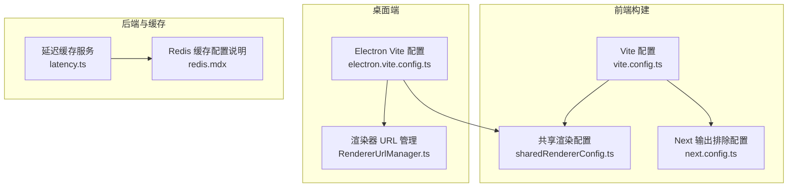
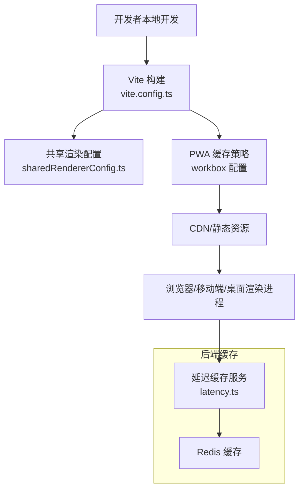
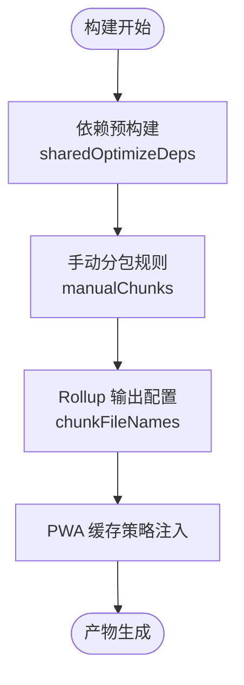
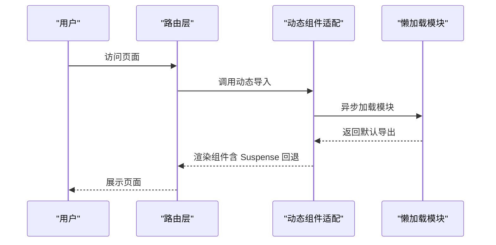
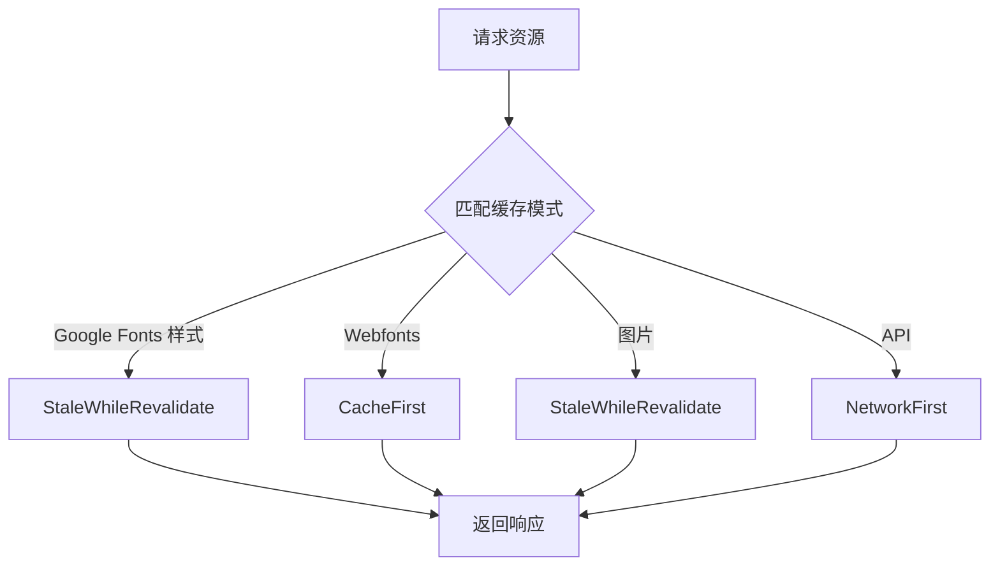
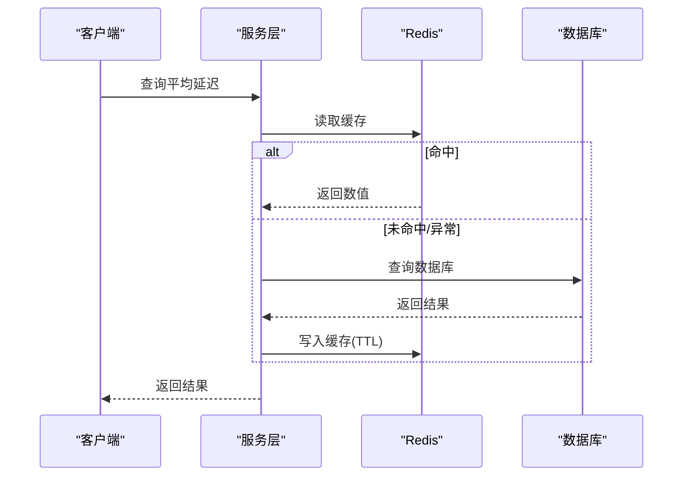
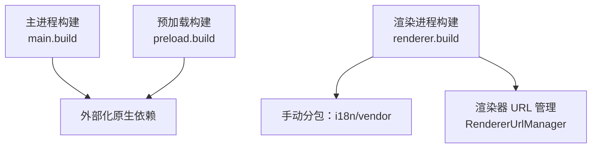
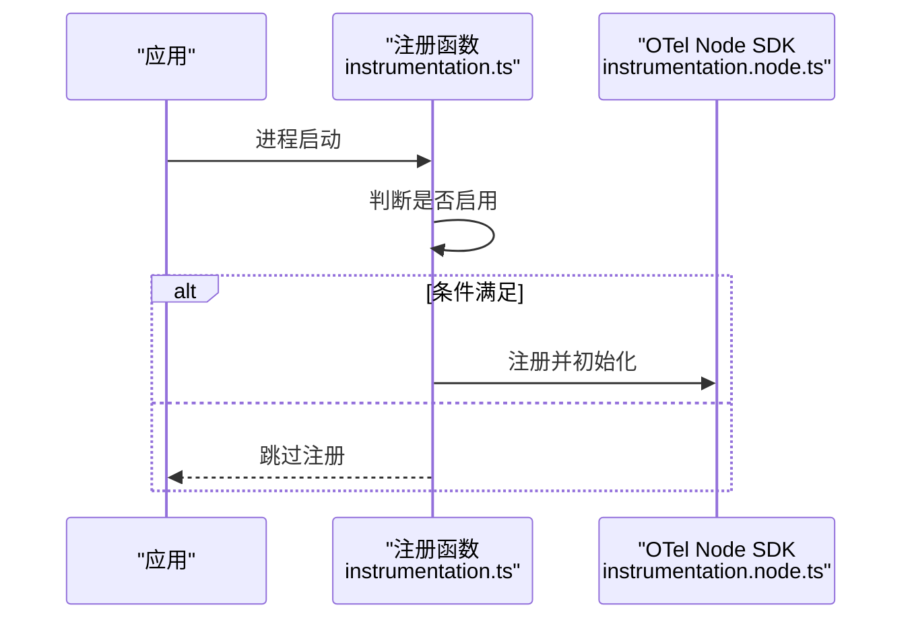
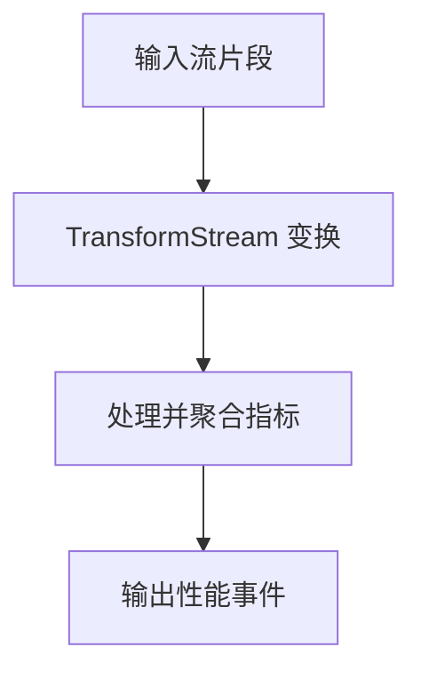
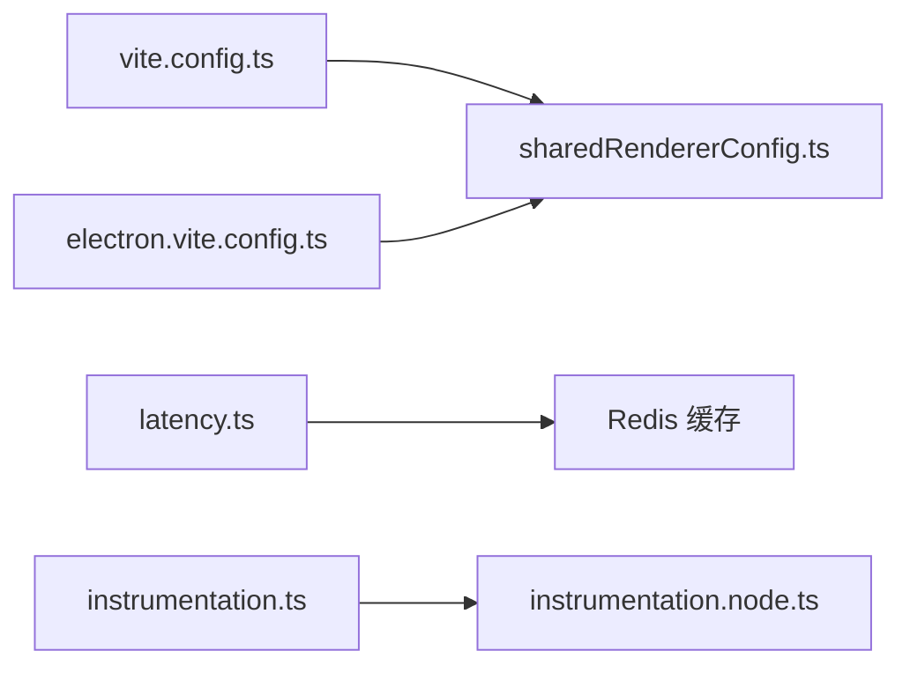

# 性能优化

<cite>
**本文引用的文件**
- [vite.config.ts](file://vite.config.ts)
- [electron.vite.config.ts](file://apps/desktop/electron.vite.config.ts)
- [sharedRendererConfig.ts](file://plugins/vite/sharedRendererConfig.ts)
- [next.config.ts](file://next.config.ts)
- [dynamic.tsx](file://src/libs/next/dynamic.tsx)
- [router.tsx](file://src/utils/router.tsx)
- [instrumentation.ts](file://src/instrumentation.ts)
- [instrumentation.node.ts](file://src/instrumentation.node.ts)
- [package.json（@lobechat/observability-otel）](file://packages/observability-otel/package.json)
- [latency.ts](file://src/server/services/generation/latency.ts)
- [latency.test.ts](file://src/server/services/generation/latency.test.ts)
- [redis.mdx](file://docs/self-hosting/advanced/redis.mdx)
- [RendererUrlManager.ts](file://apps/desktop/src/main/core/infrastructure/RendererUrlManager.ts)
- [Development.md（桌面端）](file://apps/desktop/Development.md)
- [feature-implementation.md（桌面端技能参考）](file://.agents/skills/desktop/references/feature-implementation.md)
- [wrangler.toml（设备网关）](file://apps/device-gateway/wrangler.toml)
- [protocol.ts（模型运行时流协议）](file://packages/model-runtime/src/core/streams/protocol.ts)
</cite>

## 目录

1. 引言
2. 项目结构
3. 核心组件
4. 架构总览
5. 详细组件分析
6. 依赖关系分析
7. 性能考量
8. 故障排查指南
9. 结论
10. 附录

## 引言

本文件面向 LobeHub 项目的前端、后端、移动端与桌面端，系统性梳理性能优化策略与落地实践，覆盖代码分割、懒加载、缓存策略、CDN 加速、数据库查询优化、索引设计、连接池与缓存层优化、移动端原生性能与网络优化、桌面端 Electron 渲染与资源管理优化，并给出性能监控指标、基准测试与回归检测建议，以及工具使用与瓶颈定位方法。

## 项目结构

LobeHub 采用多应用与多包的 Monorepo 架构：

- Web 前端：基于 Vite + React，支持 PWA 缓存与按需打包
- 移动端：基于 Expo（React Native），共享 Web 端逻辑与构建配置
- 桌面端：Electron 应用，主进程与渲染进程分离，渲染侧复用 Web 打包产物
- 后端服务：Next.js（可选）、自研服务，结合 Redis 缓存与数据库查询优化
- 观测性：OpenTelemetry 集成，提供链路追踪与指标采集

图表来源

- [vite.config.ts](file://vite.config.ts#L1-L123)
- [sharedRendererConfig.ts](file://plugins/vite/sharedRendererConfig.ts#L1-L193)
- [next.config.ts](file://next.config.ts#L1-L27)
- [electron.vite.config.ts](file://apps/desktop/electron.vite.config.ts#L1-L116)
- [RendererUrlManager.ts](file://apps/desktop/src/main/core/infrastructure/RendererUrlManager.ts#L1-L40)
- [latency.ts](file://src/server/services/generation/latency.ts#L67-L99)
- [redis.mdx](file://docs/self-hosting/advanced/redis.mdx#L1-L52)

章节来源

- [vite.config.ts](file://vite.config.ts#L1-L123)
- [sharedRendererConfig.ts](file://plugins/vite/sharedRendererConfig.ts#L1-L193)
- [next.config.ts](file://next.config.ts#L1-L27)
- [electron.vite.config.ts](file://apps/desktop/electron.vite.config.ts#L1-L116)
- [RendererUrlManager.ts](file://apps/desktop/src/main/core/infrastructure/RendererUrlManager.ts#L1-L40)
- [latency.ts](file://src/server/services/generation/latency.ts#L67-L99)
- [redis.mdx](file://docs/self-hosting/advanced/redis.mdx#L1-L52)

## 核心组件

- 代码分割与懒加载：通过 Vite Rollup 的 manualChunks 与共享配置，对 i18n、第三方库、图标与动画等进行分包；在路由层采用动态导入与 Suspense 容错，提升首屏与按需模块加载性能。
- 缓存策略：Vite PWA 提供 StaleWhileRevalidate、CacheFirst、NetworkFirst 等策略；后端对关键指标（如平均延迟）做 Redis 缓存，降低数据库压力。
- CDN 与输出路径：生产环境设置 base 路径，结合 Vercel 输出排除减少冷启动体积与部署大小。
- 桌面端优化：主 / 预加载 / 渲染三段式构建，手动拆分 vendor 与 i18n 分块，开发期热身客户端文件，减少首开延迟。
- 观测性：在 Node 环境注册 OpenTelemetry，采集链路与指标，便于性能回归与异常定位。

章节来源

- [vite.config.ts](file://vite.config.ts#L24-L123)
- [sharedRendererConfig.ts](file://plugins/vite/sharedRendererConfig.ts#L61-L111)
- [router.tsx](file://src/utils/router.tsx#L20-L32)
- [dynamic.tsx](file://src/libs/next/dynamic.tsx#L21-L44)
- [latency.ts](file://src/server/services/generation/latency.ts#L67-L99)
- [instrumentation.ts](file://src/instrumentation.ts#L1-L13)
- [instrumentation.node.ts](file://src/instrumentation.node.ts#L1-L6)

## 架构总览

下图展示前端构建、桌面端渲染与后端缓存的整体交互：

图表来源

- [vite.config.ts](file://vite.config.ts#L64-L104)
- [sharedRendererConfig.ts](file://plugins/vite/sharedRendererConfig.ts#L103-L111)
- [latency.ts](file://src/server/services/generation/latency.ts#L67-L99)

章节来源

- [vite.config.ts](file://vite.config.ts#L24-L123)
- [sharedRendererConfig.ts](file://plugins/vite/sharedRendererConfig.ts#L103-L111)
- [latency.ts](file://src/server/services/generation/latency.ts#L67-L99)

## 详细组件分析

### 前端构建与代码分割

- 手动分包策略：针对 i18n、图标、动画、emotion、motion 等进行独立分包，避免重复与大体积 vendor 包合并带来的副作用。
- 优化依赖预构建：集中预打包常用库与 monorepo 内部包，减少请求次数与冷启动时间。
- PWA 缓存：对字体、图片、API 请求分别采用不同缓存策略，控制最大文件尺寸与条目数量，平衡离线可用与存储占用。
- 输出命名与目录：i18n 与 vendor 单独目录，便于 CDN 缓存与版本化管理。

图表来源

- [sharedRendererConfig.ts](file://plugins/vite/sharedRendererConfig.ts#L158-L193)
- [sharedRendererConfig.ts](file://plugins/vite/sharedRendererConfig.ts#L103-L111)
- [vite.config.ts](file://vite.config.ts#L64-L104)

章节来源

- [sharedRendererConfig.ts](file://plugins/vite/sharedRendererConfig.ts#L61-L111)
- [sharedRendererConfig.ts](file://plugins/vite/sharedRendererConfig.ts#L158-L193)
- [vite.config.ts](file://vite.config.ts#L64-L104)

### 懒加载与路由动态导入

- 动态组件适配：提供与 Next.js dynamic 兼容的实现，使用 React.lazy + Suspense，支持 loading 回退与 SSR 开关。
- 路由层懒加载：路由定义中对模块进行异步导入，结合错误处理与重试提示，提升页面切换体验。

图表来源

- [dynamic.tsx](file://src/libs/next/dynamic.tsx#L21-L44)
- [router.tsx](file://src/utils/router.tsx#L20-L32)

章节来源

- [dynamic.tsx](file://src/libs/next/dynamic.tsx#L1-L46)
- [router.tsx](file://src/utils/router.tsx#L1-L32)

### 缓存策略与 CDN 加速

- Vite PWA：对 Google Fonts、图片与 API 接口分别采用 StaleWhileRevalidate、CacheFirst、NetworkFirst，限制最大文件与条目数，确保缓存命中率与更新及时性。
- 生产 base 设置：根据环境选择 CDN 基础路径，配合静态托管提升资源加载速度。
- Vercel 输出排除：在 Serverless 场景排除不必要二进制与构建产物，减小冷启动体积。

图表来源

- [vite.config.ts](file://vite.config.ts#L64-L104)
- [next.config.ts](file://next.config.ts#L5-L21)

章节来源

- [vite.config.ts](file://vite.config.ts#L24-L123)
- [next.config.ts](file://next.config.ts#L1-L27)

### 后端性能优化：数据库与缓存

- Redis 缓存：对关键指标（如视频平均延迟）进行缓存，命中优先读取，未命中查询数据库并写回缓存，设置 TTL 控制过期。
- 失败降级：缓存读写失败或 Redis 不可用时，自动回退到直连数据库，保障服务可用性。
- 使用场景：认证会话存储、文件代理缓存、Agent 配置缓存等，提升并发与一致性。

图表来源

- [latency.ts](file://src/server/services/generation/latency.ts#L67-L99)
- [latency.test.ts](file://src/server/services/generation/latency.test.ts#L133-L147)
- [redis.mdx](file://docs/self-hosting/advanced/redis.mdx#L23-L52)

章节来源

- [latency.ts](file://src/server/services/generation/latency.ts#L67-L99)
- [latency.test.ts](file://src/server/services/generation/latency.test.ts#L119-L152)
- [redis.mdx](file://docs/self-hosting/advanced/redis.mdx#L1-L52)

### 桌面端性能优化：Electron 与渲染

- 三段式构建：主进程、预加载、渲染进程分别构建，外部化原生依赖，避免打包体积膨胀。
- 手动分包：对 i18n 按命名空间拆分，减少单文件体积；对 debug 等依赖单独分出 vendor 片段。
- 渲染器加载策略：开发 / 生产环境差异化加载入口，结合预加载脚本桥接主 / 渲染通信。
- 开发期热身：预热入口文件，缩短首次启动时间。

图表来源

- [electron.vite.config.ts](file://apps/desktop/electron.vite.config.ts#L46-L81)
- [electron.vite.config.ts](file://apps/desktop/electron.vite.config.ts#L96-L114)
- [RendererUrlManager.ts](file://apps/desktop/src/main/core/infrastructure/RendererUrlManager.ts#L18-L40)

章节来源

- [electron.vite.config.ts](file://apps/desktop/electron.vite.config.ts#L1-L116)
- [RendererUrlManager.ts](file://apps/desktop/src/main/core/infrastructure/RendererUrlManager.ts#L1-L40)
- [Development.md（桌面端）](file://apps/desktop/Development.md#L497-L533)
- [feature-implementation.md（桌面端技能参考）](file://.agents/skills/desktop/references/feature-implementation.md#L1-L17)

### 移动端性能优化（概念性）

- 原生性能：利用 React Native 的原生能力，减少 JS 与原生之间的桥接开销；合理拆分包体，避免一次性加载过多资源。
- 内存管理：避免大对象常驻、及时释放监听与定时器；使用懒加载与虚拟列表。
- 电池优化：减少后台任务与频繁唤醒；合理使用推送与网络请求频率。
- 网络优化：启用 HTTP/2、连接复用；对图片与媒体资源进行压缩与懒加载；结合 PWA 缓存策略。

（本节为通用指导，不直接分析具体文件）

### 观测性与性能监控

- 注册流程：在 Node 环境下按条件注册 OpenTelemetry，采集链路与指标，便于性能回归与异常定位。
- 依赖清单：包含 HTTP、PostgreSQL、OpenTelemetry SDK 等观测相关依赖，确保全链路可观测。

图表来源

- [instrumentation.ts](file://src/instrumentation.ts#L1-L13)
- [instrumentation.node.ts](file://src/instrumentation.node.ts#L1-L6)
- [package.json（@lobechat/observability-otel）](file://packages/observability-otel/package.json#L1-L29)

章节来源

- [instrumentation.ts](file://src/instrumentation.ts#L1-L13)
- [instrumentation.node.ts](file://src/instrumentation.node.ts#L1-L6)
- [package.json（@lobechat/observability-otel）](file://packages/observability-otel/package.json#L1-L29)

### 流式性能指标采集（模型运行时）

- TransformStream：在数据流中计算并产出吞吐、TTFT、延迟等性能指标，便于实时监控与可视化。

图表来源

- [protocol.ts（模型运行时流协议）](file://packages/model-runtime/src/core/streams/protocol.ts#L523-L533)

章节来源

- [protocol.ts（模型运行时流协议）](file://packages/model-runtime/src/core/streams/protocol.ts#L509-L533)

### 边缘与网关性能（概念性）

- Durable Objects：通过 Cloudflare Workers Durable Objects 实现状态持久化与低延迟访问，适合设备网关类场景。
- 密钥与鉴权：通过密钥绑定实现服务间安全鉴权，降低中间人攻击风险。

章节来源

- [wrangler.toml（设备网关）](file://apps/device-gateway/wrangler.toml#L1-L17)

## 依赖关系分析

- 构建侧：vite.config.ts 依赖 sharedRendererConfig.ts 提供的 sharedRollupOutput、sharedOptimizeDeps 与 sharedRendererPlugins，形成统一的分包与预构建策略。
- 桌面端：electron.vite.config.ts 继承共享配置，同时对主 / 预加载 / 渲染三段构建进行定制，外部化原生依赖并拆分 i18n。
- 后端：latency.ts 依赖 Redis 作为缓存层，回退至数据库查询，确保高可用。
- 观测性：instrumentation.ts 与 instrumentation.node.ts 组合，按环境条件注册 OpenTelemetry。

图表来源

- [vite.config.ts](file://vite.config.ts#L1-L123)
- [sharedRendererConfig.ts](file://plugins/vite/sharedRendererConfig.ts#L1-L193)
- [electron.vite.config.ts](file://apps/desktop/electron.vite.config.ts#L1-L116)
- [latency.ts](file://src/server/services/generation/latency.ts#L67-L99)
- [instrumentation.ts](file://src/instrumentation.ts#L1-L13)
- [instrumentation.node.ts](file://src/instrumentation.node.ts#L1-L6)

章节来源

- [vite.config.ts](file://vite.config.ts#L1-L123)
- [sharedRendererConfig.ts](file://plugins/vite/sharedRendererConfig.ts#L1-L193)
- [electron.vite.config.ts](file://apps/desktop/electron.vite.config.ts#L1-L116)
- [latency.ts](file://src/server/services/generation/latency.ts#L67-L99)
- [instrumentation.ts](file://src/instrumentation.ts#L1-L13)
- [instrumentation.node.ts](file://src/instrumentation.node.ts#L1-L6)

## 性能考量

- 前端
  - 代码分割：优先拆分 i18n 与第三方库，避免 vendor 合并导致的重复与体积膨胀。
  - 懒加载：对非首屏模块采用动态导入与 Suspense 回退，降低首屏阻塞。
  - 缓存：合理配置 PWA 缓存策略，控制最大文件与条目数，兼顾离线与更新。
  - CDN：生产环境设置 base，结合静态托管与缓存头，提升资源加载速度。
- 后端
  - 缓存：对热点数据（如平均延迟）做 Redis 缓存，设置 TTL 并做好异常降级。
  - 数据库：结合索引与查询计划，避免 N+1 与全表扫描；对高频字段建立合适索引。
- 桌面端
  - 构建：外部化原生依赖，拆分 i18n 与 vendor，减少打包体积。
  - 渲染：开发期热身入口文件，缩短首开；合理使用预加载脚本桥接主 / 渲染通信。
- 移动端
  - 原生性能：减少桥接与常驻大对象；使用懒加载与虚拟列表。
  - 电池优化：降低后台任务与网络唤醒频率。
  - 网络优化：HTTP/2、连接复用、资源压缩与缓存策略。

（本节为通用指导，不直接分析具体文件）

## 故障排查指南

- 构建与缓存
  - 若 PWA 缓存未生效，检查 workbox 配置与缓存名空间；确认最大文件与条目限制是否合理。
  - 若分包过多导致碎片化，调整 manualChunks 规则，合并轻量模块，拆分重型命名空间。
- 桌面端
  - 若渲染器无法加载，检查 RendererUrlManager 的加载策略与协议方案；确认开发 / 生产环境入口路径。
  - 若原生依赖报错，核对 external 配置与 native-deps.config.mjs。
- 后端缓存
  - 若 Redis 不可用，确认环境变量与连接参数；观察回退逻辑是否正常工作。
  - 若缓存命中异常，检查键命名与 TTL 设置，验证序列化 / 反序列化一致性。
- 观测性
  - 若链路缺失，检查注册条件与环境变量；确认 OTel SDK 初始化顺序。

章节来源

- [vite.config.ts](file://vite.config.ts#L64-L104)
- [sharedRendererConfig.ts](file://plugins/vite/sharedRendererConfig.ts#L61-L111)
- [RendererUrlManager.ts](file://apps/desktop/src/main/core/infrastructure/RendererUrlManager.ts#L18-L40)
- [latency.ts](file://src/server/services/generation/latency.ts#L67-L99)
- [instrumentation.ts](file://src/instrumentation.ts#L1-L13)

## 结论

通过统一的构建配置、精细化的代码分割与缓存策略、完善的桌面端与后端缓存体系，以及可观测性的链路采集，LobeHub 在多端实现了较好的性能表现。建议持续关注分包粒度、缓存命中率与数据库索引效率，并结合基准测试与回归检测机制，确保性能稳定与持续改进。

## 附录

- 性能基准测试建议
  - 前端：测量首屏时间、TTFB、LCP、INP 等指标；对比不同分包策略与缓存策略下的表现。
  - 后端：对热点接口进行 QPS、P95/P99 延迟与缓存命中率测试；模拟 Redis 不可用场景。
  - 桌面端：测量启动时间、首帧时间与内存峰值；对比不同分包与预热策略。
- 性能回归检测
  - 将关键指标纳入 CI，设定阈值告警；对每次构建生成报告，对比历史基线。
- 工具与方法
  - 构建分析：rollup-plugin-visualizer、webpack-bundle-analyzer（如引入）。
  - 性能分析：Chrome DevTools、React Profiler、Electron DevTools。
  - 观测性：OTel Collector、Jaeger/Tempo、Grafana/Prometheus。

（本节为通用指导，不直接分析具体文件）
