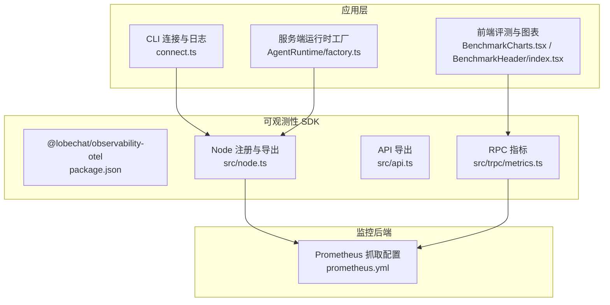
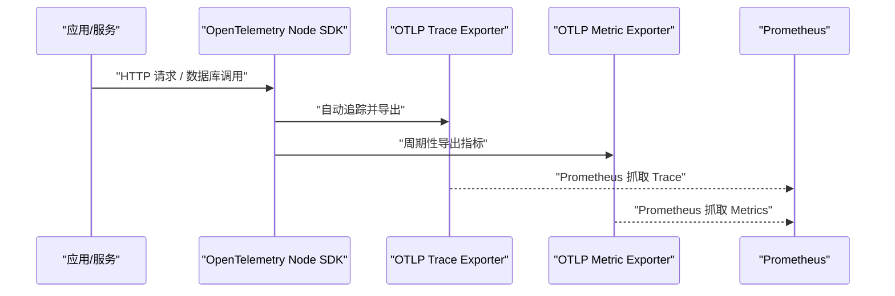
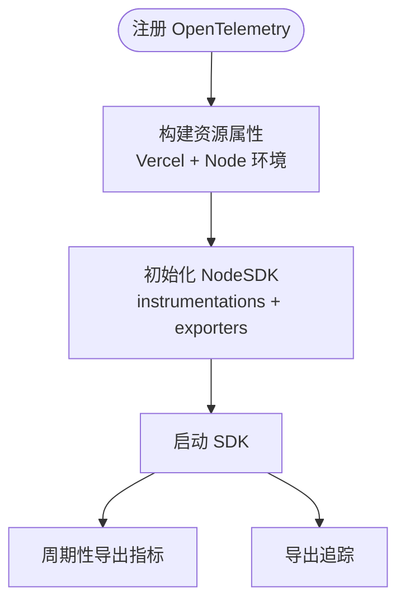
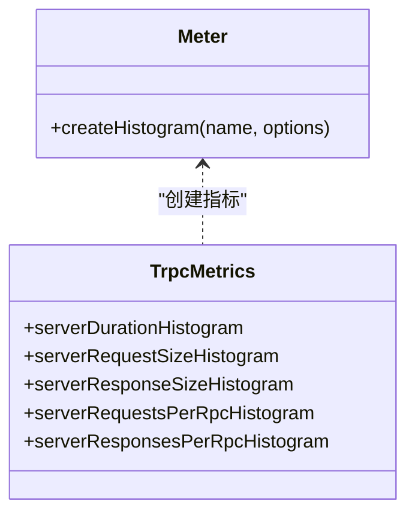
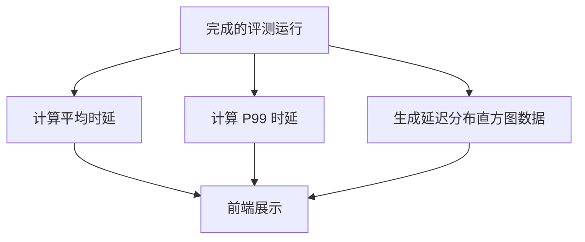
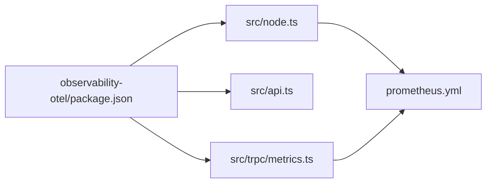
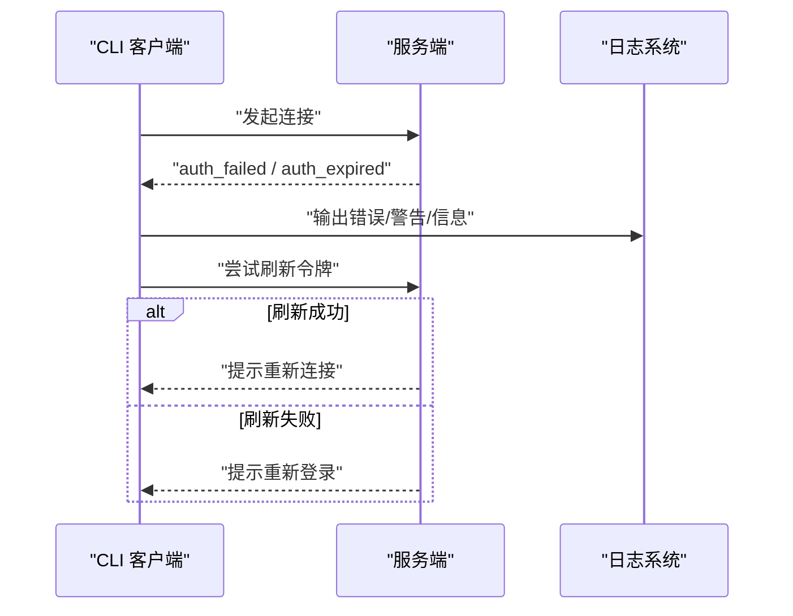

# 性能监控与可观测性

<cite>
**本文引用的文件**
- [packages/observability-otel/package.json](file://packages/observability-otel/package.json)
- [packages/observability-otel/src/node.ts](file://packages/observability-otel/src/node.ts)
- [packages/observability-otel/src/api.ts](file://packages/observability-otel/src/api.ts)
- [packages/observability-otel/src/trpc/metrics.ts](file://packages/observability-otel/src/trpc/metrics.ts)
- [docker-compose/production/grafana/prometheus/prometheus.yml](file://docker-compose/production/grafana/prometheus/prometheus.yml)
- [src/routes/(main)/eval/bench/[benchmarkId]/features/BenchmarkHeader/index.tsx](file://src/routes/(main)/eval/bench/[benchmarkId]/features/BenchmarkHeader/index.tsx)
- [src/routes/(main)/eval/bench/[benchmarkId]/features/Charts/BenchmarkCharts.tsx](file://src/routes/(main)/eval/bench/[benchmarkId]/features/Charts/BenchmarkCharts.tsx)
- [packages/model-runtime/src/core/streams/protocol.ts](file://packages/model-runtime/src/core/streams/protocol.ts)
- [apps/cli/src/commands/connect.ts](file://apps/cli/src/commands/connect.ts)
- [src/server/modules/AgentRuntime/factory.ts](file://src/server/modules/AgentRuntime/factory.ts)
- [src/server/services/riskControl/routerAlertNotification.ts](file://src/server/services/riskControl/routerAlertNotification.ts)
</cite>

## 目录

1. [简介](#简介)
2. [项目结构](#项目结构)
3. [核心组件](#核心组件)
4. [架构总览](#架构总览)
5. [组件详解](#组件详解)
6. [依赖关系分析](#依赖关系分析)
7. [性能考量](#性能考量)
8. [故障排查指南](#故障排查指南)
9. [结论](#结论)
10. [附录](#附录)

## 简介

本文件面向 LobeHub 的性能监控与可观测性，系统性梳理 OpenTelemetry 集成（追踪、指标、日志）、APM 使用、日志分析优化、性能指标监控与告警、性能问题诊断与容量规划，并给出监控工具链配置与可视化建议。内容基于仓库中已存在的可观测性包、Prometheus/Tempo/Grafana 组件以及前端评测与性能指标展示模块进行整理。

## 项目结构

围绕可观测性的关键位置如下：

- 可观测性 SDK 包：OpenTelemetry Node 自动仪器化、OTLP 导出器、资源属性注入
- Prometheus 配置：采集目标与抓取周期
- 前端评测与图表：延迟分布直方图、P99 指标展示
- 流式性能指标：模型推理时延、吞吐等指标流
- CLI 连接与日志：连接状态、错误处理与日志输出
- 运行时工厂与队列模式：运行时事件管理与 Redis 依赖
- 路由风险控制告警：告警阈值与通知占位实现

**图表来源**

- [packages/observability-otel/package.json](file://packages/observability-otel/package.json#L1-L29)
- [packages/observability-otel/src/node.ts](file://packages/observability-otel/src/node.ts#L1-L144)
- [packages/observability-otel/src/api.ts](file://packages/observability-otel/src/api.ts#L1-L2)
- [packages/observability-otel/src/trpc/metrics.ts](file://packages/observability-otel/src/trpc/metrics.ts#L1-L32)
- [docker-compose/production/grafana/prometheus/prometheus.yml](file://docker-compose/production/grafana/prometheus/prometheus.yml#L1-L12)
- [src/routes/(main)/eval/bench/\[benchmarkId\]/features/Charts/BenchmarkCharts.tsx](<file://src/routes/(main)/eval/bench/[benchmarkId]/features/Charts/BenchmarkCharts.tsx#L154-L174>)
- [src/routes/(main)/eval/bench/\[benchmarkId\]/features/BenchmarkHeader/index.tsx](<file://src/routes/(main)/eval/bench/[benchmarkId]/features/BenchmarkHeader/index.tsx#L134-L193>)
- [apps/cli/src/commands/connect.ts](file://apps/cli/src/commands/connect.ts#L281-L343)
- [src/server/modules/AgentRuntime/factory.ts](file://src/server/modules/AgentRuntime/factory.ts#L49-L70)

**章节来源**

- [packages/observability-otel/package.json](file://packages/observability-otel/package.json#L1-L29)
- [packages/observability-otel/src/node.ts](file://packages/observability-otel/src/node.ts#L1-L144)
- [docker-compose/production/grafana/prometheus/prometheus.yml](file://docker-compose/production/grafana/prometheus/prometheus.yml#L1-L12)

## 核心组件

- OpenTelemetry Node SDK：自动仪器化 HTTP/Pg，OTLP Trace/Metric 导出，资源属性（环境、部署信息、版本）
- tRPC 指标：RPC 服务端耗时、请求 / 响应大小、消息数量直方图
- Prometheus 抓取：本地 Prometheus 与 Tempo 目标抓取
- 前端评测指标：平均时延、P99、延迟分布直方图
- 流式性能指标：模型推理阶段的时延、首字时间、吞吐等指标流
- CLI 日志与连接：重连、鉴权失败 / 过期、错误处理与日志输出
- 运行时工厂：内存 / 队列模式选择与 Redis 依赖
- 路由风险控制告警：错误率阈值与通知占位

**章节来源**

- [packages/observability-otel/src/node.ts](file://packages/observability-otel/src/node.ts#L124-L141)
- [packages/observability-otel/src/trpc/metrics.ts](file://packages/observability-otel/src/trpc/metrics.ts#L1-L32)
- [docker-compose/production/grafana/prometheus/prometheus.yml](file://docker-compose/production/grafana/prometheus/prometheus.yml#L5-L12)
- [src/routes/(main)/eval/bench/\[benchmarkId\]/features/BenchmarkHeader/index.tsx](<file://src/routes/(main)/eval/bench/[benchmarkId]/features/BenchmarkHeader/index.tsx#L163-L183>)
- [packages/model-runtime/src/core/streams/protocol.ts](file://packages/model-runtime/src/core/streams/protocol.ts#L509-L533)
- [apps/cli/src/commands/connect.ts](file://apps/cli/src/commands/connect.ts#L281-L343)
- [src/server/modules/AgentRuntime/factory.ts](file://src/server/modules/AgentRuntime/factory.ts#L49-L70)
- [src/server/services/riskControl/routerAlertNotification.ts](file://src/server/services/riskControl/routerAlertNotification.ts#L1-L30)

## 架构总览

下图展示了从应用到可观测性后端的数据流路径，包括 Node SDK 的自动仪器化、OTLP 导出、Prometheus 抓取与前端评测指标。

**图表来源**

- [packages/observability-otel/src/node.ts](file://packages/observability-otel/src/node.ts#L124-L141)
- [docker-compose/production/grafana/prometheus/prometheus.yml](file://docker-compose/production/grafana/prometheus/prometheus.yml#L5-L12)

## 组件详解

### OpenTelemetry Node 集成与资源属性

- 自动仪器化：HTTP、PostgreSQL、通用 Node 仪器化
- 指标导出：周期性导出（可配置间隔），OTLP HTTP
- 追踪导出：OTLP HTTP
- 资源属性：Vercel 环境变量、Node 环境变量、服务名与版本
- 调试日志：支持通过环境变量设置诊断级别

**图表来源**

- [packages/observability-otel/src/node.ts](file://packages/observability-otel/src/node.ts#L94-L141)

**章节来源**

- [packages/observability-otel/src/node.ts](file://packages/observability-otel/src/node.ts#L1-L144)

### tRPC 服务器指标

- 指标类型：服务端耗时直方图、请求 / 响应大小直方图、每 RPC 请求 / 响应数量直方图
- 计量器命名空间：trpc-server
- 单位与描述：毫秒、字节、计数

**图表来源**

- [packages/observability-otel/src/trpc/metrics.ts](file://packages/observability-otel/src/trpc/metrics.ts#L1-L32)

**章节来源**

- [packages/observability-otel/src/trpc/metrics.ts](file://packages/observability-otel/src/trpc/metrics.ts#L1-L32)

### Prometheus 抓取配置

- 抓取间隔与评估间隔：全局配置
- 抓取目标：Prometheus 自身、Tempo
- 说明：当前配置指向本地目标，实际部署需确保对应服务可达

**章节来源**

- [docker-compose/production/grafana/prometheus/prometheus.yml](file://docker-compose/production/grafana/prometheus/prometheus.yml#L1-L12)

### 前端评测与性能指标展示

- 平均时延与 P99 计算：对完成的评测运行进行统计
- 延迟分布直方图：按通过 / 失败 / 错误分组的柱状图
- 展示组件：图表卡片与标题区域

**图表来源**

- [src/routes/(main)/eval/bench/\[benchmarkId\]/features/BenchmarkHeader/index.tsx](<file://src/routes/(main)/eval/bench/[benchmarkId]/features/BenchmarkHeader/index.tsx#L163-L183>)
- [src/routes/(main)/eval/bench/\[benchmarkId\]/features/Charts/BenchmarkCharts.tsx](<file://src/routes/(main)/eval/bench/[benchmarkId]/features/Charts/BenchmarkCharts.tsx#L154-L174>)

**章节来源**

- [src/routes/(main)/eval/bench/\[benchmarkId\]/features/BenchmarkHeader/index.tsx](<file://src/routes/(main)/eval/bench/[benchmarkId]/features/BenchmarkHeader/index.tsx#L134-L193>)
- [src/routes/(main)/eval/bench/\[benchmarkId\]/features/Charts/BenchmarkCharts.tsx](<file://src/routes/(main)/eval/bench/[benchmarkId]/features/Charts/BenchmarkCharts.tsx#L154-L174>)

### 流式性能指标（模型推理）

- 指标字段：时延、首字时间、吞吐、总耗时
- 处理方式：TransformStream 分块处理，按令牌速度生成性能数据块
- 应用场景：实时展示模型推理性能

**章节来源**

- [packages/model-runtime/src/core/streams/protocol.ts](file://packages/model-runtime/src/core/streams/protocol.ts#L509-L533)

### CLI 连接与日志

- 事件处理：重连、鉴权失败 / 过期、错误、优雅退出
- 日志记录：调试 / 错误 / 信息 / 警告级别输出
- 清理流程：断开连接、清理进程与状态文件

**章节来源**

- [apps/cli/src/commands/connect.ts](file://apps/cli/src/commands/connect.ts#L281-L343)

### 运行时工厂与队列模式

- 内存模式：默认启用，简单易用
- 队列模式：需要 Redis，否则抛出配置错误
- 事件管理：根据模式选择 InMemory 或 Redis 事件管理器

**章节来源**

- [src/server/modules/AgentRuntime/factory.ts](file://src/server/modules/AgentRuntime/factory.ts#L49-L70)

### 路由风险控制告警（占位）

- 接口：通道 / 模型级告警阈值与通知函数
- 当前实现：返回占位逻辑，未接入外部告警通道

**章节来源**

- [src/server/services/riskControl/routerAlertNotification.ts](file://src/server/services/riskControl/routerAlertNotification.ts#L1-L30)

## 依赖关系分析

- @lobechat/observability-otel 作为统一的可观测性包，提供 Node SDK 注册、API 导出与 tRPC 指标
- Prometheus 通过静态配置抓取 OTLP 导出的目标
- 前端评测模块消费运行时与 tRPC 指标，形成闭环

**图表来源**

- [packages/observability-otel/package.json](file://packages/observability-otel/package.json#L1-L29)
- [packages/observability-otel/src/node.ts](file://packages/observability-otel/src/node.ts#L1-L144)
- [packages/observability-otel/src/api.ts](file://packages/observability-otel/src/api.ts#L1-L2)
- [packages/observability-otel/src/trpc/metrics.ts](file://packages/observability-otel/src/trpc/metrics.ts#L1-L32)
- [docker-compose/production/grafana/prometheus/prometheus.yml](file://docker-compose/production/grafana/prometheus/prometheus.yml#L5-L12)

**章节来源**

- [packages/observability-otel/package.json](file://packages/observability-otel/package.json#L1-L29)
- [packages/observability-otel/src/node.ts](file://packages/observability-otel/src/node.ts#L124-L141)
- [packages/observability-otel/src/trpc/metrics.ts](file://packages/observability-otel/src/trpc/metrics.ts#L1-L32)
- [docker-compose/production/grafana/prometheus/prometheus.yml](file://docker-compose/production/grafana/prometheus/prometheus.yml#L5-L12)

## 性能考量

- 指标导出频率：可通过环境变量调整指标导出间隔，平衡数据粒度与开销
- 资源属性：在不同部署环境（Vercel/Node）注入差异化标签，便于多维分析
- tRPC 指标：关注服务端耗时与消息数量，识别慢 RPC 与异常流量
- 前端评测：P99 与延迟分布直方图用于识别尾部延迟与异常样本
- 流式指标：在模型推理场景中，结合 TTFT、吞吐与总耗时进行端到端评估

**章节来源**

- [packages/observability-otel/src/node.ts](file://packages/observability-otel/src/node.ts#L116-L122)
- [packages/observability-otel/src/trpc/metrics.ts](file://packages/observability-otel/src/trpc/metrics.ts#L5-L31)
- [src/routes/(main)/eval/bench/\[benchmarkId\]/features/BenchmarkHeader/index.tsx](<file://src/routes/(main)/eval/bench/[benchmarkId]/features/BenchmarkHeader/index.tsx#L163-L183>)
- [packages/model-runtime/src/core/streams/protocol.ts](file://packages/model-runtime/src/core/streams/protocol.ts#L509-L533)

## 故障排查指南

- 连接问题：检查重连事件与错误事件处理，确认日志输出是否包含错误原因
- 鉴权问题：鉴权失败与过期时应提示重新登录或刷新令牌
- 运行时模式：启用队列模式需确保 Redis 可用，否则会抛出配置错误
- 告警占位：路由风险控制告警当前为占位实现，需补充阈值与通知通道

**图表来源**

- [apps/cli/src/commands/connect.ts](file://apps/cli/src/commands/connect.ts#L286-L304)

**章节来源**

- [apps/cli/src/commands/connect.ts](file://apps/cli/src/commands/connect.ts#L281-L343)
- [src/server/modules/AgentRuntime/factory.ts](file://src/server/modules/AgentRuntime/factory.ts#L62-L67)
- [src/server/services/riskControl/routerAlertNotification.ts](file://src/server/services/riskControl/routerAlertNotification.ts#L12-L14)

## 结论

本项目已具备完善的 OpenTelemetry Node 集成与 tRPC 指标体系，并通过 Prometheus 抓取实现基础的指标采集。前端评测模块提供了关键性能指标（如 P99）与可视化能力；流式性能指标为模型推理场景提供了细粒度观测。后续可在以下方面完善：接入 Grafana 仪表盘与告警规则、补齐路由风险控制告警通道、优化日志结构化与查询、建立性能基线与容量规划流程。

## 附录

- 监控工具链建议
  - Grafana：导入 Prometheus 数据源，基于 tRPC 指标与前端评测指标构建仪表盘
  - Tempo：接入 OTLP Trace 导出，实现分布式追踪可视化
  - Alertmanager：基于 Prometheus 规则配置告警（如 P99 超阈、错误率上升）
- 日志分析优化
  - 结构化日志：统一字段（trace_id/span_id、服务名、环境、版本）
  - 查询优化：利用资源属性进行过滤与聚合
  - 存储策略：按保留期分层存储，热点数据优先缓存
- 性能基线与容量规划
  - 基线：以 P99 与吞吐为核心指标，设定 SLI/SLO
  - 回归检测：对比历史窗口指标，识别异常波动
  - 容量规划：结合 CPU / 内存 / 数据库负载与 tRPC 指标趋势预估扩容
