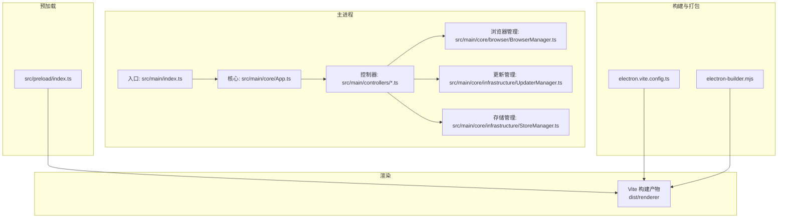
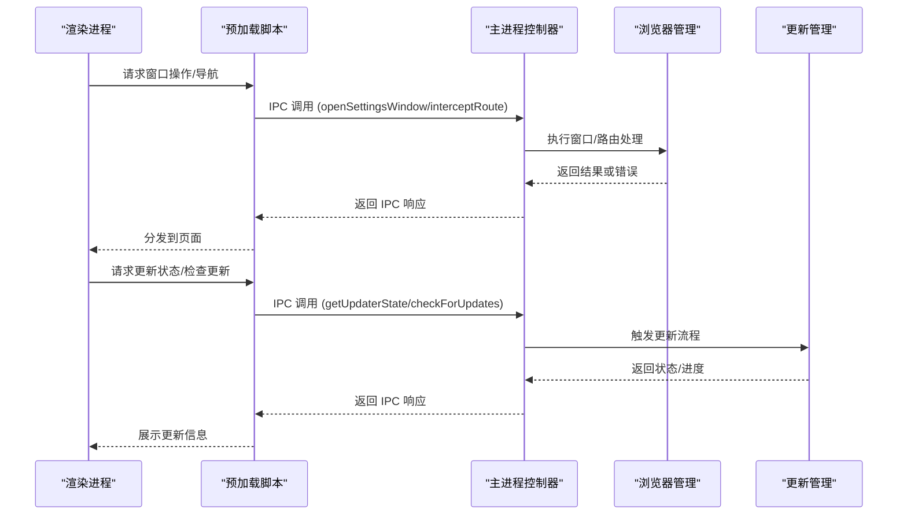
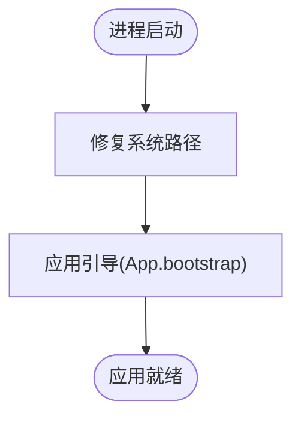
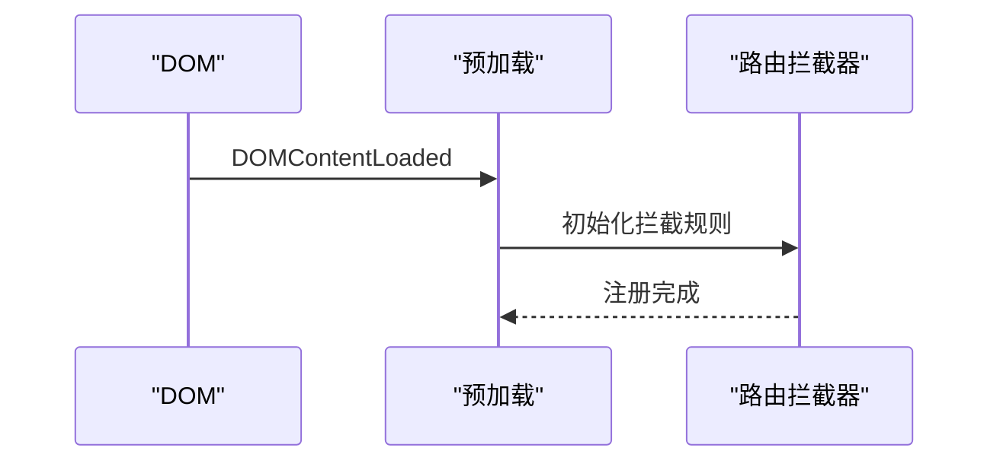
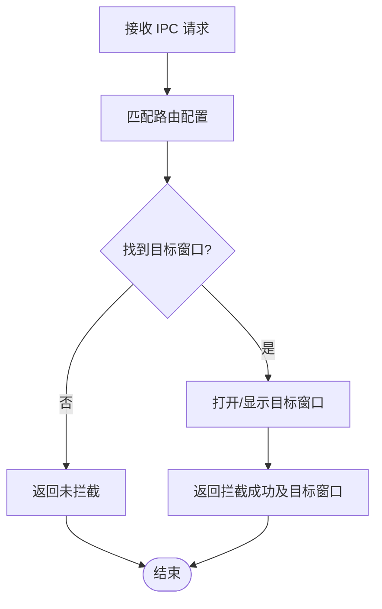
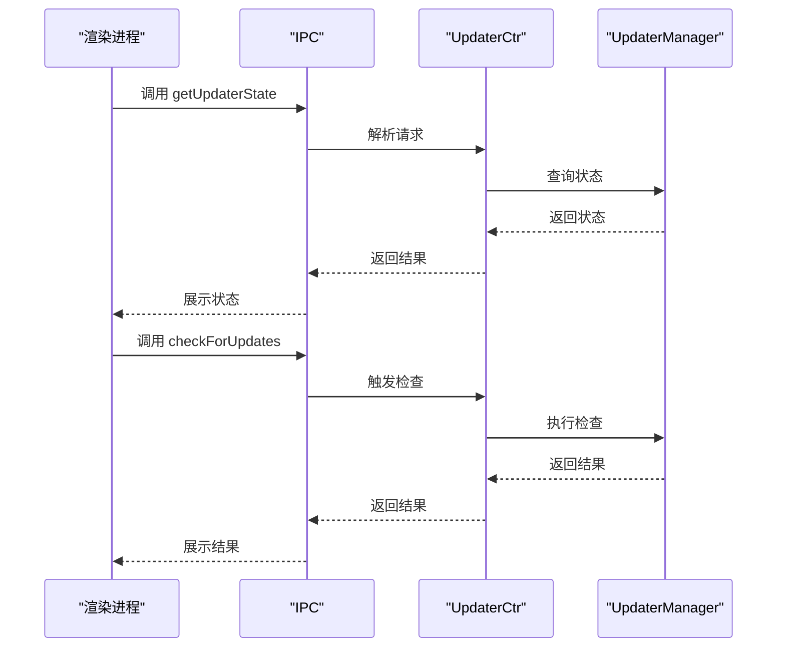
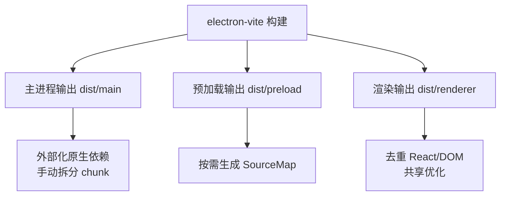
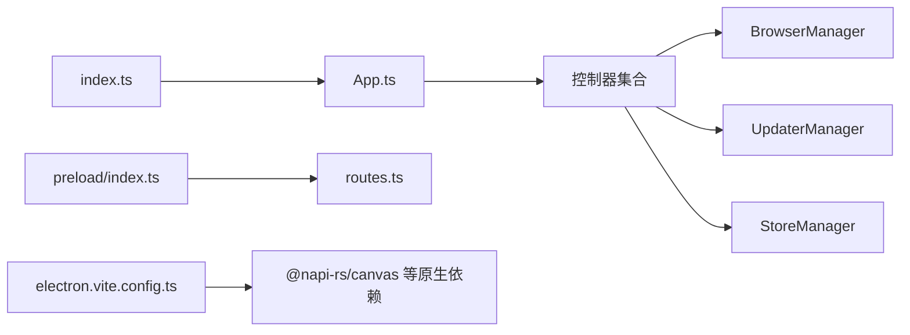
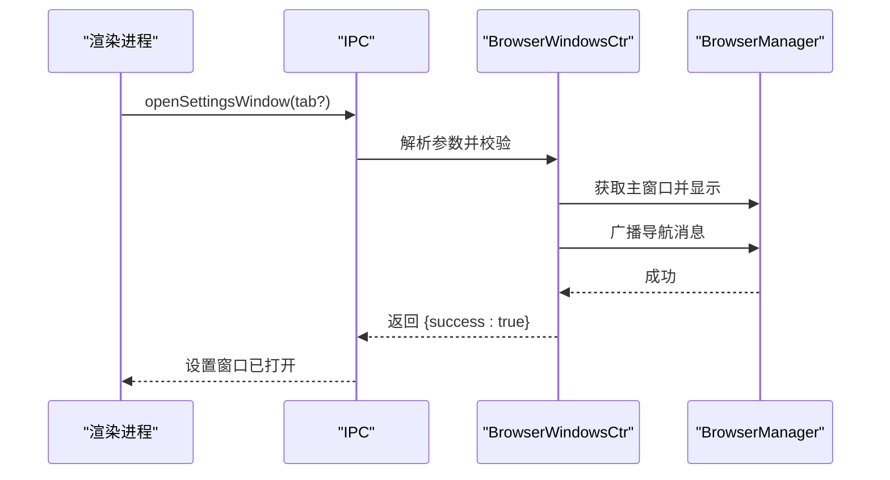

# 桌面应用性能优化

<cite>
**本文引用的文件**
- [apps/desktop/package.json](file://apps/desktop/package.json)
- [apps/desktop/electron.vite.config.ts](file://apps/desktop/electron.vite.config.ts)
- [apps/desktop/src/main/index.ts](file://apps/desktop/src/main/index.ts)
- [apps/desktop/src/preload/index.ts](file://apps/desktop/src/preload/index.ts)
- [apps/desktop/src/main/controllers/BrowserWindowsCtr.ts](file://apps/desktop/src/main/controllers/BrowserWindowsCtr.ts)
- [apps/desktop/src/main/controllers/UpdaterCtr.ts](file://apps/desktop/src/main/controllers/UpdaterCtr.ts)
- [apps/desktop/src/main/core/App.ts](file://apps/desktop/src/main/core/App.ts)
- [apps/desktop/src/main/core/browser/BrowserManager.ts](file://apps/desktop/src/main/core/browser/BrowserManager.ts)
- [apps/desktop/src/main/core/infrastructure/UpdaterManager.ts](file://apps/desktop/src/main/core/infrastructure/UpdaterManager.ts)
- [apps/desktop/src/main/core/infrastructure/StoreManager.ts](file://apps/desktop/src/main/core/infrastructure/StoreManager.ts)
- [apps/desktop/src/main/utils/ipc/index.ts](file://apps/desktop/src/main/utils/ipc/index.ts)
- [apps/desktop/src/common/routes.ts](file://apps/desktop/src/common/routes.ts)
- [apps/desktop/electron-builder.mjs](file://apps/desktop/electron-builder.mjs)
- [apps/desktop/dev-app-update.yml](file://apps/desktop/dev-app-update.yml)
- [apps/desktop/native-deps.config.mjs](file://apps/desktop/native-deps.config.mjs)
- [plugins/vite/sharedRendererConfig.ts](file://plugins/vite/sharedRendererConfig.ts)
</cite>

## 目录
1. [简介](#简介)
2. [项目结构](#项目结构)
3. [核心组件](#核心组件)
4. [架构总览](#架构总览)
5. [详细组件分析](#详细组件分析)
6. [依赖关系分析](#依赖关系分析)
7. [性能考量](#性能考量)
8. [故障排查指南](#故障排查指南)
9. [结论](#结论)
10. [附录](#附录)

## 简介
本文件面向 LobeHub 桌面应用（基于 Electron）的性能优化，系统性梳理主进程与渲染进程分离、IPC 优化、资源与内存管理、打包与分发优化、渲染性能优化以及性能监控工具使用方法。文档以仓库现有实现为依据，结合可落地的优化建议，帮助在保证功能完整性的同时提升启动速度、运行效率与稳定性。

## 项目结构
桌面应用采用多模块组织方式：主进程负责应用生命周期、窗口管理、自动更新、系统集成；预加载脚本提供受控的渲染进程 API；渲染侧通过 Vite 构建并按需拆分资源。构建与打包由 electron-vite 和 electron-builder 驱动，支持多平台本地打包与发布。

图表来源
- [apps/desktop/src/main/index.ts](file://apps/desktop/src/main/index.ts#L1-L9)
- [apps/desktop/src/main/core/App.ts](file://apps/desktop/src/main/core/App.ts)
- [apps/desktop/src/main/controllers/BrowserWindowsCtr.ts](file://apps/desktop/src/main/controllers/BrowserWindowsCtr.ts#L1-L234)
- [apps/desktop/src/main/core/browser/BrowserManager.ts](file://apps/desktop/src/main/core/browser/BrowserManager.ts)
- [apps/desktop/src/main/core/infrastructure/UpdaterManager.ts](file://apps/desktop/src/main/core/infrastructure/UpdaterManager.ts)
- [apps/desktop/src/main/core/infrastructure/StoreManager.ts](file://apps/desktop/src/main/core/infrastructure/StoreManager.ts)
- [apps/desktop/src/preload/index.ts](file://apps/desktop/src/preload/index.ts#L1-L15)
- [apps/desktop/electron.vite.config.ts](file://apps/desktop/electron.vite.config.ts#L45-L115)
- [apps/desktop/electron-builder.mjs](file://apps/desktop/electron-builder.mjs)

章节来源
- [apps/desktop/package.json](file://apps/desktop/package.json#L1-L123)
- [apps/desktop/electron.vite.config.ts](file://apps/desktop/electron.vite.config.ts#L1-L116)

## 核心组件
- 主进程入口与引导：负责初始化路径修复与应用引导，确保环境变量与工作目录正确。
- 控制器层：围绕窗口、路由拦截、更新等职责划分控制器，统一通过 IPC 注解暴露方法。
- 浏览器管理：集中管理主窗口与多实例窗口，提供最小尺寸、尺寸调整、目标窗口打开等能力。
- 更新管理：封装自动更新检查、下载、安装时机与通道切换逻辑。
- 存储管理：持久化配置（如更新通道），供运行时读取。
- 预加载脚本：向渲染进程注入安全可控的 API，并设置路由拦截器。
- 构建配置：主/预加载/渲染三段式构建，手动分块与外部化原生依赖，优化资源体积与冷启动。

章节来源
- [apps/desktop/src/main/index.ts](file://apps/desktop/src/main/index.ts#L1-L9)
- [apps/desktop/src/main/controllers/BrowserWindowsCtr.ts](file://apps/desktop/src/main/controllers/BrowserWindowsCtr.ts#L1-L234)
- [apps/desktop/src/main/controllers/UpdaterCtr.ts](file://apps/desktop/src/main/controllers/UpdaterCtr.ts#L1-L79)
- [apps/desktop/src/main/core/App.ts](file://apps/desktop/src/main/core/App.ts)
- [apps/desktop/src/main/core/browser/BrowserManager.ts](file://apps/desktop/src/main/core/browser/BrowserManager.ts)
- [apps/desktop/src/main/core/infrastructure/UpdaterManager.ts](file://apps/desktop/src/main/core/infrastructure/UpdaterManager.ts)
- [apps/desktop/src/main/core/infrastructure/StoreManager.ts](file://apps/desktop/src/main/core/infrastructure/StoreManager.ts)
- [apps/desktop/src/preload/index.ts](file://apps/desktop/src/preload/index.ts#L1-L15)
- [apps/desktop/electron.vite.config.ts](file://apps/desktop/electron.vite.config.ts#L45-L115)

## 架构总览
下图展示主进程、预加载与渲染进程之间的交互关系，以及关键职责边界与数据流。

图表来源
- [apps/desktop/src/preload/index.ts](file://apps/desktop/src/preload/index.ts#L1-L15)
- [apps/desktop/src/main/controllers/BrowserWindowsCtr.ts](file://apps/desktop/src/main/controllers/BrowserWindowsCtr.ts#L23-L144)
- [apps/desktop/src/main/controllers/UpdaterCtr.ts](file://apps/desktop/src/main/controllers/UpdaterCtr.ts#L14-L77)
- [apps/desktop/src/main/core/browser/BrowserManager.ts](file://apps/desktop/src/main/core/browser/BrowserManager.ts)
- [apps/desktop/src/main/core/infrastructure/UpdaterManager.ts](file://apps/desktop/src/main/core/infrastructure/UpdaterManager.ts)

## 详细组件分析

### 主进程与应用引导
- 入口文件负责修复 PATH 并执行应用引导，确保后续模块可用。
- 应用核心类承载全局状态与模块装配，控制器通过依赖注入方式获取上下文。

图表来源
- [apps/desktop/src/main/index.ts](file://apps/desktop/src/main/index.ts#L1-L9)
- [apps/desktop/src/main/core/App.ts](file://apps/desktop/src/main/core/App.ts)

章节来源
- [apps/desktop/src/main/index.ts](file://apps/desktop/src/main/index.ts#L1-L9)

### 预加载与安全桥接
- 预加载脚本在 DOMContentLoaded 后注册路由拦截器，限制不被信任的导航。
- 统一注入 Electron API，避免直接暴露 Node.js 能力给渲染进程。

图表来源
- [apps/desktop/src/preload/index.ts](file://apps/desktop/src/preload/index.ts#L1-L15)

章节来源
- [apps/desktop/src/preload/index.ts](file://apps/desktop/src/preload/index.ts#L1-L15)

### 窗口与路由拦截控制器
- 提供设置页打开、窗口最小化/最大化/关闭、窗口尺寸调整、最小尺寸约束等能力。
- 支持路由拦截：根据匹配规则决定是否在目标窗口打开链接，避免无序弹窗。

图表来源
- [apps/desktop/src/main/controllers/BrowserWindowsCtr.ts](file://apps/desktop/src/main/controllers/BrowserWindowsCtr.ts#L106-L144)
- [apps/desktop/src/common/routes.ts](file://apps/desktop/src/common/routes.ts)

章节来源
- [apps/desktop/src/main/controllers/BrowserWindowsCtr.ts](file://apps/desktop/src/main/controllers/BrowserWindowsCtr.ts#L1-L234)
- [apps/desktop/src/common/routes.ts](file://apps/desktop/src/common/routes.ts)

### 自动更新控制器
- 提供检查更新、下载更新、立即安装、稍后安装、查询通道与状态等接口。
- 与更新管理器协作，支持稳定/夜间/测试通道切换。

图表来源
- [apps/desktop/src/main/controllers/UpdaterCtr.ts](file://apps/desktop/src/main/controllers/UpdaterCtr.ts#L14-L77)
- [apps/desktop/src/main/core/infrastructure/UpdaterManager.ts](file://apps/desktop/src/main/core/infrastructure/UpdaterManager.ts)

章节来源
- [apps/desktop/src/main/controllers/UpdaterCtr.ts](file://apps/desktop/src/main/controllers/UpdaterCtr.ts#L1-L79)

### 构建与资源拆分
- 主进程构建启用压缩与外部化原生依赖，手动拆分 debug 包与按命名空间拆分 i18n 资源，降低首屏体积。
- 渲染侧使用共享优化与插件配置，避免重复依赖，减少冷启动时间。
- 预加载独立构建，便于调试与缩小主进程包体。

图表来源
- [apps/desktop/electron.vite.config.ts](file://apps/desktop/electron.vite.config.ts#L45-L115)
- [apps/desktop/native-deps.config.mjs](file://apps/desktop/native-deps.config.mjs)
- [plugins/vite/sharedRendererConfig.ts](file://plugins/vite/sharedRendererConfig.ts)

章节来源
- [apps/desktop/electron.vite.config.ts](file://apps/desktop/electron.vite.config.ts#L45-L115)
- [apps/desktop/native-deps.config.mjs](file://apps/desktop/native-deps.config.mjs)
- [plugins/vite/sharedRendererConfig.ts](file://plugins/vite/sharedRendererConfig.ts)

## 依赖关系分析
- 主进程对控制器、浏览器管理器、更新管理器、存储管理器存在直接依赖；控制器通过 IPC 注解与渲染进程解耦。
- 预加载仅依赖注入的安全 API 与路由拦截器，避免直接访问 Node.js 能力。
- 构建阶段通过外部化原生模块与手动分块，降低主进程包体并提升冷启动性能。

图表来源
- [apps/desktop/src/main/index.ts](file://apps/desktop/src/main/index.ts#L1-L9)
- [apps/desktop/src/main/core/App.ts](file://apps/desktop/src/main/core/App.ts)
- [apps/desktop/src/main/controllers/BrowserWindowsCtr.ts](file://apps/desktop/src/main/controllers/BrowserWindowsCtr.ts#L1-L234)
- [apps/desktop/src/main/core/browser/BrowserManager.ts](file://apps/desktop/src/main/core/browser/BrowserManager.ts)
- [apps/desktop/src/main/core/infrastructure/UpdaterManager.ts](file://apps/desktop/src/main/core/infrastructure/UpdaterManager.ts)
- [apps/desktop/src/main/core/infrastructure/StoreManager.ts](file://apps/desktop/src/main/core/infrastructure/StoreManager.ts)
- [apps/desktop/src/preload/index.ts](file://apps/desktop/src/preload/index.ts#L1-L15)
- [apps/desktop/src/common/routes.ts](file://apps/desktop/src/common/routes.ts)
- [apps/desktop/electron.vite.config.ts](file://apps/desktop/electron.vite.config.ts#L45-L115)
- [apps/desktop/native-deps.config.mjs](file://apps/desktop/native-deps.config.mjs)

章节来源
- [apps/desktop/src/main/index.ts](file://apps/desktop/src/main/index.ts#L1-L9)
- [apps/desktop/src/main/controllers/BrowserWindowsCtr.ts](file://apps/desktop/src/main/controllers/BrowserWindowsCtr.ts#L1-L234)
- [apps/desktop/src/main/controllers/UpdaterCtr.ts](file://apps/desktop/src/main/controllers/UpdaterCtr.ts#L1-L79)
- [apps/desktop/electron.vite.config.ts](file://apps/desktop/electron.vite.config.ts#L45-L115)

## 性能考量

### 主进程与渲染进程分离
- 将系统级任务（窗口管理、自动更新、协议处理）集中在主进程，渲染进程只保留 UI 与业务逻辑，降低锁竞争与崩溃影响范围。
- 使用预加载脚本桥接受限 API，避免在渲染进程中直接调用 Node/Electron 能力。

章节来源
- [apps/desktop/src/preload/index.ts](file://apps/desktop/src/preload/index.ts#L1-L15)
- [apps/desktop/src/main/controllers/BrowserWindowsCtr.ts](file://apps/desktop/src/main/controllers/BrowserWindowsCtr.ts#L1-L234)
- [apps/desktop/src/main/controllers/UpdaterCtr.ts](file://apps/desktop/src/main/controllers/UpdaterCtr.ts#L1-L79)

### 资源使用与内存管理
- 外部化原生依赖并在主进程构建中拆分 chunk，减少主进程包体与启动扫描时间。
- 使用手动分块策略（如 debug 包与 i18n 按命名空间拆分），降低首屏资源压力。
- 预加载独立构建，便于定位内存问题与减少主进程副作用。

章节来源
- [apps/desktop/electron.vite.config.ts](file://apps/desktop/electron.vite.config.ts#L45-L115)
- [apps/desktop/native-deps.config.mjs](file://apps/desktop/native-deps.config.mjs)

### 进程间通信优化
- 控制器统一通过 IPC 注解暴露方法，减少直接调用开销与耦合。
- 在窗口与路由拦截场景中，尽量在主进程完成决策与窗口切换，避免往返抖动。

章节来源
- [apps/desktop/src/main/controllers/BrowserWindowsCtr.ts](file://apps/desktop/src/main/controllers/BrowserWindowsCtr.ts#L1-L234)
- [apps/desktop/src/main/utils/ipc/index.ts](file://apps/desktop/src/main/utils/ipc/index.ts)

### 打包与分发优化
- 使用 electron-builder 进行多平台本地打包与发布，支持 ASAR、notarize、签名等选项，保障安装包体积与安全性。
- 开发阶段可通过本地打包参数禁用 notarize 与 ASAR，加速迭代。
- 通过 UPDATE_CHANNEL 与 dev-app-update.yml 配置更新通道与服务器地址，便于灰度与回滚。

章节来源
- [apps/desktop/package.json](file://apps/desktop/package.json#L30-L36)
- [apps/desktop/electron-builder.mjs](file://apps/desktop/electron-builder.mjs)
- [apps/desktop/dev-app-update.yml](file://apps/desktop/dev-app-update.yml)

### 渲染性能优化
- 通过共享优化与去重策略减少重复依赖，缩短冷启动时间。
- 使用预加载路由拦截器避免无效窗口弹出，降低渲染线程负担。
- 对于 Canvas/WebGL/WebView 场景，建议结合实际业务进行懒加载与缓存策略（具体实现不在当前文件范围内）。

章节来源
- [apps/desktop/electron.vite.config.ts](file://apps/desktop/electron.vite.config.ts#L105-L114)
- [apps/desktop/src/preload/index.ts](file://apps/desktop/src/preload/index.ts#L1-L15)

### 原生性能优化技术
- Node.js 侧：合理拆分依赖、避免在主进程执行阻塞任务；将耗时任务下沉至专用子进程或后台服务。
- V8 引擎：减少大对象频繁分配与闭包捕获，避免长任务占用事件循环。
- 系统 API：谨慎使用权限与系统级 API，避免在主线程同步调用可能阻塞的系统调用。
- 硬件资源：优先使用 GPU 加速渲染路径，避免在渲染线程执行 CPU 密集型计算。

（本节为通用指导，不直接分析具体文件）

## 故障排查指南

### 自动更新问题
- 检查更新通道与服务器配置是否一致，确认通道值在允许集合内。
- 若安装失败，优先查看更新管理器日志与状态返回，确认网络与签名状态。

章节来源
- [apps/desktop/src/main/controllers/UpdaterCtr.ts](file://apps/desktop/src/main/controllers/UpdaterCtr.ts#L63-L77)
- [apps/desktop/src/main/core/infrastructure/UpdaterManager.ts](file://apps/desktop/src/main/core/infrastructure/UpdaterManager.ts)

### 窗口与路由拦截异常
- 确认路由匹配规则是否正确，目标窗口是否存在且可恢复。
- 检查 IPC 上下文标识是否有效，避免跨窗口误判。

章节来源
- [apps/desktop/src/main/controllers/BrowserWindowsCtr.ts](file://apps/desktop/src/main/controllers/BrowserWindowsCtr.ts#L106-L144)
- [apps/desktop/src/main/utils/ipc/index.ts](file://apps/desktop/src/main/utils/ipc/index.ts)

### 构建与打包问题
- 若主进程包体过大，检查外部化配置与手动分块策略是否生效。
- 本地打包时注意 notarize 与 ASAR 参数，避免签名与权限问题导致安装失败。

章节来源
- [apps/desktop/electron.vite.config.ts](file://apps/desktop/electron.vite.config.ts#L45-L115)
- [apps/desktop/package.json](file://apps/desktop/package.json#L30-L36)

### 性能分析与监控
- 使用 Electron DevTools 定位渲染性能瓶颈与内存泄漏。
- 结合性能分析器与内存快照，识别长任务与大对象分配热点。
- 崩溃报告分析：收集主/渲染进程崩溃堆栈，结合日志与更新状态定位根因。

（本节为通用指导，不直接分析具体文件）

## 结论
通过对主进程与渲染进程的职责分离、IPC 接口的统一设计、构建期的外部化与分块策略，以及自动更新与窗口管理的模块化实现，LobeHub 桌面应用在可维护性与性能之间取得了良好平衡。建议在后续迭代中持续关注启动时间、内存占用与更新体验，并结合实际业务场景引入更精细的渲染性能优化与监控体系。

## 附录

### 关键流程时序图：设置窗口打开

图表来源
- [apps/desktop/src/main/controllers/BrowserWindowsCtr.ts](file://apps/desktop/src/main/controllers/BrowserWindowsCtr.ts#L23-L53)
- [apps/desktop/src/main/core/browser/BrowserManager.ts](file://apps/desktop/src/main/core/browser/BrowserManager.ts)