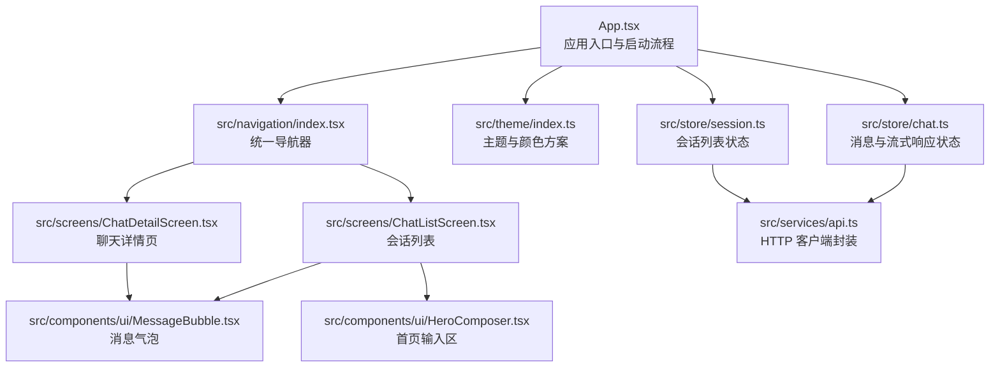
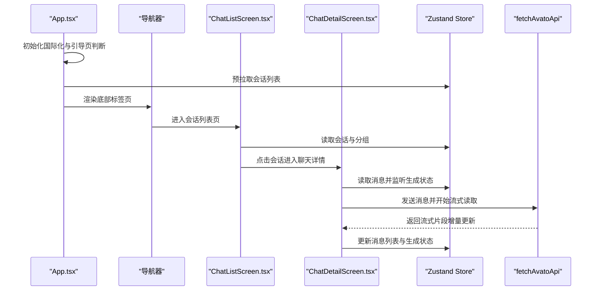
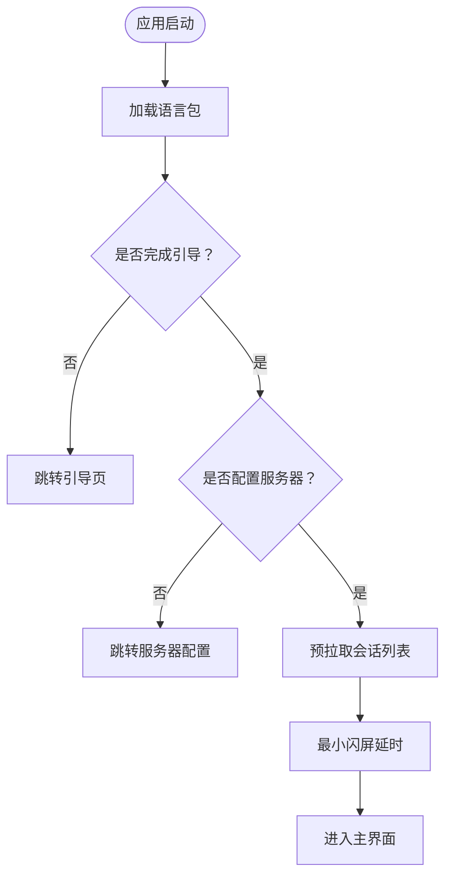
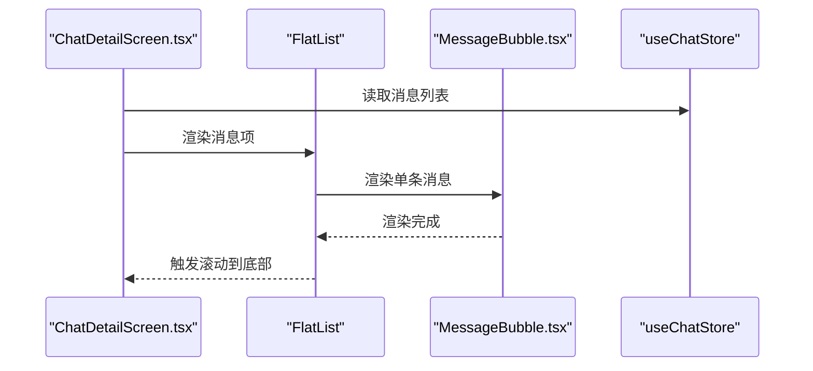
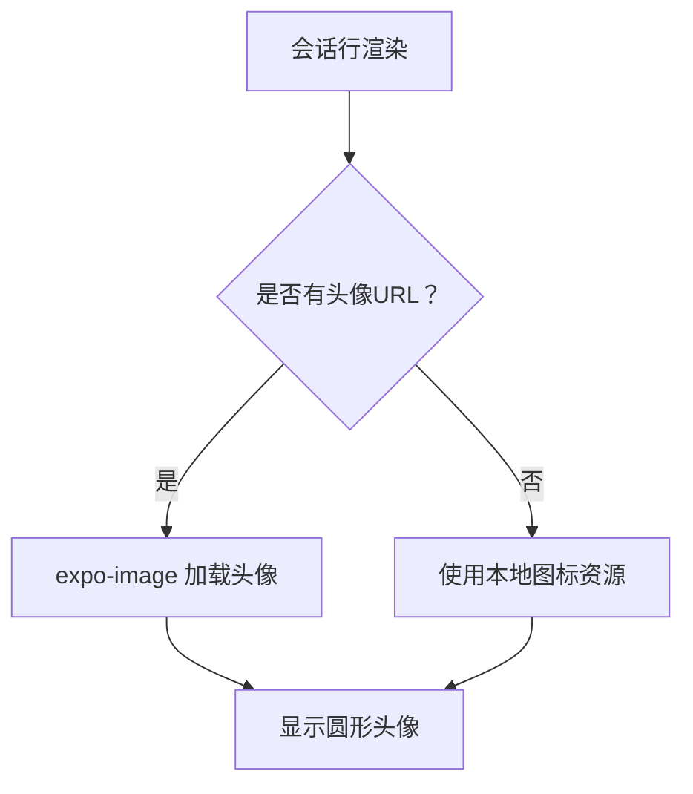
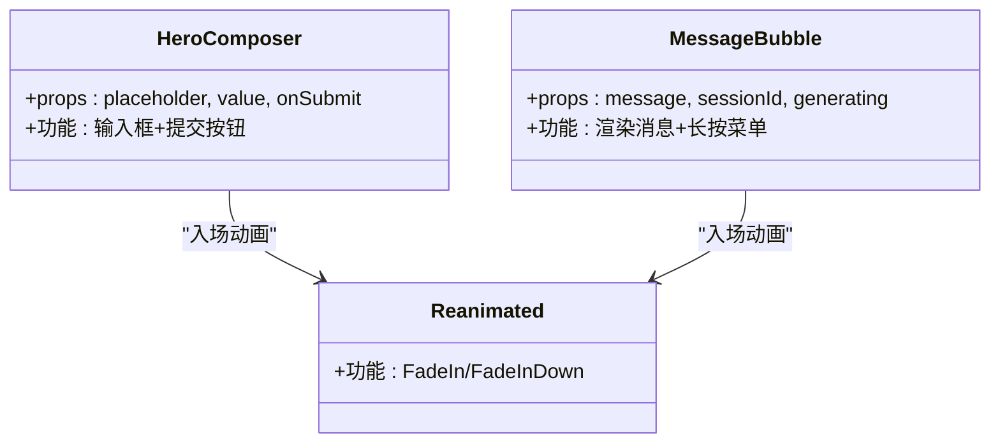
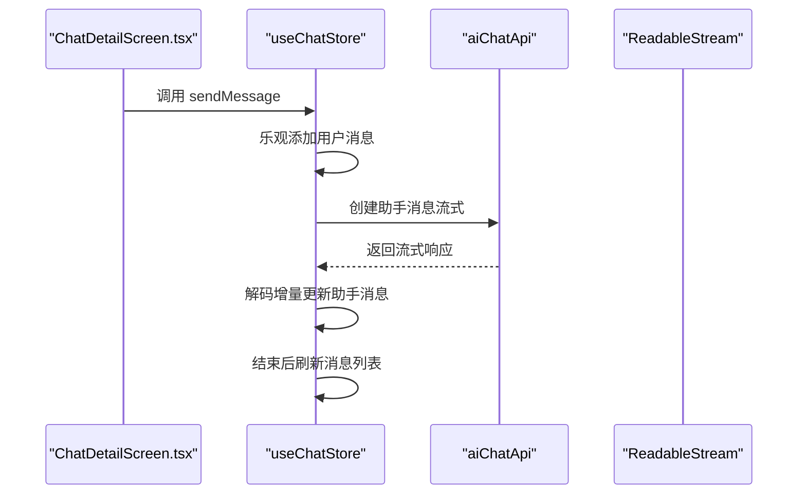
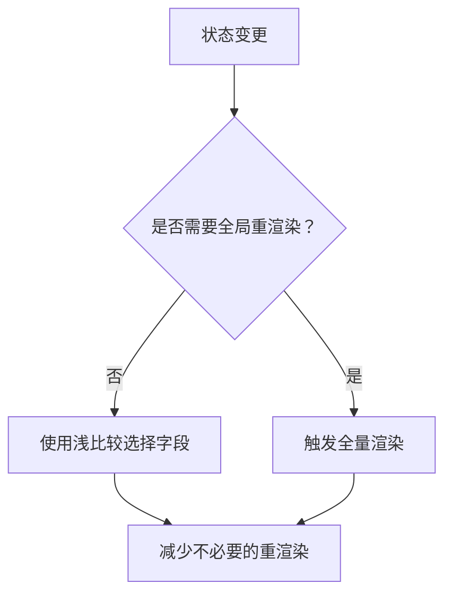
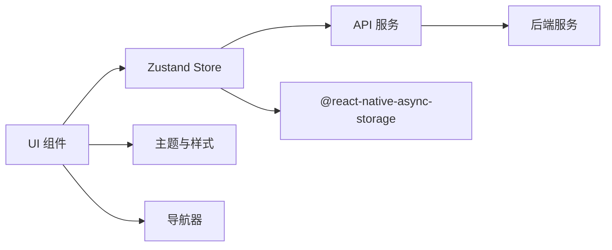

# 移动端性能优化

<cite>
**本文引用的文件**
- [apps/mobile/App.tsx](file://apps/mobile/App.tsx)
- [apps/mobile/src/navigation/index.tsx](file://apps/mobile/src/navigation/index.tsx)
- [apps/mobile/src/theme/index.ts](file://apps/mobile/src/theme/index.ts)
- [apps/mobile/metro.config.js](file://apps/mobile/metro.config.js)
- [apps/mobile/babel.config.js](file://apps/mobile/babel.config.js)
- [apps/mobile/src/screens/ChatListScreen.tsx](file://apps/mobile/src/screens/ChatListScreen.tsx)
- [apps/mobile/src/store/session.ts](file://apps/mobile/src/store/session.ts)
- [apps/mobile/src/services/api.ts](file://apps/mobile/src/services/api.ts)
- [apps/mobile/src/components/ui/MessageBubble.tsx](file://apps/mobile/src/components/ui/MessageBubble.tsx)
- [apps/mobile/src/screens/ChatDetailScreen.tsx](file://apps/mobile/src/screens/ChatDetailScreen.tsx)
- [apps/mobile/src/store/chat.ts](file://apps/mobile/src/store/chat.ts)
- [apps/mobile/src/components/ui/HeroComposer.tsx](file://apps/mobile/src/components/ui/HeroComposer.tsx)
- [apps/mobile/package.json](file://apps/mobile/package.json)
</cite>

## 目录

1. [简介](#简介)
2. [项目结构](#项目结构)
3. [核心组件](#核心组件)
4. [架构总览](#架构总览)
5. [详细组件分析](#详细组件分析)
6. [依赖关系分析](#依赖关系分析)
7. [性能考量](#性能考量)
8. [故障排查指南](#故障排查指南)
9. [结论](#结论)
10. [附录](#附录)

## 简介

本文件面向 LobeHub 移动端（React Native Expo）的性能优化，系统性梳理并总结了当前仓库中已实现或可落地的性能优化实践，覆盖以下维度：

- React Native 渲染与交互优化：FlatList 使用、图片加载、动画与过渡、滚动性能
- 原生层优化：Metro 构建配置、Babel 插件链、Reanimated 动画、原生导航与安全区域
- 网络与数据流优化：HTTP 请求封装、消息流式传输、离线与本地持久化
- 内存与状态管理优化：Zustand Store 的局部选择、浅比较、异步存储与乐观更新
- 监控与调试：启动流程、主题与导航配置、构建与打包优化

本文件同时提供可视化图示，帮助读者快速理解组件间的数据流与控制流。

## 项目结构

移动端应用位于 apps/mobile，采用 Expo + React Navigation + Zustand 的典型架构。关键目录与文件如下：

- 应用入口与主题：App.tsx、src/theme/index.ts、src/navigation/index.tsx
- 构建与编译：metro.config.js、babel.config.js、package.json
- 屏幕与组件：src/screens/_、src/components/ui/_
- 状态管理：src/store/\*
- 网络服务：src/services/api.ts

图表来源

- [apps/mobile/App.tsx](file://apps/mobile/App.tsx#L20-L79)
- [apps/mobile/src/navigation/index.tsx](file://apps/mobile/src/navigation/index.tsx#L103-L215)
- [apps/mobile/src/theme/index.ts](file://apps/mobile/src/theme/index.ts#L1-L43)
- [apps/mobile/src/store/session.ts](file://apps/mobile/src/store/session.ts#L33-L168)
- [apps/mobile/src/store/chat.ts](file://apps/mobile/src/store/chat.ts#L34-L307)
- [apps/mobile/src/screens/ChatListScreen.tsx](file://apps/mobile/src/screens/ChatListScreen.tsx#L53-L317)
- [apps/mobile/src/screens/ChatDetailScreen.tsx](file://apps/mobile/src/screens/ChatDetailScreen.tsx#L37-L217)
- [apps/mobile/src/components/ui/MessageBubble.tsx](file://apps/mobile/src/components/ui/MessageBubble.tsx#L29-L226)
- [apps/mobile/src/components/ui/HeroComposer.tsx](file://apps/mobile/src/components/ui/HeroComposer.tsx#L22-L68)
- [apps/mobile/src/services/api.ts](file://apps/mobile/src/services/api.ts#L8-L44)

章节来源

- [apps/mobile/App.tsx](file://apps/mobile/App.tsx#L1-L79)
- [apps/mobile/src/navigation/index.tsx](file://apps/mobile/src/navigation/index.tsx#L1-L215)
- [apps/mobile/src/theme/index.ts](file://apps/mobile/src/theme/index.ts#L1-L43)
- [apps/mobile/metro.config.js](file://apps/mobile/metro.config.js#L1-L7)
- [apps/mobile/babel.config.js](file://apps/mobile/babel.config.js#L1-L13)
- [apps/mobile/package.json](file://apps/mobile/package.json#L1-L47)

## 核心组件

- 应用入口与启动流程：负责国际化加载、引导页与服务器配置判断、会话预拉取与闪屏过渡，确保首屏可用性与稳定性。
- 导航与主题：底部标签页 + 原生堆栈导航，支持浅色 / 深色主题切换与图标样式统一。
- 状态管理：Zustand Store 将会话列表、消息流、编辑态等状态分层管理，配合浅比较与乐观更新降低重渲染。
- 屏幕与组件：会话列表页使用 ScrollView + 自定义分组与折叠；聊天详情页使用 FlatList + 消息气泡组件，支持流式渲染与自动滚动。
- 网络服务：统一 fetch 封装，提供会话与消息接口；聊天支持流式读取响应体，提升感知速度。

章节来源

- [apps/mobile/App.tsx](file://apps/mobile/App.tsx#L20-L79)
- [apps/mobile/src/navigation/index.tsx](file://apps/mobile/src/navigation/index.tsx#L38-L97)
- [apps/mobile/src/theme/index.ts](file://apps/mobile/src/theme/index.ts#L18-L42)
- [apps/mobile/src/store/session.ts](file://apps/mobile/src/store/session.ts#L33-L168)
- [apps/mobile/src/store/chat.ts](file://apps/mobile/src/store/chat.ts#L34-L307)
- [apps/mobile/src/screens/ChatListScreen.tsx](file://apps/mobile/src/screens/ChatListScreen.tsx#L53-L317)
- [apps/mobile/src/screens/ChatDetailScreen.tsx](file://apps/mobile/src/screens/ChatDetailScreen.tsx#L37-L217)
- [apps/mobile/src/components/ui/MessageBubble.tsx](file://apps/mobile/src/components/ui/MessageBubble.tsx#L29-L226)
- [apps/mobile/src/components/ui/HeroComposer.tsx](file://apps/mobile/src/components/ui/HeroComposer.tsx#L22-L68)
- [apps/mobile/src/services/api.ts](file://apps/mobile/src/services/api.ts#L8-L44)

## 架构总览

下图展示从应用启动到页面渲染、状态更新与网络请求的整体流程。

图表来源

- [apps/mobile/App.tsx](file://apps/mobile/App.tsx#L31-L62)
- [apps/mobile/src/navigation/index.tsx](file://apps/mobile/src/navigation/index.tsx#L103-L215)
- [apps/mobile/src/screens/ChatListScreen.tsx](file://apps/mobile/src/screens/ChatListScreen.tsx#L53-L86)
- [apps/mobile/src/screens/ChatDetailScreen.tsx](file://apps/mobile/src/screens/ChatDetailScreen.tsx#L37-L70)
- [apps/mobile/src/store/session.ts](file://apps/mobile/src/store/session.ts#L39-L54)
- [apps/mobile/src/store/chat.ts](file://apps/mobile/src/store/chat.ts#L54-L151)
- [apps/mobile/src/services/api.ts](file://apps/mobile/src/services/api.ts#L8-L27)

## 详细组件分析

### 启动与导航优化

- 启动阶段：应用在初始化时加载语言包、检查引导完成状态与服务器配置，并在 2 秒最小闪屏后进入主流程，避免过早渲染导致的闪烁与抖动。
- 导航主题：底部标签页与堆栈导航统一使用主题色与阴影参数，减少复杂绘制开销；Android/IOS 平台差异化高度与内边距，保证一致体验。
- 主题切换：根据系统配色自动选择明暗主题，避免重复计算与无效重绘。

图表来源

- [apps/mobile/App.tsx](file://apps/mobile/App.tsx#L31-L62)
- [apps/mobile/src/navigation/index.tsx](file://apps/mobile/src/navigation/index.tsx#L43-L63)
- [apps/mobile/src/theme/index.ts](file://apps/mobile/src/theme/index.ts#L18-L42)

章节来源

- [apps/mobile/App.tsx](file://apps/mobile/App.tsx#L20-L79)
- [apps/mobile/src/navigation/index.tsx](file://apps/mobile/src/navigation/index.tsx#L38-L97)
- [apps/mobile/src/theme/index.ts](file://apps/mobile/src/theme/index.ts#L1-L43)

### FlatList 与滚动性能优化

- 使用场景：聊天详情页的消息列表通过 FlatList 渲染，支持大数据集高效复用与自动滚动到底部。
- 关键点：
  - keyExtractor 使用消息 id，避免重复渲染。
  - onContentSizeChange 与 onLayout 触发滚动到底部，保证新消息可见。
  - 列表空态使用占位图，减少无意义布局计算。
  - 消息气泡组件使用 memo 包裹，降低子组件重渲染频率。

图表来源

- [apps/mobile/src/screens/ChatDetailScreen.tsx](file://apps/mobile/src/screens/ChatDetailScreen.tsx#L142-L172)
- [apps/mobile/src/components/ui/MessageBubble.tsx](file://apps/mobile/src/components/ui/MessageBubble.tsx#L29-L226)
- [apps/mobile/src/store/chat.ts](file://apps/mobile/src/store/chat.ts#L34-L52)

章节来源

- [apps/mobile/src/screens/ChatDetailScreen.tsx](file://apps/mobile/src/screens/ChatDetailScreen.tsx#L53-L217)
- [apps/mobile/src/components/ui/MessageBubble.tsx](file://apps/mobile/src/components/ui/MessageBubble.tsx#L29-L226)
- [apps/mobile/src/store/chat.ts](file://apps/mobile/src/store/chat.ts#L34-L151)

### 图片加载与资源优化

- 图片组件：会话卡片与头像使用 expo-image（原 RN 的 Image 已被替换），具备更优的解码与缓存策略。
- 资源路径：静态图标与品牌图通过 require 引入，利于 Metro 打包期优化与内联。
- 头像回退：当远端 avatar 为空时，回退至本地图标，避免空渲染与异常。

图表来源

- [apps/mobile/src/screens/ChatListScreen.tsx](file://apps/mobile/src/screens/ChatListScreen.tsx#L160-L166)

章节来源

- [apps/mobile/src/screens/ChatListScreen.tsx](file://apps/mobile/src/screens/ChatListScreen.tsx#L160-L166)

### 动画与过渡优化

- 动画库：使用 react-native-reanimated 提供高性能动画与过渡效果。
- 入场动画：首页英雄输入区与快捷操作区使用 FadeInDown，延迟递增，营造自然节奏。
- 消息气泡：使用 FadeIn 进入动画，增强可读性与流畅感。
- 导航动画：底部标签页与堆栈导航均配置轻量动画，避免重型转场。

图表来源

- [apps/mobile/src/components/ui/HeroComposer.tsx](file://apps/mobile/src/components/ui/HeroComposer.tsx#L22-L68)
- [apps/mobile/src/components/ui/MessageBubble.tsx](file://apps/mobile/src/components/ui/MessageBubble.tsx#L29-L226)

章节来源

- [apps/mobile/src/components/ui/HeroComposer.tsx](file://apps/mobile/src/components/ui/HeroComposer.tsx#L1-L68)
- [apps/mobile/src/components/ui/MessageBubble.tsx](file://apps/mobile/src/components/ui/MessageBubble.tsx#L1-L226)
- [apps/mobile/babel.config.js](file://apps/mobile/babel.config.js#L8-L10)

### 网络性能与流式传输

- HTTP 封装：统一 fetchAvatoApi，集中处理 Content-Type 与错误日志，便于后续接入拦截器与重试。
- 流式响应：sendMessage/regenerateMessage 使用 ReadableStream 逐步解码并增量更新消息内容，显著降低感知等待时间。
- 乐观更新：发送消息与编辑 / 删除消息均先本地更新，再异步同步后端，失败时回滚或刷新，提升交互顺滑度。
- 离线策略：会话列表在初始化失败时保持可用，避免白屏。

图表来源

- [apps/mobile/src/store/chat.ts](file://apps/mobile/src/store/chat.ts#L54-L151)
- [apps/mobile/src/screens/ChatDetailScreen.tsx](file://apps/mobile/src/screens/ChatDetailScreen.tsx#L65-L70)

章节来源

- [apps/mobile/src/services/api.ts](file://apps/mobile/src/services/api.ts#L8-L44)
- [apps/mobile/src/store/chat.ts](file://apps/mobile/src/store/chat.ts#L34-L307)

### 内存管理与状态优化

- Zustand 分层：将消息、会话、话题等状态拆分独立 Store，避免无关状态变更触发重渲染。
- 浅比较：ChatListScreen 使用 useShallow 仅订阅所需字段，降低渲染成本。
- 乐观更新：SessionStore/ChatStore 在写操作前进行本地更新，减少等待与闪烁。
- 异步存储：AsyncStorage 用于持久化活动会话 ID，避免每次启动都进行远程查询。

图表来源

- [apps/mobile/src/screens/ChatListScreen.tsx](file://apps/mobile/src/screens/ChatListScreen.tsx#L56-L61)
- [apps/mobile/src/store/session.ts](file://apps/mobile/src/store/session.ts#L39-L54)
- [apps/mobile/src/store/chat.ts](file://apps/mobile/src/store/chat.ts#L54-L77)

章节来源

- [apps/mobile/src/screens/ChatListScreen.tsx](file://apps/mobile/src/screens/ChatListScreen.tsx#L56-L80)
- [apps/mobile/src/store/session.ts](file://apps/mobile/src/store/session.ts#L33-L168)
- [apps/mobile/src/store/chat.ts](file://apps/mobile/src/store/chat.ts#L34-L151)

### 原生性能与构建优化

- Metro 配置：集成 nativewind 并指定全局 CSS 输入，确保样式按需注入与最小化。
- Babel 配置：启用 react-native-reanimated/plugin 与 nativewind/babel，提升动画与 Tailwind 编译效率。
- 依赖与版本：React 19、React Native 0.83、Expo 55，配合 Reanimated 4.x 与 SafeArea、Screens 等原生能力，提升滚动与过渡性能。

章节来源

- [apps/mobile/metro.config.js](file://apps/mobile/metro.config.js#L1-L7)
- [apps/mobile/babel.config.js](file://apps/mobile/babel.config.js#L1-L13)
- [apps/mobile/package.json](file://apps/mobile/package.json#L11-L40)

## 依赖关系分析

- 组件耦合：屏幕组件依赖 Store 与 UI 组件；UI 组件依赖主题与动画库；Store 依赖 API 服务。
- 数据流向：屏幕组件通过 Store 获取数据；Store 通过 API 服务访问后端；Store 写操作采用乐观更新与回退刷新。
- 外部依赖：@react-navigation、@trpc、expo-\*、nativewind、react-native-reanimated、zustand。

图表来源

- [apps/mobile/src/store/session.ts](file://apps/mobile/src/store/session.ts#L12-L13)
- [apps/mobile/src/store/chat.ts](file://apps/mobile/src/store/chat.ts#L11-L12)
- [apps/mobile/src/services/api.ts](file://apps/mobile/src/services/api.ts#L3-L3)
- [apps/mobile/src/theme/index.ts](file://apps/mobile/src/theme/index.ts#L1-L43)
- [apps/mobile/src/navigation/index.tsx](file://apps/mobile/src/navigation/index.tsx#L1-L36)

章节来源

- [apps/mobile/src/store/session.ts](file://apps/mobile/src/store/session.ts#L12-L13)
- [apps/mobile/src/store/chat.ts](file://apps/mobile/src/store/chat.ts#L11-L12)
- [apps/mobile/src/services/api.ts](file://apps/mobile/src/services/api.ts#L3-L3)
- [apps/mobile/src/theme/index.ts](file://apps/mobile/src/theme/index.ts#L1-L43)
- [apps/mobile/src/navigation/index.tsx](file://apps/mobile/src/navigation/index.tsx#L1-L36)

## 性能考量

- 渲染层
  - 使用 FlatList 替代 ScrollView 处理长列表，结合 keyExtractor 与浅比较减少重渲染。
  - 对高频组件（消息气泡）使用 memo，避免 props 变化导致的重复渲染。
- 动画层
  - 使用 Reanimated 提供原生驱动动画，避免 JS 线程阻塞。
  - 控制入场动画数量与延迟，避免同时大量动画造成掉帧。
- 网络层
  - 采用流式读取提升感知速度；对错误进行降级提示并保留本地状态。
  - 乐观更新与回退刷新策略提升交互顺滑度。
- 存储层
  - AsyncStorage 仅用于轻量键值，避免大对象频繁序列化带来的卡顿。
  - Store 分层设计降低全局状态变更范围。
- 构建与打包
  - Metro + nativewind + Babel 插件链优化样式与动画编译路径。
  - 静态资源通过 require 内联，减少运行时解析成本。

## 故障排查指南

- 启动白屏或卡顿
  - 检查 App.tsx 中的最小闪屏延时与预拉取逻辑，确认网络环境与服务器配置。
  - 确认主题与导航配置未在启动阶段进行昂贵计算。
- 消息列表不滚动或滚动卡顿
  - 确认 FlatList 的 keyExtractor 正确且唯一；检查 onContentSizeChange/onLayout 是否触发。
  - 减少消息气泡中的复杂布局与动态样式计算。
- 动画卡顿
  - 确认 Reanimated 插件已正确启用；避免在动画过程中进行昂贵的 JS 计算。
- 网络请求失败
  - 查看 fetchAvatoApi 的错误日志与状态码；必要时增加重试与降级提示。
- 内存占用高
  - 检查 Store 中是否存在大对象常驻；避免在渲染函数中创建新对象。
  - 使用浅比较订阅与 memo 包裹高频组件。

章节来源

- [apps/mobile/App.tsx](file://apps/mobile/App.tsx#L31-L62)
- [apps/mobile/src/screens/ChatDetailScreen.tsx](file://apps/mobile/src/screens/ChatDetailScreen.tsx#L142-L172)
- [apps/mobile/src/components/ui/MessageBubble.tsx](file://apps/mobile/src/components/ui/MessageBubble.tsx#L29-L226)
- [apps/mobile/src/services/api.ts](file://apps/mobile/src/services/api.ts#L8-L27)
- [apps/mobile/src/store/chat.ts](file://apps/mobile/src/store/chat.ts#L54-L151)

## 结论

本项目在移动端性能方面已具备良好的基础：合理的状态分层、流式网络交互、Reanimated 动画与 FlatList 渲染。建议在此基础上进一步完善：

- 引入网络层拦截器与重试策略，增强健壮性
- 对图片资源进行尺寸与格式优化，减少带宽与内存占用
- 增加内存与性能监控埋点，持续评估与迭代
- 探索原生模块按需加载与懒初始化，降低冷启动成本

## 附录

- 开发与调试
  - 使用 Expo DevTools 与 Flipper 进行调试与性能分析
  - 在 Metro/Babel 配置中开启必要的开发优化开关
- 版本与依赖
  - 关注 React 19、React Native 0.83、Expo 55 的性能特性与兼容性
  - 定期更新 nativewind、Reanimated、Navigation 等核心依赖
