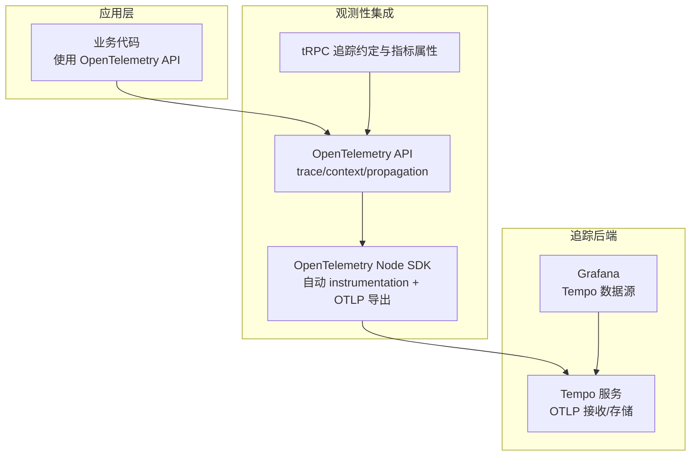
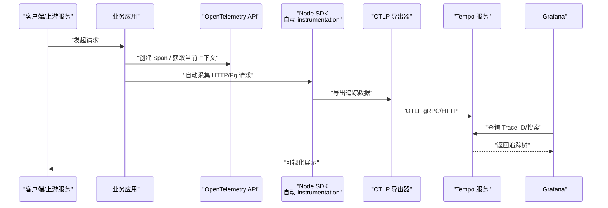
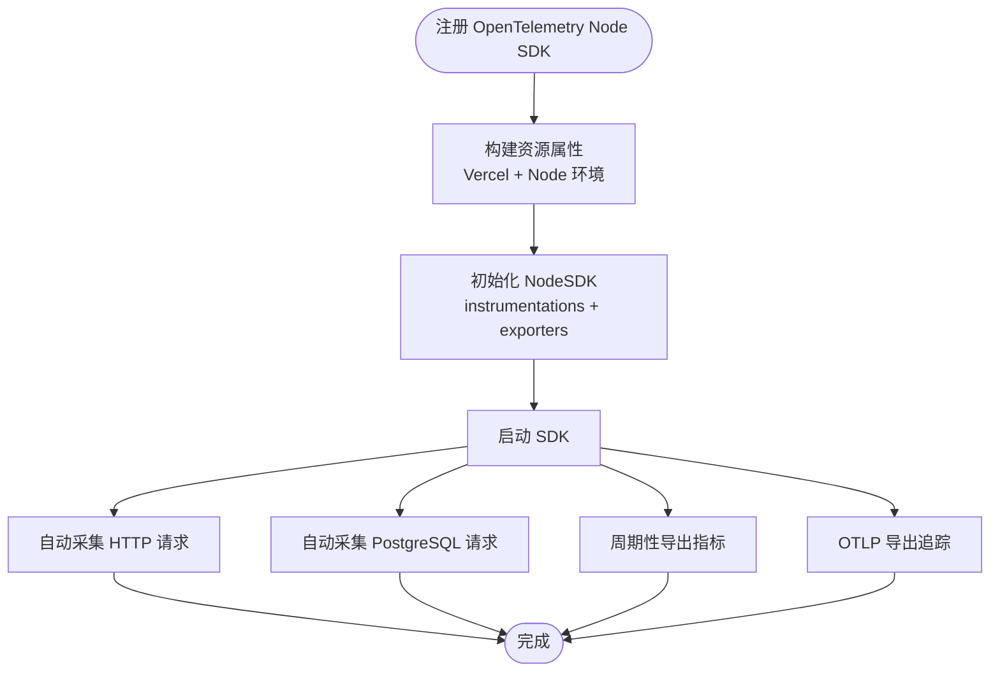
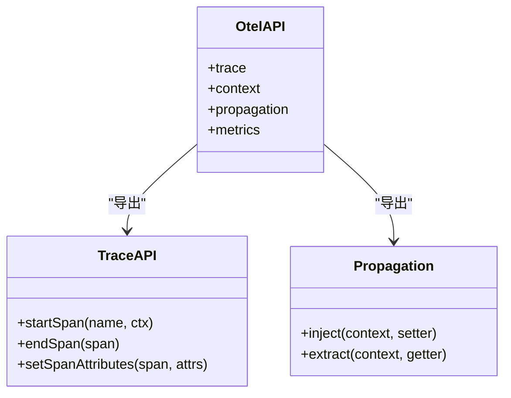
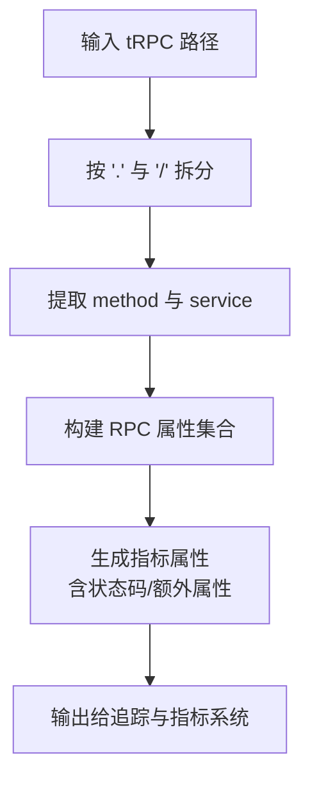
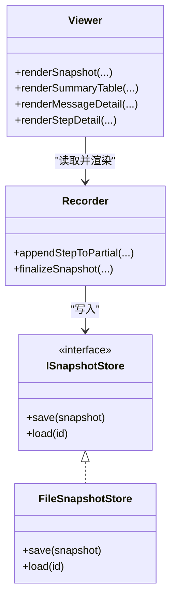
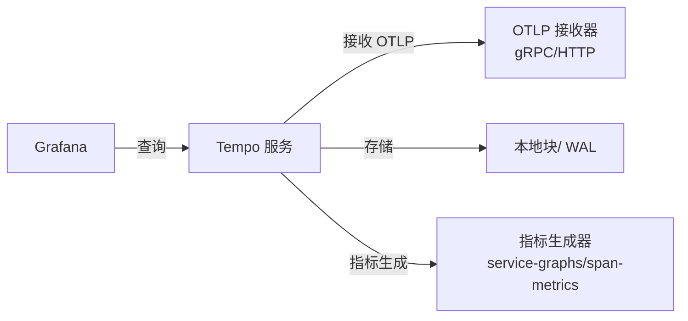
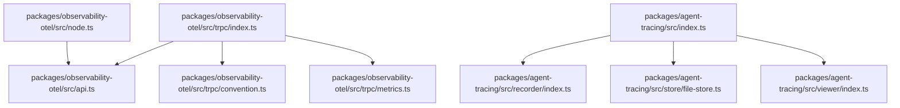

# 分布式追踪

<cite>
**本文引用的文件**
- [packages/observability-otel/src/node.ts](file://packages/observability-otel/src/node.ts)
- [packages/observability-otel/src/api.ts](file://packages/observability-otel/src/api.ts)
- [packages/observability-otel/src/trpc/index.ts](file://packages/observability-otel/src/trpc/index.ts)
- [packages/observability-otel/src/trpc/convention.ts](file://packages/observability-otel/src/trpc/convention.ts)
- [packages/observability-otel/src/trpc/metrics.ts](file://packages/observability-otel/src/trpc/metrics.ts)
- [packages/agent-tracing/src/index.ts](file://packages/agent-tracing/src/index.ts)
- [packages/agent-tracing/src/recorder/index.ts](file://packages/agent-tracing/src/recorder/index.ts)
- [packages/agent-tracing/src/store/file-store.ts](file://packages/agent-tracing/src/store/file-store.ts)
- [packages/agent-tracing/src/viewer/index.ts](file://packages/agent-tracing/src/viewer/index.ts)
- [docker-compose/production/grafana/tempo/tempo.yaml](file://docker-compose/production/grafana/tempo/tempo.yaml)
- [docker-compose/production/grafana/grafana/datasources/datasource-tempo.yaml](file://docker-compose/production/grafana/grafana/datasources/datasource-tempo.yaml)
</cite>

## 目录

1. [简介](#简介)
2. [项目结构](#项目结构)
3. [核心组件](#核心组件)
4. [架构总览](#架构总览)
5. [详细组件分析](#详细组件分析)
6. [依赖关系分析](#依赖关系分析)
7. [性能考量](#性能考量)
8. [故障排查指南](#故障排查指南)
9. [结论](#结论)
10. [附录](#附录)

## 简介

本文件面向 LobeHub 项目的分布式追踪体系，围绕基于 OpenTelemetry 的链路追踪能力展开，重点覆盖以下方面：

- 基于 OpenTelemetry 的自动与手动追踪集成（Node SDK、HTTP/Pg 自动 instrumentation、OTLP 导出）
- 追踪上下文在进程内与跨进程的传播（OpenTelemetry 上下文 API）
- 以 Tempo 作为追踪后端的配置与数据源对接（Grafana Tempo 数据源）
- 针对 tRPC 接口的追踪约定与指标属性构建
- Agent 执行快照与本地回放能力（用于离线调试与复盘）

本指南既适合初学者快速上手，也为进阶用户提供了性能优化、异常定位与可视化展示的实操建议。

## 项目结构

与分布式追踪直接相关的核心模块位于 packages 目录中，分别负责：

- 观测性与 OpenTelemetry 集成：packages/observability-otel
- Agent 执行快照与回放：packages/agent-tracing
- Grafana Tempo 后端与数据源配置：docker-compose/production/grafana/tempo 与 datasources

图表来源

- [packages/observability-otel/src/node.ts](file://packages/observability-otel/src/node.ts#L124-L140)
- [packages/observability-otel/src/api.ts](file://packages/observability-otel/src/api.ts#L1-L3)
- [packages/observability-otel/src/trpc/index.ts](file://packages/observability-otel/src/trpc/index.ts#L21-L38)
- [docker-compose/production/grafana/tempo/tempo.yaml](file://docker-compose/production/grafana/tempo/tempo.yaml#L16-L24)
- [docker-compose/production/grafana/grafana/datasources/datasource-tempo.yaml](file://docker-compose/production/grafana/grafana/datasources/datasource-tempo.yaml#L3-L21)

章节来源

- [packages/observability-otel/src/node.ts](file://packages/observability-otel/src/node.ts#L1-L144)
- [packages/observability-otel/src/api.ts](file://packages/observability-otel/src/api.ts#L1-L3)
- [packages/observability-otel/src/trpc/index.ts](file://packages/observability-otel/src/trpc/index.ts#L1-L63)
- [docker-compose/production/grafana/tempo/tempo.yaml](file://docker-compose/production/grafana/tempo/tempo.yaml#L1-L59)
- [docker-compose/production/grafana/grafana/datasources/datasource-tempo.yaml](file://docker-compose/production/grafana/grafana/datasources/datasource-tempo.yaml#L1-L21)

## 核心组件

- OpenTelemetry Node SDK 注册与资源属性注入：负责自动 instrumentation（HTTP、PostgreSQL）、指标导出器、追踪导出器与诊断日志级别设置。
- OpenTelemetry API 封装：统一导出 trace、context、propagation、metrics 等常用对象，便于业务侧按需使用。
- tRPC 追踪约定：将 tRPC 路径解析为服务 / 方法，并标准化 RPC 属性，同时提供指标属性构造工具。
- Agent 执行快照：提供执行步骤记录、快照归档与本地渲染查看，辅助离线复盘与问题定位。
- Grafana Tempo 配置：定义 OTLP 接收端点、存储路径、指标生成器与数据源对接。

章节来源

- [packages/observability-otel/src/node.ts](file://packages/observability-otel/src/node.ts#L94-L141)
- [packages/observability-otel/src/api.ts](file://packages/observability-otel/src/api.ts#L1-L3)
- [packages/observability-otel/src/trpc/index.ts](file://packages/observability-otel/src/trpc/index.ts#L10-L62)
- [packages/agent-tracing/src/index.ts](file://packages/agent-tracing/src/index.ts#L1-L11)
- [docker-compose/production/grafana/tempo/tempo.yaml](file://docker-compose/production/grafana/tempo/tempo.yaml#L16-L59)
- [docker-compose/production/grafana/grafana/datasources/datasource-tempo.yaml](file://docker-compose/production/grafana/grafana/datasources/datasource-tempo.yaml#L3-L21)

## 架构总览

下图展示了从应用到追踪后端的完整链路：应用通过 OpenTelemetry API 创建 Span 并传播上下文；Node SDK 自动采集 HTTP/Pg 请求并注入语义化属性；OTLP 导出器将追踪数据发送至 Tempo；Grafana 通过 Tempo 数据源进行查询与可视化。

图表来源

- [packages/observability-otel/src/node.ts](file://packages/observability-otel/src/node.ts#L124-L140)
- [packages/observability-otel/src/api.ts](file://packages/observability-otel/src/api.ts#L1-L3)
- [docker-compose/production/grafana/tempo/tempo.yaml](file://docker-compose/production/grafana/tempo/tempo.yaml#L16-L24)
- [docker-compose/production/grafana/grafana/datasources/datasource-tempo.yaml](file://docker-compose/production/grafana/grafana/datasources/datasource-tempo.yaml#L3-L21)

## 详细组件分析

### OpenTelemetry Node SDK 集成与自动 instrumentation

- 资源属性注入：支持 Vercel 与 Node 环境变量映射，统一注入服务名、版本、运行环境等标签。
- 自动 instrumentation：启用 HTTP 与 PostgreSQL 指标采集，结合自动安装的 Node 库进行无侵入埋点。
- 指标导出：周期性导出指标到 OTLP，便于与追踪数据联动分析。
- 追踪导出：通过 OTLP HTTP 导出器将追踪数据发送至后端。
- 诊断日志：支持从环境变量读取日志级别，便于开发调试。

图表来源

- [packages/observability-otel/src/node.ts](file://packages/observability-otel/src/node.ts#L94-L141)

章节来源

- [packages/observability-otel/src/node.ts](file://packages/observability-otel/src/node.ts#L15-L56)
- [packages/observability-otel/src/node.ts](file://packages/observability-otel/src/node.ts#L94-L141)

### OpenTelemetry API 使用与上下文传播

- 统一导出：通过 api.ts 将 trace、context、propagation、metrics 等常用对象集中导出，便于业务侧按需引入。
- 上下文传播：利用 OpenTelemetry 的 propagation 能力在进程内与跨进程间传递 Span 上下文，确保 Trace ID 一致。
- 手动创建 Span：在业务关键路径中手动开启 / 结束 Span，补充自定义属性与事件，提升可观察性。

图表来源

- [packages/observability-otel/src/api.ts](file://packages/observability-otel/src/api.ts#L1-L3)

章节来源

- [packages/observability-otel/src/api.ts](file://packages/observability-otel/src/api.ts#L1-L3)

### tRPC 追踪约定与指标属性

- 路径解析：将 tRPC 路径拆分为 service 与 method，形成标准化属性键值。
- RPC 属性：统一 RPC 系统、路径、类型、服务、方法等语义化标签，便于查询与聚合。
- 指标属性：根据状态码与额外属性组合生成指标维度，支持按服务 / 方法 / 状态码等维度分析。

图表来源

- [packages/observability-otel/src/trpc/index.ts](file://packages/observability-otel/src/trpc/index.ts#L10-L38)
- [packages/observability-otel/src/trpc/convention.ts](file://packages/observability-otel/src/trpc/convention.ts)

章节来源

- [packages/observability-otel/src/trpc/index.ts](file://packages/observability-otel/src/trpc/index.ts#L1-L63)
- [packages/observability-otel/src/trpc/convention.ts](file://packages/observability-otel/src/trpc/convention.ts)

### Agent 执行快照与本地回放

- 快照记录：在 Agent 执行过程中记录步骤与摘要信息，支持增量追加与最终归档。
- 存储接口：抽象快照存储接口，便于替换为文件 / 数据库等不同实现。
- 文件存储：提供基于文件的快照持久化，便于离线分析与分享。
- 可视化查看：提供渲染函数，将快照转换为人类可读的表格与详情，辅助问题复盘。

图表来源

- [packages/agent-tracing/src/store/types.ts](file://packages/agent-tracing/src/store/types.ts)
- [packages/agent-tracing/src/store/file-store.ts](file://packages/agent-tracing/src/store/file-store.ts)
- [packages/agent-tracing/src/recorder/index.ts](file://packages/agent-tracing/src/recorder/index.ts)
- [packages/agent-tracing/src/viewer/index.ts](file://packages/agent-tracing/src/viewer/index.ts)
- [packages/agent-tracing/src/index.ts](file://packages/agent-tracing/src/index.ts#L1-L11)

章节来源

- [packages/agent-tracing/src/index.ts](file://packages/agent-tracing/src/index.ts#L1-L11)
- [packages/agent-tracing/src/recorder/index.ts](file://packages/agent-tracing/src/recorder/index.ts)
- [packages/agent-tracing/src/store/file-store.ts](file://packages/agent-tracing/src/store/file-store.ts)
- [packages/agent-tracing/src/viewer/index.ts](file://packages/agent-tracing/src/viewer/index.ts)

### Tempo 追踪后端与 Grafana 数据源

- Tempo 配置：启用 OTLP 接收（gRPC/HTTP），配置 WAL 与本地块存储，开启指标生成器与处理器，设置保留策略。
- Grafana 数据源：配置 Tempo 数据源，指定访问方式、URL 与服务映射，启用流式搜索等能力。

图表来源

- [docker-compose/production/grafana/tempo/tempo.yaml](file://docker-compose/production/grafana/tempo/tempo.yaml#L16-L59)
- [docker-compose/production/grafana/grafana/datasources/datasource-tempo.yaml](file://docker-compose/production/grafana/grafana/datasource/datasource-tempo.yaml#L3-L21)

章节来源

- [docker-compose/production/grafana/tempo/tempo.yaml](file://docker-compose/production/grafana/tempo/tempo.yaml#L1-L59)
- [docker-compose/production/grafana/grafana/datasources/datasource-tempo.yaml](file://docker-compose/production/grafana/grafana/datasources/datasource-tempo.yaml#L1-L21)

## 依赖关系分析

- OpenTelemetry Node SDK 依赖自动 instrumentation 包与 OTLP 导出器，统一由 NodeSDK 管理生命周期。
- tRPC 模块依赖 OpenTelemetry API 的属性常量与约定文件，形成统一的 RPC 语义化标签。
- Agent tracing 模块与业务解耦，通过接口抽象与文件存储实现可插拔的快照持久化。

图表来源

- [packages/observability-otel/src/node.ts](file://packages/observability-otel/src/node.ts#L1-L144)
- [packages/observability-otel/src/api.ts](file://packages/observability-otel/src/api.ts#L1-L3)
- [packages/observability-otel/src/trpc/index.ts](file://packages/observability-otel/src/trpc/index.ts#L1-L63)
- [packages/agent-tracing/src/index.ts](file://packages/agent-tracing/src/index.ts#L1-L11)

章节来源

- [packages/observability-otel/src/node.ts](file://packages/observability-otel/src/node.ts#L1-L144)
- [packages/observability-otel/src/api.ts](file://packages/observability-otel/src/api.ts#L1-L3)
- [packages/observability-otel/src/trpc/index.ts](file://packages/observability-otel/src/trpc/index.ts#L1-L63)
- [packages/agent-tracing/src/index.ts](file://packages/agent-tracing/src/index.ts#L1-L11)

## 性能考量

- 导出频率与批处理：合理设置指标导出间隔与追踪批量大小，避免高并发下的网络与 CPU 峰值。
- 自动 instrumentation 选择：仅启用必要的自动 instrumentation，减少无关开销；对高频调用的库可考虑降采样或过滤规则。
- 上下文传播成本：在高吞吐场景下，尽量避免在热路径中频繁创建 / 销毁 Span 或过度注入大体积属性。
- Tempo 存储与保留：根据业务峰值与查询频度调整 WAL 与块保留策略，平衡存储成本与查询延迟。
- 查询优化：在 Grafana 中优先使用服务 / 方法 / 状态码等维度进行过滤，避免全量扫描。

## 故障排查指南

- 无法连接 Tempo：检查 OTLP 接收端点与网络连通性，确认 gRPC/HTTP 端口配置正确。
- 追踪缺失：确认 Node SDK 已成功启动且自动 instrumentation 生效；检查环境变量与诊断日志级别。
- tRPC 属性不完整：核对 tRPC 路径格式与约定解析逻辑，确保 service/method 提取正确。
- 快照无法加载：检查文件存储路径权限与文件完整性，确认快照格式与渲染函数兼容性。
- Grafana 查询失败：确认数据源 URL 与访问方式，检查服务映射与流式搜索开关。

章节来源

- [packages/observability-otel/src/node.ts](file://packages/observability-otel/src/node.ts#L107-L114)
- [packages/observability-otel/src/trpc/index.ts](file://packages/observability-otel/src/trpc/index.ts#L10-L19)
- [docker-compose/production/grafana/grafana/datasources/datasource-tempo.yaml](file://docker-compose/production/grafana/grafana/datasources/datasource-tempo.yaml#L3-L21)

## 结论

LobeHub 的分布式追踪体系以 OpenTelemetry 为核心，结合自动 instrumentation 与语义化属性，实现了对 Node 服务、tRPC 接口与数据库操作的可观测覆盖。配合 Grafana Tempo 的高效存储与查询能力，能够满足从日常监控到复杂问题定位的多种需求。Agent 执行快照模块进一步增强了离线复盘与调试能力。建议在生产环境中持续优化导出策略与查询维度，以获得更优的性能与可维护性。

## 附录

- 常见分布式场景实践要点
  - 微服务调用链：确保每个服务均注册 OpenTelemetry Node SDK，并在入口与出口处传播上下文。
  - 异步任务追踪：在任务队列消费端恢复上下文，保证跨进程的 Trace ID 一致性。
  - API 网关追踪：在网关层注入 RPC 属性（服务 / 方法），并与下游服务的自动 instrumentation 协同。
- 追踪数据可视化建议
  - 在 Grafana 中建立服务全景图与关键路径仪表板，结合服务映射与拓扑视图。
  - 使用 Tempo 的流式搜索与 SLO 配置，快速定位慢调用与异常请求。
- 性能瓶颈分析方法
  - 以服务 / 方法 / 状态码为维度进行聚合分析，识别热点与异常。
  - 对比指标生成器输出，结合追踪树定位耗时热点与阻塞点。
