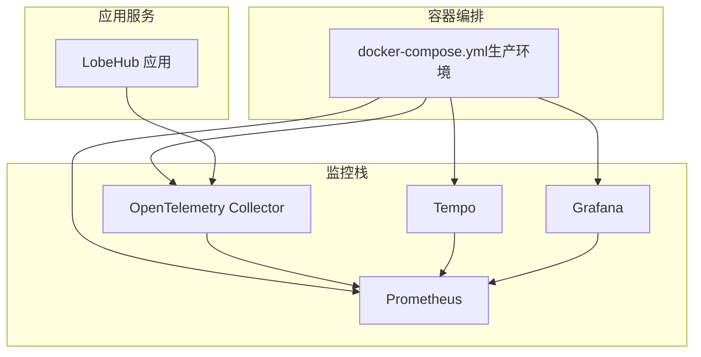
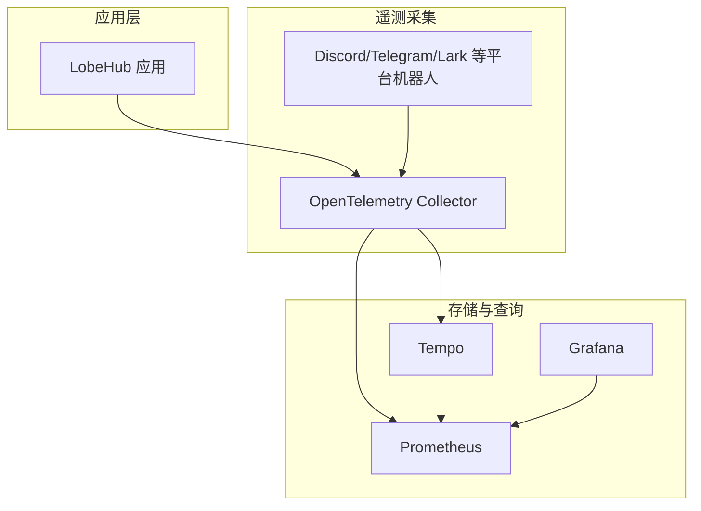
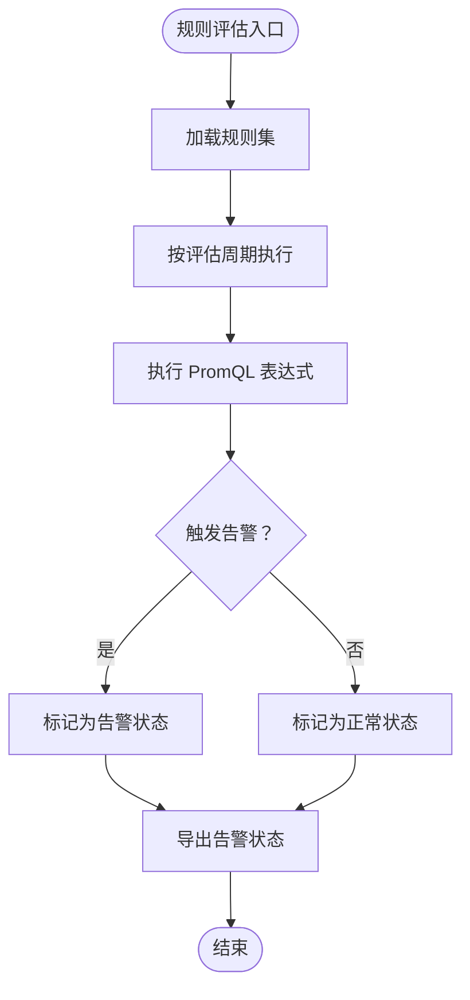
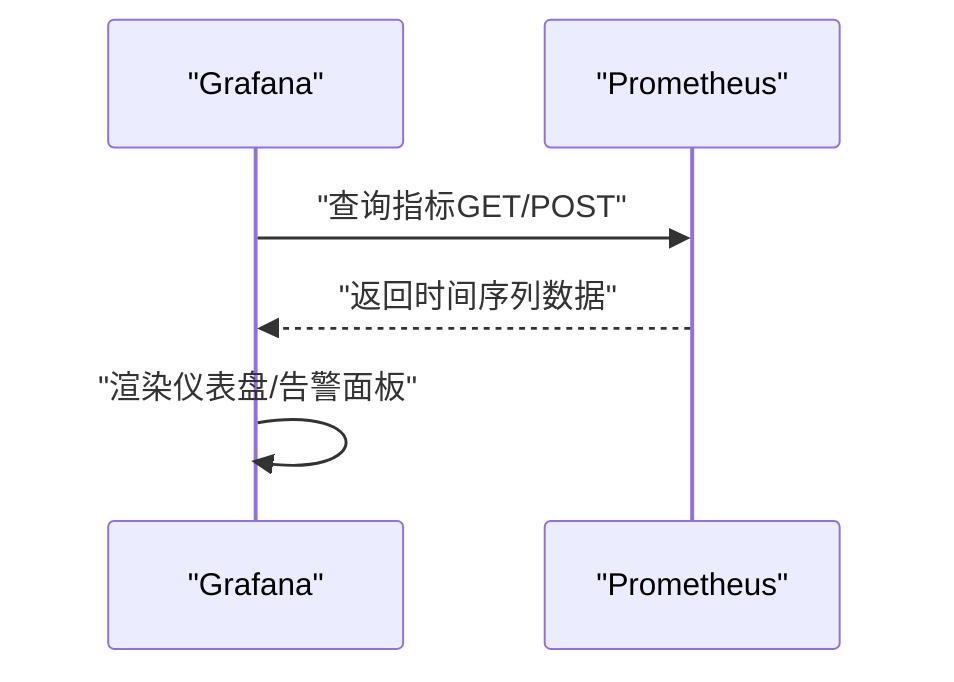
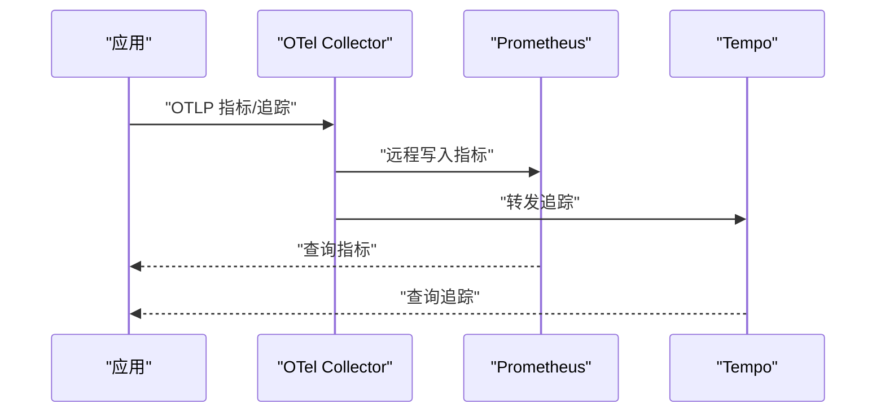
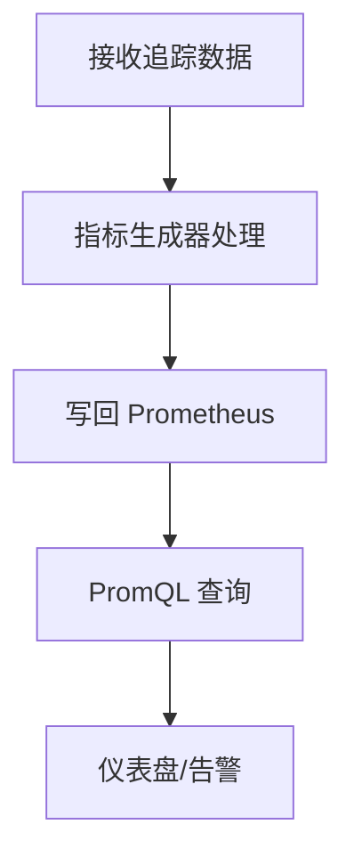
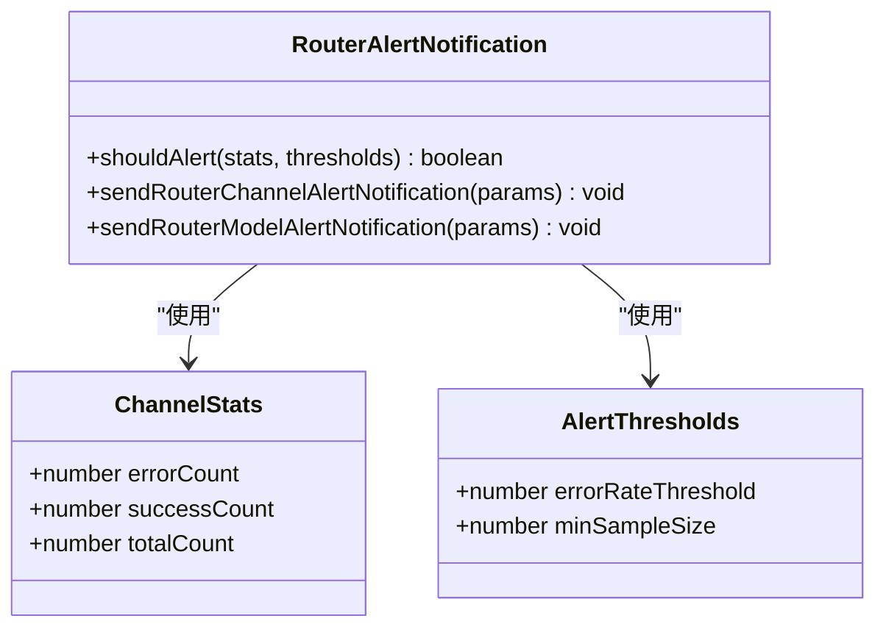
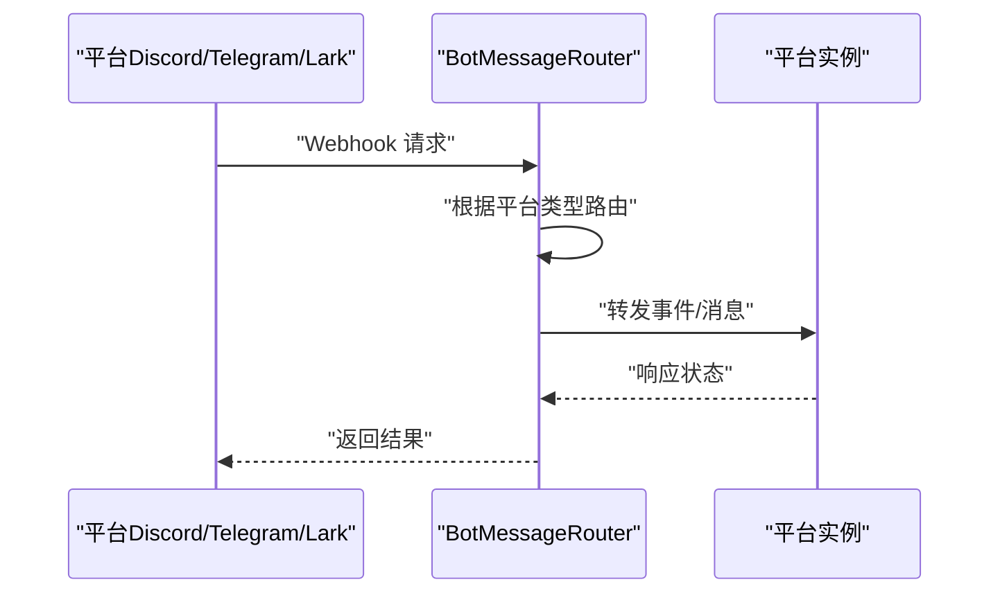
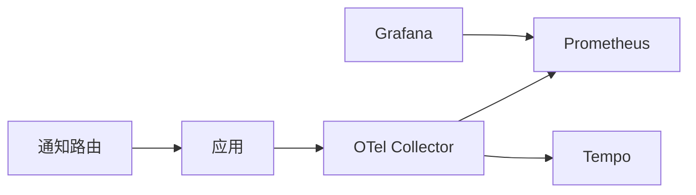

# 告警规则配置

<cite>
**本文引用的文件**
- [docker-compose.yml（生产环境）](file://docker-compose/production/grafana/docker-compose.yml)
- [Prometheus 配置](file://docker-compose/production/grafana/prometheus/prometheus.yml)
- [Grafana 数据源配置（Prometheus）](file://docker-compose/production/grafana/grafana/datasources/datasource-prometheus.yaml)
- [OpenTelemetry Collector 配置](file://docker-compose/production/grafana/otel-collector/collector-config.yaml)
- [Tempo 配置](file://docker-compose/production/grafana/tempo/tempo.yaml)
- [路由告警通知接口定义](file://src/server/services/riskControl/routerAlertNotification.ts)
- [机器人消息路由与 Webhook 处理](file://src/server/services/bot/BotMessageRouter.ts)
- [Telegram 平台适配器](file://src/server/services/bot/platforms/telegram.ts)
- [渠道常量与平台字段定义](file://src/routes/(main)/agent/channel/const.ts)
</cite>

## 目录

1. [简介](#简介)
2. [项目结构](#项目结构)
3. [核心组件](#核心组件)
4. [架构总览](#架构总览)
5. [详细组件分析](#详细组件分析)
6. [依赖关系分析](#依赖关系分析)
7. [性能考量](#性能考量)
8. [故障排查指南](#故障排查指南)
9. [结论](#结论)
10. [附录](#附录)

## 简介

本文件面向 LobeHub 项目的运维与开发团队，系统化梳理基于 Prometheus 与 Grafana 的告警体系与规则配置方法，覆盖以下主题：

- 告警规则编写语法与表达式语言基础
- 条件判断逻辑与阈值 / 趋势 / 复合 / 相关性告警策略
- 通知渠道配置（邮件、Slack、Webhook、PagerDuty 等）
- 告警去重、静默、抑制等高级能力
- 规则命名规范、告警级别划分、频率控制与升级机制
- 告警效果评估、规则优化与噪音治理最佳实践

说明：当前仓库未包含 Alertmanager 的独立配置文件与规则目录，因此本文在 “架构总览” 和 “通知渠道” 部分以概念性说明为主；在 “详细组件分析” 中聚焦于现有可验证的监控与通知实现，并给出可落地的规则设计建议。

## 项目结构

与告警系统直接相关的容器与配置位于 docker-compose 生产环境目录，主要包含：

- Prometheus：指标采集与规则评估
- Grafana：可视化与数据源接入
- OpenTelemetry Collector：指标与追踪的汇聚与导出
- Tempo：分布式追踪存储与指标生成

图表来源

- [docker-compose.yml（生产环境）](file://docker-compose/production/grafana/docker-compose.yml#L1-L251)
- [Prometheus 配置](file://docker-compose/production/grafana/prometheus/prometheus.yml#L1-L12)
- [OpenTelemetry Collector 配置](file://docker-compose/production/grafana/otel-collector/collector-config.yaml#L1-L46)
- [Tempo 配置](file://docker-compose/production/grafana/tempo/tempo.yaml#L1-L59)

章节来源

- [docker-compose.yml（生产环境）](file://docker-compose/production/grafana/docker-compose.yml#L1-L251)

## 核心组件

- 指标采集与评估
  - Prometheus 负责抓取目标、持久化样本并按评估周期执行规则计算，输出告警状态至外部系统或由 Grafana 直接消费。
- 可观测性数据汇聚
  - OpenTelemetry Collector 接收 OTLP 指标与追踪，将指标通过远程写入发送到 Prometheus，同时将追踪数据转发给 Tempo。
- 分布式追踪与指标生成
  - Tempo 启用指标生成器，将追踪元数据转换为时序指标并写入 Prometheus，增强端到端可观测性。
- 数据源与可视化
  - Grafana 通过 Prometheus 数据源进行查询与仪表盘展示，支持告警面板联动与通知通道集成。

章节来源

- [Prometheus 配置](file://docker-compose/production/grafana/prometheus/prometheus.yml#L1-L12)
- [Grafana 数据源配置（Prometheus）](file://docker-compose/production/grafana/grafana/datasources/datasource-prometheus.yaml#L1-L16)
- [OpenTelemetry Collector 配置](file://docker-compose/production/grafana/otel-collector/collector-config.yaml#L1-L46)
- [Tempo 配置](file://docker-compose/production/grafana/tempo/tempo.yaml#L1-L59)

## 架构总览

下图展示了 LobeHub 监控链路与告警相关组件的交互关系，强调指标采集、汇聚、存储与可视化的闭环。

图表来源

- [docker-compose.yml（生产环境）](file://docker-compose/production/grafana/docker-compose.yml#L124-L148)
- [OpenTelemetry Collector 配置](file://docker-compose/production/grafana/otel-collector/collector-config.yaml#L1-L46)
- [Tempo 配置](file://docker-compose/production/grafana/tempo/tempo.yaml#L1-L59)
- [Grafana 数据源配置（Prometheus）](file://docker-compose/production/grafana/grafana/datasources/datasource-prometheus.yaml#L1-L16)

## 详细组件分析

### 组件一：Prometheus 与规则评估

- 关键职责
  - 定义抓取任务与目标，设置全局抓取与评估间隔。
  - 执行记录规则与告警规则，输出告警状态供外部系统消费。
- 当前配置要点
  - 抓取与评估间隔：全局抓取与评估周期均为 15 秒。
  - 抓取目标：本地 Prometheus 自身与 Tempo 服务端口。
- 规则编写建议
  - 使用 PromQL 表达式构建规则，结合聚合函数、偏移与时序窗口，形成稳定阈值 / 趋势 / 复合 / 相关性告警。
  - 对高频波动指标采用采样与降噪策略，避免误报与噪音。

图表来源

- [Prometheus 配置](file://docker-compose/production/grafana/prometheus/prometheus.yml#L1-L12)

章节来源

- [Prometheus 配置](file://docker-compose/production/grafana/prometheus/prometheus.yml#L1-L12)

### 组件二：Grafana 数据源与可视化

- 关键职责
  - 将 Prometheus 作为数据源接入，支持查询、仪表盘与告警面板联动。
- 当前配置要点
  - 数据源名称与访问方式、默认数据源标识、HTTP 方法等参数已配置。
- 建议
  - 在 Grafana 中建立统一的告警面板，结合注释标签与分组维度，提升告警可读性与定位效率。

图表来源

- [Grafana 数据源配置（Prometheus）](file://docker-compose/production/grafana/grafana/datasources/datasource-prometheus.yaml#L1-L16)

章节来源

- [Grafana 数据源配置（Prometheus）](file://docker-compose/production/grafana/grafana/datasources/datasource-prometheus.yaml#L1-L16)

### 组件三：OpenTelemetry Collector 与指标汇聚

- 关键职责
  - 接收 OTLP 指标与追踪，将指标通过远程写入发送到 Prometheus，将追踪转发到 Tempo。
- 当前配置要点
  - 指标管道：接收 Prometheus 抓取配置，导出到 Prometheus 远程写入端点。
  - 追踪与日志管道：接收 OTLP，分别导出到 OTLP 与调试输出。
- 建议
  - 在应用侧启用 OTLP 导出，确保指标与追踪一致上报，便于关联分析。

图表来源

- [OpenTelemetry Collector 配置](file://docker-compose/production/grafana/otel-collector/collector-config.yaml#L1-L46)

章节来源

- [OpenTelemetry Collector 配置](file://docker-compose/production/grafana/otel-collector/collector-config.yaml#L1-L46)

### 组件四：Tempo 与指标生成

- 关键职责
  - 存储分布式追踪，启用指标生成器将追踪元数据转换为时序指标并写回 Prometheus。
- 当前配置要点
  - 启用指标生成器、本地块存储、远程写入端点等。
- 建议
  - 结合追踪与指标进行根因分析，针对高延迟 / 错误率路径建立相关性告警。

图表来源

- [Tempo 配置](file://docker-compose/production/grafana/tempo/tempo.yaml#L1-L59)

章节来源

- [Tempo 配置](file://docker-compose/production/grafana/tempo/tempo.yaml#L1-L59)

### 组件五：路由告警通知接口（业务侧）

- 关键职责
  - 定义通道统计与阈值结构，提供是否触发告警的判定与发送通知的接口占位。
- 当前实现要点
  - 接口为占位实现，尚未接入具体通知渠道。
- 建议
  - 在占位函数中接入实际通知通道（如 Webhook、IM 平台），并结合最小样本数与错误率阈值进行告警决策。

图表来源

- [路由告警通知接口定义](file://src/server/services/riskControl/routerAlertNotification.ts#L1-L31)

章节来源

- [路由告警通知接口定义](file://src/server/services/riskControl/routerAlertNotification.ts#L1-L31)

### 组件六：机器人消息路由与 Webhook 处理（通知渠道之一）

- 关键职责
  - 路由不同平台（Discord、Telegram、Lark/Feishu）的 Webhook 请求，解析事件并转发到对应平台实例。
- 当前实现要点
  - 支持 Discord、Telegram、Lark/Feishu 三种平台的路由与处理流程。
  - Telegram 平台会自动设置 Webhook 地址，确保平台推送事件能被正确接收。
- 建议
  - 将告警通知映射到该路由体系，通过 Webhook 将告警消息推送到各 IM 平台，实现即时通知。

图表来源

- [机器人消息路由与 Webhook 处理](file://src/server/services/bot/BotMessageRouter.ts#L104-L272)
- [Telegram 平台适配器](file://src/server/services/bot/platforms/telegram.ts#L46-L86)

章节来源

- [机器人消息路由与 Webhook 处理](file://src/server/services/bot/BotMessageRouter.ts#L104-L272)
- [Telegram 平台适配器](file://src/server/services/bot/platforms/telegram.ts#L46-L86)

### 组件七：渠道常量与平台字段定义

- 关键职责
  - 定义渠道提供商的认证模式、字段标签、Webhook 模式等，支撑自动化 Webhook 设置与平台对接。
- 当前实现要点
  - 包含认证模式、字段标签集合、图标与文档链接等信息。
- 建议
  - 在告警通知中复用该定义，确保不同渠道的配置一致性与可维护性。

章节来源

- [渠道常量与平台字段定义](<file://src/routes/(main)/agent/channel/const.ts#L1-L31>)

## 依赖关系分析

- 组件耦合
  - Prometheus 与 Grafana 之间为单向依赖（Grafana 依赖 Prometheus 数据源）。
  - OTel Collector 同时向 Prometheus 与 Tempo 输出，形成双向数据流。
  - 应用侧通过 OTLP 导出遥测，依赖 OTel Collector 与下游存储。
- 外部依赖
  - Grafana 依赖 Prometheus 数据源可用性。
  - 通知渠道依赖各平台的 Webhook/SDK 能力与密钥配置。

图表来源

- [docker-compose.yml（生产环境）](file://docker-compose/production/grafana/docker-compose.yml#L124-L148)
- [OpenTelemetry Collector 配置](file://docker-compose/production/grafana/otel-collector/collector-config.yaml#L1-L46)
- [Grafana 数据源配置（Prometheus）](file://docker-compose/production/grafana/grafana/datasources/datasource-prometheus.yaml#L1-L16)

章节来源

- [docker-compose.yml（生产环境）](file://docker-compose/production/grafana/docker-compose.yml#L124-L148)
- [OpenTelemetry Collector 配置](file://docker-compose/production/grafana/otel-collector/collector-config.yaml#L1-L46)
- [Grafana 数据源配置（Prometheus）](file://docker-compose/production/grafana/grafana/datasource-prometheus.yaml#L1-L16)

## 性能考量

- 抓取与评估周期
  - 全局抓取与评估间隔为 15 秒，适合中小规模场景；大规模场景建议根据指标基数与查询复杂度调整。
- 指标降采样与聚合
  - 对高频计数器与瞬时指标采用降采样与聚合，减少存储与查询压力。
- 查询优化
  - 使用分组、限制标签数量与时间范围，避免全表扫描与长尾查询。
- 缓存与远端存储
  - 结合远端存储与缓存策略，降低热数据访问延迟。

## 故障排查指南

- Prometheus 无法抓取目标
  - 检查抓取任务与目标地址可达性，确认网络连通与端口开放。
- Grafana 无法连接 Prometheus
  - 校验数据源 URL、访问权限与 HTTP 方法配置。
- OTel Collector 导出失败
  - 检查远程写入端点可达性与 TLS 配置，确认指标格式与标签合规。
- 通知渠道无回调
  - 核对 Webhook 地址与签名验证，检查平台侧回调配置与密钥一致性。

章节来源

- [Prometheus 配置](file://docker-compose/production/grafana/prometheus/prometheus.yml#L1-L12)
- [Grafana 数据源配置（Prometheus）](file://docker-compose/production/grafana/grafana/datasources/datasource-prometheus.yaml#L1-L16)
- [OpenTelemetry Collector 配置](file://docker-compose/production/grafana/otel-collector/collector-config.yaml#L1-L46)
- [机器人消息路由与 Webhook 处理](file://src/server/services/bot/BotMessageRouter.ts#L104-L272)

## 结论

- LobeHub 已具备完整的监控基础设施：Prometheus、Grafana、OTel Collector 与 Tempo 协同工作，满足指标与追踪的统一观测。
- 告警规则与通知渠道的落地需补充 Alertmanager 配置与规则目录，并在业务侧完善路由告警通知接口的实现。
- 建议优先完成规则命名规范、级别划分与升级策略，再逐步引入去重、静默与抑制等高级能力，最终形成闭环的告警运营体系。

## 附录

### 告警规则编写与表达式语言（PromQL）速览

- 基础语法
  - 瞬时向量选择器、范围向量选择器、聚合操作、比较运算符、布尔运算符。
- 常见模式
  - 阈值告警：对指标阈值进行比较，如 “错误率超过阈值”。
  - 趋势告警：使用 rate/increase/deriv 等函数检测上升 / 下降趋势。
  - 复合告警：多条件组合，如 “并发连接数高且错误率上升”。
  - 相关性告警：通过 join / 上卷 / 标签匹配，关联上下游指标。
- 建议
  - 使用 grouping 与 by/without 控制聚合粒度，避免过度聚合导致的噪声。
  - 对波动较大的指标采用移动平均或指数加权移动平均平滑。

### 通知渠道配置建议

- Webhook
  - 通过机器人消息路由模块对接，支持自动设置 Webhook（如 Telegram）与通用路由（Discord、Lark/Feishu）。
- 邮件 / Slack/PagerDuty
  - 建议在 Alertmanager 中配置对应集成，结合模板化消息与路由策略，实现分级通知与升级。

### 高级功能配置（概念性说明）

- 去重（Deduplication）
  - 基于告警标签与指纹，避免重复通知同一事件。
- 静默（Silence）
  - 在维护窗口或已知问题期间，临时屏蔽特定告警，减少噪音。
- 抑制（Inhibition）
  - 当某关键告警触发时，自动抑制其派生或从属告警，聚焦根因。

### 最佳实践清单

- 规则命名规范
  - 使用清晰语义的命名，如 “<组件>.< 指标 >.< 严重级别 >.< 场景 >”，便于检索与归档。
- 告警级别划分
  - P0/P1/P2/P3 四级，区分紧急修复、快速处置、计划内处理与观察。
- 告警频率控制
  - 设置合理的评估周期与静默窗口，避免风暴与疲劳。
- 升级机制
  - 未确认 / 未恢复告警在一定时间内未处理则自动升级至更高级别或通知负责人。

### 告警效果评估与优化

- 指标
  - 告警准确率、误报率、平均修复时间（MTTR）、平均故障间隔（MTBF）。
- 优化手段
  - 定期回顾规则阈值与条件，剔除低价值规则，合并相似规则，引入相关性与上下文信息。
- 噪音治理
  - 引入静默与抑制，合理设置告警分组与路由，减少无效通知。
