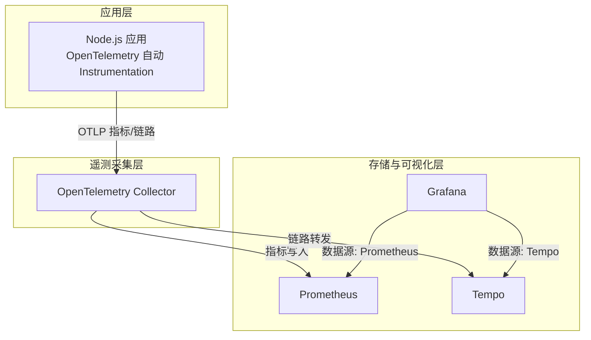
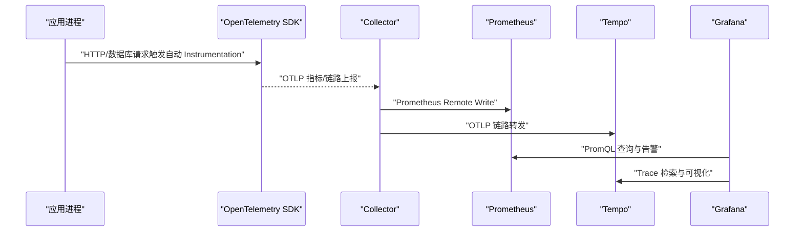
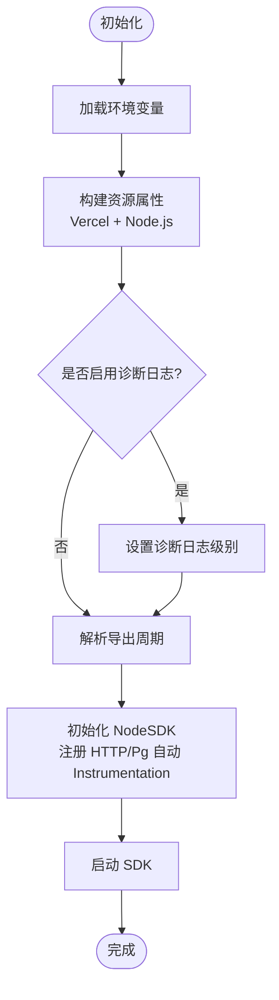
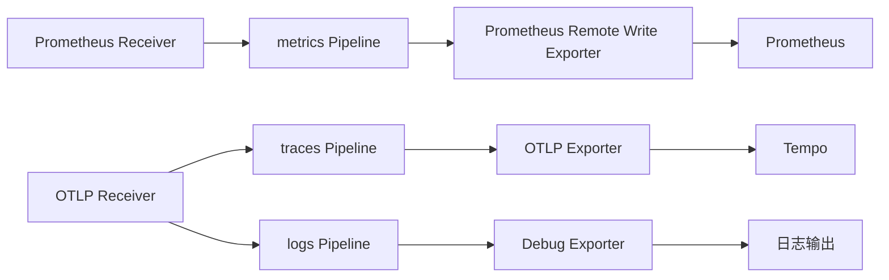
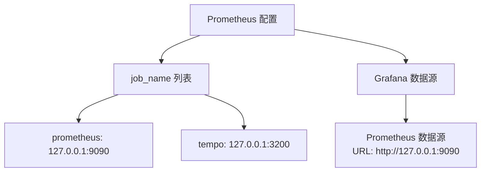
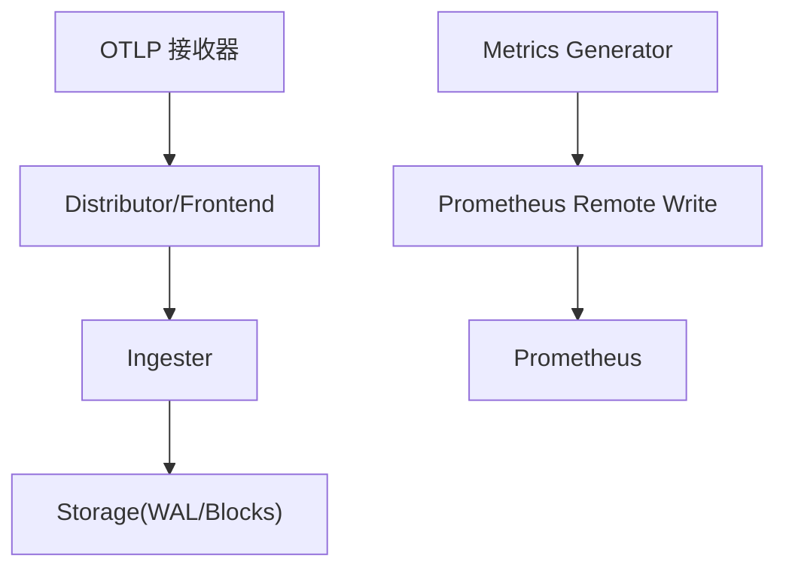
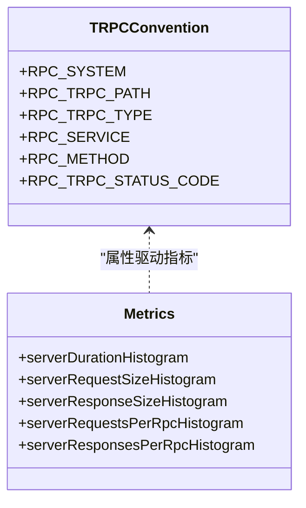
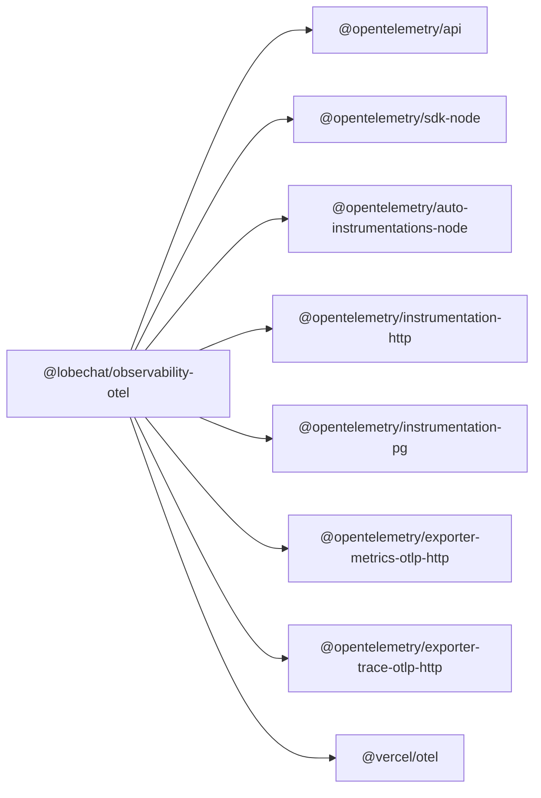

# 应用性能监控 (APM)

<cite>
**本文引用的文件**
- [packages/observability-otel/package.json](file://packages/observability-otel/package.json)
- [packages/observability-otel/src/node.ts](file://packages/observability-otel/src/node.ts)
- [packages/observability-otel/src/api.ts](file://packages/observability-otel/src/api.ts)
- [packages/observability-otel/src/trpc/index.ts](file://packages/observability-otel/src/trpc/index.ts)
- [packages/observability-otel/src/trpc/metrics.ts](file://packages/observability-otel/src/trpc/metrics.ts)
- [docker-compose/production/grafana/prometheus/prometheus.yml](file://docker-compose/production/grafana/prometheus/prometheus.yml)
- [docker-compose/production/grafana/grafana/datasources/datasource-prometheus.yaml](file://docker-compose/production/grafana/grafana/datasources/datasource-prometheus.yaml)
- [docker-compose/production/grafana/otel-collector/collector-config.yaml](file://docker-compose/production/grafana/otel-collector/collector-config.yaml)
- [docker-compose/production/grafana/tempo/tempo.yaml](file://docker-compose/production/grafana/tempo/tempo.yaml)
</cite>

## 目录
1. [简介](#简介)
2. [项目结构](#项目结构)
3. [核心组件](#核心组件)
4. [架构总览](#架构总览)
5. [组件详解](#组件详解)
6. [依赖关系分析](#依赖关系分析)
7. [性能考量](#性能考量)
8. [故障排查指南](#故障排查指南)
9. [结论](#结论)
10. [附录](#附录)

## 简介
本文件面向 LobeHub 项目的应用性能监控（APM）体系，围绕基于 Prometheus 的指标采集与 Grafana 可视化、OpenTelemetry 的自动与手动 Instrumentation 集成、指标存储与查询、告警规则、KPI 计算与容量规划进行系统化说明。文档同时提供监控仪表板设计思路、性能趋势分析方法与常见问题排查路径，帮助团队建立可落地的可观测性实践。

## 项目结构
LobeHub 的 APM 基础设施由以下部分组成：
- OpenTelemetry SDK 与自动 Instrumentation：在 Node.js 运行时注册自动采集器，覆盖 HTTP 与 PostgreSQL 等常用库。
- OpenTelemetry Collector：统一接收 OTLP 指标与链路数据，并将指标写入 Prometheus、链路数据转发至 Tempo。
- Prometheus：作为时间序列数据库，持久化指标并支持查询与告警。
- Grafana：通过 Prometheus 数据源展示仪表板，结合 Tempo 提供链路追踪可视化。
- Tempo：分布式追踪后端，用于收集与检索 Trace 数据。

图表来源
- [packages/observability-otel/src/node.ts](file://packages/observability-otel/src/node.ts#L124-L141)
- [docker-compose/production/grafana/otel-collector/collector-config.yaml](file://docker-compose/production/grafana/otel-collector/collector-config.yaml#L14-L45)
- [docker-compose/production/grafana/prometheus/prometheus.yml](file://docker-compose/production/grafana/prometheus/prometheus.yml#L5-L12)
- [docker-compose/production/grafana/tempo/tempo.yaml](file://docker-compose/production/grafana/tempo/tempo.yaml#L16-L25)

章节来源
- [packages/observability-otel/src/node.ts](file://packages/observability-otel/src/node.ts#L1-L144)
- [docker-compose/production/grafana/otel-collector/collector-config.yaml](file://docker-compose/production/grafana/otel-collector/collector-config.yaml#L1-L46)
- [docker-compose/production/grafana/prometheus/prometheus.yml](file://docker-compose/production/grafana/prometheus/prometheus.yml#L1-L12)
- [docker-compose/production/grafana/tempo/tempo.yaml](file://docker-compose/production/grafana/tempo/tempo.yaml#L1-L59)

## 核心组件
- OpenTelemetry Node SDK 与自动 Instrumentation
  - 自动注入 HTTP 与 PostgreSQL 客户端请求指标，以及通用 Node.js 运行时指标。
  - 支持按环境变量动态调整导出周期与诊断日志级别。
- OpenTelemetry Collector
  - 接收 OTLP 指标与链路数据；指标经 Prometheus Remote Write 写入 Prometheus；链路数据转发至 Tempo。
- Prometheus
  - 全局抓取间隔与评估间隔配置；支持通过 PromQL 查询与告警规则。
- Grafana
  - 以 Prometheus 与 Tempo 为数据源，构建仪表板与告警面板。
- Tempo
  - 分布式追踪后端，支持查询与检索 Trace。

章节来源
- [packages/observability-otel/src/node.ts](file://packages/observability-otel/src/node.ts#L124-L141)
- [docker-compose/production/grafana/otel-collector/collector-config.yaml](file://docker-compose/production/grafana/otel-collector/collector-config.yaml#L14-L45)
- [docker-compose/production/grafana/prometheus/prometheus.yml](file://docker-compose/production/grafana/prometheus/prometheus.yml#L1-L12)
- [docker-compose/production/grafana/grafana/datasources/datasource-prometheus.yaml](file://docker-compose/production/grafana/grafana/datasources/datasource-prometheus.yaml#L1-L16)
- [docker-compose/production/grafana/tempo/tempo.yaml](file://docker-compose/production/grafana/tempo/tempo.yaml#L1-L59)

## 架构总览
下图展示了从应用到存储与可视化的完整链路，涵盖指标与链路的采集、汇聚与展示。

图表来源
- [packages/observability-otel/src/node.ts](file://packages/observability-otel/src/node.ts#L124-L141)
- [docker-compose/production/grafana/otel-collector/collector-config.yaml](file://docker-compose/production/grafana/otel-collector/collector-config.yaml#L21-L45)
- [docker-compose/production/grafana/prometheus/prometheus.yml](file://docker-compose/production/grafana/prometheus/prometheus.yml#L5-L12)
- [docker-compose/production/grafana/tempo/tempo.yaml](file://docker-compose/production/grafana/tempo/tempo.yaml#L16-L25)

## 组件详解

### OpenTelemetry Node SDK 配置与资源属性
- 资源属性来源
  - Vercel 环境变量映射，如部署环境、分支、主机、项目 ID、区域、运行时、提交 SHA 等。
  - Node.js 环境变量映射，如 CI、NODE_ENV。
  - 服务名称默认为固定值，可通过参数覆盖。
- 导出与诊断
  - 指标导出周期可通过环境变量动态设置，默认毫秒级。
  - 诊断日志等级支持从环境变量读取，便于调试。
- 注册流程
  - 初始化 NodeSDK，启用 HTTP、PostgreSQL 自动 Instrumentation 与通用自动 Instrumentation。
  - 启动 SDK 并开始采集。

图表来源
- [packages/observability-otel/src/node.ts](file://packages/observability-otel/src/node.ts#L94-L141)

章节来源
- [packages/observability-otel/src/node.ts](file://packages/observability-otel/src/node.ts#L15-L56)
- [packages/observability-otel/src/node.ts](file://packages/observability-otel/src/node.ts#L94-L141)

### OpenTelemetry Collector 配置
- 接收器
  - Prometheus：从本地目标抓取指标，用于内部服务自监控。
  - OTLP：接收链路数据，支持 gRPC 与 HTTP。
- 导出器
  - Prometheus Remote Write：将指标写入 Prometheus。
  - OTLP：将链路数据转发至下游（此处为本地示例）。
  - Debug：输出日志便于排障。
- 管道
  - metrics：接收 Prometheus 抓取，导出至 Prometheus Remote Write。
  - traces：接收 OTLP，导出至 OTLP。
  - logs：接收 OTLP，导出至 Debug。

图表来源
- [docker-compose/production/grafana/otel-collector/collector-config.yaml](file://docker-compose/production/grafana/otel-collector/collector-config.yaml#L5-L45)

章节来源
- [docker-compose/production/grafana/otel-collector/collector-config.yaml](file://docker-compose/production/grafana/otel-collector/collector-config.yaml#L1-L46)

### Prometheus 配置与数据源
- 全局抓取与评估间隔
  - 抓取间隔与评估间隔均为 15 秒，适合中小规模场景。
- 抓取目标
  - 本地 Prometheus 自身与 Tempo（用于指标生成与远写）。
- Grafana 数据源
  - Prometheus 数据源指向本地 9090 端口，GET 方法访问。

图表来源
- [docker-compose/production/grafana/prometheus/prometheus.yml](file://docker-compose/production/grafana/prometheus/prometheus.yml#L1-L12)
- [docker-compose/production/grafana/grafana/datasources/datasource-prometheus.yaml](file://docker-compose/production/grafana/grafana/datasources/datasource-prometheus.yaml#L1-L16)

章节来源
- [docker-compose/production/grafana/prometheus/prometheus.yml](file://docker-compose/production/grafana/prometheus/prometheus.yml#L1-L12)
- [docker-compose/production/grafana/grafana/datasources/datasource-prometheus.yaml](file://docker-compose/production/grafana/grafana/datasources/datasource-prometheus.yaml#L1-L16)

### Tempo 分布式追踪
- 接收与转发
  - 通过 OTLP gRPC/HTTP 接收链路数据。
  - 将链路数据转发至下游（此处为本地示例）。
- 指标生成
  - 启用指标生成器，生成服务图与跨度指标，并通过远程写入发送至 Prometheus。
- 存储
  - 本地存储 WAL 与块数据，支持按保留策略清理。

图表来源
- [docker-compose/production/grafana/tempo/tempo.yaml](file://docker-compose/production/grafana/tempo/tempo.yaml#L16-L59)

章节来源
- [docker-compose/production/grafana/tempo/tempo.yaml](file://docker-compose/production/grafana/tempo/tempo.yaml#L1-L59)

### tRPC 指标与约定
- 指标类型
  - 服务器请求耗时直方图、请求/响应消息大小直方图、每 RPC 请求/响应消息数量直方图。
- 属性约定
  - RPC 系统、路径、类型、服务、方法、状态码等语义化属性，便于跨服务聚合与过滤。
- Payload 大小估算
  - 使用 JSON 序列化与字节编码估算请求/响应大小。

图表来源
- [packages/observability-otel/src/trpc/index.ts](file://packages/observability-otel/src/trpc/index.ts#L21-L59)
- [packages/observability-otel/src/trpc/metrics.ts](file://packages/observability-otel/src/trpc/metrics.ts#L5-L31)

章节来源
- [packages/observability-otel/src/trpc/index.ts](file://packages/observability-otel/src/trpc/index.ts#L1-L63)
- [packages/observability-otel/src/trpc/metrics.ts](file://packages/observability-otel/src/trpc/metrics.ts#L1-L32)

## 依赖关系分析
- OpenTelemetry 包依赖
  - 核心依赖包括 API、Node SDK、HTTP/Pg 自动 Instrumentation、OTLP 导出器、语义约定与 Vercel OTel 集成。
- 组件耦合
  - 应用通过 Node SDK 与 Collector 解耦；Collector 与存储解耦；Grafana 仅依赖数据源。
- 外部集成点
  - Prometheus Remote Write、OTLP 协议、Grafana 数据源配置。

图表来源
- [packages/observability-otel/package.json](file://packages/observability-otel/package.json#L13-L27)

章节来源
- [packages/observability-otel/package.json](file://packages/observability-otel/package.json#L1-L29)

## 性能考量
- 指标导出周期
  - 默认毫秒级导出周期，可通过环境变量调整，降低网络开销与 CPU 占用。
- 抓取间隔
  - Prometheus 全局抓取间隔为 15 秒，建议根据指标基数与查询负载调优。
- 指标基数控制
  - 通过语义化属性（服务名、版本、环境）限制高基数标签，避免维度爆炸。
- 远程写入与存储
  - Prometheus Remote Write 与 Tempo 指标生成器会增加网络与磁盘 IO，需结合硬件能力评估。
- 诊断日志
  - 在生产环境建议关闭或降级诊断日志，避免对性能造成影响。

## 故障排查指南
- 指标未出现
  - 检查应用侧是否正确注册 SDK，确认导出周期与 OTLP 端点可达。
  - 检查 Collector 是否成功接收 OTLP 指标与链路数据。
  - 检查 Prometheus 抓取任务与数据源配置。
- 链路无法检索
  - 确认 OTLP 接收端点与协议配置正确。
  - 检查 Tempo 存储路径与权限。
- Grafana 无法连接
  - 确认 Prometheus 数据源 URL 与访问方式。
  - 检查 Grafana 与各组件网络连通性。

章节来源
- [packages/observability-otel/src/node.ts](file://packages/observability-otel/src/node.ts#L116-L122)
- [docker-compose/production/grafana/otel-collector/collector-config.yaml](file://docker-compose/production/grafana/otel-collector/collector-config.yaml#L21-L45)
- [docker-compose/production/grafana/prometheus/prometheus.yml](file://docker-compose/production/grafana/prometheus/prometheus.yml#L5-L12)
- [docker-compose/production/grafana/grafana/datasources/datasource-prometheus.yaml](file://docker-compose/production/grafana/grafana/datasources/datasource-prometheus.yaml#L9-L16)
- [docker-compose/production/grafana/tempo/tempo.yaml](file://docker-compose/production/grafana/tempo/tempo.yaml#L46-L59)

## 结论
LobeHub 的 APM 体系以 OpenTelemetry 为核心，结合 Collector、Prometheus、Tempo 与 Grafana，实现了从指标采集、汇聚到可视化的闭环。通过自动 Instrumentation 与语义化指标约定，团队可以快速获得关键性能指标与链路信息。建议在生产环境中持续优化导出周期、抓取间隔与标签基数，并完善告警规则与仪表板，以支撑业务的稳定与增长。

## 附录

### 关键性能指标与 KPI 计算
- HTTP 请求
  - 指标：请求总量、错误率、P50/P90/P99 延迟、吞吐量。
  - 计算：PromQL 中使用 rate()、increase()、histogram_quantile() 等函数。
- 数据库连接
  - 指标：连接池活跃连接数、等待队列长度、慢查询计数。
  - 计算：通过 pg_stat_statements 或数据库内置指标聚合。
- 缓存命中率
  - 指标：缓存请求命中次数与总请求数。
  - 计算：(命中 - 未命中) / 总请求。
- 内存使用
  - 指标：RSS、堆内存、GC 次数与暂停时间。
  - 计算：直接从运行时指标中读取并换算。

### 告警规则建议
- 基于阈值的简单告警：错误率超过阈值、延迟超时、内存使用过高。
- 基于比率的异常检测：错误率环比增长、缓存命中率骤降。
- 综合健康检查：服务可用性、指标导出成功率、Collector 丢弃率。

### 仪表板设计思路
- 分层视图：概览（KPI）、服务拓扑、端点详情、链路追踪。
- 时间范围：支持近实时与历史对比，便于趋势分析。
- 交互：支持按服务、环境、版本筛选，联动钻取。

### 容量规划建议
- 指标基数：控制高基数标签数量，优先使用稳定枚举值。
- 抓取频率：根据业务峰值与查询复杂度平衡抓取间隔。
- 存储与网络：预留 Prometheus 与 Tempo 的磁盘与带宽空间，定期评估增长曲线。