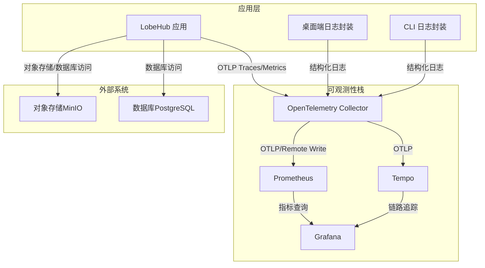
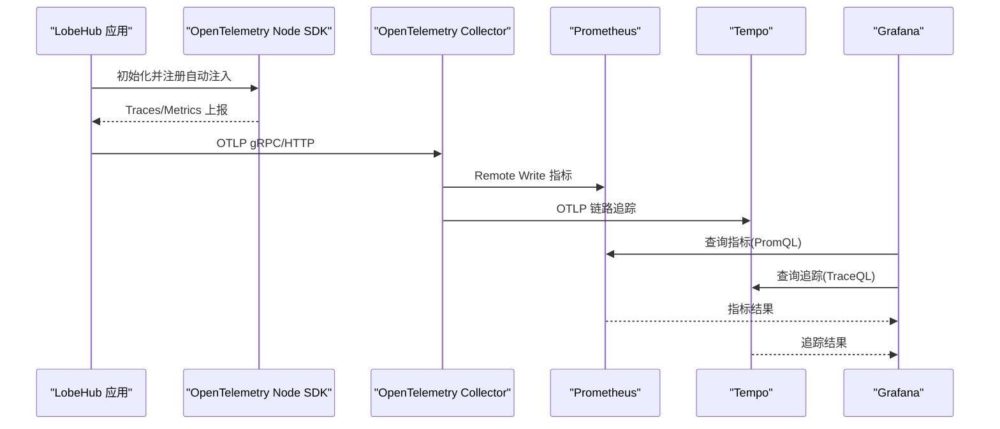
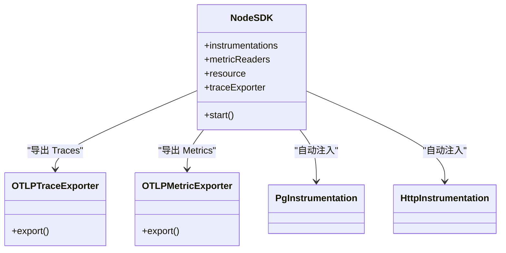
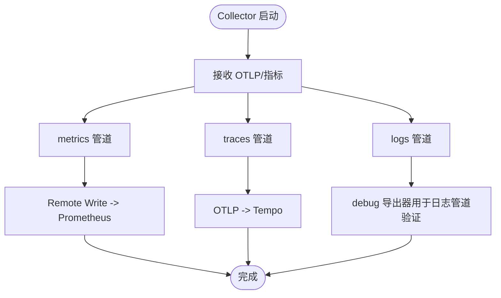
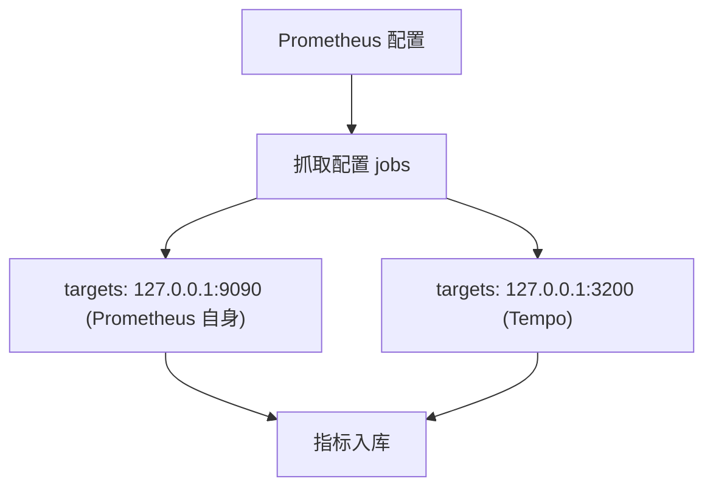
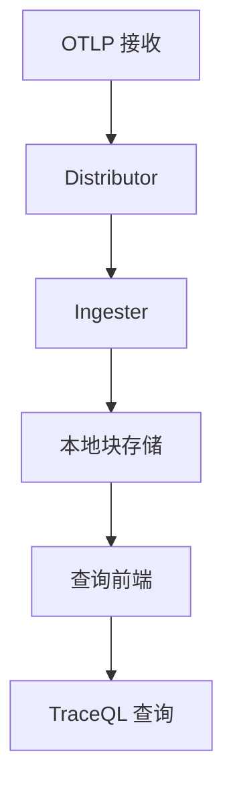
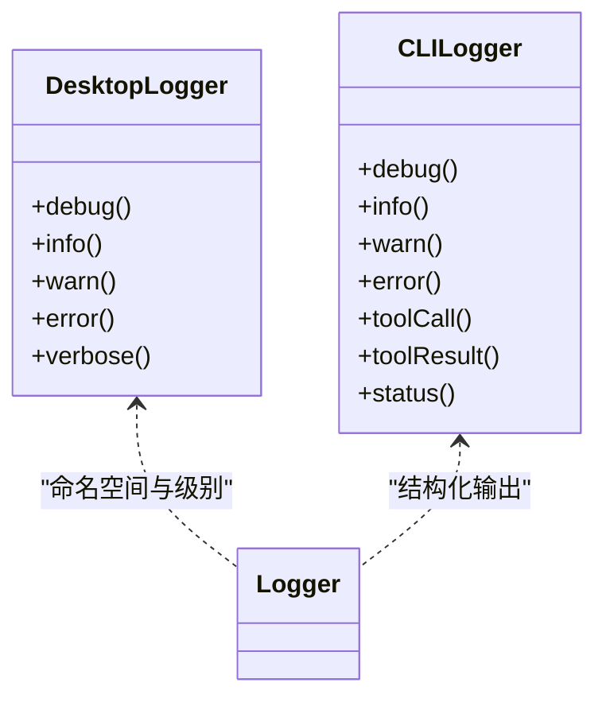
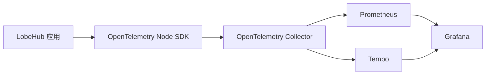

# 日志管理

<cite>
**本文引用的文件**
- [docker-compose.yml（生产 Grafana 栈）](file://docker-compose/production/grafana/docker-compose.yml)
- [tempo.yaml（Tempo 配置）](file://docker-compose/production/grafana/tempo/tempo.yaml)
- [prometheus.yml（Prometheus 配置）](file://docker-compose/production/grafana/prometheus/prometheus.yml)
- [collector-config.yaml（OpenTelemetry Collector 配置）](file://docker-compose/production/grafana/otel-collector/collector-config.yaml)
- [node.ts（OpenTelemetry Node 注册与导出）](file://packages/observability-otel/src/node.ts)
- [logger.ts（桌面端日志封装）](file://apps/desktop/src/main/utils/logger.ts)
- [logger.ts（CLI 日志封装）](file://apps/cli/src/utils/logger.ts)
- [.console-log-whitelist.json（控制台日志白名单脚本）](file://scripts/checkConsoleLog.mts)
- [.env.example（环境变量示例）](file://.env.example)
- [grafana.mdx（Grafana/Prometheus/Tempo 自托管指南）](file://docs/self-hosting/advanced/observability/grafana.mdx)
</cite>

## 目录

1. [简介](#简介)
2. [项目结构](#项目结构)
3. [核心组件](#核心组件)
4. [架构总览](#架构总览)
5. [详细组件分析](#详细组件分析)
6. [依赖关系分析](#依赖关系分析)
7. [性能考量](#性能考量)
8. [故障排查指南](#故障排查指南)
9. [结论](#结论)
10. [附录](#附录)

## 简介

本文件面向 LobeHub 项目的日志管理与可观测性，系统性阐述基于 Prometheus、Tempo 与 OpenTelemetry 的日志与指标采集、传输、存储与查询体系。内容覆盖：

- 结构化日志格式与日志级别规范
- 日志字段标准化与资源属性注入
- 日志采集、传输与存储路径（Fluentd/Fluent Bit 作为可选方案说明）
- 日志索引与查询（PromQL、Tempo TraceQL、Grafana Explore）
- 日志分析与可视化（聚合、趋势、异常检测）
- 最佳实践（轮转、压缩、保留、安全合规）
- 日志驱动的故障排查、性能分析与容量规划

## 项目结构

围绕日志与可观测性的关键文件分布如下：

- 生产级 Grafana/Prometheus/Tempo/Collector 编排与配置
- OpenTelemetry Node SDK 注册与导出
- 应用层日志封装（桌面端与 CLI）
- 环境变量与部署示例
- 文档化自托管部署指南

图表来源

- [docker-compose.yml（生产 Grafana 栈）](file://docker-compose/production/grafana/docker-compose.yml#L1-L251)
- [collector-config.yaml（OpenTelemetry Collector 配置）](file://docker-compose/production/grafana/otel-collector/collector-config.yaml#L1-L46)
- [prometheus.yml（Prometheus 配置）](file://docker-compose/production/grafana/prometheus/prometheus.yml#L1-L12)
- [tempo.yaml（Tempo 配置）](file://docker-compose/production/grafana/tempo/tempo.yaml#L1-L59)

章节来源

- [docker-compose.yml（生产 Grafana 栈）](file://docker-compose/production/grafana/docker-compose.yml#L1-L251)
- [grafana.mdx（Grafana/Prometheus/Tempo 自托管指南）](file://docs/self-hosting/advanced/observability/grafana.mdx#L1-L73)

## 核心组件

- OpenTelemetry Node SDK：自动注入 HTTP、PostgreSQL 等可观测性能力，统一导出 Traces 与 Metrics，并设置通用资源属性（服务名、版本、环境等）。
- OpenTelemetry Collector：接收 OTLP（gRPC/HTTP），将指标写入 Prometheus（Remote Write），并将链路追踪转发至 Tempo；同时支持日志管道（当前配置为调试输出）。
- Prometheus：指标采集与查询，支持 Exemplars 与 OTLP 接收端口。
- Tempo：分布式链路追踪，接收 OTLP 并持久化，支持 Metrics Generator 将追踪转换为指标。
- Grafana：仪表盘与可视化，连接 Prometheus 与 Tempo 数据源，使用 Explore 查询。
- 应用日志封装：桌面端与 CLI 提供结构化日志输出，便于统一接入 Collector。

章节来源

- [node.ts（OpenTelemetry Node 注册与导出）](file://packages/observability-otel/src/node.ts#L1-L144)
- [collector-config.yaml（OpenTelemetry Collector 配置）](file://docker-compose/production/grafana/otel-collector/collector-config.yaml#L1-L46)
- [prometheus.yml（Prometheus 配置）](file://docker-compose/production/grafana/prometheus/prometheus.yml#L1-L12)
- [tempo.yaml（Tempo 配置）](file://docker-compose/production/grafana/tempo/tempo.yaml#L1-L59)
- [logger.ts（桌面端日志封装）](file://apps/desktop/src/main/utils/logger.ts#L1-L48)
- [logger.ts（CLI 日志封装）](file://apps/cli/src/utils/logger.ts#L1-L66)

## 架构总览

下图展示 LobeHub 日志与可观测性整体架构：应用侧通过 OpenTelemetry Node SDK 生成 Traces/Metrics，经 Collector 转发到 Prometheus 与 Tempo；Grafana 作为统一入口进行查询与可视化。

图表来源

- [node.ts（OpenTelemetry Node 注册与导出）](file://packages/observability-otel/src/node.ts#L94-L141)
- [collector-config.yaml（OpenTelemetry Collector 配置）](file://docker-compose/production/grafana/otel-collector/collector-config.yaml#L14-L45)
- [prometheus.yml（Prometheus 配置）](file://docker-compose/production/grafana/prometheus/prometheus.yml#L5-L11)
- [tempo.yaml（Tempo 配置）](file://docker-compose/production/grafana/tempo/tempo.yaml#L16-L44)

## 详细组件分析

### OpenTelemetry Node SDK（Traces/Metrics 导出）

- 资源属性：统一注入服务名、版本、环境变量（Vercel/Node），便于跨组件关联。
- 自动注入：HTTP、PostgreSQL 等常用库，自动采集调用链与数据库操作。
- 导出器：Traces 通过 OTLP HTTP 导出；Metrics 通过 OTLP HTTP 周期性导出。
- 调试日志：支持按环境变量设置诊断日志级别，便于开发定位。

图表来源

- [node.ts（OpenTelemetry Node 注册与导出）](file://packages/observability-otel/src/node.ts#L124-L141)

章节来源

- [node.ts（OpenTelemetry Node 注册与导出）](file://packages/observability-otel/src/node.ts#L58-L141)

### OpenTelemetry Collector（采集与转发）

- 接收器：Prometheus（抓取本地指标）、OTLP（gRPC/HTTP）。
- 导出器：Prometheus Remote Write（写入 Prometheus）、OTLP（转发至 Tempo）、Debug（日志管道调试）。
- 管道：metrics、traces、logs 三类管道独立配置，确保职责清晰。

图表来源

- [collector-config.yaml（OpenTelemetry Collector 配置）](file://docker-compose/production/grafana/otel-collector/collector-config.yaml#L5-L45)

章节来源

- [collector-config.yaml（OpenTelemetry Collector 配置）](file://docker-compose/production/grafana/otel-collector/collector-config.yaml#L1-L46)

### Prometheus（指标采集与查询）

- 启用 OTLP 接收端口与远程写入接收端口，支持 Exemplars 存储。
- 抓取自身与 Tempo（Metrics Generator 输出）指标，便于统一查询。

图表来源

- [prometheus.yml（Prometheus 配置）](file://docker-compose/production/grafana/prometheus/prometheus.yml#L5-L11)

章节来源

- [prometheus.yml（Prometheus 配置）](file://docker-compose/production/grafana/prometheus/prometheus.yml#L1-L12)

### Tempo（链路追踪）

- 接收 OTLP（gRPC/HTTP），配置 WAL 与本地块存储，支持 Metrics Generator 将追踪转换为指标。
- 查询前端与 SLO 配置，便于快速检索与性能评估。

图表来源

- [tempo.yaml（Tempo 配置）](file://docker-compose/production/grafana/tempo/tempo.yaml#L16-L59)

章节来源

- [tempo.yaml（Tempo 配置）](file://docker-compose/production/grafana/tempo/tempo.yaml#L1-L59)

### Grafana（可视化与探索）

- 连接 Prometheus 与 Tempo 数据源，支持 Explore 查询。
- 提供 TraceQL 编辑器开关，便于即席查询与分析。

章节来源

- [docker-compose.yml（生产 Grafana 栈）](file://docker-compose/production/grafana/docker-compose.yml#L98-L113)
- [grafana.mdx（Grafana/Prometheus/Tempo 自托管指南）](file://docs/self-hosting/advanced/observability/grafana.mdx#L49-L64)

### 应用日志封装（桌面端与 CLI）

- 桌面端：基于 debug 命名空间与 electron-log，在开发与生产环境采用不同输出策略；提供统一的 debug/info/warn/error/verbose 方法。
- CLI：提供带时间戳与彩色标记的日志输出，支持 verbose 开关，便于命令行场景下的结构化日志。

图表来源

- [logger.ts（桌面端日志封装）](file://apps/desktop/src/main/utils/logger.ts#L14-L47)
- [logger.ts（CLI 日志封装）](file://apps/cli/src/utils/logger.ts#L17-L65)

章节来源

- [logger.ts（桌面端日志封装）](file://apps/desktop/src/main/utils/logger.ts#L1-L48)
- [logger.ts（CLI 日志封装）](file://apps/cli/src/utils/logger.ts#L1-L66)

## 依赖关系分析

- 应用层依赖 OpenTelemetry Node SDK 生成可观测数据。
- Collector 作为中间层，解耦应用与下游存储系统，便于扩展与替换。
- Prometheus 与 Tempo 分别服务于指标与追踪两类数据，Grafana 统一呈现。
- 环境变量控制导出目标（OTLP Endpoint）、调试级别与指标导出间隔。

图表来源

- [node.ts（OpenTelemetry Node 注册与导出）](file://packages/observability-otel/src/node.ts#L94-L141)
- [collector-config.yaml（OpenTelemetry Collector 配置）](file://docker-compose/production/grafana/otel-collector/collector-config.yaml#L35-L45)
- [docker-compose.yml（生产 Grafana 栈）](file://docker-compose/production/grafana/docker-compose.yml#L124-L148)

章节来源

- [node.ts（OpenTelemetry Node 注册与导出）](file://packages/observability-otel/src/node.ts#L94-L141)
- [collector-config.yaml（OpenTelemetry Collector 配置）](file://docker-compose/production/grafana/otel-collector/collector-config.yaml#L1-L46)
- [docker-compose.yml（生产 Grafana 栈）](file://docker-compose/production/grafana/docker-compose.yml#L124-L148)

## 性能考量

- 指标导出间隔：通过环境变量控制 Metrics Reader 导出周期，避免高频率导出带来的网络与存储压力。
- OTLP 接收端口：启用 Prometheus 的 OTLP 接收端口与远程写入接收端口，减少中间环节。
- Metrics Generator：Tempo 的 Metrics Generator 可将追踪转换为指标，降低查询复杂度。
- 资源属性：统一注入服务名、版本与环境信息，便于按维度聚合与降噪。

章节来源

- [node.ts（OpenTelemetry Node 注册与导出）](file://packages/observability-otel/src/node.ts#L116-L122)
- [prometheus.yml（Prometheus 配置）](file://docker-compose/production/grafana/prometheus/prometheus.yml#L132-L136)
- [tempo.yaml（Tempo 配置）](file://docker-compose/production/grafana/tempo/tempo.yaml#L33-L59)

## 故障排查指南

- 容器健康检查：确认 Grafana、Prometheus、Tempo、Collector、LobeHub 容器均处于运行状态。
- 日志查看：通过 docker compose logs <服务名> 查看各组件日志。
- 链路追踪与指标：在 Grafana 中使用 Explore 对 Prometheus 与 Tempo 进行即席查询。
- 端口连通性：确保 Collector 的 OTLP gRPC/HTTP 端口与 Prometheus/Tempo 的监听端口可达。
- 环境变量：核对 LobeHub 的 OTLP 导出端点与协议配置是否正确。

章节来源

- [docker-compose.yml（生产 Grafana 栈）](file://docker-compose/production/grafana/docker-compose.yml#L98-L193)
- [grafana.mdx（Grafana/Prometheus/Tempo 自托管指南）](file://docs/self-hosting/advanced/observability/grafana.mdx#L60-L64)

## 结论

通过 OpenTelemetry Node SDK + Collector + Prometheus + Tempo + Grafana 的组合，LobeHub 实现了可观测性的端到端闭环。应用侧以结构化日志与自动注入为主，中间层以 Collector 为枢纽，后端以 Prometheus/Tempo 为核心存储，最终由 Grafana 提供统一可视化与探索体验。结合环境变量与配置文件，可灵活调整导出目标、调试级别与导出周期，满足不同环境下的性能与成本需求。

## 附录

### 结构化日志格式与字段标准化

- 建议字段
  - 时间戳：ISO 8601 字符串
  - 服务名：统一注入（如 lobehub）
  - 版本：服务版本号
  - 环境：开发 / 预览 / 生产
  - 资源属性：运行时（如 Vercel/Node）、CI 状态、分支 / 提交等
  - 日志级别：debug/info/warn/error/verbose
  - 模块 / 命名空间：如 desktop:logger、cli:utils
  - 请求 / 会话标识：trace_id、span_id（来自 OpenTelemetry）
  - 错误上下文：错误码、堆栈摘要、相关参数
- 字段来源
  - 资源属性：参考 OpenTelemetry Node SDK 的 attributesCommon 与平台特定属性注入。
  - 日志级别：桌面端与 CLI 日志封装提供统一映射。

章节来源

- [node.ts（OpenTelemetry Node 注册与导出）](file://packages/observability-otel/src/node.ts#L51-L56)
- [logger.ts（桌面端日志封装）](file://apps/desktop/src/main/utils/logger.ts#L14-L47)
- [logger.ts（CLI 日志封装）](file://apps/cli/src/utils/logger.ts#L17-L65)

### 日志采集、传输与存储机制

- 采集
  - 应用侧：OpenTelemetry Node SDK 自动注入 HTTP / 数据库调用，生成 Traces/Metrics。
  - 应用日志：桌面端与 CLI 输出结构化日志，便于统一接入 Collector。
- 传输
  - OTLP：gRPC/HTTP 协议，支持 Collector 与 Prometheus/Tempo 接收端口。
  - Remote Write：指标写入 Prometheus。
- 存储
  - Prometheus：时序指标与 Exemplars。
  - Tempo：分布式链路追踪与 Metrics Generator 指标。
  - Grafana：作为可视化与查询入口。

章节来源

- [node.ts（OpenTelemetry Node 注册与导出）](file://packages/observability-otel/src/node.ts#L124-L141)
- [collector-config.yaml（OpenTelemetry Collector 配置）](file://docker-compose/production/grafana/otel-collector/collector-config.yaml#L14-L45)
- [prometheus.yml（Prometheus 配置）](file://docker-compose/production/grafana/prometheus/prometheus.yml#L132-L136)
- [tempo.yaml（Tempo 配置）](file://docker-compose/production/grafana/tempo/tempo.yaml#L46-L59)

### 日志索引与查询

- Prometheus
  - PromQL：用于指标查询与聚合统计。
  - Exemplars：结合 Traces 与指标进行关联分析。
- Tempo
  - TraceQL：用于链路追踪查询与异常定位。
  - Metrics Generator：将追踪转换为指标，辅助趋势分析。
- Grafana
  - Explore：即席查询与可视化。
  - 数据源：Prometheus 与 Tempo。

章节来源

- [prometheus.yml（Prometheus 配置）](file://docker-compose/production/grafana/prometheus/prometheus.yml#L1-L12)
- [tempo.yaml（Tempo 配置）](file://docker-compose/production/grafana/tempo/tempo.yaml#L33-L59)
- [grafana.mdx（Grafana/Prometheus/Tempo 自托管指南）](file://docs/self-hosting/advanced/observability/grafana.mdx#L56-L58)

### Fluentd/Fluent Bit 配置与日志管道（可选）

- 若需引入传统日志管道，可在现有架构中增加：
  - Fluentd/Fluent Bit：采集应用日志文件，进行过滤 / 重写后输出至 OpenSearch/S3/Collector。
  - Collector：作为统一汇聚点，将指标写入 Prometheus，链路追踪写入 Tempo。
- 注意事项
  - 与 OpenTelemetry Traces/Metrics 并行时，需避免重复导出与字段冲突。
  - 保持统一的资源属性与命名空间，便于关联查询。

\[本节为概念性说明，不直接对应具体源文件]

### 最佳实践

- 日志轮转与压缩
  - 使用系统自带轮转工具（如 logrotate）或容器日志驱动（如 journald/syslogd）。
  - 对历史日志进行压缩归档，降低存储成本。
- 保留策略
  - 指标：短期高频（1-7 天），长期低频（30-90 天）。
  - 追踪：短期（1-7 天），长期（14-30 天）。
- 安全与合规
  - 限制敏感字段（如 API Key、Token）输出；使用脱敏策略。
  - 通过网络隔离与 TLS 加密传输，确保数据安全。
- 调试与诊断
  - 开发环境开启更详细的日志级别；生产环境聚焦关键路径。
  - 使用环境变量动态调整诊断级别与导出间隔。

\[本节提供通用指导，不直接对应具体源文件]

### 日志驱动的故障排查与性能分析

- 快速定位
  - 使用 Grafana Explore 结合 TraceQL 定位慢调用与异常。
  - 关联指标（PromQL）与追踪（TraceQL）进行根因分析。
- 性能分析
  - 利用 Metrics Generator 生成服务图与跨度指标，识别热点与瓶颈。
  - 结合 Exemplars 将指标异常与具体请求关联。
- 容量规划
  - 基于指标增长趋势与保留策略估算存储与带宽需求。
  - 通过 Collector 的 Remote Write 与 OTLP 接收端口吞吐能力评估扩容阈值。

章节来源

- [tempo.yaml（Tempo 配置）](file://docker-compose/production/grafana/tempo/tempo.yaml#L33-L59)
- [prometheus.yml（Prometheus 配置）](file://docker-compose/production/grafana/prometheus/prometheus.yml#L132-L136)
- [grafana.mdx（Grafana/Prometheus/Tempo 自托管指南）](file://docs/self-hosting/advanced/observability/grafana.mdx#L56-L58)

### 环境变量与部署要点

- OTLP 导出端点与协议：LobeHub 通过环境变量配置 OTLP Metrics/Traces 的协议与端点。
- 调试与指标导出：通过环境变量控制诊断日志级别与指标导出间隔。
- 自托管部署：参考文档指南，一键启动 Grafana/Prometheus/Tempo/Collector 与 LobeHub。

章节来源

- [docker-compose.yml（生产 Grafana 栈）](file://docker-compose/production/grafana/docker-compose.yml#L187-L192)
- [node.ts（OpenTelemetry Node 注册与导出）](file://packages/observability-otel/src/node.ts#L107-L122)
- [grafana.mdx（Grafana/Prometheus/Tempo 自托管指南）](file://docs/self-hosting/advanced/observability/grafana.mdx#L32-L47)
