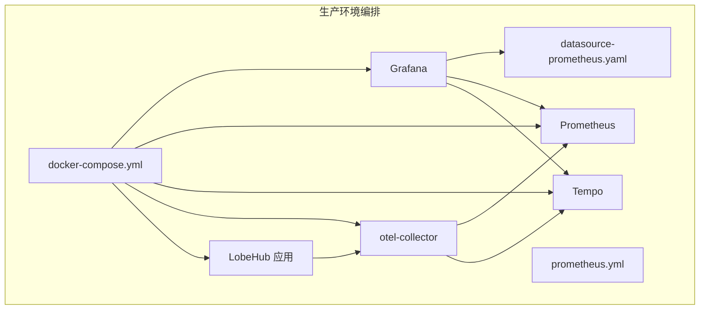
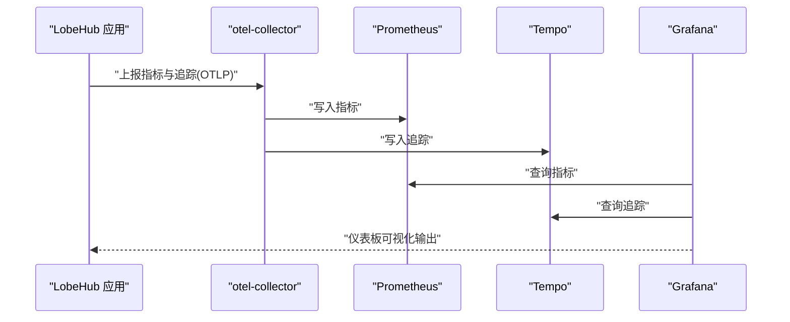
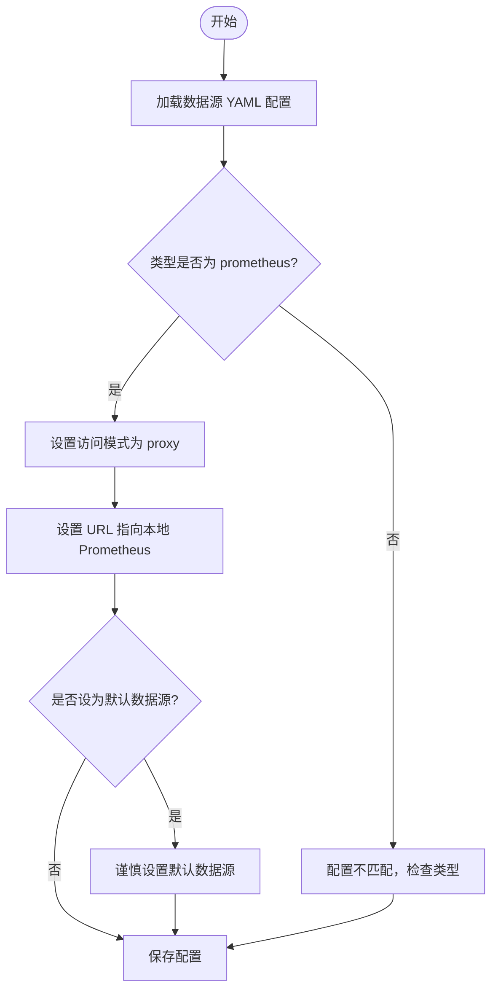
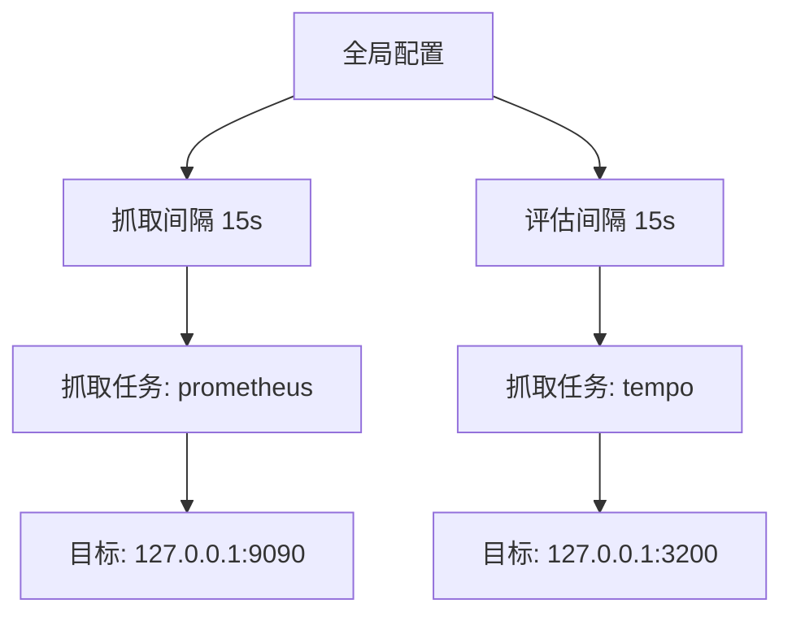
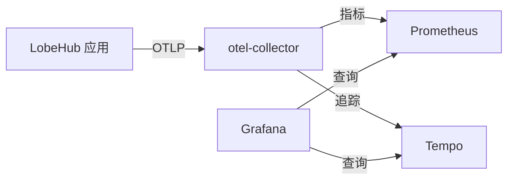
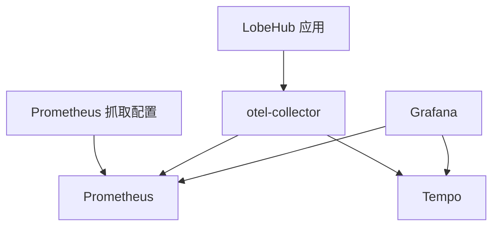

# 监控仪表板设计

<cite>
**本文引用的文件**
- [docker-compose.yml](file://docker-compose/production/grafana/docker-compose.yml)
- [datasource-prometheus.yaml](file://docker-compose/production/grafana/grafana/datasources/datasource-prometheus.yaml)
- [prometheus.yml](file://docker-compose/production/grafana/prometheus/prometheus.yml)
- [grafana.mdx](file://docs/self-hosting/advanced/observability/grafana.mdx)
- [grafana.zh-CN.mdx](file://docs/self-hosting/advanced/observability/grafana.zh-CN.mdx)
</cite>

## 目录

1. [引言](#引言)
2. [项目结构](#项目结构)
3. [核心组件](#核心组件)
4. [架构总览](#架构总览)
5. [详细组件分析](#详细组件分析)
6. [依赖关系分析](#依赖关系分析)
7. [性能考量](#性能考量)
8. [故障排查指南](#故障排查指南)
9. [结论](#结论)
10. [附录](#附录)

## 引言

本文件面向 LobeHub 自托管部署的监控仪表板设计，系统化阐述 Grafana 仪表板的设计原则与最佳实践，覆盖面板布局、图表类型选择、颜色与交互设计规范；并结合应用健康、业务指标、基础设施与用户体验等多类监控场景给出专题面板方案。同时，文档解释数据源配置、查询优化、变量与模板变量的使用方法，并提供关键业务指标的可视化策略（KPI 卡片、趋势图、热力图、散点图等），最后补充版本管理、共享机制、权限控制与性能优化等运维要点。

## 项目结构

围绕 Grafana 与可观测性栈的部署，仓库提供了生产级 Docker Compose 编排，包含 Grafana、Prometheus、Tempo、OpenTelemetry Collector 等组件，以及数据源与 Prometheus 抓取配置文件。这些文件共同构成仪表板的运行时环境与数据基础。

**图表来源**

- [docker-compose.yml](file://docker-compose/production/grafana/docker-compose.yml#L98-L150)
- [datasource-prometheus.yaml](file://docker-compose/production/grafana/grafana/datasources/datasource-prometheus.yaml#L3-L16)
- [prometheus.yml](file://docker-compose/production/grafana/prometheus/prometheus.yml#L1-L12)

**章节来源**

- [docker-compose.yml](file://docker-compose/production/grafana/docker-compose.yml#L1-L251)
- [grafana.mdx](file://docs/self-hosting/advanced/observability/grafana.mdx#L1-L74)
- [grafana.zh-CN.mdx](file://docs/self-hosting/advanced/observability/grafana.zh-CN.mdx#L1-L72)

## 核心组件

- Grafana：可视化与仪表板中心，负责展示 Prometheus 指标与 Tempo 链路追踪结果。
- Prometheus：指标采集与存储，提供稳定的时间序列数据源。
- Tempo：分布式链路追踪后端，与 Grafana Explore/Tracing 能力配合使用。
- OpenTelemetry Collector：接收来自应用的 OTLP 指标与链路数据，转发至 Prometheus 与 Tempo。
- LobeHub 应用：通过 OTLP 导出器上报指标与追踪，作为可观测性数据的主要来源。

上述组件在编排文件中以独立容器形式运行并通过网络互通，Grafana 依赖 Prometheus 与 Tempo 数据源完成可视化。

**章节来源**

- [docker-compose.yml](file://docker-compose/production/grafana/docker-compose.yml#L98-L150)
- [grafana.mdx](file://docs/self-hosting/advanced/observability/grafana.mdx#L16-L24)
- [grafana.zh-CN.mdx](file://docs/self-hosting/advanced/observability/grafana.zh-CN.mdx#L15-L23)

## 架构总览

下图展示了 LobeHub 生产环境可观测性栈的整体交互：应用通过 OTLP 将指标与追踪上报到 otel-collector，后者分别写入 Prometheus 与 Tempo；Grafana 通过预置数据源连接 Prometheus 与 Tempo，用户可在 Explore 中进行即席查询与调试。

**图表来源**

- [docker-compose.yml](file://docker-compose/production/grafana/docker-compose.yml#L138-L148)
- [prometheus.yml](file://docker-compose/production/grafana/prometheus/prometheus.yml#L5-L12)
- [grafana.mdx](file://docs/self-hosting/advanced/observability/grafana.mdx#L56-L58)

**章节来源**

- [docker-compose.yml](file://docker-compose/production/grafana/docker-compose.yml#L138-L148)
- [prometheus.yml](file://docker-compose/production/grafana/prometheus/prometheus.yml#L1-L12)
- [grafana.mdx](file://docs/self-hosting/advanced/observability/grafana.mdx#L56-L58)

## 详细组件分析

### 组件一：Grafana 数据源配置

- 数据源名称与类型：Prometheus 数据源已通过 YAML 预置，类型为 prometheus，访问方式为 proxy，URL 指向本地 Prometheus 实例。
- 默认数据源：未设置为默认数据源，避免与其他数据源冲突。
- 高级配置：启用 GET 方法访问，便于缓存与代理层处理。

**图表来源**

- [datasource-prometheus.yaml](file://docker-compose/production/grafana/grafana/datasources/datasource-prometheus.yaml#L3-L16)

**章节来源**

- [datasource-prometheus.yaml](file://docker-compose/production/grafana/grafana/datasources/datasource-prometheus.yaml#L1-L16)

### 组件二：Prometheus 抓取配置

- 抓取间隔：全局抓取与评估间隔均为 15 秒，兼顾实时性与资源消耗平衡。
- 抓取目标：包含 Prometheus 自身与 Tempo 的静态目标，确保可观测性栈内部数据可用。

**图表来源**

- [prometheus.yml](file://docker-compose/production/grafana/prometheus/prometheus.yml#L1-L12)

**章节来源**

- [prometheus.yml](file://docker-compose/production/grafana/prometheus/prometheus.yml#L1-L12)

### 组件三：Grafana 与 OTel Collector 的集成

- Grafana 服务：挂载数据源与仪表板目录，依赖 Tempo 与 Prometheus 完成可视化。
- OTel Collector：通过配置文件接收指标与追踪，转发至 Prometheus 与 Tempo。
- 应用导出：LobeHub 应用配置 OTLP 指标与追踪导出端点，确保数据流入可观测性栈。

**图表来源**

- [docker-compose.yml](file://docker-compose/production/grafana/docker-compose.yml#L98-L150)
- [docker-compose.yml](file://docker-compose/production/grafana/docker-compose.yml#L138-L148)
- [docker-compose.yml](file://docker-compose/production/grafana/docker-compose.yml#L160-L193)

**章节来源**

- [docker-compose.yml](file://docker-compose/production/grafana/docker-compose.yml#L98-L150)
- [docker-compose.yml](file://docker-compose/production/grafana/docker-compose.yml#L138-L148)
- [docker-compose.yml](file://docker-compose/production/grafana/docker-compose.yml#L160-L193)

### 组件四：仪表板设计原则与最佳实践

- 面板布局
  - 分区与留白：采用网格布局，保持一致的间距与对齐，避免视觉拥挤。
  - 层次清晰：标题、说明与图表分层，重要指标置于首屏可视区域。
- 图表选择
  - KPI 卡片：用于展示关键指标当前值与变化趋势，适合单值与同比 / 环比。
  - 趋势图：展示时间序列变化，支持多指标叠加与缩放对比。
  - 热力图：用于周期性活动强度可视化（如日活跃度），强调分布与峰值。
  - 散点图：用于双维度对比与异常检测（如耗时与 Token 数），标注状态与标签。
- 颜色与交互
  - 颜色体系：统一使用品牌色与状态色（成功 / 警告 / 错误），确保色盲友好。
  - 交互设计：支持时间范围切换、面板钻取、悬浮提示与全屏查看。
- 变量与模板变量
  - 使用模板变量过滤维度（如模型、供应商、实例），提升复用性与灵活性。
  - 结合正则与数据源查询生成动态选项，减少硬编码。
- 查询优化
  - 合理设置时间窗口与采样频率，避免过小粒度导致性能问题。
  - 使用聚合与分位数函数降低数据点数量，提高渲染效率。
  - 对高频查询启用缓存与预聚合，缩短响应时间。
- 权限与共享
  - 基于角色的访问控制（RBAC），限制敏感仪表板的编辑与删除权限。
  - 通过链接分享只读视图，或导出图片 / PDF 用于汇报。
- 版本管理与发布
  - 仪表板 JSON 导入导出，纳入版本控制系统，记录变更历史。
  - 发布前进行回归测试，确保查询与变量兼容性。

（本节为通用设计指导，不直接分析具体代码文件）

### 组件五：专题面板方案

- 应用健康监控
  - 关键指标：CPU 使用率、内存占用、请求延迟、错误率、并发连接数。
  - 图表组合：KPI 卡片展示总体健康度，趋势图显示近 24 小时变化，热力图反映峰值时段。
- 业务指标监控
  - 关键指标：对话次数、消息吞吐、Token 消耗、会话时长、转化率。
  - 图表组合：趋势图与散点图对比不同模型 / 供应商表现，热力图展示用户活跃度。
- 基础设施监控
  - 关键指标：磁盘空间、网络带宽、数据库连接数、缓存命中率。
  - 图表组合：KPI 卡片与告警联动，趋势图辅助容量规划。
- 用户体验监控
  - 关键指标：首字节时间、页面响应时间、错误分布、用户路径停留。
  - 图表组合：瀑布图与热力图结合，定位性能瓶颈与异常路径。

（本节为通用设计指导，不直接分析具体代码文件）

## 依赖关系分析

Grafana 与可观测性栈的耦合关系主要体现在数据流与服务依赖上：Grafana 依赖 Prometheus 与 Tempo 提供数据；OTel Collector 作为中间层，负责将应用上报的 OTLP 数据分流至 Prometheus 与 Tempo；Prometheus 与 Tempo 的配置影响数据可用性与查询性能。

**图表来源**

- [docker-compose.yml](file://docker-compose/production/grafana/docker-compose.yml#L98-L150)
- [prometheus.yml](file://docker-compose/production/grafana/prometheus/prometheus.yml#L5-L12)

**章节来源**

- [docker-compose.yml](file://docker-compose/production/grafana/docker-compose.yml#L98-L150)
- [prometheus.yml](file://docker-compose/production/grafana/prometheus/prometheus.yml#L1-L12)

## 性能考量

- 查询性能
  - 控制时间窗口大小与采样粒度，避免一次性返回过多数据点。
  - 使用聚合与分位数函数，减少渲染压力。
- 存储与抓取
  - 合理设置抓取间隔与保留策略，平衡数据完整性与存储成本。
  - 对高频指标进行预聚合，降低写入与查询负载。
- 渲染优化
  - 优先使用轻量图表（如 KPI 卡片、简单折线），复杂图表按需加载。
  - 启用浏览器缓存与 CDN 加速静态资源。
- 网络与安全
  - 通过反向代理与 TLS 加固访问链路，限制不必要的暴露端口。
  - 对敏感仪表板启用鉴权与最小权限原则。

（本节为通用指导，不直接分析具体代码文件）

## 故障排查指南

- 容器状态检查
  - 确认所有容器均处于运行状态，必要时查看日志定位问题。
- 数据源连通性
  - 验证 Grafana 数据源配置是否正确，Prometheus 与 Tempo 是否成功抓取数据。
- 查询验证
  - 在 Grafana Explore 中执行简单查询，确认数据可用性与时间范围。
- 环境变量与端口
  - 检查 .env 文件中的密码与端口映射，确保与编排文件一致。

**章节来源**

- [grafana.mdx](file://docs/self-hosting/advanced/observability/grafana.mdx#L60-L64)
- [grafana.zh-CN.mdx](file://docs/self-hosting/advanced/observability/grafana.zh-CN.mdx#L58-L62)

## 结论

通过标准化的 Docker Compose 编排与清晰的数据流设计，LobeHub 的 Grafana 仪表板能够稳定地呈现 Prometheus 指标与 Tempo 链路追踪。遵循本文提出的布局、图表、颜色与交互规范，结合变量与模板变量的灵活使用，可构建高可用、易维护、可扩展的监控仪表板体系。同时，配套的查询优化与运维策略将显著提升整体可观测性的稳定性与效率。

## 附录

- 快速开始
  - 下载编排与示例环境文件，更新密码与密钥后启动服务。
  - 访问 Grafana，默认账号为 admin，按需创建数据源与仪表板。
- 参考文档
  - Grafana、Prometheus、Tempo 官方文档与最佳实践。

**章节来源**

- [grafana.mdx](file://docs/self-hosting/advanced/observability/grafana.mdx#L32-L47)
- [grafana.zh-CN.mdx](file://docs/self-hosting/advanced/observability/grafana.zh-CN.mdx#L30-L45)
