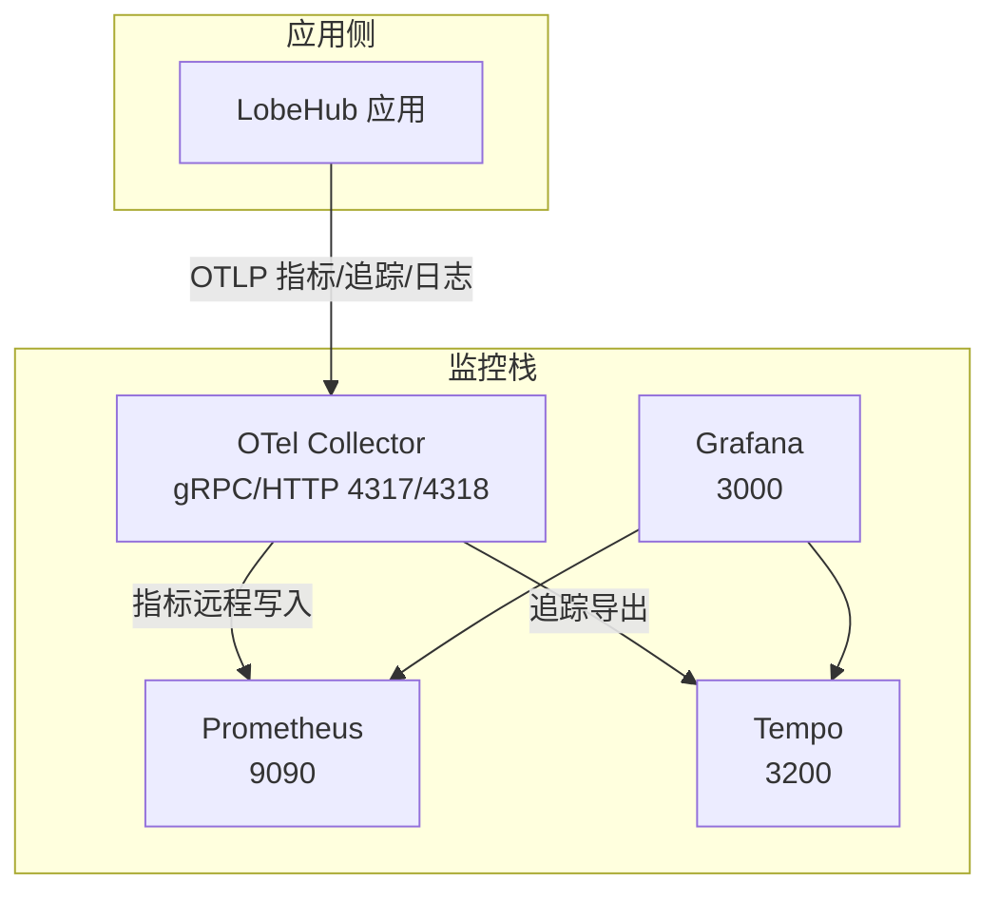
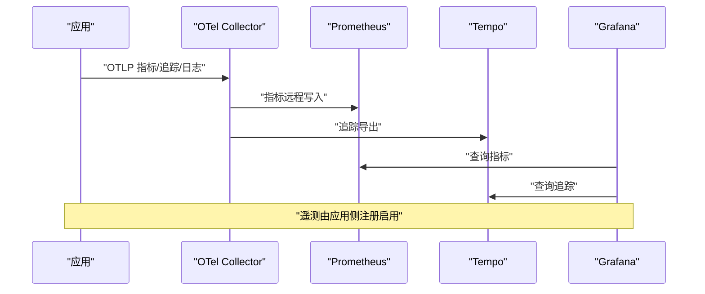
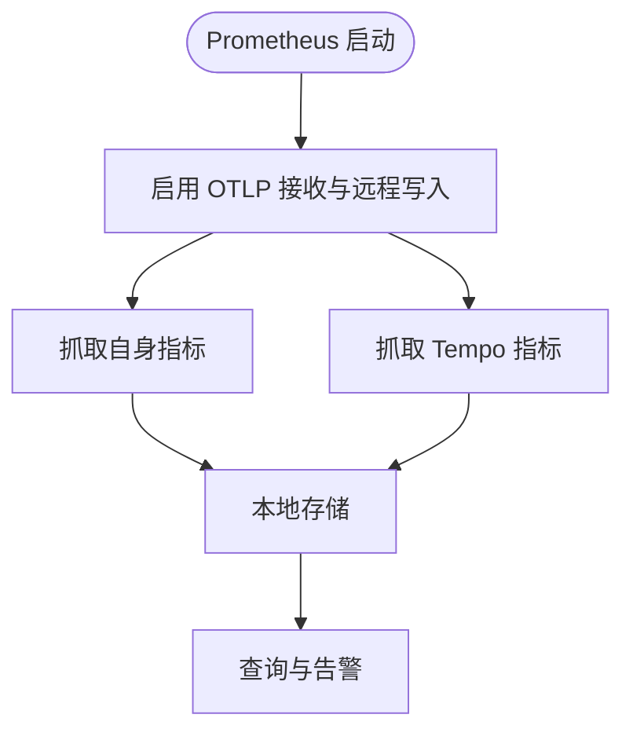
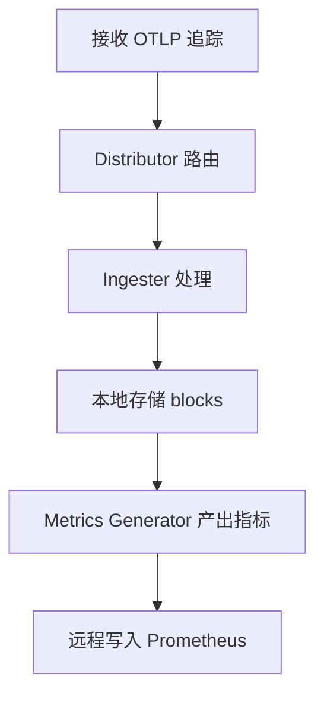
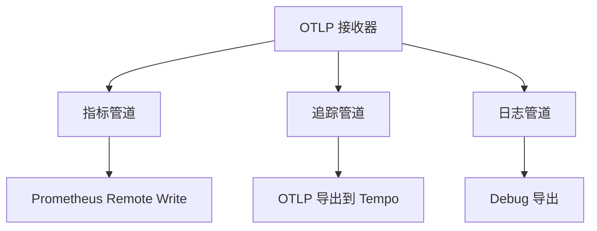
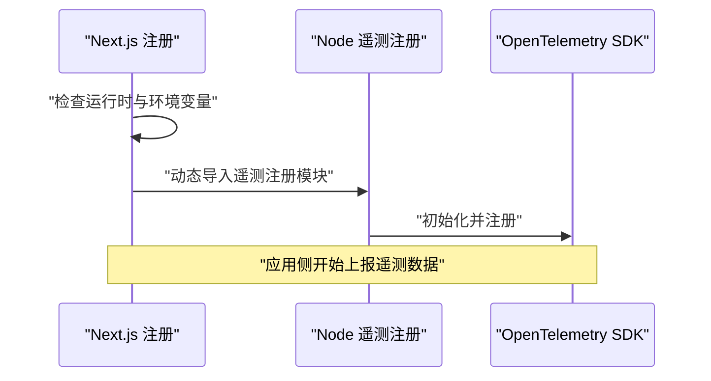
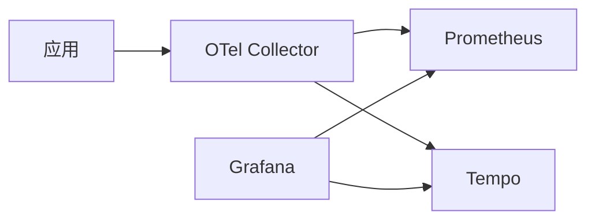

# 监控告警

<cite>
**本文引用的文件**
- [docker-compose.yml（生产环境）](file://docker-compose/production/grafana/docker-compose.yml)
- [Prometheus 配置](file://docker-compose/production/grafana/prometheus/prometheus.yml)
- [OTel 收集器配置](file://docker-compose/production/grafana/otel-collector/collector-config.yaml)
- [Tempo 配置](file://docker-compose/production/grafana/tempo/tempo.yaml)
- [Next.js 注册入口（instrumentation.ts）](file://src/instrumentation.ts)
- [Node 端遥测注册（instrumentation.node.ts）](file://src/instrumentation.node.ts)
</cite>

## 目录

1. [简介](#简介)
2. [项目结构](#项目结构)
3. [核心组件](#核心组件)
4. [架构总览](#架构总览)
5. [详细组件分析](#详细组件分析)
6. [依赖关系分析](#依赖关系分析)
7. [性能考量](#性能考量)
8. [故障排查指南](#故障排查指南)
9. [结论](#结论)
10. [附录](#附录)

## 简介

本文件面向 LobeHub 项目的监控告警体系，围绕基于 Prometheus、Grafana、Tempo 与 OpenTelemetry 的可观测性栈进行系统化说明。内容覆盖应用性能监控（APM）、分布式追踪、日志聚合与分析、告警规则配置、仪表板设计、通知渠道与故障响应流程，并延伸到长期存储、数据分析与容量规划等高级主题。

## 项目结构

LobeHub 在生产环境通过 docker-compose 将监控相关组件编排为独立服务，形成统一的观测平台：

- Prometheus：指标采集与存储，支持 OTLP 接收与远程写入
- Tempo：分布式追踪后端，接收并存储链路数据
- OpenTelemetry Collector：作为 OTLP 入口，汇聚指标与追踪数据并转发至下游
- Grafana：可视化与告警中枢，连接 Prometheus 与 Tempo
- 应用侧：通过 Next.js 与 Node 端遥测注册接入 OpenTelemetry

图表来源

- [docker-compose.yml（生产环境）](file://docker-compose/production/grafana/docker-compose.yml#L138-L149)
- [OTel 收集器配置](file://docker-compose/production/grafana/otel-collector/collector-config.yaml#L14-L45)
- [Prometheus 配置](file://docker-compose/production/grafana/prometheus/prometheus.yml#L1-L12)
- [Tempo 配置](file://docker-compose/production/grafana/tempo/tempo.yaml#L16-L24)

章节来源

- [docker-compose.yml（生产环境）](file://docker-compose/production/grafana/docker-compose.yml#L1-L251)

## 核心组件

- Prometheus
  - 作用：指标采集、存储与查询；启用 OTLP 接收与远程写入以对接 OTel Collector
  - 关键参数：scrape_interval、evaluation_interval、OTLP 接收开关、exemplar 存储
- Tempo
  - 作用：分布式追踪后端，接收 OTLP 追踪数据，生成服务图与跨度指标
  - 关键参数：distributor、ingester、compactor、metrics_generator、storage
- OTel Collector
  - 作用：统一接收 OTLP（指标 / 追踪 / 日志），按管道分发到 Prometheus 或 Tempo
  - 关键参数：otlp 接收器、prometheusremotewrite 导出器、otlp 导出器
- Grafana
  - 作用：仪表板、告警与通知；连接 Prometheus 与 Tempo 数据源
- 应用遥测注册
  - Next.js 注册入口与 Node 端遥测注册，按运行时条件启用 OpenTelemetry

章节来源

- [Prometheus 配置](file://docker-compose/production/grafana/prometheus/prometheus.yml#L1-L12)
- [OTel 收集器配置](file://docker-compose/production/grafana/otel-collector/collector-config.yaml#L1-L46)
- [Tempo 配置](file://docker-compose/production/grafana/tempo/tempo.yaml#L1-L59)
- [Next.js 注册入口（instrumentation.ts）](file://src/instrumentation.ts#L1-L13)
- [Node 端遥测注册（instrumentation.node.ts）](file://src/instrumentation.node.ts#L1-L6)

## 架构总览

下图展示了从应用到遥测收集器再到下游存储与可视化的完整链路：

图表来源

- [docker-compose.yml（生产环境）](file://docker-compose/production/grafana/docker-compose.yml#L138-L149)
- [OTel 收集器配置](file://docker-compose/production/grafana/otel-collector/collector-config.yaml#L35-L45)
- [Prometheus 配置](file://docker-compose/production/grafana/prometheus/prometheus.yml#L1-L12)
- [Tempo 配置](file://docker-compose/production/grafana/tempo/tempo.yaml#L16-L24)

## 详细组件分析

### Prometheus 组件

- 职责
  - 指标采集与存储，支持 OTLP 接收与远程写入
  - 通过 exemplar 存储增强指标关联性
- 关键点
  - 启用 OTLP 接收与远程写入特性
  - 定义对自身与 Tempo 的抓取任务，便于统一观测

图表来源

- [Prometheus 配置](file://docker-compose/production/grafana/prometheus/prometheus.yml#L1-L12)

章节来源

- [Prometheus 配置](file://docker-compose/production/grafana/prometheus/prometheus.yml#L1-L12)

### Tempo 组件

- 职责
  - 接收 OTLP 追踪数据，生成服务图与跨度指标
  - 通过 metrics_generator 输出指标供 Prometheus 抓取
- 关键点
  - 分布式接收器（distributor）配置 gRPC/HTTP 端点
  - 存储使用本地后端，保留策略可按演示目的设置
  - 开启服务图与跨度指标生成，提升可观测性

图表来源

- [Tempo 配置](file://docker-compose/production/grafana/tempo/tempo.yaml#L16-L59)

章节来源

- [Tempo 配置](file://docker-compose/production/grafana/tempo/tempo.yaml#L1-L59)

### OTel Collector 组件

- 职责
  - 作为统一入口，接收 OTLP 指标 / 追踪 / 日志
  - 指标管道：抓取自身指标并通过远程写入发送到 Prometheus
  - 追踪与日志管道：转发到 Tempo 或调试输出
- 关键点
  - gRPC/HTTP 接收端点对外暴露
  - 导出器配置确保与下游组件连通

图表来源

- [OTel 收集器配置](file://docker-compose/production/grafana/otel-collector/collector-config.yaml#L5-L45)

章节来源

- [OTel 收集器配置](file://docker-compose/production/grafana/otel-collector/collector-config.yaml#L1-L46)

### Grafana 组件

- 职责
  - 作为可视化与告警中枢，连接 Prometheus 与 Tempo
  - 提供 TraceQL 编辑器能力，支持链路查询与分析
- 关键点
  - 通过 provision 配置挂载 dashboards 与 datasources
  - 启用 traceqlEditor 特性

章节来源

- [docker-compose.yml（生产环境）](file://docker-compose/production/grafana/docker-compose.yml#L98-L113)

### 应用遥测注册

- Next.js 注册入口
  - 条件启用遥测：仅在生产或显式开启开发模式时加载 Node 端注册
- Node 端遥测注册
  - 引入 @lobechat/observability-otel/node 并传入版本信息完成注册

图表来源

- [Next.js 注册入口（instrumentation.ts）](file://src/instrumentation.ts#L1-L13)
- [Node 端遥测注册（instrumentation.node.ts）](file://src/instrumentation.node.ts#L1-L6)

章节来源

- [Next.js 注册入口（instrumentation.ts）](file://src/instrumentation.ts#L1-L13)
- [Node 端遥测注册（instrumentation.node.ts）](file://src/instrumentation.node.ts#L1-L6)

## 依赖关系分析

- 组件耦合
  - OTel Collector 依赖 Prometheus 与 Tempo 的可达性
  - Grafana 依赖 Prometheus 与 Tempo 的数据可用性
  - 应用侧遥测注册依赖 OTel Collector 的接收端点
- 外部依赖
  - OpenTelemetry 生态工具链
  - Prometheus 与 Grafana 生态生态工具
  - Tempo 与 OpenTelemetry 生态工具

图表来源

- [docker-compose.yml（生产环境）](file://docker-compose/production/grafana/docker-compose.yml#L138-L149)
- [OTel 收集器配置](file://docker-compose/production/grafana/otel-collector/collector-config.yaml#L35-L45)
- [Prometheus 配置](file://docker-compose/production/grafana/prometheus/prometheus.yml#L1-L12)
- [Tempo 配置](file://docker-compose/production/grafana/tempo/tempo.yaml#L16-L24)

## 性能考量

- 指标与追踪采样
  - 合理设置抓取间隔与超时，避免过载
  - 对高基数标签进行限制，降低存储与查询成本
- 存储与保留
  - Prometheus 与 Tempo 的保留策略需结合业务规模与成本目标调整
  - Tempo 的 ingester 切块与 compactor 保留应平衡查询性能与资源占用
- 查询优化
  - 使用 exemplar 与关联查询提升指标与追踪的可定位性
  - Grafana 中合理使用模板变量与查询缓存

## 故障排查指南

- 连通性问题
  - 确认 OTel Collector 的 gRPC/HTTP 端点是否可达
  - 检查 Prometheus 与 Tempo 的健康状态与日志
- 遥测未上报
  - 核对应用侧遥测注册条件与运行时环境变量
  - 验证 OTLP 导出端点与协议配置
- 可视化异常
  - 检查 Grafana 数据源配置与权限
  - 确认 dashboards 与 datasources 的挂载路径与命名

章节来源

- [docker-compose.yml（生产环境）](file://docker-compose/production/grafana/docker-compose.yml#L138-L149)
- [OTel 收集器配置](file://docker-compose/production/grafana/otel-collector/collector-config.yaml#L14-L19)
- [Prometheus 配置](file://docker-compose/production/grafana/prometheus/prometheus.yml#L124-L136)
- [Tempo 配置](file://docker-compose/production/grafana/tempo/tempo.yaml#L16-L24)

## 结论

LobeHub 的监控告警体系以 OpenTelemetry 为核心，结合 Prometheus、Tempo 与 Grafana 实现了指标、追踪与日志的统一观测。通过合理的管道配置与应用侧遥测注册，系统具备完善的 APM 能力与分布式追踪能力。建议在生产环境中进一步完善告警规则、仪表板与通知渠道，并持续优化存储与查询性能以支撑业务增长。

## 附录

- 告警规则配置建议
  - 基础阈值告警：CPU / 内存 / 磁盘 / 网络 / 连接数 / 队列长度
  - 趋势告警：错误率、响应时间、吞吐量同比 / 环比
  - 复合告警：多指标联动、服务间调用失败、异常流量突增
- 仪表板设计建议
  - APM 主面板：请求量、错误率、P50/P90/P99 响应时间、并发数
  - 追踪面板：TraceQL 查询、服务拓扑、热点端点、慢事务
  - 日志面板：结构化日志过滤、关键字检索、日志直方图
- 告警通知渠道
  - Webhook、邮件、IM 机器人、PagerDuty/Sli.do 等
- 故障响应流程
  - 告警触发 → 快速确认 → 根因定位（指标 / 追踪 / 日志）→ 处置与恢复 → 复盘与优化
- 高级功能
  - 长期存储：Prometheus 远端存储、对象存储归档
  - 数据分析：PromQL/TraceQL 查询、机器学习异常检测
  - 容量规划：历史趋势分析、资源预测模型、弹性伸缩策略
