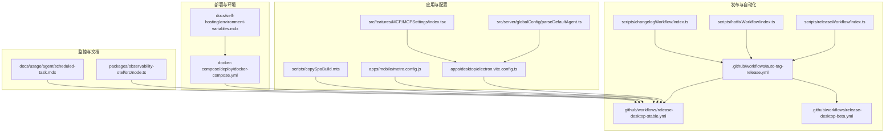
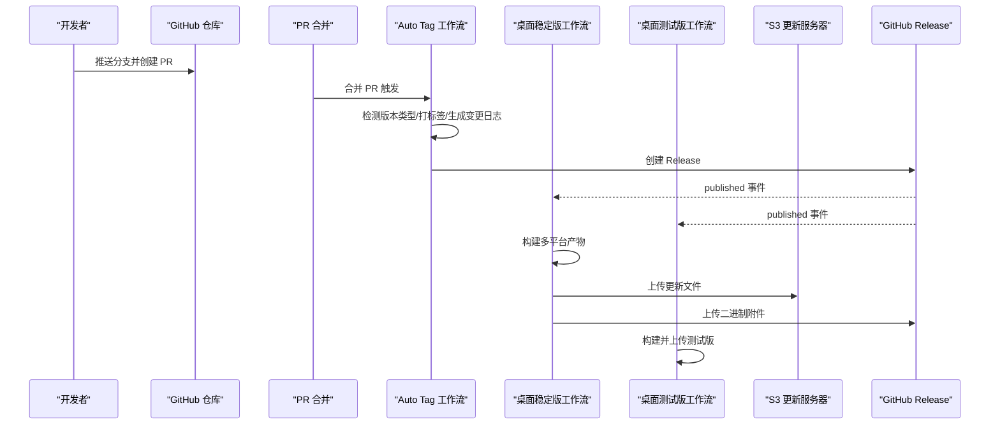
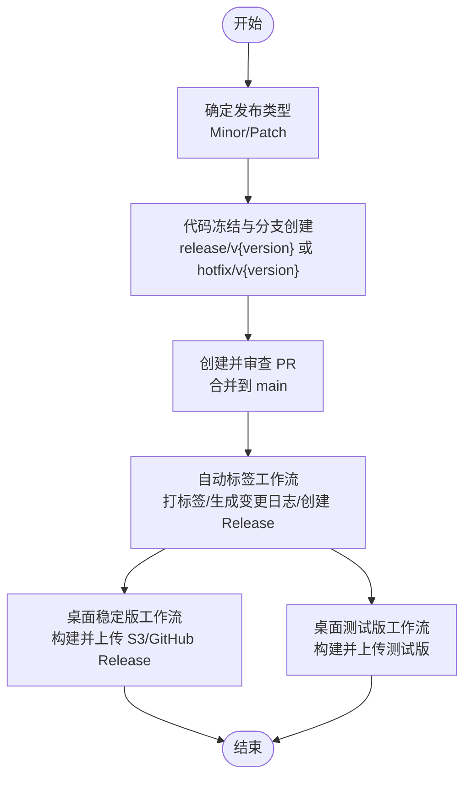
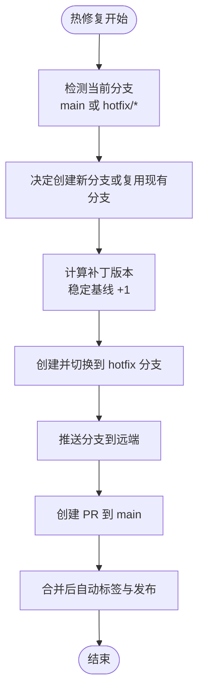
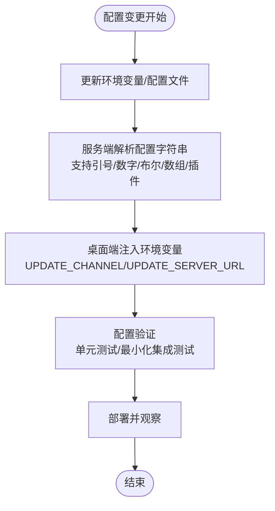
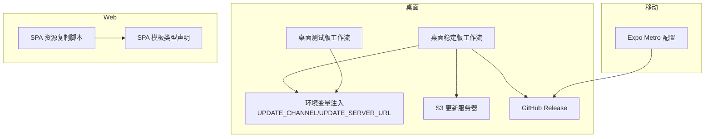
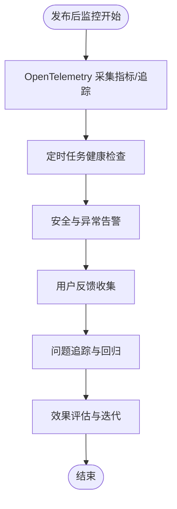
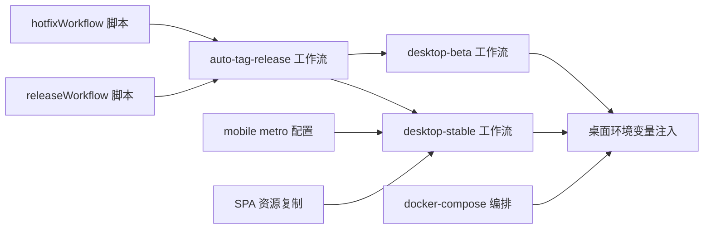

# 应用更新

<cite>
**本文引用的文件**
- [.github/workflows/auto-tag-release.yml](file://.github/workflows/auto-tag-release.yml)
- [.github/workflows/release-desktop-stable.yml](file://.github/workflows/release-desktop-stable.yml)
- [.github/workflows/release-desktop-beta.yml](file://.github/workflows/release-desktop-beta.yml)
- [scripts/releaseWorkflow/index.ts](file://scripts/releaseWorkflow/index.ts)
- [scripts/hotfixWorkflow/index.ts](file://scripts/hotfixWorkflow/index.ts)
- [scripts/changelogWorkflow/index.ts](file://scripts/changelogWorkflow/index.ts)
- [scripts/copySpaBuild.mts](file://scripts/copySpaBuild.mts)
- [apps/desktop/electron.vite.config.ts](file://apps/desktop/electron.vite.config.ts)
- [apps/mobile/metro.config.js](file://apps/mobile/metro.config.js)
- [docker-compose/deploy/docker-compose.yml](file://docker-compose/deploy/docker-compose.yml)
- [docs/self-hosting/environment-variables.mdx](file://docs/self-hosting/environment-variables.mdx)
- [src/server/globalConfig/parseDefaultAgent.ts](file://src/server/globalConfig/parseDefaultAgent.ts)
- [src/features/MCP/MCPSettings/index.tsx](file://src/features/MCP/MCPSettings/index.tsx)
- [src/hooks/usePlatform.ts](file://src/hooks/usePlatform.ts)
- [src/app/spa/[variants]/[[...path]]/spaHtmlTemplates.d.ts](file://src/app/spa/[variants]/[[...path]]/spaHtmlTemplates.d.ts)
- [packages/observability-otel/src/node.ts](file://packages/observability-otel/src/node.ts)
- [docs/usage/agent/scheduled-task.mdx](file://docs/usage/agent/scheduled-task.mdx)
</cite>

## 目录

1. [简介](#简介)
2. [项目结构](#项目结构)
3. [核心组件](#核心组件)
4. [架构总览](#架构总览)
5. [详细组件分析](#详细组件分析)
6. [依赖关系分析](#依赖关系分析)
7. [性能考虑](#性能考虑)
8. [故障排查指南](#故障排查指南)
9. [结论](#结论)
10. [附录](#附录)

## 简介

本文件面向 LobeHub 项目的应用更新与发布管理，系统化梳理版本发布流程（版本规划、代码冻结、测试验证、发布打包、部署上线）、热修复策略（紧急问题处理、快速修复、灰度发布、回滚机制）、配置变更管理（配置项变更、环境变量更新、参数调整、配置验证）、多平台部署（Web 应用部署、桌面应用打包、移动应用发布、跨平台兼容性测试），以及发布监控与验证（发布后监控、用户反馈收集、问题追踪、效果评估）。文档以仓库内现有自动化脚本、工作流与配置为依据，提供可执行的操作指南与可视化图示。

## 项目结构

围绕 “发布与更新” 的关键目录与文件：

- 自动化发布与标签：.github/workflows 下的自动标签与桌面稳定 / 测试版发布工作流
- 发布脚本：scripts/releaseWorkflow 与 scripts/hotfixWorkflow
- 配置与解析：apps/desktop/electron.vite.config.ts、src/server/globalConfig/parseDefaultAgent.ts、src/features/MCP/MCPSettings/index.tsx
- 多平台构建与部署：apps/mobile/metro.config.js、scripts/copySpaBuild.mts、docker-compose/deploy/docker-compose.yml
- 文档与监控：docs/self-hosting/environment-variables.mdx、packages/observability-otel/src/node.ts、docs/usage/agent/scheduled-task.mdx

**图表来源**

- [.github/workflows/auto-tag-release.yml](file://.github/workflows/auto-tag-release.yml#L1-L247)
- [.github/workflows/release-desktop-stable.yml](file://.github/workflows/release-desktop-stable.yml#L1-L370)
- [.github/workflows/release-desktop-beta.yml](file://.github/workflows/release-desktop-beta.yml#L1-L42)
- [scripts/releaseWorkflow/index.ts](file://scripts/releaseWorkflow/index.ts#L162-L205)
- [scripts/hotfixWorkflow/index.ts](file://scripts/hotfixWorkflow/index.ts#L1-L267)
- [scripts/changelogWorkflow/index.ts](file://scripts/changelogWorkflow/index.ts#L1-L11)
- [apps/desktop/electron.vite.config.ts](file://apps/desktop/electron.vite.config.ts#L1-L116)
- [apps/mobile/metro.config.js](file://apps/mobile/metro.config.js#L1-L7)
- [scripts/copySpaBuild.mts](file://scripts/copySpaBuild.mts#L1-L21)
- [docker-compose/deploy/docker-compose.yml](file://docker-compose/deploy/docker-compose.yml#L1-L144)
- [docs/self-hosting/environment-variables.mdx](file://docs/self-hosting/environment-variables.mdx#L1-L95)
- [src/server/globalConfig/parseDefaultAgent.ts](file://src/server/globalConfig/parseDefaultAgent.ts#L1-L47)
- [src/features/MCP/MCPSettings/index.tsx](file://src/features/MCP/MCPSettings/index.tsx#L343-L394)
- [packages/observability-otel/src/node.ts](file://packages/observability-otel/src/node.ts#L1-L20)
- [docs/usage/agent/scheduled-task.mdx](file://docs/usage/agent/scheduled-task.mdx#L194-L213)

**章节来源**

- [.github/workflows/auto-tag-release.yml](file://.github/workflows/auto-tag-release.yml#L1-L247)
- [.github/workflows/release-desktop-stable.yml](file://.github/workflows/release-desktop-stable.yml#L1-L370)
- [.github/workflows/release-desktop-beta.yml](file://.github/workflows/release-desktop-beta.yml#L1-L42)
- [scripts/releaseWorkflow/index.ts](file://scripts/releaseWorkflow/index.ts#L162-L205)
- [scripts/hotfixWorkflow/index.ts](file://scripts/hotfixWorkflow/index.ts#L1-L267)
- [scripts/changelogWorkflow/index.ts](file://scripts/changelogWorkflow/index.ts#L1-L11)
- [apps/desktop/electron.vite.config.ts](file://apps/desktop/electron.vite.config.ts#L1-L116)
- [apps/mobile/metro.config.js](file://apps/mobile/metro.config.js#L1-L7)
- [scripts/copySpaBuild.mts](file://scripts/copySpaBuild.mts#L1-L21)
- [docker-compose/deploy/docker-compose.yml](file://docker-compose/deploy/docker-compose.yml#L1-L144)
- [docs/self-hosting/environment-variables.mdx](file://docs/self-hosting/environment-variables.mdx#L1-L95)
- [src/server/globalConfig/parseDefaultAgent.ts](file://src/server/globalConfig/parseDefaultAgent.ts#L1-L47)
- [src/features/MCP/MCPSettings/index.tsx](file://src/features/MCP/MCPSettings/index.tsx#L343-L394)
- [packages/observability-otel/src/node.ts](file://packages/observability-otel/src/node.ts#L1-L20)
- [docs/usage/agent/scheduled-task.mdx](file://docs/usage/agent/scheduled-task.mdx#L194-L213)

## 核心组件

- 自动标签与发布工作流：在合并 PR 后自动检测版本类型、打标签、生成变更日志、创建 GitHub Release，并同步回 canary 分支
- 桌面应用发布工作流：按稳定 / 测试通道分别构建多平台产物，支持手动触发与 GitHub Release 触发，可上传至 S3 更新服务器
- 发布与热修复脚本：提供交互式创建发布分支、PR、热修复分支与版本计算的本地脚本
- 配置解析与设置：桌面端通过环境变量注入更新通道与服务器地址；服务端支持解析复杂键值配置；MCP 设置支持环境变量编辑
- 多平台构建与部署：移动端 Metro 配置；SPA 资源复制脚本；Docker Compose 部署编排
- 监控与文档：OpenTelemetry 节点侧观测；定时任务监控最佳实践

**章节来源**

- [.github/workflows/auto-tag-release.yml](file://.github/workflows/auto-tag-release.yml#L1-L247)
- [.github/workflows/release-desktop-stable.yml](file://.github/workflows/release-desktop-stable.yml#L1-L370)
- [scripts/releaseWorkflow/index.ts](file://scripts/releaseWorkflow/index.ts#L162-L205)
- [scripts/hotfixWorkflow/index.ts](file://scripts/hotfixWorkflow/index.ts#L1-L267)
- [apps/desktop/electron.vite.config.ts](file://apps/desktop/electron.vite.config.ts#L1-L116)
- [src/server/globalConfig/parseDefaultAgent.ts](file://src/server/globalConfig/parseDefaultAgent.ts#L1-L47)
- [src/features/MCP/MCPSettings/index.tsx](file://src/features/MCP/MCPSettings/index.tsx#L343-L394)
- [apps/mobile/metro.config.js](file://apps/mobile/metro.config.js#L1-L7)
- [scripts/copySpaBuild.mts](file://scripts/copySpaBuild.mts#L1-L21)
- [docker-compose/deploy/docker-compose.yml](file://docker-compose/deploy/docker-compose.yml#L1-L144)
- [packages/observability-otel/src/node.ts](file://packages/observability-otel/src/node.ts#L1-L20)
- [docs/usage/agent/scheduled-task.mdx](file://docs/usage/agent/scheduled-task.mdx#L194-L213)

## 架构总览

下图展示从代码合并到多平台发布的整体流程，包括自动标签、桌面稳定 / 测试版构建、S3 更新服务器与 GitHub Release 的协同。

**图表来源**

- [.github/workflows/auto-tag-release.yml](file://.github/workflows/auto-tag-release.yml#L1-L247)
- [.github/workflows/release-desktop-stable.yml](file://.github/workflows/release-desktop-stable.yml#L1-L370)
- [.github/workflows/release-desktop-beta.yml](file://.github/workflows/release-desktop-beta.yml#L1-L42)

## 详细组件分析

### 版本发布流程（版本规划 → 代码冻结 → 测试验证 → 发布打包 → 部署上线）

- 版本规划与分支策略
  - 主开发分支为 canary，日常开发在此分支进行；发布时将 canary 合并入 main
  - 两种发布类型：Minor（约每四周一次）与 Patch（每周或按需，含热修复、模型 / 数据库迁移）
- 代码冻结与 PR 规范
  - Minor 发布：从 canary 创建 release/v {version} 分支，PR 标题格式为 “🚀 release: v {x.y.0}”
  - Patch 发布：优先匹配分支名（hotfix/\* 或 release/\*），其次匹配标题前缀（feat/fix/hotfix/build/style/refactor 等）
- 测试验证
  - 合并前的 PR 审查与自动化检查（未在本文档中展开具体步骤）
- 发布打包与部署
  - 自动标签：在 PR 合并后自动打标签、生成变更日志、创建 GitHub Release，并将 main 同步回 canary
  - 桌面稳定版：按平台矩阵构建，支持手动触发与 GitHub Release 触发；可上传至 S3 更新服务器供客户端检查更新
  - 桌面测试版：响应带预发布标识的 Release（如 v2.0.0-beta.1）

**图表来源**

- [.github/workflows/auto-tag-release.yml](file://.github/workflows/auto-tag-release.yml#L1-L247)
- [.github/workflows/release-desktop-stable.yml](file://.github/workflows/release-desktop-stable.yml#L1-L370)
- [.github/workflows/release-desktop-beta.yml](file://.github/workflows/release-desktop-beta.yml#L1-L42)
- [scripts/releaseWorkflow/index.ts](file://scripts/releaseWorkflow/index.ts#L162-L205)
- [scripts/hotfixWorkflow/index.ts](file://scripts/hotfixWorkflow/index.ts#L1-L267)

**章节来源**

- [.github/workflows/auto-tag-release.yml](file://.github/workflows/auto-tag-release.yml#L1-L247)
- [.github/workflows/release-desktop-stable.yml](file://.github/workflows/release-desktop-stable.yml#L1-L370)
- [.github/workflows/release-desktop-beta.yml](file://.github/workflows/release-desktop-beta.yml#L1-L42)
- [scripts/releaseWorkflow/index.ts](file://scripts/releaseWorkflow/index.ts#L162-L205)
- [scripts/hotfixWorkflow/index.ts](file://scripts/hotfixWorkflow/index.ts#L1-L267)

### 热修复策略（紧急问题处理、快速修复、灰度发布、回滚机制）

- 快速修复流程
  - 支持在 main 或现有 hotfix 分支上启动热修复：自动计算补丁版本（若当前为预发布则转为稳定补丁），创建临时分支，推送并提交 PR
  - 若在 hotfix 分支上运行，则直接复用分支版本并推送 PR
- 灰度发布与回滚
  - 桌面稳定版工作流默认全量发布；可通过手动触发参数控制构建范围
  - 回滚：可重新创建更低版本的 Release 并触发相应工作流；S3 与 GitHub Release 可承载历史版本
- 交互式确认
  - 脚本在关键步骤进行确认提示，避免误操作

**图表来源**

- [scripts/hotfixWorkflow/index.ts](file://scripts/hotfixWorkflow/index.ts#L1-L267)
- [.github/workflows/auto-tag-release.yml](file://.github/workflows/auto-tag-release.yml#L1-L247)
- [.github/workflows/release-desktop-stable.yml](file://.github/workflows/release-desktop-stable.yml#L1-L370)

**章节来源**

- [scripts/hotfixWorkflow/index.ts](file://scripts/hotfixWorkflow/index.ts#L1-L267)
- [.github/workflows/auto-tag-release.yml](file://.github/workflows/auto-tag-release.yml#L1-L247)
- [.github/workflows/release-desktop-stable.yml](file://.github/workflows/release-desktop-stable.yml#L1-L370)

### 配置变更管理（配置项变更、环境变量更新、参数调整、配置验证）

- 环境变量与配置解析
  - 桌面端：UPDATE_CHANNEL 与 UPDATE_SERVER_URL 通过环境变量注入，构建时生效
  - 服务端：支持解析包含引号、数字、布尔、数组与插件列表的复杂键值字符串
  - MCP 设置：支持通过表单编辑环境变量键值对，保存后生效
- 自托管与覆盖 NEXT_PUBLIC
  - 通过 Docker 构建自定义镜像并覆盖 NEXT_PUBLIC 变量，无需完全 fork 仓库
- 配置验证建议
  - 在 PR 中明确列出受影响模块与环境变量
  - 本地 / CI 中增加最小化配置校验步骤（如解析器单元测试）

**图表来源**

- [apps/desktop/electron.vite.config.ts](file://apps/desktop/electron.vite.config.ts#L1-L116)
- [src/server/globalConfig/parseDefaultAgent.ts](file://src/server/globalConfig/parseDefaultAgent.ts#L1-L47)
- [src/features/MCP/MCPSettings/index.tsx](file://src/features/MCP/MCPSettings/index.tsx#L343-L394)
- [docs/self-hosting/environment-variables.mdx](file://docs/self-hosting/environment-variables.mdx#L1-L95)

**章节来源**

- [apps/desktop/electron.vite.config.ts](file://apps/desktop/electron.vite.config.ts#L1-L116)
- [src/server/globalConfig/parseDefaultAgent.ts](file://src/server/globalConfig/parseDefaultAgent.ts#L1-L47)
- [src/features/MCP/MCPSettings/index.tsx](file://src/features/MCP/MCPSettings/index.tsx#L343-L394)
- [docs/self-hosting/environment-variables.mdx](file://docs/self-hosting/environment-variables.mdx#L1-L95)

### 多平台部署（Web 应用部署、桌面应用打包、移动应用发布、跨平台兼容性测试）

- 桌面应用打包
  - 稳定版：按 macOS（ARM64/x64）、Windows、Linux 矩阵构建，支持上传 S3 更新服务器与 GitHub Release
  - 测试版：响应预发布 Release，构建测试通道产物
  - 构建参数：支持手动触发选择平台与跳过上传
- 移动应用发布
  - Expo Metro 配置已启用 NativeWind，构建与发布遵循 Expo 工作流
- Web SPA 资源复制
  - 构建完成后将桌面 / 移动资源复制到公共目录，便于统一分发
- 跨平台兼容性测试
  - 平台检测：usePlatform 提供浏览器 / 平台判断，辅助前端适配
  - SPA 模板：不同变体共享模板类型声明，确保构建一致性

**图表来源**

- [.github/workflows/release-desktop-stable.yml](file://.github/workflows/release-desktop-stable.yml#L1-L370)
- [.github/workflows/release-desktop-beta.yml](file://.github/workflows/release-desktop-beta.yml#L1-L42)
- [apps/desktop/electron.vite.config.ts](file://apps/desktop/electron.vite.config.ts#L1-L116)
- [apps/mobile/metro.config.js](file://apps/mobile/metro.config.js#L1-L7)
- [scripts/copySpaBuild.mts](file://scripts/copySpaBuild.mts#L1-L21)
- [src/app/spa/\[variants\]/\[\[...path\]\]/spaHtmlTemplates.d.ts](file://src/app/spa/[variants]/[[...path]]/spaHtmlTemplates.d.ts#L1-L2)
- [src/hooks/usePlatform.ts](file://src/hooks/usePlatform.ts#L1-L43)

**章节来源**

- [.github/workflows/release-desktop-stable.yml](file://.github/workflows/release-desktop-stable.yml#L1-L370)
- [.github/workflows/release-desktop-beta.yml](file://.github/workflows/release-desktop-beta.yml#L1-L42)
- [apps/desktop/electron.vite.config.ts](file://apps/desktop/electron.vite.config.ts#L1-L116)
- [apps/mobile/metro.config.js](file://apps/mobile/metro.config.js#L1-L7)
- [scripts/copySpaBuild.mts](file://scripts/copySpaBuild.mts#L1-L21)
- [src/app/spa/\[variants\]/\[\[...path\]\]/spaHtmlTemplates.d.ts](file://src/app/spa/[variants]/[[...path]]/spaHtmlTemplates.d.ts#L1-L2)
- [src/hooks/usePlatform.ts](file://src/hooks/usePlatform.ts#L1-L43)

### 发布监控与验证（发布后监控、用户反馈收集、问题追踪、效果评估）

- 发布后监控
  - OpenTelemetry 节点侧观测：采集指标与追踪，便于定位性能与错误
  - 定时任务监控：按小时健康检查、安全告警、价格跟踪等
- 用户反馈与问题追踪
  - 通过 GitHub Issues/PR 追踪问题；结合变更日志与发布说明
- 效果评估
  - 结合业务指标与用户行为数据，评估功能变更影响

**图表来源**

- [packages/observability-otel/src/node.ts](file://packages/observability-otel/src/node.ts#L1-L20)
- [docs/usage/agent/scheduled-task.mdx](file://docs/usage/agent/scheduled-task.mdx#L194-L213)

**章节来源**

- [packages/observability-otel/src/node.ts](file://packages/observability-otel/src/node.ts#L1-L20)
- [docs/usage/agent/scheduled-task.mdx](file://docs/usage/agent/scheduled-task.mdx#L194-L213)

## 依赖关系分析

- 工作流耦合
  - auto-tag-release.yml 是发布链路中枢，触发 release-desktop-stable.yml 与 release-desktop-beta.yml
- 脚本与工作流
  - releaseWorkflow 与 hotfixWorkflow 通过命令行与 gh CLI 协作，最终进入自动标签工作流
- 构建与部署
  - 桌面端通过 electron-vite 注入环境变量；移动端通过 Metro 配置；SPA 资源复制脚本统一静态资源
- 配置与环境
  - docker-compose 编排服务依赖环境变量；自托管文档提供覆盖 NEXT_PUBLIC 的方法

**图表来源**

- [scripts/releaseWorkflow/index.ts](file://scripts/releaseWorkflow/index.ts#L162-L205)
- [scripts/hotfixWorkflow/index.ts](file://scripts/hotfixWorkflow/index.ts#L1-L267)
- [.github/workflows/auto-tag-release.yml](file://.github/workflows/auto-tag-release.yml#L1-L247)
- [.github/workflows/release-desktop-stable.yml](file://.github/workflows/release-desktop-stable.yml#L1-L370)
- [.github/workflows/release-desktop-beta.yml](file://.github/workflows/release-desktop-beta.yml#L1-L42)
- [apps/desktop/electron.vite.config.ts](file://apps/desktop/electron.vite.config.ts#L1-L116)
- [apps/mobile/metro.config.js](file://apps/mobile/metro.config.js#L1-L7)
- [scripts/copySpaBuild.mts](file://scripts/copySpaBuild.mts#L1-L21)
- [docker-compose/deploy/docker-compose.yml](file://docker-compose/deploy/docker-compose.yml#L1-L144)

**章节来源**

- [scripts/releaseWorkflow/index.ts](file://scripts/releaseWorkflow/index.ts#L162-L205)
- [scripts/hotfixWorkflow/index.ts](file://scripts/hotfixWorkflow/index.ts#L1-L267)
- [.github/workflows/auto-tag-release.yml](file://.github/workflows/auto-tag-release.yml#L1-L247)
- [.github/workflows/release-desktop-stable.yml](file://.github/workflows/release-desktop-stable.yml#L1-L370)
- [.github/workflows/release-desktop-beta.yml](file://.github/workflows/release-desktop-beta.yml#L1-L42)
- [apps/desktop/electron.vite.config.ts](file://apps/desktop/electron.vite.config.ts#L1-L116)
- [apps/mobile/metro.config.js](file://apps/mobile/metro.config.js#L1-L7)
- [scripts/copySpaBuild.mts](file://scripts/copySpaBuild.mts#L1-L21)
- [docker-compose/deploy/docker-compose.yml](file://docker-compose/deploy/docker-compose.yml#L1-L144)

## 性能考虑

- 构建矩阵与缓存
  - 桌面稳定版工作流按平台矩阵构建，合理利用缓存与并行能力，减少重复下载依赖的时间
- 资源复制与分发
  - SPA 资源复制脚本避免重复构建，提升静态资源分发效率
- 观测与告警
  - OpenTelemetry 采集有助于识别性能瓶颈与异常，指导优化方向

\[本节为通用建议，不直接分析具体文件]

## 故障排查指南

- 自动标签未触发
  - 检查 PR 标题前缀或分支名是否符合触发规则；确认 PR 已被合并
- 桌面构建失败
  - macOS 清理构建缓存；检查 Apple 证书与签名环境变量；核对 UPDATE_SERVER_URL 与项目 ID
- 热修复脚本报错
  - 确认当前分支为 main 或 hotfix/\*；确保 gh CLI 已登录；查看脚本输出中的提示信息
- 配置解析异常
  - 检查服务端配置字符串格式；确保引号、逗号、空格与特殊字符处理正确
- Docker 编排问题
  - 检查 .env 文件与环境变量；确认服务健康状态与网络连接

**章节来源**

- [.github/workflows/auto-tag-release.yml](file://.github/workflows/auto-tag-release.yml#L1-L247)
- [.github/workflows/release-desktop-stable.yml](file://.github/workflows/release-desktop-stable.yml#L1-L370)
- [scripts/hotfixWorkflow/index.ts](file://scripts/hotfixWorkflow/index.ts#L1-L267)
- [src/server/globalConfig/parseDefaultAgent.ts](file://src/server/globalConfig/parseDefaultAgent.ts#L1-L47)
- [docker-compose/deploy/docker-compose.yml](file://docker-compose/deploy/docker-compose.yml#L1-L144)

## 结论

LobeHub 的发布体系以 “canary → main → 自动标签 → 多平台构建” 为核心路径，辅以热修复脚本、桌面稳定 / 测试版工作流、配置解析与多平台构建工具链，形成从版本规划到部署上线的闭环。配合 OpenTelemetry 与定时任务监控，可实现发布后的可观测与持续改进。建议在每次发布前严格执行配置验证与最小化测试，确保变更可控、可回滚。

\[本节为总结性内容，不直接分析具体文件]

## 附录

- 变更日志生成
  - 通过 changelogWorkflow 脚本生成静态变更日志，便于发布说明与审计
- 自托管与覆盖 NEXT_PUBLIC
  - 通过 GitHub Actions 构建自定义镜像并覆盖 NEXT_PUBLIC 变量，满足私有化部署需求

**章节来源**

- [scripts/changelogWorkflow/index.ts](file://scripts/changelogWorkflow/index.ts#L1-L11)
- [docs/self-hosting/environment-variables.mdx](file://docs/self-hosting/environment-variables.mdx#L1-L95)
