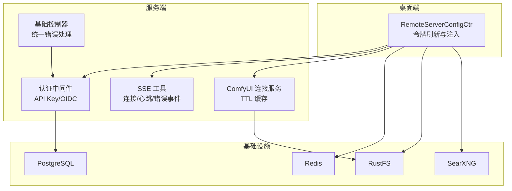
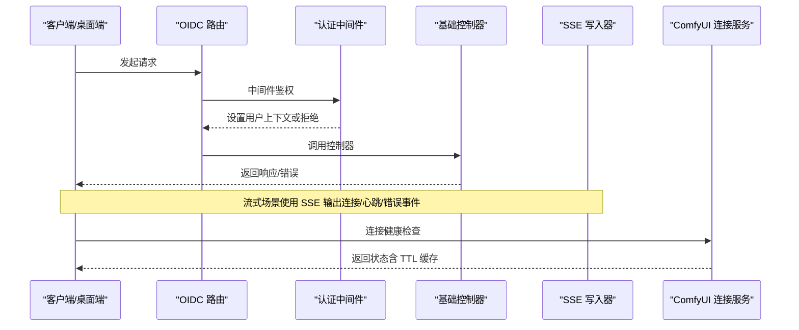
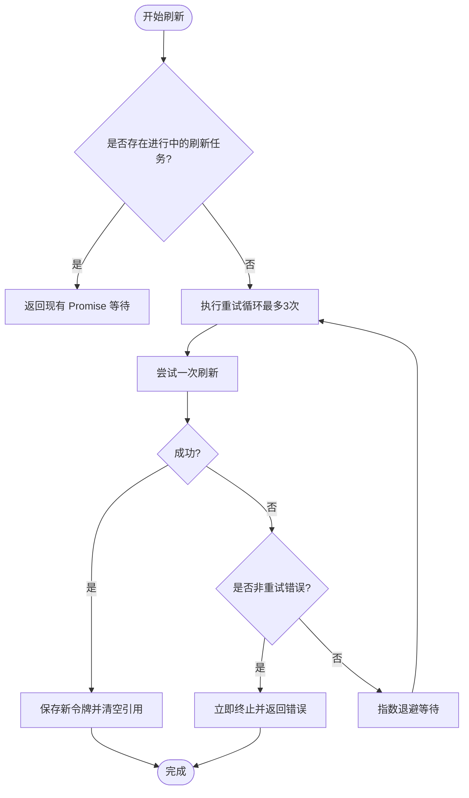
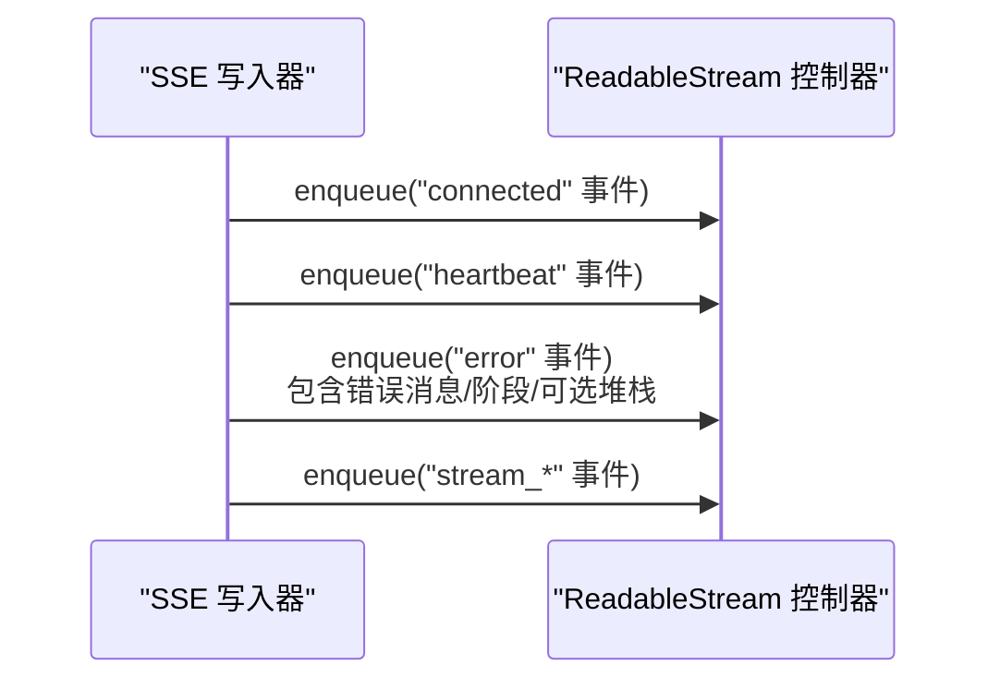
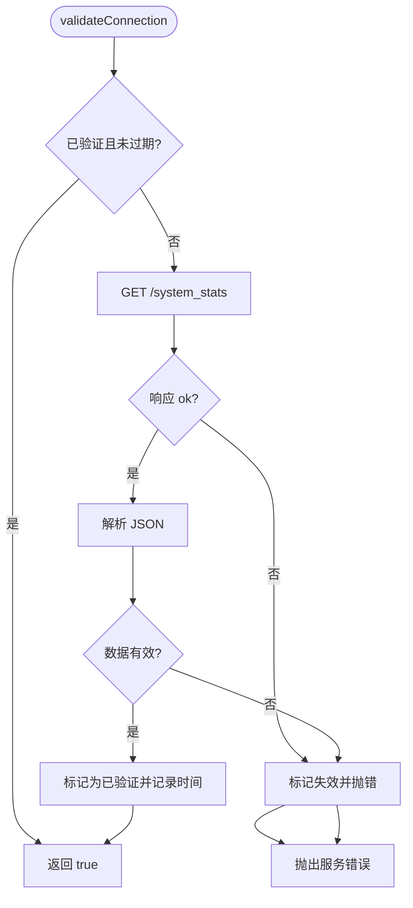
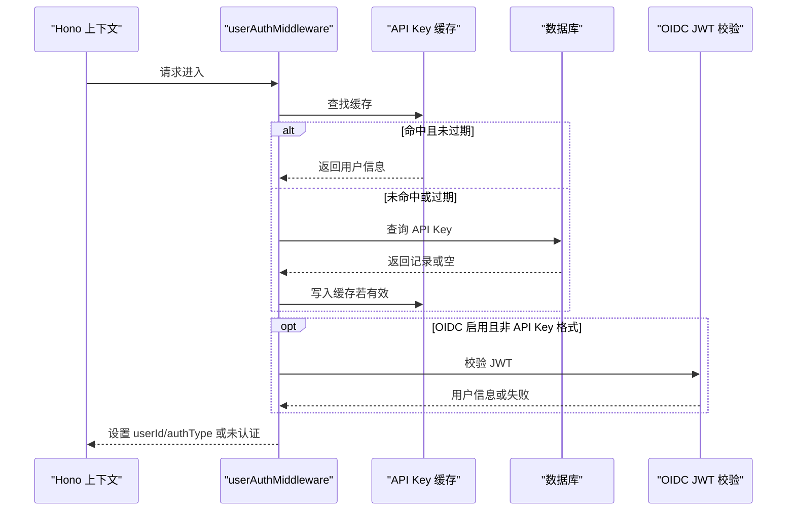
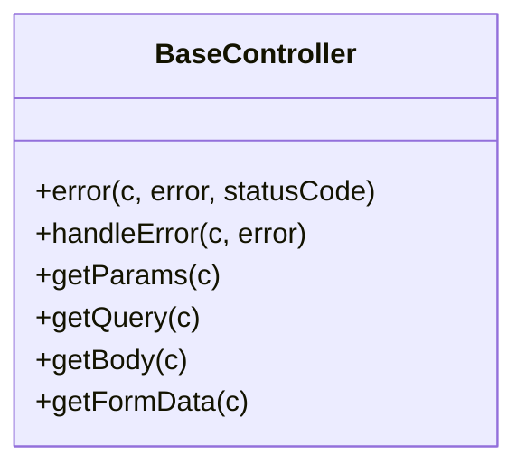
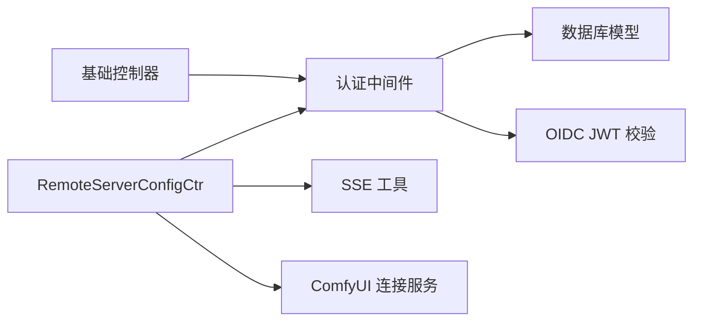

# 故障处理

<cite>
**本文引用的文件**
- [apps/desktop/src/main/controllers/RemoteServerConfigCtr.ts](file://apps/desktop/src/main/controllers/RemoteServerConfigCtr.ts)
- [packages/utils/src/server/sse.ts](file://packages/utils/src/server/sse.ts)
- [packages/utils/src/server/__tests__/sse.test.ts](file://packages/utils/src/server/__tests__/sse.test.ts)
- [src/server/services/comfyui/core/comfyUIConnectionService.ts](file://src/server/services/comfyui/core/comfyUIConnectionService.ts)
- [src/server/services/comfyui/__tests__/core/comfyUIConnectionService.test.ts](file://src/server/services/comfyui/__tests__/core/comfyUIConnectionService.test.ts)
- [packages/openapi/src/middleware/auth.ts](file://packages/openapi/src/middleware/auth.ts)
- [packages/observability-otel/src/node.ts](file://packages/observability-otel/src/node.ts)
- [docker-compose/dev/docker-compose.yml](file://docker-compose/dev/docker-compose.yml)
- [scripts/_shared/checkDeprecatedAuth.js](file://scripts/_shared/checkDeprecatedAuth.js)
- [packages/model-runtime/src/utils/asyncifyPolling.ts](file://packages/model-runtime/src/utils/asyncifyPolling.ts)
- [packages/model-runtime/src/utils/googleErrorParser.ts](file://packages/model-runtime/src/utils/googleErrorParser.ts)
- [packages/model-runtime/src/utils/googleErrorParser.test.ts](file://packages/model-runtime/src/utils/googleErrorParser.test.ts)
- [src/server/services/riskControl/routerAlertNotification.ts](file://src/server/services/riskControl/routerAlertNotification.ts)
- [src/app/[variants]/(auth)/oauth/callback/error/page.tsx](file://src/app/[variants]/(auth)/oauth/callback/error/page.tsx)
- [src/server/globalConfig/parseDefaultAgent.ts](file://src/server/globalConfig/parseDefaultAgent.ts)
- [src/server/globalConfig/parseDefaultAgent.test.ts](file://src/server/globalConfig/parseDefaultAgent.test.ts)
- [plugins/vite/envRestartKeys.ts](file://plugins/vite/envRestartKeys.ts)
- [packages/utils/src/toolManifest.ts](file://packages/utils/src/toolManifest.ts)
- [src/app/(backend)/oidc/[...oidc]/route.ts](file://src/app/(backend)/oidc/[...oidc]/route.ts)
- [packages/openapi/src/common/base.controller.ts](file://packages/openapi/src/common/base.controller.ts)
</cite>

## 目录
1. [简介](#简介)
2. [项目结构](#项目结构)
3. [核心组件](#核心组件)
4. [架构总览](#架构总览)
5. [详细组件分析](#详细组件分析)
6. [依赖关系分析](#依赖关系分析)
7. [性能考量](#性能考量)
8. [故障排查指南](#故障排查指南)
9. [结论](#结论)
10. [附录](#附录)

## 简介
本文件面向 LobeHub 项目的故障处理与运维保障，系统化梳理问题诊断方法（日志分析、错误追踪、性能分析、依赖检查）、常见问题处理流程（数据库连接失败、API 调用异常、认证问题、插件加载失败）、根因分析流程（问题隔离、影响范围评估、根本原因查找、临时方案制定）、应急响应机制（故障分级、响应时间、责任分工、沟通协调）以及故障预防措施（监控预警、容量规划、冗余设计、演练测试）。内容基于仓库中的真实实现与测试用例进行提炼，确保可操作、可落地。

## 项目结构
从故障处理视角，以下模块与路径是关键：
- 桌面端远程服务器配置与令牌刷新：负责认证令牌获取、刷新与注入，具备重试与非重试错误分类能力
- 服务端 SSE 工具与错误事件：统一输出连接、心跳、错误等事件，便于前端流式消费与问题定位
- ComfyUI 连接状态管理：带 TTL 的连接验证缓存，支持快速判断与失效重校验
- 认证中间件：支持 API Key 与 OIDC 双通道认证，并内置缓存与清理策略
- 观测性（OTEL）：自动采集链路与指标，支持调试级别控制
- 开发环境编排：PostgreSQL、Redis、RustFS、SearXNG 等依赖容器健康检查
- 配置解析与环境变量：默认代理配置解析、环境变量变更检测与重启
- 插件清单与工具清单：插件加载失败时的格式校验与错误抛出
- OIDC 路由与控制器：统一错误处理与响应封装

**图表来源**
- [apps/desktop/src/main/controllers/RemoteServerConfigCtr.ts](file://apps/desktop/src/main/controllers/RemoteServerConfigCtr.ts#L355-L422)
- [packages/utils/src/server/sse.ts](file://packages/utils/src/server/sse.ts#L52-L122)
- [src/server/services/comfyui/core/comfyUIConnectionService.ts](file://src/server/services/comfyui/core/comfyUIConnectionService.ts#L58-L115)
- [packages/openapi/src/middleware/auth.ts](file://packages/openapi/src/middleware/auth.ts#L49-L206)
- [packages/openapi/src/common/base.controller.ts](file://packages/openapi/src/common/base.controller.ts#L45-L107)
- [docker-compose/dev/docker-compose.yml](file://docker-compose/dev/docker-compose.yml#L17-L72)

**章节来源**
- [apps/desktop/src/main/controllers/RemoteServerConfigCtr.ts](file://apps/desktop/src/main/controllers/RemoteServerConfigCtr.ts#L1-L580)
- [packages/utils/src/server/sse.ts](file://packages/utils/src/server/sse.ts#L1-L152)
- [src/server/services/comfyui/core/comfyUIConnectionService.ts](file://src/server/services/comfyui/core/comfyUIConnectionService.ts#L1-L137)
- [packages/openapi/src/middleware/auth.ts](file://packages/openapi/src/middleware/auth.ts#L1-L222)
- [packages/openapi/src/common/base.controller.ts](file://packages/openapi/src/common/base.controller.ts#L1-L146)
- [docker-compose/dev/docker-compose.yml](file://docker-compose/dev/docker-compose.yml#L1-L123)

## 核心组件
- 令牌刷新与注入（桌面端）
  - 支持并发去重、指数退避重试、非重试错误判定、安全存储与解密、会话注入
- SSE 工具
  - 统一格式化事件、连接、心跳、错误、流事件；提供标准 SSE 头部
- ComfyUI 连接服务
  - TTL 缓存连接状态，避免频繁探测；失败时失效并抛出可识别错误
- 认证中间件
  - API Key 缓存与过期清理；OIDC JWT 校验；按需要求认证
- 基础控制器
  - 统一错误响应与业务异常映射
- 观测性（OTEL）
  - 自动化链路与指标导出，支持调试日志级别
- 开发环境编排
  - 容器健康检查与依赖可用性保障

**章节来源**
- [apps/desktop/src/main/controllers/RemoteServerConfigCtr.ts](file://apps/desktop/src/main/controllers/RemoteServerConfigCtr.ts#L355-L422)
- [packages/utils/src/server/sse.ts](file://packages/utils/src/server/sse.ts#L52-L122)
- [src/server/services/comfyui/core/comfyUIConnectionService.ts](file://src/server/services/comfyui/core/comfyUIConnectionService.ts#L58-L115)
- [packages/openapi/src/middleware/auth.ts](file://packages/openapi/src/middleware/auth.ts#L49-L206)
- [packages/openapi/src/common/base.controller.ts](file://packages/openapi/src/common/base.controller.ts#L45-L107)
- [packages/observability-otel/src/node.ts](file://packages/observability-otel/src/node.ts#L94-L141)
- [docker-compose/dev/docker-compose.yml](file://docker-compose/dev/docker-compose.yml#L27-L70)

## 架构总览
下图展示故障处理相关的关键交互：桌面端通过认证中间件访问后端，SSE 提供事件通道，ComfyUI 连接服务提供健康检查与状态缓存，OIDC 路由与控制器统一错误处理。

**图表来源**
- [src/app/(backend)/oidc/[...oidc]/route.ts](file://src/app/(backend)/oidc/[...oidc]/route.ts#L48-L97)
- [packages/openapi/src/middleware/auth.ts](file://packages/openapi/src/middleware/auth.ts#L49-L206)
- [packages/openapi/src/common/base.controller.ts](file://packages/openapi/src/common/base.controller.ts#L45-L107)
- [packages/utils/src/server/sse.ts](file://packages/utils/src/server/sse.ts#L52-L122)
- [src/server/services/comfyui/core/comfyUIConnectionService.ts](file://src/server/services/comfyui/core/comfyUIConnectionService.ts#L58-L115)

## 详细组件分析

### 令牌刷新与注入（桌面端）
- 并发保护：已存在刷新任务时直接复用并等待结果，避免重复请求
- 重试策略：指数退避（1s、2s、4s），最大重试 3 次；对非重试错误（如无效授权码、客户端配置错误、缺少令牌）立即终止
- 错误分类：区分 OIDC 错误码与确定性失败（如未配置远程服务器、无刷新令牌），用于指导是否重试
- 存储与解密：优先使用平台安全存储加密保存；不支持时降级记录并告警
- 会话注入：在指定分区注入认证头，便于订阅页面等场景自动携带令牌

**图表来源**
- [apps/desktop/src/main/controllers/RemoteServerConfigCtr.ts](file://apps/desktop/src/main/controllers/RemoteServerConfigCtr.ts#L355-L422)

**章节来源**
- [apps/desktop/src/main/controllers/RemoteServerConfigCtr.ts](file://apps/desktop/src/main/controllers/RemoteServerConfigCtr.ts#L18-L34)
- [apps/desktop/src/main/controllers/RemoteServerConfigCtr.ts](file://apps/desktop/src/main/controllers/RemoteServerConfigCtr.ts#L355-L422)
- [apps/desktop/src/main/controllers/RemoteServerConfigCtr.ts](file://apps/desktop/src/main/controllers/RemoteServerConfigCtr.ts#L428-L495)

### SSE 事件写入与错误格式化
- 事件类型：连接、心跳、错误、流事件等
- 错误事件字段：包含错误消息、阶段（phase，默认 unknown）、时间戳、可选堆栈
- 头部设置：标准 SSE 头部，支持跨域与禁用缓冲
- 单元测试覆盖：错误对象、字符串错误、时间戳缺失、阶段缺失等边界场景

**图表来源**
- [packages/utils/src/server/sse.ts](file://packages/utils/src/server/sse.ts#L52-L122)

**章节来源**
- [packages/utils/src/server/sse.ts](file://packages/utils/src/server/sse.ts#L52-L122)
- [packages/utils/src/server/__tests__/sse.test.ts](file://packages/utils/src/server/__tests__/sse.test.ts#L151-L224)

### ComfyUI 连接状态管理
- TTL 缓存：5 分钟有效；有效期内复用结果，避免频繁请求
- 失效策略：任何错误都会使连接状态失效，强制下次重新校验
- 健康检查：调用 system_stats 轻量接口，校验响应体有效性
- 状态查询：返回是否已验证、最后验证时间、剩余有效期

**图表来源**
- [src/server/services/comfyui/core/comfyUIConnectionService.ts](file://src/server/services/comfyui/core/comfyUIConnectionService.ts#L58-L115)

**章节来源**
- [src/server/services/comfyui/core/comfyUIConnectionService.ts](file://src/server/services/comfyui/core/comfyUIConnectionService.ts#L13-L53)
- [src/server/services/comfyui/core/comfyUIConnectionService.ts](file://src/server/services/comfyui/core/comfyUIConnectionService.ts#L58-L115)
- [src/server/services/comfyui/__tests__/core/comfyUIConnectionService.test.ts](file://src/server/services/comfyui/__tests__/core/comfyUIConnectionService.test.ts#L88-L157)

### 认证中间件（API Key 与 OIDC）
- API Key 流程：先查内存缓存（5 分钟 TTL），命中则直接放行；未命中或过期则查询数据库，校验启用与过期状态，成功后写入缓存并异步更新最近使用时间
- OIDC 流程：当启用 OIDC 时，对 Bearer JWT 进行校验，提取用户标识
- 要求认证：辅助中间件在路由层按需强制 401
- 单元测试覆盖：缓存命中/过期、数据库查询、OIDC 校验、未认证等情况

**图表来源**
- [packages/openapi/src/middleware/auth.ts](file://packages/openapi/src/middleware/auth.ts#L49-L206)

**章节来源**
- [packages/openapi/src/middleware/auth.ts](file://packages/openapi/src/middleware/auth.ts#L49-L206)
- [packages/openapi/src/middleware/auth.ts](file://packages/openapi/src/middleware/auth.ts#L212-L222)

### 基础控制器与统一错误处理
- 统一错误响应：包含错误消息、成功标志、时间戳
- 异常映射：HTTPException、业务错误、认证/授权/未找到等特定状态码映射
- 参数解析：参数、查询、请求体、表单数据的标准化获取

**图表来源**
- [packages/openapi/src/common/base.controller.ts](file://packages/openapi/src/common/base.controller.ts#L45-L146)

**章节来源**
- [packages/openapi/src/common/base.controller.ts](file://packages/openapi/src/common/base.controller.ts#L45-L107)
- [packages/openapi/src/common/base.controller.ts](file://packages/openapi/src/common/base.controller.ts#L114-L146)

### 观测性（OTEL）与调试日志
- 自动化：HTTP、PG 等仪器化，周期性导出指标
- 资源属性：服务名、版本、运行环境、CI 环境等
- 调试级别：支持从环境变量读取调试等级并设置日志器

**章节来源**
- [packages/observability-otel/src/node.ts](file://packages/observability-otel/src/node.ts#L94-L141)

### 开发环境依赖与健康检查
- PostgreSQL：健康检查命令、重启策略、持久化卷
- Redis：健康检查、持久化
- RustFS：健康检查、桶初始化脚本
- SearXNG：外部搜索服务

**章节来源**
- [docker-compose/dev/docker-compose.yml](file://docker-compose/dev/docker-compose.yml#L17-L123)

## 依赖关系分析
- 桌面端依赖服务端认证中间件与 SSE 工具，用于令牌注入与流式事件
- ComfyUI 连接服务依赖外部服务端点，失败时通过错误类型向上抛出
- 认证中间件依赖数据库模型与 OIDC JWT 校验工具
- 基础控制器依赖认证中间件，统一错误响应

**图表来源**
- [apps/desktop/src/main/controllers/RemoteServerConfigCtr.ts](file://apps/desktop/src/main/controllers/RemoteServerConfigCtr.ts#L1-L580)
- [packages/openapi/src/middleware/auth.ts](file://packages/openapi/src/middleware/auth.ts#L1-L222)
- [packages/utils/src/server/sse.ts](file://packages/utils/src/server/sse.ts#L1-L152)
- [src/server/services/comfyui/core/comfyUIConnectionService.ts](file://src/server/services/comfyui/core/comfyUIConnectionService.ts#L1-L137)
- [packages/openapi/src/common/base.controller.ts](file://packages/openapi/src/common/base.controller.ts#L1-L146)

**章节来源**
- [apps/desktop/src/main/controllers/RemoteServerConfigCtr.ts](file://apps/desktop/src/main/controllers/RemoteServerConfigCtr.ts#L1-L580)
- [packages/openapi/src/middleware/auth.ts](file://packages/openapi/src/middleware/auth.ts#L1-L222)
- [packages/utils/src/server/sse.ts](file://packages/utils/src/server/sse.ts#L1-L152)
- [src/server/services/comfyui/core/comfyUIConnectionService.ts](file://src/server/services/comfyui/core/comfyUIConnectionService.ts#L1-L137)
- [packages/openapi/src/common/base.controller.ts](file://packages/openapi/src/common/base.controller.ts#L1-L146)

## 性能考量
- 重试与退避：桌面端令牌刷新采用指数退避，避免雪崩；最大重试次数限制
- 缓存与 TTL：认证中间件 API Key 缓存 5 分钟；ComfyUI 连接状态 5 分钟；减少重复请求与数据库压力
- SSE 心跳：保持长连接活跃，降低断连概率
- OTEL 指标导出间隔：可通过环境变量调整导出频率，平衡可观测性与开销

**章节来源**
- [apps/desktop/src/main/controllers/RemoteServerConfigCtr.ts](file://apps/desktop/src/main/controllers/RemoteServerConfigCtr.ts#L380-L422)
- [packages/openapi/src/middleware/auth.ts](file://packages/openapi/src/middleware/auth.ts#L15-L43)
- [src/server/services/comfyui/core/comfyUIConnectionService.ts](file://src/server/services/comfyui/core/comfyUIConnectionService.ts#L13-L53)
- [packages/observability-otel/src/node.ts](file://packages/observability-otel/src/node.ts#L116-L122)

## 故障排查指南

### 日志分析
- 调试日志级别：通过环境变量设置 OTEL 调试级别，便于定位问题
- 关键日志点：
  - 令牌刷新：开始刷新、重试次数、非重试错误、异常捕获、清除引用
  - SSE：事件写入、心跳、错误事件字段
  - 认证：缓存命中/过期、数据库查询、OIDC 校验、未认证
  - ComfyUI：连接校验、响应状态、JSON 解析、失效标记
- OAuth 回调错误页：显示错误原因与原始错误信息，便于前端回溯

**章节来源**
- [packages/observability-otel/src/node.ts](file://packages/observability-otel/src/node.ts#L107-L114)
- [apps/desktop/src/main/controllers/RemoteServerConfigCtr.ts](file://apps/desktop/src/main/controllers/RemoteServerConfigCtr.ts#L361-L421)
- [packages/utils/src/server/sse.ts](file://packages/utils/src/server/sse.ts#L73-L88)
- [packages/openapi/src/middleware/auth.ts](file://packages/openapi/src/middleware/auth.ts#L77-L187)
- [src/server/services/comfyui/core/comfyUIConnectionService.ts](file://src/server/services/comfyui/core/comfyUIConnectionService.ts#L67-L114)
- [src/app/[variants]/(auth)/oauth/callback/error/page.tsx](file://src/app/[variants]/(auth)/oauth/callback/error/page.tsx#L1-L44)

### 错误追踪
- 统一错误响应：控制器将异常映射为结构化错误响应，便于前端与监控系统识别
- OIDC 路由：中间件回调错误会被捕获并返回 500，同时记录详细日志
- SSE 错误事件：包含错误消息、阶段、时间戳，便于前端定位阶段与时间点

**章节来源**
- [packages/openapi/src/common/base.controller.ts](file://packages/openapi/src/common/base.controller.ts#L71-L107)
- [src/app/(backend)/oidc/[...oidc]/route.ts](file://src/app/(backend)/oidc/[...oidc]/route.ts#L87-L91)
- [packages/utils/src/server/sse.ts](file://packages/utils/src/server/sse.ts#L73-L88)

### 性能分析
- 指数退避重试：避免瞬时抖动放大；最大重试次数限制
- 缓存与 TTL：减少数据库与外部服务压力
- Polling 工具：支持最大连续失败次数、超时与回退行为，避免长时间阻塞

**章节来源**
- [apps/desktop/src/main/controllers/RemoteServerConfigCtr.ts](file://apps/desktop/src/main/controllers/RemoteServerConfigCtr.ts#L380-L422)
- [packages/openapi/src/middleware/auth.ts](file://packages/openapi/src/middleware/auth.ts#L15-L43)
- [packages/model-runtime/src/utils/asyncifyPolling.ts](file://packages/model-runtime/src/utils/asyncifyPolling.ts#L168-L198)

### 依赖检查
- 开发环境容器健康检查：PostgreSQL、Redis、RustFS、SearXNG
- ComfyUI 连接：system_stats 探针，响应体校验
- 认证依赖：数据库可用性、OIDC 服务可达性

**章节来源**
- [docker-compose/dev/docker-compose.yml](file://docker-compose/dev/docker-compose.yml#L27-L70)
- [src/server/services/comfyui/core/comfyUIConnectionService.ts](file://src/server/services/comfyui/core/comfyUIConnectionService.ts#L67-L103)

### 常见问题处理

#### 数据库连接失败
- 现象：认证中间件数据库查询失败、API Key 缓存清理异常
- 处理：
  - 检查开发环境容器健康状态与日志
  - 确认连接字符串与凭据
  - 观察缓存清理定时任务是否正常执行
- 预防：容器健康检查、连接池参数优化、主备切换演练

**章节来源**
- [docker-compose/dev/docker-compose.yml](file://docker-compose/dev/docker-compose.yml#L27-L32)
- [packages/openapi/src/middleware/auth.ts](file://packages/openapi/src/middleware/auth.ts#L107-L167)

#### API 调用异常
- 现象：ComfyUI 健康检查返回非 2xx、JSON 解析失败、服务错误抛出
- 处理：
  - 检查外部服务端点可达性与鉴权头
  - 校验响应体结构，必要时降级或重试
  - 使用 TTL 缓存避免频繁探活
- 预防：探活端点选择、超时与重试策略、熔断与降级

**章节来源**
- [src/server/services/comfyui/core/comfyUIConnectionService.ts](file://src/server/services/comfyui/core/comfyUIConnectionService.ts#L67-L114)
- [src/server/services/comfyui/__tests__/core/comfyUIConnectionService.test.ts](file://src/server/services/comfyui/__tests__/core/comfyUIConnectionService.test.ts#L117-L156)

#### 认证问题
- 现象：API Key 格式不符、缓存过期、OIDC 校验失败、未认证
- 处理：
  - 检查 Bearer Token 格式与来源
  - 清理过期缓存条目，确认数据库记录有效
  - 若启用 OIDC，检查 JWT 有效性与签发方
- 预防：定期巡检、缓存 TTL 合理设置、双通道认证冗余

**章节来源**
- [packages/openapi/src/middleware/auth.ts](file://packages/openapi/src/middleware/auth.ts#L73-L187)

#### 插件加载失败
- 现象：插件清单格式校验失败、OpenAI 插件转换、manifest 无效
- 处理：
  - 校验 manifest 结构与字段
  - 如为 OpenAI 插件，进行格式转换后再校验
  - 抛出明确错误类型，便于上层捕获与提示
- 预防：清单规范、自动化校验、灰度发布

**章节来源**
- [packages/utils/src/toolManifest.ts](file://packages/utils/src/toolManifest.ts#L89-L106)

#### OAuth 回调失败
- 现象：OAuth 回调页显示错误原因与原始错误信息
- 处理：
  - 查看回调页错误描述与原始日志
  - 核对回调参数与状态一致性
- 预防：严格的状态生成与校验、重试与幂等设计

**章节来源**
- [src/app/[variants]/(auth)/oauth/callback/error/page.tsx](file://src/app/[variants]/(auth)/oauth/callback/error/page.tsx#L1-L44)

### 根因分析流程
- 问题隔离：通过 SSE 事件、OIDC 路由日志、认证中间件日志定位请求链路
- 影响范围评估：结合 TTL 缓存与重试策略，评估是否为瞬时波动
- 根本原因查找：依据错误类型（非重试/重试/网络/格式）与日志上下文
- 临时方案：禁用相关功能、降级到本地模式、扩大重试窗口

**章节来源**
- [packages/utils/src/server/sse.ts](file://packages/utils/src/server/sse.ts#L73-L88)
- [src/app/(backend)/oidc/[...oidc]/route.ts](file://src/app/(backend)/oidc/[...oidc]/route.ts#L87-L91)
- [packages/openapi/src/middleware/auth.ts](file://packages/openapi/src/middleware/auth.ts#L73-L187)

### 应急响应机制
- 故障分级：参考错误类型与影响面（认证失败、服务不可用、数据异常）
- 响应时间：根据 SLA 制定响应与解决时限
- 责任分工：前端（SSE/回调）、后端（认证/控制器）、运维（容器/依赖）
- 沟通协调：统一错误响应与日志格式，便于跨团队协作

**章节来源**
- [packages/openapi/src/common/base.controller.ts](file://packages/openapi/src/common/base.controller.ts#L71-L107)

### 故障预防措施
- 监控预警：OTEL 指标导出、容器健康检查、SSE 心跳
- 容量规划：重试与 TTL 合理配置，避免峰值放大
- 冗余设计：双通道认证（API Key/OIDC）、多实例部署
- 演练测试：环境变量变更检测与自动重启、单元测试覆盖关键路径

**章节来源**
- [packages/observability-otel/src/node.ts](file://packages/observability-otel/src/node.ts#L116-L122)
- [plugins/vite/envRestartKeys.ts](file://plugins/vite/envRestartKeys.ts#L93-L123)
- [packages/utils/src/server/__tests__/sse.test.ts](file://packages/utils/src/server/__tests__/sse.test.ts#L151-L224)

## 结论
本文件基于仓库实际实现与测试用例，构建了覆盖日志分析、错误追踪、性能分析、依赖检查、常见问题处理、根因分析、应急响应与预防措施的完整故障处理体系。建议在生产环境中结合 OTEL、容器健康检查与单元测试，持续完善观测与自动化恢复能力。

## 附录

### 环境变量与配置检查
- 默认代理配置解析：支持数值、布尔、数组、插件列表等类型解析
- 环境变量变更检测：监听 .env 文件变化并触发服务重启
- 认证环境变量检查：检测弃用或缺失项，给出警告或错误并退出

**章节来源**
- [src/server/globalConfig/parseDefaultAgent.ts](file://src/server/globalConfig/parseDefaultAgent.ts#L1-L47)
- [src/server/globalConfig/parseDefaultAgent.test.ts](file://src/server/globalConfig/parseDefaultAgent.test.ts#L175-L195)
- [plugins/vite/envRestartKeys.ts](file://plugins/vite/envRestartKeys.ts#L93-L123)
- [scripts/_shared/checkDeprecatedAuth.js](file://scripts/_shared/checkDeprecatedAuth.js#L235-L299)

### 错误解析与安全
- Google 错误解析：避免正则回溯攻击，使用字符串扫描方式提取状态码
- Polling 工具：支持最大连续失败、超时与回退行为

**章节来源**
- [packages/model-runtime/src/utils/googleErrorParser.ts](file://packages/model-runtime/src/utils/googleErrorParser.ts#L35-L67)
- [packages/model-runtime/src/utils/googleErrorParser.test.ts](file://packages/model-runtime/src/utils/googleErrorParser.test.ts#L114-L148)
- [packages/model-runtime/src/utils/asyncifyPolling.ts](file://packages/model-runtime/src/utils/asyncifyPolling.ts#L168-L198)

### 风控与告警
- 路由/通道告警阈值与通知：预留接口，便于后续接入

**章节来源**
- [src/server/services/riskControl/routerAlertNotification.ts](file://src/server/services/riskControl/routerAlertNotification.ts#L1-L30)