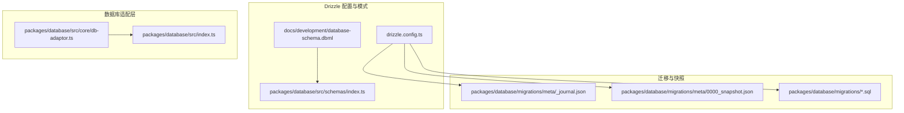
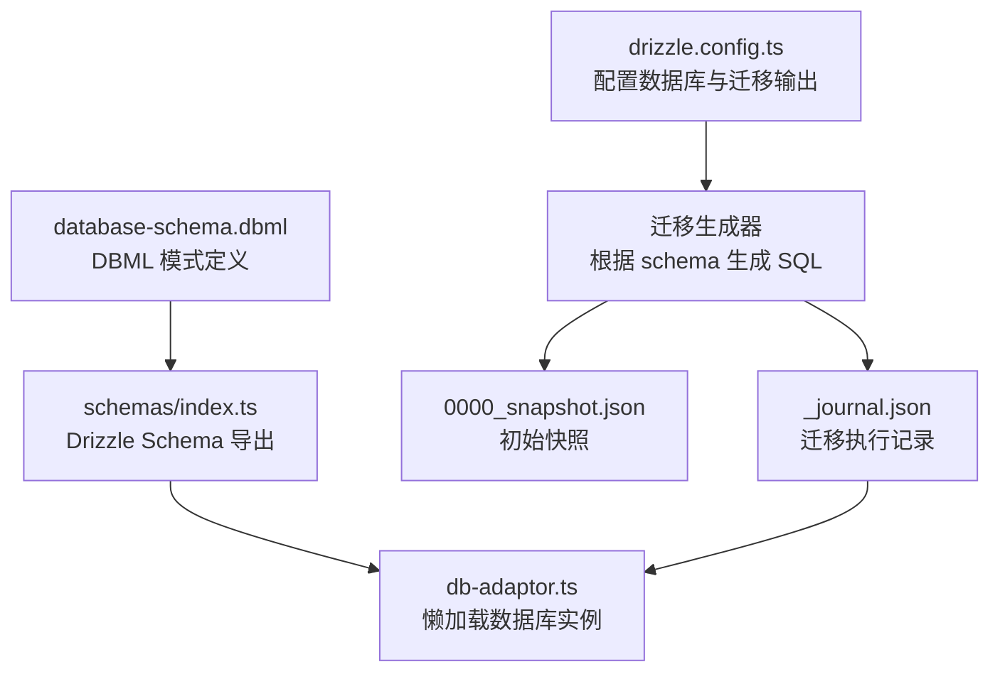
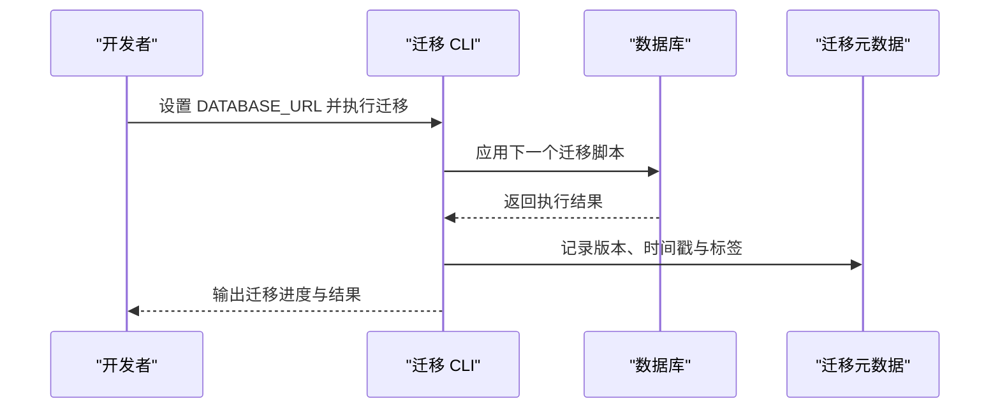
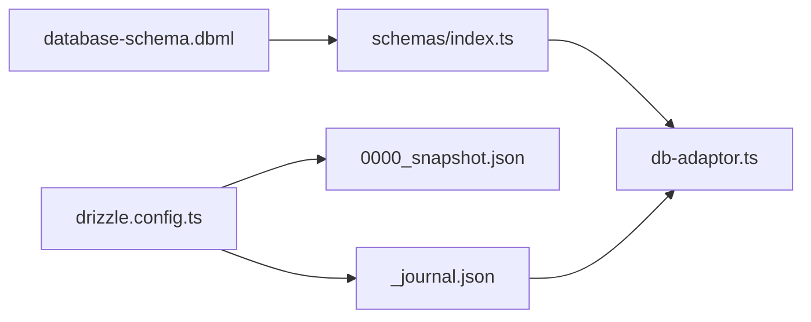

# 数据库维护

<cite>
**本文引用的文件**
- [drizzle.config.ts](file://drizzle.config.ts)
- [packages/database/src/index.ts](file://packages/database/src/index.ts)
- [packages/database/src/models/drizzleMigration.ts](file://packages/database/src/models/drizzleMigration.ts)
- [packages/database/package.json](file://packages/database/package.json)
- [docs/development/database-schema.dbml](file://docs/development/database-schema.dbml)
- [packages/database/migrations/meta/_journal.json](file://packages/database/migrations/meta/_journal.json)
- [packages/database/migrations/meta/0000_snapshot.json](file://packages/database/migrations/meta/0000_snapshot.json)
- [packages/database/src/core/db-adaptor.ts](file://packages/database/src/core/db-adaptor.ts)
- [packages/database/src/schemas/index.ts](file://packages/database/src/schemas/index.ts)
- [docs/self-hosting/migration/v2/auth/nextauth-to-betterauth.zh-CN.mdx](file://docs/self-hosting/migration/v2/auth/nextauth-to-betterauth.zh-CN.mdx)
- [packages/types/src/clientDB.ts](file://packages/types/src/clientDB.ts)
</cite>

## 目录
1. [简介](#简介)
2. [项目结构](#项目结构)
3. [核心组件](#核心组件)
4. [架构总览](#架构总览)
5. [详细组件分析](#详细组件分析)
6. [依赖关系分析](#依赖关系分析)
7. [性能考虑](#性能考虑)
8. [故障排查指南](#故障排查指南)
9. [结论](#结论)
10. [附录](#附录)

## 简介
本文件面向 LobeHub 项目的数据库维护与运维实践，围绕以下主题展开：
- 数据库迁移管理：迁移脚本编写、版本控制、执行策略、回滚机制
- 数据库性能优化：查询优化、索引管理、统计信息更新、缓存策略
- 数据备份与恢复：全量备份、增量备份、备份验证、恢复测试
- 数据库监控与诊断：慢查询分析、锁等待监控、连接池管理、内存使用监控
- 数据库安全管理：权限管理、审计日志、数据加密、访问控制

本文件基于仓库中的 Drizzle 配置、迁移元数据、模式定义以及迁移文档进行系统化梳理，并提供可操作的运维建议。

## 项目结构
LobeHub 使用 Drizzle ORM 管理数据库模式与迁移，核心位置如下：
- Drizzle 配置：定义数据库连接、迁移输出目录、模式路径与严格模式
- 迁移目录：包含按版本号命名的 SQL 脚本与元数据快照
- 模式定义：通过 DBML 与 Drizzle Schema 组织表结构与索引
- 数据库适配层：提供服务端数据库实例懒加载与统一入口
- 迁移工具链：通过包内脚本驱动迁移与测试

图表来源
- [drizzle.config.ts](file://drizzle.config.ts#L1-L22)
- [docs/development/database-schema.dbml](file://docs/development/database-schema.dbml#L1-L120)
- [packages/database/migrations/meta/_journal.json](file://packages/database/migrations/meta/_journal.json#L1-L644)
- [packages/database/migrations/meta/0000_snapshot.json](file://packages/database/migrations/meta/0000_snapshot.json#L1-L200)
- [packages/database/src/core/db-adaptor.ts](file://packages/database/src/core/db-adaptor.ts#L1-L25)
- [packages/database/src/schemas/index.ts](file://packages/database/src/schemas/index.ts#L1-L24)
- [packages/database/src/index.ts](file://packages/database/src/index.ts#L1-L5)

章节来源
- [drizzle.config.ts](file://drizzle.config.ts#L1-L22)
- [packages/database/src/core/db-adaptor.ts](file://packages/database/src/core/db-adaptor.ts#L1-L25)
- [packages/database/src/schemas/index.ts](file://packages/database/src/schemas/index.ts#L1-L24)
- [packages/database/migrations/meta/_journal.json](file://packages/database/migrations/meta/_journal.json#L1-L644)
- [packages/database/migrations/meta/0000_snapshot.json](file://packages/database/migrations/meta/0000_snapshot.json#L1-L200)
- [docs/development/database-schema.dbml](file://docs/development/database-schema.dbml#L1-L120)

## 核心组件
- Drizzle 配置：集中定义数据库方言、连接字符串来源、迁移输出目录、模式路径与严格模式
- 迁移模型：封装迁移状态查询、最新迁移哈希获取等能力
- 数据库适配器：提供服务端数据库实例懒加载，避免重复初始化
- 模式索引：聚合导出各模块表结构定义，便于统一管理
- 包脚本：提供客户端与服务端数据库测试脚本，辅助迁移验证

章节来源
- [drizzle.config.ts](file://drizzle.config.ts#L1-L22)
- [packages/database/src/models/drizzleMigration.ts](file://packages/database/src/models/drizzleMigration.ts#L1-L39)
- [packages/database/src/core/db-adaptor.ts](file://packages/database/src/core/db-adaptor.ts#L1-L25)
- [packages/database/src/schemas/index.ts](file://packages/database/src/schemas/index.ts#L1-L24)
- [packages/database/package.json](file://packages/database/package.json#L10-L15)

## 架构总览
下图展示迁移与模式管理的整体架构：Drizzle 配置驱动迁移生成与执行；迁移脚本与元数据快照共同记录演进历史；模式定义通过 DBML 与 Drizzle Schema 明确表结构与索引；数据库适配器提供统一的数据库实例入口。

图表来源
- [drizzle.config.ts](file://drizzle.config.ts#L10-L21)
- [packages/database/migrations/meta/_journal.json](file://packages/database/migrations/meta/_journal.json#L1-L644)
- [packages/database/migrations/meta/0000_snapshot.json](file://packages/database/migrations/meta/0000_snapshot.json#L1-L120)
- [docs/development/database-schema.dbml](file://docs/development/database-schema.dbml#L1-L120)
- [packages/database/src/schemas/index.ts](file://packages/database/src/schemas/index.ts#L1-L24)
- [packages/database/src/core/db-adaptor.ts](file://packages/database/src/core/db-adaptor.ts#L10-L25)

## 详细组件分析

### 迁移管理与版本控制
- 迁移生成与执行
  - 通过 Drizzle 配置指定迁移输出目录与模式路径，确保迁移脚本与模式保持一致
  - 迁移执行记录保存在元数据文件中，包含版本、时间戳、标签与断点标记
  - 初始快照记录了数据库的基准状态，便于对比差异与回滚

- 迁移脚本组织
  - 迁移脚本按版本号递增命名，每个版本对应一次模式变更
  - 元数据快照记录了每次迁移前后的表结构变化，支持回溯与一致性校验

- 执行策略
  - 在本地克隆仓库后，使用环境变量配置数据库连接字符串，确保迁移在受控环境下执行
  - 建议先在测试环境执行 dry-run，确认无误后再在生产环境执行
  - 迁移过程中可能影响在线服务，建议在维护窗口执行

- 回滚机制
  - 迁移元数据包含版本与时间戳，可据此定位目标版本
  - 若存在断点标记，可在断点处停止或继续执行
  - 回滚需谨慎评估数据一致性与业务影响，必要时结合备份进行恢复

图表来源
- [drizzle.config.ts](file://drizzle.config.ts#L10-L21)
- [packages/database/migrations/meta/_journal.json](file://packages/database/migrations/meta/_journal.json#L1-L644)
- [docs/self-hosting/migration/v2/auth/nextauth-to-betterauth.zh-CN.mdx](file://docs/self-hosting/migration/v2/auth/nextauth-to-betterauth.zh-CN.mdx#L152-L194)

章节来源
- [drizzle.config.ts](file://drizzle.config.ts#L1-L22)
- [packages/database/migrations/meta/_journal.json](file://packages/database/migrations/meta/_journal.json#L1-L644)
- [packages/database/migrations/meta/0000_snapshot.json](file://packages/database/migrations/meta/0000_snapshot.json#L1-L200)
- [docs/self-hosting/migration/v2/auth/nextauth-to-betterauth.zh-CN.mdx](file://docs/self-hosting/migration/v2/auth/nextauth-to-betterauth.zh-CN.mdx#L152-L194)

### 数据库性能优化
- 查询优化
  - 基于 DBML 定义的索引，确保高频查询字段具备合适索引
  - 对常用过滤、排序与连接字段建立复合索引，减少全表扫描
  - 定期审查慢查询日志，识别并优化低效查询

- 索引管理
  - 依据业务增长趋势调整索引策略，避免过度索引导致写入性能下降
  - 定期重建或重组碎片化的索引，保持查询效率

- 统计信息更新
  - 定期更新数据库统计信息，帮助查询优化器选择最优执行计划
  - 在大规模数据变更后及时更新统计信息

- 缓存策略
  - 结合应用层缓存与数据库查询缓存，降低热点数据的查询压力
  - 合理设置缓存失效策略，保证数据一致性与新鲜度

[本节为通用性能指导，无需特定文件引用]

### 数据备份与恢复
- 全量备份
  - 使用数据库提供的全量备份工具生成完整副本
  - 备份文件应加密存储并异地存放，定期验证备份完整性

- 增量备份
  - 在全量备份基础上，定期执行增量备份，缩短恢复时间窗口
  - 增量备份需与归档日志配合，确保可恢复到任意时间点

- 备份验证与恢复测试
  - 定期对备份文件进行抽样验证，确保可读性与可恢复性
  - 在测试环境中模拟恢复流程，验证备份可用性与恢复时间

- 恢复测试
  - 制定恢复测试计划，覆盖不同场景（灾难恢复、点时间恢复）
  - 记录恢复测试结果，持续改进恢复流程

[本节为通用备份恢复指导，无需特定文件引用]

### 数据库监控与诊断
- 慢查询分析
  - 开启慢查询日志，设定阈值，定期分析慢查询
  - 结合执行计划与索引使用情况，优化查询与索引设计

- 锁等待监控
  - 监控锁等待与死锁事件，识别长事务与热点资源竞争
  - 优化事务粒度与隔离级别，减少锁冲突

- 连接池管理
  - 合理配置连接池大小与超时参数，避免连接泄漏与资源耗尽
  - 监控连接池使用率，动态调整以适应流量波动

- 内存使用监控
  - 关注共享内存与排序、哈希等临时操作的内存占用
  - 根据监控指标调整工作内存与维护策略

[本节为通用监控诊断指导，无需特定文件引用]

### 数据库安全管理
- 权限管理
  - 最小权限原则分配数据库访问权限，定期审查与回收
  - 对不同环境（开发、测试、生产）分离数据库账号与权限

- 审计日志
  - 启用审计日志，记录敏感操作与异常登录
  - 定期审阅审计日志，发现潜在安全风险

- 数据加密
  - 传输加密：启用 TLS 加密数据库连接
  - 存储加密：对敏感数据进行加密存储，密钥管理符合安全规范

- 访问控制
  - 强制多因素认证与最小会话有效期
  - 限制数据库主机访问来源，仅允许受信网络访问

[本节为通用安全指导，无需特定文件引用]

## 依赖关系分析
- Drizzle 配置与迁移
  - 配置文件决定迁移输出目录与模式路径，直接影响迁移生成与执行
  - 迁移元数据与快照共同构成迁移历史，支撑版本回溯与一致性校验

- 模式定义与适配层
  - DBML 与 Drizzle Schema 定义表结构与索引，适配器提供懒加载数据库实例
  - 模式索引统一导出各模块定义，便于集中管理与引用

图表来源
- [drizzle.config.ts](file://drizzle.config.ts#L10-L21)
- [packages/database/migrations/meta/_journal.json](file://packages/database/migrations/meta/_journal.json#L1-L644)
- [packages/database/migrations/meta/0000_snapshot.json](file://packages/database/migrations/meta/0000_snapshot.json#L1-L120)
- [docs/development/database-schema.dbml](file://docs/development/database-schema.dbml#L1-L120)
- [packages/database/src/schemas/index.ts](file://packages/database/src/schemas/index.ts#L1-L24)
- [packages/database/src/core/db-adaptor.ts](file://packages/database/src/core/db-adaptor.ts#L10-L25)

章节来源
- [drizzle.config.ts](file://drizzle.config.ts#L1-L22)
- [packages/database/src/schemas/index.ts](file://packages/database/src/schemas/index.ts#L1-L24)
- [packages/database/src/core/db-adaptor.ts](file://packages/database/src/core/db-adaptor.ts#L1-L25)
- [packages/database/migrations/meta/_journal.json](file://packages/database/migrations/meta/_journal.json#L1-L644)
- [packages/database/migrations/meta/0000_snapshot.json](file://packages/database/migrations/meta/0000_snapshot.json#L1-L200)
- [docs/development/database-schema.dbml](file://docs/development/database-schema.dbml#L1-L120)

## 性能考虑
- 索引设计与维护
  - 依据 DBML 中的索引定义，确保高频查询字段具备合适索引
  - 定期评估索引使用率，清理冗余索引，平衡写入与查询性能

- 查询优化
  - 结合业务场景优化查询语句，避免 N+1 查询与不必要的 JOIN
  - 使用 EXPLAIN 分析执行计划，识别瓶颈并针对性优化

- 统计信息与维护
  - 定期更新统计信息，确保查询优化器做出正确决策
  - 在大规模数据变更后及时更新统计信息

- 缓存与连接池
  - 应用层与数据库层缓存协同，降低热点数据访问延迟
  - 合理配置连接池参数，避免连接争用与资源浪费

[本节为通用性能指导，无需特定文件引用]

## 故障排查指南
- 迁移失败
  - 检查迁移元数据与快照是否一致，确认目标版本是否存在
  - 查看迁移日志与错误信息，定位具体失败步骤
  - 在测试环境重放失败步骤，修复后再在生产执行

- 连接问题
  - 校验数据库连接字符串与网络连通性
  - 检查连接池配置与并发限制，避免连接泄漏

- 性能退化
  - 分析慢查询日志与执行计划，识别热点表与索引缺失
  - 评估索引碎片与统计信息更新情况，必要时重建索引与更新统计

- 数据不一致
  - 校验迁移历史与当前模式，确保所有迁移均已成功应用
  - 必要时进行数据修复或回滚至稳定版本

章节来源
- [packages/database/src/models/drizzleMigration.ts](file://packages/database/src/models/drizzleMigration.ts#L1-L39)
- [packages/database/migrations/meta/_journal.json](file://packages/database/migrations/meta/_journal.json#L1-L644)
- [packages/database/src/core/db-adaptor.ts](file://packages/database/src/core/db-adaptor.ts#L10-L25)

## 结论
LobeHub 的数据库维护以 Drizzle 为核心，通过配置驱动迁移、元数据记录演进历史、模式定义明确结构与索引，辅以懒加载适配器与测试脚本，形成完整的迁移与运维闭环。结合本文的性能优化、备份恢复、监控诊断与安全实践建议，可有效保障数据库的稳定性、可靠性与安全性。

[本节为总结性内容，无需特定文件引用]

## 附录
- 迁移执行前置条件与注意事项
  - 迁移前必须备份数据库，优先在测试环境验证
  - 本地克隆仓库后在受控环境下执行迁移，确保依赖与环境一致
  - 迁移不保留登录会话，完成后用户需重新登录

- 客户端数据库迁移状态
  - 客户端数据库初始化包含多个阶段，迁移过程会反馈当前状态与进度

章节来源
- [docs/self-hosting/migration/v2/auth/nextauth-to-betterauth.zh-CN.mdx](file://docs/self-hosting/migration/v2/auth/nextauth-to-betterauth.zh-CN.mdx#L152-L194)
- [packages/types/src/clientDB.ts](file://packages/types/src/clientDB.ts#L1-L42)