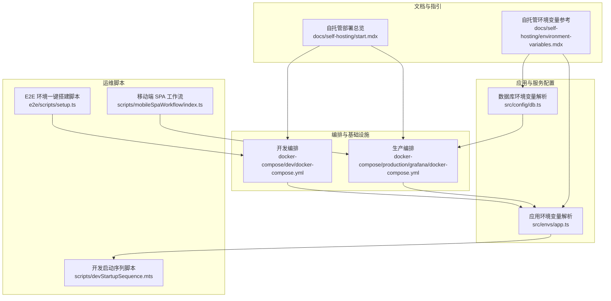
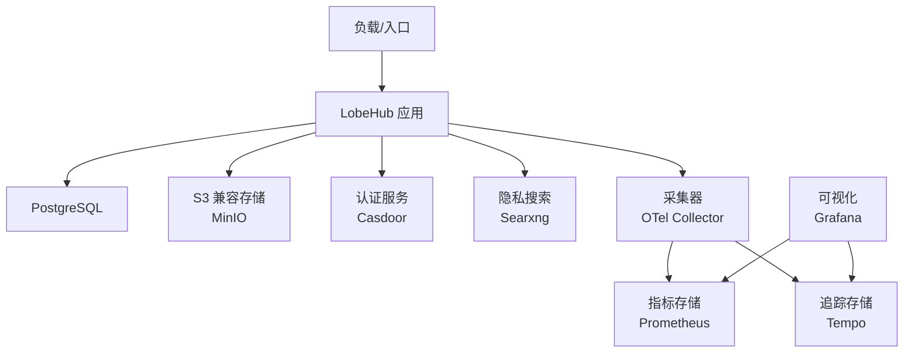
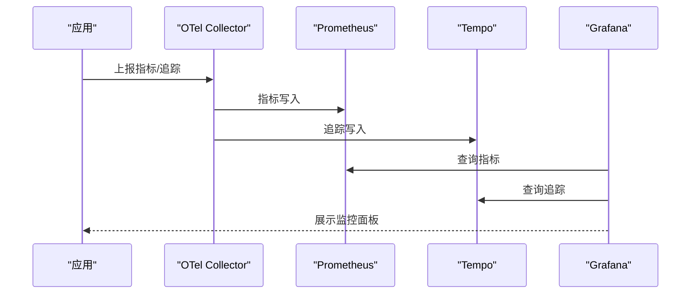
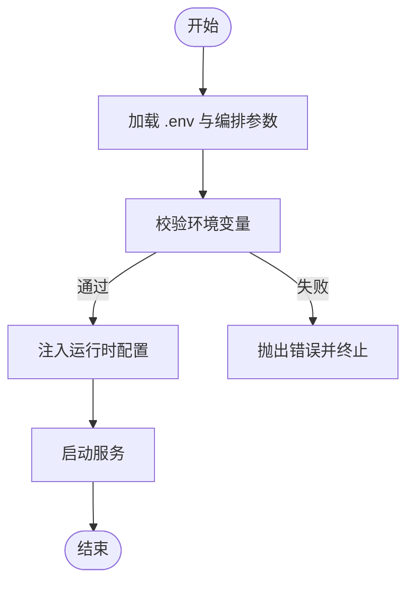
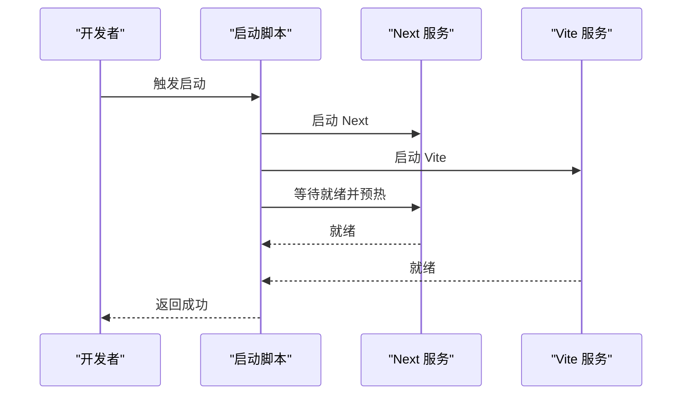
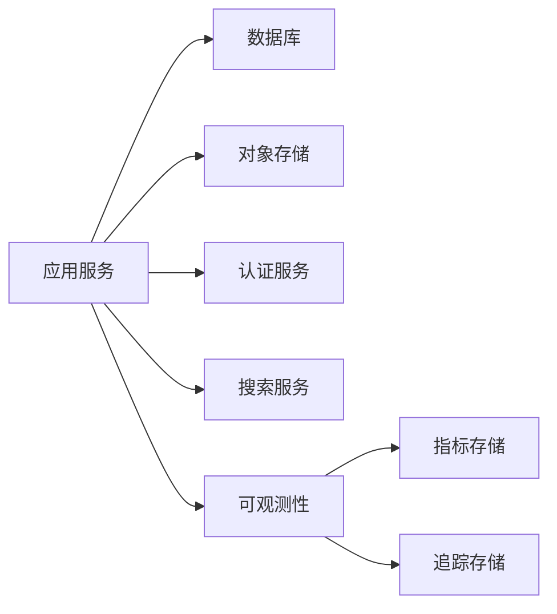

# 日常运维

<cite>
**本文引用的文件**
- [docker-compose 生产环境编排](file://docker-compose/production/grafana/docker-compose.yml)
- [docker-compose 开发环境编排](file://docker-compose/dev/docker-compose.yml)
- [应用环境变量解析](file://src/envs/app.ts)
- [数据库环境变量解析](file://src/config/db.ts)
- [应用启动顺序脚本](file://scripts/devStartupSequence.mts)
- [E2E 环境一键搭建脚本](file://e2e/scripts/setup.ts)
- [风险控制告警阈值与通知（路由通道）](file://src/server/services/riskControl/routerAlertNotification.ts)
- [自托管部署总览](file://docs/self-hosting/start.mdx)
- [自托管环境变量参考](file://docs/self-hosting/environment-variables.mdx)
- [客户端数据库备份与重置（国际化文案）](file://locales/en-US/common.json)
- [导入配置解析器](file://src/features/DataImporter/config.ts)
- [Vite 环境变量变更监听插件](file://plugins/vite/envRestartKeys.ts)
- [移动端 SPA 工作流（上传与模板生成）](file://scripts/mobileSpaWorkflow/index.ts)
- [E2E 环境变量参考（本地设置）](file://e2e/docs/local-setup.md)
</cite>

## 目录

1. [简介](#简介)
2. [项目结构](#项目结构)
3. [核心组件](#核心组件)
4. [架构总览](#架构总览)
5. [详细组件分析](#详细组件分析)
6. [依赖关系分析](#依赖关系分析)
7. [性能考量](#性能考量)
8. [故障排查指南](#故障排查指南)
9. [结论](#结论)
10. [附录](#附录)

## 简介

本文件面向 LobeHub 项目的日常运维团队，提供系统监控与告警、日志管理、备份恢复、环境管理以及运维自动化等方面的实操指南。内容基于仓库中现有的编排、配置、脚本与文档，帮助读者快速建立可执行的运维流程，并在不同环境中（开发、测试、生产）稳定运行。

## 项目结构

围绕运维相关的目录与文件，主要涉及以下方面：

- 编排与基础设施：docker-compose 目录包含开发与生产环境的编排文件，覆盖数据库、对象存储、可观测性栈（Prometheus、Tempo、Grafana、OTel Collector）等。
- 应用与服务配置：环境变量解析模块负责在运行时校验与注入关键配置，如应用地址、数据库驱动、队列模式等。
- 运维脚本：提供开发启动序列、E2E 环境搭建、移动端 SPA 资产上传与模板生成等自动化脚本。
- 文档与指引：自托管文档提供了部署平台选择、环境变量配置、安全建议等运维必备信息。

图表来源

- [docker-compose 开发环境编排](file://docker-compose/dev/docker-compose.yml#L1-L123)
- [docker-compose 生产环境编排](file://docker-compose/production/grafana/docker-compose.yml#L1-L251)
- [应用环境变量解析](file://src/envs/app.ts#L1-L128)
- [数据库环境变量解析](file://src/config/db.ts#L1-L27)
- [应用启动顺序脚本](file://scripts/devStartupSequence.mts#L1-L140)
- [E2E 环境一键搭建脚本](file://e2e/scripts/setup.ts#L1-L410)
- [移动端 SPA 工作流（上传与模板生成）](file://scripts/mobileSpaWorkflow/index.ts#L48-L75)
- [自托管部署总览](file://docs/self-hosting/start.mdx#L1-L152)
- [自托管环境变量参考](file://docs/self-hosting/environment-variables.mdx#L1-L95)

章节来源

- [docker-compose 开发环境编排](file://docker-compose/dev/docker-compose.yml#L1-L123)
- [docker-compose 生产环境编排](file://docker-compose/production/grafana/docker-compose.yml#L1-L251)
- [应用环境变量解析](file://src/envs/app.ts#L1-L128)
- [数据库环境变量解析](file://src/config/db.ts#L1-L27)
- [应用启动顺序脚本](file://scripts/devStartupSequence.mts#L1-L140)
- [E2E 环境一键搭建脚本](file://e2e/scripts/setup.ts#L1-L410)
- [移动端 SPA 工作流（上传与模板生成）](file://scripts/mobileSpaWorkflow/index.ts#L48-L75)
- [自托管部署总览](file://docs/self-hosting/start.mdx#L1-L152)
- [自托管环境变量参考](file://docs/self-hosting/environment-variables.mdx#L1-L95)

## 核心组件

- 应用与服务配置
  - 应用环境变量解析模块负责校验与注入应用 URL、内部调用地址、索引源、插件与市场相关配置、队列代理运行模式、遥测开关等。
  - 数据库环境变量解析模块负责校验数据库驱动类型、连接串、密钥保险库密钥、全局文件移除策略等。
- 编排与基础设施
  - 开发编排包含 PostgreSQL、Redis、RustFS/Mock S3、Searxng 等服务，便于本地联调。
  - 生产编排包含 PostgreSQL、MinIO、Casdoor、Searxng、Grafana、Tempo、Prometheus、OTel Collector 等，形成可观测性闭环。
- 运维脚本
  - 开发启动序列脚本负责并行启动前端与 Next 服务，并进行预热与健康探测。
  - E2E 环境一键搭建脚本支持一键拉起数据库、容器与服务，便于端到端测试。
  - 移动端 SPA 工作流负责将构建产物上传至 S3 并生成模板文件，支撑移动端静态化发布。
- 文档与指引
  - 自托管部署总览提供平台选择、架构概览、功能对比与安全建议。
  - 环境变量参考提供变量清单与自定义镜像构建方法。

章节来源

- [应用环境变量解析](file://src/envs/app.ts#L36-L125)
- [数据库环境变量解析](file://src/config/db.ts#L4-L25)
- [docker-compose 开发环境编排](file://docker-compose/dev/docker-compose.yml#L17-L97)
- [docker-compose 生产环境编排](file://docker-compose/production/grafana/docker-compose.yml#L19-L233)
- [应用启动顺序脚本](file://scripts/devStartupSequence.mts#L78-L91)
- [E2E 环境一键搭建脚本](file://e2e/scripts/setup.ts#L26-L41)
- [移动端 SPA 工作流（上传与模板生成）](file://scripts/mobileSpaWorkflow/index.ts#L52-L66)
- [自托管部署总览](file://docs/self-hosting/start.mdx#L21-L152)
- [自托管环境变量参考](file://docs/self-hosting/environment-variables.mdx#L1-L95)

## 架构总览

下图展示了生产环境的基础设施与服务交互关系，强调健康检查、可观测性与外部依赖：

图表来源

- [docker-compose 生产环境编排](file://docker-compose/production/grafana/docker-compose.yml#L160-L233)
- [docker-compose 开发环境编排](file://docker-compose/dev/docker-compose.yml#L1-L123)

章节来源

- [docker-compose 生产环境编排](file://docker-compose/production/grafana/docker-compose.yml#L1-L251)
- [docker-compose 开发环境编排](file://docker-compose/dev/docker-compose.yml#L1-L123)

## 详细组件分析

### 系统监控与告警机制

- 健康检查
  - PostgreSQL、Redis、RustFS、MinIO、Grafana、Tempo、Prometheus、OTel Collector 等均配置了健康检查或启动后探测逻辑，确保服务可用性。
- 性能指标与可观测性
  - OTel Collector 将指标与追踪导出到 Prometheus 与 Tempo；Grafana 通过数据源与仪表盘进行可视化展示。
- 异常告警处理
  - 代码中存在路由通道与模型级别的告警阈值与通知接口，当前实现为占位，可用于接入具体告警通道（如邮件、IM、Webhook）。

图表来源

- [docker-compose 生产环境编排](file://docker-compose/production/grafana/docker-compose.yml#L138-L148)
- [docker-compose 生产环境编排](file://docker-compose/production/grafana/docker-compose.yml#L124-L136)
- [docker-compose 生产环境编排](file://docker-compose/production/grafana/docker-compose.yml#L98-L113)

章节来源

- [docker-compose 生产环境编排](file://docker-compose/production/grafana/docker-compose.yml#L29-L33)
- [docker-compose 生产环境编排](file://docker-compose/production/grafana/docker-compose.yml#L46-L62)
- [docker-compose 生产环境编排](file://docker-compose/production/grafana/docker-compose.yml#L114-L148)
- [docker-compose 生产环境编排](file://docker-compose/production/grafana/docker-compose.yml#L98-L113)
- [风险控制告警阈值与通知（路由通道）](file://src/server/services/riskControl/routerAlertNotification.ts#L1-L30)

### 日志管理策略

- 日志收集
  - 容器标准输出由 Docker 管理；OTel Collector 支持接收指标与追踪，可扩展为日志采集（需在配置中启用）。
- 日志分类与存储
  - Grafana Tempo 用于追踪存储；Prometheus 用于指标存储；日志可结合 Loki（需额外配置）实现统一检索。
- 日志查询与分析
  - Grafana 提供查询界面，结合指标与追踪进行关联分析；建议对关键路径（认证、存储、数据库）建立仪表盘与告警规则。

章节来源

- [docker-compose 生产环境编排](file://docker-compose/production/grafana/docker-compose.yml#L114-L148)
- [docker-compose 生产环境编排](file://docker-compose/production/grafana/docker-compose.yml#L98-L113)

### 备份与恢复流程

- 数据库备份
  - 使用 Docker 卷挂载持久化 PostgreSQL 数据目录，定期执行逻辑备份（如使用 pg_dump）并归档至对象存储。
- 文件备份
  - 对象存储桶（MinIO/RustFS）中的文件作为独立资产，可通过 S3 客户端工具进行增量备份与快照。
- 配置备份
  - .env 文件与编排文件应纳入版本控制或安全存储；敏感变量通过密钥管理服务注入。
- 灾难恢复
  - 基于卷快照与对象存储归档进行回滚；优先恢复数据库与对象存储，再重启应用服务。

章节来源

- [docker-compose 开发环境编排](file://docker-compose/dev/docker-compose.yml#L22-L26)
- [docker-compose 生产环境编排](file://docker-compose/production/grafana/docker-compose.yml#L24-L26)
- [docker-compose 生产环境编排](file://docker-compose/production/grafana/docker-compose.yml#L42-L44)

### 环境管理

- 开发、测试、生产环境的配置管理
  - 通过环境变量解析模块集中校验与注入配置；不同环境使用不同的 .env 文件与编排参数。
- 环境切换与同步
  - 在编排文件中通过 env_file 与环境变量映射实现环境隔离；必要时使用密钥管理服务进行密文注入。
- 特性开关与灰度
  - 通过特性开关（Feature Flags）与环境变量组合实现功能灰度与快速回滚。

图表来源

- [应用环境变量解析](file://src/envs/app.ts#L36-L125)
- [数据库环境变量解析](file://src/config/db.ts#L4-L25)
- [docker-compose 开发环境编排](file://docker-compose/dev/docker-compose.yml#L14-L15)
- [docker-compose 生产环境编排](file://docker-compose/production/grafana/docker-compose.yml#L191-L192)

章节来源

- [应用环境变量解析](file://src/envs/app.ts#L1-L128)
- [数据库环境变量解析](file://src/config/db.ts#L1-L27)
- [docker-compose 开发环境编排](file://docker-compose/dev/docker-compose.yml#L1-L123)
- [docker-compose 生产环境编排](file://docker-compose/production/grafana/docker-compose.yml#L1-L251)

### 运维自动化工具使用指南

- 脚本自动化
  - 开发启动序列脚本：并行启动前端与 Next 服务，等待就绪后进行预热，异常退出时自动清理。
  - E2E 环境一键搭建脚本：一键拉起数据库与服务，支持跳过迁移与构建，便于回归测试。
  - 移动端 SPA 工作流：将构建产物上传至 S3 并生成模板文件，支撑移动端静态化发布。
- CI/CD 集成
  - 利用 GitHub Actions 或其他流水线工具集成上述脚本，实现自动化构建、测试与部署。
- 批量操作
  - 使用 S3 客户端工具进行批量上传与归档；通过 Docker Compose 批量启停服务。

图表来源

- [应用启动顺序脚本](file://scripts/devStartupSequence.mts#L119-L134)
- [应用启动顺序脚本](file://scripts/devStartupSequence.mts#L60-L91)

章节来源

- [应用启动顺序脚本](file://scripts/devStartupSequence.mts#L1-L140)
- [E2E 环境一键搭建脚本](file://e2e/scripts/setup.ts#L1-L410)
- [移动端 SPA 工作流（上传与模板生成）](file://scripts/mobileSpaWorkflow/index.ts#L48-L75)

## 依赖关系分析

- 组件耦合
  - 应用服务依赖数据库、对象存储、认证与搜索服务；可观测性组件（OTel、Prometheus、Tempo、Grafana）与应用解耦，通过网络互通。
- 外部依赖
  - AI 提供商 API 密钥、数据库、Redis、S3 兼容存储、认证提供商（Casdoor）等。
- 循环依赖
  - 当前结构以编排文件为中心，服务间通过网络访问，未见明显循环依赖。

图表来源

- [docker-compose 生产环境编排](file://docker-compose/production/grafana/docker-compose.yml#L160-L233)
- [docker-compose 生产环境编排](file://docker-compose/production/grafana/docker-compose.yml#L114-L148)

章节来源

- [docker-compose 生产环境编排](file://docker-compose/production/grafana/docker-compose.yml#L1-L251)

## 性能考量

- 启动与预热
  - 开发启动序列脚本在服务就绪后进行一次根路径预热，减少首次请求延迟。
- 资源与容量
  - 根据并发与数据规模调整数据库与对象存储实例规格；合理设置 Redis 缓存与会话存储。
- 可观测性
  - 建议为关键路径（认证、存储、数据库）设置指标与告警阈值，结合追踪进行根因分析。

章节来源

- [应用启动顺序脚本](file://scripts/devStartupSequence.mts#L73-L91)
- [docker-compose 生产环境编排](file://docker-compose/production/grafana/docker-compose.yml#L114-L148)

## 故障排查指南

- 健康检查失败
  - 检查容器健康检查配置与日志；确认网络连通性与端口占用情况。
- 认证与对象存储问题
  - 核对 OIDC 配置与端点可达性；验证 S3 端点、密钥与桶权限。
- 开发启动异常
  - 查看启动脚本输出，确认 Next 与 Vite 是否正常启动与退出；检查端口冲突。
- 导入配置解析失败
  - 检查导入文件格式与 JSON 结构，查看错误提示并修正。

章节来源

- [docker-compose 生产环境编排](file://docker-compose/production/grafana/docker-compose.yml#L194-L233)
- [E2E 环境一键搭建脚本](file://e2e/scripts/setup.ts#L26-L41)
- [应用启动顺序脚本](file://scripts/devStartupSequence.mts#L93-L117)
- [导入配置解析器](file://src/features/DataImporter/config.ts#L6-L21)

## 结论

通过编排文件、环境变量解析、可观测性栈与自动化脚本的协同，LobeHub 提供了可落地的运维能力。建议在生产环境中完善日志采集与分析、细化告警阈值、规范备份与灾难恢复流程，并持续优化启动与预热策略，以提升稳定性与可维护性。

## 附录

- 环境变量参考
  - 基础变量与自定义镜像构建方法详见自托管环境变量参考文档。
- 安全与合规
  - 严格管理密钥与敏感变量，避免提交至版本控制；启用 HTTPS 与最小权限原则。

章节来源

- [自托管环境变量参考](file://docs/self-hosting/environment-variables.mdx#L1-L95)
- [自托管部署总览](file://docs/self-hosting/start.mdx#L124-L152)
