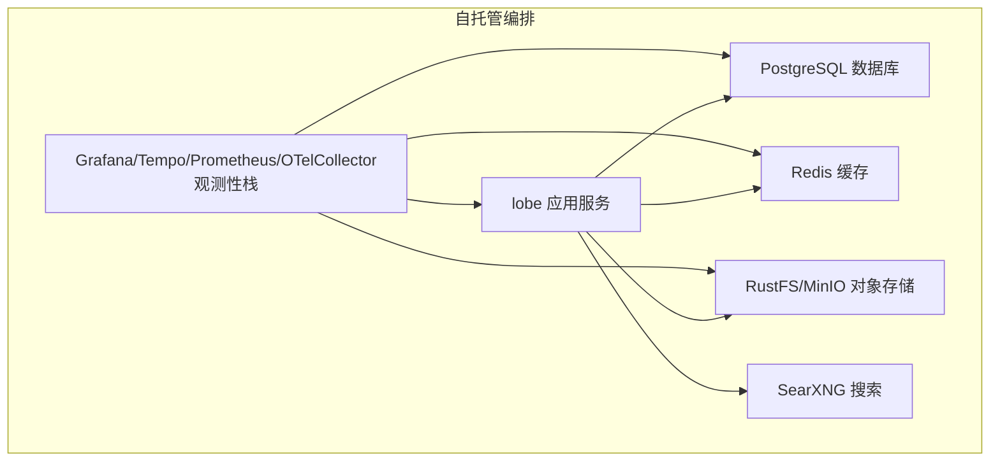
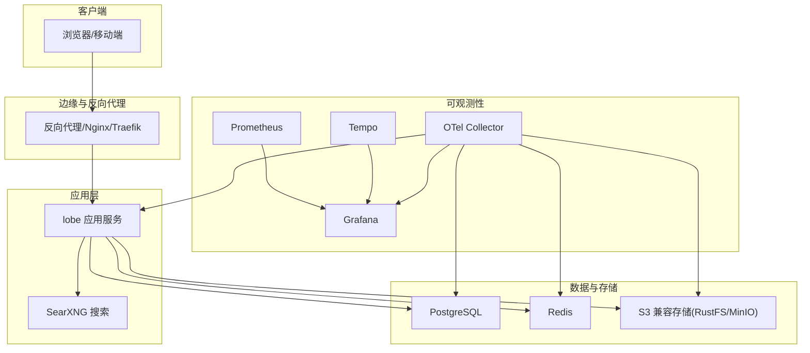
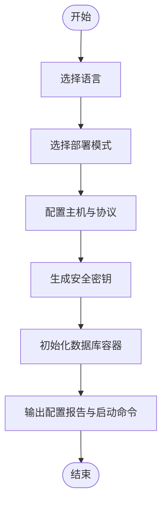
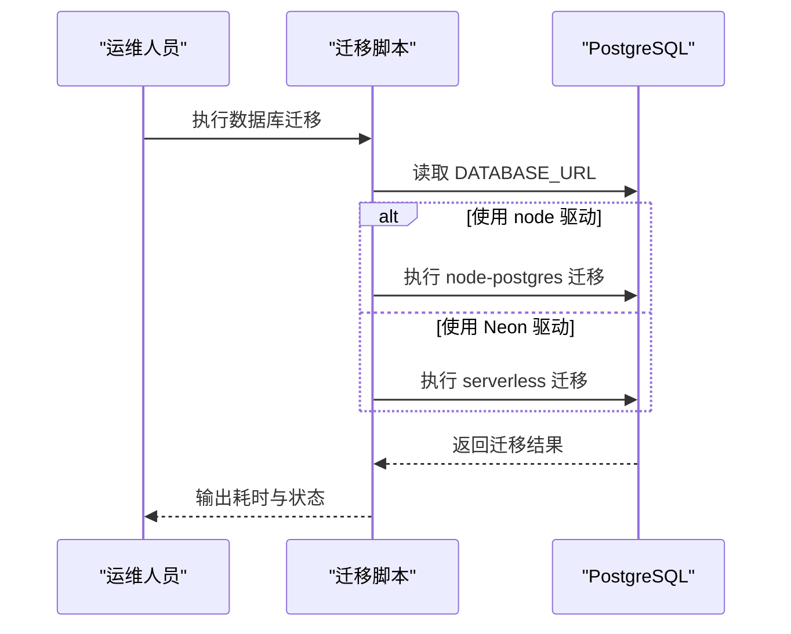
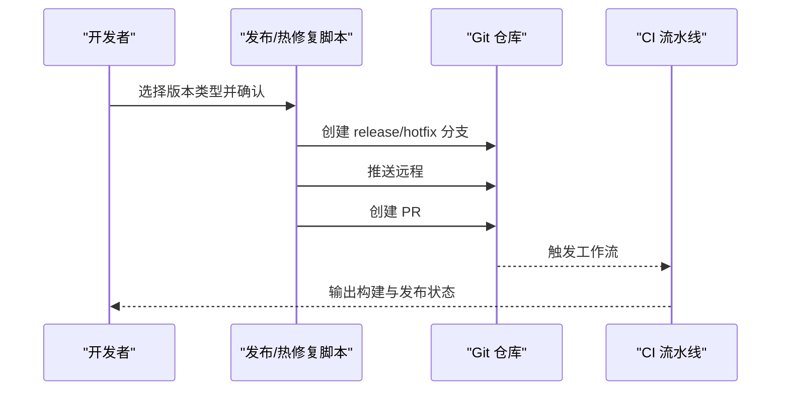
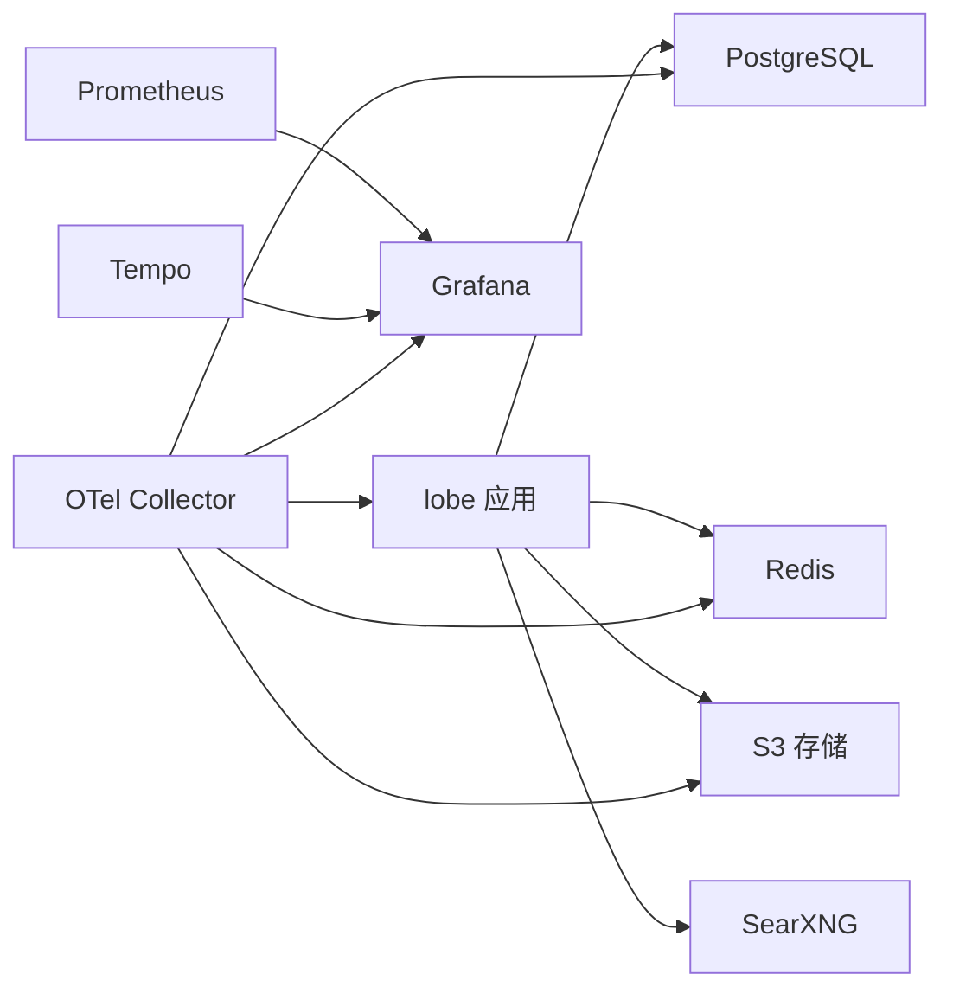

# 运维维护

<cite>
**本文引用的文件**
- [docker-compose/setup.sh](file://docker-compose/setup.sh)
- [docker-compose/deploy/docker-compose.yml](file://docker-compose/deploy/docker-compose.yml)
- [docker-compose/dev/docker-compose.yml](file://docker-compose/dev/docker-compose.yml)
- [docker-compose/production/grafana/docker-compose.yml](file://docker-compose/production/grafana/docker-compose.yml)
- [scripts/migrateServerDB/index.ts](file://scripts/migrateServerDB/index.ts)
- [scripts/dbmlWorkflow/index.ts](file://scripts/dbmlWorkflow/index.ts)
- [scripts/releaseWorkflow/index.ts](file://scripts/releaseWorkflow/index.ts)
- [scripts/hotfixWorkflow/index.ts](file://scripts/hotfixWorkflow/index.ts)
- [scripts/checkConsoleLog.mts](file://scripts/checkConsoleLog.mts)
- [docs/self-hosting/start.mdx](file://docs/self-hosting/start.mdx)
- [docs/self-hosting/environment-variables.mdx](file://docs/self-hosting/environment-variables.mdx)
- [package.json](file://package.json)
- [Dockerfile](file://Dockerfile)
- [.github/workflows](file://.github/workflows)
</cite>

## 目录

1. [简介](#简介)
2. [项目结构](#项目结构)
3. [核心组件](#核心组件)
4. [架构总览](#架构总览)
5. [详细组件分析](#详细组件分析)
6. [依赖关系分析](#依赖关系分析)
7. [性能考虑](#性能考虑)
8. [故障排查指南](#故障排查指南)
9. [结论](#结论)
10. [附录](#附录)

## 简介

本运维维护文档面向 LobeHub 自托管与生产运维场景，覆盖系统监控、日志管理、备份恢复、补丁更新、数据库维护策略、应用更新流程、故障排查方法以及自动化工具使用（Docker Compose、CI/CD 流水线等）。文档同时提供运维手册模板、标准作业程序（SOP）与知识库建设建议，帮助团队建立可执行、可追溯、可持续的运维管理体系。

## 项目结构

LobeHub 采用多服务容器化编排与 Next.js 应用的混合架构，核心服务包括：

- 应用服务：Next.js 前端与 API 路由
- 数据库：PostgreSQL（含向量扩展）
- 缓存：Redis
- 对象存储：RustFS/MinIO（S3 兼容）
- 搜索：SearXNG
- 观测性：Prometheus、Tempo、Grafana、OpenTelemetry Collector

图表来源

- [docker-compose/deploy/docker-compose.yml](file://docker-compose/deploy/docker-compose.yml#L1-L144)
- [docker-compose/production/grafana/docker-compose.yml](file://docker-compose/production/grafana/docker-compose.yml#L1-L251)

章节来源

- [docker-compose/deploy/docker-compose.yml](file://docker-compose/deploy/docker-compose.yml#L1-L144)
- [docker-compose/dev/docker-compose.yml](file://docker-compose/dev/docker-compose.yml#L1-L123)
- [docker-compose/production/grafana/docker-compose.yml](file://docker-compose/production/grafana/docker-compose.yml#L1-L251)
- [docs/self-hosting/start.mdx](file://docs/self-hosting/start.mdx#L1-L152)

## 核心组件

- 应用服务（lobe）：负责前端渲染与 API 路由，依赖数据库、缓存、对象存储与搜索服务。
- 数据库（postgresql）：提供会话、用户、对话、文件元数据等持久化能力。
- 缓存（redis）：提供会话存储、速率限制与缓存加速。
- 对象存储（rustfs/minio）：提供文件上传、知识库文档与头像等静态资源存储。
- 搜索（searxng）：隐私优先的聚合搜索服务。
- 观测性（grafana/tempo/prometheus/otel-collector）：指标、追踪与可视化。

章节来源

- [docker-compose/deploy/docker-compose.yml](file://docker-compose/deploy/docker-compose.yml#L3-L35)
- [docker-compose/production/grafana/docker-compose.yml](file://docker-compose/production/grafana/docker-compose.yml#L160-L193)

## 架构总览

LobeHub 支持多种部署方式，推荐使用 Docker Compose 快速搭建完整栈；生产环境可叠加 Grafana/Tempo/Prometheus/OTel Collector 实现可观测性。

图表来源

- [docs/self-hosting/start.mdx](file://docs/self-hosting/start.mdx#L21-L92)
- [docker-compose/production/grafana/docker-compose.yml](file://docker-compose/production/grafana/docker-compose.yml#L98-L149)

## 详细组件分析

### 安装与初始化脚本（setup.sh）

- 支持多语言交互提示，自动下载并配置 docker-compose 与 .env 示例文件。
- 提供部署模式选择（域名 / 端口 / 本地），自动注入 APP_URL 与 S3_ENDPOINT。
- 自动生成安全密钥（RUSTFS_SECRET_KEY、KEY_VAULTS_SECRET、AUTH_SECRET）并写入 .env。
- 初始化数据库容器，等待健康检查通过后停止，便于后续手动迁移。
- 输出最终启动命令与反向代理映射建议，提供端口开放与文档链接提示。

图表来源

- [docker-compose/setup.sh](file://docker-compose/setup.sh#L519-L773)

章节来源

- [docker-compose/setup.sh](file://docker-compose/setup.sh#L1-L773)

### 开发与生产编排（docker-compose）

- 开发环境：通过 network-service 共享网络，简化本地联调；RustFS 以服务形式挂载于同一网络。
- 生产环境：Grafana/Tempo/Prometheus/OTel Collector 组合，支持指标与分布式追踪；Casdoor 作为 SSO 提供者；MinIO 替代 RustFS，提供桶级权限控制。

章节来源

- [docker-compose/dev/docker-compose.yml](file://docker-compose/dev/docker-compose.yml#L1-L123)
- [docker-compose/production/grafana/docker-compose.yml](file://docker-compose/production/grafana/docker-compose.yml#L1-L251)

### 数据库迁移与建模

- 数据库迁移：通过迁移脚本按驱动类型（node/Neon）执行迁移，记录耗时并输出结果。
- 错误提示：针对缺失向量扩展、唯一约束冲突、初始化失败等常见问题提供明确提示。
- 建模导出：使用 drizzle-dbml-generator 将 schema 导出为 DBML，便于文档化与可视化。

图表来源

- [scripts/migrateServerDB/index.ts](file://scripts/migrateServerDB/index.ts#L23-L36)

章节来源

- [scripts/migrateServerDB/index.ts](file://scripts/migrateServerDB/index.ts#L1-L62)
- [scripts/dbmlWorkflow/index.ts](file://scripts/dbmlWorkflow/index.ts#L1-L13)

### 发布与热修复流程（release/hotfix）

- 发布流程：交互式选择补丁 / 小改 / 大改，创建 release 分支，推送远程并提交 PR，等待合并触发流水线。
- 热修复流程：从 main 或现有 hotfix 分支创建热修复分支，推送并提交 PR，合并后自动打标签与发布。

图表来源

- [scripts/releaseWorkflow/index.ts](file://scripts/releaseWorkflow/index.ts#L244-L284)
- [scripts/hotfixWorkflow/index.ts](file://scripts/hotfixWorkflow/index.ts#L202-L261)

章节来源

- [scripts/releaseWorkflow/index.ts](file://scripts/releaseWorkflow/index.ts#L1-L290)
- [scripts/hotfixWorkflow/index.ts](file://scripts/hotfixWorkflow/index.ts#L1-L267)

### 日志与告警检查

- 控制台日志检查：扫描 TS/JS 文件中的 console.log，支持白名单与注释过滤，CI 环境输出警告注解，不阻断流水线。
- 建议：统一使用结构化日志库（如 Winston/OpenTelemetry），结合 Loki/ELK 进行集中采集与检索。

章节来源

- [scripts/checkConsoleLog.mts](file://scripts/checkConsoleLog.mts#L1-L151)

### 环境变量与自定义镜像

- 环境变量：涵盖数据库、认证、Redis、邮件、S3、模型提供商等关键配置项。
- 自定义镜像：通过 GitHub Actions 构建自定义镜像，覆盖 NEXT_PUBLIC 变量，无需 Fork 仓库。

章节来源

- [docs/self-hosting/environment-variables.mdx](file://docs/self-hosting/environment-variables.mdx#L1-L95)
- [Dockerfile](file://Dockerfile#L154-L335)

## 依赖关系分析

- 应用服务依赖数据库、缓存、对象存储与搜索服务，健康检查条件确保启动顺序与稳定性。
- 观测性栈独立于业务，通过 OTel Collector 聚合指标与追踪，Prometheus 抓取指标，Grafana 展示仪表盘。
- CI/CD 通过 GitHub Actions 实现自动化构建、测试与发布。

图表来源

- [docker-compose/deploy/docker-compose.yml](file://docker-compose/deploy/docker-compose.yml#L3-L35)
- [docker-compose/production/grafana/docker-compose.yml](file://docker-compose/production/grafana/docker-compose.yml#L138-L149)

章节来源

- [.github/workflows](file://.github/workflows)

## 性能考虑

- 数据库性能：启用向量扩展（pgvector），合理设置连接池与查询计划；定期分析统计信息与索引维护。
- 缓存策略：利用 Redis 缓存热点数据与会话，设置合理的 TTL 与淘汰策略。
- 存储优化：对象存储分层与压缩策略，冷热数据分离；CDN 加速静态资源。
- 观测性：开启慢查询日志与追踪采样，结合 Grafana/Tempo 定位瓶颈。

## 故障排查指南

- 启动失败
  - 检查服务健康检查与日志：docker compose logs <service>。
  - 确认端口占用与防火墙规则，参考安装脚本的端口提示。
  - 核对 .env 中 APP_URL/S3_ENDPOINT / 数据库连接串。
- 数据库异常
  - 若出现向量扩展缺失，按迁移脚本提示安装扩展。
  - 唯一约束冲突时，检查重复邮箱或数据一致性。
- 认证与 SSO
  - Grafana/OTel 启动时校验 OIDC 配置一致性，修正 ISSUER 不一致问题。
  - MinIO 健康检查失败时，检查端口与凭据。
- 日志与告警
  - 使用控制台日志检查脚本识别违规输出，结合白名单策略减少误报。
  - 在 CI 中关注 GitHub Actions 注解，快速定位问题。

章节来源

- [docker-compose/setup.sh](file://docker-compose/setup.sh#L760-L770)
- [docker-compose/production/grafana/docker-compose.yml](file://docker-compose/production/grafana/docker-compose.yml#L194-L233)
- [scripts/migrateServerDB/index.ts](file://scripts/migrateServerDB/index.ts#L49-L58)
- [scripts/checkConsoleLog.mts](file://scripts/checkConsoleLog.mts#L117-L140)

## 结论

通过标准化的编排、完善的迁移与建模工具、规范化的发布与热修复流程，以及可观测性的基础设施，LobeHub 可实现稳定、可扩展、可追溯的运维体系。建议持续完善 SOP 与知识库，结合自动化工具降低人为风险，提升交付质量与效率。

## 附录

### 运维手册模板（SOP）

- 系统监控
  - 监控项：CPU / 内存 / 磁盘 / 网络、数据库连接数、缓存命中率、对象存储可用性、搜索服务健康。
  - 工具：Prometheus + Grafana + Tempo，OTel Collector。
- 日志管理
  - 标准化日志格式与字段，集中采集与归档，保留周期与轮转策略。
- 备份与恢复
  - 数据库：逻辑备份与时间点恢复（PITR），验证恢复路径。
  - 对象存储：定期快照与跨区域复制，验证下载与完整性。
- 补丁与更新
  - 变更评估与灰度发布，回滚预案与紧急修复流程。
- 发布管理
  - 版本号策略、分支模型、PR 审查与合并策略、自动化流水线。
- 故障响应
  - 事件分级与响应时效、根因分析（RCA）与改进闭环。

### 知识库建设

- 文档分类：部署指南、运维手册、变更记录、故障案例库。
- 知识沉淀：最佳实践、常见问题、FAQ、演练记录。
- 团队协作：权限与审批流程、值班与交接制度、培训与考核。
