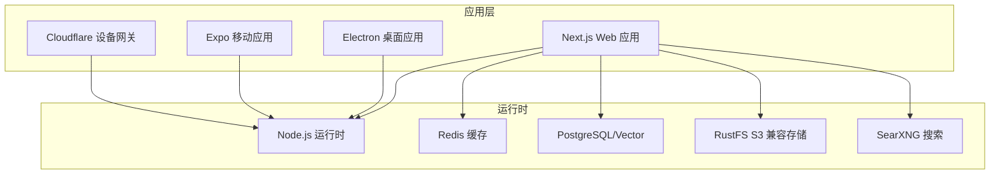
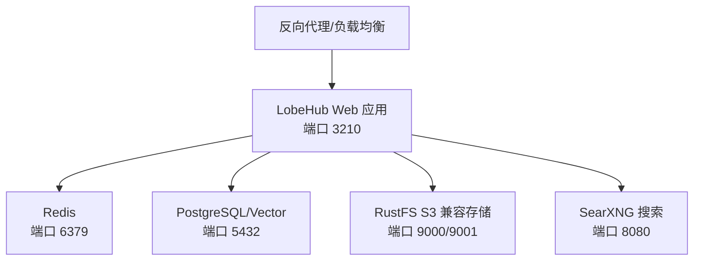
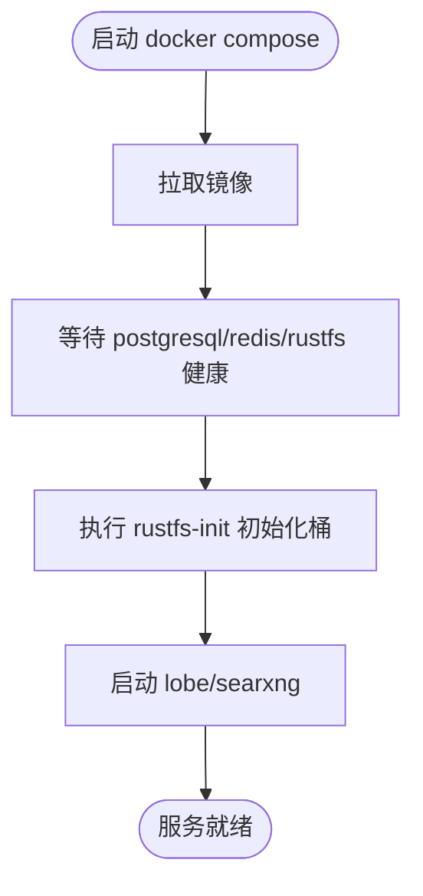
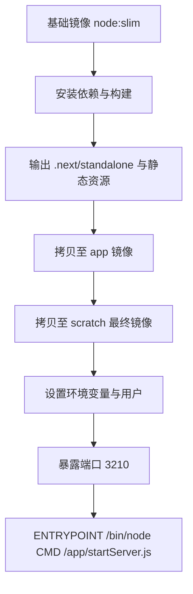
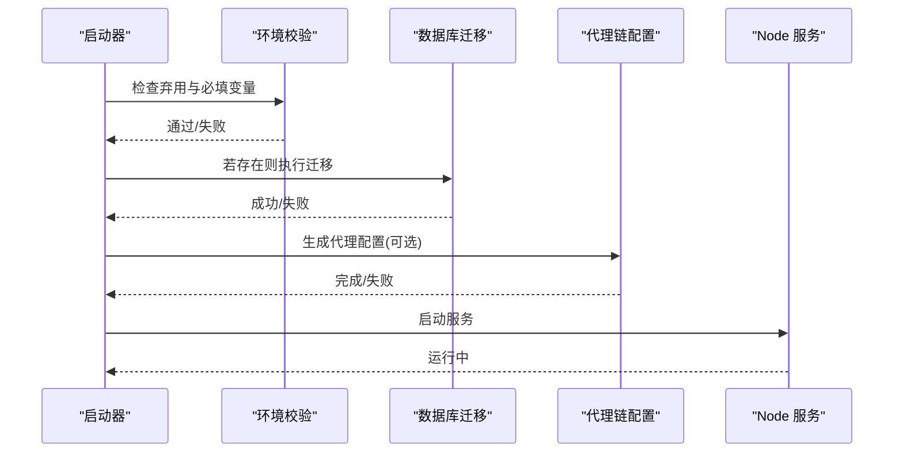
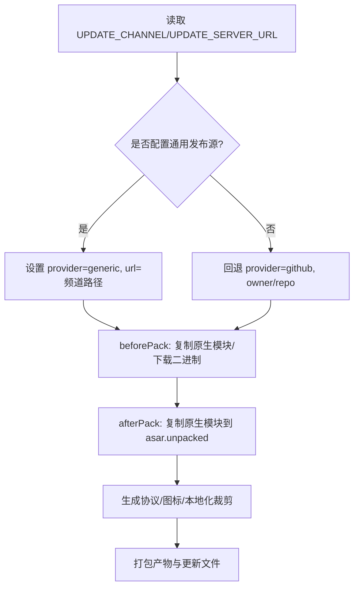
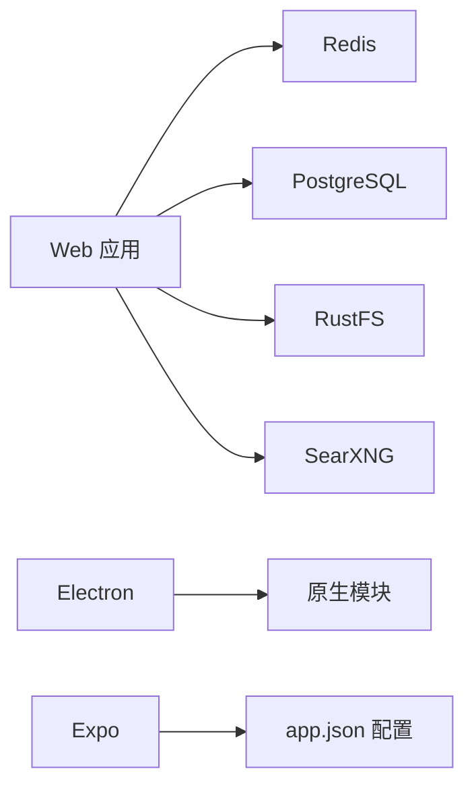

# 部署与运维

<cite>
**本文引用的文件**
- [docker-compose/deploy/docker-compose.yml](file://docker-compose/deploy/docker-compose.yml)
- [docker-compose/dev/docker-compose.yml](file://docker-compose/dev/docker-compose.yml)
- [docker-compose/setup.sh](file://docker-compose/setup.sh)
- [Dockerfile](file://Dockerfile)
- [scripts/serverLauncher/startServer.js](file://scripts/serverLauncher/startServer.js)
- [scripts/dockerPrebuild.mts](file://scripts/dockerPrebuild.mts)
- [vercel.json](file://vercel.json)
- [netlify.toml](file://netlify.toml)
- [apps/desktop/electron-builder.mjs](file://apps/desktop/electron-builder.mjs)
- [apps/desktop/native-deps.config.mjs](file://apps/desktop/native-deps.config.mjs)
- [apps/desktop/dev-app-update.yml](file://apps/desktop/dev-app-update.yml)
- [apps/mobile/app.json](file://apps/mobile/app.json)
- [package.json](file://package.json)
</cite>

## 目录

1. [简介](#简介)
2. [项目结构](#项目结构)
3. [核心组件](#核心组件)
4. [架构总览](#架构总览)
5. [详细组件分析](#详细组件分析)
6. [依赖关系分析](#依赖关系分析)
7. [性能考量](#性能考量)
8. [故障排查指南](#故障排查指南)
9. [结论](#结论)
10. [附录](#附录)

## 简介

本文件面向运维工程师与平台工程团队，系统化梳理 LobeHub 在不同环境下的部署与运维实践，覆盖云平台部署、容器化部署、自托管方案、CI/CD 与自动化发布、监控与日志、性能优化、安全加固、高可用与灾难恢复、以及桌面与移动端的打包与发布流程。目标是帮助读者快速、稳定、可审计地运行与维护系统。

## 项目结构

LobeHub 采用多应用与多工作区的组织方式，核心运行时由 Next.js 应用与若干子包组成，同时提供桌面应用（Electron）、移动端（Expo）与设备网关（Cloudflare Workers）等扩展能力。部署相关的关键资产集中在：

- 容器编排：docker-compose（生产与开发）
- 构建镜像：Dockerfile（多阶段构建，产物为独立可执行）
- 启动器：scripts/serverLauncher/startServer.js（统一入口，支持代理链）
- 平台部署：vercel.json、netlify.toml（云原生平台）
- 桌面打包：apps/desktop/electron-builder.mjs、native-deps.config.mjs
- 移动端配置：apps/mobile/app.json
- 脚本与工作流：package.json 中的脚本与 .github/workflows（CI）

图表来源

- [docker-compose/deploy/docker-compose.yml](file://docker-compose/deploy/docker-compose.yml#L1-L144)
- [docker-compose/dev/docker-compose.yml](file://docker-compose/dev/docker-compose.yml#L1-L123)
- [Dockerfile](file://Dockerfile#L1-L344)

章节来源

- [docker-compose/deploy/docker-compose.yml](file://docker-compose/deploy/docker-compose.yml#L1-L144)
- [docker-compose/dev/docker-compose.yml](file://docker-compose/dev/docker-compose.yml#L1-L123)
- [Dockerfile](file://Dockerfile#L1-L344)

## 核心组件

- 容器编排与自托管
  - 生产环境：lobehub 主应用、PostgreSQL、Redis、RustFS、SearXNG 通过 docker-compose 统一编排，支持健康检查与持久化卷。
  - 开发环境：通过 network-service 提供共享网络，简化本地联调。
- 构建与镜像
  - 多阶段 Dockerfile，产出精简镜像，内置 distroless 与独立启动器，支持代理链与数据库迁移。
- 启动器与代理
  - 统一入口脚本负责环境校验、数据库迁移、代理链配置与服务启动。
- 云平台部署
  - Vercel 与 Netlify 配置，支持重写规则与构建参数。
- 桌面与移动端
  - Electron 打包配置与原生依赖处理，Expo 应用元数据与插件配置。

章节来源

- [docker-compose/deploy/docker-compose.yml](file://docker-compose/deploy/docker-compose.yml#L1-L144)
- [docker-compose/dev/docker-compose.yml](file://docker-compose/dev/docker-compose.yml#L1-L123)
- [Dockerfile](file://Dockerfile#L1-L344)
- [scripts/serverLauncher/startServer.js](file://scripts/serverLauncher/startServer.js#L1-L210)
- [vercel.json](file://vercel.json#L1-L15)
- [netlify.toml](file://netlify.toml#L1-L10)
- [apps/desktop/electron-builder.mjs](file://apps/desktop/electron-builder.mjs#L1-L307)
- [apps/desktop/native-deps.config.mjs](file://apps/desktop/native-deps.config.mjs#L1-L260)
- [apps/mobile/app.json](file://apps/mobile/app.json#L1-L35)

## 架构总览

下图展示生产环境的典型部署拓扑：Web 应用通过反向代理对外暴露，内部依赖 Redis、PostgreSQL 与 RustFS 存储，搜索能力由 SearXNG 提供。容器编排文件定义了服务间依赖、健康检查与网络隔离。

图表来源

- [docker-compose/deploy/docker-compose.yml](file://docker-compose/deploy/docker-compose.yml#L1-L144)

章节来源

- [docker-compose/deploy/docker-compose.yml](file://docker-compose/deploy/docker-compose.yml#L1-L144)

## 详细组件分析

### 容器编排与自托管

- 服务职责
  - lobe：主应用，绑定端口 3210，依赖数据库、缓存与对象存储健康状态。
  - postgresql：数据库，持久化卷 data。
  - redis：缓存与会话，持久化卷 redis_data。
  - rustfs：S3 兼容对象存储，提供控制台与健康检查。
  - rustfs-init：初始化桶与匿名策略。
  - searxng：搜索服务，挂载配置文件。
- 网络与卷
  - 使用自定义桥接网络，数据卷本地持久化。
- 环境变量
  - 支持通过 .env 注入密钥与连接串，建议在生产环境使用密钥管理服务。

图表来源

- [docker-compose/deploy/docker-compose.yml](file://docker-compose/deploy/docker-compose.yml#L1-L144)

章节来源

- [docker-compose/deploy/docker-compose.yml](file://docker-compose/deploy/docker-compose.yml#L1-L144)
- [docker-compose/dev/docker-compose.yml](file://docker-compose/dev/docker-compose.yml#L1-L123)

### 构建与镜像（Dockerfile）

- 多阶段构建
  - 基础镜像与依赖安装、构建产物输出、最终精简镜像。
  - 使用 distroless 与独立启动器，减少攻击面。
- 运行时环境
  - 默认端口 3210，支持代理链配置与数据库迁移脚本。
- 特性开关
  - 支持 CN 镜像加速与特性标志注入。

图表来源

- [Dockerfile](file://Dockerfile#L1-L344)

章节来源

- [Dockerfile](file://Dockerfile#L1-L344)

### 启动器与代理（serverLauncher）

- 功能清单
  - 环境校验（弃用变量检查、必填项检查、打印环境信息）。
  - 数据库迁移脚本执行（按需）。
  - 代理链配置生成与启用（支持 http/socks4/socks5）。
  - 网关启动（通过本地 API 触发）。
  - 统一 Node 进程启动。
- 错误处理
  - DNS 解析失败、代理协议 / 端口非法、进程退出码非零均触发错误退出。

图表来源

- [scripts/serverLauncher/startServer.js](file://scripts/serverLauncher/startServer.js#L1-L210)
- [scripts/dockerPrebuild.mts](file://scripts/dockerPrebuild.mts#L1-L125)

章节来源

- [scripts/serverLauncher/startServer.js](file://scripts/serverLauncher/startServer.js#L1-L210)
- [scripts/dockerPrebuild.mts](file://scripts/dockerPrebuild.mts#L1-L125)

### 云平台部署（Vercel 与 Netlify）

- Vercel
  - 自定义构建命令与安装命令，重写危险代理路径。
- Netlify
  - 构建命令与 Node 内存参数，模板环境变量示例。

章节来源

- [vercel.json](file://vercel.json#L1-L15)
- [netlify.toml](file://netlify.toml#L1-L10)

### 桌面应用打包（Electron）

- 渠道与发布
  - 支持 stable/nightly/canary 渠道，优先使用通用发布源（generic），否则回退到 GitHub。
  - 更新服务器 URL 通过环境变量配置，支持动态频道拼接。
- 原生依赖处理
  - 自动解析与复制原生模块，解决 pnpm 符号链接问题，确保 asar.unpacked 包含必要二进制。
- 协议与图标
  - 根据渠道设置自定义协议 scheme；macOS 支持特定图标资源与本地化框架资源裁剪。
- 开发更新测试
  - 提供本地更新测试配置文件，便于本地验证更新逻辑。

图表来源

- [apps/desktop/electron-builder.mjs](file://apps/desktop/electron-builder.mjs#L1-L307)
- [apps/desktop/native-deps.config.mjs](file://apps/desktop/native-deps.config.mjs#L1-L260)
- [apps/desktop/dev-app-update.yml](file://apps/desktop/dev-app-update.yml#L1-L16)

章节来源

- [apps/desktop/electron-builder.mjs](file://apps/desktop/electron-builder.mjs#L1-L307)
- [apps/desktop/native-deps.config.mjs](file://apps/desktop/native-deps.config.mjs#L1-L260)
- [apps/desktop/dev-app-update.yml](file://apps/desktop/dev-app-update.yml#L1-L16)

### 移动应用发布（Expo）

- 应用元数据
  - 名称、版本、图标、启动图、平台适配（iOS/Android/Web 插件）。
- 发布流程
  - 建议结合 Expo CLI 或 EAS 进行构建与分发，此处提供配置参考。

章节来源

- [apps/mobile/app.json](file://apps/mobile/app.json#L1-L35)

## 依赖关系分析

- 组件耦合
  - Web 应用强依赖 Redis 与 PostgreSQL；对象存储与搜索服务通过环境变量配置。
  - 桌面应用与 Web 应用共享部分业务包，但打包与运行时隔离。
- 外部依赖
  - 云平台（Vercel/Netlify）、容器编排（Compose）、包管理（pnpm）。
- 循环依赖
  - 通过工作区与明确的构建顺序避免循环依赖风险。

图表来源

- [docker-compose/deploy/docker-compose.yml](file://docker-compose/deploy/docker-compose.yml#L1-L144)
- [apps/desktop/native-deps.config.mjs](file://apps/desktop/native-deps.config.mjs#L1-L260)
- [apps/mobile/app.json](file://apps/mobile/app.json#L1-L35)

章节来源

- [docker-compose/deploy/docker-compose.yml](file://docker-compose/deploy/docker-compose.yml#L1-L144)
- [apps/desktop/native-deps.config.mjs](file://apps/desktop/native-deps.config.mjs#L1-L260)
- [apps/mobile/app.json](file://apps/mobile/app.json#L1-L35)

## 性能考量

- 镜像与运行时
  - 使用 distroless 与最小化镜像，减少启动时间与攻击面。
  - 独立启动器与数据库迁移脚本分离，缩短冷启动路径。
- 缓存与存储
  - Redis 持久化与快照策略；S3 使用路径风格与 ACL 控制，降低跨域与权限复杂度。
- 搜索与网络
  - SearXNG 作为独立服务，避免与主应用耦合；代理链仅在必要时启用。
- 构建优化
  - 多阶段构建与输出追踪，减少镜像体积与启动延迟。

章节来源

- [Dockerfile](file://Dockerfile#L1-L344)
- [scripts/serverLauncher/startServer.js](file://scripts/serverLauncher/startServer.js#L1-L210)
- [docker-compose/deploy/docker-compose.yml](file://docker-compose/deploy/docker-compose.yml#L1-L144)

## 故障排查指南

- 启动失败
  - 检查弃用与必填环境变量（见启动器与预构建脚本）。
  - 查看数据库迁移脚本是否存在与执行结果。
- 代理链问题
  - 确认 PROXY_URL 协议与端口合法，DNS 解析可达。
- 容器健康检查
  - 关注 postgresql/redis/rustfs 的健康检查状态与日志。
- 日志与可观测性
  - 使用 docker compose logs 查看服务日志；SearXNG 日志可通过附加模式查看。
- 端口冲突
  - 确保 3210、9000、9001 等端口未被占用。

章节来源

- [scripts/serverLauncher/startServer.js](file://scripts/serverLauncher/startServer.js#L1-L210)
- [scripts/dockerPrebuild.mts](file://scripts/dockerPrebuild.mts#L1-L125)
- [docker-compose/setup.sh](file://docker-compose/setup.sh#L1-L773)

## 结论

通过容器化编排、多阶段构建与统一启动器，LobeHub 在保证可移植性的同时实现了稳定的生产就绪能力。配合云平台部署与桌面 / 移动端打包配置，可覆盖从开发到生产的全链路交付。建议在生产环境中强化密钥管理、启用 TLS、完善监控与备份策略，并基于本文档的步骤进行标准化部署与运维。

## 附录

### 部署脚本与命令

- 自托管一键安装
  - 使用安装脚本生成 .env、配置主机与密钥、初始化数据库。
- 容器编排
  - 生产：docker compose -f docker-compose/deploy/docker-compose.yml up -d
  - 开发：docker compose -f docker-compose/dev/docker-compose.yml up -d
- 构建镜像
  - 本地构建：pnpm run self-hosting:docker
  - 中国镜像：pnpm run self-hosting:docker-cn

章节来源

- [docker-compose/setup.sh](file://docker-compose/setup.sh#L1-L773)
- [docker-compose/deploy/docker-compose.yml](file://docker-compose/deploy/docker-compose.yml#L1-L144)
- [docker-compose/dev/docker-compose.yml](file://docker-compose/dev/docker-compose.yml#L1-L123)
- [package.json](file://package.json#L36-L123)
