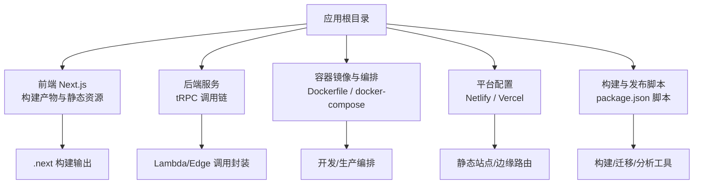
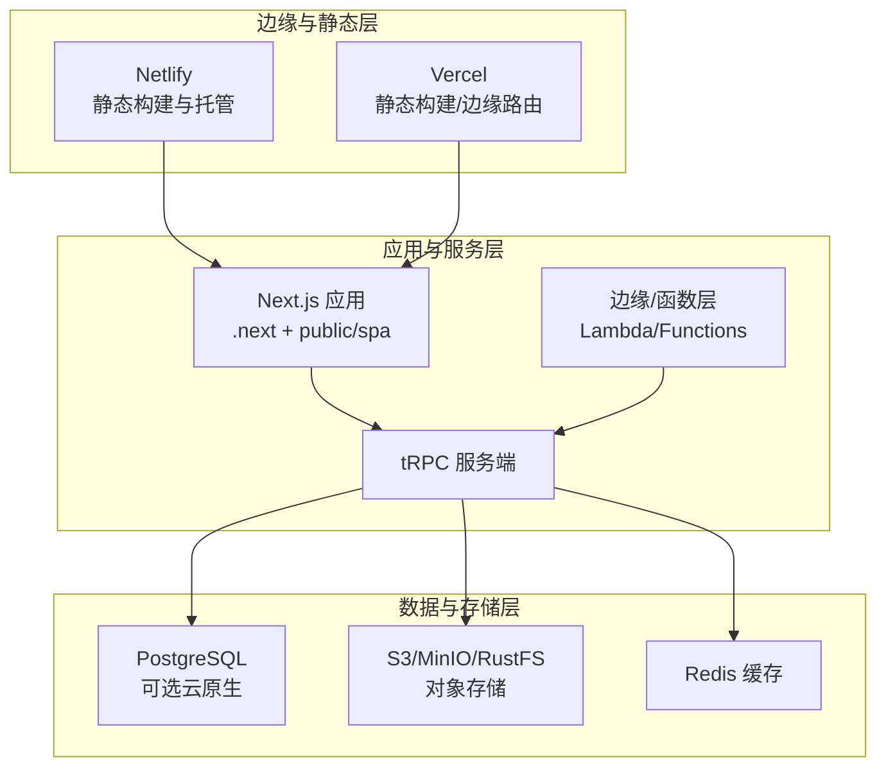
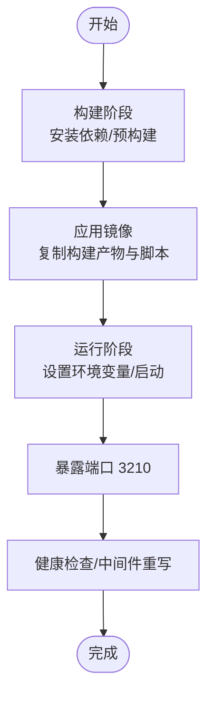
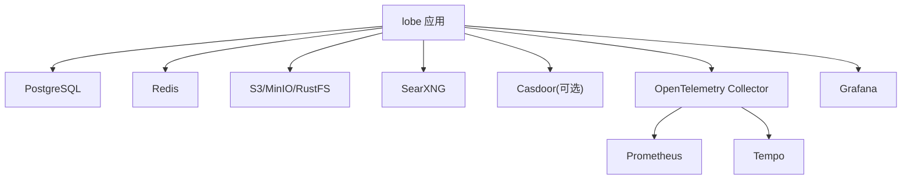
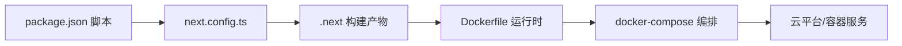

# 云平台部署方案

<cite>
**本文引用的文件**
- [netlify.toml](file://netlify.toml)
- [vercel.json](file://vercel.json)
- [Dockerfile](file://Dockerfile)
- [docker-compose/deploy/docker-compose.yml](file://docker-compose/deploy/docker-compose.yml)
- [docker-compose/production/grafana/docker-compose.yml](file://docker-compose/production/grafana/docker-compose.yml)
- [package.json](file://package.json)
- [next.config.ts](file://next.config.ts)
- [src/envs/app.ts](file://src/envs/app.ts)
- [src/libs/next/config/define-config.ts](file://src/libs/next/config/define-config.ts)
- [scripts/_shared/checkDeprecatedAuth.js](file://scripts/_shared/checkDeprecatedAuth.js)
- [src/libs/trpc/mock.ts](file://src/libs/trpc/mock.ts)
- [src/libs/trpc/client/index.ts](file://src/libs/trpc/client/index.ts)
- [docs/changelog/2024-08-02-lobe-chat-database-docker.mdx](file://docs/changelog/2024-08-02-lobe-chat-database-docker.mdx)
</cite>

## 目录
1. [简介](#简介)
2. [项目结构](#项目结构)
3. [核心组件](#核心组件)
4. [架构总览](#架构总览)
5. [详细组件分析](#详细组件分析)
6. [依赖关系分析](#依赖关系分析)
7. [性能考量](#性能考量)
8. [故障排查指南](#故障排查指南)
9. [结论](#结论)
10. [附录](#附录)

## 简介
本方案面向 LobeHub 项目在主流云平台与边缘平台的落地部署，覆盖以下场景：
- 云原生平台：AWS、Azure、Google Cloud（含容器服务与无服务器函数）
- CDN/边缘平台：Netlify、Vercel（静态资源托管、边缘计算、全球加速）
- 容器化平台：Kubernetes、Docker Swarm、云厂商原生容器服务
- 无服务器架构：AWS Lambda、Azure Functions、Google Cloud Functions
- 混合云策略：多云架构、灾备与成本优化
- 实战要点：环境变量、缓存头、构建脚本、数据库与对象存储对接

## 项目结构
LobeHub 采用 Monorepo 结构，前端基于 Next.js，后端通过 tRPC 提供服务；同时提供 Dockerfile 与多套 docker-compose 编排用于本地与生产环境部署。

图示来源
- [package.json](file://package.json#L36-L123)
- [Dockerfile](file://Dockerfile#L1-L344)
- [docker-compose/deploy/docker-compose.yml](file://docker-compose/deploy/docker-compose.yml#L1-L144)
- [docker-compose/production/grafana/docker-compose.yml](file://docker-compose/production/grafana/docker-compose.yml#L1-L251)
- [netlify.toml](file://netlify.toml#L1-L10)
- [vercel.json](file://vercel.json#L1-L15)

章节来源
- [package.json](file://package.json#L30-L123)
- [Dockerfile](file://Dockerfile#L1-L344)
- [docker-compose/deploy/docker-compose.yml](file://docker-compose/deploy/docker-compose.yml#L1-L144)
- [docker-compose/production/grafana/docker-compose.yml](file://docker-compose/production/grafana/docker-compose.yml#L1-L251)
- [netlify.toml](file://netlify.toml#L1-L10)
- [vercel.json](file://vercel.json#L1-L15)

## 核心组件
- 构建与运行时
  - Next.js 构建：SPA/Vite 与 Next 构建并行，生成 .next 与 public/spa 输出。
  - 运行时：容器内以 Node 启动，暴露 3210 端口，支持中间件重写与代理链路。
- 数据与存储
  - 数据库：PostgreSQL（支持 pgvector），可选使用云原生数据库服务。
  - 对象存储：MinIO/RustFS 兼容 S3，适配多云与自建 S3。
- 认证与会话
  - Better Auth 作为认证核心，支持多种 OAuth/SSO 提供商。
- 边缘与可观测性
  - Vercel 边缘配置与缓存头策略；OpenTelemetry 收集指标与追踪。
- 平台适配
  - Netlify/Vercel 静态部署配置；Dockerfile 多阶段构建与环境注入。

章节来源
- [package.json](file://package.json#L36-L123)
- [Dockerfile](file://Dockerfile#L140-L344)
- [docker-compose/deploy/docker-compose.yml](file://docker-compose/deploy/docker-compose.yml#L17-L34)
- [docker-compose/production/grafana/docker-compose.yml](file://docker-compose/production/grafana/docker-compose.yml#L174-L193)
- [src/envs/app.ts](file://src/envs/app.ts#L102-L127)
- [src/libs/next/config/define-config.ts](file://src/libs/next/config/define-config.ts#L107-L155)
- [next.config.ts](file://next.config.ts#L1-L27)

## 架构总览
下图展示 LobeHub 在不同平台的部署形态与数据流：

图示来源
- [netlify.toml](file://netlify.toml#L1-L10)
- [vercel.json](file://vercel.json#L1-L15)
- [Dockerfile](file://Dockerfile#L140-L344)
- [docker-compose/deploy/docker-compose.yml](file://docker-compose/deploy/docker-compose.yml#L17-L34)
- [docker-compose/production/grafana/docker-compose.yml](file://docker-compose/production/grafana/docker-compose.yml#L174-L193)

## 详细组件分析

### Netlify 部署配置
- 构建命令与发布目录：清理缓存后执行构建，并将 .next 作为发布目录。
- 环境变量：设置 Node 内存上限；模板环境预留 OPENAI_API_KEY。
- 适用场景：静态站点托管、CI/CD 自动化、边缘缓存与全球分发。

章节来源
- [netlify.toml](file://netlify.toml#L1-L10)

### Vercel 部署配置
- 构建命令：使用 bun 执行 vercel 版本的构建脚本。
- 安装命令：固定 pnpm 版本以保证一致性。
- 重写规则：对特定路径进行重写，便于本地开发代理与调试。
- 适用场景：静态资源与边缘路由、按需扩容、与 Vercel Edge Config/Analytics 集成。

章节来源
- [vercel.json](file://vercel.json#L1-L15)

### Docker 容器化部署
- 多阶段构建：基础镜像、构建阶段、应用镜像、最终运行镜像，减少体积。
- 运行参数：设置 NODE_ENV、端口、主机名、TLS 证书路径、代理链路等。
- 环境变量：覆盖数据库、认证、Redis、邮件、S3 等全部关键变量。
- 适用场景：Kubernetes、Docker Swarm、云厂商容器服务（ECS/EKS/GKE/AKS）。

图示来源
- [Dockerfile](file://Dockerfile#L29-L133)
- [Dockerfile](file://Dockerfile#L134-L344)

章节来源
- [Dockerfile](file://Dockerfile#L1-L344)

### docker-compose 开发与生产编排
- 开发编排：一键拉起应用、PostgreSQL、Redis、RustFS/SearXNG。
- 生产编排：集成 MinIO/Casdoor/Grafana/Prometheus/Tempo/OpenTelemetry Collector。
- 关键点：网络隔离、健康检查、卷持久化、环境变量注入、OIDC 校验与 S3 健康检查。

图示来源
- [docker-compose/deploy/docker-compose.yml](file://docker-compose/deploy/docker-compose.yml#L1-L144)
- [docker-compose/production/grafana/docker-compose.yml](file://docker-compose/production/grafana/docker-compose.yml#L1-L251)

章节来源
- [docker-compose/deploy/docker-compose.yml](file://docker-compose/deploy/docker-compose.yml#L1-L144)
- [docker-compose/production/grafana/docker-compose.yml](file://docker-compose/production/grafana/docker-compose.yml#L1-L251)

### Next.js 构建与缓存头策略
- 构建脚本：并行构建 SPA 与 Next，拷贝 SPA 到 public/spa，再执行 Next 构建。
- Vercel 专属优化：排除 musl 二进制与 SPA 构建产物，减小冷启动体积。
- 缓存头：针对图标与媒体资源设置长期缓存与 CDN 缓存头，提升边缘命中率。

章节来源
- [package.json](file://package.json#L36-L46)
- [next.config.ts](file://next.config.ts#L1-L27)
- [src/libs/next/config/define-config.ts](file://src/libs/next/config/define-config.ts#L107-L155)

### 认证与环境变量校验
- 认证系统：Better Auth，支持多提供商与 SSO。
- 环境变量检查：检测弃用或缺失变量，提示修复与重新部署。
- 应用配置：APP_URL、INTERNAL_APP_URL、CDN 控制、中间件重写等。

章节来源
- [src/envs/app.ts](file://src/envs/app.ts#L102-L127)
- [scripts/_shared/checkDeprecatedAuth.js](file://scripts/_shared/checkDeprecatedAuth.js#L206-L251)

### tRPC 边缘调用封装
- Lambda/Edge 封装：通过 createCallerFactory 与 lambda 路由组合，适配无服务器环境。
- 客户端导出：异步客户端、Lambda 客户端、工具类统一导出。

章节来源
- [src/libs/trpc/mock.ts](file://src/libs/trpc/mock.ts#L1-L7)
- [src/libs/trpc/client/index.ts](file://src/libs/trpc/client/index.ts#L1-L3)

## 依赖关系分析
- 构建链路
  - package.json 中定义了 build、build:spa、build:next、build:docker、build:vercel 等脚本。
  - next.config.ts 针对 Vercel 的输出追踪排除项，减少函数体积。
- 运行链路
  - Dockerfile 设置 NODE_ENV、端口、用户、入口命令，确保安全与稳定运行。
  - docker-compose 将应用与数据库、缓存、对象存储、搜索引擎解耦，便于弹性扩展。
- 平台链路
  - Netlify/Vercel 仅负责静态层，应用逻辑仍由 Next.js 与 tRPC 提供，边缘层可叠加缓存与重写。

图示来源
- [package.json](file://package.json#L36-L123)
- [next.config.ts](file://next.config.ts#L1-L27)
- [Dockerfile](file://Dockerfile#L140-L344)
- [docker-compose/deploy/docker-compose.yml](file://docker-compose/deploy/docker-compose.yml#L1-L144)

章节来源
- [package.json](file://package.json#L36-L123)
- [next.config.ts](file://next.config.ts#L1-L27)
- [Dockerfile](file://Dockerfile#L140-L344)
- [docker-compose/deploy/docker-compose.yml](file://docker-compose/deploy/docker-compose.yml#L1-L144)

## 性能考量
- 构建体积优化
  - Vercel 排除 musl 二进制与 SPA 构建产物，降低冷启动时间与带宽消耗。
  - Docker 多阶段构建与最小化运行镜像，减少镜像大小与攻击面。
- 缓存策略
  - 长期缓存图标与媒体资源，结合 CDN 缓存头，显著提升边缘命中率。
- 数据访问
  - Redis 作为缓存层，PostgreSQL 作为主存储，S3 存放大文件与附件。
- 边缘计算
  - 使用 Vercel Edge Config/Functions 与 Netlify Functions 执行轻量任务，降低主站负载。

章节来源
- [next.config.ts](file://next.config.ts#L1-L27)
- [src/libs/next/config/define-config.ts](file://src/libs/next/config/define-config.ts#L107-L155)
- [Dockerfile](file://Dockerfile#L104-L133)
- [docker-compose/deploy/docker-compose.yml](file://docker-compose/deploy/docker-compose.yml#L61-L78)

## 故障排查指南
- 认证与环境变量
  - 使用弃用变量或缺少必要变量会导致启动失败或功能异常，应根据提示更新配置并重新部署。
- OIDC 与 S3 健康检查
  - 生产编排中包含 OIDC 配置校验与 S3 健康检查，若失败请核对端点、密钥与网络连通性。
- 数据库镜像发布说明
  - 参考官方数据库 Docker 发布说明，确认镜像版本与部署文档一致性。

章节来源
- [scripts/_shared/checkDeprecatedAuth.js](file://scripts/_shared/checkDeprecatedAuth.js#L206-L251)
- [docker-compose/production/grafana/docker-compose.yml](file://docker-compose/production/grafana/docker-compose.yml#L194-L233)
- [docs/changelog/2024-08-02-lobe-chat-database-docker.mdx](file://docs/changelog/2024-08-02-lobe-chat-database-docker.mdx#L1-L32)

## 结论
LobeHub 提供了从静态到边缘再到容器与云原生的全栈部署能力。通过合理的构建优化、缓存策略与编排设计，可在 Netlify/Vercel 等平台上实现快速上线，同时在 AWS/Azure/Google Cloud 上利用容器与无服务器能力实现弹性与成本优化。建议在生产环境中结合多云与灾备策略，持续监控与迭代部署流程。

## 附录

### 平台部署最佳实践速查
- AWS
  - 容器：ECS/Fargate 或 EKS，结合 RDS/Neon/Aurora 与 S3。
  - 函数：Lambda + API Gateway，配合 tRPC Edge 封装。
- Azure
  - 容器：Container Instances/ACI 或 AKS，结合 Azure Database for PostgreSQL 与 Blob Storage。
  - 函数：Azure Functions，搭配 OpenID Connect 与 Key Vault。
- Google Cloud
  - 容器：GKE，结合 Cloud SQL 与 Cloud Storage。
  - 函数：Cloud Functions，结合 Secret Manager 与 Artifact Registry。
- Netlify/Vercel
  - 静态：使用 vercel.json/netlify.toml 的构建与重写配置。
  - 边缘：利用缓存头与边缘路由，结合 Analytics/Speed Insights。

### 环境变量清单（节选）
- 数据库：DATABASE_URL、AUTH_SECRET、KEY_VAULTS_SECRET
- 认证：AUTH_SSO_PROVIDERS、AUTH_TRUSTED_ORIGINS、各提供商 ID/Secret
- 缓存：REDIS_URL、REDIS_PREFIX、REDIS_TLS
- 对象存储：S3_ENDPOINT、S3_BUCKET、S3_ACCESS_KEY_ID、S3_SECRET_ACCESS_KEY、S3_ENABLE_PATH_STYLE、S3_SET_ACL
- 应用：APP_URL、INTERNAL_APP_URL、MIDDLEWARE_REWRITE_THROUGH_LOCAL、CDN_USE_GLOBAL

章节来源
- [Dockerfile](file://Dockerfile#L162-L212)
- [Dockerfile](file://Dockerfile#L167-L185)
- [Dockerfile](file://Dockerfile#L187-L211)
- [src/envs/app.ts](file://src/envs/app.ts#L102-L127)